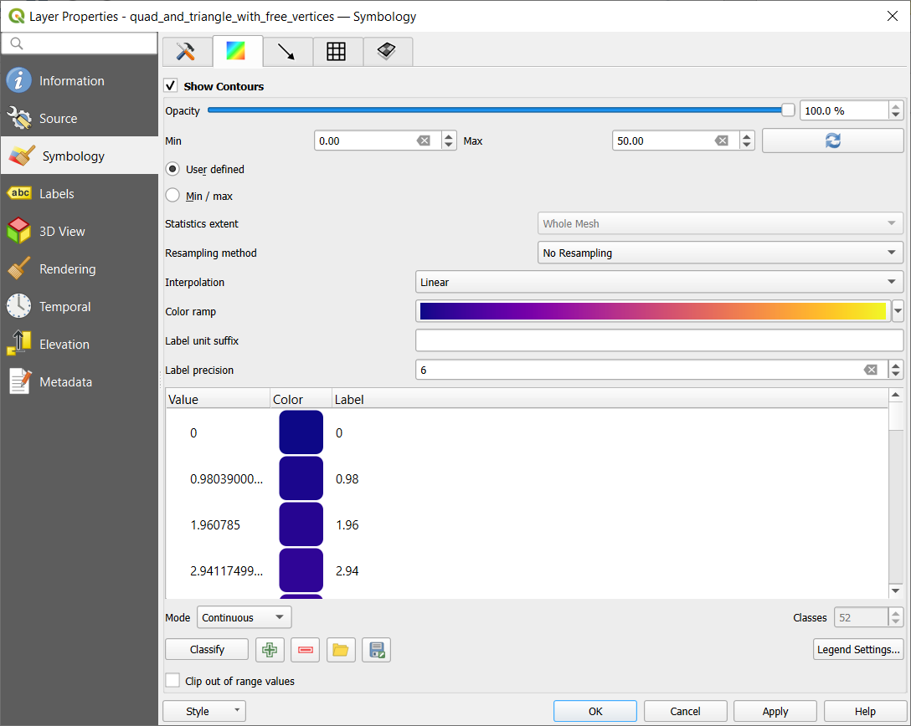

.. _`label_meshdata`:

***********************
 Working with Mesh Data
***********************

.. only:: html

   .. contents::
      :local:

What's a mesh?
==============

A mesh is an unstructured grid usually with temporal and other components.
The spatial component contains a collection of vertices, edges and faces
in 2D or 3D space:

* **vertices** - XY(Z) points (in the layer's coordinate reference system)
* **edges** - connect pairs of vertices
* **faces** - a face is a set of edges forming a closed shape - typically
  a triangle or a quadrilateral (quad), rarely polygons with more vertices

.. _figure_mesh_grid_types:

.. figure:: img/mesh_grid_types.png
   :align: center

   Different mesh types

QGIS can currently render mesh data using triangles or regular quads.

Mesh provides information about the spatial structure.
In addition, the mesh can have datasets (groups) that assign a value to every vertex.
For example, having a triangular mesh with numbered vertices as shown in the image below:

.. _figure_triangual_grid_with_numered_vertices:

.. figure:: img/triangual_grid_with_numered_vertices.png
   :align: center

   Triangular grid with numbered vertices

Each vertex can store different datasets (typically multiple quantities),
and those datasets can also have a temporal dimension. Thus, a single file may
contain multiple datasets.

The following table gives an idea about the information that can be stored in mesh datasets.
Table columns represent indices of mesh vertices, each row represents one dataset.
Datasets can have different datatypes.
In this case, it stores wind velocity at 10m at a particular moments in time
(t1, t2, t3).

In a similar way, the mesh dataset can also store vector values for each vertex.
For example, wind direction vector at the given time stamps:

=============================== ========= ========= ========= =====
10 metre wind                   1         2         3         ...
=============================== ========= ========= ========= =====
10 metre speed at time=t1       17251     24918     32858     ...
10 metre speed at time=t2       19168     23001     36418     ...
10 metre speed at time=t3       21085     30668     17251     ...
...                             ...       ...       ...       ...
10m wind direction time=t1      [20,2]    [20,3]    [20,4.5]  ...
10m wind direction time=t2      [21,3]    [21,4]    [21,5.5]  ...
10m wind direction time=t3      [22,4]    [22,5]    [22,6.5]  ...
...                             ...       ...       ...       ...
=============================== ========= ========= ========= =====

We can visualize the data by assigning colors to values (similarly to how it is
done with :ref:`Singleband pseudocolor <label_colormaptab>` raster rendering)
and interpolating data between vertices according to the mesh topology.
It is common that some quantities are 2D vectors rather than being
simple scalar values (e.g. wind direction).
For such quantities it is desirable to display arrows indicating the directions.

.. _figure_mesh_visualisation:

.. figure:: img/mesh_visualisation.png
   :align: center

   Possible visualisation of mesh data

.. _mesh_supported_formats:

Supported formats
=================

QGIS accesses mesh data using the `MDAL drivers <https://github.com/lutraconsulting/MDAL>`_.
Hence, the natively supported formats are:

* ``NetCDF``: Generic format for scientific data
* ``GRIB``: Format commonly used in meteorology
* ``XMDF``: As an example, hydraulic outputs from TUFLOW modelling package
* ``DAT``: Outputs of various hydrodynamic modelling packages (e.g. BASEMENT, HYDRO_AS-2D, TUFLOW)
* ``3Di``: 3Di modelling package format based on Climate and Forecast Conventions (http://cfconventions.org/)
* Some examples of mesh datasets can be found at https://apps.ecmwf.int/datasets/data/interim-full-daily/levtype=sfc/

To load a mesh dataset into QGIS, use the |addMeshLayer| :guilabel:`Mesh` tab
in the :guilabel:`Data Source Manager` dialog. Read :ref:`mesh_loading` for
more details.

.. _`label_meshproperties`:

Mesh Dataset Properties
=======================

.. _mesh_information:

Information Properties
----------------------

.. _figure_mesh_info_properties:

.. figure:: img/mesh_info_properties.png
   :align: center

   Mesh Layer Properties

The :guilabel:`Information` tab is read-only and represents an interesting
place to quickly grab summarized information and metadata on the current layer.
Provided information are (based on the provider of the layer) uri, vertex count,
face count and dataset groups count.

Source Properties
-----------------

The :guilabel:`Source` tab displays basic information about the selected mesh,
including:

* the Layer name to display in the :guilabel:`Layers` panel
* setting the Coordinate Reference System: Displays the layer’s
  :ref:`Coordinate Reference System (CRS) <layer_crs>`. You can change the layer’s CRS by
  selecting a recently used one in the drop-down list or clicking on |setProjection|
  :guilabel:`Select CRS` button (see :ref:`crs_selector`).
  Use this process only if the CRS applied to the layer is wrong or
  if none was applied.

Use the :guilabel:`Assign Extra Dataset to Mesh` button to add more groups
to the current mesh layer.

Symbology Properties
--------------------

Click the |symbology| :guilabel:`Symbology` button to activate the dialog
as shown in the following image:

.. _figure_mesh_symbology:

.. figure:: img/mesh_symbology.png
   :align: center

   Mesh Layer Symbology

Symbology properties are divided in several tabs:

* :ref:`General <mesh_symbology_general>`
* :ref:`Contours Symbology <mesh_symbology_contours>`
* :ref:`Vectors Symbology <mesh_symbology_vectors>`
* :ref:`Rendering <mesh_symbology_rendering>`

.. _mesh_symbology_general:

General 
.......

The tab |general| presents the following items:

* groups available in the mesh dataset
* dataset in the selected group(s), for example, if the layer has a temporal dimension
* metadata if available
* :ref:`blending mode <blend-modes>` available for the selected dataset.

The slider |slider|, the combo box |selectString| and the :guilabel:`|<`,
:guilabel:`<`, :guilabel:`>`, :guilabel:`>|` buttons
allow to explore another dimension of the data, if available.
As the slider moves, the metadata is presented accordingly.
See the figure :ref:`Mesh groups <figure_mesh_groups>` below as an example.
The map canvas will display the selected dataset group as well.

.. _figure_mesh_groups:

.. figure:: img/mesh_groups.png
   :align: center

   Dataset in Selected Group(s)

You can apply symbology to each group using the tabs.

.. _mesh_symbology_contours:

Contours Symbology
..................

Under :guilabel:`Groups`, click on |meshcontoursoff| to show contours with
default visualization parameters.

In the tab |meshcontours| you can see and change the current visualization
options of contours for the selected group, as shown in
:numref:`figure_mesh_symbology_contours` below:

.. _figure_mesh_symbology_contours:

   Styling Contours in a Mesh Layer

Use the slide bar or combo box to set the opacity of the current group.

Use :guilabel:`Load` to adjust the min and max values of the current group.

The :guilabel:`Interpolation` list contains three options to render contours:
:guilabel:`Linear`, :guilabel:`Discrete` and :guilabel:`Exact`.

The :guilabel:`Color ramp` widget opens the :ref:`color ramp drop-down shortcut <color_ramp_widget>`.

The :guilabel:`Label unit suffix` is a label added after the value in the legend.

By selecting :guilabel:`Continuous` in the classification :guilabel:`Mode`,
QGIS creates classes automatically considering the :guilabel:`Min` and
:guilabel:`Max` values. With ‘Equal interval’, you only need to select the number of classes
using the combo box :guilabel:`Classes` and press the button :guilabel:`Classify`.

The button |signPlus| :sup:`Add values manually` adds a value
to the individual color table. The button |signMinus| :sup:`Remove selected row`
deletes a value from the individual color table. Double clicking on the value column
lets you insert a specific value. Double clicking on the color column opens the dialog
:guilabel:`Change color`, where you can select a color to apply on that value.

.. _mesh_symbology_vectors:

Vectors Symbology
.................

In the tab |general|, click on |meshcontoursoff| to display vectors if available.
The map canvas will display the vectors in the selected group with default parameters.
Click on the tab |meshvectors| to change the visualization parameters for vectors
as shown in the image below:

.. _figure_mesh_symbology_vector:

.. figure:: img/mesh_symbology_vector.png
   :align: center

   Styling Vectors in a Mesh Layer

The line width can be set using the combo box or typing the value.
The color widget opens the dialog :guilabel:`Change color`,
where you can select a color to apply to vectors.

Enter values for :guilabel:`Min` and :guilabel:`Max` to filter vectors according to their magnitude.

Check on the box |checkbox| :guilabel:`Display Vectors on User Grid` and specify
the :guilabel:`X spacing` and the :guilabel:`Y spacing`,
QGIS will render the vector considering the given spacing.

With the Head Options :guilabel:`Head Options`, QGIS allows the shape of the arrow
head to be set by specifying width and length (in percentage).

Vector's :guilabel:`Arrow length` can be rendered in QGIS in three different ways:

* Defined by Min and Max: You specify the minimum and maximum length for the vectors,
  QGIS will adjust their visualization accordingly
* Scale to magnitude: You specify the (multiplying) factor to use
* Fixed: all the vectors are shown with the same length

.. _mesh_symbology_rendering:

Rendering
.........

In the tab |meshframe|,  QGIS offers two possibilities to display the grid,
as shown in :numref:`figure_mesh_symbology_grid`:

*	``Native Mesh Rendering`` that shows quadrants
*	``Triangular Mesh Rendering`` that display triangles

.. _figure_mesh_symbology_grid:

.. figure:: img/mesh_symbology_grid.png
   :align: center
   
   Mesh Rendering
   
   
The line width and color can be changed in this dialog, and both the grid renderings can be turned off.

.. Substitutions definitions - AVOID EDITING PAST THIS LINE
   This will be automatically updated by the find_set_subst.py script.
   If you need to create a new substitution manually,
   please add it also to the substitutions.txt file in the
   source folder.

.. |addMeshLayer| image:: /static/common/mActionAddMeshLayer.png
   :width: 1.5em
.. |checkbox| image:: /static/common/checkbox.png
   :width: 1.3em
.. |general| image:: /static/common/general.png
   :width: 1.5em
.. |meshcontours| image:: /static/common/meshcontours.png
   :width: 1.5em
.. |meshcontoursoff| image:: /static/common/meshcontoursoff.png
   :width: 1.5em
.. |meshframe| image:: /static/common/meshframe.png
   :width: 1.5em
.. |meshvectors| image:: /static/common/meshvectors.png
   :width: 1.5em
.. |selectString| image:: /static/common/selectstring.png
   :width: 2.5em
.. |setProjection| image:: /static/common/mActionSetProjection.png
   :width: 1.5em
.. |signMinus| image:: /static/common/symbologyRemove.png
   :width: 1.5em
.. |signPlus| image:: /static/common/symbologyAdd.png
   :width: 1.5em
.. |slider| image:: /static/common/slider.png
.. |symbology| image:: /static/common/symbology.png
   :width: 2em
