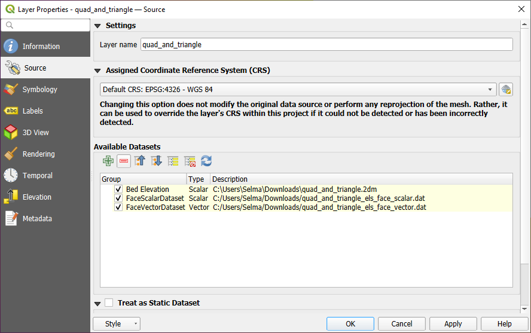

.. _`label_meshdata`:

***********************
 Working with Mesh Data
***********************

.. only:: html

   .. contents::
      :local:

What's a mesh?
==============

A mesh is an unstructured grid usually with temporal and other components.
The spatial component contains a collection of vertices, edges and/or faces,
in 2D or 3D space:

* **vertices** - XY(Z) points (in the layer's coordinate reference system)
* **edges** - connect pairs of vertices
* **faces** - a face is a set of edges forming a closed shape - typically
  a triangle or a quadrilateral (quad), rarely polygons with more vertices

Relying on the above, mesh layers can thus have different types of structure:

* 1D Meshes: consist of vertices and edges. An edge connects two vertices and
  can have assigned data (scalars or vectors) on it. The 1D mesh network can
  be for example used for modelling of an urban drainage system.
* 2D meshes: consist of faces with triangles, regular or unstructured quads.
* 3D layered meshes: consist of multiple stacked 2D unstructured meshes each
  extruded in the vertical direction (levels) by means of a vertical coordinate.
  The vertices and faces have the same topology in each vertical level.
  The mesh definition (vertical level extrusion) could in general change in time.
  The data is usually defined in volume centres or by some parametric function.

.. _figure_mesh_grid_types:

.. figure:: img/mesh_grid_types.png
   :align: center

   Different mesh types

Mesh provides information about the spatial structure.
In addition, the mesh can have datasets (groups) that assign a value to every vertex.
For example, having a triangular mesh with numbered vertices as shown in the image below:

.. _figure_triangual_grid_with_numered_vertices:

.. figure:: img/triangual_grid_with_numered_vertices.png
   :align: center

   Triangular grid with numbered vertices

Each vertex can store different datasets (typically multiple quantities),
and those datasets can also have a temporal dimension. Thus, a single file may
contain multiple datasets.

The following table gives an idea about the information that can be stored in mesh datasets.
Table columns represent indices of mesh vertices, each row represents one dataset.
Datasets can have different datatypes.
In this case, it stores wind velocity at 10m at a particular moments in time
(t1, t2, t3).

In a similar way, the mesh dataset can also store vector values for each vertex.
For example, wind direction vector at the given time stamps:

=============================== ========= ========= ========= =====
10 metre wind                   1         2         3         ...
=============================== ========= ========= ========= =====
10 metre speed at time=t1       17251     24918     32858     ...
10 metre speed at time=t2       19168     23001     36418     ...
10 metre speed at time=t3       21085     30668     17251     ...
...                             ...       ...       ...       ...
10m wind direction time=t1      [20,2]    [20,3]    [20,4.5]  ...
10m wind direction time=t2      [21,3]    [21,4]    [21,5.5]  ...
10m wind direction time=t3      [22,4]    [22,5]    [22,6.5]  ...
...                             ...       ...       ...       ...
=============================== ========= ========= ========= =====

We can visualize the data by assigning colors to values (similarly to how it is
done with :ref:`Singleband pseudocolor <label_colormaptab>` raster rendering)
and interpolating data between vertices according to the mesh topology.
It is common that some quantities are 2D vectors rather than being
simple scalar values (e.g. wind direction).
For such quantities it is desirable to display arrows indicating the directions.

.. _figure_mesh_visualisation:

.. figure:: img/mesh_visualisation.png
   :align: center

   Possible visualisation of mesh data

.. _mesh_supported_formats:

Supported formats
=================

QGIS accesses mesh data using the `MDAL drivers <https://github.com/lutraconsulting/MDAL>`_,
and natively supports a `variety of formats <https://github.com/lutraconsulting/MDAL#supported-formats>`_.
Whether QGIS can edit a mesh layer depends on the format and the mesh
structure type.

To load a mesh dataset into QGIS, use the |addMeshLayer| :guilabel:`Mesh` tab
in the :guilabel:`Data Source Manager` dialog. Read :ref:`mesh_loading` for
more details.

.. _`label_meshproperties`:

Mesh Dataset Properties
=======================

The :guilabel:`Layer Properties` dialog for a mesh layer provides general
settings to manage dataset groups of the layer and their rendering
(active dataset groups, symbology, 2D and 3D rendering).
It also provides information about the layer.

To access the :guilabel:`Layer Properties` dialog:

* In the :guilabel:`Layers` panel, double-click the layer or right-click
  and select :guilabel:`Properties...` from the pop-up menu;
* Go to :menuselection:`Layer --> Layer Properties...` menu when the layer
  is selected.

The mesh :guilabel:`Layer Properties` dialog provides the following sections:

.. list-table::

   * - |metadata| :ref:`Information <meshinformation>`
     - |system| :ref:`Source <meshsource>`
     - |symbology| :ref:`Symbology <meshsymbology>`:sup:`[1]`
   * - |3d| :ref:`3D View <mesh3dview>`:sup:`[1]`
     - |temporal| :ref:`Temporal <meshtemporal>`
     - |rendering| :ref:`Rendering <meshrendering>`
   * - |editMetadata| :ref:`Metadata <meshmetadata>`
     -
     -

:sup:`[1]` Also available in the :ref:`Layer styling panel <layer_styling_panel>`

.. note:: Most of the properties of a mesh layer can be saved to or loaded from
 a :file:`.qml` using the :guilabel:`Style` menu at the bottom of the dialog.
 More details at :ref:`manage_custom_style`.

.. _meshinformation:

Information Properties
----------------------

.. _figure_mesh_info_properties:

.. figure:: img/mesh_info_properties.png
   :align: center

   Mesh Layer Information Properties

The |metadata| :guilabel:`Information` tab is read-only and represents an interesting
place to quickly grab summarized information and metadata on the current layer.
Provided information are:

* general such as  name in the project, source path, list of auxiliary files,
  last save time and size, the used provider
* based on the provider of the layer: extent, vertex, face, edges
  and/or dataset groups count
* the Coordinate Reference System: name, units, method, accuracy, reference
  (i.e. whether it's static or dynamic)
* extracted from filled :ref:`metadata <meshmetadata>`: access, extents,
  links, contacts, history...

.. _meshsource:

Source Properties
-----------------

The |system| :guilabel:`Source` tab displays basic information about
the selected mesh, including:

.. _figure_mesh_source:

   Mesh Layer Source Properties

* the layer name to display in the :guilabel:`Layers` panel
* setting the Coordinate Reference System: Displays the layer’s
  :ref:`Assigned Coordinate Reference System (CRS) <layer_crs>`. You can change
  the layer’s CRS by selecting a recently used one in the drop-down list or
  clicking on |setProjection| :guilabel:`Select CRS` button (see :ref:`crs_selector`).
  Use this process only if the CRS applied to the layer is wrong or
  if none was applied.
* The :guilabel:`Available datasets` frame lists all the dataset groups (and
  subgroups) in the mesh layer, with their type and description in a tree view.
  Both regular datasets (i.e. their data is stored in the file) and virtual
  datasets (which are :ref:`calculated on the fly <mesh_calculator>`) are listed.

  * Use the |add| :guilabel:`Assign extra dataset to mesh` button to add more
    groups to the current mesh layer.
  * |collapseTree| :guilabel:`Collapse all` and |expandTree| :guilabel:`Expand
    all` the dataset tree, in case of embedded groups
  * If you are interested in few datasets, you can uncheck the others and
    make them unavailable in the project
  * Double-click over a name and you can rename the dataset.
  * |refresh| :guilabel:`Reset to defaults`: checks all the groups and
    renames them back to their original name in the provider.
  * Right-click over a virtual dataset group and you can:

    * :guilabel:`Remove dataset group` from the project
    * :guilabel:`Save dataset group as...` a file on disk, to any supported format.
      The new file is kept assigned to the current mesh layer in the project.
* Checking the |unchecked| :guilabel:`Treat as static dataset` group allows
  to ignore the map temporal navigation properties while rendering the mesh
  layer. For each active dataset group (as selected in |symbology|
  :menuselection:`Symbology -->` |general| :guilabel:`Datasets` tab), you can:

  .. TODO: insert map temporal navigation reference here also

  * set to :guilabel:`None`: the dataset group is not displayed at all
  * :guilabel:`Display dataset`: eg, for the "bed elevation" dataset which is
    not time aware
  * extract a particular date time: the dataset matching the provided time
    is rendered and stay fixed during map navigation.

.. _meshsymbology:

Symbology Properties
--------------------

Click the |symbology| :guilabel:`Symbology` button to activate the dialog.
Symbology properties are divided into several tabs:

* :ref:`Datasets <mesh_symbology_datasets>`
* :ref:`Contours <mesh_symbology_contours>`
* :ref:`Vectors <mesh_symbology_vectors>`
* :ref:`Rendering <mesh_symbology_rendering>`
* :ref:`Stacked mesh averaging method <mesh_stacked_averaging>`

.. _mesh_symbology_datasets:

Datasets
........

The tab |general| :sup:`Datasets` is the main place to control and set which
datasets will be used for the layer. It presents the following items:

* :guilabel:`Groups` available in the mesh dataset, with whether they provide:

  * |meshcontoursoff| scalar dataset
  * or |meshvectorsoff| vector dataset: by default, each vector dataset has
    a scalar dataset representing its magnitude automatically generated.

  Click on the icon next to the dataset name to select the group and type of
  data to represent.
* :guilabel:`Selected dataset group(s) metadata`, with details on:

  * the mesh type: edges or faces
  * the data type: vertices, edges, faces or volume
  * whether it's of vector type or not
  * the original name in the mesh layer
  * the unit, if applicable
* :ref:`blending mode <blend-modes>` available for the selected datasets.

.. _figure_mesh_symbology_datasets:

.. figure:: img/mesh_symbology_datasets.png
   :align: center

   Mesh Layer Datasets

You can apply symbology to the selected vector and/or scalar group using
the next tabs.

.. _mesh_symbology_contours:

Contours Symbology
..................

.. note:: The |meshcontours| :sup:`Contours` tab can be activated only if a
  scalar dataset has been selected in the |general| :guilabel:`Datasets` tab.

In the |meshcontours| :sup:`Contours` tab you can see and change the current
visualization options of contours for the selected group, as shown in
:numref:`figure_mesh_symbology_contours` below:

.. _figure_mesh_symbology_contours:

.. figure:: img/mesh_symbology_contours.png
   :align: center

   Styling Contours in a Mesh Layer

* For 1D mesh, set the :guilabel:`Stroke width` of the edges. This can be
  a fixed size for the whole dataset, or vary along the geometry (more details
  with the :ref:`interpolated line renderer <interpolated_line_symbol>`)
* Use the slider or the spinbox to set the :guilabel:`Opacity` of the current
  group, if of a 2D mesh type.
* Enter the range of values you want to represent on the current group:
  use |refresh| :sup:`Load` to fetch the min and max values of the current group
  or enter custom values if you want to exclude some.
* For 2D/3D meshes, select the :guilabel:`Resampling method` to interpolate the
  values on the surrounding vertices to the faces (or from the surrounding faces
  to the vertices) using the :guilabel:`Neighbour average` method. Depending on
  whether the dataset is defined on the vertices (respectively on the faces),
  QGIS defaults this setting to :guilabel:`None` (respectively :guilabel:`Neighbour average`)
  method in order to use values on vertices and keep the default rendering smooth.
* Classify the dataset using the :ref:`color ramp shader <color_ramp_shader>`
  classification.

.. _mesh_symbology_vectors:

Vectors Symbology
.................

.. note:: The |meshvectors| :sup:`Vectors` tab can be activated only if a
  vector dataset has been selected in the |general| :guilabel:`Datasets` tab.

In the |meshvectors| :sup:`Vectors` tab you can see and change the current
visualization options of vectors for the selected group, as shown in
:numref:`figure_mesh_symbology_vectors`:

.. _figure_mesh_symbology_vectors:

.. figure:: img/mesh_symbology_vectors.png
   :align: center

   Styling Vectors in a Mesh Layer with arrows

Mesh vector dataset can be styled using various types of :guilabel:`Symbology`:

* **Arrows**: vectors are represented with arrows at the same place as they are
  defined in the raw dataset (i.e. on the nodes or center of elements) or on
  a user-defined grid (hence, they are evenly distributed).
  The arrow length is proportional to the magnitude of the arrow as defined
  in the raw data but can be scaled by various methods.
* **Streamlines**: vectors are represented with streamlines seeded from start
  points. The seeding points can start from the vertices of the mesh, from
  a user grid or randomly.
* **Traces**: a nicer animation of the streamlines, the kind of effect you get
  when you randomly throws sand in the water and see where the sand items flows.

Available properties depend on the selected symbology as shown in the following table.

+----------------------------------------+-------------------------------------------------------------------------------------------+------------+-------------+------------+
| Label                                  | Description and Properties                                                                | Arrow      | Streamlines | Traces     |
+========================================+===========================================================================================+============+=============+============+
| :guilabel:`Line width`                 | Width of the vector representation                                                        | |checkbox| | |checkbox|  | |checkbox| |
+----------------------------------------+-------------------------------------------------------------------------------------------+------------+-------------+------------+
| :guilabel:`Coloring method`            | * a :guilabel:`Single color` assigned to all vectors                                      | |checkbox| | |checkbox|  | |checkbox| |
|                                        | * or a variable color based on vectors magnitude, using a                                 |            |             |            |
|                                        |   :ref:`Color ramp shader <color_ramp_shader>`                                            |            |             |            |
+----------------------------------------+-------------------------------------------------------------------------------------------+------------+-------------+------------+
| :guilabel:`Filter by magnitude`        | Only vectors whose length for the selected dataset falls between a :guilabel:`Min`        | |checkbox| | |checkbox|  |            |
|                                        | and :guilabel:`Max` range are displayed                                                   |            |             |            |
+----------------------------------------+-------------------------------------------------------------------------------------------+------------+-------------+------------+
| :guilabel:`Display on user grid`       | Places the vector on a grid with custom :guilabel:`X spacing` and :guilabel:`Y spacing`   | |checkbox| | |checkbox|  |            |
|                                        | and interpolates their length based on neighbours                                         |            |             |            |
+----------------------------------------+-------------------------------------------------------------------------------------------+------------+-------------+------------+
| :guilabel:`Head options`               | :guilabel:`Length` and :guilabel:`Width` of the arrow head, as a percentage of its shaft  | |checkbox| |             |            |
|                                        | length                                                                                    |            |             |            |
+----------------------------------------+-------------------------------------------------------------------------------------------+------------+-------------+------------+
| :guilabel:`Arrow length`               | * **Defined by Min and Max**: You specify the minimum and maximum length for the arrows,  | |checkbox| |             |            |
|                                        |   QGIS will interpolate their size based on the underlying vector's magnitude             |            |             |            |
|                                        | * **Scale to magnitude**: arrow length is proportional to their vector's magnitude        |            |             |            |
|                                        | * **Fixed**: all the vectors are shown with the same length                               |            |             |            |
+----------------------------------------+-------------------------------------------------------------------------------------------+------------+-------------+------------+
| :guilabel:`Streamlines seeding method` | * **On mesh/grid**: relies on the user grid to display the vectors                        |            | |checkbox|  |            |
|                                        | * **Randomly**: vector placement is randomly done with respect to a certain density       |            |             |            |
+----------------------------------------+-------------------------------------------------------------------------------------------+------------+-------------+------------+
| :guilabel:`Particles count`            | The amount of "sand" you want to throw into visualisation                                 |            |             | |checkbox| |
+----------------------------------------+-------------------------------------------------------------------------------------------+------------+-------------+------------+
| :guilabel:`Max tail length`            | The time until the particle fades out                                                     |            |             | |checkbox| |
+----------------------------------------+-------------------------------------------------------------------------------------------+------------+-------------+------------+

.. _mesh_symbology_rendering:

Rendering
.........

In the tab |meshframe| :sup:`Rendering` tab, QGIS offers possibilities to
display and customize the mesh structure. :guilabel:`Line width` and
:guilabel:`Line color` can be set to represent:

* the edges for 1D meshes
* For 2D meshes:

  * :guilabel:`Native mesh rendering`: shows original faces and edges from the layer
  * :guilabel:`Triangular mesh rendering`: adds more edges and displays the faces as
    triangles

.. _figure_mesh_symbology_grid:

.. figure:: img/mesh_symbology_grid.png
   :align: center

   2D Mesh Rendering

.. _mesh_stacked_averaging:

Stacked mesh averaging method
.............................

3D layered meshes consist of multiple stacked 2D unstructured meshes each
extruded in the vertical direction (``levels``) by means of a vertical
coordinate. The vertices and faces have the same topology in each vertical level.
Values are usually stored on the volumes that are regularly stacked over
base 2d mesh. In order to visualise them on 2D canvas, you need to convert
values on volumes (3d) to values on faces (2d) that can be shown in mesh layer.
The |meshaveraging| :sup:`Stacked mesh averaging method` provides different
averaging/interpolation methods to handle this.

You can select the method to derive the 2D datasets and corresponding parameters
(level index, depth or height values). For each method, an example of application
is shown in the dialog but you can read more on the methods at
https://fvwiki.tuflow.com/index.php?title=Depth_Averaging_Results.

.. index:: 3D
.. _mesh3dview:

3D View Properties
-------------------

Mesh layers can be used as :ref:`terrain in a 3D map view <scene_configuration>`
based on their vertices Z values. From the |3d| :guilabel:`3D` properties tab,
it's also possible to render the mesh layer's dataset in the same 3D view.
Therefore, the vertical component of the vertices can be set equal to dataset
values (for example, level of water surface) and the texture of the mesh can
be set to render other dataset values with color shading (for example velocity).

.. _figure_mesh_3d:

.. figure:: img/mesh_3d.png
   :align: center

   Mesh dataset 3D properties

Check |checkbox| :guilabel:`Enable 3D Renderer` and you can edit following
properties:

* Under :guilabel:`Triangle settings`

  * :guilabel:`Smooth triangles`: Angles between consecutive triangles are
    smoothed for a better 3D rendering
  * :guilabel:`Show wireframe` whose you can set the :guilabel:`Line width`
    and :guilabel:`Color`

  .. _levelofdetail:

  * :guilabel:`Level of detail`: Controls how :ref:`simplified <meshrendering>`
    the mesh layer to render should be. On the far right, it is the base mesh,
    and the more you go left, the more the layer is simplified and is rendered
    with less details.
    This option is only available if the :guilabel:`Simplify mesh` option under
    the :guilabel:`Rendering` tab is activated.
* :guilabel:`Vertical settings` to control behavior of the vertical component
   of vertices of rendered triangles

  * :guilabel:`Dataset group for vertical value`: the dataset group that will
    be used for the vertical component of the mesh
  * |unchecked|:guilabel:`Dataset value relative to vertices Z value`: whether
    to consider the dataset values as absolute Z coordinate or relative to
    the vertices native Z value
  * :guilabel:`Vertical scale`: the scale factor to apply to the dataset Z
    values
* :guilabel:`Rendering color settings` with a :guilabel:`Rendering style`
  that can be based on the color ramp shader set in :ref:`mesh_symbology_contours`
  (:guilabel:`2D contour color ramp shader`) or as a :guilabel:`Single color`
  with an associated :guilabel:`Mesh color`
* :guilabel:`Show arrows`: displays arrows on mesh layer dataset 3D entity,
  based on the same vector dataset group used in the :ref:`vector 2D rendering
  <mesh_symbology_vectors>`. They are displayed using the 2D color setting.
  It's also possible to define the :guilabel:`Arrow spacing` and, if it's of a
  :guilabel:`Fixed size` or scaled on magnitude. This spacing setting defines
  also the max size of arrows because arrows can't overlap.

.. index:: Rendering
.. _meshrendering:

Rendering Properties
--------------------

As mesh layers can have millions of faces, their rendering can sometimes
be very slow, especially when all the faces are displayed in the view
whereas they are too small to be viewed.
To speed up the rendering, you can simplify the mesh layer, resulting in one
or more meshes representing different :ref:`levels of detail <levelofdetail>`
and select at which level of detail you would like QGIS to render the mesh layer.
Note that the simplify mesh contains only triangular faces.

From the |rendering| :guilabel:`Rendering` tab, check |checkbox|
:guilabel:`Simplify mesh` and set:

* a :guilabel:`Reduction factor`: Controls generation of successive levels of
  simplified meshes.
  For example, if the base mesh has 5M faces, and the reduction factor is 10,
  the first simplified mesh will have approximately 500 000 faces,
  the second 50 000 faces, the third 5000,...
  If a higher reduction factor leads quickly to simpler meshes (i.e. with triangles
  of bigger size), it produces also fewer levels of detail.
* :guilabel:`Minimum triangle size`: the average size (in pixels)
  of the triangles that is permitted to display. If the average size of the
  mesh is lesser than this value, the rendering of a lower level of details
  mesh is triggered.

.. index:: Temporal
.. _meshtemporal:

Temporal Properties
-------------------

The |temporal| :guilabel:`Temporal` tab provides options to control
the rendering of the layer over time. It allows to dynamically display
temporal values of the enabled dataset groups. Such a dynamic rendering
requires the :ref:`temporal navigation <maptimecontrol>` to be enabled
over the map canvas.

.. _figure_mesh_temporal:

.. figure:: img/mesh_temporal.png
   :align: center

   Mesh Temporal properties

**Layer temporal settings**

* :guilabel:`Reference time` of the dataset group, as an absolute date time.
  By default, QGIS parses the source layer and returns the first valid reference
  time in the layer's dataset group. If unavailable, the value will be set by
  the project time range or fall back to the current date.
  The :guilabel:`Start time` and :guilabel:`End time` to  consider
  are then calculated based on the internal timestamp step of the dataset.

  It is possible to set a custom :guilabel:`Reference time` (and then the time
  range), and revert the changes using the |refresh| :sup:`Reload from provider`
  button.
* :guilabel:`Dataset matching method`: determines the dataset to display at the
  given time. Options are :guilabel:`Find closest dataset before requested time`
  or :guilabel:`Find closest dataset from requested time (after or before)`.

**Provider time settings**

* :guilabel:`Time unit` extracted from the raw data, or user defined.
  This can be used to align the speed of the mesh layer with other layers
  in the project during map time navigation.
  Supported units are :guilabel:`Seconds`, :guilabel:`Minutes`, :guilabel:`Hours`
  and :guilabel:`Days`.

.. index:: Metadata, Metadata editor, Keyword
.. _meshmetadata:

Metadata Properties
-------------------

The |editMetadata| :guilabel:`Metadata` tab provides you with options
to create and edit a metadata report on your layer.
See :ref:`metadatamenu` for more information.

.. _mesh_calculator:

Mesh Calculator
===============

The :guilabel:`Mesh Calculator` tool from the top :menuselection:`Mesh` menu
allows you to perform arithmetic and logical calculations on existing dataset
groups to generate a new dataset group (see :numref:`figure_mesh_calculator`).

.. _figure_mesh_calculator:

.. figure:: img/mesh_calculator.png
   :align: center

   Mesh Calculator

The :guilabel:`Datasets` list contains all dataset groups in the active mesh layer.
To use a dataset group in an expression, double click its name in
the list and it will be added to the :guilabel:`Mesh calculator expression` field.
You can then use the operators to construct calculation expressions,
or you can just type them into the box.

The :guilabel:`Result Layer` helps you configure properties of the output layer:

* |checkbox| :guilabel:`Create on-the-fly dataset group instead of writing layer
  to disk`:

  * If unchecked, the output is stored on disk as a new plain file.
    An :guilabel:`Output File` path and an :guilabel:`Output Format` are required.
  * If checked, a new dataset group will be added to the mesh layer.
    Values of the dataset group are not stored in memory but each dataset
    is calculated when needed with the formula entered in the mesh calculator.
    That virtual dataset group is saved with the project, and if needed,
    it can be removed or made persistent in file from the layer
    :guilabel:`Source` properties tab.

  In either case, you should provide a :guilabel:`Group Name` for the output
  dataset group.
* The :guilabel:`Spatial extent` to consider for calculation can be:

  * a :guilabel:`Custom extent`, manually filled with the :guilabel:`X min`,
    :guilabel:`X max`, :guilabel:`Y min` and :guilabel:`Y max` coordinate,
    or extracted from an existing dataset group (select it in the list and
    press :guilabel:`Use selected layer extent` to fill the abovementioned
    coordinate fields)
  * defined by a polygon layer (:guilabel:`Mask layer`) of the project:
    the polygon features geometry are used to clip the mesh layer datasets

* The :guilabel:`Temporal extent` to take into account for datasets can be set
  with the :guilabel:`Start time` and :guilabel:`End time` options, selected
  from the existing dataset groups timesteps. They can also be filled using the
  :guilabel:`Use all selected dataset times` button to take the whole range.

The :guilabel:`Operators` section contains all available operators. To add an operator
to the mesh calculator expression box, click the appropriate button. Mathematical
calculations (``+``, ``-``, ``*``, ... ) and statistical functions (``min``,
``max``, ``sum (aggr)``, ``average (aggr)``, ... ) are available.
Conditional expressions (``=``, ``!=``, ``<``, ``>=``, ``IF``, ``AND``, ``NOT``, ... )
return either 0 for false and 1 for true, and therefore can be used with other operators
and functions. The ``NODATA`` value can also be used in the expressions.

The :guilabel:`Mesh Calculator Expression` widget shows and lets you edit
the expression to execute.

.. Substitutions definitions - AVOID EDITING PAST THIS LINE
   This will be automatically updated by the find_set_subst.py script.
   If you need to create a new substitution manually,
   please add it also to the substitutions.txt file in the
   source folder.

.. |3d| image:: /static/common/3d.png
   :width: 1.5em
.. |add| image:: /static/common/mActionAdd.png
   :width: 1.5em
.. |addMeshLayer| image:: /static/common/mActionAddMeshLayer.png
   :width: 1.5em
.. |checkbox| image:: /static/common/checkbox.png
   :width: 1.3em
.. |collapseTree| image:: /static/common/mActionCollapseTree.png
   :width: 1.5em
.. |editMetadata| image:: /static/common/editmetadata.png
   :width: 1.2em
.. |expandTree| image:: /static/common/mActionExpandTree.png
   :width: 1.5em
.. |general| image:: /static/common/general.png
   :width: 1.5em
.. |meshaveraging| image:: /static/common/meshaveraging.png
   :width: 1.5em
.. |meshcontours| image:: /static/common/meshcontours.png
   :width: 1.5em
.. |meshcontoursoff| image:: /static/common/meshcontoursoff.png
   :width: 1.5em
.. |meshframe| image:: /static/common/meshframe.png
   :width: 1.5em
.. |meshvectors| image:: /static/common/meshvectors.png
   :width: 1.5em
.. |meshvectorsoff| image:: /static/common/meshvectorsoff.png
   :width: 1.5em
.. |metadata| image:: /static/common/metadata.png
   :width: 1.5em
.. |refresh| image:: /static/common/mActionRefresh.png
   :width: 1.5em
.. |rendering| image:: /static/common/rendering.png
   :width: 1.5em
.. |setProjection| image:: /static/common/mActionSetProjection.png
   :width: 1.5em
.. |symbology| image:: /static/common/symbology.png
   :width: 2em
.. |system| image:: /static/common/system.png
   :width: 1.5em
.. |temporal| image:: /static/common/temporal.png
   :width: 1.5em
.. |unchecked| image:: /static/common/unchecked.png
   :width: 1.3em
