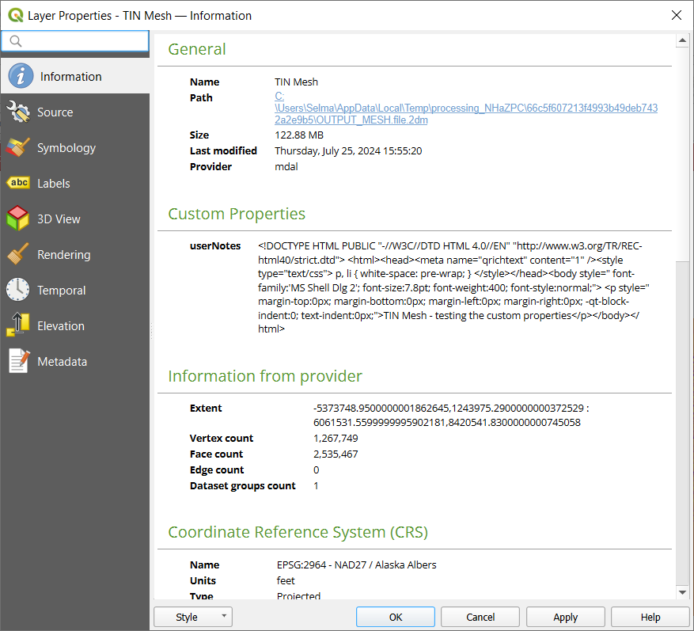

.. _`label_meshdata`:

***********************
 Working with Mesh Data
***********************

.. only:: html

   .. contents::
      :local:

What's a mesh?
==============

A mesh is an unstructured grid usually with temporal and other components.
The spatial component contains a collection of vertices, edges and faces
in 2D or 3D space:

* **vertices** - XY(Z) points (in the layer's coordinate reference system)
* **edges** - connect pairs of vertices
* **faces** - a face is a set of edges forming a closed shape - typically
  a triangle or a quadrilateral (quad), rarely polygons with more vertices

.. _figure_mesh_grid_types:

.. figure:: img/mesh_grid_types.png
   :align: center

   Different mesh types

QGIS can currently render mesh data using triangles or regular quads.

Mesh provides information about the spatial structure.
In addition, the mesh can have datasets (groups) that assign a value to every vertex.
For example, having a triangular mesh with numbered vertices as shown in the image below:

.. _figure_triangual_grid_with_numered_vertices:

.. figure:: img/triangual_grid_with_numered_vertices.png
   :align: center

   Triangular grid with numbered vertices

Each vertex can store different datasets (typically multiple quantities),
and those datasets can also have a temporal dimension. Thus, a single file may
contain multiple datasets.

The following table gives an idea about the information that can be stored in mesh datasets.
Table columns represent indices of mesh vertices, each row represents one dataset.
Datasets can have different datatypes.
In this case, it stores wind velocity at 10m at a particular moments in time
(t1, t2, t3).

In a similar way, the mesh dataset can also store vector values for each vertex.
For example, wind direction vector at the given time stamps:

=============================== ========= ========= ========= =====
10 metre wind                   1         2         3         ...
=============================== ========= ========= ========= =====
10 metre speed at time=t1       17251     24918     32858     ...
10 metre speed at time=t2       19168     23001     36418     ...
10 metre speed at time=t3       21085     30668     17251     ...
...                             ...       ...       ...       ...
10m wind direction time=t1      [20,2]    [20,3]    [20,4.5]  ...
10m wind direction time=t2      [21,3]    [21,4]    [21,5.5]  ...
10m wind direction time=t3      [22,4]    [22,5]    [22,6.5]  ...
...                             ...       ...       ...       ...
=============================== ========= ========= ========= =====

We can visualize the data by assigning colors to values (similarly to how it is
done with :ref:`Singleband pseudocolor <label_colormaptab>` raster rendering)
and interpolating data between vertices according to the mesh topology.
It is common that some quantities are 2D vectors rather than being
simple scalar values (e.g. wind direction).
For such quantities it is desirable to display arrows indicating the directions.

.. _figure_mesh_visualisation:

.. figure:: img/mesh_visualisation.png
   :align: center

   Possible visualisation of mesh data

.. _mesh_supported_formats:

Supported formats
=================

QGIS accesses mesh data using the `MDAL drivers <https://github.com/lutraconsulting/MDAL>`_.
Hence, the natively supported formats are:

* ``NetCDF``: Generic format for scientific data
* ``GRIB``: Format commonly used in meteorology
* ``XMDF``: As an example, hydraulic outputs from TUFLOW modelling package
* ``DAT``: Outputs of various hydrodynamic modelling packages (e.g. BASEMENT, HYDRO_AS-2D, TUFLOW)
* ``3Di``: 3Di modelling package format based on Climate and Forecast Conventions (http://cfconventions.org/)
* Some examples of mesh datasets can be found at https://apps.ecmwf.int/datasets/data/interim-full-daily/levtype=sfc/

To load a mesh dataset into QGIS, use the |addMeshLayer| :guilabel:`Mesh` tab
in the :guilabel:`Data Source Manager` dialog. Read :ref:`mesh_loading` for
more details.

.. _`label_meshproperties`:

Mesh Dataset Properties
=======================

.. _mesh_information:

Information Properties
----------------------

.. _figure_mesh_info_properties:

   Mesh Layer Properties

The :guilabel:`Information` tab is read-only and represents an interesting
place to quickly grab summarized information and metadata on the current layer.
Provided information are:

* based on the provider of the layer: name, path, extent, vertex, face, edges
  and/or dataset groups count
* the Coordinate Reference System: name, units, method, accuracy, reference
  (i.e. whether it's static or dynamic)
* extracted from filled :ref:`metadata <meshmetadata>`: access, extents,
  links, contacts, history...

Source Properties
-----------------

The :guilabel:`Source` tab displays basic information about the selected mesh,
including:

* the Layer name to display in the :guilabel:`Layers` panel
* setting the Coordinate Reference System: Displays the layer’s
  :ref:`Coordinate Reference System (CRS) <layer_crs>`. You can change the layer’s CRS by
  selecting a recently used one in the drop-down list or clicking on |setProjection|
  :guilabel:`Select CRS` button (see :ref:`crs_selector`).
  Use this process only if the CRS applied to the layer is wrong or
  if none was applied.

Use the :guilabel:`Assign Extra Dataset to Mesh` button to add more groups
to the current mesh layer.

Symbology Properties
--------------------

Click the |symbology| :guilabel:`Symbology` button to activate the dialog.
Symbology properties are divided into several tabs:

* :ref:`Datasets <mesh_symbology_datasets>`
* :ref:`Contours <mesh_symbology_contours>`
* :ref:`Vectors <mesh_symbology_vectors>`
* :ref:`Rendering <mesh_symbology_rendering>`
* :ref:`Stacked mesh averaging method <mesh_stacked_averaging>`

.. _mesh_symbology_datasets:

Datasets
........

The tab |general| :sup:`Datasets` is the main place to control and set which
datasets will be used for the layer. It presents the following items:

* :guilabel:`Groups` available in the mesh dataset, with whether they provide:

  * |meshcontoursoff| scalar dataset
  * or |meshvectorsoff| vector dataset: by default, each vector dataset has
    a scalar dataset representing its magnitude automatically generated.

  Click on the icon next to the dataset name to select the group and type of
  data to represent.
* :guilabel:`Selected dataset group(s) metadata`, with details on:

  * the mesh type: edges or faces
  * the data type: vertices, edges, faces or volume
  * whether it's of vector type or not
  * the original name in the mesh layer
  * the unit, if applicable
* :ref:`blending mode <blend-modes>` available for the selected datasets.

.. _figure_mesh_symbology_datasets:

.. figure:: img/mesh_symbology_datasets.png
   :align: center

   Mesh Layer Datasets

You can apply symbology to the selected vector and/or scalar group using
the next tabs.

.. _mesh_symbology_contours:

Contours Symbology
..................

.. note:: The |meshcontours| :sup:`Contours` tab can be activated only if a
  scalar dataset has been selected in the |general| :guilabel:`Datasets` tab.

In the |meshcontours| :sup:`Contours` tab you can see and change the current
visualization options of contours for the selected group, as shown in
:numref:`figure_mesh_symbology_contours` below:

.. _figure_mesh_symbology_contours:

.. figure:: img/mesh_symbology_contours.png
   :align: center

   Styling Contours in a Mesh Layer

* Use the slider or the spinbox to set the :guilabel:`Opacity` of the current
  group.
* Use |refresh| :sup:`Load` to adjust the min and max values of the current group
  or enter custom values if you want to exclude some.
* Select the :guilabel:`Resampling method`
* Classify the dataset using the :ref:`color ramp shader <color_ramp_shader>`
  classification.

.. _mesh_symbology_vectors:

Vectors Symbology
.................

.. note:: The |meshvectors| :sup:`Vectors` tab can be activated only if a
  vector dataset has been selected in the |general| :guilabel:`Datasets` tab.

In the |meshcontours| :sup:`Vectors` tab you can see and change the current
visualization options of vectors for the selected group, as shown in
:numref:`figure_mesh_symbology_vectors`:

.. _figure_mesh_symbology_vectors:

.. figure:: img/mesh_symbology_vectors.png
   :align: center

   Styling Vectors in a Mesh Layer with arrows

Mesh vector dataset can be styled using various types of :guilabel:`Symbology`:

* **Arrows**: vectors are represented with arrows at the same place as they are
  defined in the raw dataset (i.e. on the nodes or centre of elements) or on
  a user-defined grid (hence, they are evenly distributed).
  The arrow length is proportional to the magnitude of the arrow as defined
  in the raw data but can be scaled by various methods.
* **Streamlines**: vectors are represented with streamlines seeded from start
  points. The seeding points can start from the vertices of the mesh, from
  a user grid or randomly.
* **Traces**: a nicer animation of the streamlines, the kind of effect you get
  when you randomly throws sand in the water and see where the sand items flows.

Available properties depend on the selected symbology as shown in the following table.

+----------------------------------------+-------------------------------------------------------------------------------------------+------------+-------------+------------+
| Label                                  | Description and Properties                                                                | Arrow      | Streamlines | Traces     |
+========================================+===========================================================================================+============+=============+============+
| :guilabel:`Line width`                 | Width of the vector representation                                                        | |checkbox| | |checkbox|  | |checkbox| |
+----------------------------------------+-------------------------------------------------------------------------------------------+------------+-------------+------------+
| :guilabel:`Coloring method`            | * a :guilabel:`Single color` assigned to all vectors                                      | |checkbox| | |checkbox|  | |checkbox| |
|                                        | * or a variable color based on vectors magnitude, using a                                 |            |             |            |
|                                        |   :ref:`Color ramp shader <color_ramp_shader>`                                            |            |             |            |
+----------------------------------------+-------------------------------------------------------------------------------------------+------------+-------------+------------+
| :guilabel:`Filter by magnitude`        | Only vectors whose length for the selected dataset falls between a :guilabel:`Min`        | |checkbox| | |checkbox|  |            |
|                                        | and :guilabel:`Max` range are displayed                                                   |            |             |            |
+----------------------------------------+-------------------------------------------------------------------------------------------+------------+-------------+------------+
| :guilabel:`Display on user grid`       | Places the vector on a grid with custom :guilabel:`X spacing` and :guilabel:`Y spacing`   | |checkbox| | |checkbox|  |            |
|                                        | and interpolates their length based on neighbours                                         |            |             |            |
+----------------------------------------+-------------------------------------------------------------------------------------------+------------+-------------+------------+
| :guilabel:`Head options`               | :guilabel:`Length` and :guilabel:`Width` of the arrow head, as a percentage of its shaft  | |checkbox| |             |            |
|                                        | length                                                                                    |            |             |            |
+----------------------------------------+-------------------------------------------------------------------------------------------+------------+-------------+------------+
| :guilabel:`Arrow length`               | * **Defined by Min and Max**: You specify the minimum and maximum length for the arrows,  | |checkbox| |             |            |
|                                        |   QGIS will interpolate their size based on the underlying vector's magnitude             |            |             |            |
|                                        | * **Scale to magnitude**: arrow length is proportional to their vector's magnitude        |            |             |            |
|                                        | * **Fixed**: all the vectors are shown with the same length                               |            |             |            |
+----------------------------------------+-------------------------------------------------------------------------------------------+------------+-------------+------------+
| :guilabel:`Streamlines seeding method` | * **On mesh/grid**: relies on the user grid to display the vectors                        |            | |checkbox|  |            |
|                                        | * **Randomly**: vector placement is randomly done with respect to a certain density       |            |             |            |
+----------------------------------------+-------------------------------------------------------------------------------------------+------------+-------------+------------+
| :guilabel:`Particles count`            | The amount of "sand" you want to throw into visualisation                                 |            |             | |checkbox| |
+----------------------------------------+-------------------------------------------------------------------------------------------+------------+-------------+------------+
| :guilabel:`Max tail length`            | The time until the particle fades out                                                     |            |             | |checkbox| |
+----------------------------------------+-------------------------------------------------------------------------------------------+------------+-------------+------------+

.. _mesh_symbology_rendering:

Rendering
.........

In the tab |meshframe|,  QGIS offers two possibilities to display the grid,
as shown in :numref:`figure_mesh_symbology_grid`:

*	``Native Mesh Rendering`` that shows quadrants
*	``Triangular Mesh Rendering`` that display triangles

.. _figure_mesh_symbology_grid:

.. figure:: img/mesh_symbology_grid.png
   :align: center
   
   Mesh Rendering
   
   
The line width and color can be changed in this dialog, and both the grid renderings can be turned off.

.. _mesh_stacked_averaging:

Stacked mesh averaging method
.............................

3D layered meshes consist of multiple stacked 2D unstructured meshes each
extruded in the vertical direction (``levels``) by means of a vertical
coordinate. The vertices and faces have the same topology in each vertical level.
Values are usually stored on the volumes that are regularly stacked over
base 2d mesh. In order to visualise them on 2D canvas, you need to convert
values on volumes (3d) to values on faces (2d) that can be shown in mesh layer.
The |meshAveraging| :sup:`Stacked mesh averaging method` provides different
averaging/interpolation methods to handle this.

You can select the method to derive the 2D datasets and corresponding parameters
(level index, depth or height values). For each method, an example of application
is shown in the dialog but you can read more on the methods at
https://fvwiki.tuflow.com/index.php?title=Depth_Averaging_Results.

.. index:: Metadata, Metadata editor, Keyword
.. _meshmetadata:

Metadata Properties
-------------------

The |editMetadata| :guilabel:`Metadata` tab provides you with options
to create and edit a metadata report on your layer.
See :ref:`metadatamenu` for more information.

.. _mesh_calculator:

Mesh Calculator
===============

The :guilabel:`Mesh Calculator` tool from the top :menuselection:`Mesh` menu
allows you to perform arithmetic and logical calculations on existing dataset
groups to generate a new dataset group (see :numref:`figure_mesh_calculator`).

.. _figure_mesh_calculator:

.. figure:: img/mesh_calculator.png
   :align: center

   Mesh Calculator

The :guilabel:`Datasets` list contains all dataset groups in loaded mesh layers
that can be used. To use a dataset in an expression, double click its name in
the list and it will be added to the :guilabel:`Mesh calculator expression` field.
You can then use the operators to construct calculation expressions,
or you can just type them into the box.

The :guilabel:`Result Layer` helps you configure properties of the output layer:

* The :guilabel:`Output Dataset` can be:

  * :guilabel:`On file`, meaning that the output is stored on disk as a new
    plain file. An :guilabel:`Output File` path and :guilabel:`Output Format`
    are required. Currently supported formats are ``DAT``, ``Flo2D``,
    ``Selafin File`` and ``Binary DAT``.
  * or :guilabel:`Virtual`: a new dataset group is added to the mesh layer.
    Values of the dataset group are not stored in memory but each dataset
    is calculated when needed with the formula entered in the mesh calculator.
    Those virtual dataset groups are saved with the project, and if needed,
    they can be removed or made persistent in files from the layer
    :guilabel:`Source` properties tab.

* :guilabel:`Group Name`: Name of the generated dataset group
* The :guilabel:`Spatial extent` to consider for calculation can be:

  * a :guilabel:`Custom extent`, manually filled with the :guilabel:`X min`,
    :guilabel:`X max`, :guilabel:`Y min` and :guilabel:`Y max` coordinate,
    or extracted from an existing dataset group (select it in the list and
    press :guilabel:`Use selected layer extent` to fill the abovementioned
    coordinate fields)
  * defined by a polygon layer (:guilabel:`Mask layer`) of the project:
    the polygon features geometry are used to clip the mesh layer datasets

* The :guilabel:`Temporal extent` to take into account for datasets can be set
  with the :guilabel:`Start time` and :guilabel:`End time` options, selected
  from the existing dataset groups timesteps. They can also be filled using the
  :guilabel:`Use all selected dataset times` button to take the whole range.

The :guilabel:`Operators` section contains all available operators. To add an operator
to the raster calculator expression box, click the appropriate button. Mathematical
calculations (``+``, ``-``, ``*``, ... ) and statistical functions (``min``,
``max``, ``sum (aggr)``, ``average (aggr)``, ... ) are available.
Conditional expressions (``=``, ``!=``, ``<``, ``>=``, ``IF``, ``AND``, ``NOT``, ... )
return either 0 for false and 1 for true, and therefore can be used with other operators
and functions. The ``NODATA`` value can also be used in the expressions.

The :guilabel:`Mesh Calculator Expression` widget shows and lets you edit
the expression to execute.

.. Substitutions definitions - AVOID EDITING PAST THIS LINE
   This will be automatically updated by the find_set_subst.py script.
   If you need to create a new substitution manually,
   please add it also to the substitutions.txt file in the
   source folder.

.. |3d| image:: /static/common/3d.png
   :width: 1.5em
.. |add| image:: /static/common/mActionAdd.png
   :width: 1.5em
.. |addMeshLayer| image:: /static/common/mActionAddMeshLayer.png
   :width: 1.5em
.. |checkbox| image:: /static/common/checkbox.png
   :width: 1.3em
.. |collapseTree| image:: /static/common/mActionCollapseTree.png
   :width: 1.5em
.. |editMetadata| image:: /static/common/editmetadata.png
   :width: 1.2em
.. |expandTree| image:: /static/common/mActionExpandTree.png
   :width: 1.5em
.. |general| image:: /static/common/general.png
   :width: 1.5em
.. |meshaveraging| image:: /static/common/meshaveraging.png
   :width: 1.5em
.. |meshcontours| image:: /static/common/meshcontours.png
   :width: 1.5em
.. |meshcontoursoff| image:: /static/common/meshcontoursoff.png
   :width: 1.5em
.. |meshframe| image:: /static/common/meshframe.png
   :width: 1.5em
.. |meshvectors| image:: /static/common/meshvectors.png
   :width: 1.5em
.. |meshvectorsoff| image:: /static/common/meshvectorsoff.png
   :width: 1.5em
.. |refresh| image:: /static/common/mActionRefresh.png
   :width: 1.5em
.. |rendering| image:: /static/common/rendering.png
   :width: 1.5em
.. |selectString| image:: /static/common/selectstring.png
   :width: 2.5em
.. |setProjection| image:: /static/common/mActionSetProjection.png
   :width: 1.5em
.. |signMinus| image:: /static/common/symbologyRemove.png
   :width: 1.5em
.. |signPlus| image:: /static/common/symbologyAdd.png
   :width: 1.5em
.. |slider| image:: /static/common/slider.png
.. |symbology| image:: /static/common/symbology.png
   :width: 2em
.. |unchecked| image:: /static/common/checkbox_unchecked.png
   :width: 1.3em
