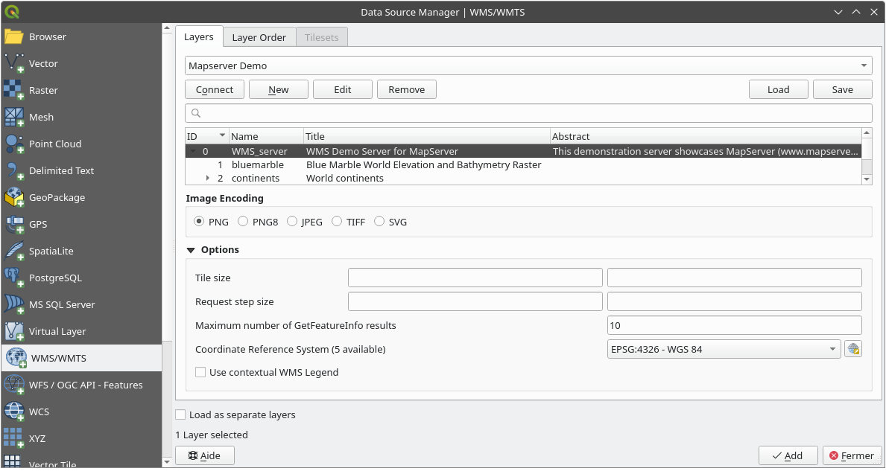

.. _working_with_ogc:

********************************
Working with OGC / ISO protocols
********************************

.. only:: html

   .. contents::
      :local:

.. index:: OGC (Open Geospatial Consortium)

The Open Geospatial Consortium (OGC) is an international organization with membership of more
than 300 commercial, governmental, nonprofit and research organizations worldwide.
Its members develop and implement standards for geospatial content and services,
GIS data processing and exchange.

Describing a basic data model for geographic features, an increasing number
of specifications are developed by OGC to serve specific needs for interoperable
location and geospatial technology, including GIS. Further information
can be found at https://www.opengeospatial.org/.

.. index:: WMS, WFS, WCS, CAT, SFS, GML

Important OGC specifications supported by QGIS are:

* **WMS** --- Web Map Service (:ref:`ogc-wms`)
* **WMTS** --- Web Map Tile Service (:ref:`ogc-wms`)
* **WFS** --- Web Feature Service (:ref:`ogc-wfs`)
* **WFS-T** --- Web Feature Service - Transactional (:ref:`ogc-wfs`)
* **WCS** --- Web Coverage Service (:ref:`ogc-wcs`)
* **WPS** --- Web Processing Service
* **CSW** --- Catalog Service for the Web
* **SFS** --- Simple Features for SQL (:ref:`label_postgis`)
* **GML** --- Geography Markup Language

OGC services are increasingly being used to exchange geospatial data between
different GIS implementations and data stores. QGIS can deal with the above
specifications as a client, being **SFS** (through support of the PostgreSQL
/ PostGIS data provider, see section :ref:`label_postgis`).

You can also share your maps and data through the WMS, WMTS, WFS, WFS-T and WCS protocols
using a webserver with :ref:`QGIS Server <QGIS-Server-manual>`, UMN MapServer or
GeoServer installed.

.. _`ogc-wms`:

WMS/WMTS Client
===============

.. index:: WMS; Client
   see: WMTS; WMS

.. _`ogc-wms-about`:

Overview of WMS Support
-----------------------

QGIS currently can act as a WMS client that understands WMS 1.1, 1.1.1
and 1.3 servers. In particular, it has been tested against publicly accessible
servers such as DEMIS.

A WMS server acts upon requests by the client (e.g., QGIS) for a raster map
with a given extent, set of layers, symbolization style, and transparency.
The WMS server then consults its local data sources, rasterizes the map,
and sends it back to the client in a raster format. For QGIS, this format would
typically be JPEG or PNG.

WMS is generically a REST (Representational State Transfer) service rather
than a full-blown Web service. As such, you can actually take the URLs
generated by QGIS and use them in a web browser to retrieve the same images
that QGIS uses internally. This can be useful for troubleshooting, as there
are several brands of WMS server on the market and they all have their
own interpretation of the WMS standard.

WMS layers can be added quite simply, as long as you know the URL to access
the WMS server, you have a serviceable connection to that server, and the
server understands HTTP as the data transport mechanism.

Additionally, QGIS will cache your WMS responses (i.e. images) for 24h as long
as the GetCapabilities request is not triggered. The GetCapabilities request is
triggered everytime the :guilabel:`Connect` button in the :guilabel:`Add Layer(s) from WMS(T) Server`
dialog is used to retrieve the WMS server capabilities. This is an automatic
feature meant to optimize project loading time. If a project is saved with a WMS layer,
the corresponding WMS tiles will be loaded from the cache the next time the project is opened
as long as they are no older than 24H.

Overview of WMTS Support
------------------------

QGIS can also act as a WMTS client. WMTS is an OGC standard for distributing
tile sets of geospatial data. This is a faster and more efficient way of
distributing data than WMS because with WMTS, the tile sets are pre-generated,
and the client only requests the transmission of the tiles, not their
production. A WMS request typically involves both the generation and
transmission of the data. A well-known example of a non-OGC standard for
viewing tiled geospatial data is Google Maps.

In order to display the data at a variety of scales close to what the user
might want, the WMTS tile sets are produced at several different scale levels
and are made available for the GIS client to request them.

This diagram illustrates the concept of tile sets:

.. _figure_wmts_tiles:

.. figure:: img/concept_wmts.png
   :align: center

   Concept of WMTS tile sets

The two types of WMTS interfaces that QGIS supports are via Key-Value-Pairs
(KVP) and RESTful. These two interfaces are different, and you need to specify
them to QGIS differently.

#. In order to access a **WMTS KVP** service, a QGIS user must open the WMS/WMTS interface
   and add the following string to the URL of the WMTS tile service:

   ::

     "?SERVICE=WMTS&REQUEST=GetCapabilities"

   An example of this type of address is

   ::

      https://opencache.statkart.no/gatekeeper/gk/gk.open_wmts?\
        service=WMTS&request=GetCapabilities

   For testing the topo2 layer in this WMTS works nicely. Adding this string indicates
   that a WMTS web service is to be used instead of a WMS service.

#. The **RESTful WMTS** service takes a different form, a straightforward URL.
   The format recommended by the OGC is:

   ::

     {WMTSBaseURL}/1.0.0/WMTSCapabilities.xml

   This format helps you to recognize that it is a RESTful address. A RESTful WMTS is
   accessed in QGIS by simply adding its address in the WMS setup in the URL field of
   the form. An example of this type of address for the case of an Austrian basemap is
   https://maps.wien.gv.at/basemap/1.0.0/WMTSCapabilities.xml.

.. note:: You can still find some old services called WMS-C. These services are quite similar
   to WMTS (i.e., same purpose but working a little bit differently). You can manage
   them the same as you do WMTS services. Just add ``?tiled=true`` at the end
   of the url. See https://wiki.osgeo.org/wiki/Tile_Map_Service_Specification for more
   information about this specification.

   When you read WMTS, you can often think WMS-C also.

.. _`ogc-wms-servers`:

Selecting WMS/WMTS Servers
--------------------------

The first time you use the WMS feature in QGIS, there are no servers defined.

You then need to create connections to the server you are targeting:

#. Go to the |wms| :guilabel:`WMS/WMTS` tab of the :guilabel:`Data Source
   Manager` dialog, either by:

   * clicking the |dataSourceManager| :sup:`Open Data Source Manager` button
     (or pressing :kbd:`Ctrl+L`) and enabling the tab
   * clicking the |addWmsLayer| :sup:`Add WMS layer` button on the
     *Manage Layers* toolbar
   * or selecting :menuselection:`Layer --> Add Layer -->` |addWmsLayer|
     :menuselection:`Add WMS/WMTS Layer...` menu
#. Press :guilabel:`New` from the :guilabel:`Layers` tab.
   The :guilabel:`Create a New WMS/WMTS Connection...` dialog appears.

   .. tip:: Right-click the |wms| :guilabel:`WMS/WMTS` entry from within the
    :ref:`Browser panel <label_browserpanel>` and select :guilabel:`New Connection...`
    also opens the :guilabel:`Create a New WMS/WMTS Connection...` dialog.

#. Then enter the parameters to connect to your desired WMS server, as listed
   below:

   .. _figure_OGC_create_wms_connection:

   .. figure:: img/add_connection_wms.png
      :align: center

      Creating a connection to a WMS server

   * :guilabel:`Name`: A name for the connection. This name will be used in
     the Server Connections drop-down box so that you can distinguish it from
     other WMS servers.
   * :guilabel:`URL`: URL of the server providing the data. This must be a
     resolvable host name -- the same format as you would use to open a telnet
     connection or ping a host, i.e. the base URL only.
     For example, you shouldn't have fragments such as ``request=GetCapabilities``
     or ``version=1.0.0`` in your URL.
   * :guilabel:`Authentication` (optional): using a :ref:`stored configuration
     <authentication_workflow>` or a basic authentication with
     :guilabel:`Username` and :guilabel:`Password`.

     .. warning::

      Entering **username** and **password** in the :guilabel:`Authentication`
      tab will keep unprotected credentials in the connection configuration.
      Those **credentials will be visible** if, for instance, you shared the
      project file with someone. Therefore, it's advisable to save your
      credentials in a *Authentication configuration* instead
      (:guilabel:`configurations` tab).
      See :ref:`authentication_index` for more details.

   * HTTP :guilabel:`Referer`
   * :guilabel:`DPI-Mode`: Available options are **all**, **off**, **QGIS**,
     **UMN** and **GeoServer**
   * |unchecked| :guilabel:`Ignore GetMap/GetTile URI reported in capabilities`:
     if checked, use given URI from the :guilabel:`URL` field above.
   * |unchecked| :guilabel:`Ignore GetFeatureInfo URI reported in capabilities`:
     if checked, use given URI from the :guilabel:`URL` field above.
   * |unchecked| :guilabel:`Ignore axis orientation (WMS 1.3/WMTS)`
   * |unchecked| :guilabel:`Ignore reported layer extents`: because the extent
     reported by raster layers may be smaller than the actual area which can
     be rendered (notably for WMS servers with symbology which takes more space
     than the data extent), check this option to avoid cropping raster layers
     to their reported extents, resulting in truncated symbols on the borders
     of these layers.
   * |unchecked| :guilabel:`Invert axis orientation`
   * |unchecked| :guilabel:`Smooth pixmap transformation`
#. Press :guilabel:`OK`

Once the new WMS server connection has been created, it will be preserved for
future QGIS sessions.

.. index:: Proxy, Proxy server

If you need to set up a proxy server to be able to receive WMS services from the
internet, you can add your proxy server in the options. Choose
:menuselection:`Settings --> Options` and click on the :guilabel:`Network` tab.
There, you can add your proxy settings and enable them by setting |checkbox|
:guilabel:`Use proxy for web access`. Make sure that you select the correct
proxy type from the :guilabel:`Proxy type` |selectString| drop-down menu.

.. _`ogc-wms-layers`:

Loading WMS/WMTS Layers
-----------------------

Once you have successfully filled in your parameters, you can use the
:guilabel:`Connect` button to retrieve the capabilities of the selected server.
This includes the image encoding, layers, layer styles and projections.
Since this is a network operation, the speed of the response depends on the
quality of your network connection to the WMS server.
While downloading data from the WMS server, the download progress is
visualized in the lower left corner of the main QGIS dialog.

Your screen should now look a bit like :numref:`figure_OGC_add_wms`,
which shows the response provided by a WMS server.

.. _figure_OGC_add_wms:

   Dialog for adding a WMS server, with filter on available layers

The upper part of the :guilabel:`Layers` tab of the dialog shows a tree
structure that can include layer groups embedding layers with their associated
image style(s) served by the server.
Each item can be identified by:

* an :guilabel:`ID`
* a :guilabel:`Name`
* a :guilabel:`Title`
* and an :guilabel:`Abstract`.

The list can be filtered using the |search| widget in the top right corner.

**Image Encoding**

The :guilabel:`Image encoding` section lists the formats that are supported
by both the client and server. Choose one depending on your image accuracy
requirements.

.. tip:: **Image Encoding**

   You will typically find that a WMS server offers you the choice of JPEG
   or PNG image encoding. JPEG is a lossy compression format, whereas PNG
   faithfully reproduces the raw raster data.

   Use JPEG if you expect the WMS data to be photographic in nature and/or
   you don't mind some loss in picture quality. This trade-off typically
   reduces by five times the data transfer requirement compared with PNG.

   Use PNG if you want precise representations of the original data and you
   don't mind the increased data transfer requirements.

**Options**

The Options area of the dialog provides means to configure the WMS requests.
You can define:

* :guilabel:`Tile size` if you want to set tile sizes (e.g., 256x256)
  to split up the WMS request into multiple requests.
* The :guilabel:`Request step size`
* The :guilabel:`Maximum number of GetFeatureInfo results` from the server

* Each WMS layer can be presented in multiple CRSs, depending on the capability of
  the WMS server. If you select a WMS from the list, a field with the default projection 
  provided by the web server appears. Press the : |setProjection| :sup:`Select CRS` widget
  to replace the default projection of the WMS with another CRS supported by the WMS server.

  A dialog similar to the one shown in :numref:`figure_projection_custom` will appear.
  The main difference with the WMS version of the dialog is that only
  those CRSs supported by the WMS server will be shown.

* Finally you can activate |checkbox| :guilabel:`Use contextual WMS Legend` if the
  WMS Server supports this feature. Then only the relevant legend for your current
  map view extent will be shown and thus will not include legend items for items
  you can't see in the current map.

At the bottom of the dialog, a :guilabel:`Layer name` text field displays the
selected item's :guilabel:`Title`. You can change the name at your will.
This name will appear in the :guilabel:`Layers` panel after you pressed the
:guilabel:`Add` button and loaded the layer(s) in QGIS.

You can select several layers at once, but only one image style per layer.
When several layers are selected, they will be combined at the WMS server
and transmitted to QGIS in one go, as a single layer.
The default name is a slash (`/`) separated list of their original title.

**Layer Order**

The :guilabel:`Layer Order` tab lists the selected layers available from the
current connected WMS server.

WMS layers rendered by a server are overlaid in the order listed in the
:guilabel:`Layers` tab, from top to bottom of the list.
If you want to change the overlay order, you can use the :guilabel:`Up`
and :guilabel:`Down` buttons of the :guilabel:`Layer Order` tab.

.. _`ogc-wms-transparency`:

**Transparency**

The :guilabel:`Global transparency` setting from the
:guilabel:`Layer Properties` is hard coded to be always on, where available.

.. _tilesets:

Tilesets
--------

.. index:: WMS tiles, WMS-C, WMTS

When using WMTS (Cached WMS) services you are able to browse through
the :guilabel:`Tilesets` tab given by the server.
Additional information like tile size, formats and supported CRS are listed in
this table.

::

  # example of WMTS service

  https://opencache.statkart.no/gatekeeper/gk/gk.open_wmts?\
    service=WMTS&request=GetCapabilities

Selecting a layer to load, it is also possible to apply an
:ref:`Interpretation method <interpretation>`, converting it into a raster layer
of single band float type, ready for styling using QGIS usual
:ref:`raster renderers <raster_rendering>`.

In combination with this feature, you can use the tile scale slider
by selecting :menuselection:`View --> Panels` ( or |kde| :menuselection:`Settings
--> Panels`), then choosing :guilabel:`Tile Scale Panel`. This gives you the
available scales from the tile server with a nice slider docked in.

.. _`ogc-wms-identify`:

Using the Identify Tool
-----------------------

.. index:: WMS; Identify

Once you have added a WMS server, and if any layer from a WMS server is queryable,
you can then use the |identify| :sup:`Identify` tool to select a pixel on
the map canvas. A query is made to the WMS server for each selection made.
The results of the query are returned in plain text. The formatting of this text
is dependent on the particular WMS server used.

.. _`ogc-wms-format-selection`:

**Format selection**

If multiple output formats are supported by the server, a combo box with supported
formats is automatically added to the identify results dialog and the selected
format may be stored in the project for the layer.

.. _`ogc-wms-gml-format-support`:

**GML format support**

The |identify| :sup:`Identify` tool supports WMS server response
(GetFeatureInfo) in GML format (it is called Feature in the QGIS GUI in this context).
If "Feature" format is supported by the server and selected, results of the Identify
tool are vector features, as from a regular vector layer. When a single feature
is selected in the tree, it is highlighted in the map and it can be copied to
the clipboard and pasted to another vector layer. See the example setup of the
UMN Mapserver below to support GetFeatureInfo in GML format.

::

  # in layer METADATA add which fields should be included and define geometry (example):

  "gml_include_items"   "all"
  "ows_geometries"      "mygeom"
  "ows_mygeom_type"     "polygon"

  # Then there are two possibilities/formats available, see a) and b):

  # a) basic (output is generated by Mapserver and does not contain XSD)
  # in WEB METADATA define formats (example):
  "wms_getfeatureinfo_formatlist" "application/vnd.ogc.gml,text/html"

  # b) using OGR (output is generated by OGR, it is send as multipart and contains XSD)
  # in MAP define OUTPUTFORMAT (example):
  OUTPUTFORMAT
      NAME "OGRGML"
      MIMETYPE "ogr/gml"
      DRIVER "OGR/GML"
      FORMATOPTION "FORM=multipart"
  END

  # in WEB METADATA define formats (example):
  "wms_getfeatureinfo_formatlist" "OGRGML,text/html"

.. _`ogc-wms-properties`:

**Viewing Properties**

.. index::
   single: WMS; Properties

Once you have added a WMS server, you can view its properties by right-clicking
on it in the legend and selecting :menuselection:`Properties`.

.. _`ogc-wms-properties-metadata`:

**Metadata Tab**

.. index::
   pair: WMS; Metadata

The tab :guilabel:`Metadata` displays a wealth of information about the WMS
server, generally collected from the capabilities statement returned from
that server. Many definitions can be gleaned by reading the WMS standards (see
OPEN-GEOSPATIAL-CONSORTIUM in :ref:`literature_and_web`), but here are a few handy
definitions:

* **Server Properties**

  - **WMS Version** --- The WMS version supported by the server.
  - **Image Formats** --- The list of MIME-types the server can respond with
    when drawing the map. QGIS supports whatever formats the underlying Qt
    libraries were built with, which is typically at least ``image/png`` and
    ``image/jpeg``.
  - **Identity Formats** --- The list of MIME-types the server can respond
    with when you use the Identify tool. Currently, QGIS supports the
    ``text-plain`` type.

* **Layer Properties**

  - **Selected** --- Whether or not this layer was selected when its server was
    added to this project.
  - **Visible** --- Whether or not this layer is selected as visible in the
    legend (not yet used in this version of QGIS).
  - **Can Identify** --- Whether or not this layer will return any results
    when the Identify tool is used on it.
  - **Can be Transparent** --- Whether or not this layer can be rendered with
    transparency. This version of QGIS will always use transparency if this is
    ``Yes`` and the image encoding supports transparency.
  - **Can Zoom In** --- Whether or not this layer can be zoomed in by the server.
    This version of QGIS assumes all WMS layers have this set to ``Yes``.
    Deficient layers may be rendered strangely.
  - **Cascade Count** --- WMS servers can act as a proxy to other WMS servers to
    get the raster data for a layer. This entry shows how many times the request
    for this layer is forwarded to peer WMS servers for a result.
  - **Fixed Width, Fixed Height** --- Whether or not this layer has fixed source
    pixel dimensions. This version of QGIS assumes all WMS layers have this set
    to nothing. Deficient layers may be rendered strangely.
  - **WGS 84 Bounding Box** --- The bounding box of the layer, in WGS 84
    coordinates. Some WMS servers do not set this correctly (e.g., UTM coordinates
    are used instead). If this is the case, then the initial view of this layer
    may be rendered with a very 'zoomed-out' appearance by QGIS. The WMS webmaster
    should be informed of this error, which they may know as the WMS XML elements
    ``LatLonBoundingBox``, ``EX_GeographicBoundingBox`` or the CRS:84 ``BoundingBox``.
  - **Available in CRS** --- The projections that this layer can be rendered
    in by the WMS server. These are listed in the WMS-native format.
  - **Available in style** --- The image styles that this layer can be rendered
    in by the WMS server.

.. _`ogc-wms-legend`:

Show WMS legend graphic in table of contents and layout
---------------------------------------------------------

The QGIS WMS data provider is able to display a legend graphic in the table of
contents' layer list and in the print layout. The WMS legend will be shown only
if the WMS server has GetLegendGraphic capability and the layer has
getCapability url specified, so you additionally have to select a styling for the
layer.

If a legendGraphic is available, it is shown below the layer. It is little and
you have to click on it to open it in real dimension (due to QgsLegendInterface
architectural limitation). Clicking on the layer's legend will open a frame with
the legend at full resolution.

In the print layout, the legend will be integrated at it's original (downloaded)
dimension. Resolution of the legend graphic can be set in the item properties
under :menuselection:`Legend --> WMS LegendGraphic` to match your printing
requirements.

The legend will display contextual information based on your current scale. The
WMS legend will be shown only if the WMS server has GetLegendGraphic capability
and the layer has getCapability url specified, so you have to select a styling.

.. _`ogc-wms-limits`:

WMS Client Limitations
----------------------

Not all possible WMS client functionality had been included in this version
of QGIS. Some of the more noteworthy exceptions follow.

**Editing WMS Layer Settings**

Once you've completed the |addWmsLayer| :sup:`Add WMS layer` procedure,
there is no way to change the settings. A work-around is to delete the layer
completely and start again.

**WMS Servers Requiring Authentication**

Currently, publicly accessible and secured WMS services are supported. The secured
WMS servers can be accessed by public authentication. You can add the (optional)
credentials when you add a WMS server. See section :ref:`ogc-wms-servers` for
details.

.. index:: InteProxy, Secured OGC Authentication

.. tip:: **Accessing secured OGC-layers**

   If you need to access secured layers with secured methods other than basic
   authentication, you can use InteProxy as a transparent proxy, which does
   support several authentication methods. More information can be found in the
   InteProxy manual at https://inteproxy.wald.intevation.org.

.. index:: Mapserver

.. tip:: **QGIS WMS Mapserver**

   Since Version 1.7.0, QGIS has its own implementation of a WMS 1.3.0 Mapserver.
   Read more about this in :ref:`QGIS-Server-manual`.

.. _`ogc-wcs`:

WCS Client
==========

.. index:: WCS (Web Coverage Service)

|wcs| A Web Coverage Service (WCS) provides access to raster data in forms that are useful
for client-side rendering, as input into scientific models, and for other clients.
The WCS may be compared to the WFS and the WMS. As WMS and WFS service instances, a
WCS allows clients to choose portions of a server's information holdings based on
spatial constraints and other query criteria.

QGIS has a native WCS provider and supports both version 1.0 and 1.1 (which are significantly
different), but currently it prefers 1.0, because 1.1 has many issues (i.e., each server implements it
in a different way with various particularities).

The native WCS provider handles all network requests and uses all standard QGIS
network settings (especially proxy). It is also possible to select cache mode
('always cache', 'prefer cache', 'prefer network', 'always network'), and the provider also
supports selection of time position, if temporal domain is offered by the server.

.. warning::

   Entering **username** and **password** in the :guilabel:`Authentication` tab
   will keep unprotected credentials in the connection configuration. Those
   **credentials will be visible** if, for instance, you shared the project file
   with someone. Therefore, it's advisable to save your credentials in a
   *Authentication configuration* instead (:guilabel:`configurations` tab).
   See :ref:`authentication_index` for more details.

.. _`ogc-wfs`:

WFS and WFS-T Client
====================

.. index:: WFS, WFS-T (WFS Transactional)

In QGIS, a WFS layer behaves pretty much like any other vector layer.
You can identify and select features, and view the attribute table.
QGIS supports WFS 1.0.0, 1.1.0, 2.0 and OGC API - Features (OAPIF),
including editing (through WFS-T).

In general, adding a WFS layer is very similar to the procedure used with WMS.
There are no default servers defined, so you have to add your own.
You can find WFS servers by using the :ref:`MetaSearch plugin <metasearch>`
or your favourite web search engine.
There are a number of lists with public URLs, some of them maintained
and some not.

**Loading a WFS Layer**

As an example, we use the Gateway Geomatics WFS server and display a layer.
https://demo.gatewaygeomatics.com/cgi-bin/wfs_gateway?REQUEST=GetCapabilities&VERSION=1.0.0&SERVICE=WFS

To be able to load a WFS Layer, first create a connection to the WFS server:

#. Open the :guilabel:`Data Source Manager` dialog by pressing the
   |dataSourceManager| :sup:`Open Data Source Manager` button
#. Enable the |addWfsLayer| :guilabel:`WFS/OGC API-Features` tab
#. Click on :guilabel:`New...` to open the :guilabel:`Create a New WFS
   Connection` dialog
#. Enter ``Gateway Geomatics`` as name
#. Enter the URL (see above)

   .. _figure_OGC_create_wfs_connection:

   .. figure:: img/add_connection_wfs.png
      :align: center
   
      Creating a connection to a WFS server

   .. note:: In case of an OGC API - Features (OAPIF), the URL to provide should
     be the :ref:`landing page <oapif_endpoints>`, ie the main page from which
     it is possible to navigate to all the available service endpoints.

#. In the WFS settings dialog, you can:

   * Indicate the WFS version of the server. If unknown, press the
     :guilabel:`Detect` button to automatically retrieve it.
   * Define the :guilabel:`maximum number of features` retrieved in a single
     GetFetFeature request. If empty, no limit is set.
   * :guilabel:`Invert axis orientation`.
   * And depending on the WFS version:

     * Force to :guilabel:`Ignore axis orientation (WFS 1.1/WFS 2.0)`
     * :guilabel:`Enable feature paging` and specify the maximum number of features
       to retrieve with :guilabel:`Page size`. If no limit is defined, then the
       server default is applied.

   .. warning::

    Entering **username** and **password** in the :guilabel:`Authentication`
    tab will keep unprotected credentials in the connection configuration.
    Those **credentials will be visible** if, for instance, you shared the
    project file with someone. Therefore, it's advisable to save your
    credentials in an *Authentication configuration* instead
    (:guilabel:`Configurations` tab). See :ref:`authentication_index` for
    more details.

#. Press :guilabel:`OK` to create the connection.

Note that any proxy settings you may have set in your preferences are also recognized.

Now we are ready to load WFS layers from the above connection.
   
#. Choose 'Gateway Geomatics' from the :guilabel:`Server Connections`
   |selectString| drop-down list.
#. Click :guilabel:`Connect`
#. Select the :guilabel:`Parks` layer in the list
#. You can also choose whether to:

   * |unchecked| :guilabel:`Use title for layer name`, showing the layer's
     title as defined on the server in the :guilabel:`Layers` panel instead of
     its :guilabel:`Name`
   * |checkbox| :guilabel:`Only request features overlapping the view extent`
   * |unchecked| :guilabel:`Change` the layer's CRS
   * or :guilabel:`Build query` to specify particular features to retrieve,
     by either using the corresponding button or double-clicking the target
     layer.
   
#. Click :guilabel:`Add` to add the layer to the map.

.. _figure_OGC_add_wfs:

.. figure:: img/connection_wfs.png
   :align: center

   Adding a WFS layer

You'll notice the download progress is visualized in the lower left of the QGIS
main window. Once the layer is loaded, you can identify and select a couple of
features and view the attribute table.

.. note::

  QGIS supports different versions of the WFS protocol, with background
  download and progressive rendering, on-disk caching of downloaded features
  and version autodetection.

.. Substitutions definitions - AVOID EDITING PAST THIS LINE
   This will be automatically updated by the find_set_subst.py script.
   If you need to create a new substitution manually,
   please add it also to the substitutions.txt file in the
   source folder.

.. |addWfsLayer| image:: /static/common/mActionAddWfsLayer.png
   :width: 1.5em
.. |addWmsLayer| image:: /static/common/mActionAddWmsLayer.png
   :width: 1.5em
.. |checkbox| image:: /static/common/checkbox.png
   :width: 1.3em
.. |dataSourceManager| image:: /static/common/mActionDataSourceManager.png
   :width: 1.5em
.. |identify| image:: /static/common/mActionIdentify.png
   :width: 1.5em
.. |kde| image:: /static/common/kde.png
   :width: 1.5em
.. |search| image:: /static/common/search.png
   :width: 1.5em
.. |selectString| image:: /static/common/selectstring.png
   :width: 2.5em
.. |setProjection| image:: /static/common/mActionSetProjection.png
   :width: 1.5em
.. |unchecked| image:: /static/common/unchecked.png
   :width: 1.3em
.. |wcs| image:: /static/common/mIconWcs.png
   :width: 1.5em
.. |wms| image:: /static/common/mIconWms.png
   :width: 1.5em
