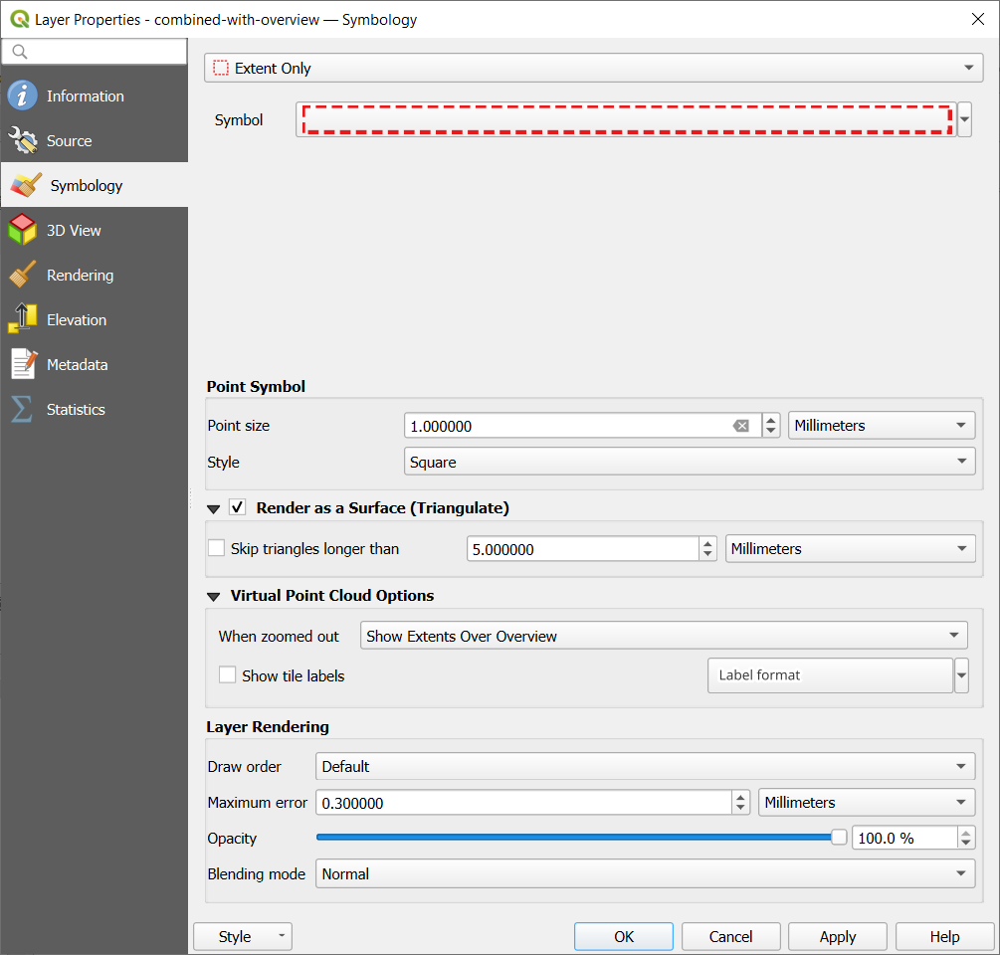
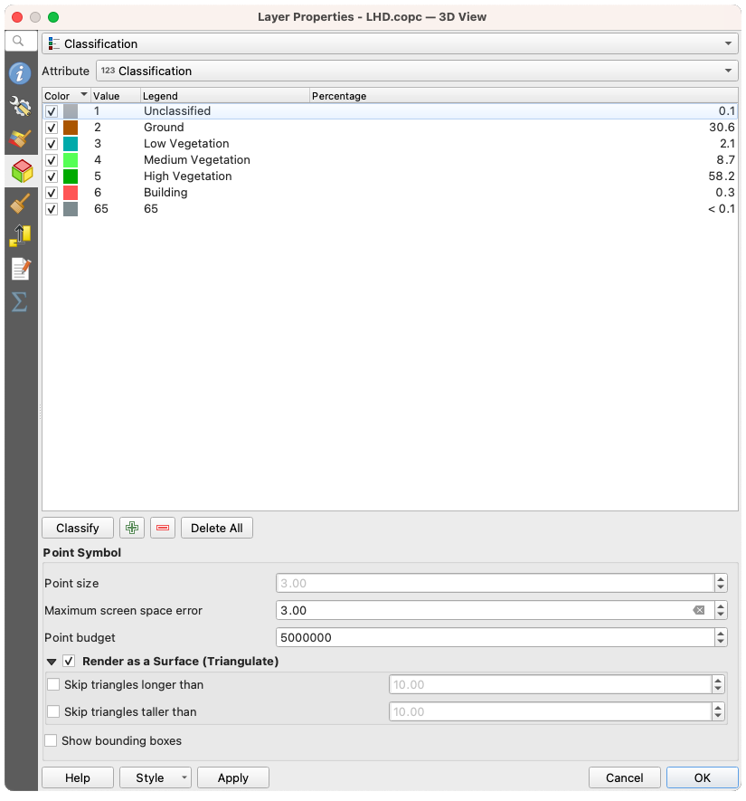
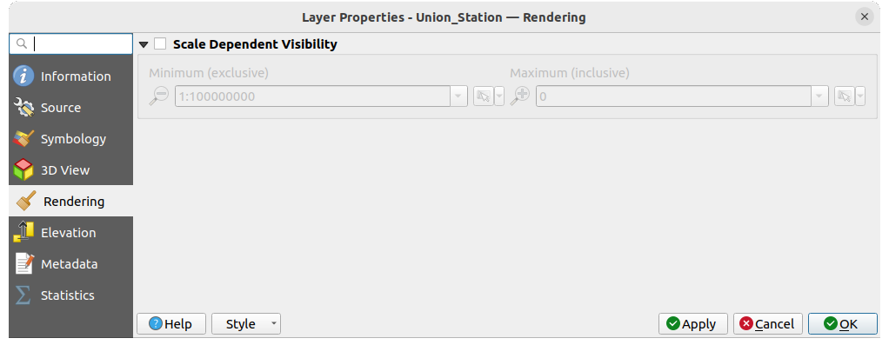
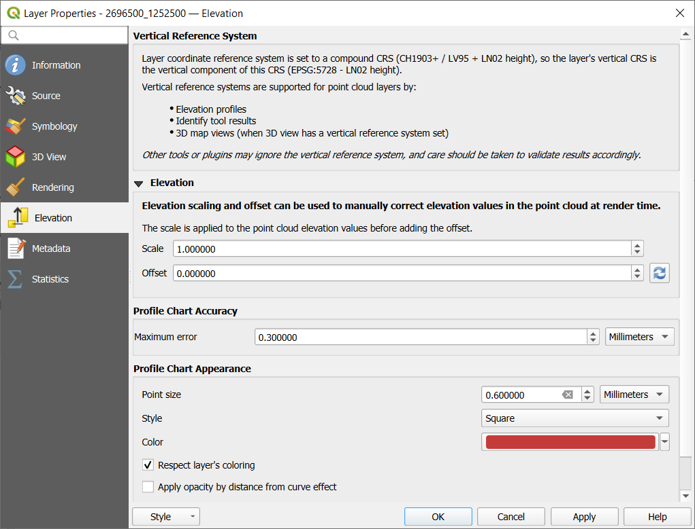
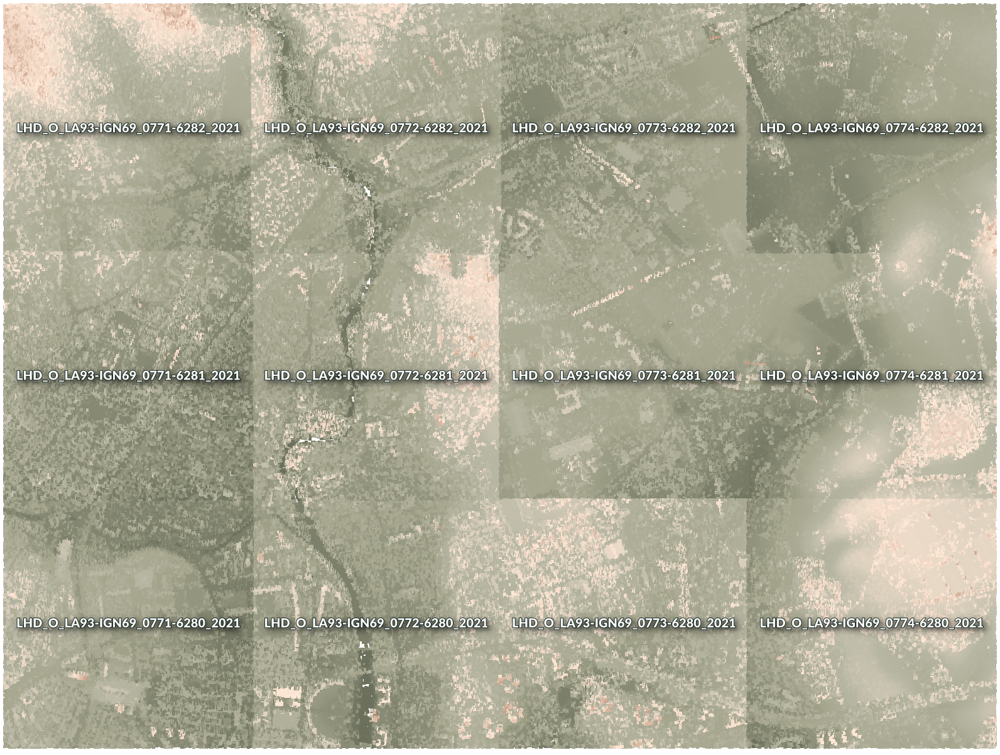

.. index:: Point cloud
.. _working_with_point_clouds:

**************************
Working with Point Clouds
**************************

.. only:: html

   .. contents::
      :local:

.. _point_clouds_introduction:

Introduction to Point Clouds
============================

**What is A Point Cloud?**

A point cloud is a three-dimensional image of a space made up of many
individual of data points (up to billions, even trillions). Each of the
points has an x, y and z coordinate. Depending on the capture method, point
clouds usually also have additional attributes that came from the capture,
such as color values or intensity. These attributes can be used, for
instance, to display point clouds in different colors. In QGIS, a point
cloud can be used to generate a three-dimensional image of the landscape
(or of another space).

**Supported Formats**

QGIS supports the data formats Entwine Point Tile (EPT) and LAS/LAZ. To
work with point clouds, QGIS always saves the data in EPT. EPT is a storage
format that consists of several files stored in a common folder. To allow
quick access to the data, EPT uses indexing. For more information on the EPT
format, see `entwine homepage <https://entwine.io/entwine-point-tile.html>`_

If the data is in LAS or LAZ format, QGIS will convert it to EPT when it is
loaded for the first time. Depending on the size of the file, this may take
some time. In this process, a subfolder is created in the folder in which
the LAS/LAZ file is located according to the scheme
:file:`ept_` + :file:`name_LAS/LAZ_file`. If such a subfolder already exists,
QGIS loads the EPT immediately (which leads to a reduced loading time).

**Worth Knowing**

In QGIS it is not (yet) possible to edit point clouds. If you want to manipulate
your point cloud, you can use `CloudCompare <https://www.cloudcompare.org/>`_,
an open source point cloud processing tool. Also the
`Point Data Abstraction Library <https://pdal.io/en/stable/>`_ (PDAL - similar to GDAL)
offers you options to edit point clouds (PDAL is command line only).

Due to the large number of data points, it is not possible to display an
attribute table of point clouds in QGIS. However, the |identify|
:ref:`Identify tool <identify>` supports point clouds, so you can display all
attributes, even of a single data point.

.. _`point_clouds_properties`:

Point Clouds Properties
=======================
The :guilabel:`Layer Properties` dialog for a point cloud layer offers
general settings for the layer and its rendering. It also provides
information about the layer.

To access the :guilabel:`Layer Properties` dialog:

* In the :guilabel:`Layers` panel, double-click the layer or right-click
  and select :guilabel:`Properties...` from the context menu;
* Go to :menuselection:`Layer --> Layer Properties...` menu when the layer
  is selected.

The point cloud :guilabel:`Layer Properties` dialog provides the
following sections:

.. list-table::

   * - |metadata| :ref:`Information <point_clouds_information>`
     - |system| :ref:`Source <point_clouds_source>`
     - |symbology| :ref:`Symbology <point_clouds_symbology>`:sup:`[1]`
   * - |3d| :ref:`3D View <point_clouds_3d>`:sup:`[1]`
     - |rendering| :ref:`Rendering <point_clouds_rendering>`
     - |elevationscale| :ref:`Elevation <point_clouds_elevation>`:sup:`[1]`
   * - |editMetadata| :ref:`Metadata <point_clouds_metadata>`
     - |basicStatistics| :ref:`Statistics <point_clouds_statistics>`
     -

:sup:`[1]` Also available in the :ref:`Layer styling panel <layer_styling_panel>`

.. note:: Most of the properties of a point cloud layer can be saved
  to or loaded from a :file:`.qml` file using the :guilabel:`Style` menu
  at the bottom of the properties dialog. More details
  at :ref:`save_layer_property`

.. _point_clouds_information:

Information Properties
----------------------

The |metadata| :guilabel:`Information` tab is read-only and represents an
interesting place to quickly grab summarized information and metadata on
the current layer. Provided information are:

* General such as name in the project, source path, last save time and size,
  the used provider
* Based on the provider of the layer: extent and number of points
* The Coordinate Reference System: name, units, method, accuracy, reference
  (i.e. whether it's static or dynamic)
* Metadata delivered by the provider: creation date, version, data format,
  scale X/Y/Z, ...
* Picked from the |editMetadata| :ref:`Metadata <point_clouds_metadata>` tab
  (where they can be edited): access, extents, links, contacts, history...

.. _figure_point_cloud_information:

.. figure:: img/point_cloud_information.png
   :align: center

   Point cloud information tab

.. _point_clouds_source:

Source Properties
-----------------

In the |system| :guilabel:`Source` tab you can see and edit basic
information about the point cloud layer:  

.. _figure_point_cloud_source:

.. figure:: img/point_cloud_source.png
   :align: center

   Point cloud source tab

* :guilabel:`Settings`: Set a Layer name different from the layer
  filename that will be used to identify the layer in the project
  (in the Layers Panel, with expressions, in print layout legend,...)
* :guilabel:`Assigned Coordinate Reference System (CRS)`: Here you
  can change the layer's assigned
  :ref:`Coordinate Reference System <layer_crs>`, selecting a
  recently used one in the drop-down list or clicking on |setProjection|
  set Projection Select CRS button (see :ref:`crs_selector`). Use
  this process only if the CRS applied to the layer is a wrong
  one or if none was applied.

.. _pdal_querybuilder:

* :guilabel:`Provider Feature Filter`: allows to restrict data to use in the current project to a subset,
  using functions and expression at the PDAL data provider level.
  Press the :guilabel:`Query Builder` button at the bottom to start setting the filter.

  .. _figure_point_cloud_querybuilder:

  .. figure:: img/point_cloud_querybuilder.png
     :align: center

     Filtering point cloud layer to buildings at specific altitude

  .. _pdal_expressions:

  In the bottom part of the dialog, you can type a :guilabel:`Provider specific filter expression`.
  Such an expression can be built thanks to:

  * :guilabel:`Fields`: the list contains all the attributes of the point cloud layer.
    To add an attribute to the expression, double-click its name or just type it into the text box.
  * :guilabel:`Values`: frame lists values or statistics of the currently selected attribute, as a ``key:value`` pair.
    To add a value to the expression field, double click its name in the list:
    depending on the type of attribute, either the key or the value will be added to the expression.
    Or type the value in the expression text box.
  * :guilabel:`Operators`: this toolbar contains all usable operators.
    To add an operator to the expression field, click the appropriate button.
    Relational operators ( ``=`` , ``>`` , ...) and logical operators (``AND``, ``OR``, ...) are available.

  The :guilabel:`Test` button helps you check the syntax of your query.
  Use the :guilabel:`Clear` button to wipe the query
  and revert the layer to its original state (i.e., fully load all the points in the layer).
  It is possible to :guilabel:`Save...` the query as a :file:`.QQF` file,
  or :guilabel:`Load...` the query from a file into the dialog.

  When a filter is applied, QGIS treats the resulting subset as if it were the entire layer.
  For example if you applied the :ref:`filter above <figure_point_cloud_querybuilder>` for filtering buildings,
  you can not e.g. display, query, save or edit points that are of vegetation classification
  because they are not part of the subset.

  .. tip:: **Filtered layers are indicated in the Layers Panel**

    In the :guilabel:`Layers` panel, a filtered layer is listed
    with a |indicatorFilter| :sup:`Filter` icon next to it
    indicating the query used when the mouse hovers over the icon.
    Double-click the icon to open the :guilabel:`Query Builder` dialog for edit.
    This can also be achieved through the :menuselection:`Layer --> Filter...` menu.

.. _point_clouds_symbology:

Symbology Properties
--------------------

In the |symbology| :guilabel:`Symbology` tab the settings for the
rendering of the point cloud are made.
In the upper part, the settings of the different feature renderers can be found.
In the lower part, there are sections with which general settings
for the entire layer can be made and which apply over feature renderers.

.. _point_clouds_rendering_types:

Feature Rendering types
.........................

There are different options for rendering point clouds that can be selected using the drop-down
menu at the top of the :guilabel:`Symbology` tab
(see :numref:`figure_point_cloud_symbology_overview`):

* |pointCloudExtent| :guilabel:`Extent Only`: Only a bounding box of the extent
  of the data is displayed; convenient for overviewing the data extent.
  As usual, the :guilabel:`Symbol` :ref:`widget <symbol_widget_selector>` helps you configure
  any properties (color, stroke, opacity, sub-layers, ...) you'd like for the box.
* |singlebandPseudocolor| :guilabel:`Attribute by Ramp`: The data is drawn over
  a color gradient. See :ref:`point_cloud_ramp`
* |multibandColor| :guilabel:`RGB`: Draw the data using red, green and blue
  color values. See :ref:`point_cloud_rgb`
* |paletted| :guilabel:`Classification`: The data is drawn using different colors
  for different classes. See :ref:`point_cloud_classification`

When a point cloud is loaded, QGIS follows a logic to select the best
renderer:

* if the dataset contains color information (red, green, blue
  attributes), the RGB renderer will be used
* else if the dataset contains a ``Classification`` attribute, the
  classified renderer will be used
* else it will fall back to rendering based on Z attribute

If you do not know the attributes of the point cloud, the |basicStatistics|
:guilabel:`Statistics` :ref:`tab <point_clouds_statistics>` provides a good
overview of which attributes are contained in the point cloud and in which
ranges the values are located.

.. _figure_point_cloud_symbology_overview:

   Point cloud symbology tab

.. _point_cloud_ramp:

Attribute by Ramp Renderer
^^^^^^^^^^^^^^^^^^^^^^^^^^

With |singlebandPseudocolor| :guilabel:`Attribute by Ramp`, the data can be
displayed by numerical values over a color gradient. Such numerical values
can be, for example, an existing intensity attribute or the Z-value. Depending
on a minimum and a maximum value, the other values are spread to the color
gradient via interpolation. The distinct values and their assignment to a
certain color are called "color map" and are shown in the table. There are
various setting options, which are described below the figure.

.. _figure_point_cloud_attribute_by_ramp:

   Point cloud symbology tab: Attribute by Ramp

* :guilabel:`Min` and :guilabel:`Max` define the range that is applied to
  the color ramp: the :guilabel:`Min` value represents the left, the
  :guilabel:`Max` value the right end of the color ramp, the values in
  between are interpolated. By default QGIS detects the minimum and the
  maximum from the selected attribute but they can be modified. Once you
  have changed the values, you can restore the defaults by clicking on
  the :guilabel:`Load` button.
* The :guilabel:`Interpolation` entry defines how values are
  assigned their color:

  * :guilabel:`Discrete` (a ``<=`` symbol appears in the header of the
    :guilabel:`Value` column): The color is taken from the closest color map
    entry with equal or higher value
  * :guilabel:`Linear` The color is linearly interpolated from the color map
    entries above and below the pixel value, meaning that to each dataset
    value corresponds a unique color
  * :guilabel:`Exact` (a ``=`` symbol appears in the header of the
    :guilabel:`Value` column): Only pixels with value equal to a color map
    entry are applied a color; others are not rendered.
* The :guilabel:`Color ramp` widget helps you select the color ramp to assign
  to the dataset. As usual with :ref:`this widget <color_ramp_widget>`,
  you can create a new one and edit or save the currently selected one.
* The :guilabel:`Label unit suffix` adds a label after the value in
  the legend, and the :guilabel:`Label precision` controls the number of
  decimals to display.

The classification :guilabel:`Mode` helps you define how values are distributed
across the classes:

* :guilabel:`Continuous`: Classes number and color are fetched from
  the color ramp stops; limits values are set following stops distribution
  in the color ramp (you can find more information on stops in :ref:`color-ramp`).
* :guilabel:`Equal interval`: The number of classes is set by the
  :guilabel:`Classes` field at the end of the line; limits values are defined
  so that the classes all have the same magnitude.

The classes are determined automatically and shown in the color map table.
But you can also edit these classes manually:

* Double clicking in a :guilabel:`Value` in the table lets you modify the class value
* Double clicking in the :guilabel:`Color` column opens the :ref:`color-selector` widget,
  where you can select a color to apply for that value
* Double clicking in the :guilabel:`Label` column to modify the label of the class
* Right-clicking over selected rows in the color table shows a contextual menu
  to :guilabel:`Change Color...` and :guilabel:`Change Opacity...` for the selection

Below the table there are the options to restore the default classes with
:guilabel:`Classify` or to manually |symbologyAdd| :sup:`Add` values or
|symbologyRemove| :sup:`Delete` selected values from the table.

Since a customized color map can be very complex, there is also the option to
|fileOpen| :sup:`Load` an existing color map or to |fileSaveAs| :sup:`Save` it for use in
other layers (as a :file:`txt` file).

If you have selected :guilabel:`Linear` for :guilabel:`Interpolation`, you can
also configure:

* |checkbox| :guilabel:`Clip out of range values` By default, the linear
  method assigns the first class (respectively the last class) color to
  values in the dataset that are lower than the set :guilabel:`Min`
  (respectively greater than the set :guilabel:`Max`) value.
  Check this setting if you do not want to render those values.
* :guilabel:`Legend settings`, for display in the :guilabel:`Layers`
  panel and in the :ref:`layout legend <layout_legend_item>`.
  Customization works the same way as with a raster layer
  (find more details at :ref:`raster_legend_settings`).

.. _point_cloud_rgb:

RGB Renderer
^^^^^^^^^^^^

With the |multibandColor| :guilabel:`RGB` renderer, three selected attributes
from the point cloud will be used as the red, green and blue component. If the
attributes are named accordingly, QGIS selects them automatically and fetches
:guilabel:`Min` and :guilabel:`Max` values for each band and scales the coloring
accordingly. However, it is also possible to modify the values manually.

A :guilabel:`Contrast enhancement` method can be applied to the values:
:guilabel:`No Enhancement`, :guilabel:`Stretch to MinMax`,
:guilabel:`Stretch and Clip to MinMax` and :guilabel:`Clip to MinMax`

.. note:: The :guilabel:`Contrast enhancement` tool is still under development.
  If you have problems with it, you should use the default setting
  :guilabel:`Stretch to MinMax`.

.. _figure_point_cloud_rgb:

   The point cloud RGB renderer

.. _point_cloud_classification:

Classification Renderer
^^^^^^^^^^^^^^^^^^^^^^^

In the |paletted| :guilabel:`Classification` rendering, the point cloud is shown
differentiated by color on the basis of an attribute. Any type of attribute
can be used (numeric, string, ...). Point cloud data often includes a
field called ``Classification``. This usually contains data determined
automatically by post-processing, e.g. about vegetation. With
:guilabel:`Attribute` you can select the field from the attribute table that
will be used for the classification. By default, QGIS uses the definitions of
the LAS specification (see table 'ASPRS Standard Point Classes' in the PDF on
`ASPRS home page <https://www.asprs.org/divisions-committees/lidar-division/laser-las-file-format-exchange-activities>`_).
However, the data may deviate from this schema; in case of doubt, you have to
ask the person or institution from which you received the data for the
definitions.

.. _figure_point_cloud_classification:

.. figure:: img/point_cloud_classification.png
   :align: center

   The point cloud classification renderer

In the table all used values are displayed with the corresponding color and
legend. At the beginning of each row there is a |checkbox| check box; if it is
unchecked, this value is no longer shown on the map. With double click in the
table, the :guilabel:`Color`, the :guilabel:`Value` and the :guilabel:`Legend`
can be modified (for the color, the :ref:`color-selector` widget opens).

Below the table there are buttons with which you can change the default
classes generated by QGIS:

* With the :guilabel:`Classify` button the data can be classified automatically:
  all values that occur in the attributes and are not yet present in the table
  are added
* With |symbologyAdd| :sup:`Add` and |symbologyRemove| :sup:`Delete`,
  values can be added or removed manually
* :guilabel:`Delete All` removes all values from the table

.. hint::

   In the :guilabel:`Layers` panel, you can right-click over a class leaf entry of a layer
   to quickly configure visibility of the corresponding features.

Point Symbol
............

Under :guilabel:`Point Symbol`, the size and the unit (e.g. millimeters,
pixels, inches) with which each data point is displayed can be set.
Either :guilabel:`Circle` or :guilabel:`Square` can be selected as the style for the points.

Layer Rendering
...............

In the :guilabel:`Layer Rendering` section you have the following options
to modify the rendering of the layer:

.. _point_cloud_draw_order:

* :guilabel:`Draw order`: allows to control whether point clouds rendering order on 2d map canvas
  should rely on their Z value.
  It is possible to render :

  * with the :guilabel:`Default` order in which the points are stored in the layer,
  * from :guilabel:`Bottom to top` (points with larger Z values cover lower points
    giving the looks of a true ortho photo),
  * or from :guilabel:`Top to bottom` where the scene appears as viewed from below.

.. _`point_clouds_symbology_maxerror`:

* :guilabel:`Maximum error`: Point clouds usually contains more points than are needed for the display.
  By this option you set how dense or sparse the display of the point cloud will be
  (this can also be understood as 'maximum allowed gap between points').
  If you set a large number (e.g. 5 mm), there will be visible gaps between points.
  Low value (e.g. 0.1 mm) could force rendering of unnecessary amount of points,
  making rendering slower (different units can be selected).

* :guilabel:`Opacity`: You can make the underlying layer in the map canvas visible with this tool.
  Use the slider to adapt the visibility of your layer to your needs.
  You can also make a precise definition of the percentage of visibility
  in the menu beside the slider.

* :guilabel:`Blending mode`: You can achieve special rendering effects with this tool.
  The pixels of your overlaying and underlying layers are mixed through the settings
  described in :ref:`blend-modes`.

* :guilabel:`Eye dome lighting`: this applies shading effects to the map canvas for a better depth rendering.
  Rendering quality depends on the :ref:`draw order <point_cloud_draw_order>` property;
  the :guilabel:`Default` draw order may give sub-optimal results.
  Following parameters can be controlled:

  * :guilabel:`Strength`: increases the contrast, allowing for better depth perception
  * :guilabel:`Distance`: represents the distance of the used pixels off the center pixel
    and has the effect of making edges thicker.

.. _point_clouds_3d:

3D View Properties
--------------------

In the |3d| :guilabel:`3D View` tab you can make the settings for the rendering
of the point cloud in 3D maps.

3D Rendering modes
..................

Following options can be selected from the drop down menu at the top of the tab: 

* :guilabel:`No Rendering`: Data are not displayed
* :guilabel:`Follow 2D Symbology`: Syncs features rendering in 3D
  with :ref:`symbology assigned in 2D <point_clouds_rendering_types>`
* |singleColor| :guilabel:`Single Color`: All points are displayed in the same
  :ref:`color <color-selector>` regardless of attributes
* |singlebandPseudocolor| :guilabel:`Attribute by Ramp`: Interpolates a given attribute
  over a color ramp and assigns to features their matching color.
  See :ref:`point_cloud_ramp`.
* |multibandColor| :guilabel:`RGB`: Use different attributes of the features
  to set the Red, Green and Blue color components to assign to them.
  See :ref:`point_cloud_rgb`.
* |paletted| :guilabel:`Classification`: differentiates points by color
  on the basis of an attribute. See :ref:`point_cloud_classification`.

.. _figure_point_cloud_3d_view:

   The point cloud 3D view tab with the classification renderer

3D Point Symbol
...............

In the lower part of the |3d| :guilabel:`3D View` tab you can find the
:guilabel:`Point Symbol` section. Here you can make general settings for the
entire layer which are the same for all renderers. There are the following
options:

* :guilabel:`Point size`: The size (in pixels) with which each data point is
  displayed can be set
* :guilabel:`Maximum screen space error`: By this option you set how dense or
  sparse the display of the point cloud will be (in pixels). If you set a large
  number (e.g. 10), there will be visible gaps between points; low value
  (e.g. 0) could force rendering of unnecessary amount of points, making
  rendering slower (you can find more details at :guilabel:`Symbology`
  :ref:`Maximum error <point_clouds_symbology_maxerror>`).
* :guilabel:`Point budget`: To avoid long rendering, you can set the maximum
  number of points that will be rendered
* Check |checkbox| :guilabel:`Render as surface (Triangulate)` to render
  the point cloud layer in the 3D view with a solid surface obtained by triangulation.
  You can control dimensions of the computed triangles:

  * |checkbox| :guilabel:`Skip triangles longer than` a threshold value:
    sets in the horizontal plan, the maximum length of a side of the triangles to consider
  * |checkbox| :guilabel:`Skip triangles taller than` a threshold value:
    sets in the vertical plan, the maximum height of a side of the triangles to consider
* |checkbox| :guilabel:`Show bounding boxes`: Especially useful for debugging,
  shows bounding boxes of nodes in hierarchy

.. _point_clouds_rendering:

Rendering Properties
--------------------

Under the :guilabel:`Scale dependent visibility` group box,
you can set the :guilabel:`Maximum (inclusive)` and :guilabel:`Minimum
(exclusive)` scale, defining a range of scale in which features will be
visible. Out of this range, they are hidden. The |mapIdentification|
:sup:`Set to current canvas scale` button helps you use the current map
canvas scale as boundary of the range visibility.
See :ref:`label_scaledepend` for more information.

.. note::

   You can also activate scale dependent visibility on a layer from within
   the :guilabel:`Layers` panel: right-click on the layer and in the contextual menu,
   select :guilabel:`Set Layer Scale Visibility`.

.. _figure_point_cloud_rendering:

   The point cloud rendering tab

.. _point_clouds_elevation:

Elevation Properties
--------------------

In the |elevationscale| :guilabel:`Elevation` tab, you can set corrections for
the Z-values of the data. This may be necessary to adjust the elevation of
the data in 3D maps and its appearance in the :ref:`profile tool charts <label_elevation_profile_view>`.
There are following options:

* Under :guilabel:`Elevation` group:

  * You can set a :guilabel:`Scale`: If ``10`` is entered here, a point that has a
    value Z = ``5`` is displayed at a height of ``50``.
  * An :guilabel:`offset` to the z-level can be entered.
    This is useful to match different data sources in its height to each other.
    By default, the lowest z-value contained in the data is used as this value.
    This value can also be restored with the |refresh| :sup:`Refresh` button
    at the end of the line.
* Under :guilabel:`Profile Chart Accuracy`, the :guilabel:`Maximum error`
  helps you control how dense or sparse the points will be rendered in the elevation profile.
  Larger values result in a faster generation with less points included.
* Under :guilabel:`Profile Chart Appearance`, you can control the point display:

  * :guilabel:`Point size`: the size to render the points with, in supported units
    (millimeters, map units, pixels, ...)
  * :guilabel:`Style`: whether to render the points as :guilabel:`Circle` or :guilabel:`Square`
  * Apply a single :guilabel:`Color` to all the points visible in the profile view
  * Check |checkbox| :guilabel:`Respect layer's coloring` to instead show the points
    with the color assigned via their :ref:`2D symbology <point_clouds_symbology>`
  * |unchecked| :guilabel:`Apply opacity by distance from curve effect`,
    reducing the opacity of points which are further from the profile curve

.. _figure_point_cloud_elevation:

   The point cloud elevation tab

.. _point_clouds_metadata:

Metadata Properties
--------------------

The |editMetadata| :guilabel:`Metadata` tab provides you with options
to create and edit a metadata report on your layer.
See :ref:`metadatamenu` for more information.

.. _point_clouds_statistics:

Statistics Properties
---------------------

In the |basicStatistics| :guilabel:`Statistics` tab you can get an overview of
the attributes of your point cloud and their distribution.

At the top you will find the section :guilabel:`Attribute Statistics`. Here
all attributes contained in the point cloud are listed, as well as some of
their statistical values: :guilabel:`Minimum`, :guilabel:`Maximum`,
:guilabel:`Mean`, :guilabel:`Standard Deviation`

If there is an attribute :guilabel:`Classification`, then there is another
table in the lower section. Here all values contained in the attribute are
listed, as well as their absolute :guilabel:`Count` and relative :guilabel:`%`
abundance.

.. _figure_point_cloud_statistics:

.. figure:: img/point_cloud_statistics.png
   :align: center

   The point cloud statistics tab

.. _`virtual_point_cloud`:

Virtual point cloud
====================

Lidar surveys of larger areas are often multi-terabyte datasets with many billions of points.
Having such large datasets represented as a single point cloud file is not practical
due to the difficulties of storage, transfer, display and analysis.
Point cloud data are therefore typically stored and distributed split into square tiles (e.g. ``1km x 1km``),
each tile having a more manageable file size (e.g. ~200 MB when compressed).

Tiling of data solves the problems with size of data,
but it introduces issues when processing or viewing an area of interest
that does not fit entirely into a single tile.
Users need to develop workflows that take into account multiple tiles
and special care needs to be taken to deal with data near edges of tiles
to avoid unwanted artefacts in outputs.
Similarly, when viewing point cloud data, it becomes cumbersome to load many individual files
and apply the same symbology.

Here is an example of several point cloud tiles loaded in QGIS.
Each tile is styled based on min/max Z values of the tile, creating visible artefacts on tile edges.
The styling has to be adjusted for each layer separately:

.. _figure_point_cloud_tiles:

   Individual point cloud tiles loaded, with artefacts on edges

In the GIS world, many users are familiar with the concept of virtual rasters.
A virtual raster is a file that simply references other raster files with actual data.
In this way, GIS software then treats the whole dataset comprising many files as a single raster layer,
making the display and analysis of all the rasters listed in the virtual file much easier.

Borrowing the concept of virtual rasters from GDAL,
**virtual point cloud (VPC)** is a file format that references other point cloud files.
Software supporting virtual point clouds handles the whole tiled dataset as a single data source.

.. _figure_point_cloud_vpc:

.. figure:: img/point_cloud_vpc.png
   :align: center

   The virtual point cloud

Displaying and manipulating virtual point cloud is much more fluent and easy.

.. only:: html

  .. _figure_point_cloud_vpc2d:

  .. figure:: img/point_cloud_vpc_2d.gif
     :align: center

     The virtual point cloud output on 2D: displaying details when zooming in

At the core, a virtual point cloud file is a simple JSON file with :file:`.vpc` extension,
containing references to actual data files (e.g. :file:`.LAS`, :file:`.LAZ` or :file:`.COPC` files)
and additional metadata extracted from the files.
Even though it is possible to write VPC files by hand,
it is strongly recommended to create them using an automated tool, such as:

* The Processing :ref:`pdalvirtualpointcloud` algorithm
* The ``build_vpc`` command of `PDAL wrench <https://github.com/PDAL/wrench>`_ tool

For more details, please refer to the `VPC specification <https://github.com/PDAL/wrench/blob/main/vpc-spec.md>`_
that also contains best practices and optional extensions (such as overviews).

.. Substitutions definitions - AVOID EDITING PAST THIS LINE
   This will be automatically updated by the find_set_subst.py script.
   If you need to create a new substitution manually,
   please add it also to the substitutions.txt file in the
   source folder.

.. |3d| image:: /static/common/3d.png
   :width: 1.5em
.. |basicStatistics| image:: /static/common/mAlgorithmBasicStatistics.png
   :width: 1.5em
.. |checkbox| image:: /static/common/checkbox.png
   :width: 1.3em
.. |editMetadata| image:: /static/common/editmetadata.png
   :width: 1.2em
.. |elevationscale| image:: /static/common/elevationscale.png
   :width: 1.5em
.. |fileOpen| image:: /static/common/mActionFileOpen.png
   :width: 1.5em
.. |fileSaveAs| image:: /static/common/mActionFileSaveAs.png
   :width: 1.5em
.. |identify| image:: /static/common/mActionIdentify.png
   :width: 1.5em
.. |indicatorFilter| image:: /static/common/mIndicatorFilter.png
   :width: 1.5em
.. |mapIdentification| image:: /static/common/mActionMapIdentification.png
   :width: 1.5em
.. |metadata| image:: /static/common/metadata.png
   :width: 1.5em
.. |multibandColor| image:: /static/common/multibandColor.png
   :width: 1.5em
.. |paletted| image:: /static/common/paletted.png
   :width: 1.5em
.. |pointCloudExtent| image:: /static/common/pointCloudExtent.png
   :width: 1.5em
.. |refresh| image:: /static/common/mActionRefresh.png
   :width: 1.5em
.. |rendering| image:: /static/common/rendering.png
   :width: 1.5em
.. |setProjection| image:: /static/common/mActionSetProjection.png
   :width: 1.5em
.. |singleColor| image:: /static/common/singleColor.png
   :width: 1.5em
.. |singlebandPseudocolor| image:: /static/common/singlebandPseudocolor.png
   :width: 1.5em
.. |symbology| image:: /static/common/symbology.png
   :width: 2em
.. |symbologyAdd| image:: /static/common/symbologyAdd.png
   :width: 1.5em
.. |symbologyRemove| image:: /static/common/symbologyRemove.png
   :width: 1.5em
.. |system| image:: /static/common/system.png
   :width: 1.5em
.. |unchecked| image:: /static/common/unchecked.png
   :width: 1.3em
