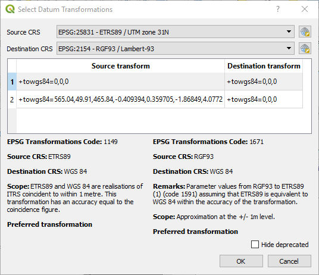

.. only:: html

.. _`label_projections`:

************************
Working with Projections
************************

.. only:: html

   .. contents::
      :local:

.. index:: Projections, CRS (Coordinate Reference System)

A Coordinate Reference System, or CRS, is a method of associating
numerical coordinates with a position on the surface of the Earth.
QGIS has support for approximately 7,000 standard CRSs, each with
different use cases, pros and cons! Choosing an appropriate reference
system for your QGIS projects and data can be a complex task, but
fortunately QGIS helps guide you through this choice, and makes
working with different CRSs as transparent and accurate as possible.

.. index:: EPSG (European Petroleum Search Group), IGNF (Institut Geographique National de France)

Overview of Projection Support
==============================

QGIS has support for approximately 7,000 known CRSs. These standard CRSs
are based on those defined by the European Petroleum Search Group (EPSG)
and the Institut Geographique National de France (IGNF), and are made
available in QGIS through the underlying "Proj" projection library. Commonly,
these standard projections are identified through use of an authority:code
combination, where the authority is an organisation name such as "EPSG" or
"IGNF", and the code is a unique number associated with a specific CRS. For
instance, the common WGS 84 latitude/longitude CRS is known by the identifier
``EPSG:4326``, and the web mapping standard CRS is ``EPSG:3857``. 

Custom, user-created CRSs are stored in a user CRS database. See
section :ref:`sec_custom_projections` for information on managing your custom
coordinate reference systems.

Layer Coordinate Reference Systems
==================================

In order to correctly project data into a specific target CRS, either your data
must contain information about its coordinate reference system or you will need
to manually assign the correct CRS to the layer. For PostGIS layers, QGIS uses
the spatial reference identifier that was specified when that PostGIS layer was
created. For data supported by OGR or GDAL, QGIS relies on the presence of a
recognized means of specifying the CRS. For instance, for the Shapefile format
this is a file containing the Well-Known Text (:index:`WKT`)
representation of the layer's CRS. This projection file has the same base name as the
:file:`.shp` file and a :file:`.prj` extension. For example,
:file:`alaska.shp` would have a corresponding projection file named
:file:`alaska.prj`.

Whenever a layer is loaded into QGIS, QGIS attempts to automatically determine
the correct CRS for that layer. In some cases this is not possible, e.g. when
a layer has been provided without retaining this information. Whenever QGIS cannot
automatically determine the correct CRS for a layer, it will prompt you to manually
select the CRS. Selecting the correct choice is crucial, as a wrong choice will
place your layer in the wrong position on the Earth's surface! Sometimes, accompanying
metadata will describe the correct CRS for a layer, in other cases you will need
to contact the original author of the data to determine the correct CRS to use.

Project Coordinate Reference Systems
====================================

Every project in QGIS also has an associated Coordinate Reference System. The project
CRS determines how data is projected from its underlying raw coordinates to
the flat map rendered within your QGIS map canvas. Behind the scenes, QGIS
transparently reprojects all layers contained within your project into the
project's CRS, so that they will all be rendered in the correct position with
respect to each other!

It is important to make an appropriate choice of CRS for your QGIS projects. Choosing
an inappropriate CRS can cause your maps to look distorted, and poorly reflect
the real-world relative sizes and positions of features. Usually, while working
in smaller geographic areas, there will be a number of standard CRSs used
within a particular country or administrative area. It's important to research
which CRSs are appropriate or standard choices for the area you are mapping,
and ensure that your QGIS project follows these standards.

The project CRS can be set through the :guilabel:`CRS` tab of the
:guilabel:`Project properties` dialog (:menuselection:`Project --> Properties...`).
It will also be shown in the lower-right of the QGIS status bar.

.. index:: Proj

.. _figure_projection_project:

.. figure:: img/projectionDialog.png
   :align: center

   Project Properties Dialog

The :guilabel:`CRS` tab also has an optional setting for :guilabel:`No projection`.
Checking this setting will disable ALL projection handling within the QGIS
project, causing all layer and map coordinates to be treated as simple 2D Cartesian
coordinates, with no relation to positions on the Earth's surface.

Whenever you select a new CRS for your QGIS project, the measurement units will automatically be
changed in the :guilabel:`General` tab of the :guilabel:`Project properties` dialog
(:menuselection:`Project --> Properties...`) to match the selected CRS. For instance,
some CRSs define their coordinates in feet instead of meters, so setting your QGIS
project to one of these CRSs will also set your project to measure using feet by
default.

.. index:: CRS
   single: CRS; Default CRS

CRS Settings
============

By default, QGIS starts each new project using a global default projection. This
default CRS is ``EPSG:4326`` (also known as "WGS 84"), and it is a global latitude/longitude based
reference system. This default CRS can be changed via the :guilabel:`CRS for New Projects`
setting in the :guilabel:`CRS` tab under :menuselection:`Settings -->` |options|
:guilabel:`Options`. There is an option to automatically set the project's CRS
to match the CRS of the first layer loaded into a new project, or alternatively
you can select a different default CRS to use for all newly created projects.
This choice will be saved for use in subsequent QGIS sessions.

.. _figure_projection_options:

.. figure:: img/crsdialog.png
   :align: center

   The CRS tab in the QGIS Options Dialog

When you use layers that do not have a CRS, you can define how QGIS
responds to these layers. This can be done globally in the
:guilabel:`CRS` tab under :menuselection:`Settings -->` |options|
:guilabel:`Options`.

The options shown in figure_projection_options_ are:

* |radioButtonOn| :guilabel:`Prompt for CRS`
* |radioButtonOff| :guilabel:`Use project CRS`
* |radioButtonOff| :guilabel:`Use a default CRS`

If you want to define the Coordinate Reference System for a certain layer
without CRS information, you can also do that in the :guilabel:`Source` tab
of the raster and vector properties dialog (see :ref:`label_sourcetab` for
rasters and :ref:`vectorsourcemenu` for vectors). If your layer already has a CRS
defined, it will be displayed as shown in :ref:`figure_vector_general`. Note
that changing the CRS in this setting does not alter the underlying data
source in any way, rather it just changes how QGIS interprets the raw
coordinates from the layer in the current QGIS project only.

.. tip:: **CRS in the Layers Panel**

   Right-clicking on a layer in the Layers Panel (section :ref:`label_legend`)
   provides two CRS shortcuts. :guilabel:`Set layer CRS` takes you directly
   to the Coordinate Reference System Selector dialog (see figure_projection_project_).
   :guilabel:`Set project CRS from Layer` redefines the project CRS using
   the layer's CRS.

.. index:: CRS; On-the-fly transformation
.. _otf_transformation:

On The Fly (OTF) CRS Transformation
===================================

QGIS supports "on the fly" CRS transformation for both raster and vector data.
This means that regardless of the underlying CRS of particular map layers in
your project, they will always be automatically transformed into the common
CRS defined for your project.

.. index:: CRS Selection
.. _crs_selector:

Coordinate Reference System Selector
=====================================

This dialog helps you assign a Coordinate Reference System to a project or a
layer, provided a set of projection databases. Items in the dialog are:

* **Filter**: If you know the EPSG code, the identifier, or the name for a
  Coordinate Reference System, you can use the search feature to find it.
  Enter the EPSG code, the identifier or the name.
* **Recently used coordinate reference systems**: If you have certain CRSs
  that you frequently use in your everyday GIS work, these will be displayed
  in this list. Click on one of these items to select the associated CRS.
* **Coordinate reference systems of the world**: This is a list of all CRSs
  supported by QGIS, including Geographic, Projected and Custom coordinate
  reference systems. To define a CRS, select it from the list by expanding
  the appropriate node and selecting the CRS. The active CRS is preselected.
* **PROJ text**: This is the CRS string used by the PROJ projection
  engine. This text is read-only and provided for informational purposes.

The CRS selector also shows a rough preview of the geographic
area for which a selected CRS is valid for use. Many CRSs are designed only
for use in small geographic areas, and you should not use these outside
of the area they were designed for. The preview map shades an approximate
area of use whenever a CRS is selected from the list. In addition, this
preview map also shows an indicator of the current main canvas map extent.

.. index:: CRS
   single: CRS; Custom CRS

.. _sec_custom_projections:

Custom Coordinate Reference System
==================================

If QGIS does not provide the coordinate reference system you need, you can
define a custom CRS. To define a CRS, select |customProjection|
:guilabel:`Custom CRS...` from the :menuselection:`Settings` menu. Custom CRSs
are stored in your QGIS user database. In addition to your custom CRSs, this
database also contains your spatial bookmarks and other custom data.

.. _figure_projection_custom:

.. figure:: img/customProjectionDialog.png
   :align: center

   Custom CRS Dialog

Defining a custom CRS in QGIS requires a good understanding of the PROJ
projection library. To begin, refer to "Cartographic Projection Procedures
for the UNIX Environment - A User's Manual" by Gerald I. Evenden, U.S.
Geological Survey Open-File Report 90-284, 1990 (available at
https://pubs.usgs.gov/of/1990/of90-284/ofr90-284.pdf).

This manual describes the use of ``proj`` and related command line
utilities. The cartographic parameters used with ``proj`` are described in
the user manual and are the same as those used by QGIS.

The :guilabel:`Custom Coordinate Reference System Definition` dialog requires
only two parameters to define a user CRS:

#. A descriptive name
#. The cartographic parameters in PROJ format

To create a new CRS, click the |signPlus| :sup:`Add new CRS` button and
enter a descriptive name and the CRS parameters.

Note that the :guilabel:`Parameters` must begin with a ``+proj=`` block,
to represent the new coordinate reference system.

You can test your CRS parameters to see if they give sane results. To do this,
enter known WGS 84 latitude and longitude values in :guilabel:`North` and
:guilabel:`East` fields, respectively. Click on :guilabel:`Calculate`, and compare the
results with the known values in your coordinate reference system.

Integrate an NTv2-transformation in QGIS 
----------------------------------------

To integrate an NTv2 transformation file in QGIS you need one more step: 

#. Place the NTv2 file (.gsb) in the CRS/Proj folder that QGIS uses
   (e.g. :file:`C:\\OSGeo4W64\\share\\proj` for windows users)
#. Add **nadgrids** (``+nadgrids=nameofthefile.gsb``) to the Proj definition
   in the :guilabel:`Parameters` field of the :guilabel:`Custom Coordinate
   Reference System Definition` (:menuselection:`Settings --> Custom Projections...`).

   .. _figure_nadgrids:

   .. figure:: img/nadgrids_example.PNG
      :align: center

      Setting an NTv2 transformation

.. index:: Datum transformation
.. _datum_transformation:

Datum Transformations
=====================

In QGIS, 'on-the-fly' CRS transformation is enabled by default, meaning that
whenever you use layers with different coordinate systems QGIS transparently
reprojects them to the project CRS. For some CRS, there are a number of possible
transforms available to reproject to the project's CRS! QGIS optionally allows
you to define a particular transformation to use, otherwise QGIS uses a default one.

This customization is done in the :menuselection:`Settings -->` |options|
:guilabel:`Options --> CRS` tab menu under the :guilabel:`Default datum
transformations` group:

* using |checkbox| :guilabel:`Ask for datum transformation if several are
  available`: when more than one appropriate datum transformation exists for a
  source/destination CRS combination, a dialog will automatically be opened
  prompting users to choose which of these datum transformations to use for
  the project;
* or predefining a list of the appropriate default transformations to use
  when loading layers to projects or reprojecting a layer.

  Use the |signPlus| button to open the :guilabel:`Select Datum Transformations`
  dialog. Then:

  #. Indicate the :guilabel:`Source CRS` of the layer, using the drop-down menu
     or the |setProjection| :sup:`Select CRS` widget.
  #. Likewise, provide the :guilabel:`Destination CRS`.
  #. Depending on the transform grid files (based on GDAL and PROJ version
     installed on your system), a list of available transformations from source to
     destination is built in the table. Clicking a row shows details on the settings
     applied (epsg code, accuracy of the transform, number of stations involved...).

     You can choose to only display current valid transformations by checking
     the |checkbox| :guilabel:`Hide deprecated` option.

  #. Find your preferred transformation, select it and click :guilabel:`OK`.

     A new row is added to the table under :menuselection:`CRS --> Default datum
     transformations` with information about 'Source CRS' and 'Destination CRS'
     as well as 'Source datum transform' and 'Destination datum transform'.

  From now, QGIS automatically uses the selected datum transformation for
  further transformation between these two CRSs until you |signMinus| remove
  it from the list or |toggleEditing| replace it with another one.

.. _figure_projection_datum:

   Selecting a preferred default datum transformation

Datum transformations set in the :menuselection:`Settings -->` |options|
:guilabel:`Options --> CRS` tab will be inherited by all new QGIS
projects created on the system. Additionally, a particular project
may have its own specific set of transformations specified via the
:guilabel:`CRS` tab of the :guilabel:`Project properties` dialog
(:menuselection:`Project --> Properties...`). These settings apply
to the current project only.

.. Substitutions definitions - AVOID EDITING PAST THIS LINE
   This will be automatically updated by the find_set_subst.py script.
   If you need to create a new substitution manually,
   please add it also to the substitutions.txt file in the
   source folder.

.. |checkbox| image:: /static/common/checkbox.png
   :width: 1.3em
.. |customProjection| image:: /static/common/mActionCustomProjection.png
   :width: 1.5em
.. |options| image:: /static/common/mActionOptions.png
   :width: 1em
.. |radioButtonOff| image:: /static/common/radiobuttonoff.png
   :width: 1.5em
.. |radioButtonOn| image:: /static/common/radiobuttonon.png
   :width: 1.5em
.. |setProjection| image:: /static/common/mActionSetProjection.png
   :width: 1.5em
.. |signMinus| image:: /static/common/symbologyRemove.png
   :width: 1.5em
.. |signPlus| image:: /static/common/symbologyAdd.png
   :width: 1.5em
.. |toggleEditing| image:: /static/common/mActionToggleEditing.png
   :width: 1.5em
