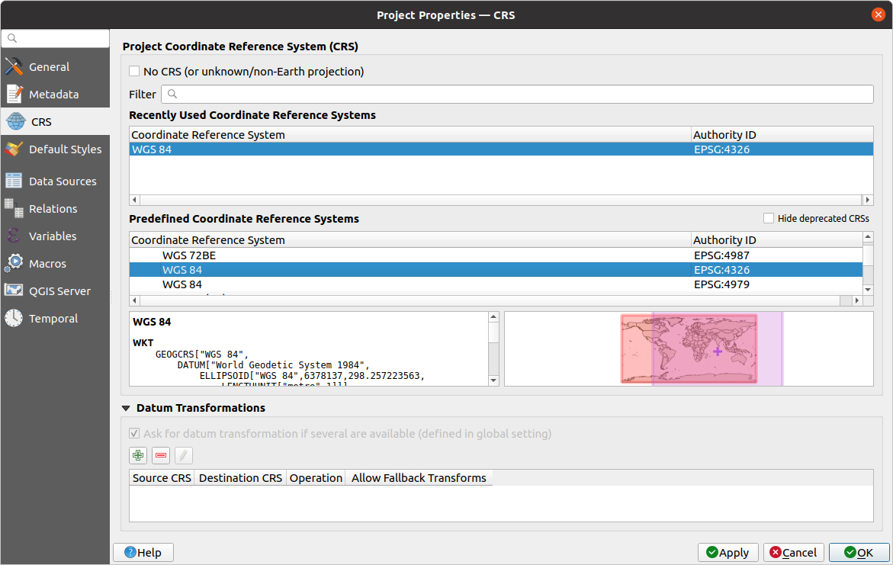
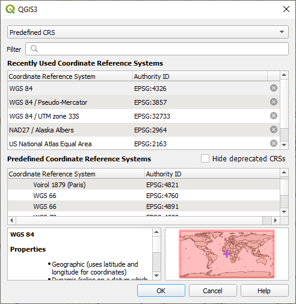
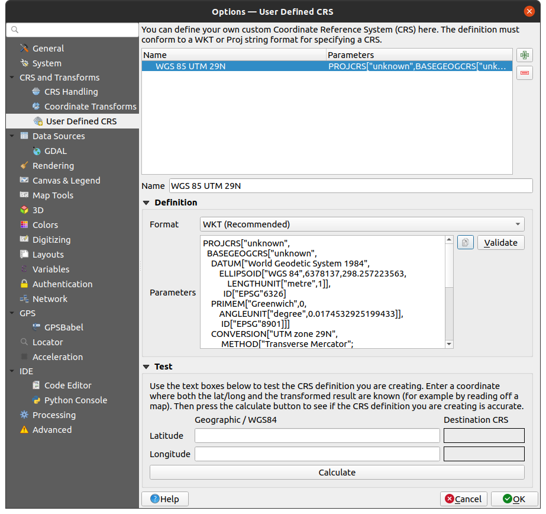

.. _`label_projections`:

************************
Working with Projections
************************

.. only:: html

   .. contents::
      :local:

.. index:: Projections, CRS (Coordinate Reference System)

A Coordinate Reference System, or CRS, is a method of associating
numerical coordinates with a position on the surface of the Earth.
QGIS has support for approximately 7,000 standard CRSs, each with
different use cases, pros and cons! Choosing an appropriate reference
system for your QGIS projects and data can be a complex task, but
fortunately QGIS helps guide you through this choice, and makes
working with different CRSs as transparent and accurate as possible.

.. index:: EPSG (European Petroleum Search Group), IGNF (Institut Geographique National de France)

Overview of Projection Support
==============================

QGIS has support for approximately 7,000 known CRSs. These standard CRSs
are based on those defined by the European Petroleum Search Group (EPSG)
and the Institut Geographique National de France (IGNF), and are made
available in QGIS through the underlying "Proj" projection library. Commonly,
these standard projections are identified through use of an authority:code
combination, where the authority is an organisation name such as "EPSG" or
"IGNF", and the code is a unique number associated with a specific CRS. For
instance, the common WGS 84 latitude/longitude CRS is known by the identifier
``EPSG:4326``, and the web mapping standard CRS is ``EPSG:3857``.

Custom, user-created CRSs are stored in a user CRS database. See
section :ref:`sec_custom_projections` for information on managing your custom
coordinate reference systems.

.. _layer_crs:

Layer Coordinate Reference Systems
==================================

In order to correctly project data into a specific target CRS, either your data
must contain information about its coordinate reference system or you will need
to manually assign the correct CRS to the layer. For PostGIS layers, QGIS uses
the spatial reference identifier that was specified when that PostGIS layer was
created. For data supported by GDAL, QGIS relies on the presence of a
recognized means of specifying the CRS. For instance, for the Shapefile format
this is a file containing an ESRI Well-Known Text (:index:`WKT`)
representation of the layer's CRS. This projection file has the same base name
as the :file:`.shp` file and a :file:`.prj` extension. For example,
:file:`alaska.shp` would have a corresponding projection file named
:file:`alaska.prj`.

Whenever a layer is loaded into QGIS, QGIS attempts to automatically determine
the correct CRS for that layer. In some cases this is not possible, e.g. when
a layer has been provided without retaining this information. You can configure
QGIS behavior whenever it cannot automatically determine the correct CRS for a
layer:

#. Open :menuselection:`Settings -->` |options| :menuselection:`Options... --> CRS`

   .. _figure_projection_options:

   .. figure:: ../introduction/img/options_crs.png
      :align: center

      The CRS tab in the QGIS Options Dialog

#. Under the :guilabel:`CRS for layers` group, set the action to do
   :guilabel:`when a new layer is created, or when a layer is loaded that has
   no CRS`. One of:

   * |radioButtonOn| :guilabel:`Leave as unknown CRS (take no action)`:
     there will be no prompt to select a CRS when a layer without CRS is loaded,
     defering CRS choice to a later time. Convenient when loading a lot of
     layers at once. Such layers will be identifiable in the :guilabel:`Layers`
     panel by the |indicatorNoCRS| icon next to them.
     They'll also be un-referenced, with coordinates from the layer treated as
     purely numerical, non-earth values, i.e. the same behavior as all layers
     get when :ref:`a project is set to have no CRS <project_crs>`.
   * |radioButtonOff| :guilabel:`Prompt for CRS`: it will prompt you to
     manually select the CRS. Selecting the correct choice is crucial,
     as a wrong choice will place your layer in the wrong position on the
     Earth's surface! Sometimes, accompanying metadata will describe the
     correct CRS for a layer, in other cases you will need to contact the
     original author of the data to determine the correct CRS to use.
   * |radioButtonOff| :guilabel:`Use project CRS`
   * |radioButtonOff| :guilabel:`Use default layer CRS`, as set in the
     :guilabel:`Default CRS for layers` combobox above.

.. tip::

   To assign the same CRS to multiple layers that have no crs
   or have a wrong one in one operation:

   #. Select the layers in the :guilabel:`Layers` panel
   #. Press :kbd:`Ctrl+Shift+C`. You could also right-click over one of the
      selected layers or go to :menuselection:`Layer --> Set CRS of layer(s)`
   #. Find and select the right CRS to use
   #. And press :guilabel:`OK`. You can confirm that it has been set correctly in the
      :guilabel:`Source` tab of the layers' properties dialog.

   Note that changing the CRS in this setting does not alter the underlying
   data source in any way, rather it just changes how QGIS interprets the raw
   coordinates from the layer in the current QGIS project.

.. index:: CRS, Proj, On-the-fly transformation
   single: CRS; Default CRS
.. _project_crs:

Project Coordinate Reference Systems
====================================

Every project in QGIS also has an associated Coordinate Reference System.
The project CRS determines how data is projected from its underlying raw
coordinates to the flat map rendered within your QGIS map canvas.

QGIS supports "on the fly" CRS transformation for both raster and vector data.
This means that regardless of the underlying CRS of particular map layers in
your project, they will always be automatically transformed into the common
CRS defined for your project. Behind the scenes, QGIS
transparently reprojects all layers contained within your project into the
project's CRS, so that they will all be rendered in the correct position with
respect to each other!

It is important to make an appropriate choice of CRS for your QGIS projects.
Choosing an inappropriate CRS can cause your maps to look distorted,
and poorly reflect the real-world relative sizes and positions of features.
Usually, while working in smaller geographic areas, there will be a number of
standard CRSs used within a particular country or administrative area.
It's important to research which CRSs are appropriate or standard choices
for the area you are mapping, and ensure that your QGIS project follows
these standards.

By default, QGIS starts each new project using a global default projection.
This default CRS is ``EPSG:4326`` (also known as "WGS 84"), and it is a global
latitude/longitude based reference system.
This default CRS can be changed via the :guilabel:`CRS for New Projects`
setting in the :guilabel:`CRS` tab under :menuselection:`Settings -->` |options|
:menuselection:`Options...` (see :numref:`figure_projection_options`).
There is an option to automatically set the project's CRS
to match the CRS of the first layer loaded into a new project, or alternatively
you can select a different default CRS to use for all newly created projects.
This choice will be saved for use in subsequent QGIS sessions.

The project CRS can also be set through the :guilabel:`CRS` tab of the
:menuselection:`Project --> Properties...` dialog.
It will also be shown in the lower-right of the QGIS status bar.

.. _figure_projection_project:

   Project Properties Dialog

Available options are:

* |unchecked| :guilabel:`No CRS (or unknown/non-Earth projection)`:
  Checking this setting will disable ALL projection handling within the QGIS
  project, causing all layers and map coordinates to be treated as simple 2D
  Cartesian coordinates, with no relation to positions on the Earth's surface.
  It can be used to guess a layer CRS (based on its raw coordinates or when
  using QGIS for non earth uses like role-playing game maps, building mapping
  or microscopic stuff. In this case:

  * No reprojection is done while rendering the layers: features are just drawn
    using their raw coordinates.
  * The ellipsoid is locked out and forced to ``None/Planimetric``.
  * The distance and area units, and the coordinate display are locked out and
    forced to "unknown units"; all measurements are done in unknown map units,
    and no conversion is possible.

* or an existing coordinate reference system that can be *geographic*, *projected*
  or *user-defined*. A preview of the CRS extent on earth is displayed to
  help you select the appropriate one.
  Layers added to the project are translated on-the-fly to this CRS in order
  to overlay them regardless of their original CRS. Use of units and ellipsoid setting
  are available and make sense and you can perform calculations accordingly.

Whenever you select a new CRS for your QGIS project, the measurement units will automatically be
changed in the :guilabel:`General` tab of the :guilabel:`Project properties` dialog
(:menuselection:`Project --> Properties...`) to match the selected CRS. For instance,
some CRSs define their coordinates in feet instead of meters, so setting your QGIS
project to one of these CRSs will also set your project to measure using feet by
default.

.. tip:: **Setting the project CRS from a layer**

   You can assign a CRS to the project using a layer CRS:

   #. In the :guilabel:`Layers` panel, right-click on the layer you want
      to pick the CRS
   #. Select :guilabel:`Set project CRS from Layer`.

   The project's CRS is redefined using the layer's CRS. Map canvas extent,
   coordinates display are updated accordingly and all the layers in
   the project are on-the-fly translated to the new project CRS.
   

.. index:: CRS Selection
.. _crs_selector:

Coordinate Reference System Selector
=====================================

.. _figure_crs_selector:

   CRS Selector 

This dialog helps you assign a Coordinate Reference System to a project or a
layer, provided a set of projection databases. Items in the dialog are:

* **Filter**: If you know the EPSG code, the identifier, or the name for a
  Coordinate Reference System, you can use the search feature to find it.
  Enter the EPSG code, the identifier or the name.
* **Recently used coordinate reference systems**: If you have certain CRSs
  that you frequently use in your everyday GIS work, these will be displayed
  in this list. Click on one of these items to select the associated CRS.
* **Coordinate reference systems of the world**: This is a list of all CRSs
  supported by QGIS, including Geographic, Projected and Custom coordinate
  reference systems. To define a CRS, select it from the list by expanding
  the appropriate node and selecting the CRS. The active CRS is preselected.
* **PROJ text**: This is the CRS string used by the PROJ projection
  engine. This text is read-only and provided for informational purposes.

If you want to remove a recently used CRS from the list that can be done in 
several ways:

* Press |clearItem| :sup:`Remove from recently used CRS` button on the right 
  side.
* Press :kbd:`Del` after selecting CRS that you want to remove.
* Right-click on used CRS and choose
  |clearItem| :guilabel:`Remove selected CRS from recently used CRS` to remove 
  selected CRS
  or |clearConsole| :guilabel:`Clear all recently used CRS` to remove all used 
  CRS.

The CRS selector also shows a rough preview of the geographic
area for which a selected CRS is valid for use. Many CRSs are designed only
for use in small geographic areas, and you should not use these outside
of the area they were designed for. The preview map shades an approximate
area of use whenever a CRS is selected from the list. In addition, this
preview map also shows an indicator of the current main canvas map extent.

.. index:: CRS
   single: CRS; Custom CRS

.. _sec_custom_projections:

Custom Coordinate Reference System
==================================

If QGIS does not provide the coordinate reference system you need, you can
define a custom CRS. To define a CRS, select |customProjection|
:guilabel:`Custom CRS...` from the :menuselection:`Settings` menu. Custom CRSs
are stored in your QGIS user database. In addition to your custom CRSs, this
database also contains your spatial bookmarks and other custom data.

Defining a custom CRS in QGIS requires a good understanding of the PROJ
projection library. To begin, refer to "Cartographic Projection Procedures
for the UNIX Environment - A User's Manual" by Gerald I. Evenden, U.S.
Geological Survey Open-File Report 90-284, 1990 (available at
https://pubs.usgs.gov/of/1990/of90-284/ofr90-284.pdf).

This manual describes the use of ``proj`` and related command line
utilities. The cartographic parameters used with ``proj`` are described in
the user manual and are the same as those used by QGIS.

The :guilabel:`Custom Coordinate Reference System Definition` dialog requires
only two parameters to define a user CRS:

#. A descriptive name
#. The cartographic parameters in PROJ or WKT format

To create a new CRS:

#. Click the |symbologyAdd| :sup:`Add new CRS` button
#. Enter a descriptive name
#. Select the format: it can be :guilabel:`Proj String` or :guilabel:`WKT`
#. Add the CRS :guilabel:`Parameters`.

   .. note:: **Prefer storing the CRS definition in WKT format**

    Although both ``Proj String`` and ``WKT`` formats are supported, it's
    highly recommended to store projection definitions in the WKT format.
    Therefore, if the available definition is in the proj format, select that
    format, enter the parameters and then switch to WKT format.
    QGIS will convert the definition to the WKT format that you can later save.

#. Click :guilabel:`Validate` to test whether the CRS definition is an acceptable
   projection definition.

.. _figure_projection_custom:

   Custom CRS Dialog

You can test your CRS parameters to see if they give sane results. To do this,
enter known WGS 84 latitude and longitude values in :guilabel:`North` and
:guilabel:`East` fields, respectively. Click on :guilabel:`Calculate`, and compare the
results with the known values in your coordinate reference system.

Integrate an NTv2-transformation in QGIS
----------------------------------------

To integrate an NTv2 transformation file in QGIS you need one more step:

#. Place the NTv2 file (.gsb) in the CRS/Proj folder that QGIS uses
   (e.g. :file:`C:\\OSGeo4W64\\share\\proj` for windows users)
#. Add **nadgrids** (``+nadgrids=nameofthefile.gsb``) to the Proj definition
   in the :guilabel:`Parameters` field of the :guilabel:`Custom Coordinate
   Reference System Definition` (:menuselection:`Settings --> Custom Projections...`).

   .. _figure_nadgrids:

   .. figure:: img/nadgrids_example.png
      :align: center

      Setting an NTv2 transformation

.. index:: Datum transformation
.. _datum_transformation:

Datum Transformations
=====================

In QGIS, 'on-the-fly' CRS transformation is enabled by default, meaning that
whenever you use layers with different coordinate systems QGIS transparently
reprojects them to the project CRS. For some CRS, there are a number of possible
transforms available to reproject to the project's CRS!

By default, QGIS will attempt to use the most accurate transformation available.
However, in some cases this may not be possible, e.g. whenever additional
support files are required to use a transformation. Whenever a more accurate
transformation is available, but is not currently usable, QGIS will show
an informative warning message advising you of the more accurate transformation
and how to enable it on your system. Usually, this requires download of
an external package of transformation support files, and extracting these
to the :file:`proj` folder under your QGIS :ref:`user profile <user_profiles>`
folder.

If desired, QGIS can also prompt you whenever multiple possible transformations
can be made between two CRSs, and allow you to make an informed selection
of which is the most appropriate transformation to use for your data.

This customization is done in the :menuselection:`Settings -->` |options|
:menuselection:`Options --> Transformations` tab menu under the
:guilabel:`Default datum transformations` group:

* using |checkbox| :guilabel:`Ask for datum transformation if several are
  available`: when more than one appropriate datum transformation exist for a
  source/destination CRS combination, a dialog will automatically be opened
  prompting users to choose which of these datum transformations to use for
  the project. If the :guilabel:`Make default` checkbox is ticked when
  selecting a transformation from this dialog, then the choice is remembered
  and automatically applied to any newly created QGIS projects.
* or defining a list of appropriate datum transformations to use as defaults
  when loading a layer to a project or reprojecting a layer.

  Use the |symbologyAdd| button to open the :guilabel:`Select Datum Transformations`
  dialog. Then:

  #. Choose the :guilabel:`Source CRS` of the layer, using the drop-down menu
     or the |setProjection| :sup:`Select CRS` widget.
  #. Provide the :guilabel:`Destination CRS` in the same way.
  #. A list of available transformations from source to destination will be
     shown in the table.
     Clicking a row shows details on the settings applied and the corresponding
     accuracy and area of use of the transformation.

     .. _figure_projection_datum:

     .. figure:: img/datumTransformation.png
        :align: center

        Selecting a preferred default datum transformation

     In some cases a transformation may not be available for use on your system.
     In this case, the transformation will still be shown (greyed) in this list
     but can not be picked until you install the required package
     of transformation support. Usually, a button is provided to download and
     install the corresponding grid, which is then stored under the :file:`proj`
     folder in the active :ref:`user profile <user_profiles>` directory.

  #. Find your preferred transformation and select it
  #. Set whether you |checkbox| :guilabel:`Allow fallback transforms if preferred
     operation fails`
  #. Click :guilabel:`OK`.

     A row is added to the table under :guilabel:`Default Datum Transformations`
     with information about the :guilabel:`Source CRS`, the :guilabel:`Destination
     CRS`, the :guilabel:`Operation` applied for the transformation and whether
     :guilabel:`Allow fallback Transforms` is enabled.

  From now, QGIS automatically uses the selected datum transformations for
  further transformation between these two CRSs until you remove
  it (|symbologyRemove|) from the list or change the entry (|toggleEditing|) in
  the list.

Datum transformations set in the :menuselection:`Settings -->` |options|
:menuselection:`Options --> Transformations` tab will be inherited by all
new QGIS projects created on the system. Additionally, a particular project
may have its own specific set of transformations specified via the
:guilabel:`CRS` tab of the :guilabel:`Project properties` dialog
(:menuselection:`Project --> Properties...`). These settings apply
to the current project only.

.. Substitutions definitions - AVOID EDITING PAST THIS LINE
   This will be automatically updated by the find_set_subst.py script.
   If you need to create a new substitution manually,
   please add it also to the substitutions.txt file in the
   source folder.

.. |checkbox| image:: /static/common/checkbox.png
   :width: 1.3em
.. |clearConsole| image:: /static/common/iconClearConsole.png
   :width: 1.5em
.. |clearItem| image:: /static/common/mIconClearItem.png
   :width: 1.5em
.. |customProjection| image:: /static/common/mActionCustomProjection.png
   :width: 1.5em
.. |indicatorNoCRS| image:: /static/common/mIndicatorNoCRS.png
   :width: 1.5em
.. |options| image:: /static/common/mActionOptions.png
   :width: 1em
.. |radioButtonOff| image:: /static/common/radiobuttonoff.png
   :width: 1.5em
.. |radioButtonOn| image:: /static/common/radiobuttonon.png
   :width: 1.5em
.. |setProjection| image:: /static/common/mActionSetProjection.png
   :width: 1.5em
.. |symbologyAdd| image:: /static/common/symbologyAdd.png
   :width: 1.5em
.. |symbologyRemove| image:: /static/common/symbologyRemove.png
   :width: 1.5em
.. |toggleEditing| image:: /static/common/mActionToggleEditing.png
   :width: 1.5em
.. |unchecked| image:: /static/common/unchecked.png
   :width: 1.3em
