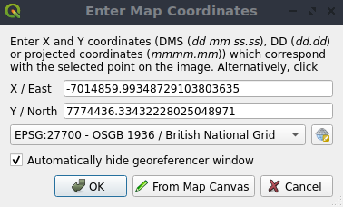

.. index:: Georeferencing images
   single: Raster; Georeference
.. _`georef`:

Georeferencer
=============

.. only:: html

   .. contents::
      :local:

The |georefRun| Georeferencer is a tool for generating world files for layers.
It allows you to reference rasters or vectors to geographic or projected coordinate systems by
creating a new GeoTiff or by adding a world file to the existing image. The basic
approach to georeferencing a layer is to locate points on it for which
you can accurately determine coordinates.

**Features**

.. index::
   single: Tools; Georeferencer tools

.. _table_georeferencer_tools:

+--------------------------------+------------------------------+-------------------------------+----------------------------+
| Icon                           | Purpose                      | Icon                          | Purpose                    |
+================================+==============================+===============================+============================+
| |addRasterLayer|               | Open raster                  | |addOgrLayer|                 | Open vector                |
+--------------------------------+------------------------------+-------------------------------+----------------------------+
| |start|                        | Start georeferencing         |                               |                            |
+--------------------------------+------------------------------+-------------------------------+----------------------------+
| |gdalScript|                   | Generate GDAL Script         | |loadGCPpoints|               | Load GCP Points            |
+--------------------------------+------------------------------+-------------------------------+----------------------------+
| |saveGCPPointsAs|              | Save GCP Points As           | |transformSettings|           | Transformation settings    |
+--------------------------------+------------------------------+-------------------------------+----------------------------+
| |addGCPPoint|                  | Add Point                    | |deleteGCPPoint|              | Delete Point               |
+--------------------------------+------------------------------+-------------------------------+----------------------------+
| |moveGCPPoint|                 | Move GCP Point               | |pan|                         | Pan                        |
+--------------------------------+------------------------------+-------------------------------+----------------------------+
| |zoomIn|                       | Zoom In                      | |zoomOut|                     | Zoom Out                   |
+--------------------------------+------------------------------+-------------------------------+----------------------------+
| |zoomToLayer|                  | Zoom To Layer                | |zoomLast|                    | Zoom Last                  |
+--------------------------------+------------------------------+-------------------------------+----------------------------+
| |zoomNext|                     | Zoom Next                    | |linkGeorefToQGis|            | Link Georeferencer to QGIS |
+--------------------------------+------------------------------+-------------------------------+----------------------------+
| |linkQGisToGeoref|             | Link QGIS to Georeferencer   | |fullHistogramStretch|        | Full histogram stretch     |
+--------------------------------+------------------------------+-------------------------------+----------------------------+
| |localHistogramStretch|        | Local histogram stretch      |                               |                            |
+--------------------------------+------------------------------+-------------------------------+----------------------------+

Table Georeferencer: Georeferencer Tools

Usual procedure
---------------

As X and Y coordinates (DMS (dd mm ss.ss), DD (dd.dd) or projected coordinates
(mmmm.mm)), which correspond with the selected point on the image, two
alternative procedures can be used:

* The raster itself sometimes provides crosses with coordinates "written" on the
  image. In this case, you can enter the coordinates manually.
* Using already georeferenced layers. This can be either vector or raster data
  that contain the same objects/features that you have on the image that you want
  to georeference and with the projection that you want for your image. In this case,
  you can enter the coordinates by clicking on the reference dataset loaded in the
  QGIS map canvas.

The usual procedure for georeferencing an image involves selecting multiple
points on the raster, specifying their coordinates, and choosing a relevant
transformation type. Based on the input parameters and data, the Georeferencer will
compute the world file parameters. The more coordinates you provide, the better
the result will be.

The first step is to start QGIS and click on :menuselection:`Layer -->` |georefRun|
:menuselection:`Georeferencer`, which appears in the QGIS menu bar. The Georeferencer
dialog appears as shown in :numref:`figure_georeferencer_dialog`.

For this example, we are using a topo sheet of South Dakota from SDGS. It can
later be visualized together with the data from the GRASS :file:`spearfish60`
location. You can download the topo sheet here:
https://grass.osgeo.org/sampledata/spearfish_toposheet.tar.gz.

.. _figure_georeferencer_dialog:

.. figure:: img/georef.png
   :align: center

   Georeferencer Dialog

.. _`georeferencer_entering`:

Entering ground control points (GCPs)
......................................

#. To start georeferencing an unreferenced raster, we must load it using the
   |addRasterLayer| button. The raster will show up in the main working
   area of the dialog. Once the raster is loaded, we can start to enter reference
   points.
#. Using the |addGCPPoint| :sup:`Add Point` button, add points to the
   main working area and enter their coordinates (see Figure :numref:`figure_georeferencer_add_points`).
   For this procedure you have the following options:

   - Click on a point in the raster image and enter the X and Y coordinates
     manually, along with the CRS of the point.
   - Click on a point in the raster image and choose the |pencil|
     :sup:`From map canvas` button to add the X and Y coordinates with the help of a
     georeferenced map already loaded in the QGIS map canvas. The CRS will be set
     automatically.
   - When entering GCPs from the main map canvas, you have the option to hide 
     the georeferencer window while selecting points from the main canvas. 
     If the |checkbox| :guilabel:`Automatically hide georeferencer window` 
     checkbox is ticked, after clicking |pencil| :guilabel:`From Map Canvas`, 
     the main georeferencer window will be hidden until a point is added on the 
     map canvas. 
     The :guilabel:`Enter Map Coordinates` dialog will remain open. 
     If the box is unchecked, both windows will remain open while selecting a 
     point on the map canvas. 
     This option only takes effect when the georeferencer window is not docked 
     in the main interface. 

#. Continue entering points. You should have at least four points, and the more
   coordinates you can provide, the better the result will be. There are
   additional tools for zooming and panning the working area in
   order to locate a relevant set of GCP points.

#. With the |moveGCPPoint| tool, you can move the GCPs in both the canvas and the
   georeferencing window, if you need to correct them.

.. _figure_georeferencer_add_points:

   Add points to the raster image

The points that are added to the map will be stored in a separate text file
(:file:`[filename].points`) usually together with the raster image. This allows
us to reopen the Georeferencer at a later date and add new points or delete
existing ones to optimize the result. The points file contains values of the
form: ``mapX, mapY, pixelX, pixelY``. You can use the |loadGCPpoints|
:sup:`Load GCP points` and |saveGCPPointsAs| :sup:`Save GCP points as` buttons to
manage the files.

.. _`georeferencer_transformation`:

Defining the transformation settings
....................................

After you have added your GCPs to the raster image, you need to define the
transformation settings for the georeferencing process.

.. _figure_georeferencer_transform:

   Defining the georeferencer transformation settings

Available Transformation algorithms
^^^^^^^^^^^^^^^^^^^^^^^^^^^^^^^^^^^

A number of transformation algorithms are available, dependent on the type and quality of input data, the
nature and amount of geometric distortion that you are willing to introduce to the final
result, and the number of ground control points (GCPs).

Currently, the following :guilabel:`Transformation types` are available:

*  The **Linear** algorithm is used to create a world file and is different
   from the other algorithms, as it does not actually transform the raster pixels.
   It allows positioning (translating) the image and uniform scaling, but no rotation or other transformations.
   It is the most suitable if your image is a good quality raster map, in a known CRS, but is just missing georeferencing information. At least 2 GCPs are needed.
   
*  The **Helmert** transformation also allows rotation. It is particularly useful if your raster is a good quality local 
   map or orthorectified aerial image, but not aligned with the grid bearing in your CRS. At least 2 GCPs are needed.
   
*  The **Polynomial 1** algorithm allows a more general affine transformation, in particular also a uniform shear. Straight lines remain straight 
   (i.e., collinear points stay collinear) and parallel lines remain parallel. This is particularly useful for georeferencing data cartograms, 
   which may have been plotted (or data collected) with different ground pixel sizes in different directions. At least 3 GCP's are required.

*  The **Polynomial** algorithms 2-3 use more general 2nd or 3rd degree polynomials instead of just affine transformation. This allows them to account 
   for curvature or other systematic warping of the image, for instance photographed maps with curving edges. At least 6 (respectively 10) GCP's are required.  
   Angles and local scale are not preserved or treated uniformly across the image. In particular, straight lines may become curved, and there may be significant 
   distortion introduced at the edges or far from any GCPs arising from extrapolating the data-fitted polynomials too far.

*  The **Projective** algorithm generalizes Polynomial 1 in a different way, allowing transformations representing a central projection between 2 non-parallel planes, 
   the image and the map canvas. Straight lines stay straight, but parallelism is not preserved and scale across the image varies consistently with the 
   change in perspective. This transformation type is most useful for georeferencing angled photographs (rather than flat scans) of good quality maps, or 
   oblique aerial images. A minimum of 4 GCPs is required.
   
*  Finally, the **Thin Plate Spline** (TPS) algorithm "rubber sheets" the raster using multiple local polynomials to match the GCPs specified, with overall 
   surface curvature minimized. Areas away from GCPs will be moved around in the output to 
   accommodate the GCP matching, but will otherwise be minimally locally deformed.  TPS is most useful for georeferencing damaged, deformed, or otherwise slightly 
   inaccurate maps, or poorly orthorectified aerials.  It is also useful for approximately georeferencing and implicitly reprojecting maps with unknown projection type 
   or parameters, but where a regular grid or dense set of ad-hoc GCPs can be matched with a reference map layer. It technically requires a minimum of 
   10 GCPs, but usually more to be successful.
   
In all of the algorithms except TPS, if more than the minimum GCPs are specified, parameters will be fitted so that the overall residual error is minimized. 
This is helpful to minimize the impact of registration errors, i.e. slight imprecisions in pointer clicks or typed coordinates, or other small local image deformations.  
Absent other GCPs to compensate, such errors or deformations could translate into significant distortions, especially 
near the edges of the georeferenced image.  However, if more than the minimum GCPs are specified, they will match only approximately in the output.  
In contrast, TPS will precisely match all specified GCPs, but may introduce significant deformations between nearby GCPs with registration errors.

Define the Resampling method
^^^^^^^^^^^^^^^^^^^^^^^^^^^^

The type of resampling you choose will likely depend on your input data
and the ultimate objective of the exercise. If you don't want to change
statistics of the raster (other than as implied by nonuniform geometric scaling if using other than the Linear, Helmert, or Polynomial 1 transformations), 
you might want to choose 'Nearest neighbour'. In contrast, 
'cubic resampling', for instance, will usually generate a visually smoother result.

It is possible to choose between five different resampling methods:

#. Nearest neighbour
#. Bilinear (2x2 kernel)
#. Cubic (4x4 kernel)
#. Cubic B-Spline (4x4 kernel)
#. Lanczos (6x6 kernel)

Define the transformation settings
^^^^^^^^^^^^^^^^^^^^^^^^^^^^^^^^^^

There are several options that need to be defined for the georeferenced output
raster.

* The |checkbox| :guilabel:`Create world file` checkbox is only available if you
  decide to use the linear transformation type, because this means that the
  raster image actually won't be transformed. In this case, the
  :guilabel:`Output raster` field is not activated, because only a new world file will
  be created.
* For all other transformation types, you have to define an :guilabel:`Output raster`.
  As default, a new file ([filename]_modified) will be created in the
  same folder together with the original raster image.
* As a next step, you have to define the :guilabel:`Target CRS` (Coordinate Reference
  System) for the georeferenced raster (see :ref:`label_projections`).
* If you like, you can **generate a pdf map** and also **a pdf report**.
  The report includes information about the used transformation parameters,
  an image of the residuals and a list with all GCPs and their RMS errors.
* Furthermore, you can activate the |checkbox| :guilabel:`Set Target Resolution`
  checkbox and define the pixel resolution of the output raster. Default horizontal
  and vertical resolution is 1.
* The |checkbox| :guilabel:`Use 0 for transparency when needed` can be activated,
  if pixels with the value 0 shall be visualized transparent. In our example
  toposheet, all white areas would be transparent.
* The |checkbox| :guilabel:`Save GCP Points` will store GCP Points in a file next 
  to the output raster.
* Finally, |checkbox| :guilabel:`Load in project when done` loads the output raster
  automatically into the QGIS map canvas when the transformation is done.

Show and adapt raster properties
................................

Clicking on the :guilabel:`Raster properties` option in the :guilabel:`Settings`
menu opens the :ref:`Layer properties <raster_properties_dialog>` dialog of the
raster file that you want to georeference.

.. _configure_georeferencer:

Configure the georeferencer
...........................

You can customize the behavior of the georeferencer in :menuselection:`Settings 
--> Configure Georeferencer` (or use keyboard shortcut :kbd:`Ctrl+P`). 

* Under :guilabel:`Point Tip` you can use the checkboxes to toggle displaying GCP 
  IDs and X/Y coordinates in both the Georeferencer window and the main map canvas. 
* :guilabel:`Residual Units` controls whether residual units are given in pixels 
  or map units
* :guilabel:`PDF Report` allows you to set margin size in mm for the report export
* :guilabel:`PDF Map` allows you to choose a paper size for the map export
* Finally, you can activate to |checkbox| :guilabel:`Show Georeferencer window 
  docked`. 
  This will dock the Georeferencer window in the main QGIS window rather than 
  showing it as a separate window that can be minimized. 

.. _`georeferencer_running`:

Running the transformation
..........................

After all GCPs have been collected and all transformation settings are defined,
just press the |start| :sup:`Start georeferencing` button to create
the new georeferenced raster.

.. Substitutions definitions - AVOID EDITING PAST THIS LINE
   This will be automatically updated by the find_set_subst.py script.
   If you need to create a new substitution manually,
   please add it also to the substitutions.txt file in the
   source folder.

.. |addGCPPoint| image:: /static/common/mActionAddGCPPoint.png
   :width: 1.5em
.. |addOgrLayer| image:: /static/common/mActionAddOgrLayer.png
   :width: 1.5em
.. |addRasterLayer| image:: /static/common/mActionAddRasterLayer.png
   :width: 1.5em
.. |checkbox| image:: /static/common/checkbox.png
   :width: 1.3em
.. |deleteGCPPoint| image:: /static/common/mActionDeleteGCPPoint.png
   :width: 1.5em
.. |fullHistogramStretch| image:: /static/common/mActionFullHistogramStretch.png
   :width: 1.5em
.. |gdalScript| image:: /static/common/mActionGDALScript.png
   :width: 1.5em
.. |georefRun| image:: /static/common/mGeorefRun.png
   :width: 1.5em
.. |linkGeorefToQGis| image:: /static/common/mActionLinkGeorefToQGis.png
   :width: 2.5em
.. |linkQGisToGeoref| image:: /static/common/mActionLinkQGisToGeoref.png
   :width: 2.5em
.. |loadGCPpoints| image:: /static/common/mActionLoadGCPpoints.png
   :width: 1.5em
.. |localHistogramStretch| image:: /static/common/mActionLocalHistogramStretch.png
   :width: 1.5em
.. |moveGCPPoint| image:: /static/common/mActionMoveGCPPoint.png
   :width: 1.5em
.. |pan| image:: /static/common/mActionPan.png
   :width: 1.5em
.. |pencil| image:: /static/common/pencil.png
   :width: 1.5em
.. |saveGCPPointsAs| image:: /static/common/mActionSaveGCPpointsAs.png
   :width: 1.5em
.. |start| image:: /static/common/mActionStart.png
   :width: 1.5em
.. |transformSettings| image:: /static/common/mActionTransformSettings.png
   :width: 1.5em
.. |zoomIn| image:: /static/common/mActionZoomIn.png
   :width: 1.5em
.. |zoomLast| image:: /static/common/mActionZoomLast.png
   :width: 1.5em
.. |zoomNext| image:: /static/common/mActionZoomNext.png
   :width: 1.5em
.. |zoomOut| image:: /static/common/mActionZoomOut.png
   :width: 1.5em
.. |zoomToLayer| image:: /static/common/mActionZoomToLayer.png
   :width: 1.5em
