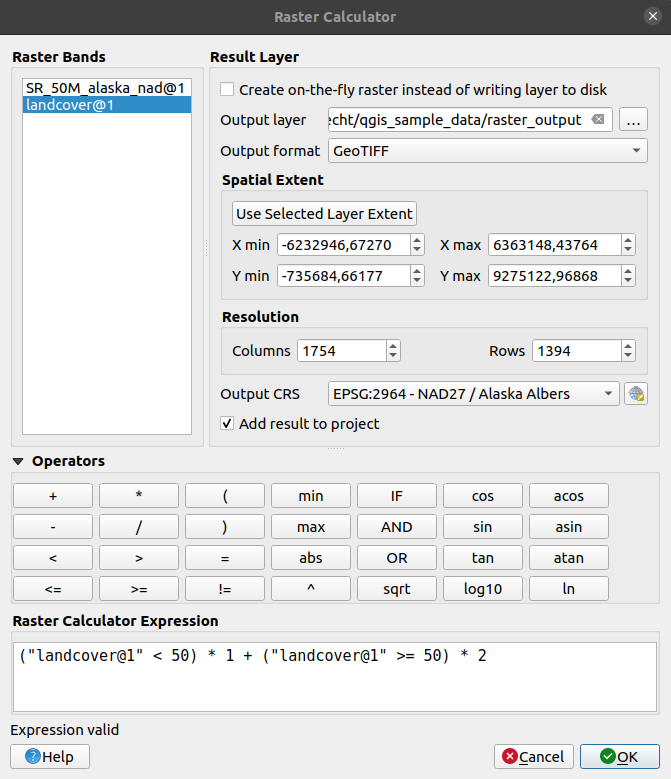

.. index:: Raster analysis
.. _sec_raster_analysis:

******************
 Raster Analysis
******************

.. only:: html

   .. contents::
      :local:

.. index:: Raster calculator
.. _label_raster_calc:

Raster Calculator
==================

The :menuselection:`Raster Calculator` in the :menuselection:`Raster` menu
allows you to perform calculations on the basis of existing
raster pixel values (see :numref:`figure_raster_calculator`).
The results are written to a new raster layer in a GDAL-supported format.

.. _figure_raster_calculator:

   Raster Calculator

The :guilabel:`Raster bands` list contains all loaded raster layers that can be used.
To add a raster to the raster calculator expression field, double
click its name in the Fields list. You can then use the operators to construct
calculation expressions, or you can just type them into the box.

In the :guilabel:`Result layer` section, you will need to define an output layer.
You can:

* |checkbox| :guilabel:`Create on-the-fly raster instead of writing layer to disk`:

  * If unchecked, the output is stored on the disk as a new plain file.
    An :guilabel:`Output layer` path and an :guilabel:`Output format` are required.
  * If checked, a virtual raster layer, i.e. a raster layer defined by its URI and
    whose pixels are calculated on-the-fly, is created. It's not a new file on disk;
    the virtual layer is still connected to the rasters used in the calculation
    meaning that deleting or moving these rasters would break it.
    A :guilabel:`Layer name` can be provided, otherwise the calculation expression
    is used as such. Removing the virtual layer from the project deletes it,
    and it can be made persistent in file using the layer
    :menuselection:`Export --> Save as...` contextual menu.

* Define the :guilabel:`Spatial extent` of the calculation based on an input
  raster layer extent, or on custom X,Y coordinates
* Set the :guilabel:`Resolution` of the layer using columns and rows number.
  If the input layer has a different resolution, the values will be
  resampled with the nearest neighbor algorithm.
* With the |checkbox| :guilabel:`Add result to project` checkbox, the result layer
  will automatically be added to the legend area and can be visualized.
  Checked by default for virtual rasters.

The :guilabel:`Operators` section contains all available operators. To add an operator
to the raster calculator expression box, click the appropriate button. Mathematical
calculations (``+``, ``-``, ``*``, ... ) and trigonometric functions (``sin``,
``cos``, ``tan``, ... ) are available. Conditional expressions (``=``, ``!=``,
``<``, ``>=``, ... ) return either 0 for false or 1 for true, and therefore can be
used with other operators and functions.

.. seealso:: :ref:`qgisrastercalc` and :ref:`qgisvirtualrastercalc` algorithms

.. _raster_expression:

Raster calculator expression
-----------------------------

The dialog
..........

The :guilabel:`Raster calculator expression` dialog provides means to write expressions
for pixels calculations between a set of raster layers.

.. _figure_raster_expression_calculator:

.. figure:: img/raster_calculator_expression.png
   :align: center

   Raster Expression Calculator

* :guilabel:`Layers`: Shows the list of all raster layers loaded in the legend.
  These can be used to fill the expression box (double click to add).
  Raster layers are referred by their name and the number of the band: ``layer_name@band_number``.
  For instance, the first band from a layer named ``DEM`` will be referred as ``DEM@1``.
* :guilabel:`Operators`: contains a number of calculation operators for pixels manipulation:

  * Arithmetical: ``+``, ``-``, ``*``, ``sqrt``, ``abs``, ``ln``, ...
  * Trigonometric: ``sin``, ``cos``, ``tan``, ...
  * Comparison: ``=``, ``!=``, ``<``, ``>=``, ...
  * Logical: ``IF``, ``AND``, ``OR``, ``(``, ``)``
  * Statistical: ``min``, ``max``

  To add an operator to the raster calculator expression box, click the appropriate button.
* :guilabel:`Raster calculator expression` is the area in which the expression is composed

Examples
........

**Convert elevation values from meters to feet**

Creating an elevation raster in feet from a raster in meters, you need to use the
conversion factor for meters to feet: 3.28. The expression is:

::

 "elevation@1" * 3.28

**Using a mask**

If you want to mask out parts of a raster -- say, for instance, because you are
only interested in elevations above 0 meters -- you can use the following expression
to create a mask and apply the result to a raster in one step.

::

  ("elevation@1" >= 0) * "elevation@1"

In other words, for every cell greater than or equal to 0 the conditional expression
evaluates to 1, which keeps the original value by multiplying it by 1.
Otherwise the conditional expression evaluates to 0, which sets the raster value to 0.
This creates the mask on the fly.

**Classify a Raster**

If you want to classify a raster -- say, for instance into two elevation classes,
you can use the following expression to create a raster with two values 1 and 2
in one step.

::

  ("elevation@1" < 50) * 1 + ("elevation@1" >= 50) * 2

In other words, for every cell less than 50 set its value to 1.
For every cell greater than or equal 50 set its value to 2.

Or you can use the ``IF`` operator. 

::

  if ( elevation@1 < 50 , 1 , 2 )

.. Substitutions definitions - AVOID EDITING PAST THIS LINE
   This will be automatically updated by the find_set_subst.py script.
   If you need to create a new substitution manually,
   please add it also to the substitutions.txt file in the
   source folder.

.. |checkbox| image:: /static/common/checkbox.png
   :width: 1.3em
