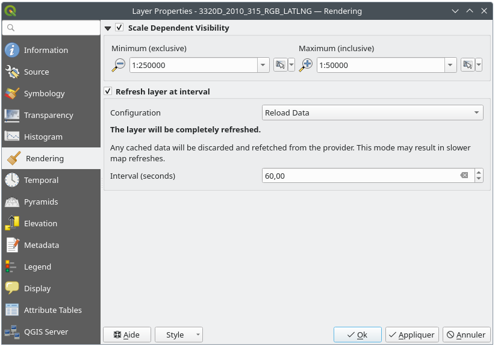

.. index:: Raster, Layer properties
.. _raster_properties_dialog:

************************
Raster Properties Dialog
************************

.. only:: html

   .. contents::
      :local:

To view and set the properties for a raster layer, double click on
the layer name in the map legend, or right click on the layer name and
choose :guilabel:`Properties` from the context menu. This will open the
:guilabel:`Raster Layer Properties` dialog.

There are several tabs in the dialog:

* |metadata| :ref:`Information <raster_information>`
* |system| :ref:`Source <raster_sourcetab>`
* |symbology| :ref:`Symbology <raster_symbology>`
* |transparency| :ref:`Transparency <raster_transparency>`
* |rasterHistogram| :ref:`Histogram <raster_histogram>`
* |rendering| :ref:`Rendering <raster_rendering>`
* |pyramids| :ref:`Pyramids <raster_pyramids>`
* |editMetadata| :ref:`Metadata <raster_metadata>`
* |legend| :ref:`Legend <raster_server>`
* |overlay| :ref:`QGIS Server <raster_server>`

.. tip:: **Live update rendering**

   The :ref:`layer_styling_panel` provides you with some of the common
   features of the Layer properties dialog and is a good modeless
   widget that you can use to speed up the configuration of the layer
   styles and view your changes on the map canvas.

.. note::

   Because properties (symbology, label, actions, default values,
   forms...) of embedded layers (see :ref:`nesting_projects`) are
   pulled from the original project file, and to avoid changes that may
   break this behavior, the layer properties dialog is made unavailable
   for these layers.

.. _raster_information:

Information Properties
======================

The |metadata| :guilabel:`Information` tab is read-only and represents
an interesting place to quickly grab summarized information and
metadata for the current layer.
Provided information are:

* based on the provider of the layer (format of storage, path, data
  type, extent, width/height, compression, pixel size, statistics on
  bands, number of columns, rows and no-data values of the raster...);
* picked from the :ref:`provided metadata <raster_metadata>`: access,
  links, contacts, history... as well as dataset information (CRS,
  Extent, bands...).

.. _raster_sourcetab:

Source Properties
=================

The |system| :guilabel:`Source` tab displays basic information about
the selected raster, including:

* the :guilabel:`Layer name` to display in the :guilabel:`Layers Panel`;
* the :guilabel:`Coordinate Reference System`:
  Displays the layer's
  :ref:`Coordinate Reference System (CRS) <layer_crs>`.
  You can change the layer's CRS, by selecting a recently used one in
  the drop-down list or clicking on the |setProjection|
  :sup:`Select CRS` button (see :ref:`crs_selector`).
  Use this process only if the layer CRS is a wrong or not specified.
  If you wish to reproject your data, use a reprojection algorithm
  from Processing or
  :ref:`Save it as new dataset <general_saveas>`.

.. _figure_raster_properties:

.. figure:: img/rasterPropertiesDialog.png
   :align: center

   Raster Layer Properties - Source Dialog

.. index:: Symbology, Single Band Raster, Three Band Color Raster,
   Multi Band Raster

.. _raster_symbology:

Symbology Properties
====================

Band rendering
--------------

QGIS offers four different :guilabel:`Render types`.
The choice of renderer depends on the data type.

#. :ref:`Multiband color <multiband_color>` - if the file comes
   with several bands (e.g. a satellite image with several bands).
#. :ref:`Paletted/Unique values <paletted>` - for single band files
   that come with an indexed palette (e.g. a digital topographic
   map) or for general use of palettes for rendering raster layers.
#. :ref:`Singleband gray <singleband_gray>` - (one band of) the
   image will be rendered as gray.
   QGIS will choose this renderer if the file is neither multiband
   nor paletted (e.g. a shaded relief map).
#. :ref:`Singleband pseudocolor <label_colormaptab>` - this renderer
   can be used for files with a continuous palette or color map
   (e.g. an elevation map).
#. :ref:`Hillshade <hillshade_renderer>` - Creates hillshade from a
   band.

.. _multiband_color:

Multiband color
...............

With the multiband color renderer, three selected bands from the image
will be used as the red, green or blue component of the color image.
QGIS automatically fetches :guilabel:`Min` and :guilabel:`Max` values
for each band of the raster and scales the coloring accordingly.
You can control the value ranges in the
:ref:`Min/Max Value Settings <minmaxvalues>` section.

A :guilabel:`Contrast enhancement` method can be applied to the values:
'No enhancement', 'Stretch to MinMax', 'Stretch and clip to MinMax'
and 'Clip to min max'.

.. index:: Contrast enhancement

.. note:: **Contrast enhancement**

   When adding GRASS rasters, the option *Contrast enhancement* will
   always be set automatically to *stretch to min max*, even if this
   is set to another value in the QGIS general options.

.. _figure_raster_multiband:

.. figure:: img/rasterMultibandColor.png
   :align: center

   Raster Symbology - Multiband color rendering

.. tip:: **Viewing a Single Band of a Multiband Raster**

   If you want to view a single band of a multiband image (for
   example, Red), you might think you would set the Green and Blue
   bands to :guilabel:`Not Set`.
   But the preferred way of doing this is to set the image type to
   :ref:`Singleband gray <singleband_gray>`, and then select Red as
   the :guilabel:`Gray band` to use.

.. _paletted:

Paletted/Unique values
......................

This is the standard render option for singleband files that include
a color table, where a certain color is assigned to each pixel value.
In that case, the palette is rendered automatically.

It can be used for all kinds of raster bands, assigning a
color to each unique raster value.

If you want to change a color, just double-click on the color and
the :guilabel:`Select color` dialog appears.

It is also possible to assign labels to the colors.
The label will then appear in the legend of the raster layer.

Right-clicking over selected rows in the color table shows a
contextual menu to:

* :guilabel:`Change Color...` for the selection
* :guilabel:`Change Opacity...` for the selection
* :guilabel:`Change Label...` for the selection

.. _figure_raster_paletted_unique:

.. figure:: img/rasterPalettedUniqueValue.png
   :align: center

   Raster Symbology - Paletted unique value rendering

The pulldown menu, that opens when clicking the :guilabel:`...`
(:guilabel:`Advanced options`) button below the color map to the
right, offers color map loading
(:guilabel:`Load Color Map from File...`) and exporting
(:guilabel:`Export Color Map to File...`), and loading of classes
(:guilabel:`Load Classes from Layer`).

.. _singleband_gray:

Singleband gray
...............

This renderer allows you to render a single band layer with a
:guilabel:`Color gradient`: 'Black to white' or 'White to black'.
You can change the range of values to color (:guilabel:`Min` and
:guilabel:`Max`) in the
:ref:`Min/Max Value Settings <minmaxvalues>`.

A :guilabel:`Contrast enhancement` method can be applied to the
values: 'No enhancement', 'Stretch to MinMax', 'Stretch and clip
to MinMax' and 'Clip to min max'.

.. _figure_raster_gray:

.. figure:: img/rasterSingleBandGray.png
   :align: center

   Raster Symbology - Singleband gray rendering

.. index:: Color map, Color interpolation, Discrete
.. _label_colormaptab:

Singleband pseudocolor
......................

This is a render option for single-band files that include a
continuous palette.
You can also create color maps for a bands of a multiband raster.

.. _figure_raster_pseudocolor:

.. figure:: img/rasterSingleBandPseudocolor.png
   :align: center

   Raster Symbology - Singleband pseudocolor rendering

Using a :guilabel:`Band` of the layer and a
:ref:`values range <minmaxvalues>`, three types of color
:guilabel:`Interpolation` are available:

* Discrete (a ``<=`` symbol appears in the header of the
  :guilabel:`Value` column)
* Linear
* Exact (an ``=`` symbol appears in the header of the
  :guilabel:`Value` column)

The :guilabel:`Color ramp` drop down lists the available color ramps.
You can create a new one and edit or save the currently selected one.
The name of the color ramp will be saved in the configuration and in
the QML file.

The :guilabel:`Label unit suffix` is a label added after the value in
the legend.

For classification :guilabel:`Mode` |selectString| 'Equal interval',
you only need to select the :guilabel:`number of classes`
|selectNumber| and press the button :guilabel:`Classify`.
For :guilabel:`Mode` |selectString| 'Continuous', QGIS creates
classes automatically depending on :guilabel:`Min` and
:guilabel:`Max`.

The button |signPlus| :sup:`Add values manually` adds a value
to the table.
The button |signMinus| :sup:`Remove selected row` deletes a value from
the table.
Double clicking in the :guilabel:`Value` column lets you insert a
specific value.
Double clicking in the :guilabel:`Color` column opens the dialog
:guilabel:`Change color`, where you can select a color to apply for
that value.
Further, you can also add labels for each color, but this value won't
be displayed when you use the identify feature tool.

Right-clicking over selected rows in the color table shows a
contextual menu to:

* :guilabel:`Change Color...` for the selection
* :guilabel:`Change Opacity...` for the selection

You can use the buttons |fileOpen| :sup:`Load color map from file`
or |fileSaveAs| :sup:`Export color map to file` to load an existing
color table or to save the color table for later use.

The |checkbox| :guilabel:`Clip out of range values` allows QGIS to
not render pixel greater than the :guilabel:`Max` value.

.. index:: Hillshade
.. _hillshade_renderer:

Hillshade
.........

Render a band of the raster layer using hillshading.

.. _figure_raster_hillshade:

.. figure:: img/rasterHillshade.png
   :align: center

   Raster Symbology - Hillshade rendering

Options:

* :guilabel:`Band`: The raster band to use.
* :guilabel:`Altitude`: The elevation angle of the light source
  (default is ``45°``).
* :guilabel:`Azimuth`: The azimuth of the light source (default is
  ``315°``).
* :guilabel:`Z Factor`: Scaling factor for the values of the raster
  band (default is ``1``).
* |checkbox| :guilabel:`Multidirectional`: Specify if multidirectional
  hillshading is to be used (default is ``off``).

.. _minmaxvalues:

Setting the min and max values
..............................

By default, QGIS reports the :guilabel:`Min` and :guilabel:`Max`
values of the band(s) of the raster.
A few very low and/or high values can have a negative impact on the
rendering of the raster.
The :guilabel:`Min/Max Value Settings` frame helps you control the
rendering.

.. _figure_raster_minmaxvalues:

.. figure:: img/rasterMinMaxValues.png
   :align: center

   Raster Symbology - Min and Max Value Settings

Available options are:

* |radioButtonOff| :guilabel:`User defined`: The default
  :guilabel:`Min` and :guilabel:`Max` values of the band(s) can be
  overridden
* |radioButtonOff| :guilabel:`Cumulative count cut`: Removes outliers.
  The standard range of values is ``2%`` to ``98%``, but it can
  be adapted manually.
* |radioButtonOn| :guilabel:`Min / max`: Uses the whole range of
  values in the image band.
* |radioButtonOff| :guilabel:`Mean +/- standard deviation x`: Creates
  a color table that only considers values within the standard
  deviation or within multiple standard deviations.
  This is useful when you have one or two cells with abnormally
  high values in a raster layer that impact the rendering of the
  raster negatively.

Calculations of the min and max values of the bands are made based
on the:

* :guilabel:`Statistics extent`: it can be :guilabel:`Whole raster`,
  :guilabel:`Current canvas` or :guilabel:`Updated canvas`.
  :guilabel:`Updated canvas` means that min/max values used for the
  rendering will change with the canvas extent (dynamic stretching).
* :guilabel:`Accuracy`, which can be either
  :guilabel:`Estimate (faster)` or :guilabel:`Actual (slower)`.

.. note:: For some settings, you may need to press the
  :guilabel:`Apply` button of the layer properties dialog in order
  to display the actual min and max values in the widgets.

Color rendering
---------------

For all kinds of :guilabel:`Band rendering`, the
:guilabel:`Color rendering` set.

You can achieve special rendering effects for your raster file(s)
by using one of the blending modes (see :ref:`blend-modes`).

Further settings can be made by modifying the :guilabel:`Brightness`,
:guilabel:`Saturation` and :guilabel:`Contrast`.
You can also use a :guilabel:`Grayscale` option, where you can choose
between 'Off', 'By lightness', 'By luminosity' and 'By average'.
For one :guilabel:`Hue` in the color table, you can modify the
'Strength'.

Resampling
----------

The :guilabel:`Resampling` option has effect when you zoom in and out
of an image.
Resampling modes can optimize the appearance of the map.
They calculate a new gray value matrix through a geometric
transformation.

.. _figure_raster_resampling:

.. figure:: img/rasterRenderAndRessampling.png
   :align: center

   Raster Symbology - Color rendering and Resampling settings

When applying the 'Nearest neighbour' method, the map can get a
pixelated structure when zooming in.
This appearance can be improved by using the 'Bilinear' or 'Cubic'
method, which cause sharp edges to be blurred.
The effect is a smoother image.
This method can be applied to for instance digital topographic
raster maps.

At the bottom of the :guilabel:`Symbology` tab, you can see a
thumbnail of the layer, its legend symbol, and the palette.

.. index:: Transparency
.. _raster_transparency:

Transparency Properties
=======================

|transparency| QGIS has the ability to set the transparency level
of a raster layer.
Use the transparency slider |slider| to set to what extent the
underlying layers (if any) should be visible through the current
raster layer.
This is very useful if you overlay raster layers (e.g., a shaded
relief map overlayed by a classified raster map).
This will make the look of the map more three dimensional.

.. _figure_raster_transparency:

.. figure:: img/rasterTransparency.png
   :align: center

   Raster Transparency

Additionally, you can enter a raster value that should be treated as
an :guilabel:`Additional no data value`.

An even more flexible way to customize the transparency is available
in the :guilabel:`Custom transparency options` section:

* Use :guilabel:`Transparency band` to apply transparency for an entire
  band.
* Provide a list of pixels to make transparent with corresponding
  levels of transparency:

  #. Click the |signPlus| :sup:`Add values manually` button.
     A new row will appear in the pixel list.
  #. Enter the **Red**, **Green** and **Blue** values of the pixel and
     adjust the **Percent Transparent** to apply.
  #. Alternatively, you can fetch the pixel values directly from the
     raster using the |contextHelp| :sup:`Add values from display`
     button.
     Then enter the transparency value.
  #. Repeat the steps to adjust more values with custom transparency.
  #. Press the :guilabel:`Apply` button and have a look at the map.

  As you can see, it is quite easy to set custom transparency, but
  it can be quite a lot of work.
  Therefore, you can use the button |fileSave| :sup:`Export to file`
  to save your transparency list to a file.
  The button |fileOpen| :sup:`Import from file` loads your transparency
  settings and applies them to the current raster layer.

.. index:: Histogram
.. _raster_histogram:

Histogram Properties
====================

The |rasterHistogram| :guilabel:`Histogram` tab allows you to view
the distribution of the values in your raster.
The histogram is generated when you press the
:guilabel:`Compute Histogram` button.
All existing bands will be displayed together.
You can save the histogram as an image with the |fileSave| button.

At the bottom of the histogram, you can select a raster band in the
drop-down menu and :guilabel:`Set min/max style for` it.
The |actionRun| :guilabel:`Prefs/Actions` drop-down menu gives you
advanced options to customize the histogram:

* With the :guilabel:`Visibility` option, you can display histograms
  for individual bands.
  You will need to select the option |radioButtonOff|
  :guilabel:`Show selected band`.
* The :guilabel:`Min/max options` allow you to
  'Always show min/max markers', to 'Zoom to min/max' and to
  'Update style to min/max'.
* The :guilabel:`Actions` option allows you to 'Reset' or
  'Recompute histogram' after you have changed the min or max values
  of the band(s).

.. _figure_raster_histogram:

.. figure:: img/rasterHistogram.png
   :align: center

   Raster Histogram

.. index:: Rendering
.. _raster_rendering:

Rendering Properties
====================

In the |rendering| :guilabel:`Rendering` tab, it's possible to:

* set :guilabel:`Scale dependent visibility` for the layer:
  You can set the :guilabel:`Maximum (inclusive)` and
  :guilabel:`Minimum (exclusive)` scale, defining a range of scales in
  which the layer will be visible.
  It will be hidden outside this range.
  The |mapIdentification| :sup:`Set to current canvas scale` button
  helps you use the current map canvas scale as a boundary.
  See :ref:`label_scaledepend` for more information.
* :guilabel:`Refresh layer at interval (seconds)`: set a timer to
  automatically refresh individual layers.
  Canvas updates are deferred in order to avoid refreshing multiple
  times if more than one layer has an auto update interval set.

.. _figure_raster_rendering:

   Raster Rendering

.. index:: Pyramids
.. _raster_pyramids:

Pyramids Properties
===================

High resolution raster layers can slow navigation in QGIS.
By creating lower resolution copies of the data (pyramids),
performance can be considerably improved, as QGIS selects the most
suitable resolution to use depending on the zoom level.

You must have write access in the directory where the original data
is stored to build pyramids.

From the :guilabel:`Resolutions` list, select resolutions at which
you want to create pyramid levels by clicking on them.

If you choose **Internal (if possible)** from the
:guilabel:`Overview format` drop-down menu, QGIS tries to build
pyramids internally.

.. note::

   Please note that building pyramids may alter the original data
   file, and once created they cannot be removed.
   If you wish to preserve a 'non-pyramided' version of your raster,
   make a backup copy prior to pyramid building.

If you choose **External** and **External (Erdas Imagine)** the
pyramids will be created in a file next to the original raster with
the same name and a :file:`.ovr` extension.

Several :guilabel:`Resampling methods` can be used for pyramid
calculation:

* Nearest Neighbour
* Average
* Gauss
* Cubic
* Cubic Spline
* Laczos
* Mode
* None

Finally, click :guilabel:`Build Pyramids` to start the process.

.. _figure_raster_pyramids:

.. figure:: img/rasterPyramids.png
   :align: center

   Raster Pyramids

.. index:: Metadata, Metadata editor, Keyword
.. _raster_metadata:

Metadata Properties
===================

The |editMetadata| :guilabel:`Metadata` tab provides you with options
to create and edit a metadata report on your layer.
See :ref:`vector layer metadata properties <vectormetadatamenu>` for
more information.

.. _figure_raster_metadata:

.. figure:: img/rasterMetadata.png
   :align: center

   Raster Metadata

.. index:: Legend, Embedded widget
.. _raster_legend:

Legend Properties
=================

The |legend| :guilabel:`Legend` tab provides you with a list of
widgets you can embed within the layer tree in the Layers panel.
The idea is to have a way to quickly access some actions that are
often used with the layer (setup transparency, filtering, selection,
style or other stuff...).

By default, QGIS provides a transparency widget but this can be
extended by plugins that register their own widgets and assign
custom actions to layers they manage.

.. _figure_raster_legend:

.. figure:: img/rasterLegend.png
   :align: center

   Raster Legend

.. index:: QGIS Server
.. _raster_server:

QGIS Server Properties
======================

From the |overlay| :guilabel:`QGIS Server` tab, information can
be provided for :guilabel:`Description`, :guilabel:`Attribution`,
:guilabel:`MetadataUrl` and :guilabel:`LegendUrl`.

.. _figure_raster_server:

.. figure:: img/rasterServer.png
   :align: center

   QGIS Server in Raster Properties

.. Substitutions definitions - AVOID EDITING PAST THIS LINE
   This will be automatically updated by the find_set_subst.py script.
   If you need to create a new substitution manually,
   please add it also to the substitutions.txt file in the
   source folder.

.. |actionRun| image:: /static/common/mAction.png
   :width: 1.5em
.. |checkbox| image:: /static/common/checkbox.png
   :width: 1.3em
.. |contextHelp| image:: /static/common/mActionContextHelp.png
   :width: 1.5em
.. |editMetadata| image:: /static/common/editmetadata.png
   :width: 1.2em
.. |fileOpen| image:: /static/common/mActionFileOpen.png
   :width: 1.5em
.. |fileSave| image:: /static/common/mActionFileSave.png
   :width: 1.5em
.. |fileSaveAs| image:: /static/common/mActionFileSaveAs.png
   :width: 1.5em
.. |legend| image:: /static/common/legend.png
   :width: 1.2em
.. |mapIdentification| image:: /static/common/mActionMapIdentification.png
   :width: 1.5em
.. |metadata| image:: /static/common/metadata.png
   :width: 1.5em
.. |overlay| image:: /static/common/overlay.png
   :width: 1.5em
.. |pyramids| image:: /static/common/pyramids.png
   :width: 1.5em
.. |radioButtonOff| image:: /static/common/radiobuttonoff.png
   :width: 1.5em
.. |radioButtonOn| image:: /static/common/radiobuttonon.png
   :width: 1.5em
.. |rasterHistogram| image:: /static/common/rasterHistogram.png
   :width: 1.5em
.. |rendering| image:: /static/common/rendering.png
   :width: 1.5em
.. |selectNumber| image:: /static/common/selectnumber.png
   :width: 2.8em
.. |selectString| image:: /static/common/selectstring.png
   :width: 2.5em
.. |setProjection| image:: /static/common/mActionSetProjection.png
   :width: 1.5em
.. |signMinus| image:: /static/common/symbologyRemove.png
   :width: 1.5em
.. |signPlus| image:: /static/common/symbologyAdd.png
   :width: 1.5em
.. |slider| image:: /static/common/slider.png
.. |symbology| image:: /static/common/symbology.png
   :width: 2em
.. |system| image:: /static/common/system.png
   :width: 1.5em
.. |transparency| image:: /static/common/transparency.png
   :width: 1.5em
