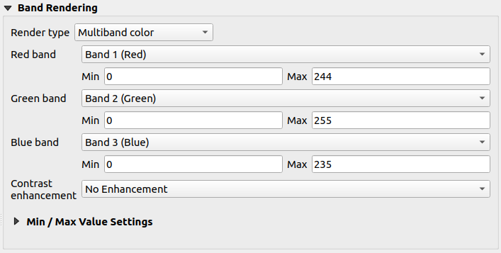
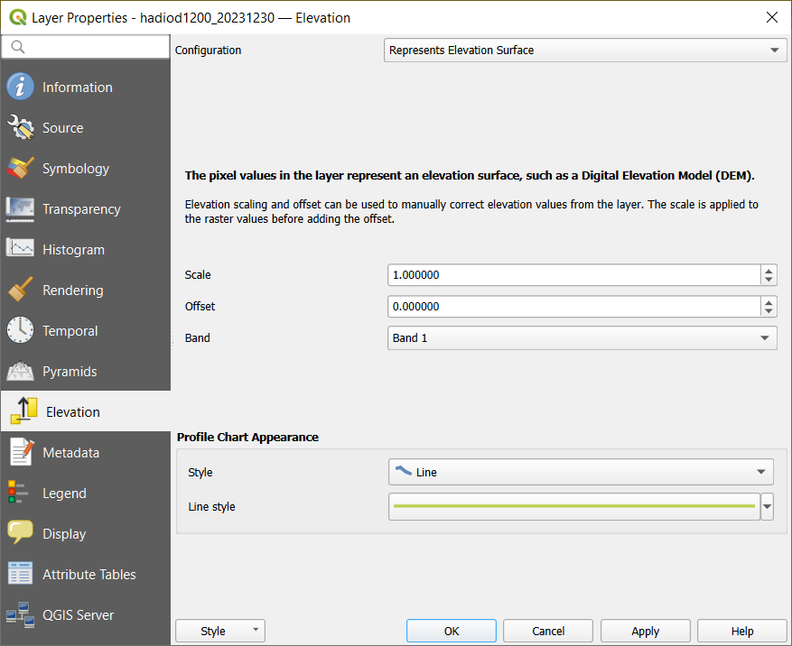
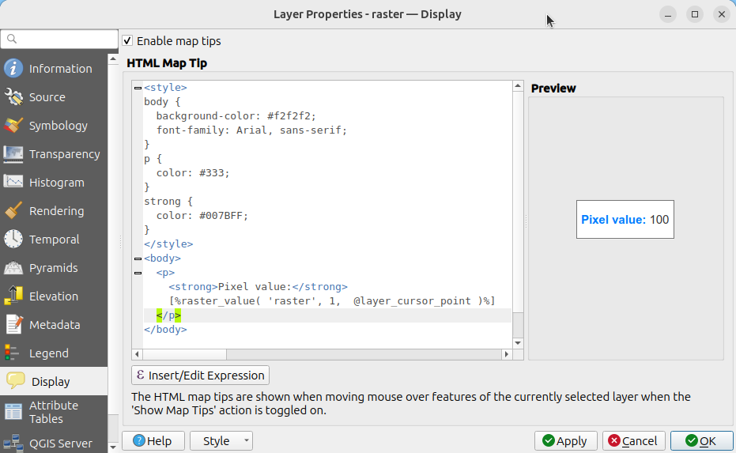

.. index:: Raster, Layer properties
.. _raster_properties_dialog:

************************
Raster Properties Dialog
************************

.. only:: html

   .. contents::
      :local:

Raster data is made up of pixels (or cells), and each pixel has a value.
It is commonly used to store various types of data, including:

* Imagery, such as satellite images, digital aerial photographs, scanned maps
* Elevation data, such as digital elevation models (DEMs), digital terrain models (DTMs)
* Other types of data, such as land cover, soil types, rainfall and many others.

Raster data can be stored in several supported formats, including GeoTIFF,
ERDAS Imagine, ArcInfo ASCII GRID, PostGIS Raster and others.
See more at :ref:`opening_data`.

To view and set the properties for a raster layer, double click on
the layer name in the map legend, or right click on the layer name and
choose :guilabel:`Properties` from the context menu. This will open the
:guilabel:`Raster Layer Properties` dialog.

There are several tabs in the dialog:

.. list-table::

  * - |metadata| :ref:`Information <raster_information>`
    - |system| :ref:`Source <raster_sourcetab>`
    - |symbology| :ref:`Symbology <raster_symbology>`:sup:`[1]`
  * - |transparency| :ref:`Transparency <raster_transparency>`:sup:`[1]`
    - |rasterHistogram| :ref:`Histogram <raster_histogram>`:sup:`[1]`
    - |rendering| :ref:`Rendering <raster_rendering>`
  * - |temporal| :ref:`Temporal <raster_temporal>`
    - |pyramids| :ref:`Pyramids <raster_pyramids>`
    - |elevationscale| :ref:`Elevation <raster_elevation>`
  * - |editMetadata| :ref:`Metadata <raster_metadata>`
    - |legend| :ref:`Legend <raster_server>`
    - |display| :ref:`Display <raster_display>`
  * - |overlay| :ref:`QGIS Server <raster_server>`
    - :ref:`External plugins <plugins>`:sup:`[2]` tabs
    -

:sup:`[1]` Also available in the :ref:`Layer styling panel <layer_styling_panel>`

:sup:`[2]` :ref:`External plugins <plugins>` you install can optionally add tabs to this
dialog. Those are not presented in this document. Refer to their documentation.

.. tip:: **Live update rendering**

   The :ref:`layer_styling_panel` provides you with some of the common
   features of the Layer properties dialog and is a good modeless
   widget that you can use to speed up the configuration of the layer
   styles and view your changes on the map canvas.

.. note::

   Because properties (symbology, label, actions, default values,
   forms...) of embedded layers (see :ref:`nesting_projects`) are
   pulled from the original project file, and to avoid changes that may
   break this behavior, the layer properties dialog is made unavailable
   for these layers.

.. _raster_information:

Information Properties
======================

The |metadata| :guilabel:`Information` tab is read-only and represents
an interesting place to quickly grab summarized information and
metadata for the current layer.
Provided information are:

* general such as name in the project, source path, list of auxiliary files,
  last save time and size, the used provider
* based on the provider of the layer: extent, width and height, data type,
  GDAL driver, bands statistics
* the Coordinate Reference System: name, units, method, accuracy, reference
  (i.e. whether it's static or dynamic)
* read from layer properties: data type, extent, width/height, compression,
  pixel size, statistics on bands, number of columns, rows and no-data values
  of the raster...
* picked from the :ref:`filled metadata <raster_metadata>`: access, extents,
  links, contacts, history...

.. _raster_sourcetab:

Source Properties
=================

The |system| :guilabel:`Source` tab displays basic information about
the selected raster, including:

* the :guilabel:`Layer name` to display in the :guilabel:`Layers Panel`;
* the :guilabel:`Coordinate Reference System`:
  Displays the layer's
  :ref:`Coordinate Reference System (CRS) <layer_crs>`.
  You can change the layer's CRS, by selecting a recently used one in
  the drop-down list or clicking on the |setProjection|
  :sup:`Select CRS` button (see :ref:`crs_selector`).
  Use this process only if the layer CRS is a wrong or not specified.
  If you wish to reproject your data, use a reprojection algorithm
  from Processing or
  :ref:`Save it as new dataset <general_saveas>`.

.. _figure_raster_properties:

.. figure:: img/rasterPropertiesDialog.png
   :align: center

   Raster Layer Properties - Source Dialog

.. index:: Symbology, Single Band Raster, Three Band Color Raster,
   Multi Band Raster

.. _raster_symbology:

Symbology Properties
====================

The raster layer symbology tab is made of three different sections:

* The :guilabel:`Band rendering` where you can control the renderer type to use
* The :guilabel:`Layer rendering` to apply effects on rendered data
* The :guilabel:`Resampling` methods to optimize rendering on map

Band rendering
--------------

QGIS offers many different :guilabel:`Render types`.
The choice of renderer depends on the data type and the
information you'd like to highlight.

#. :ref:`Multiband color <multiband_color>` - if the file comes
   with several bands (e.g. a satellite image with several bands).
#. :ref:`Paletted/Unique values <paletted>` - for single band files
   that come with an indexed palette (e.g. a digital topographic
   map) or for general use of palettes for rendering raster layers.
#. :ref:`Singleband gray <singleband_gray>` - (one band of) the
   image will be rendered as gray.
   QGIS will choose this renderer if the file is neither multiband
   nor paletted (e.g. a shaded relief map).
#. :ref:`Singleband pseudocolor <label_colormaptab>` - this renderer
   can be used for files with a continuous palette or color map
   (e.g. an elevation map).
#. :ref:`Hillshade <hillshade_renderer>` - Creates hillshade from a
   band.
#. :ref:`Contours <raster_contours>` - Generates contours on the
   fly for a source raster band.

.. _multiband_color:

Multiband color
...............

With the multiband color renderer, three selected bands from the image
will be used as the red, green or blue component of the color image.
QGIS automatically fetches :guilabel:`Min` and :guilabel:`Max` values
for each band of the raster and scales the coloring accordingly.
You can control the value ranges in the
:ref:`Min/Max Value Settings <minmaxvalues>` section.

A :guilabel:`Contrast enhancement` method can be applied to the values:
'No enhancement', 'Stretch to MinMax', 'Stretch and clip to MinMax'
and 'Clip to min max'.

.. index:: Contrast enhancement

.. note:: **Contrast enhancement**

   When adding GRASS rasters, the option *Contrast enhancement* will
   always be set automatically to *stretch to min max*, even if this
   is set to another value in the QGIS general options.

.. _figure_raster_multiband:

   Raster Symbology - Multiband color rendering

.. tip:: **Viewing a Single Band of a Multiband Raster**

   If you want to view a single band of a multiband image (for
   example, Red), you might think you would set the Green and Blue
   bands to :guilabel:`Not Set`.
   But the preferred way of doing this is to set the image type to
   :ref:`Singleband gray <singleband_gray>`, and then select Red as
   the :guilabel:`Gray band` to use.

.. _paletted:

Paletted/Unique values
......................

This is the standard render option for singleband files that include
a color table, where a certain color is assigned to each pixel value.
In that case, the palette is rendered automatically.

It can be used for all kinds of raster bands, assigning a
color to each unique raster value.

If you want to change a color, just double-click on the color and
the :guilabel:`Select color` dialog appears.

It is also possible to assign labels to the colors.
The label will then appear in the legend of the raster layer.

Right-clicking over selected rows in the color table shows a
contextual menu to:

* :guilabel:`Change Color...` for the selection
* :guilabel:`Change Opacity...` for the selection
* :guilabel:`Change Label...` for the selection

.. _figure_raster_paletted_unique:

.. figure:: img/rasterPalettedUniqueValue.png
   :align: center

   Raster Symbology - Paletted unique value rendering

The pulldown menu, that opens when clicking the :guilabel:`...`
(:sup:`Advanced options`) button below the color map to the
right, offers color map loading
(:guilabel:`Load Color Map from File...`) and exporting
(:guilabel:`Export Color Map to File...`), and loading of classes
(:guilabel:`Load Classes from Layer`).

.. _singleband_gray:

Singleband gray
...............

This renderer allows you to render a layer using only one band with a
:guilabel:`Color gradient`: 'Black to white' or 'White to black'.
You can change the range of values to color (:guilabel:`Min` and
:guilabel:`Max`) in the
:ref:`Min/Max Value Settings <minmaxvalues>`.

A :guilabel:`Contrast enhancement` method can be applied to the
values: 'No enhancement', 'Stretch to MinMax', 'Stretch and clip
to MinMax' and 'Clip to min max'.

.. _figure_raster_gray:

.. figure:: img/rasterSingleBandGray.png
   :align: center

   Raster Symbology - Singleband gray rendering

Pixels are assigned a color based on the selected color gradient and the
layer's legend (in the :guilabel:`Layers` panel and the layout :ref:`legend
item <layout_legend_item>`) is displayed using a continuous color ramp.
Press :guilabel:`Legend settings...` if you wish to tweak the settings.
More details at :ref:`raster_legend_settings`.

.. index:: Color map, Color interpolation, Discrete
.. _label_colormaptab:

Singleband pseudocolor
......................

This is a render option for single-band files that include a
continuous palette.
You can also create color maps for a band of a multiband raster.

.. _figure_raster_pseudocolor:

.. figure:: img/rasterSingleBandPseudocolor.png
   :align: center

   Raster Symbology - Singleband pseudocolor rendering

Using a :guilabel:`Band` of the layer and a :ref:`values range <minmaxvalues>`,
you can now interpolate and assign representation color to pixels within classes.
More at :ref:`color_ramp_shader`.

Pixels are assigned a color based on the selected color ramp and the
layer's legend (in the :guilabel:`Layers` panel and the layout :ref:`legend
item <layout_legend_item>`) is displayed using a continuous color ramp.
Press :guilabel:`Legend settings...` if you wish to tweak the settings
or instead use a legend with separated classes (and colors).
More details at :ref:`raster_legend_settings`.

.. index:: Hillshade
.. _hillshade_renderer:

Hillshade
.........

Render a band of the raster layer using hillshading.

.. _figure_raster_hillshade:

.. figure:: img/rasterHillshade.png
   :align: center

   Raster Symbology - Hillshade rendering

Options:

* :guilabel:`Band`: The raster band to use.
* :guilabel:`Altitude`: The elevation angle of the light source
  (default is ``45°``).
* :guilabel:`Azimuth`: The azimuth of the light source (default is
  ``315°``).
* :guilabel:`Z Factor`: Scaling factor for the values of the raster
  band (default is ``1``).
* |checkbox| :guilabel:`Multidirectional`: Specify if multidirectional
  hillshading is to be used (default is ``off``).

.. _raster_contours:

Contours
........

This renderer draws contour lines that are calculated on the fly from
the source raster band.

.. _figure_raster_contours:

.. figure:: img/rasterContours.png
   :align: center

   Raster Symbology - Contours rendering

Options:

* :guilabel:`Input band`: the raster band to use.
* :guilabel:`Contour interval`: the distance between two consecutive contour lines
* :guilabel:`Contour symbol`: the :ref:`symbol <vector_line_symbols>` to apply
  to the common contour lines.
* :guilabel:`Index contour interval`: the distance between two consecutive
  **index contours**, that is the lines shown in a distinctive manner for ease
  of identification, being commonly printed more heavily than other contour
  lines and generally labeled with a value along its course.
* :guilabel:`Index contour symbol`: the symbol to apply to the index contour lines
* :guilabel:`Input downscaling`: Indicates by how much the renderer will scale
  down the request to the data provider (default is ``4.0``).

  For example, if you generate contour lines on input raster block with the
  same size as the output raster block, the generated lines would contain too
  much detail. This detail can be reduced by the "downscale" factor, requesting
  lower resolution of the source raster.
  For a raster block 1000x500 with downscale 10, the renderer will request
  raster 100x50 from provider. Higher downscale makes contour lines
  more simplified (at the expense of losing some detail).

.. _minmaxvalues:

Setting the min and max values
..............................

By default, QGIS reports the :guilabel:`Min` and :guilabel:`Max`
values of the band(s) of the raster.
A few very low and/or high values can have a negative impact on the
rendering of the raster.
The :guilabel:`Min/Max Value Settings` frame helps you control the
rendering.

.. _figure_raster_minmaxvalues:

.. figure:: img/rasterMinMaxValues.png
   :align: center

   Raster Symbology - Min and Max Value Settings

Available options are:

* |radioButtonOff| :guilabel:`User defined`: The default
  :guilabel:`Min` and :guilabel:`Max` values of the band(s) can be
  overridden
* |radioButtonOff| :guilabel:`Cumulative count cut`: Removes outliers.
  The standard range of values is ``2%`` to ``98%``, but it can
  be adapted manually.
* |radioButtonOn| :guilabel:`Min / max`: Uses the whole range of
  values in the image band.
* |radioButtonOff| :guilabel:`Mean +/- standard deviation x`: Creates
  a color table that only considers values within the standard
  deviation or within multiple standard deviations.
  This is useful when you have one or two cells with abnormally
  high values in a raster layer that impact the rendering of the
  raster negatively.

Calculations of the min and max values of the bands are made based
on the:

* :guilabel:`Statistics extent`: it can be :guilabel:`Whole raster`,
  :guilabel:`Current canvas` or :guilabel:`Updated canvas`.
  :guilabel:`Updated canvas` means that min/max values used for the
  rendering will change with the canvas extent (dynamic stretching).
* :guilabel:`Accuracy`, which can be either
  :guilabel:`Estimate (faster)` or :guilabel:`Actual (slower)`.

.. note:: For some settings, you may need to press the
  :guilabel:`Apply` button of the layer properties dialog in order
  to display the actual min and max values in the widgets.

.. _color_ramp_shader:

Color ramp shader classification
................................

This method can be used to classify and represent scalar dataset (raster or
mesh contour) based on their values.
Given a :ref:`color ramp <color-ramp>` and a number of classes, it generates
intermediate color map entries for class limits. Each color is mapped with a
value interpolated from a range of values and according to a classification mode.
The scalar dataset elements are then assigned their color based on their class.

.. _figure_raster_colorrampshader:

.. figure:: img/color_ramp_shader.png
   :align: center

   Classifying a dataset with a color ramp shader

#. A :guilabel:`Min` and :guilabel:`Max` values must be defined and used to
   interpolate classes bounds. By default QGIS detects them from the dataset
   but they can be modified.
#. The :guilabel:`Interpolation` entry defines how scalar elements are assigned
   their color :

   * :guilabel:`Discrete` (a ``<=`` symbol appears in the header of the
     :guilabel:`Value` column): The color is taken from the closest color map
     entry with equal or higher value
   * :guilabel:`Linear`: The color is linearly interpolated from the color map
     entries above and below the pixel value, meaning that to each dataset
     value corresponds a unique color
   * :guilabel:`Exact` (a ``=`` symbol appears in the header of the
     :guilabel:`Value` column): Only pixels with value equal to a color map
     entry are applied a color; others are not rendered.
#. The :guilabel:`Color ramp` widget helps you select the color ramp to assign
   to the dataset. As usual with :ref:`this widget <color_ramp_widget>`,
   you can create a new one and edit or save the currently selected one.
   The name of the color ramp will be saved in the configuration.
#. The :guilabel:`Label unit suffix` adds a label after the value in
   the legend, and the :guilabel:`Label precision` controls the number of
   decimals to display.
#. The classification :guilabel:`Mode` helps you define how values are
   distributed across the classes:

   * :guilabel:`Equal interval`: Provided the :guilabel:`Number of classes`,
     limits values are defined so that the classes all have the same magnitude.
   * :guilabel:`Continuous`: Classes number and color are fetched from
     the color ramp stops; limits values are set following stops distribution
     in the color ramp.
   * :guilabel:`Quantile`: Provided the :guilabel:`Number of classes`, limits
     values are defined so that the classes have the same number of elements.
     Not available with :ref:`mesh layers <mesh_symbology_contours>`.
#. You can then :guilabel:`Classify` or tweak the classes:

   * The button |symbologyAdd| :sup:`Add values manually` adds a value to the table.
   * The button |symbologyRemove| :sup:`Remove selected row` deletes selected values
     from the table.
   * Double clicking in the :guilabel:`Value` column lets you modify the class value.
   * Double clicking in the :guilabel:`Color` column opens the dialog
     :guilabel:`Change color`, where you can select a color to apply for
     that value.
   * Double clicking in the :guilabel:`Label` column to modify the label of
     the class, but this value won't be displayed when you use the identify
     feature tool.
   * Right-clicking over selected rows in the color table shows a contextual
     menu to :guilabel:`Change Color...` and :guilabel:`Change Opacity...`
     for the selection.

   You can use the buttons |fileOpen| :sup:`Load color map from file`
   or |fileSaveAs| :sup:`Export color map to file` to load an existing
   color table or to save the color table for later use.

#. With linear :guilabel:`Interpolation`, you can also configure:

   * |checkbox| :guilabel:`Clip out of range values`: By default, the linear
     method assigns the first class (respectively the last class) color to
     values in the dataset that are lower than the set :guilabel:`Min`
     (respectively greater than the set :guilabel:`Max`) value.
     Check this setting if you do not want to render those values.
   * :guilabel:`Legend settings`, for display in the :guilabel:`Layers`
     panel and the layout :ref:`legend item <layout_legend_item>`.
     More details at :ref:`raster_legend_settings`.

.. _raster_legend_settings:

Customize raster legend
.......................

When applying a color ramp to a raster or a mesh layer, you may want to display
a legend showing the classification. By default, QGIS displays a continuous
color ramp with min and max values in the :guilabel:`Layers` panel and the
layout :ref:`legend item <layout_legend_item>`. This can be customized using
the :guilabel:`Legend settings` button in the classification widget.

.. _figure_raster_legend_settings:

.. figure:: img/raster_legend_settings.png
   :align: center

   Modifying a raster legend

In this dialog, you can set whether to |checkbox|:guilabel:`Use continuous
legend`: if unchecked, the legend displays separated colors corresponding to
the different classes applied. This option is not available for raster
:ref:`singleband gray <singleband_gray>` symbology.

Checking the :guilabel:`Use continuous legend` allows you to configure both
the labels and layout properties of the legend.

**Labels**

* Add a :guilabel:`Prefix` and a :guilabel:`Suffix` to the labels
* Modify the :guilabel:`Minimum` and a :guilabel:`Maximum` values to show in
  the legend
* :ref:`Customize <number_formatting>` the :guilabel:`Number format`
* :ref:`Customize <text_format>` the :guilabel:`Text format` to use in the
  print layout legend.

**Layout**

* Control the :guilabel:`Orientation` of the legend color ramp; it can be
  **Vertical** or **Horizontal**
* Control the :guilabel:`Direction` of the values depending on the orientation:

  * If vertical, you can display the **Maximum on top** or the **Minimum on top**
  * If horizontal, you can display the **Maximum on right** or the **Minimum on right**

Layer rendering
---------------

Over the symbology type applied to the layer band(s), you can
achieve special rendering effects for the whole raster file(s):

* Use one of the blending modes (see :ref:`blend-modes`)
* Set custom :guilabel:`Brightness`, :guilabel:`Saturation`,
  :guilabel:`Gamma` and :guilabel:`Contrast` to colors.
* With the |checkbox|:guilabel:`Invert colors`, the layer is rendered with
  opposite colors. Handy, for example, to switch out-of-the box OpenStreetMap
  tiles to dark mode.
* Turn the layer to :guilabel:`Grayscale` option either 'By lightness',
  'By luminosity' or 'By average'.
* :guilabel:`Colorize` and adjust the :guilabel:`Strength` of
  :guilabel:`Hue` in the color table

Press :guilabel:`Reset` to remove any custom changes to the layer rendering.

.. _figure_raster_resampling:

.. figure:: img/rasterRenderAndResampling.png
   :align: center

   Raster Symbology - Layer rendering and Resampling settings

Resampling
----------

The :guilabel:`Resampling` option has effect when you zoom in and out
of an image.
Resampling modes can optimize the appearance of the map.
They calculate a new gray value matrix through a geometric
transformation.

When applying the 'Nearest neighbour' method, the map can get a
pixelated structure when zooming in.
This appearance can be improved by using the 'Bilinear (2x2 kernel)'
or 'Cubic (4x4 kernel)' method, which cause sharp edges to be blurred.
The effect is a smoother image.
This method can be applied to for instance digital topographic raster maps.

|checkbox| :guilabel:`Early resampling`: allows to calculate the raster
rendering at the provider level where the resolution of the source is known,
and ensures a better zoom in rendering with QGIS custom styling.
Really convenient for tile rasters loaded using an :ref:`interpretation method
<interpretation>`.

.. index:: Transparency
.. _raster_transparency:

Transparency Properties
=======================

QGIS provides capabilities to set the |transparency| :guilabel:`Transparency` level
of a raster layer.

Use the :guilabel:`Global opacity` slider to set to what extent the
underlying layers (if any) should be visible through the current
raster layer.
This is very useful if you overlay raster layers (e.g., a shaded
relief map overlayed by a classified raster map).
This will make the look of the map more three dimensional.
The opacity of the raster can be data-defined, and vary e.g. depending on
the visibility of another layer, by temporal variables, on different pages
of an atlas, ...

.. _figure_raster_transparency:

.. figure:: img/rasterTransparency.png
   :align: center

   Raster Transparency

With |checkbox| :guilabel:`No data value` QGIS reports the original source
no data value (if defined) which you can consider as is in the rendering.
Additionally, you can enter a raster value that should be treated as
an :guilabel:`Additional no data value`.
The :guilabel:`Display no data as` color selector allows you to apply
a custom color to no data pixels, instead of the default transparent rendering.

An even more flexible way to customize the transparency is available
in the :guilabel:`Custom transparency options` section:

* Use :guilabel:`Transparency band` to apply transparency for an entire
  band.
* Provide a list of pixels to make transparent with corresponding
  levels of transparency:

  #. Click the |symbologyAdd| :sup:`Add values manually` button.
     A new row will appear in the pixel list.
  #. Enter the **Red**, **Green** and **Blue** values of the pixel and
     adjust the **Percent Transparent** to apply.
  #. Alternatively, you can fetch the pixel values directly from the
     raster using the |contextHelp| :sup:`Add values from display`
     button.
     Then enter the transparency value.
  #. Repeat the steps to adjust more values with custom transparency.
  #. Press the :guilabel:`Apply` button and have a look at the map.

  As you can see, it is quite easy to set custom transparency, but
  it can be quite a lot of work.
  Therefore, you can use the button |fileSave| :sup:`Export to file`
  to save your transparency list to a file.
  The button |fileOpen| :sup:`Import from file` loads your transparency
  settings and applies them to the current raster layer.

.. index:: Histogram
.. _raster_histogram:

Histogram Properties
====================

The |rasterHistogram| :guilabel:`Histogram` tab allows you to view
the distribution of the values in your raster.
The histogram is generated when you press the
:guilabel:`Compute Histogram` button.
All existing bands will be displayed together.
You can save the histogram as an image with the |fileSave| button.

At the bottom of the histogram, you can select a raster band in the
drop-down menu and :guilabel:`Set min/max style for` it.
The |actionRun| :guilabel:`Prefs/Actions` drop-down menu gives you
advanced options to customize the histogram:

* With the :guilabel:`Visibility` option, you can display histograms
  for individual bands.
  You will need to select the option |radioButtonOff|
  :guilabel:`Show selected band`.
* The :guilabel:`Min/max options` allow you to
  'Always show min/max markers', to 'Zoom to min/max' and to
  'Update style to min/max'.
* The :guilabel:`Actions` option allows you to 'Reset' or
  'Recompute histogram' after you have changed the min or max values
  of the band(s).

.. _figure_raster_histogram:

.. figure:: img/rasterHistogram.png
   :align: center

   Raster Histogram

.. index:: Rendering
.. _raster_rendering:

Rendering Properties
====================

In the |rendering| :guilabel:`Rendering` tab, it's possible to:

* set :guilabel:`Scale dependent visibility` for the layer:
  You can set the :guilabel:`Maximum (inclusive)` and :guilabel:`Minimum (exclusive)` scales,
  defining a range of scales in which the layer will be visible.
  It will be hidden outside this range.
  The |mapIdentification| :sup:`Set to current canvas scale` button
  helps you use the current map canvas scale as a boundary.
  See :ref:`label_scaledepend` for more information.

  .. note::

   You can also activate scale dependent visibility on a layer from within
   the :guilabel:`Layers` panel: right-click on the layer and in the contextual menu,
   select :guilabel:`Set Layer Scale Visibility`.

* |checkbox| :guilabel:`Refresh layer at interval`: controls whether and how regular a layer can be refreshed.
  Available :guilabel:`Configuration` options are:

  * :guilabel:`Reload data`: the layer will be completely refreshed.
    Any cached data will be discarded and refetched from the provider.
    This mode may result in slower map refreshes.
  * :guilabel:`Redraw layer only`: this mode is useful for animation
    or when the layer's style will be updated at regular intervals.
    Canvas updates are deferred in order to avoid refreshing multiple times
    if more than one layer has an auto update interval set.

    .. todo: Add a link to animation styling when available

  It is also possible to set the :guilabel:`Interval (seconds)` between consecutive refreshments.

.. _figure_raster_rendering:

.. figure:: img/rasterRendering.png
   :align: center

   Raster Rendering Properties

.. index:: Temporal
.. _raster_temporal:

Temporal Properties
===================

The |temporal| :guilabel:`Temporal` tab provides options to control
the rendering of the layer over time. Such dynamic rendering requires the
:ref:`temporal navigation <maptimecontrol>` to be enabled over the map canvas.

.. _figure_raster_temporal:

.. figure:: img/rasterTemporal.png
   :align: center

   Raster Temporal Properties

Check the |checkbox| :guilabel:`Dynamic Temporal Control` option and
set whether the layer redraw should be:

* :guilabel:`Automatic`: the rendering is controlled by the underlying
  data provider if it suppports temporal data handling. E.g. this can be used
  with WMS-T layers or PostGIS rasters.

  .. A bit more info on this automatic option would be necessary.
   I guess it has to do with wms-t that I don't use so precision welcome

* :guilabel:`Fixed time range`: only show the raster layer if the animation
  time is within a :guilabel:`Start date` and :guilabel:`End date` range
* :guilabel:`Redraw layer only`: the layer is redrawn at each new animation
  frame. It's useful when the layer uses time-based expression values for
  renderer settings (e.g. data-defined renderer opacity, to fade in/out
  a raster layer).

.. index:: Pyramids
.. _raster_pyramids:

Pyramids Properties
===================

High resolution raster layers can slow navigation in QGIS.
By creating lower resolution copies of the data (pyramids),
performance can be considerably improved, as QGIS selects the most
suitable resolution to use depending on the zoom level.

You must have write access in the directory where the original data
is stored to build pyramids.

From the :guilabel:`Resolutions` list, select resolutions at which
you want to create pyramid levels by clicking on them.

If you choose **Internal (if possible)** from the
:guilabel:`Overview format` drop-down menu, QGIS tries to build
pyramids internally.

.. note::

   Please note that building pyramids may alter the original data
   file, and once created they cannot be removed.
   If you wish to preserve a 'non-pyramided' version of your raster,
   make a backup copy prior to pyramid building.

If you choose **External** and **External (Erdas Imagine)** the
pyramids will be created in a file next to the original raster with
the same name and a :file:`.ovr` extension.

Several :guilabel:`Resampling methods` can be used for pyramid
calculation:

* Nearest Neighbour
* Average
* Gauss
* Cubic
* Cubic Spline
* Laczos
* Mode
* None

Finally, click :guilabel:`Build Pyramids` to start the process.

.. _figure_raster_pyramids:

.. figure:: img/rasterPyramids.png
   :align: center

   Raster Pyramids

.. index:: Elevation, Terrain
.. _raster_elevation:

Elevation Properties
====================

The |elevationscale| :guilabel:`Elevation` tab provides options to control
the layer elevation properties within a :ref:`3D map view <label_3dmapview>`
and its appearance in the :ref:`profile tool charts <label_elevation_profile_view>`.
Specifically, you can set:

.. _figure_raster_elevation:

   Raster Elevation Properties

* |unchecked| :guilabel:`Represents Elevation Surface`:
  whether the raster layer represents a height surface (e.g DEM) and the pixel
  values should be interpreted as elevations.
  Check this option if you want to display a raster in an :ref:`elevation profile view <label_elevation_profile_view>`.
  You will also need to fill in the :guilabel:`Band` to pick values from
  and can apply a :guilabel:`Scale` factor and an :guilabel:`Offset`.
* :guilabel:`Profile Chart Appearance`: controls the rendering
  of the raster elevation data in the profile chart.
  The profile :guilabel:`Style` can be set as:

  * a :guilabel:`Line` with a specific :ref:`Line style <vector_line_symbols>`
  * an elevation surface rendered using a fill symbol either above (:guilabel:`Fill above`)
    or below (:guilabel:`Fill below`) the elevation curve line.
    The surface symbology is represented using:

    * a :ref:`Fill style <vector_fill_symbols>`
    * and a :guilabel:`Limit`: the maximum (respectively minimum) altitude
      determining how high the fill surface will be

.. index:: Metadata, Metadata editor, Keyword
.. _raster_metadata:

Metadata Properties
===================

The |editMetadata| :guilabel:`Metadata` tab provides you with options
to create and edit a metadata report on your layer.
See :ref:`metadatamenu` for more information.

.. _figure_raster_metadata:

.. figure:: img/rasterMetadata.png
   :align: center

   Raster Metadata

.. index:: Legend, Embedded widget
.. _raster_legend:

Legend Properties
=================

The |legend| :guilabel:`Legend` tab provides you with advanced
settings for the :ref:`Layers panel <label_legend>` and/or the :ref:`print
layout legend <layout_legend_item>`. These options include:

* Depending on the symbology applied to the layer, you may end up with several
  entries in the legend, not necessarily readable/useful to display.
  The :guilabel:`Legend placeholder image` helps you :ref:`select an image
  <embedded_file_selector>` for replacement, displayed both in the
  :guilabel:`Layers` panel and the print layout legend.
* The |legend| :guilabel:`Embedded widgets in Legend` provides you with a list
  of widgets you can embed within the layer tree in the Layers panel.
  The idea is to have a way to quickly access some actions that are
  often used with the layer (setup transparency, filtering, selection,
  style or other stuff...).

  By default, QGIS provides a transparency widget but this can be
  extended by plugins that register their own widgets and assign
  custom actions to layers they manage.

.. _figure_raster_legend:

.. figure:: img/rasterLegend.png
   :align: center

   Raster Legend

.. index:: Map tips
.. _raster_display:

Display Properties
==================

The |display| :guilabel:`Display` tab helps you configure HTML map tips to use for
pixels identification:

* |checkbox| :guilabel:`Enable Map Tips` controls whether to display map tips for the layer
* The :guilabel:`HTML Map Tip` provides a complex and full HTML text editor for map tips,
  mixing QGIS expressions and html styles and tags (multiline, fonts, images, hyperlink, tables, ...).
  You can check the result of your code sample in the :guilabel:`Preview` frame.

.. _figure_raster_display:

   Map tips with raster layer

To display map tips:

#. Select the menu option :menuselection:`View --> Show Map Tips`
   or click on the |mapTips| :sup:`Show Map Tips` icon of the :guilabel:`Attributes Toolbar`.
#. Make sure that the layer you target is active
   and has the |checkbox| :guilabel:`Enable Map Tips` property checked.
#. Move over a pixel, and the corresponding information will be displayed over.

Map tip is a cross-layer feature meaning that once activated,
it stays on and applies to any map tip enabled layer in the project until it is toggled off.

.. index:: QGIS Server
.. _raster_server:

QGIS Server Properties
======================

The |overlay| :guilabel:`QGIS Server` tab helps you configure
settings of the data when published by :ref:`QGIS Server <QGIS-Server-manual>`.
The configuration concerns:

* :guilabel:`Description`: provides information to describe the data,
  such as :guilabel:`Short name`, :guilabel:`Title`, :guilabel:`Summary`,
  a :guilabel:`List of Keywords`,  and a :guilabel:`Data URL`
  whose :guilabel:`Type` can be in ``text/html``, ``text/plain`` or ``application/pdf``.
* :guilabel:`Attribution`: a :guilabel:`Title` and :guilabel:`URL`
  to identify who provides the data
* :guilabel:`Metadata URL`: a list of :guilabel:`URL` for the metadata
  that can be of ``FGDC`` or ``TC211`` :guilabel:`Type`,
  and in ``text/plain`` or ``text/xml`` :guilabel:`Format`
* :guilabel:`Legend URL`: a :guilabel:`URL` for the legend,
  in either ``image/png`` or ``image/jpeg`` :guilabel:`Format`

.. note::
  When the raster layer you want to publish is already provided by a web service,
  further :ref:`properties <wms_server_properties>` are available for setting.

.. _figure_raster_server:

.. figure:: img/rasterServer.png
   :align: center

   QGIS Server in Raster Properties

.. _raster_identify:

Identify raster cells
=====================

The |identify| :ref:`identify features <identify>` tool allows you to get information about
specific points in a raster layer. 

To use the |identify|:guilabel:`Identify features` tool:

#. Select the raster layer in the Layers panel.
#. Click on the :guilabel:`Identify features` tool in the toolbar or press :kbd:`Ctrl+Shift+I`.
#. Click on the point in the raster layer that you want to identify.

The Identify Results panel will open in its default ``Tree`` view
and display information about the clicked point.
Below the name of the raster layer, you have on the left the band(s) of the clicked pixel,
and on the right their respective value.
These values can also be rendered (from the :guilabel:`View` menu located at the bottom of the panel) in:

* a ``Table`` view - organizes the information about the identified features
  and their values in a table.
* a ``Graph`` view - organizes the information about the identified features
  and their values in a graph.

Under the pixel attributes, you will find the :guilabel:`Derived` information,
such as:

* ``X`` and ``Y`` coordinate values of the point clicked
* Column and row of the point clicked (pixel)

.. Substitutions definitions - AVOID EDITING PAST THIS LINE
   This will be automatically updated by the find_set_subst.py script.
   If you need to create a new substitution manually,
   please add it also to the substitutions.txt file in the
   source folder.

.. |actionRun| image:: /static/common/mAction.png
   :width: 1.5em
.. |checkbox| image:: /static/common/checkbox.png
   :width: 1.3em
.. |contextHelp| image:: /static/common/mActionContextHelp.png
   :width: 1.5em
.. |display| image:: /static/common/display.png
   :width: 1.5em
.. |editMetadata| image:: /static/common/editmetadata.png
   :width: 1.2em
.. |elevationscale| image:: /static/common/elevationscale.png
   :width: 1.5em
.. |fileOpen| image:: /static/common/mActionFileOpen.png
   :width: 1.5em
.. |fileSave| image:: /static/common/mActionFileSave.png
   :width: 1.5em
.. |fileSaveAs| image:: /static/common/mActionFileSaveAs.png
   :width: 1.5em
.. |identify| image:: /static/common/mActionIdentify.png
   :width: 1.5em
.. |legend| image:: /static/common/legend.png
   :width: 1.2em
.. |mapIdentification| image:: /static/common/mActionMapIdentification.png
   :width: 1.5em
.. |mapTips| image:: /static/common/mActionMapTips.png
   :width: 1.5em
.. |metadata| image:: /static/common/metadata.png
   :width: 1.5em
.. |overlay| image:: /static/common/overlay.png
   :width: 1.5em
.. |pyramids| image:: /static/common/pyramids.png
   :width: 1.5em
.. |radioButtonOff| image:: /static/common/radiobuttonoff.png
   :width: 1.5em
.. |radioButtonOn| image:: /static/common/radiobuttonon.png
   :width: 1.5em
.. |rasterHistogram| image:: /static/common/rasterHistogram.png
   :width: 1.5em
.. |rendering| image:: /static/common/rendering.png
   :width: 1.5em
.. |setProjection| image:: /static/common/mActionSetProjection.png
   :width: 1.5em
.. |symbology| image:: /static/common/symbology.png
   :width: 2em
.. |symbologyAdd| image:: /static/common/symbologyAdd.png
   :width: 1.5em
.. |symbologyRemove| image:: /static/common/symbologyRemove.png
   :width: 1.5em
.. |system| image:: /static/common/system.png
   :width: 1.5em
.. |temporal| image:: /static/common/temporal.png
   :width: 1.5em
.. |transparency| image:: /static/common/transparency.png
   :width: 1.5em
.. |unchecked| image:: /static/common/unchecked.png
   :width: 1.3em
