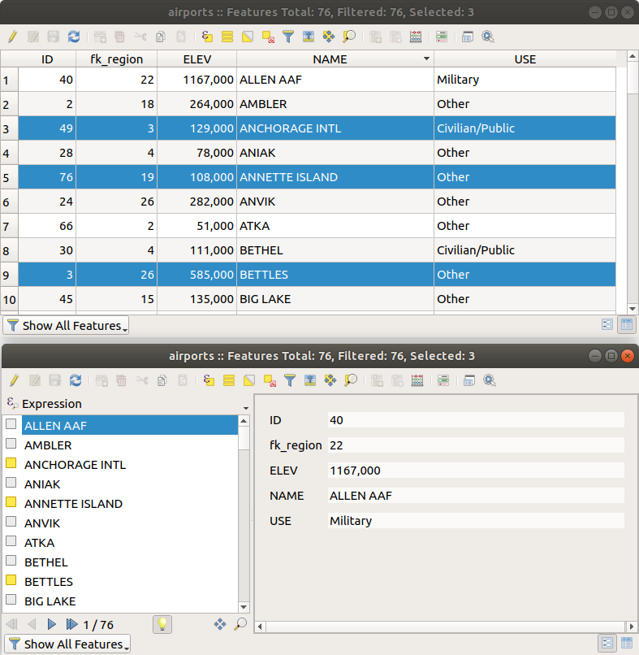

.. index:: Attribute table
.. _sec_attribute_table:

**********************************
 Working with the Attribute Table
**********************************

The attribute table displays information on features of a selected layer. Each
row in the table represents a feature (with or without geometry), and each column
contains a particular piece of information about the feature.
Features in the table can be searched, selected, moved or even edited.

.. only:: html

   .. contents::
      :local:

.. index:: Non Spatial Attribute Tables, Geometryless Data
.. _non_spatial_attribute_tables:

Foreword: Spatial and non-spatial tables
========================================

QGIS allows you to load spatial and non-spatial layers. This currently includes
tables supported by GDAL and delimited text, as well as the PostgreSQL, MS SQL Server,
SpatiaLite and Oracle providers. All loaded layers are listed in
the :guilabel:`Layers` panel. Whether a layer is spatially enabled or not
determines whether you can interact with it on the map.

Non-spatial tables can be browsed and edited using the attribute table view.
Furthermore, they can be used for field lookups.
For example, you can use columns of a non-spatial table to define attribute
values, or a range of values that are allowed, to be added to a specific vector
layer during digitizing. Have a closer look at the edit widget in section
:ref:`vector_attributes_menu` to find out more.

.. _attribute_table_overview:

Introducing the attribute table interface
=========================================

To open the attribute table for a vector layer, activate the layer by
clicking on it in the :ref:`label_legend`. Then, from the main
:menuselection:`Layer` menu, choose |openTable| :menuselection:`Open Attribute
Table`. It is also possible to right-click on the layer and choose
|openTable| :menuselection:`Open Attribute Table` from the drop-down menu,
or to click on the |openTable| :guilabel:`Open Attribute Table` button
in the Attributes toolbar.
If you prefer shortcuts, :kbd:`F6` will open the attribute table.
:kbd:`Shift+F6` will open the attribute table filtered to selected features and
:kbd:`Ctrl+F6` will open the attribute table filtered to visible features.

This will open a new window that displays the feature attributes for the
layer (figure_attributes_table_). According to the setting in
:menuselection:`Settings --> Options --> Data sources` menu, the attribute table
will open in a docked window or a regular window. The total number of features
in the layer and the number of currently selected/filtered features are shown
in the attribute table title, as well as if the layer is spatially limited.

.. _figure_attributes_table:

.. figure:: img/vectorAttributeTable.png
   :align: center

   Attribute Table for regions layer

The buttons at the top of the attribute table window provide the
following functionality:

.. _table_attribute_1:

.. csv-table:: Available Tools
   :header: "Icon", "Label", "Purpose", "Default Shortcut"
   :widths: auto
   :class: longtable

   "|toggleEditing|", "Toggle editing mode", "Enable editing functionalities", ":kbd:`Ctrl+E`"
   "|multiEdit|", "Toggle multi edit mode", "Update multiple fields of many features"
   "|saveEdits|", "Save Edits", "Save current modifications"
   "|refresh|", "Reload the table"
   "|newTableRow|", "Add feature", "Add new geometryless feature"
   "|deleteSelectedFeatures|", "Delete selected features", "Remove selected features from the layer"
   "|editCut|", "Cut selected features to clipboard", "", ":kbd:`Ctrl+X`"
   "|copySelected|", "Copy selected features to clipboard", "", ":kbd:`Ctrl+C`"
   "|editPaste|", "Paste features from clipboard", "Insert new features from copied ones", ":kbd:`Ctrl+V`"
   "|expressionSelect|", "Select features using an Expression"
   "|selectAll|", "Select All", "Select all features in the layer", ":kbd:`Ctrl+A`"
   "|invertSelection|", "Invert selection", "Invert the current selection in the layer", ":kbd:`Ctrl+R`"
   "|deselectActiveLayer|", "Deselect all", "Deselect all features in the current layer", ":kbd:`Ctrl+Shift+A`"
   "|filterMap|", "Filter/Select features using form", "", ":kbd:`Ctrl+F`"
   "|selectedToTop|", "Move selected to top", "Move selected rows to the top of the table"
   "|panToSelected|", "Pan map to the selected rows", "", ":kbd:`Ctrl+P`"
   "|zoomToSelected|", "Zoom map to the selected rows", "", ":kbd:`Ctrl+J`"
   "|newAttribute|", "New field", "Add a new field to the data source", ":kbd:`Ctrl+W`"
   "|deleteAttribute|", "Delete field", "Remove a field from the data source"
   "|editTable|", "Organize columns", "Show/hide fields from the attribute table"
   "|calculateField|", "Open field calculator", "Update field for many features in a row", ":kbd:`Ctrl+I`"
   "|conditionalFormatting|", "Conditional formatting", "Enable table formatting"
   "|dock|", "Dock attribute table", "Allows to dock/undock the attribute table"
   "|actionRun|", "Actions", "Lists the actions related to the layer"

.. note:: Depending on the format of the data and the GDAL library built with
   your QGIS version, some tools may not be available.

Below these buttons is the Quick Field Calculation bar (enabled only in
:ref:`edit mode <sec_edit_existing_layer>`), which allows to quickly apply
calculations to all or part of the features in the layer. This bar uses the same
:ref:`expressions <vector_expressions>` as the |calculateField| :sup:`Field
Calculator` (see :ref:`calculate_fields_values`).

.. _attribute_table_view:

Table view vs Form view
-----------------------

QGIS provides two view modes to easily manipulate data in the attribute table:

* The |openTable| :sup:`Table view`, displays values of multiple features in a
  tabular mode, each row representing a feature and each column a field.
  A right-click on the column header allows you to :ref:`configure the table
  display <configure_table_columns>` while a right-click on a cell provides
  :ref:`interaction with the feature <interacting_features_table>`.

  The attribute table supports :kbd:`Shift+Mouse Wheel` scrolling in table view mode
  to switch between vertical and horizontal scrolling movements.
  This can also be achieved replacing the mouse with the trackpad on macOS.
* The |formView| :sup:`Form view` shows :ref:`feature identifiers
  <maptips>` in a first panel and displays only the attributes of the clicked
  identifier in the second one.
  There is a pull-down menu at the top of the first panel where the "identifier"
  can be specified using an attribute (:guilabel:`Column preview`) or an
  :guilabel:`Expression`.
  The pull-down also includes the last 10 expressions for re-use.
  Form view uses the layer fields configuration
  (see :ref:`vector_attributes_menu`).

  You can browse through the feature identifiers with the arrows on the bottom
  of the first panel. The features attributes update in the second panel as you
  go. It's also possible to identify or move to the active feature in the map
  canvas with pushing down any of the button at the bottom:

  * |highlightFeature| :sup:`Highlight current feature` if visible in the
    map canvas
  * |panTo| :sup:`Automatically pan to current feature`
  * |zoomTo| :sup:`Zoom to current feature`

You can switch from one mode to the other by clicking the corresponding icon at
the bottom right of the dialog.

You can also specify the :guilabel:`Default view` mode at the opening of the
attribute table in :menuselection:`Settings --> Options --> Data Sources` menu.
It can be 'Remember last view', 'Table view' or 'Form view'.

.. _figure_attribute_table_views:

   Attribute table in table view (top) vs form view (bottom)

.. index:: Sort columns, Add actions
   pair: Attributes; Columns
.. _configure_table_columns:

Configuring the columns
-----------------------

Right-click in a column header when in table view to have access to tools that
help you control:

* the :ref:`column(s) size <resize_columns>`
* the :ref:`column(s) visibility and order <organize_columns>`
* the :ref:`sort order of the data <sort_columns>`

.. _resize_columns:

Resizing columns widths
.......................

Columns width can be set through a right-click on the column header and
select either:

* :guilabel:`Set width...` to enter the desired value. By default, the current
  value is displayed in the widget
* :guilabel:`Set all column widths...` to the same value
* :guilabel:`Autosize` to resize at the best fit the column.
* :guilabel:`Autosize all columns`

A column size can also be changed by dragging the boundary on the right of its
heading. The new size of the column is maintained for the layer, and restored at
the next opening of the attribute table.

.. _organize_columns:

Hiding and organizing columns and enabling actions
..................................................

By right-clicking in a column header, you can choose to :guilabel:`Hide column`
from the attribute table (in "table view" mode).
For more advanced controls, press the |editTable| :sup:`Organize columns...`
button from the dialog toolbar or choose :guilabel:`Organize columns...`
in a column header contextual menu.

In the new dialog, you can:

* check/uncheck columns you want to show or hide: a hidden column will
  disappear from every instance of the attribute table dialog until it is
  actively restored. It is also possible to:

  * choose :guilabel:`Show All` to display all the fields (columns) and actions in the table 
  * choose :guilabel:`Hide All` to hide all the fields (columns) and actions in the table
  * use the :guilabel:`Toggle selection` to invert visibility of the current selection of columns.
    You can use :ref:`keyboard combination <interacting_features_table>`
    for selecting multiple columns.

* drag-and-drop items to reorder the columns in the attribute table. Note that
  this change is for the table rendering and does not alter the fields order in
  the layer datasource
* add a new virtual :guilabel:`Actions` column that displays in each row a
  drop-down box or a button list of enabled actions.
  See :ref:`actions_menu` for more information about actions.

.. _sort_columns:

Sorting rows
...............

The rows can be sorted by any column, by clicking on the column header. A
small arrow indicates the sort order (downward pointing means descending
values from the top row down, upward pointing means ascending values from
the top row down).
You can also choose to sort the rows with the :guilabel:`Sort...` option of the
column header context menu and write an expression. E.g. to sort the rows
using multiple columns you can write ``concat(col0, col1)``.

In form view, features identifier can be sorted using the |sort| :guilabel:`Sort
by preview expression` option.

Note that sorting the rows only affects the table rendering and does not alter
the features order in the layer datasource.

.. _tip_sortcolumns:

.. tip:: **Sorting based on columns of different types**

  Trying to sort an attribute table based on columns of string and numeric types
  may lead to unexpected result because of the ``concat("USE", "ID")`` expression
  returning string values (ie, ``'Borough105' < 'Borough6'``).
  You can workaround this by using eg ``concat("USE", lpad("ID", 3, 0))`` which
  returns ``'Borough105' > 'Borough006'``.

.. index:: Conditional formatting
.. _conditional_formatting:

Formatting of table cells using conditions
------------------------------------------

Conditional formatting settings can be used to highlight in the attribute
table features you may want to put a particular focus on, using custom
conditions on feature's:

* geometry (e.g., identifying multi-parts features, small area ones or in a
  defined map extent...);
* or field value (e.g., comparing values to a threshold, identifying empty cells,
  duplicates, ...).

You can enable the conditional formatting panel clicking on
|conditionalFormatting| :sup:`Conditional formatting` button at the top right
of the attributes window in table view (not triggered in form view).

The new panel allows user to add new rules to format rendering of
|radioButtonOn|:guilabel:`Field` or |radioButtonOff|:guilabel:`Full row`.
Adding new rule opens a form to define:

* the name of the rule;
* a condition using any of the :ref:`expression builder <vector_expressions>` functions;
* the formatting: it can be choosen from a list of predefined formats or created
  based on properties like:

  * background and text colors;
  * use of icon;
  * bold, italic, underline, or strikeout;
  * font.

.. _figure_conditional_format:

.. figure:: img/attribute_table_conditional_formating.png
   :align: center

   Conditional Formatting of an attribute table

.. index::
   pair: Attributes; Selection
.. _interacting_features_table:

Interacting with features in an attribute table
===============================================

Selecting features
------------------

In table view, each row in the attribute table displays the attributes of a
unique feature in the layer. Selecting a row selects the feature and likewise,
selecting a feature in the map canvas (in case of geometry enabled layer)
selects the row in the attribute table. If the set of features selected in the
map canvas (or attribute table) is changed, then the selection is also updated
in the attribute table (or map canvas) accordingly.

Rows can be selected by clicking on the row number on the left side of the
row. **Multiple rows** can be marked by holding the :kbd:`Ctrl` key.
A **continuous selection** can be made by holding the :kbd:`Shift` key and
clicking on several row headers on the left side of the rows. All rows
between the current cursor position and the clicked row are selected.
Moving the cursor position in the attribute table, by clicking a cell in the
table, does not change the row selection. Changing the selection in the main
canvas does not move the cursor position in the attribute table.

In form view of the attribute table, features are by default identified in the
left panel by the value of their displayed field (see :ref:`maptips`). This
identifier can be replaced using the drop-down list at the top of the panel,
either by selecting an existing field or using a custom expression. You can
also choose to sort the list of features from the drop-down menu.

Click a value in the left panel to display the feature's attributes in the
right one. To select a feature, you need to click inside the square symbol at
the left of the identifier. By default, the symbol turns into yellow. Like in
the table view, you can perform multiple feature selection using the keyboard
combinations previously exposed.

.. actually, it looks like there's a difference in keyboard usage but i feel
   it's a bug. Report at https://issues.qgis.org/issues/16553.

Beyond selecting features with the mouse, you can perform automatic selection
based on feature's attribute using tools available in the attribute table
toolbar, such as (see section :ref:`automatic_selection` and following one for
more information and use case):

* |expressionSelect| :guilabel:`Select By Expression...`
* |formSelect| :guilabel:`Select Features By Value...`
* |deselectActiveLayer| :guilabel:`Deselect All Features from the Layer`
* |selectAll| :guilabel:`Select All Features`
* |invertSelection| :guilabel:`Invert Feature Selection`.

It is also possible to select features using the :ref:`filter_select_form`.

.. _filter_features:

Filtering features
------------------

Once you have selected features in the attribute table, you may want to display
only these records in the table. This can be easily done using the
:guilabel:`Show Selected Features` item from the drop-down list at the bottom
left of the attribute table dialog. This list offers the following filters:

* |openTable| :guilabel:`Show All Features`
* |openTableSelected| :guilabel:`Show Selected Features` - same as using
  :guilabel:`Open Attribute Table (Selected Features)` from the :guilabel:`Layer`
  menu or the :guilabel:`Attributes Toolbar` or pressing :kbd:`Shift+F6`
* |openTableVisible| :guilabel:`Show Features visible on map` - same as using
  :guilabel:`Open Attribute Table (Visible Features)` from the :guilabel:`Layer`
  menu or the :guilabel:`Attributes Toolbar` or pressing :kbd:`Ctrl+F6`
* |openTableInvalid| :guilabel:`Show Features with Failing Constraints` -
  features will be filtered to only show the ones which have failing :ref:`constraints <constraints>`.
  Depending on whether the unmet constraint is hard or soft,
  failing field values are displayed in respectively dark or light orange cells.
* |openTableEdited| :guilabel:`Show Edited and New Features` - same as using
  :guilabel:`Open Attribute Table (Edited and New Features)` from the :guilabel:`Layer`
  menu or the :guilabel:`Attributes Toolbar`
* :guilabel:`Field Filter` - allows the user to filter based on value of a field:
  choose a column from a list, type or select a value and press :kbd:`Enter` to filter.
  Then, only the features matching ``num_field = value`` or ``string_field ilike '%value%'``
  expression are shown in the attribute table. You can check |checkbox|
  :guilabel:`Case sensitive` to be less permissive with strings.
* |filterMap| :guilabel:`Advanced filter (Expression)` - Opens the expression builder
  dialog. Within it, you can create :ref:`complex expressions
  <vector_expressions>` to match table rows.
  For example, you can filter the table using more than one field.
  When applied, the filter expression will show up at the bottom of the form.
* |handleStoreFilterExpressionChecked| :menuselection:`Stored filter expressions -->`: a shortcut to :ref:`saved
  expressions <store_filter>` frequently used for filtering your attribute table.

It is also possible to :ref:`filter features using forms <filter_select_form>`.

.. note::

  Filtering records out of the attribute table does not filter features out
  of the layer; they are simply momentaneously hidden from the table and can be
  accessed from the map canvas or by removing the filter. For filters that do
  hide features from the layer, use the
  :ref:`Query Builder <vector_query_builder>`.

.. tip:: **Update datasource filtering with** ``Show Features Visible on Map``

  When for performance reasons, features shown in attribute table are spatially
  limited to the canvas extent at its opening (see :ref:`Data Source Options
  <tip_table_filtering>` for a how-to), selecting :guilabel:`Show Features
  Visible on Map` on a new canvas extent updates the spatial restriction.

.. index:: Expression filter
.. _store_filter:

Storing filter expressions
----------------------------

Expressions you use for attribute table filtering can be saved for further calls.
When using :guilabel:`Field Filter` or :guilabel:`Advanced Filter (expression)`
entries, the expression used is displayed in a text widget in the bottom of the
attribute table dialog. Press the |handleStoreFilterExpressionUnchecked|
:sup:`Save expression with text as name` next to the box to save the expression
in the project. Pressing the drop-down menu next to the button allows to save
the expression with a custom name (:guilabel:`Save expression as...`).
Once a saved expression is displayed, the |handleStoreFilterExpressionChecked|
button is triggered and its drop-down menu allows you to :guilabel:`Edit the
expression` and name if any, or :guilabel:`Delete stored expression`.

Saved filter expressions are saved in the project and available through the
:guilabel:`Stored filter expressions` menu of the attribute table.
They are different from the :ref:`user expressions <user_expressions_functions>`,
shared by all projects of the active user profile.

.. _filter_select_form:

Filtering and selecting features using forms
--------------------------------------------

Clicking the |filterMap| :sup:`Filter/Select features using form` or
pressing :kbd:`Ctrl+F` will make the attribute table dialog switch to form view
and replace each widget with its search variant.

From this point onwards, this tool functionality is similar to the one described
in :ref:`select_by_value`, where you can find descriptions of all operators
and selecting modes.

.. _figure_filter_select_form:

.. figure:: img/tableFilteredForm.png
    :align: center

    Attribute table filtered by the filter form

When selecting / filtering features from the attribute table, there is a :guilabel:`Filter features`
button that allows defining and refining filters. Its use triggers the
:guilabel:`Advanced filter (Expression)` option and displays the corresponding
filter expression in an editable text widget at the bottom of the form.

If there are already filtered features, you can refine the filter using the
drop-down list next to the :guilabel:`Filter features` button. The options are:

* :guilabel:`Filter within ("AND")`
* :guilabel:`Extend filter ("OR")`

To clear the filter, either select the :guilabel:`Show all features` option
from the bottom left pull-down menu, or clear the expression and
click :guilabel:`Apply` or press :kbd:`Enter`.

Using action on features
========================

Users have several possibilities to manipulate feature with the contextual menu
like:

* :guilabel:`Select all` (:kbd:`Ctrl+A`) the features;
* Copy the content of a cell in the clipboard with :guilabel:`Copy cell content`;
* :guilabel:`Zoom to feature` without having to select it beforehand;
* :guilabel:`Pan to feature` without having to select it beforehand;
* :guilabel:`Flash feature`, to highlight it in the map canvas;
* :guilabel:`Open form`: it toggles attribute table into form view with a focus
  on the clicked feature.

.. _figure_copy_cell:

.. figure:: img/copyCellContent.png
    :align: center

    Copy cell content button

If you want to use attribute data in external programs (such as Excel,
LibreOffice, QGIS or a custom web application), select one or more row(s) and
use the |copySelected| :sup:`Copy selected rows to clipboard` button or press
:kbd:`Ctrl+C`.

.. _geometry_format:

In :menuselection:`Settings --> Options --> Data Sources` menu you can
define the format to paste to with :guilabel:`Copy features as` dropdown
list:

* Plain text, no geometry,
* Plain text, WKT geometry,
* GeoJSON

You can also display a list of actions in this contextual menu. This is enabled
in the :menuselection:`Layer properties --> Actions` tab.
See :ref:`actions_menu` for more information on actions.

Saving selected features as new layer
-------------------------------------

The selected features can be saved as any OGR-supported vector format and
also transformed into another coordinate reference system (CRS). In the
contextual menu of the layer, from the :guilabel:`Layers` panel, click on
:menuselection:`Export --> Save selected features as...` to define the name of
the output dataset, its format and CRS (see section :ref:`general_saveas`). You'll
notice that |checkbox| :menuselection:`Save only selected features` is checked.
It is also possible to specify GDAL creation options within the dialog.

.. index:: Field Calculator, Derived Fields, Virtual Fields, Fields edit
.. _calculate_fields_values:

Editing attribute values
=========================

Editing attribute values can be done by:

* typing the new value directly in the cell, whether the attribute table is in
  table or form view. Changes are hence done cell by cell, feature by feature;
* using the :ref:`field calculator <vector_field_calculator>`: update in a row
  a field that may already exist or to be created but for multiple features. It
  can be used to create virtual fields;
* using the quick field :ref:`calculation bar <quick_field_calculation_bar>`:
  same as above but for only existing field;
* or using the :ref:`multi edit <multi_edit_fields>` mode: update in a row
  multiple fields for multiple features.

.. _vector_field_calculator:

Using the Field Calculator
--------------------------

The |calculateField| :sup:`Field Calculator` button in the attribute table
allows you to perform calculations on the basis of existing attribute values or
defined functions, for instance, to calculate length or area of geometry
features. The results can be used to update an existing field, or written
to a new field (that can be a :ref:`virtual <virtual_field>` one).

The field calculator is available on any layer that supports edit.
When you click on the field calculator icon the dialog opens (see
:numref:`figure_field_calculator`). If the layer is not in edit mode, a warning is
displayed and using the field calculator will cause the layer to be put in
edit mode before the calculation is made.

Based on the :ref:`Expression Builder <expression_builder>` dialog,
the field calculator dialog offers a complete interface to define an expression
and apply it to an existing or a newly created field.
To use the field calculator dialog, you must select whether you want to:

#. apply calculation on the whole layer or on selected features only
#. create a new field for the calculation or update an existing one.

.. _figure_field_calculator:

.. figure:: img/fieldcalculator.png
   :align: center

   Field Calculator

If you choose to add a new field, you need to enter a field name, a field type
(integer, real, date or string) and if needed, the total field length and the
field precision. For example, if you choose a field length of 10 and a field
precision of 3, it means you have 7 digits before the dot, and 3 digits for
the decimal part.

A short example illustrates how field calculator works when using the
:guilabel:`Expression` tab. We want to calculate the length in km of the
``railroads`` layer from the QGIS sample dataset:

#. Load the shapefile :file:`railroads.shp` in QGIS and press |openTable|
   :sup:`Open Attribute Table`.
#. Click on |toggleEditing| :sup:`Toggle editing mode` and open the
   |calculateField| :sup:`Field Calculator` dialog.
#. Select the |checkbox| :guilabel:`Create a new field` checkbox to save the
   calculations into a new field.
#. Set :guilabel:`Output field name` to  ``length_km``
#. Select ``Decimal number (real)`` as :guilabel:`Output field type`
#. Set the :guilabel:`Output field length` to ``10`` and the :guilabel:`Precision` to ``3``
#. Double click on ``$length`` in the :guilabel:`Geometry` group to add the length
   of the geometry into the Field calculator expression box (you will begin to see
   a preview of the output, up to 60 characters, below the expression box updating 
   in real-time as the expression is assembled).
#. Complete the expression by typing ``/ 1000`` in the Field calculator expression box
   and click :guilabel:`OK`.
#. You can now find a new :guilabel:`length_km` field in the attribute table.

.. _virtual_field:

Creating a Virtual Field
------------------------

A virtual field is a field based on an expression calculated on the fly, meaning
that its value is automatically updated as soon as an underlying parameter
changes. The expression is set once; you no longer need to recalculate the field
each time underlying values change.
For example, you may want to use a virtual field if you need area to be evaluated
as you digitize features or to automatically calculate a duration between dates
that may change (e.g., using ``now()`` function).

.. note:: **Use of Virtual Fields**

   * Virtual fields are not permanent in the layer attributes, meaning that
     they're only saved and available in the project file they've been created.
   * A field can be set virtual only at its creation.
     Virtual fields are marked with a purple background in the fields tab of
     the layer properties dialog to distinguish them from regular physical
     or joined fields. Their expression can be edited later by pressing the
     expression button in the Comment column. An expression editor window will
     be opened to adjust the expression of the virtual field.

.. _quick_field_calculation_bar:

Using the Quick Field Calculation Bar
-------------------------------------

While Field calculator is always available, the quick field calculation bar on
top of the attribute table is only visible if the layer is in edit mode. Thanks
to the expression engine, it offers a quicker access to edit an already existing
field:

#. Select the field to update in the drop-down list.
#. Fill the textbox with a value, an expression you directly write or build using the
   |expression| expression button.
#. Click on :guilabel:`Update All`, :guilabel:`Update Selected` or
   :guilabel:`Update Filtered` button according to your need.

.. _figure_field_calculator_bar:

.. figure:: img/fieldcalculatorbar.png
   :align: center

   Quick Field Calculation Bar

.. index:: Multi edit
.. _multi_edit_fields:

Editing multiple fields
-----------------------

Unlike the previous tools, multi edit mode allows multiple attributes of
different features to be edited simultaneously. When the layer is toggled to
edit, multi edit capabilities are accessible:

* using the |multiEdit| :sup:`Toggle multi edit mode` button from the toolbar
  inside the attribute table dialog;
* or selecting :menuselection:`Edit -->` |multiEdit| :menuselection:`Modify
  attributes of selected features` menu.

.. note::

 Unlike the tool from the attribute table, hitting the :menuselection:`Edit
 --> Modify Attributes of Selected Features` option provides you with a modal
 dialog to fill attributes changes. Hence, features selection is required
 before execution.

In order to edit multiple fields in a row:

#. Select the features you want to edit.
#. From the attribute table toolbar, click the |multiEdit| button. This will
   toggle the dialog to its form view. Feature selection could also be made
   at this step.
#. At the right side of the attribute table, fields (and values) of selected
   features are shown. New widgets appear next to each field allowing for
   display of the current multi edit state:

   * |multiEditMixedValues| The field contains different values for selected
     features. It's shown empty and each feature will keep its original value.
     You can reset the value of the field from the drop-down list of the widget.
   * |multiEditSameValues| All selected features have the same value for this
     field and the value displayed in the form will be kept.
   * |multiEditChangedValues| The field has been edited and the entered value
     will be applied to all the selected features. A message appears at the top
     of the dialog, inviting you to either apply or reset your modification.

   Clicking any of these widgets allows you to either set the current value for
   the field or reset to original value, meaning that you can roll back changes
   on a field-by-field basis.

   .. _figure_field_multiedit:

   .. figure:: img/attribute_multiedit.png
      :align: center

      Editing fields of multiple features

#. Make the changes to the fields you want.
#. Click on **Apply changes** in the upper message text or any other feature
   in the left panel.

Changes will apply to **all selected features**. If no feature is selected, the
whole table is updated with your changes. Modifications are made as a single
edit command. So pressing |undo| :sup:`Undo` will rollback the attribute
changes for all selected features at once.

.. note::

  Multi edit mode is only available for auto generated and drag and drop forms
  (see :ref:`customize_form`); it is not supported by custom ui forms.

.. _identify_features_vector:

Exploring features attributes through the Identify Tool
=======================================================

The |identify| :ref:`Identify features <identify>` tool can be used to display all attributes
of a feature in the map canvas. It is a quick way to view and verify all data without
having to search for it in the attribute table.

To use the :guilabel:`Identify features` tool for vector layers, follow these steps:

#. Select the vector layer in the Layers panel.
#. Click on the :guilabel:`Identify features` tool in the toolbar or press :kbd:`Ctrl+Shift+I`.
#. Click on a feature in the map view.

The :guilabel:`Identify results` panel will display different features information
depending on the layer type. There are two columns in the panel, on the left side
you can see :guilabel:`Feature` and on the right side :guilabel:`Value`.
Under the :guilabel:`Feature` column, panel will display following information:

* **Derived** section - those are the information calculated or derived from other
  information in the layer. For example, the area of a polygon or the length of a line.
  General information that can be found in this section:

  * Depending on the geometry type, cartesian measurements of length, perimeter, or area
    in the layer's CRS units. For 3D line vectors, the cartesian line length is available.
  * Depending on the geometry type and if an ellipsoid is set in the :guilabel:`Project Properties`
    dialog (:guilabel:`General` --> :guilabel:`Measurements`), ellipsoidal values
    of length, perimeter, or area using the specified units.
  * The count of geometry parts in the feature and the number of the part clicked.
  * The count of vertices in the feature.

  Coordinate information that can be found in this section:
  
  * X and Y coordinate values of the clicked point.
  * The number of the closest vertex to the clicked point.
  * X and Y coordinate values of the closest vertex.
  * If you click on a curved segment, the radius of that section is also displayed.

* **Data attributes**: This is the list of attribute fields and values for the
  feature that has been clicked.
* information about the related child feature if you defined a :ref:`relation <vector_relations>`:

  * the name of the relation
  * the entry in reference field, e.g. the name of the related child feature
  * **Actions**: lists actions defined in the layer's properties dialog (see :ref:`actions_menu`)
    and the default action is ``View feature form``.
  * **Data attributes**: This is the list of attributes fields and values of the
    related child feature.

.. index:: External Storage, WebDAV
.. _external_storage:

Storing and fetching an external resource
==========================================

A field may target a resource stored on an external storage system. Attribute forms can be configured
so they act as a client to an external storage system in order to store and fetch those resources, on
users demand, directly from the forms.

.. _external_storage_configuration:

Configuring an external storage
-------------------------------

In order to setup an external storage, you have to first configure it from the vector
:ref:`attribute form properties <edit_widgets>` and select the :guilabel:`Attachment` widget.

.. _figure_external_storage_configuration:

.. figure:: img/external_storage_configuration.png
   :align: center

   Editing a WebDAV external storage for a given field

From the :guilabel:`Attachment` widget, you have to first select the :guilabel:`Storage type`:

* :guilabel:`Select Existing File`: The target URL already exists. When
  you select a resource, no store operation is achieved, the attribute is simply updated with the URL.

* :guilabel:`Simple Copy`: Stores a copy of the resource on a file disk destination
  (which could be a local or network shared file system) and the attribute is updated with the path to
  the copy.

* :guilabel:`WebDAV Storage`: The resource is pushed to a HTTP server supporting the
  `WebDAV <https://en.wikipedia.org/wiki/WebDAV>`_ protocol and the attribute is updated with
  its URL. `Nextcloud <https://nextcloud.com/>`_, `Pydio <https://pydio.com>`_
  or other file hosting software support this protocol.

* :guilabel:`AWS S3`: The resource is pushed to a server supporting
  `AWS Simple Storage Service <https://en.wikipedia.org/wiki/Amazon_S3>`_ protocol and the attribute is
  updated with its URL. Amazon Web Service and `MinIO <https://en.wikipedia.org/wiki/MinIO>`_ hosting software
  support this protocol.

Then, you have to set up the :guilabel:`Store URL` parameter, which provides the URL to be used when a new
resource needs to be stored. It's possible to set up an expression using the
:ref:`data defined override widget <data_defined>` in order to have specific values according to
feature attributes.

The variable **@selected_file_path** could be used in that expression and represent the absolute
file path of the user selected file (using the file selector or drag'n drop).

.. note::

   Using the **WebDAV** or **AWS S3** external storage, if the URL ends with a "/", it is considered as a folder and
   the selected file name will be appended to get the final URL.

If the external storage system needs to, it's possible to configure an
:ref:`authentication <authentication>`.

.. note::

   To use the **AWS S3** external storage, you must use an **AWS S3** authentication type.

.. _external_storage_use:

Using an external storage
-------------------------

Once configured, you can select a local file using the button :guilabel:`...` when editing a feature's attribute.
Depending on the configured :ref:`storage type <external_storage_configuration>`, the file
will be stored on the external storage system (except if :guilabel:`Select existing file` has been
selected) and the field will be updated with the new resource URL.

.. _figure_external_storage_store:

.. figure:: img/external_storage_store.png
   :align: center

   Storing a file to a WebDAV external storage

.. note::

   User can also achieve the same result if he drags and drops a file on the whole attachment
   widget.

Use the |taskCancel| :sup:`Cancel` button to abort the storing process.
It's possible to configure a viewer using the :guilabel:`Integrated document viewer`
so the resource will be automatically fetched from the external storage system and
displayed directly below the URL.
The above |warning| icon indicates that the resource cannot be fetched
from the external storage system. In that case, more details might appear in the
:ref:`log_message_panel`.

.. Substitutions definitions - AVOID EDITING PAST THIS LINE
   This will be automatically updated by the find_set_subst.py script.
   If you need to create a new substitution manually,
   please add it also to the substitutions.txt file in the
   source folder.

.. |actionRun| image:: /static/common/mAction.png
   :width: 1.5em
.. |calculateField| image:: /static/common/mActionCalculateField.png
   :width: 1.5em
.. |checkbox| image:: /static/common/checkbox.png
   :width: 1.3em
.. |conditionalFormatting| image:: /static/common/mActionConditionalFormatting.png
   :width: 1.5em
.. |copySelected| image:: /static/common/mActionCopySelected.png
   :width: 1.5em
.. |deleteAttribute| image:: /static/common/mActionDeleteAttribute.png
   :width: 1.5em
.. |deleteSelectedFeatures| image:: /static/common/mActionDeleteSelectedFeatures.png
   :width: 1.5em
.. |deselectActiveLayer| image:: /static/common/mActionDeselectActiveLayer.png
   :width: 1.5em
.. |dock| image:: /static/common/dock.png
   :width: 1.5em
.. |editCut| image:: /static/common/mActionEditCut.png
   :width: 1.5em
.. |editPaste| image:: /static/common/mActionEditPaste.png
   :width: 1.5em
.. |editTable| image:: /static/common/mActionEditTable.png
   :width: 1.5em
.. |expression| image:: /static/common/mIconExpression.png
   :width: 1.5em
.. |expressionSelect| image:: /static/common/mIconExpressionSelect.png
   :width: 1.5em
.. |filterMap| image:: /static/common/mActionFilterMap.png
   :width: 1.5em
.. |formSelect| image:: /static/common/mIconFormSelect.png
   :width: 1.5em
.. |formView| image:: /static/common/mActionFormView.png
   :width: 1.2em
.. |handleStoreFilterExpressionChecked| image:: /static/common/mActionHandleStoreFilterExpressionChecked.png
   :width: 1.5em
.. |handleStoreFilterExpressionUnchecked| image:: /static/common/mActionHandleStoreFilterExpressionUnchecked.png
   :width: 1.5em
.. |highlightFeature| image:: /static/common/mActionHighlightFeature.png
   :width: 1.5em
.. |identify| image:: /static/common/mActionIdentify.png
   :width: 1.5em
.. |invertSelection| image:: /static/common/mActionInvertSelection.png
   :width: 1.5em
.. |multiEdit| image:: /static/common/mActionMultiEdit.png
   :width: 1.5em
.. |multiEditChangedValues| image:: /static/common/multieditChangedValues.png
   :width: 1.5em
.. |multiEditMixedValues| image:: /static/common/multieditMixedValues.png
   :width: 1.5em
.. |multiEditSameValues| image:: /static/common/multieditSameValues.png
   :width: 1.5em
.. |newAttribute| image:: /static/common/mActionNewAttribute.png
   :width: 1.5em
.. |newTableRow| image:: /static/common/mActionNewTableRow.png
   :width: 1.5em
.. |openTable| image:: /static/common/mActionOpenTable.png
   :width: 1.5em
.. |openTableEdited| image:: /static/common/mActionOpenTableEdited.png
   :width: 1.5em
.. |openTableInvalid| image:: /static/common/mActionOpenTableInvalid.png
   :width: 1.5em
.. |openTableSelected| image:: /static/common/mActionOpenTableSelected.png
   :width: 1.5em
.. |openTableVisible| image:: /static/common/mActionOpenTableVisible.png
   :width: 1.5em
.. |panTo| image:: /static/common/mActionPanTo.png
   :width: 1.5em
.. |panToSelected| image:: /static/common/mActionPanToSelected.png
   :width: 1.5em
.. |radioButtonOff| image:: /static/common/radiobuttonoff.png
   :width: 1.5em
.. |radioButtonOn| image:: /static/common/radiobuttonon.png
   :width: 1.5em
.. |refresh| image:: /static/common/mActionRefresh.png
   :width: 1.5em
.. |saveEdits| image:: /static/common/mActionSaveEdits.png
   :width: 1.5em
.. |selectAll| image:: /static/common/mActionSelectAll.png
   :width: 1.5em
.. |selectedToTop| image:: /static/common/mActionSelectedToTop.png
   :width: 1.5em
.. |sort| image:: /static/common/sort.png
   :width: 1.5em
.. |taskCancel| image:: /static/common/mTaskCancel.png
   :width: 1.5em
.. |toggleEditing| image:: /static/common/mActionToggleEditing.png
   :width: 1.5em
.. |undo| image:: /static/common/mActionUndo.png
   :width: 1.5em
.. |warning| image:: /static/common/mIconWarning.png
   :width: 1.5em
.. |zoomTo| image:: /static/common/mActionZoomTo.png
   :width: 1.5em
.. |zoomToSelected| image:: /static/common/mActionZoomToSelected.png
   :width: 1.5em
