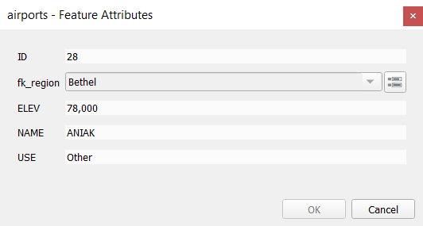

.. index:: Attribute table
.. _sec_attribute_table:

**********************************
 Working with the Attribute Table
**********************************

The attribute table displays information on features of a selected layer. Each
row in the table represents a feature (with or without geometry), and each column
contains a particular piece of information about the feature.
Features in the table can be searched, selected, moved or even edited.

.. only:: html

   .. contents::
      :local:

.. index:: Non Spatial Attribute Tables, Geometryless Data
.. _non_spatial_attribute_tables:

Foreword: Spatial and non-spatial tables
========================================

QGIS allows you to load spatial and non-spatial layers. This currently includes
tables supported by OGR and delimited text, as well as the PostgreSQL, MSSQL,
SpatiaLite, DB2 and Oracle provider. All loaded layers are listed in
the :guilabel:`Layers` panel. Whether a layer is spatially enabled or not
determines whether you can interact with it on the map.

Non-spatial tables can be browsed and edited using the attribute table view.
Furthermore, they can be used for field lookups.
For example, you can use columns of a non-spatial table to define attribute
values, or a range of values that are allowed, to be added to a specific vector
layer during digitizing. Have a closer look at the edit widget in section
:ref:`vector_attributes_menu` to find out more.

.. _attribute_table_overview:

Introducing the attribute table interface
=========================================

To open the attribute table for a vector layer, activate the layer by
clicking on it in the :ref:`label_legend`. Then, from the main
:menuselection:`Layer` menu, choose |openTable| :menuselection:`Open Attribute
Table`. It is also possible to right-click on the layer and choose
|openTable| :menuselection:`Open Attribute Table` from the drop-down menu,
or to click on the |openTable| :guilabel:`Open Attribute Table` button
in the Attributes toolbar.
If you prefer shortcuts, :kbd:`F6` will open the attribute table.
:kbd:`Shift+F6` will open the attribute table filtered to selected features and
:kbd:`Ctrl+F6` will open the attribute table filtered to visible features.

This will open a new window that displays the feature attributes for the
layer (figure_attributes_table_). According to the setting in
:menuselection:`Settings --> Options --> Data sources` menu, the attribute table
will open in a docked window or a regular window. The total number of features
in the layer and the number of currently selected/filtered features are shown
in the attribute table title, as well as if the layer is spatially limited.

.. _figure_attributes_table:

.. figure:: img/vectorAttributeTable.png
   :align: center

   Attribute Table for regions layer

The buttons at the top of the attribute table window provide the
following functionality:

.. _table_attribute_1:

.. csv-table:: Available Tools
   :header: "Icon", "Label", "Purpose", "Default Shortcut"
   :widths: auto
   :class: longtable

   "|toggleEditing|", "Toggle editing mode", "Enable editing functionalities", ":kbd:`Ctrl+E`"
   "|multiEdit|", "Toggle multi edit mode", "Update multiple fields of many features"
   "|saveEdits|", "Save Edits", "Save current modifications"
   "|refresh|", "Reload the table"
   "|newTableRow|", "Add feature", "Add new geometryless feature"
   "|deleteSelectedFeatures|", "Delete selected features", "Remove selected features from the layer"
   "|editCut|", "Cut selected features to clipboard", "", ":kbd:`Ctrl+X`"
   "|copySelected|", "Copy selected features to clipboard", "", ":kbd:`Ctrl+C`"
   "|editPaste|", "Paste features from clipboard", "Insert new features from copied ones", ":kbd:`Ctrl+V`"
   "|expressionSelect|", "Select features using an Expression"
   "|selectAll|", "Select All", "Select all features in the layer", ":kbd:`Ctrl+A`"
   "|invertSelection|", "Invert selection", "Invert the current selection in the layer", ":kbd:`Ctrl+R`"
   "|deselectAll|", "Deselect all", "Deselect all features in the current layer", ":kbd:`Ctrl+Shift+A`"
   "|filterMap|", "Filter/Select features using form", "", ":kbd:`Ctrl+F`"
   "|selectedToTop|", "Move selected to top", "Move selected rows to the top of the table"
   "|panToSelected|", "Pan map to the selected rows", "", ":kbd:`Ctrl+P`"
   "|zoomToSelected|", "Zoom map to the selected rows", "", ":kbd:`Ctrl+J`"
   "|newAttribute|", "New field", "Add a new field to the data source", ":kbd:`Ctrl+W`"
   "|deleteAttribute|", "Delete field", "Remove a field from the data source"
   "|calculateField|", "Open field calculator", "Update field for many features in a row", ":kbd:`Ctrl+I`"
   "|conditionalFormatting|", "Conditional formatting", "Enable table formatting"
   "|dock|", "Dock attribute table", "Allows to dock/undock the attribute table"
   "|actionRun|", "Actions", "Lists the actions related to the layer"

.. note:: Depending on the format of the data and the OGR library built with
   your QGIS version, some tools may not be available.

Below these buttons is the Quick Field Calculation bar (enabled only in
:ref:`edit mode <sec_edit_existing_layer>`), which allows to quickly apply
calculations to all or part of the features in the layer. This bar uses the same
:ref:`expressions <vector_expressions>` as the |calculateField| :sup:`Field
Calculator` (see :ref:`calculate_fields_values`).

.. _attribute_table_view:

Table view vs Form view
-----------------------

QGIS provides two view modes to easily manipulate data in the attribute table:

* The |openTable| :sup:`Table view`, displays values of multiple features in a
  tabular mode, each row representing a feature and each column a field.
* The |formView| :sup:`Form view` shows :ref:`feature identifiers
  <maptips>` in a first panel and displays only the attributes of the clicked
  identifier in the second one.
  There is a pull-down menu at the top of the first panel where the "identifier"
  can be specified using an attribute (:guilabel:`Column preview`) or an
  :guilabel:`Expression`.
  The pull-down also includes the last 10 expressions for re-use.
  Form view uses the layer fields configuration
  (see :ref:`vector_attributes_menu`).
  You can browse through the feature identifiers with the arrows on the bottom
  of the first panel. Once you markered the feature in yellow in the list it
  is selected in yellow on the canvas. Use the |zoomToSelected| on top of the
  attribute table to zoom to the feature. Clicking on an entry in the list 
  (without using the rectangles) makes a feature flash in red color once so you
  can see where it is situated.

You can switch from one mode to the other by clicking the corresponding icon at
the bottom right of the dialog.

You can also specify the :guilabel:`Default view` mode at the opening of the
attribute table in :menuselection:`Settings --> Options --> Data Sources` menu.
It can be 'Remember last view', 'Table view' or 'Form view'.

.. _figure_attribute_table_views:

.. figure:: img/attribute_table_views.png
   :align: center

   Attribute table in table view (top) vs form view (bottom)

.. index:: Sort columns, Add actions
   pair: Attributes; Columns
.. _configure_table_columns:

Configuring the columns
-----------------------

Right-click in a column header when in table view to have access to tools that
help you configure what can be displayed in the attribute table and how.

Hiding and organizing columns and enabling actions
..................................................

By right-clicking in a column header, you can choose to hide it from the
attribute table. To change several columns behavior at once, unhide a column or
change the order of the columns, choose :guilabel:`Organize columns ...`.
In the new dialog, you can:

* check/uncheck columns you want to show or hide
* drag-and-drop items to reorder the columns in the attribute table. Note that
  this change is for the table rendering and does not alter the fields order in
  the layer datasource
* enable a new virtual :guilabel:`Actions` column that displays in each row a
  drop-down box or button list of actions for each row, see :ref:`actions_menu`
  for more information about actions.

Resizing columns widths
.......................

Columns width can be set through a right-click on the column header and
select either:

* :guilabel:`Set width...` to enter the desired value. By default, the current
  value is displayed in the widget
* :guilabel:`Autosize` to resize at the best fit the column.

It can also be changed by dragging the boundary on the right of the column
heading. The new size of the column is maintained for the layer, and restored at
the next opening of the attribute table.

Sorting columns
...............

The table can be sorted by any column, by clicking on the column header. A
small arrow indicates the sort order (downward pointing means descending
values from the top row down, upward pointing means ascending values from
the top row down).
You can also choose to sort the rows with the :guilabel:`sort` option of the
column header context menu and write an expression, e.g. to sort the row
using multiple columns you can write ``concat(col0, col1)``.

In form view, features identifier can be sorted using the |sort| :guilabel:`Sort
by preview expression` option.

.. _tip_sortcolumns:

.. tip:: **Sorting based on columns of different types**

  Trying to sort an attribute table based on columns of string and numeric types
  may lead to unexpected result because of the ``concat("USE", "ID")`` expression
  returning string values (ie, ``'Borough105' < 'Borough6'``).
  You can workaround this by using eg ``concat("USE", lpad("ID", 3, 0))`` which
  returns ``'Borough105' > 'Borough006'``.

.. index:: Conditional formatting
.. _conditional_formatting:

Formatting of table cells using conditions
------------------------------------------

Conditional formatting settings can be used to highlight in the attribute
table features you may want to put a particular focus on, using custom
conditions on feature's:

* geometry (e.g., identifying multi-parts features, small area ones or in a
  defined map extent...);
* or field value (e.g., comparing values to a threshold, identifying empty
  cells...).

You can enable the conditional formatting panel clicking on
|conditionalFormatting| at the top right of the attributes window in table
view (not available in form view).

The new panel allows user to add new rules to format rendering of
|radioButtonOn|:guilabel:`Field` or |radioButtonOff|:guilabel:`Full row`.
Adding new rule opens a form to define:

* the name of the rule;
* a condition using any of the :ref:`expression builder <vector_expressions>`
  functions;
* the formatting: it can be choosen from a list of predefined formats or created
  based on properties like:

  * background and text colors;
  * use of icon;
  * bold, italic, underline, or strikeout;
  * font.

.. _figure_conditional_format:

.. figure:: img/attribute_table_conditional_formating.png
   :align: center

   Conditional Formatting of an attribute table

.. index::
   pair: Attributes; Selection

Interacting with features in an attribute table
===============================================

Selecting features
------------------

In table view, each row in the attribute table displays the attributes of a
unique feature in the layer. Selecting a row selects the feature and likewise,
selecting a feature in the map canvas (in case of geometry enabled layer)
selects the row in the attribute table. If the set of features selected in the
map canvas (or attribute table) is changed, then the selection is also updated
in the attribute table (or map canvas) accordingly.

Rows can be selected by clicking on the row number on the left side of the
row. **Multiple rows** can be marked by holding the :kbd:`Ctrl` key.
A **continuous selection** can be made by holding the :kbd:`Shift` key and
clicking on several row headers on the left side of the rows. All rows
between the current cursor position and the clicked row are selected.
Moving the cursor position in the attribute table, by clicking a cell in the
table, does not change the row selection. Changing the selection in the main
canvas does not move the cursor position in the attribute table.

In form view of the attribute table, features are by default identified in the
left panel by the value of their displayed field (see :ref:`maptips`). This
identifier can be replaced using the drop-down list at the top of the panel,
either by selecting an existing field or using a custom expression. You can
also choose to sort the list of features from the drop-down menu.

Click a value in the left panel to display the feature's attributes in the
right one. To select a feature, you need to click inside the square symbol at
the left of the identifier. By default, the symbol turns into yellow. Like in
the table view, you can perform multiple feature selection using the keyboard
combinations previously exposed.

.. actually, it looks like there's a difference in keyboard usage but i feel
   it's a bug. Report at https://issues.qgis.org/issues/16553.

Beyond selecting features with the mouse, you can perform automatic selection
based on feature's attribute using tools available in the attribute table
toolbar, such as (see section :ref:`automatic_selection` and following one for
more information and use case):

* |expressionSelect| :guilabel:`Select By Expression...`
* |formSelect| :guilabel:`Select Features By Value...`
* |deselectAll| :guilabel:`Deselect Features from All Layers`
* |selectAll| :guilabel:`Select All Features`
* |invertSelection| :guilabel:`Invert Feature Selection`.

It is also possible to select features using the :ref:`filter_select_form`.

.. _filter_features:

Filtering features
------------------

Once you have selected features in the attribute table, you may want to display
only these records in the table. This can be easily done using the
:guilabel:`Show Selected Features` item from the drop-down list at the bottom
left of the attribute table dialog. This list offers the following filters:

* :guilabel:`Show All Features`
* :guilabel:`Show Selected Features`
* :guilabel:`Show Features visible on map`
* :guilabel:`Show Edited and New Features`
* :guilabel:`Field Filter` - allows the user to filter based on value of a field:
  choose a column from a list, type a value and press :kbd:`Enter` to filter.
  Then, only the matching features are shown in the attribute table.
* :guilabel:`Advanced filter (Expression)` - Opens the expression builder
  dialog. Within it, you can create :ref:`complex expressions
  <vector_expressions>` to match table rows.
  For example, you can filter the table using more than one field.
  When applied, the filter expression will show up at the bottom of the form.

It is also possible to :ref:`filter features using forms <filter_select_form>`.

.. note::

  Filtering records out of the attribute table does not filter features out
  of the layer; they are simply momentaneously hidden from the table and can be
  accessed from the map canvas or by removing the filter. For filters that do
  hide features from the layer, use the
  :ref:`Query Builder <vector_query_builder>`.

.. tip:: **Update datasource filtering with** ``Show Features Visible on Map``

  When for performance reasons, features shown in attribute table are spatially
  limited to the canvas extent at its opening (see :ref:`Data Source Options
  <tip_table_filtering>` for a how-to), selecting :guilabel:`Show Features
  Visible on Map` on a new canvas extent updates the spatial restriction.

.. _filter_select_form:

Filtering and selecting features using forms
--------------------------------------------

Clicking the |filterMap| :sup:`Filter/Select features using form` or
pressing :kbd:`Ctrl+F` will make the attribute table dialog switch to form view
and replace each widget with its search variant.

From this point onwards, this tool functionality is similar to the one described
in :ref:`select_by_value`, where you can find descriptions of all operators
and selecting modes.

.. _figure_filter_select_form:

.. figure:: img/tableFilteredForm.png
    :align: center

    Attribute table filtered by the filter form

When selecting / filtering features from the attribute table, there is a :guilabel:`Filter features` 
button that allows defining and refining filters. Its use triggers the
:guilabel:`Advanced filter (Expression)` option and displays the corresponding
filter expression in an editable text widget at the bottom of the form.

If there are already filtered features, you can refine the filter using the
drop-down list next to the :guilabel:`Filter features` button. The options are:

* :guilabel:`Filter within ("AND")`
* :guilabel:`Extend filter ("OR")`

To clear the filter, either select the :guilabel:`Show all features` option
from the bottom left pull-down menu, or clear the expression and
click :guilabel:`Apply` or press :kbd:`Enter`.

Using action on features
========================

Users have several possibilities to manipulate feature with the contextual menu
like:

* :guilabel:`Select all` (:kbd:`Ctrl+A`) the features;
* Copy the content of a cell in the clipboard with :guilabel:`Copy cell content`;
* :guilabel:`Zoom to feature` without having to select it beforehand;
* :guilabel:`Pan to feature` without having to select it beforehand;
* :guilabel:`Flash feature`, to highlight it in the map canvas;
* :guilabel:`Open form`: it toggles attribute table into form view with a focus
  on the clicked feature.

.. _figure_copy_cell:

.. figure:: img/copyCellContent.png
    :align: center

    Copy cell content button

If you want to use attribute data in external programs (such as Excel,
LibreOffice, QGIS or a custom web application), select one or more row(s) and
use the |copySelected| :sup:`Copy selected rows to clipboard` button or press
:kbd:`Ctrl+C`.

.. _geometry_format:

In :menuselection:`Settings --> Options --> Data Sources` menu you can
define the format to paste to with :guilabel:`Copy features as` dropdown
list:

* Plain text, no geometry,
* Plain text, WKT geometry,
* GeoJSON

You can also display a list of actions in this contextual menu. This is enabled
in the :menuselection:`Layer properties --> Actions` tab.
See :ref:`actions_menu` for more information on actions.

Saving selected features as new layer
-------------------------------------

The selected features can be saved as any OGR-supported vector format and
also transformed into another coordinate reference system (CRS). In the
contextual menu of the layer, from the :guilabel:`Layers` panel, click on
:menuselection:`Export --> Save selected features as...` to define the name of
the output dataset, its format and CRS (see section :ref:`general_saveas`). You'll
notice that |checkbox| :menuselection:`Save only selected features` is checked.
It is also possible to specify OGR creation options within the dialog.

.. index:: Field Calculator, Derived Fields, Virtual Fields, Fields edit
.. _calculate_fields_values:

Editing attribute values
=========================

Editing attribute values can be done by:

* typing the new value directly in the cell, whether the attribute table is in
  table or form view. Changes are hence done cell by cell, feature by feature;
* using the :ref:`field calculator <vector_field_calculator>`: update in a row
  a field that may already exist or to be created but for multiple features. It
  can be used to create virtual fields;
* using the quick field :ref:`calculation bar <quick_field_calculation_bar>`:
  same as above but for only existing field;
* or using the :ref:`multi edit <multi_edit_fields>` mode: update in a row
  multiple fields for multiple features.

.. _vector_field_calculator:

Using the Field Calculator
--------------------------

The |calculateField| :sup:`Field Calculator` button in the attribute table
allows you to perform calculations on the basis of existing attribute values or
defined functions, for instance, to calculate length or area of geometry
features. The results can be used to update an existing field, or written
to a new field (that can be a :ref:`virtual <virtual_field>` one).

The field calculator is available on any layer that supports edit.
When you click on the field calculator icon the dialog opens (see
figure_field_calculator_). If the layer is not in edit mode, a warning is
displayed and using the field calculator will cause the layer to be put in
edit mode before the calculation is made.

Based on the :ref:`Expression Builder <functions_list>` dialog, the field
calculator dialog offers a complete interface to define an expression and apply
it to an existing or a newly created field.
To use the field calculator dialog, you must select whether you want to:

#. apply calculation on the whole layer or on selected features only
#. create a new field for the calculation or update an existing one.

.. _figure_field_calculator:

.. figure:: img/fieldcalculator.png
   :align: center

   Field Calculator

If you choose to add a new field, you need to enter a field name, a field type
(integer, real, date or string) and if needed, the total field length and the
field precision. For example, if you choose a field length of 10 and a field
precision of 3, it means you have 7 digits before the dot, and 3 digits for
the decimal part.

A short example illustrates how field calculator works when using the
:guilabel:`Expression` tab. We want to calculate the length in km of the
``railroads`` layer from the QGIS sample dataset:

#. Load the shapefile :file:`railroads.shp` in QGIS and press |openTable|
   :sup:`Open Attribute Table`.
#. Click on |toggleEditing| :sup:`Toggle editing mode` and open the
   |calculateField| :sup:`Field Calculator` dialog.
#. Select the |checkbox| :guilabel:`Create a new field` checkbox to save the
   calculations into a new field.
#. Set :guilabel:`Output field name` to  ``length_km``
#. Select ``Decimal number (real)`` as :guilabel:`Output field type`
#. Set the :guilabel:`Output field length` to ``10`` and the :guilabel:`Precision`
   to ``3``
#. Double click on ``$length`` in the :guilabel:`Geometry` group to add the length
   of the geometry into the Field calculator expression box.
#. Complete the expression by typing ``/ 1000`` in the Field calculator
   expression box and click :guilabel:`OK`.
#. You can now find a new :guilabel:`length_km` field in the attribute table.

.. _virtual_field:

Creating a Virtual Field
------------------------

A virtual field is a field based on an expression calculated on the fly, meaning
that its value is automatically updated as soon as an underlying parameter
changes. The expression is set once; you no longer need to recalculate the field
each time underlying values change.
For example, you may want to use a virtual field if you need area to be evaluated
as you digitize features or to automatically calculate a duration between dates
that may change (e.g., using ``now()`` function).

.. note:: **Use of Virtual Fields**

   * Virtual fields are not permanent in the layer attributes, meaning that
     they're only saved and available in the project file they've been created.
   * A field can be set virtual only at its creation.
     Virtual fields are marked with a purple background in the fields tab of
     the layer properties dialog to distinguish them from regular physical
     or joined fields. Their expression can be edited later by pressing the
     expression button in the Comment column. An expression editor window will
     be opened to adjust the expression of the virtual field.

.. _quick_field_calculation_bar:

Using the Quick Field Calculation Bar
-------------------------------------

While Field calculator is always available, the quick field calculation bar on
top of the attribute table is only visible if the layer is in edit mode. Thanks
to the expression engine, it offers a quicker access to edit an already existing
field:

#. Select the field to update in the drop-down list.
#. Fill the textbox with a value, an expression you directly write or build using the
   |expression| expression button.
#. Click on :guilabel:`Update All`, :guilabel:`Update Selected` or
   :guilabel:`Update Filtered` button according to your need.

.. _figure_field_calculator_bar:

.. figure:: img/fieldcalculatorbar.png
   :align: center

   Quick Field Calculation Bar

.. index:: Multi edit
.. _multi_edit_fields:

Editing multiple fields
-----------------------

Unlike the previous tools, multi edit mode allows multiple attributes of
different features to be edited simultaneously. When the layer is toggled to
edit, multi edit capabilities are accessible:

* using the |multiEdit| :sup:`Toggle multi edit mode` button from the toolbar
  inside the attribute table dialog;
* or selecting :menuselection:`Edit -->` |multiEdit| :menuselection:`Modify
  attributes of selected features` menu.

.. note::

 Unlike the tool from the attribute table, hitting the :menuselection:`Edit
 --> Modify Attributes of Selected Features` option provides you with a modal
 dialog to fill attributes changes. Hence, features selection is required
 before execution.

In order to edit multiple fields in a row:

#. Select the features you want to edit.
#. From the attribute table toolbar, click the |multiEdit| button. This will
   toggle the dialog to its form view. Feature selection could also be made
   at this step.
#. At the right side of the attribute table, fields (and values) of selected
   features are shown. New widgets appear next to each field allowing for
   display of the current multi edit state:

   * |multiEditMixedValues| The field contains different values for selected
     features. It's shown empty and each feature will keep its original value.
     You can reset the value of the field from the drop-down list of the widget.
   * |multiEditSameValues| All selected features have the same value for this
     field and the value displayed in the form will be kept.
   * |multiEditChangedValues| The field has been edited and the entered value
     will be applied to all the selected features. A message appears at the top
     of the dialog, inviting you to either apply or reset your modification.

   Clicking any of these widgets allows you to either set the current value for
   the field or reset to original value, meaning that you can roll back changes
   on a field-by-field basis.

   .. _figure_field_multiedit:

   .. figure:: img/attribute_multiedit.png
      :align: center

      Editing fields of multiple features

#. Make the changes to the fields you want.
#. Click on **Apply changes** in the upper message text or any other feature
   in the left panel.

Changes will apply to **all selected features**. If no feature is selected, the
whole table is updated with your changes. Modifications are made as a single
edit command. So pressing |undo| :sup:`Undo` will rollback the attribute
changes for all selected features at once.

.. note::

  Multi edit mode is only available for auto generated and drag and drop forms
  (see :ref:`customize_form`); it is not supported by custom ui forms.

.. index:: Relations, Foreign key
.. _vector_relations:

Creating one or many to many relations
======================================

Relations are a technique often used in databases. The concept is that
features (rows) of different layers (tables) can belong to each other.

.. _one_to_many_relation:

Introducing 1-N relations
-------------------------

As an example you have a layer with all regions of alaska (polygon)
which provides some attributes about its name and region type and a
unique id (which acts as primary key).

Then you get another point layer or table with information about airports
that are located in the regions and you also want to keep track of these. If
you want to add them to the regions layer, you need to create a one to many
relation using foreign keys, because there are several airports in most regions.

.. _figure_relations_map:

.. figure:: img/relations1.png
   :align: center

   Alaska region with airports

Layers in 1-N relations
.......................

QGIS makes no difference between a table and a vector layer. Basically, a vector
layer is a table with a geometry. So you can add your table as a vector layer.
To demonstrate the 1-n relation, you can load the :file:`regions` shapefile and
the :file:`airports` shapefile which has a foreign key field (``fk_region``) to
the layer regions. This means, that each airport belongs to exactly one region
while each region can have any number of airports (a typical one to many
relation).

Foreign keys in 1-N relations
.............................

In addition to the already existing attributes in the airports attribute table,
you'll need another field ``fk_region`` which acts as a foreign key (if you have
a database, you will probably want to define a constraint on it).

This field fk_region will always contain an id of a region. It can be seen like
a pointer to the region it belongs to. And you can design a custom edit form
for editing and QGIS takes care of the setup. It works with different
providers (so you can also use it with shape and csv files) and all you have
to do is to tell QGIS the relations between your tables.

Defining 1-N relations (Relation Manager)
.........................................

The first thing we are going to do is to let QGIS know about the relations
between the layers. This is done in :menuselection:`Project --> Project Properties...`.
Open the :guilabel:`Relations` tab and click on :guilabel:`Add Relation`.

* **Name** is going to be used as a title. It should be a human readable string,
  describing, what the relation is used for. We will just call say **airport_relation**
  in this case.
* **Referenced Layer (Parent)** also considered as parent layer, is the one with
  the primary key, pointed to, so here it is the ``regions`` layer. You can define
  the primary key of the referenced layer, so it is ``ID``. For this layer
  you can define multiple referenced fields by using the |signPlus| button.
* **Referencing Layer (Child)** also considered as child layer, is the one with
  the foreign key field on it. In our case, this is the ``airports`` layer. For
  this layer you need to add a referencing field which points to the other
  layer, so this is ``fk_region``. When using multiple field relations you can
  add another referencing field by using the |signPlus| button.
* **Id** will be used for internal purposes and has to be unique. You may need
  it to build :ref:`custom forms <customize_form>`. If
  you leave it empty, one will be generated for you but you can assign one
  yourself to get one that is easier to handle
* **Relationship strength** sets the strength of the relation between the parent
  and the child layer. The default :guilabel:`Association` type means that
  the parent layer is *simply* linked to the child one while the
  :guilabel:`Composition` type allows you to duplicate also the child features
  when duplicating the parent ones.

.. _figure_relations_manager:

   Relation Manager

.. index:: Feature form, Linked forms, Embedded form

Forms for 1-N relations
.......................

Now that QGIS knows about the relation, it will be used to improve the
forms it generates. As we did not change the default form method (autogenerated)
it will just add a new widget in our form. So let's select the layer region in
the legend and use the identify tool. Depending on your settings, the form might
open directly or you will have to choose to open it in the identification dialog
under actions.

.. _figure_embedded_form:

.. figure:: img/relations3.png
   :align: center

   Identification dialog regions with relation to airports

As you can see, the airports assigned to this particular region are all shown in
a table. And there are also some buttons available. Let's review them shortly:

* The |toggleEditing| button is for toggling the edit mode. Be aware that it
  toggles the edit mode of the airport layer, although we are in the feature
  form of a feature from the region layer. But the table is representing
  features of the airport layer.
* The |saveEdits| button is for saving all the edits.
* The |newTableRow| button will add a new record to the airport layer attribute table.
  And it will assign the new airport to the current region by default.
* The |duplicateFeature| button allows you to copy one or more child features.
* The |deleteSelectedFeatures| button will delete the selected airport
  permanently.
* The |link| symbol will open a new dialog where you can select any existing
  airport which will then be assigned to the current region. This may be handy
  if you created the airport on the wrong region by accident.
* The |unlink| symbol will unlink the selected airport from the current region,
  leaving them unassigned (the foreign key is set to NULL) effectively.
* With the |zoomToSelected| button you can zoom the map to the selected child
  features.
* The two buttons |formView| and |openTable| to the right switch between table
  view and form view where the later let's you view all the airports in their
  respective form.

In the above example the referencing layer has geometries (so it isn't just
an alphanumeric table) so the above steps will create an entry in the layer
attribute table that has no corresponding geometric feature. To add the
geometry:

#. Choose |openTable| :menuselection:`Open Attribute Table` for the referencing layer.
#. Select the record that has been added previously within the feature form of the
   referenced layer.
#. Use the |addPart| :sup:`Add Part` digitizing tool to attach a geometry to the
   selected attributes table record.

If you work on the airport table, the widget Relation Reference is automatically
set up for the ``fk_region`` field (the one used to create the relation), see
:ref:`Relation Reference widget <configure_field>`.

.. Todo: It could be nice that those advanced widgets get a description one day

In the airport form you will see the |formView| button at the right side of the
``fk_region`` field: if you click on the button the form of the region layer will
be opened. This widget allows you to easily and quickly open the forms of the
linked parent features.

.. _figure_linked_forms:

   Identification dialog airport with relation to regions

The Relation Reference widget has also an option to embed the form of the parent
layer within the child one. It is available in  the :menuselection:`Properties --> Attributes Form`
menu of the airport layer: select the ``fk_region`` field and check the
``Show embedded form`` option.

If you look at the feature dialog now, you will see, that the form of the region
is embedded inside the airports form and will even have a combobox, which allows
you to assign the current airport to another region.

.. _figure_linked_forms_embedded:

.. figure:: img/relations5.png
   :align: center

Moreover if you toggle the editing mode of the airport layer, the ``fk_region``
field has also an autocompleter function: while typing you will see all the
values of the ``id`` field of the region layer.
Here it is possible to digitize a polygon for the region layer using the |signPlus| button
if you chose the option ``Allow adding new features`` in the 
:menuselection:`Properties --> Attributes Form` menu of the airport layer.

.. index:: Many-to-many relation; Relation
.. _many_to_many_relation:

Introducing many-to-many (N-M) relations
----------------------------------------

N-M relations are many-to-many relations between two tables. For instance, the
``airports`` and ``airlines`` layers: an airport receives several airline
companies and an airline company flies to several airports.

This SQL code creates the three tables we need for an N-M relationship in
a PostgreSQL/PostGIS schema named *locations*. You can run the code using the 
:menuselection:`Database --> DB Manager…` for PostGIS or external tools such as `pgAdmin
<https://www.pgadmin.org>`_. The airports table stores the ``airports`` layer and the airlines 
table stores the ``airlines`` layer. In both tables few fields are used for 
clarity. The *tricky* part is the ``airports_airlines`` table. We need it to list all
airlines for all airports (or vice versa). This kind of table is known 
as a *pivot table*. The *constraints* in this table force that an airport can be 
associated with an airline only if both already exist in their layers.

.. code-block:: sql

   CREATE SCHEMA locations;
   
   CREATE TABLE locations.airports
   (
      id serial NOT NULL,
      geom geometry(Point, 4326) NOT NULL,
      airport_name text NOT NULL,
      CONSTRAINT airports_pkey PRIMARY KEY (id)
   );

   CREATE INDEX airports_geom_idx ON locations.airports USING gist (geom);

   CREATE TABLE locations.airlines
   (
      id serial NOT NULL,
      geom geometry(Point, 4326) NOT NULL,
      airline_name text NOT NULL,
      CONSTRAINT airlines_pkey PRIMARY KEY (id)
   );

   CREATE INDEX airlines_geom_idx ON locations.airlines USING gist (geom);

   CREATE TABLE locations.airports_airlines
   (
      id serial NOT NULL,
      airport_fk integer NOT NULL,
      airline_fk integer NOT NULL,
      CONSTRAINT airports_airlines_pkey PRIMARY KEY (id),
      CONSTRAINT airports_airlines_airport_fk_fkey FOREIGN KEY (airport_fk)
         REFERENCES locations.airports (id)
         ON DELETE CASCADE
         ON UPDATE CASCADE
         DEFERRABLE INITIALLY DEFERRED,
      CONSTRAINT airports_airlines_airline_fk_fkey FOREIGN KEY (airline_fk)
         REFERENCES locations.airlines (id)
         ON DELETE CASCADE
         ON UPDATE CASCADE
         DEFERRABLE INITIALLY DEFERRED
    );

Instead of PostgreSQL you can also use GeoPackage. In this case, the three tables 
can be created manually using the :menuselection:`Database --> DB Manager…`. In 
GeoPackage there are no schemas so the *locations* prefix is not needed.

Foreign key constraints in ``airports_airlines`` table can´t be created using :menuselection:`Table --> Create Table…` 
or :menuselection:`Table --> Edit Table…` so they should be created using :menuselection:`Database --> SQL Window…`.
GeoPackage doesn't support *ADD CONSTRAINT* statements so the ``airports_airlines`` 
table should be created in two steps:

#. Set up the table only with the ``id`` field using :menuselection:`Table --> Create Table…`
#. Using :menuselection:`Database --> SQL Window…`, type and execute this SQL code:

   .. code-block:: sql

      ALTER TABLE airports_airlines
         ADD COLUMN airport_fk INTEGER
         REFERENCES airports (id) 
         ON DELETE CASCADE 
         ON UPDATE CASCADE 
         DEFERRABLE INITIALLY DEFERRED;
   
      ALTER TABLE airports_airlines 
         ADD COLUMN airline_fk INTEGER
         REFERENCES airlines (id)
         ON DELETE CASCADE
         ON UPDATE CASCADE
         DEFERRABLE INITIALLY DEFERRED;

Then in QGIS, you should set up two :ref:`one-to-many relations <one_to_many_relation>`
as explained above:

* a relation between ``airlines`` table and the pivot table;
* and a second one between ``airports`` table and the pivot table.

An easier way to do it (only for PostgreSQL) is using the :guilabel:`Discover Relations` 
in :menuselection:`Project --> Properties --> Relations`. QGIS will automatically read
all relations in your database and you only have to select the two you need. Remember 
to load the three tables in the QGIS project first.

.. _figure_setup_relations:

.. figure:: img/relations6.png
   :align: center

   Relations and autodiscover

In case you want to remove an ``airport`` or an ``airline``, QGIS won't remove
the associated record(s) in ``airports_airlines`` table. This task will be made by
the database if we specify the right *constraints* in the pivot table creation as 
in the current example.

.. note:: **Combining N-M relation with automatic transaction group**

  You should enable the transaction mode in :menuselection:`Project Properties
  --> Data Sources -->` when working on such context. QGIS should be able to
  add or update row(s) in all tables (airlines, airports and the pivot tables).

Finally we have to select the right cardinalilty in the 
:menuselection:`Layer Properties --> Attributes Form` for the ``airports`` and 
``airlines`` layers. For the first one we should choose the **airlines (id)** option 
and for the second one the **airports (id)** option.

.. _figure_cardinality:

.. figure:: img/relations7.png
   :align: center

   Set relationship cardinality

Now you can associate an airport with an airline (or an airline with an airport)
using :guilabel:`Add child feature` or :guilabel:`Link existing child feature` 
in the subforms. A record will automatically be inserted in the ``airports_airlines`` 
table.

.. _figure_relationship_working:

.. figure:: img/relations8.png
   :align: center

   N-M relationship between airports and airlines

.. note:: Using **Many to one relation** cardinality

  Sometimes hiding the pivot table in an N-M relationship is not 
  desirable. Mainly because there are attributes in the relationship that can only 
  have values when a relationship is established. If your tables are layers (have
  a geometry field) it could be interesting to activate the :guilabel:`On map identification` 
  option (:menuselection:`Layer Properties --> Attributes Form --> Available widgets --> Fields`) 
  for the foreign key fields in the pivot table.

.. note:: **Pivot table primary key**

  Avoid using multiple fields in the primary key in a pivot table. QGIS assumes a single 
  primary key so a constraint like ``constraint airports_airlines_pkey primary key (airport_fk, airline_fk)``
  will not work.

.. Substitutions definitions - AVOID EDITING PAST THIS LINE
   This will be automatically updated by the find_set_subst.py script.
   If you need to create a new substitution manually,
   please add it also to the substitutions.txt file in the
   source folder.

.. |actionRun| image:: /static/common/mAction.png
   :width: 1.5em
.. |addPart| image:: /static/common/mActionAddPart.png
   :width: 1.5em
.. |calculateField| image:: /static/common/mActionCalculateField.png
   :width: 1.5em
.. |capturePoint| image:: /static/common/mActionCapturePoint.png
   :width: 1.5em
.. |checkbox| image:: /static/common/checkbox.png
   :width: 1.3em
.. |conditionalFormatting| image:: /static/common/mActionConditionalFormatting.png
   :width: 1.5em
.. |copySelected| image:: /static/common/mActionCopySelected.png
   :width: 1.5em
.. |deleteAttribute| image:: /static/common/mActionDeleteAttribute.png
   :width: 1.5em
.. |deleteSelectedFeatures| image:: /static/common/mActionDeleteSelectedFeatures.png
   :width: 1.5em
.. |deselectAll| image:: /static/common/mActionDeselectAll.png
   :width: 1.5em
.. |dock| image:: /static/common/dock.png
   :width: 1.5em
.. |duplicateFeature| image:: /static/common/mActionDuplicateFeature.png
   :width: 1.5em
.. |editCut| image:: /static/common/mActionEditCut.png
   :width: 1.5em
.. |editPaste| image:: /static/common/mActionEditPaste.png
   :width: 1.5em
.. |expression| image:: /static/common/mIconExpression.png
   :width: 1.5em
.. |expressionSelect| image:: /static/common/mIconExpressionSelect.png
   :width: 1.5em
.. |filterMap| image:: /static/common/mActionFilterMap.png
   :width: 1.5em
.. |formSelect| image:: /static/common/mIconFormSelect.png
   :width: 1.5em
.. |formView| image:: /static/common/mActionFormView.png
   :width: 1.2em
.. |invertSelection| image:: /static/common/mActionInvertSelection.png
   :width: 1.5em
.. |link| image:: /static/common/mActionLink.png
   :width: 1.5em
.. |multiEdit| image:: /static/common/mActionMultiEdit.png
   :width: 1.5em
.. |multiEditChangedValues| image:: /static/common/multieditChangedValues.png
   :width: 1.5em
.. |multiEditMixedValues| image:: /static/common/multieditMixedValues.png
   :width: 1.5em
.. |multiEditSameValues| image:: /static/common/multieditSameValues.png
   :width: 1.5em
.. |newAttribute| image:: /static/common/mActionNewAttribute.png
   :width: 1.5em
.. |newTableRow| image:: /static/common/mActionNewTableRow.png
   :width: 1.5em
.. |openTable| image:: /static/common/mActionOpenTable.png
   :width: 1.5em
.. |panToSelected| image:: /static/common/mActionPanToSelected.png
   :width: 1.5em
.. |radioButtonOff| image:: /static/common/radiobuttonoff.png
   :width: 1.5em
.. |radioButtonOn| image:: /static/common/radiobuttonon.png
   :width: 1.5em
.. |refresh| image:: /static/common/mActionRefresh.png
   :width: 1.5em
.. |saveEdits| image:: /static/common/mActionSaveEdits.png
   :width: 1.5em
.. |selectAll| image:: /static/common/mActionSelectAll.png
   :width: 1.5em
.. |selectedToTop| image:: /static/common/mActionSelectedToTop.png
   :width: 1.5em
.. |signPlus| image:: /static/common/symbologyAdd.png
   :width: 1.5em
.. |sort| image:: /static/common/sort.png
   :width: 1.5em
.. |toggleEditing| image:: /static/common/mActionToggleEditing.png
   :width: 1.5em
.. |undo| image:: /static/common/mActionUndo.png
   :width: 1.5em
.. |unlink| image:: /static/common/mActionUnlink.png
   :width: 1.5em
.. |zoomToSelected| image:: /static/common/mActionZoomToSelected.png
   :width: 1.5em
