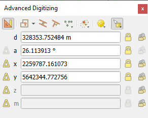

.. _editingvector:

*********
 Editing
*********

.. only:: html

   .. contents::
      :local:

QGIS has various capabilities for editing OGR, SpatiaLite, PostGIS,
MS SQL Server and Oracle Spatial vector layers and tables.
They can be of 2D or 3D geometry type.

.. note::
   The procedure for editing GRASS layers is different - see section
   :ref:`grass_digitizing` for details.

.. _tip_concurrent_edits:

.. attention:: **Concurrent Edits**

   QGIS does not track if somebody else is editing the
   same feature at the same time as you are.
   The last person to save the edits wins.

.. _tip_validating_edits:

.. tip:: **Validating Edits**

   Continuous validation can be activated on a layer basis in the
   :menuselection:`Layer Properties --> Digitizing` tab.
   More at :ref:`digitizingmenu`.

.. index:: Snapping; Snapping tolerance
   single: Digitizing; Snapping

.. _`snapping_tolerance`:

Setting the snapping tolerance and search radius
================================================

Under the :menuselection:`Settings --> Options... --> Digitizing` menu,
QGIS provides a number of parameters to configure default behaviour of
editing tools. More information at :ref:`digitizing_options`.

For optimal and accurate editing of vector layer geometries, we need
to set an appropriate value of snapping tolerance and search radius for
features vertices. The :guilabel:`Snapping` group provides related options,
namely handling of the snapping tolerance and the search radius.

* Snapping tolerance: When you add a new vertex or move an existing one,
  the snapping tolerance is the distance QGIS uses to search for the closest
  vertex or segment you are trying to connect to.
  If you are not within the snapping tolerance, QGIS will leave the
  vertex where you release the mouse button, instead of snapping
  it to an existing vertex or segment.

  The tolerance setting affects all tools that work with snapping and
  applies by default to new layers and projets. It can however be overridden
  at layer level (see :ref:`snapping_options`).

.. index:: Search radius

* Search radius:
  :guilabel:`Search radius for vertex edits` is the distance QGIS uses
  to ``search`` for the vertex to select when you click on the map.
  If you are not within the search radius, QGIS will not find and select
  any vertex for editing.

Snap tolerance and search radius are set in ``map units`` or ``pixels``.
You may need to experiment to get them right.
If you specify a too big tolerance, QGIS may snap to the wrong vertex,
especially if you are dealing with a large number of vertices in close
proximity.
The smaller the search radius, the more difficult it will be to hit
what you want to move.

.. _snapping_options:

Snapping and Digitizing Options
================================

Global :ref:`snapping and digitizing settings <digitizing_options>`
(snapping mode, tolerance value, and units...) can be overridden in the
project from the :menuselection:`Project --> Snapping Options...` menu.
In the :guilabel:`Snapping and Digitizing Options`, you can also configure
some other properties (snapping layers, scale limit, topology...)
The :guilabel:`Snapping Toolbar` gives access to most of these features.

By default, snapping is disabled in a project until you press the
|snapping| :sup:`Enable snapping` button or press :kbd:`S`.
The snapping mode, tolerance value, and units can also be configured in
this toolbar.

Snapping properties
-------------------

There are three options to select the layer(s) to snap to:

* :guilabel:`All layers`: quick setting for all visible layers in the
  project so that the pointer snaps to all vertices and/or segments.
  In most cases, it is sufficient to use this snapping mode, but beware
  when using it for projects with many vector layers, as it may affect
  performance.
* :guilabel:`Current layer`: only the active layer is used, a convenient
  way to ensure topological consistency within the layer being edited.
* :guilabel:`Advanced Configuration`: allows you to enable and adjust
  snapping mode, tolerance and units, overlaps and scales of snapping
  on a layer basis (see :numref:`figure_edit_snapping`).
  If you need to edit a layer and snap its vertices to another, make
  sure that the target layer is checked and increase the snapping
  tolerance to a higher value.
  Snapping will not occur to a layer that is not checked in the
  snapping options dialog.

When moving or creating vertex, you can opt for the following snapping modes:

* |snappingVertex| :guilabel:`Vertex`
* |snappingSegment| :guilabel:`Segment`: snaps along a line or a polygon perimeter.
  If topological editing is enabled, then a new vertex is added at the snapping location.
* |snappingArea| :guilabel:`Area`: guarantees that the snap point lies anywhere on a polygon's area,
  not necessarily on its boundary
* |snappingCentroid| :guilabel:`Centroid`: snaps to the centroid of the geometry of a feature.
  In case of a multipart geometry, the target point may be distinct from the existing parts.
* |snappingMiddle| :guilabel:`Middle of Segments` on line or polygon feature
* |snappingEndpoint| :guilabel:`Line Endpoints`: snaps to the first or last vertex of every part
  of a line or polygon feature.

.. index:: Snapping icons

QGIS will show different *snap* icons depending on the kind of *snap*:

.. list-table:: Snapping icons

   * - .. figure:: img/snap_vertex_icon.png
     - .. figure:: img/snap_segment_icon.png
     - .. figure:: img/snap_intersection_icon.png
   * - Snapping to a vertex: box icon
     - Snapping to a segment: hourglass icon
     - Snapping to an intersection: cross icon

Note that it is possible to change the color of these icons in the
:guilabel:`Digitizing` part of the global settings.

The tolerance values can be set either in the project's ``map units``
or in ``pixels``.
The advantage of choosing ``pixels`` is that it keeps the snapping
constant at different map scales.
10 to 12 pixels is normally a good value, but it depends on the DPI of
your screen.
Using map units allows the tolerance to be related to real ground
distances.
For example, if you have a minimum distance between elements, this
option can be useful to ensure that you don’t add vertices too close to
each other.

.. _figure_edit_snapping:

.. figure:: img/editProjectSnapping.png
   :align: center

   Snapping options (Advanced Configuration mode)

.. note::

   By default, only visible features (the features whose style is displayed,
   except for layers where the symbology is "No symbols") can be snapped.
   You can enable the snapping on invisible features by checking |unchecked|
   :guilabel:`Enable snapping on invisible features` under the
   :menuselection:`Settings --> Options --> Digitizing` tab.

.. tip:: **Enable snapping by default**

   You can set snapping to be enabled by default on all new projects in the
   :menuselection:`Settings --> Options --> Digitizing` tab.
   You can also set the default snapping mode, tolerance value, and units,
   which will populate the :guilabel:`Snapping Options` dialog.

.. index:: Snapping on intersections

Enable snapping on intersections
---------------------------------

Another available option is to use |snappingIntersection| :guilabel:`snapping on
intersection`, which allows you to snap to geometry intersections of
snapping enabled layers, even if there are no vertices at the intersections.

.. index:: Limit snapping to a scale range

Limit snapping to a scale range
-------------------------------

In some cases snapping can become very slow. This is often caused by the
amount of features in some layers that require a heavy index to compute
and maintain. Some parameters exist to enable snapping only when the map
view is inside a relevant scale range. This allows to only do the costly index
computation related to snapping at a scale where drawing is relevant.

Scale limit to snapping is configured in
:menuselection:`Project --> Snapping Options...`.
Limiting snapping to scale is only available in
:guilabel:`Advanced Configuration` mode.

To limit snapping to a scale range you have three modes available:

* :guilabel:`Disabled`: Snapping is enabled whatever the current map scale
  is. This is the default mode.
* :guilabel:`Global`: Snapping is limited and only enabled when the current
  scale of the map is between a global minimum and a global maximum value.
  When selecting this mode two widgets become available
  to configure the range of scales in which snapping is enabled.
* :guilabel:`Per layer`: The snapping scale range limit is defined for each layer.
  When selecting this mode two columns become available
  to configure the minimum and maximum scales for each layer.

Please note that the minimum and maximum scales follow the QGIS convention:
minimum scale is the most "zoomed out" scale while maximum scale is the most "zoomed in".
A minimum or maximum scale that is set to "0" or "not set" is considered not limiting.

.. _self_snapping:

Self-snapping
-------------

The |snappingSelf| :sup:`Self-snapping` option allows you to snap to
the geometry that is being edited. Combined with the :ref:`advanced
digitizing panel <advanced_digitizing_panel>`, this provides a handy way
to digitize new edges relative to the previous edges or vertices.
Self-snapping can cause invalid geometries, use with caution.

.. only:: html

  .. _figure_self_snapping:

  .. figure:: img/self_snapping.gif
     :align: center

     Drawing features with self-snapping

.. index:: Grid snapping

Snapping on custom grid
-----------------------

A snapping distance can also be customized on a layer basis in the
:guilabel:`Digitizing` tab of the layer properties dialog.
With setting the :guilabel:`Geometry precision` distance, you enable
a dotted grid visible when the map canvas is at a coherent scale for display.
Snapping can then be performed on the dots of the grid: an added or modified
geometry will have all of its vertices snapped automatically to the closest
node of the grid. More information at :ref:`digitizingmenu`.

.. index:: Topological editing
   single: Digitizing; Topology

Topological editing
===================

In addition to these snapping options, the :guilabel:`Snapping options...`
dialog (:menuselection:`Project --> Snapping options`) and the
:guilabel:`Snapping` toolbar allow you to enable / disable some other
topological functionalities.

.. index:: Shared polygon boundaries
   seealso: Shared polygon boundaries; Topology

Enable topological editing
--------------------------

The |topologicalEditing| :sup:`Topological editing` button helps
when editing and maintaining features with common boundaries.
With this option enabled, QGIS 'detects' shared boundaries.
When you move common vertices/segments, QGIS will also move them in
the geometries of the neighboring features.

Topological editing works with features from different layers, as long
as the layers are visible and in editing mode.

In layer with Z or M values, topological editing will interpolate the Z or M
value of the vertex based on the value of the edge used for the connection.

.. index:: Avoid overlap
   seealso: Avoid overlap; Topology

Overlapping control
-------------------

Overlapping prevents you from drawing new features that overlap existing ones in the
selected layer, speeding up digitizing of adjacent polygons.
It can be controlled by the overlap tool. Three modes are available:

#. |allowIntersections| :guilabel:`Allow Overlap` (default)
#. |avoidIntersectionsCurrentLayer| :guilabel:`Avoid Overlap on Active Layer`:
   prevents any overlap with other features from the layer being edited.
   Digitize the new geometries so that they overlap their neighbours and
   QGIS will cut the overlapping part(s) of the new geometries and snap them
   to the boundary of the existing features. The advantage is that you don't
   have to digitize the common vertices on boundary.
#. |avoidIntersectionsLayers| :guilabel:`Follow Advanced Configuration`:
   allows the overlapping setting to be set on a layer basis in the
   :guilabel:`Advanced configuration` view mode.

.. note:: If the new geometry is totally covered by existing ones, it gets
   cleared, and QGIS will show an error message.

.. warning:: **Use cautiously the** :guilabel:`Avoid overlap` **option**

   Since this option will cut new overlapping geometries of any polygon layer,
   you can get unexpected geometries if you forget to uncheck it when no longer
   needed.

.. index::
   single: Digitizing tools; Automatic tracing
.. _tracing:

Automatic Tracing
-----------------

Usually, when using capturing map tools (add feature, add part, add
ring, reshape and split), you need to click each vertex of the feature.
With the automatic tracing mode, you can speed up the digitization
process as you no longer need to manually place all the vertices during
digitization:

#. Enable the |tracing| :sup:`Tracing` tool (in the :guilabel:`Snapping` toolbar)
   by pushing the icon or
   pressing :kbd:`T` key.
#. :ref:`Snap to <snapping_tolerance>` a vertex or segment of a feature
   you want to trace along.
#. Move the mouse over another vertex or segment you'd like to snap and,
   instead of the usual straight line, the digitizing rubber band
   represents a path from the last point you snapped to the current
   position. The tool also works with curved geometries.

   QGIS actually uses the underlying features topology to build the
   shortest path between the two points.
   Tracing requires snapping to be activated in traceable layers to build
   the path.
   You should also snap to an existing vertex or segment while digitizing
   and ensure that the two nodes are topologically connectable through
   existing features edges, otherwise QGIS is unable to connect them and
   thus traces a single straight line.
#. Click and QGIS places the intermediate vertices following the displayed
   path.

Unfold the |tracing| :sup:`Enable Tracing` icon and set the
:guilabel:`Offset` option to digitize a path parallel to the features
instead of tracing along them.
A positive value shifts the new drawing to the left side of the tracing
direction and a negative value does the opposite.

.. note:: **Adjust map scale or snapping settings for an optimal tracing**

   If there are too many features in map display, tracing is disabled to avoid
   potentially long tracing structure preparation and large memory overhead.
   After zooming in or disabling some layers the tracing is enabled again.

.. note:: **Does not add topological points**

   This tool does not add points to existing polygon geometries even
   if :guilabel:`Topological editing` is enabled.
   If geometry precision is activated on the edited layer, the resulting
   geometry might not exactly follow an existing geometry.

.. tip:: **Quickly enable or disable automatic tracing by pressing the**
   :kbd:`T` **key**

   By pressing the :kbd:`T` key, tracing can be enabled/disabled
   anytime (even while digitizing a feature), so it is possible to
   digitize parts of the feature with tracing enabled and other
   parts with tracing disabled.
   Tools behave as usual when tracing is disabled.
   
.. tip:: **Convert tracing to curved geometries**
   
   By using :menuselection:`Settings --> Options --> Digitizing --> Tracing` 
   you can create curved geometries while digitizing.
   See :ref:`digitizing options <digitizing_options>`.

.. index:: Digitizing, Digitizing tools
   see: Editing; Digitizing
   seealso: Digitizing; Attribute table

.. _sec_edit_existing_layer:

Digitizing an existing layer
============================

By default, QGIS loads layers read-only. This is a safeguard to avoid
accidentally editing a layer if there is a slip of the mouse.
However, you can choose to edit any layer as long as the data provider
supports it (see :ref:`supported_format`), and the underlying data source
is writable (i.e., its files are not read-only).

.. tip:: **Restrict edit permission on layers within a project**

   From the
   :menuselection:`Project --> Properties... --> Data Sources -->
   Layers Capabilities` table, you can choose to set any layer
   read-only regardless the provider permission.
   This can be a handy way, in a multi-users environment to avoid
   unauthorized users to mistakenly edit layers (e.g., Shapefile),
   hence potentially corrupt data.
   Note that this setting only applies inside the current project.

In general, tools for editing vector layers are divided into a
digitizing and an advanced digitizing toolbar, described in section
:ref:`sec_advanced_edit`.
You can select and unselect both under :menuselection:`View --> Toolbars -->`.

Using the basic digitizing tools, you can perform the following functions:

.. _table_editing:
.. table:: Vector layer basic editing toolbar

  +------------------------------+------------------------------------------------+--------------------------+-------------------------------------------+
  | Tool                         | Purpose                                        | Tool                     | Purpose                                   |
  +==============================+================================================+==========================+===========================================+
  | |allEdits|                   | Access to save, rollback or cancel changes     | |toggleEditing|          | Turn on or off edit status of selected    |
  |                              | in all or selected layers simultaneously       |                          | layer(s) based on the active layer status |
  +------------------------------+------------------------------------------------+--------------------------+-------------------------------------------+
  | |saveEdits|                  | Save edits to the active layer                 |                          |                                           |
  +------------------------------+------------------------------------------------+--------------------------+-------------------------------------------+
  | |digitizeWithSegment|        | Digitize using straight segments               | |digitizeWithCurve|      | Digitize using curve lines                |
  +------------------------------+------------------------------------------------+--------------------------+-------------------------------------------+
  | |streamingDigitize|          | Enable freehand digitizing                     | |digitizeShape|          | Digitize polygon of regular shape         |
  +------------------------------+------------------------------------------------+--------------------------+-------------------------------------------+
  | |newTableRow|                | Add new record                                 | |capturePoint|           | Add Feature: Capture Point                |
  +------------------------------+------------------------------------------------+--------------------------+-------------------------------------------+
  | |captureLine|                | Add Feature: Capture Line                      | |capturePolygon|         | Add Feature: Capture Polygon              |
  +------------------------------+------------------------------------------------+--------------------------+-------------------------------------------+
  | |vertexTool|                 | Vertex Tool (All Layers)                       | |vertexToolActiveLayer|  | Vertex Tool (Current Layer)               |
  +------------------------------+------------------------------------------------+--------------------------+-------------------------------------------+
  | |checkbox| :guilabel:`Show   | Set whether the vertex editor panel should     |  |multiEdit|             | Modify the attributes of all              |
  | Vertex Editor`               | auto-open                                      |                          | selected features simultaneously          |
  +------------------------------+------------------------------------------------+--------------------------+-------------------------------------------+
  | |deleteSelectedFeatures|     | Delete Selected features from the active layer | |editCut|                | Cut Features from the active layer        |
  +------------------------------+------------------------------------------------+--------------------------+-------------------------------------------+
  | |editCopy|                   | Copy selected Features from the active layer   | |editPaste|              | Paste Features into the active layer      |
  +------------------------------+------------------------------------------------+--------------------------+-------------------------------------------+
  | |undo|                       | Undo changes in the active layer               | |redo|                   | Redo changes in active layer              |
  +------------------------------+------------------------------------------------+--------------------------+-------------------------------------------+

Note that while using any of the digitizing tools, you can still
:ref:`zoom or pan <zoom_pan>` in the map canvas without losing the
focus on the tool.

All editing sessions start by choosing the |toggleEditing|
:sup:`Toggle editing` option found in the context menu of a given layer,
from the attribute table dialog, the digitizing toolbar or the
:menuselection:`Layer` menu.

Once the layer is in edit mode, additional tool buttons on the editing
toolbar will become available and markers will appear at the vertices
of all features unless
:guilabel:`Show markers only for selected features` option under
:menuselection:`Settings --> Options... --> Digitizing` menu is checked.

.. _tip_save_regularly:

.. tip:: **Save Regularly**

   Remember to |saveEdits| :sup:`Save Layer Edits` regularly.
   This will also check that your data source can accept all the changes.

.. index::
   single: Digitizing tools; Draw curves
   single: Digitizing tools; Stream digitizing
.. _drawing_methods:

Geometry editing techniques
---------------------------

When a geometry drawing tool (mainly the ones that add, split, reshape features)
is enabled for a line or polygon based layer, you can select the technique for
adding new vertices:

* The |digitizeWithSegment| :sup:`Digitize with Segment`: draws straight segment
  whose start and end points are defined by left clicks.
* The |digitizeWithCurve| :sup:`Digitize with Curve`: draws curve line based on
  three consecutive nodes defined by left clicks (start, point along the arc, end).
  If the geometry type does not support curves, then consecutive smaller segments
  are used to approximate the curvature.
* The |streamingDigitize| :sup:`Stream Digitizing`: draws lines in freehand mode,
  i.e. nodes are added following cursor movement in the map canvas and
  a :guilabel:`Streaming Tolerance`.
  The streaming tolerance defines the spacing between consecutive vertices.
  Currently, the only supported unit is pixels (``px``). Only the starting left
  click and the ending right click are necessary in this mode.
* The |digitizeShape| :sup:`Digitize Shape`: triggers tools on the
  :ref:`Shape Digitizing Toolbar <shape_edit>` to draw a polygon of a regular shape.

The selected technique remains while switching among the digitizing tools.
You can combine any of the first three methods while drawing the same geometry.

.. index:: Adding features, Rubber band
.. _add_feature:

Adding Features
---------------

Depending on the layer type, you can use the |newTableRow| :sup:`Add Record`,
|capturePoint| :sup:`Add Point Feature`, |captureLine| :sup:`Add Line Feature`
or |capturePolygon| :sup:`Add Polygon Feature` icons on the toolbar to add new
features into the current layer.

To add a geometryless feature, click on the |newTableRow| :sup:`Add Record`
button and you can enter attributes in the feature form that opens.

To create features with the spatially enabled tools, you first digitize the
geometry then enter its attributes. To digitize the geometry:

#. (Optional as it is the default) Select the |digitizeWithSegment|
   :sup:`Digitize With Segment` geometry drawing method
#. Left-click on the map area to create the first point of your new feature.
   For point features, this should be enough and trigger, if required,
   the feature form to fill in their attributes.
#. For line or polygon geometries, keep on left-clicking for each additional
   point you wish to capture.
   You can rely on the :ref:`snapping to features <snapping_options>` options,
   the :ref:`snap-to-grid <snap_to_grid>` or the :ref:`advanced digitizing
   <advanced_digitizing_panel>` panel to accurately position each vertex.

   Along with drawing straight segments between nodes you click one by one,
   lines and polygons can be:

   * :ref:`traced automatically <tracing>`, accelerating the digitization.
     This will create consecutive straight lines between the vertices you
     place, following existing features.
   * free-hand digitized, pressing :kbd:`R` or activating |streamingDigitize|
     :sup:`Stream Digitizing`.
   * drawn as curve, pressing :kbd:`Ctrl+Shift+G` or activating |digitizeWithCurve|
     :sup:`Digitize with Curve`.

   .. note::
    While digitizing line or polygon geometries, you can switch back and forth
    between the geometry drawing methods, allowing you to create features
    mixing straight segments, free-hand ones and curved parts.

#. Press :kbd:`Delete` or :kbd:`Backspace` key to revert the last node(s) you
   may wrongly add.
#. When you have finished adding points, right-click anywhere on the map area
   to confirm you have finished entering the geometry of that feature.

   .. tip:: **Customize the digitizing rubber band**

    While capturing polygon, the by-default red rubber band can hide underlying
    features or places you'd like to capture a point. This can be fixed by setting
    a lower opacity (or alpha channel) to the rubber band's :guilabel:`Fill Color`
    in :menuselection:`Settings --> Options --> Digitizing` menu.
    You can also avoid the use of the rubber band by checking :guilabel:`Don't
    update rubber band during node editing`.

#. For line feature pressing :kbd:`Shift` + right-click will close the line automatically.

#. The attribute window will appear, allowing you to enter the information for
   the new feature. :numref:`Figure_edit_values` shows setting attributes for
   a fictitious new river. However, in the :guilabel:`Digitizing` menu under the
   :menuselection:`Settings --> Options` menu, you can also:

   * |checkbox| :guilabel:`Suppress attributes pop-up windows after
     each created feature` to avoid the form opening;
   * or |checkbox| :guilabel:`Reuse last entered attribute values` to
     have fields automatically filled at the opening of the form and
     just have to type changing values.

.. _figure_edit_values:

.. figure:: img/editDigitizing.png
   :align: center

   Enter Attribute Values Dialog after digitizing a new vector feature

.. index:: Vertex tool
.. _vertex_tool:

Vertex tool
-----------

QGIS provides two tools to interact with vector features vertices:

* |vertexToolActiveLayer| :sup:`Vertex Tool (Current Layer)`: only
  overlaid features in the active layer (in the :guilabel:`Layers`
  panel) are affected
* |vertexTool| :sup:`Vertex Tool (All Layers)`: any overlaid features
  in all editable layers are affected. This allows you to edit features
  without switching the active layer or edit multiple layers at once
  (e.g., country and their regions boundaries)

For any editable vector layer, the vertex tools provide manipulation
capabilities of
feature vertices similar to CAD programs. It is possible to select
multiple vertices at once and to move, add or delete them altogether.
The vertex tools also support the topological editing feature.
They are selection persistent, so when some
operation is done, selection stays active for this feature and tool.

It is important to set the property :menuselection:`Settings -->` |options|
:menuselection:`Options --> Digitizing -->` :guilabel:`Search Radius:`
|selectNumber| to a number greater than zero. Otherwise, QGIS will
not be able to tell which vertex is being edited and will display a warning.

.. _tip_vertex_markers:

.. tip:: **Vertex Markers**

   QGIS supports different kinds of vertex markers:
   'Semi-transparent circle', 'Cross' and 'None'. To change the marker style,
   choose |options| :menuselection:`Options` from the
   :menuselection:`Settings` menu, click on the :guilabel:`Digitizing`
   tab and select the appropriate entry.

Basic operations
................

.. index:: Nodes, Vertices, Vertex, Geometryless feature

Given a layer in edit mode, start by activating the vertex tool.
Red circles will appear when hovering vertices.

* **Selecting vertices**: You can select vertices by:

  * Clicking on them one at a time holding :kbd:`Shift` key pressed
  * Click-and-dragging a rectangle surrounding the target vertices
  * Drawing a polygon surrounding the target vertices: Hold :kbd:`Alt`
    and click using the vertex tool to start digitizing a polygon.
    Each subsequent click adds a new vertex to the rubberband polygon.
    :kbd:`Backspace` or :kbd:`Delete` removes last added rubberband vertex.
    :kbd:`Esc` cancels the polygon selection mode, as also does
    backspacing/deleting all of the rubberband's vertices.
    Right click finalizes the polygon digitizing and selects all vertices
    within the rubberband polygon.

  When a vertex is selected, its color changes to blue.
  To add more vertices to the current selection, hold down
  the :kbd:`Shift` key while proceeding as above.
  To remove vertices from the selection, hold down :kbd:`Ctrl`.

  .. tip:: **Feature selection bounds vertex tool**

    Vertices can be selected accross different features (or layers).
    If you are looking for vertices of a specific feature in a crowded place,
    first select that feature. Then draw the rectangle or polygon selector
    with the vertex tool around the vertices: only the selected feature's
    vertices are selected.

    This is also the case if you display the feature in the
    :ref:`vertex editor <vertex_editor_panel>` panel.

* **Batch vertex selection mode**:
  The batch selection mode can be activated by pressing :kbd:`Shift+R`.
  Select a first node with one single click, and then hover **without clicking**
  another vertex. This will dynamically select all the nodes in
  between using the shortest path (for polygons).

  .. _figure_batch_select_vertex:

  .. figure:: img/vertex_batch_selection_mode.png
     :align: center

     Batch vertex selection using :kbd:`Shift+R`

  Press :kbd:`Ctrl` will invert the selection, selecting the longest
  path along the feature boundary.
  Ending your node selection with a second click, or pressing :kbd:`Esc`
  will escape the batch mode.

* **Adding vertices**: To add a vertex to a line or polygon geometry,
  hold :kbd:`Shift` and double-click the place on the segment.

  When hovering a segment, a virtual new node appears on the center.
  Click on it, move the cursor to a new location and click again to add a new vertex.
  For lines, a virtual node is also proposed at both extremities: click on it,
  do subsequent clicks and finish with a right-click; this allows
  to easily extend an existing line.

  .. _figure_vertex_add_node:

  .. figure:: img/vertex_add_node.png
     :align: center

     Virtual nodes for adding vertices

* **Deleting vertices**: Select the vertices and click the
  :kbd:`Delete` key.
  Deleting all the vertices of a feature generates, if compatible with
  the datasource, a geometryless feature. Note that this doesn't delete
  the complete feature, just the geometry part.
  To delete a complete feature use the |deleteSelectedFeatures|
  :sup:`Delete Selected` tool.

* **Moving vertices**: Select all the vertices you want to move, click
  on a selected vertex or edge, and click on the desired new location.
  You can use the :ref:`snapping to feature capabilities <snapping_options>`
  and the :ref:`Advanced Digitizing Panel <advanced_digitizing_panel>`
  constraints for distance, angles, exact X and Y location before
  the second click. All the selected vertices will be translated.

  However, if the :ref:`snap-to-grid <snap_to_grid>` option is enabled,
  selected vertices are snapped to the closest grid intersection to their
  translated position.
  Unselected vertices are also moved to their closest grid intersection.
  There is no simple translation.

  .. _figure_vertex_snap_to_grid:

  .. figure:: img/vertex_snap_to_grid.png
     :align: center

     Moving the top vertex snaps all the vertices to the grid

* **Converting adjacent segments to/from curve**: Select the center vertex of the segment you want
  to convert, hit the :kbd:`O` letter key.
  If the vertex was in a curve, the curve is converted into straight lines.
  If the vertex was between two straight lines, they are converted into a curve.
  A first or a last vertex of a line can't be converted to a center vertex curve.
  The layer must be compatible with curve geometry type.

  .. _figure_vertex_convert_curve:

  .. figure:: img/vertex_convert_curve.png
     :align: center

     Switch from curve to straight lines with :kbd:`O` letter

Each change made with the vertex tool is stored as a separate entry in the
:guilabel:`Undo` dialog. Remember that all operations support
topological editing when this is turned on.
On-the-fly projection is also supported.

.. index:: Vertex editor panel
.. _vertex_editor_panel:

The Vertex Editor Panel
.......................

With enabling a vertex tool, you also open the :guilabel:`Vertex Editor` panel.
Right-clicking over a feature fills the panel with the list of all the vertices of the feature
with their :guilabel:`x`, :guilabel:`y` (:guilabel:`z`, :guilabel:`m` if applicable) coordinates
and :guilabel:`r` (for the radius, in case of circular geometry).
The feature is also made exclusive for editing, meaning that the edit of any other features is disabled:

* Selecting a row in the table does select the corresponding vertex in the map canvas, and vice versa.
* Clicking or dragging over the map canvas will only select or move vertices and segments of that feature
* Change a coordinate in the table and the vertex position is updated.
  This is a convenient way to edit Z coordinate or M value on vertices.
* You can also select multiple rows and delete them altogether.
* New vertices can only be added to the bound feature

If you do not want the :guilabel:`Vertex Editor` panel to immediately show
each time you interact with vertex tools (and potentially hide other panels
or disturb panels placement), uncheck the :guilabel:`Auto-open table` entry
in the |hamburgerMenu| :sup:`Options` menu at the top of the panel.
You can then also close the panel.
To reopen the panel, you would need to right-click over a panel or toolbar and
select it in the list or tick the :guilabel:`Show vertex editor` entry in
the :guilabel:`Digitizing toolbar`.

.. _figure_edit_vertex:

.. figure:: img/vertex_editor_panel.png
   :align: center

   Vertex editor panel showing selected nodes

.. index:: 3D
.. _digitizing_zm:

Rules of Z coordinate or M value assignment
-------------------------------------------

Digitizing 3D vector features or features with M value is not that different from (X,Y) 2D layers'.
Tools and options described in this chapter are still available
and help you place the vertex or point in a planar environment.
Then you may need to handle the Z coordinate (or M value) assignment:

* By default, QGIS will assign to new vertices the :guilabel:`Default Z value`
  (respectively :guilabel:`Default M value`) set in the
  :menuselection:`Settings --> Options --> Digitizing` tab.
  If the :ref:`Advanced Digitizing Panel <advanced_digitizing_panel>` is in
  use, then the value is taken from its :guilabel:`z`
  (respectively :guilabel:`m`) widget.
* When snapping to a vertex, the new or moved vertex takes the snapped one's Z or M value.
* When snapping to a segment while the topological editing is on,
  then the new vertex Z or M value is interpolated along the segment.
* If the :guilabel:`z` (respectively :guilabel:`m`) widget of the
  :guilabel:`Advanced Digitizing Panel` is |locked| locked, then its value is
  applied to the vertex, taking precedence over any snapped vertex or segment
  Z or M value.

To edit Z or M values of an existing feature, you can use the
:ref:`Vertex editor panel <vertex_editor_panel>`.
To create features with custom Z or M values you may want to rely on the
:guilabel:`Advanced Digitizing Panel`.

.. _clipboard_feature:

Cutting, Copying and Pasting Features
-------------------------------------

Selected features can be cut, copied and pasted between layers in the same
QGIS project, as long as destination layers are set to |toggleEditing|
:sup:`Toggle editing` beforehand.

.. index:: Polygon to line, Line to polygon

.. _tip_polygon_to_line:

.. tip:: **Transform polygon into line and vice-versa using copy/paste**

   Copy a line feature and paste it in a polygon layer:
   QGIS pastes in the target layer a polygon whose boundary corresponds
   to the closed geometry of the line feature.
   This is a quick way to generate different geometries of the same
   data.

.. index:: CSV, WKT, GeoJSON

Features can also be pasted to external applications as text.
That is, the features are represented in CSV format, with the geometry
data appearing in the OGC Well-Known Text (WKT) format.
WKT and GeoJSON features from outside QGIS can also be pasted to a
layer within QGIS.

When would the copy and paste function come in handy? Well, it turns
out that you can edit more than one layer at a time
and copy/paste features between layers. Why would we want to do this?
Say we need to do some work on a new layer but only need one or two
lakes, not the 5,000 on our ``big_lakes`` layer.
We can create a new layer and use copy/paste to plop the needed lakes
into it.

As an example, we will copy some lakes to a new layer:

#. Load the layer you want to copy from (source layer)
#. Load or create the layer you want to copy to (target layer)
#. Start editing for target layer
#. Make the source layer active by clicking on it in the legend
#. Use the |selectRectangle| :sup:`Select Features by area or single click`
   tool to select the feature(s) on the source layer
#. Click on the |editCopy| :sup:`Copy Features` tool
#. Make the destination layer active by clicking on it in the legend
#. Click on the |editPaste| :sup:`Paste Features` tool
#. Stop editing and save the changes

What happens if the source and target layers have different schemas (field
names and types are not the same)? QGIS populates what matches and ignores
the rest. If you don't care about the attributes being copied to the target
layer, it doesn't matter how you design the fields and data types. If you
want to make sure everything - the feature and its attributes - gets copied,
make sure the schemas match.

.. _tip_projections_and_pasting:

.. note:: **Congruency of Pasted Features**

   If your source and destination layers use the same projection, then the
   pasted features will have geometry identical to the source layer. However,
   if the destination layer is a different projection, then QGIS cannot
   guarantee the geometry is identical. This is simply because there are
   small rounding-off errors involved when converting between projections.

.. _tip_copying_string_attributes:

.. tip:: **Copy string attribute into another**

   If you have created a new column in your attribute table with type
   'string' and want to paste values from another attribute column that
   has a greater length the length of the column size will be extended
   to the same amount.
   This is because the GDAL Shapefile driver knows to auto-extend string
   and integer fields to dynamically  accommodate for the length of
   the data to be inserted.

.. _delete_feature:

Deleting Selected Features
--------------------------

If we want to delete an entire feature (attribute and geometry), we can do that
by first selecting the geometry using the regular |selectRectangle| :sup:`Select
Features by area or single click` tool. Selection can also be done from the attribute
table. Once you have the selection set, press :kbd:`Delete` or :kbd:`Backspace`
key or use the |deleteSelectedFeatures| :sup:`Delete Selected` tool to delete
the features. Multiple selected features can be deleted at once.

The |editCut| :sup:`Cut Features` tool on the digitizing toolbar can
also be used to delete features. This effectively deletes the feature but
also places it on a "spatial clipboard". So, we cut the feature to delete.
We could then use the |editPaste| :sup:`Paste Features` tool to put it back,
giving us a one-level undo capability. Cut, copy, and paste work on the
currently selected features, meaning we can operate on more than one at a time.

.. index::
   single: Digitizing tools; Undo
   single: Digitizing tools; Redo
.. _undoredo_edits:

Undo and Redo
-------------

The |undo| :sup:`Undo` and |redo| :sup:`Redo` tools allows you to undo or redo
vector editing operations. There is also a dockable widget, which shows all
operations in the undo/redo history (see :numref:`Figure_edit_undo`). This widget is not
displayed by default; it can be displayed by right-clicking on the toolbar and
activating the :guilabel:`Undo/Redo Panel` checkbox. The Undo/Redo capability
is however active, even if the widget is not displayed.

.. _figure_edit_undo:

.. figure:: img/redo_undo.png
   :align: center

   Redo and Undo digitizing steps

When Undo is hit or :kbd:`Ctrl+Z` (or :kbd:`Cmd+Z`) pressed, the state of all
features and attributes are reverted to
the state before the reverted operation happened. Changes other than normal
vector editing operations (for example, changes done by a plugin) may or may
not be reverted, depending on how the changes were performed.

To use the undo/redo history widget, simply click to select an operation in
the history list. All features will be reverted to the state they were in
after the selected operation.

.. _save_feature_edits:

Saving Edited Layers
--------------------

When a layer is in editing mode, any changes remain in the memory of QGIS.
Therefore, they are not committed/saved immediately to the data source or disk.
If you want to save edits to the current layer but want to continue editing
without leaving the editing mode, you can click the |saveEdits|
:sup:`Save Layer Edits` button. When you turn editing mode off with
|toggleEditing| :sup:`Toggle editing` (or quit QGIS for that matter),
you are also asked if you want to save your changes or discard them.

If the changes cannot be saved (e.g., disk full, or the attributes have values
that are out of range), the QGIS in-memory state is preserved. This allows
you to adjust your edits and try again.

.. _tip_data_integrity:

.. tip:: **Data Integrity**

   It is always a good idea to back up your data source before you start
   editing. While the authors of QGIS have made every effort to preserve the
   integrity of your data, we offer no warranty in this regard.

.. index:: Current edits

Saving multiple layers at once
...............................

This feature allows the digitization of multiple layers. Choose
|fileSaveAs| :guilabel:`Save for Selected Layers` to save all changes you
made in multiple layers. You also have the opportunity to
|rollbackEdits| :guilabel:`Rollback for Selected Layers`, so that the
digitization may be withdrawn for all selected layers.
If you want to stop editing the selected layers, |cancelEdits| :guilabel:`Cancel
for Selected Layer(s)` is an easy way.

The same functions are available for editing all layers of the project.

.. tip:: **Use transaction group to edit, save or rollback multiple layers changes at once**

   When working with layers from the same PostGreSQL database, activate the
   :guilabel:`Automatically create transaction groups where possible` option in
   :menuselection:`Project --> Properties... --> Data Sources` to sync their
   behavior (enter or exit the edit mode, save or rollback changes at the same time).

.. _sec_advanced_edit:

Advanced digitizing
===================

.. _table_advanced_editing:
.. table:: Vector layer advanced editing toolbar

  +---------------------------+-----------------------------------------+------------------------+-------------------------+
  | Icon                      | Purpose                                 | Icon                   | Purpose                 |
  +===========================+=========================================+========================+=========================+
  | |cad|                     | Enable Advanced Digitizing Tools        |                        |                         |
  +---------------------------+-----------------------------------------+------------------------+-------------------------+
  | |moveFeature|             | Move Feature(s)                         | |moveFeatureCopy|      | Copy and Move Feature(s)|
  | |moveFeatureLine|         |                                         | |moveFeatureCopyLine|  |                         |
  | |moveFeaturePoint|        |                                         | |moveFeatureCopyPoint| |                         |
  +---------------------------+-----------------------------------------+------------------------+-------------------------+
  | |rotateFeature|           | Rotate Feature(s)                       | |simplify|             | Simplify Feature        |
  +---------------------------+-----------------------------------------+------------------------+-------------------------+
  | |scaleFeature|            | Scale Feature                           |                        |                         |
  +---------------------------+-----------------------------------------+------------------------+-------------------------+
  | |addRing|                 | Add Ring                                | |addPart|              | Add Part                |
  +---------------------------+-----------------------------------------+------------------------+-------------------------+
  | |fillRing|                | Fill Ring                               | |reverseLine|          | Swap direction          |
  +---------------------------+-----------------------------------------+------------------------+-------------------------+
  | |deleteRing|              | Delete Ring                             | |deletePart|           | Delete Part             |
  +---------------------------+-----------------------------------------+------------------------+-------------------------+
  | |offsetCurve|             | Offset Curve                            | |reshape|              | Reshape Features        |
  +---------------------------+-----------------------------------------+------------------------+-------------------------+
  | |splitParts|              | Split Parts                             | |splitFeatures|        | Split Features          |
  +---------------------------+-----------------------------------------+------------------------+-------------------------+
  | |mergeFeatureAttributes|  | Merge Attributes of Selected Features   | |mergeFeatures|        | Merge Selected Features |
  +---------------------------+-----------------------------------------+------------------------+-------------------------+
  | |rotatePointSymbols|      | Rotate Point Symbols                    | |offsetPointSymbols|   | Offset Point Symbols    |
  +---------------------------+-----------------------------------------+------------------------+-------------------------+
  | |trimExtend|              | Trim or Extend Feature                  |                        |                         |
  +---------------------------+-----------------------------------------+------------------------+-------------------------+

.. index::
   single: Digitizing tools; Move feature
   single: Digitizing tools; Move and copy feature
.. _move_feature:

Move Feature(s)
---------------

The |moveFeature| :sup:`Move Feature(s)` tool allows you to move existing features:

#. Select the feature(s) to move.
#. Click on the map canvas to indicate the origin point of the displacement; you
   can rely on snapping capabilities to select an accurate point.

   You can also take advantages of the :ref:`advanced digitizing constraints
   <advanced_digitizing_panel>` to accurately set the origin point coordinates. In
   that case:

   #. First click on the |cad| button to enable the panel.
   #. Type ``x`` and enter the corresponding value for the origin point you'd like
      to use. Then press the |locked| button next to the option to lock the value.
   #. Do the same for the ``y`` coordinate.
   #. Click on the map canvas and your origin point is placed at the indicated
      coordinates.

#. Move over the map canvas to indicate the destination point of the displacement,
   still using snapping mode or, as above, use the advanced digitizing panel which
   would provide complementary ``distance`` and ``angle`` placement constraints
   to place the end point of the translation.
#. Click on the map canvas: the whole features are moved to new location.

Likewise, you can create a translated copy of the feature(s) using the
|moveFeatureCopy| :sup:`Copy and Move Feature(s)` tool.

.. note::

   If no feature is selected when you first click on the map canvas with any of
   the :guilabel:`Move Feature(s)` or :guilabel:`Copy and Move Feature(s)` tools,
   then only the feature under the mouse is affected by the action. So, if you
   want to move several features, they should be selected first.

.. index::
   single: Digitizing tools; Rotate Feature
.. _rotate_feature:

Rotate Feature(s)
-----------------

Use the |rotateFeature| :sup:`Rotate Feature(s)` tool to rotate one or multiple
features in the map canvas:

#. Press the |rotateFeature| :sup:`Rotate Feature(s)` icon
#. Then click on the feature to rotate. The feature's centroid is referenced as
   rotation center, a preview of the rotated feature is displayed and a widget
   opens showing the current :guilabel:`Rotation` angle.
#. Click on the map canvas when you are satisfied with the new placement or
   manually enter the rotation angle in the text box. You can also use the
   :guilabel:`Snap to °` box to constrain the rotation values.
#. If you want to rotate several features at once, they shall be selected first,
   and the rotation is by default around the centroid of their combined
   geometries.

You can also use an anchor point different from the default feature centroid:
press the :kbd:`Ctrl` button, click on the map canvas and that point will be
used as the new rotation center.

If you hold :kbd:`Shift` before clicking on the map, the rotation will be done
in 45 degree steps, which can be modified afterwards in the user input widget.

To abort feature rotation, press the :kbd:`ESC` button or click on the
|rotateFeature| :sup:`Rotate Feature(s)` icon.

.. index::
   single: Digitizing tools; Scale Feature
.. _scale_feature:

Scale Feature
-------------

The |scaleFeature| :sup:`Scale Feature` tool is similar to the Rotate feature. Though instead of performing
a rotation of selected features, it rescales their geometry. The change is
performed in relation to the anchor point and the scale ratio can be manually specified
in the widget that appears in the upper corner of the canvas.

.. index::
   single: Digitizing tools; Simplify Feature
.. _simplify_feature:

Simplify Feature
----------------

The |simplify| :sup:`Simplify Feature` tool allows you to interactively
reshape a line or polygon geometry by reducing or densifying the number of
vertices, as long as the geometry remains valid:

#. Select the |simplify| :sup:`Simplify Feature` tool.
#. Click on the feature or drag a rectangle over the features.
#. A dialog pops up allowing you to define the :guilabel:`Method` to apply, ie
   whether you would like to:

   * :ref:`simplify the geometry <qgissimplifygeometries>`, meaning less vertices
     than the original. Available methods are ``Simplify by distance``, ``Simplify
     by snapping to grid`` or ``simplify by area (Visvalingam)``. You'd then need
     to indicate the value of :guilabel:`Tolerance` in ``Layer units``, ``Pixels``
     or ``map units`` to use for simplification. The higher the tolerance is the
     more vertices can be deleted.

     .. TODO: it could be nice to have slight details on these methods and
        what the tolerance actually represents...

   * or :ref:`densify the geometries <qgissmoothgeometry>` with new vertices
     thanks to the ``Smooth`` option: for each existing vertex, two vertices are
     placed on each of the segments originated from it, at an :guilabel:`Offset`
     distance representing the percentage of the segment length.
     You can also set the number of :guilabel:`Iterations` the placement would
     be processed: the more iterations, the more vertices and smoother is the
     feature.

   Settings that you used will be saved when leaving a project or an edit
   session. So you can go back to the same parameters the next time you
   simplify a feature.
#. A summary of the modifications that would apply is shown at the bottom of the
   dialog, listing number of features and number of vertices (before and after
   the operation and the ratio the change represents).
   Also, in the map canvas, the expected geometry is displayed over the existing
   one, using the rubberband color.
#. When the expected geometry fits your needs, click :guilabel:`OK` to apply the
   modification.
   Otherwise, to abort the operation, you can either press :guilabel:`Cancel` or
   right-click in the map canvas.

.. note:: Unlike the feature simplification option in :menuselection:`Settings -->
   Options --> Rendering` menu which simplifies the geometry just for rendering,
   the |simplify| :sup:`Simplify Feature` tool permanently modifies
   feature's geometry in data source.

.. index:: Geometryless feature, Multipoint, Multiline, Multipolygon
   single: Digitizing tools; Add Part
.. _add_part:

Add Part
--------

You can |addPart| :sup:`Add Part` to a selected feature generating a
multipoint, multiline or multipolygon feature. The new part must be digitized
outside the existing one which should be selected beforehand.

The |addPart| :sup:`Add Part` can also be used to add a geometry to a geometryless
feature. First, select the feature in the attribute table and digitize the new
geometry with the |addPart| :sup:`Add Part` tool.

.. index::
   single: Digitizing tools; Delete Part
.. _delete_part:

Delete Part
-----------

The |deletePart| :sup:`Delete Part` tool allows you to delete parts from
multifeatures (e.g., to delete polygons from a multi-polygon feature). This
tool works with all multi-part geometries: point, line and polygon. Furthermore,
it can be used to totally remove the geometric component of a feature.
To delete a part, simply click within the target part.

.. index::
   single: Digitizing tools; Add Ring
.. _add_ring:

Add Ring
--------

You can create ring polygons using the |addRing|
:sup:`Add Ring` icon in the toolbar. This means that inside an existing area, it
is possible to digitize further polygons that will occur as a 'hole', so
only the area between the boundaries of the outer and inner polygons remains
as a ring polygon.

.. FixMe: I think this tool should behave as below
.. Like many digitizing tools, the |addRing| :sup:`Add Ring` tool adds ring to all
.. selected features if any, otherwise all overlapping features are pierced.

.. index::
   single: Digitizing tools; Fill Ring
.. _fill_ring:

Fill Ring
---------

The |fillRing| :sup:`Fill Ring` tool helps you create polygon feature that
totally falls within another one without any overlapping area; that is the new
feature covers a hole within the existing one. To create such a feature:

#. Select the |fillRing| :sup:`Fill Ring` tool.
#. Draw a new polygon over the existing feature: QGIS adds a ring to its geometry
   (like if you used the |addRing| :sup:`Add Ring` tool) and creates a new
   feature whose geometry matches the ring (like if you :ref:`traced <tracing>`
   over the interior boundaries with the |capturePolygon| :sup:`Add polygon
   feature` tool).
#. Or alternatively, if the ring already exists on the feature, place the mouse
   over the ring and left-click while pressing :kbd:`Shift`: a new feature
   filling the hole is drawn at that place.

   The :guilabel:`Feature Attributes` form of the new feature opens, pre-filled
   with values of the "parent" feature and/or :ref:`fields constraints
   <configure_field>`.

.. index::
   single: Digitizing tools; Delete Ring
.. _delete_ring:

Delete Ring
-----------

The |deleteRing| :sup:`Delete Ring` tool allows you to delete rings within
an existing polygon, by clicking inside the hole. This tool only works with
polygon and multi-polygon features. It doesn't
change anything when it is used on the outer ring of the polygon.

.. index::
   single: Digitizing tools; Reshape Feature
   single: Digitizing tools; Extend lines
.. _reshape_feature:

Reshape Features
----------------

You can reshape line and polygon features using the |reshape|
:sup:`Reshape Features` tool on the toolbar. For lines, it replaces the line
part from the first to the last intersection with the original line.

.. _figure_reshape_line:

.. figure:: img/reshape_lines.png
   :align: center

   Reshape line

.. tip:: **Extend linestring geometries with reshape tool**

  Use the |reshape| :sup:`Reshape Features` tool to extend existing linestring
  geometries: snap to the first or last vertex of the line and draw a new one.
  Validate and the feature's geometry becomes the combination of the two lines.

For polygons, it will reshape the polygon's boundary. For it to work, the
reshape tool's line must cross the polygon's boundary at least twice. To draw
the line, click on the map canvas to add vertexes. To finish it, just
right-click. Like with the lines, only the segment between the first and the
last intersections is considered. The reshape line's segments that are inside
the polygon will result in cropping it, where the ones outside the polygon will
extend it.

.. _figure_reshape_polygon:

.. figure:: img/reshape_polygon.png
   :align: center

   Reshape polygon

With polygons, reshaping can sometimes lead to unintended results.
It is mainly useful to replace smaller parts of a polygon, not for
major overhauls, and the reshape line is not allowed to cross several
polygon rings, as this would generate an invalid polygon.

.. note::
   The reshape tool may alter the starting position of a polygon ring or a
   closed line. So, the point that is represented 'twice' will not be the same
   any more. This may not be a problem for most applications, but it is
   something to consider.

.. index::
   single: Digitizing tools; Offset Curves
.. _offset_curve:

Offset Curves
-------------

The |offsetCurve| :sup:`Offset Curve` tool creates parallel shifts of
line layers.
The tool can be applied to the edited layer (the geometries are modified)
or also to background layers (in which case it creates copies of the lines /
rings and adds them to the edited layer).
It is thus ideally suited for the creation of distance line layers.
The :guilabel:`User Input` dialog pops-up, showing the displacement distance.

To create a shift of a line layer, you must first go into editing mode
and activate the |offsetCurve| :sup:`Offset Curve` tool.
Then click on a feature to shift it.
Move the mouse and click where wanted or enter the desired distance in
the user input widget. Holding :kbd:`Ctrl` during the 2nd click will make an offset copy. 
Your changes may then be saved with the |saveEdits|
:sup:`Save Layer Edits` tool.

QGIS options dialog (Digitizing tab then **Curve offset tools** section) allows
you to configure some parameters like **Join style**, **Quadrant segments**,
**Miter limit**.

.. index::
   single: Digitizing tools; Reverse Line
.. _reverse_line:

Reverse Line
------------
Changing the direction of a line geometry can be useful for
cartographical purposes or when preparing for network analysis.

To change a line direction:

#. Activate the reverse line tool by clicking |reverseLine|
   :sup:`Reverse line`.
#. Click on the line. The direction of the line
   is reversed.

.. index::
   single: Digitizing tools; Split Features
.. _split_feature:

Split Features
--------------

Use the |splitFeatures| :sup:`Split Features` tool to split a feature into two
or more new and independent features, ie. each geometry corresponding to a new
row in the attribute table.

To split line or polygon features:

#. Select the |splitFeatures| :sup:`Split Features` tool.
#. Draw a line across the feature(s) you want to split.
   If a selection is active, only selected features are split.
   Fields of resulting features are filled according to their :ref:`splitting policy <policies>`.
#. You can then as usual modify any of the attributes of any resulting feature.

.. tip:: **Split a polyline into new features in one-click**

   Using the |splitFeatures| :sup:`Split Features` tool, snap and click on an
   existing vertex of a polyline feature to split that feature into two new features.

.. index::
   single: Digitizing tools; Split Parts
.. _split_part:

Split parts
-----------

In QGIS it is possible to split the parts of a multi part feature so that the
number of parts is increased. Just draw a line across the part you want to split using
the |splitParts| :sup:`Split Parts` icon.

.. tip:: **Split a polyline into new parts in one-click**

   Using the |splitParts| :sup:`Split Parts` tool, snap and click on an
   existing vertex of a polyline feature to split the feature into two new
   polylines belonging to the same feature.

.. index::
   single: Digitizing tools; Merge Selected Features

.. _mergeselectedfeatures:

Merge selected features
-----------------------

The |mergeFeatures| :sup:`Merge Selected Features` tool allows you to create
a new feature by merging existing ones: their geometries are merged to generate
a new one. If features don't have common boundaries,
a multipolygon/multipolyline/multipoint feature is created.

#. First, select the features you'd like to combine.
#. Then press the |mergeFeatures| :sup:`Merge Selected Features` button.
#. In the new dialog, the :guilabel:`Merge` line at the bottom of the table
   shows the attributes of the resulting feature. You can alter any of these
   values either by:

   * manually replacing the value in the corresponding cell;
   * selecting a row in the table and pressing :guilabel:`Take attributes from
     selected feature` to use the values of this initial feature;
   * pressing the :guilabel:`Take attributes from the largest geometry`
     to use the attributes from the longest line feature,
     the largest polygon, or the multipoints with the most parts;
   * pressing :guilabel:`Skip all fields` to use empty attributes;
   * expanding the drop down menu at the top of the table, select any of the
     above options to apply to the corresponding field only. There, you can also
     choose to aggregate the initial features attributes (Minimum, Maximum, Median,
     Sum, Count, Concatenation... depending on the type of the field.
     see :ref:`statistical_summary` for the full list of functions).

   .. note::
    If the layer has default values or clauses present on fields,
    these are used as the initial value for the merged feature.

#. Press :guilabel:`OK` to apply the modifications. A single (multi)feature is
   created in the layer, replacing the previously selected ones.

.. index::
   single: Digitizing tools; Merge Attributes
.. _mergeattributesfeatures:

Merge attributes of selected features
-------------------------------------

The |mergeFeatureAttributes| :sup:`Merge Attributes of Selected Features` tool
allows you to apply same attributes to features without merging their boundaries.
The dialog is the same as the ``Merge Selected Features`` tool's except that
unlike that tool, selected objects are kept with their geometry while some of their
attributes are made identical.

.. index::
   single: Digitizing tools; Rotate Point Symbols
.. _rotate_symbol:

Rotate Point Symbols
--------------------

The |rotatePointSymbols| :sup:`Rotate Point Symbols` allows you to individually
change the rotation of point symbols in the map canvas.

#. First, you need to indicate the field to store the rotation value in.
   This is made by assigning a field to the symbol :ref:`data-defined <data_defined>`
   rotation property:

   #. In the :menuselection:`Layer Properties --> Symbology` dialog, browse to
      the symbol editor dialog.
   #. Click the |dataDefine| :guilabel:`Data-defined override` widget near the
      :guilabel:`Rotation` option of the top :guilabel:`Marker` level (preferably)
      of the symbol layers.
   #. Choose a field in the :guilabel:`Field Type` combobox. Values of this
      field are hence used to rotate each feature's symbol accordingly.

      You can also check the :sup:`Store data in project` entry to generate an
      :ref:`auxiliary data storage <vector_auxiliary_storage>` field to
      control the rotation value.

   .. note:: **Make sure that the same field is assigned to all the symbol layers**

    Setting the data-defined rotation field at the topmost level of the symbol
    tree automatically propagates it to all the symbol layers, a prerequisite to
    perform graphical symbol rotation with the :guilabel:`Rotate Point Symbols`
    tool. Indeed, if a symbol layer does not have the same field attached to its
    rotation property, the tool will not work.

   .. _figure_rotate_point:

   .. figure:: img/rotatepointsymbol.png
      :align: center

      Rotating a point symbol

#. Then click on a point symbol in the map canvas with the
   |rotatePointSymbols| :sup:`Rotate Point Symbols` tool
#. Move the mouse around.
   A red arrow with the rotation value will be visualized (see
   :numref:`Figure_rotate_point`).
   If you hold the :kbd:`Ctrl` key while moving, the rotation will be done
   in 15 degree steps.
#. When you get the expected angle value, click again. The symbol is rendered
   with this new rotation and the associated field is updated accordingly.

   You can right-click to abort symbol rotation.

.. index::
   single: Digitizing tools; Offset Point Symbols
.. _offset_symbol:

Offset Point Symbols
--------------------

The |offsetPointSymbols| :sup:`Offset Point Symbols` allows you to interactively
change the rendered position of point symbols in the map canvas. This tool behaves
like the |rotatePointSymbols| :sup:`Rotate Point Symbols` tool except that it
requires you to connect a field to the data-defined :guilabel:`Offset (X,Y)`
property of each layer of the symbol. The field will then be populated with the
offset coordinates for the features whose symbol is moved in the map canvas.

#. Associate a field to the data-defined widget of the :guilabel:`Offset (X,Y)`
   property of the symbol. If the symbol is made with many layers, you may
   want to assign the field to each of them
#. Select the |offsetPointSymbols| :sup:`Offset Point Symbols` tool
#. Click a point symbol
#. Move to a new location
#. Click again. The symbol is moved to the new place.
   Offset values from the original position are stored in the linked field.

   You can right-click to abort symbol offset.

.. note:: The |offsetPointSymbols| :sup:`Offset Point Symbols` tool doesn't
   move the point feature itself; you should use the |vertexToolActiveLayer|
   :sup:`Vertex Tool (Current Layer)` or |moveFeaturePoint| :sup:`Move Feature`
   tool for this purpose.

.. _trim_extend_feature:

Trim/Extend Feature
-------------------

The |trimExtend| :sup:`Trim/Extend` tool allows you to shorten or lengthen
segments of a (multi)line or (multi)polygon geometry to converge with a
selected segment (the cutting line). This results in a modified geometry
with a vertex snapped to the target segment or in its prolongation.
Depending on how the selected geometries are placed in relation to each
other, the tool will either:

* **Trim**: removes parts of the line segment or polygon boundary,
  beyond the cutting line
* **Extend**: extends polygon boundaries or line segments so that they can
  snap to the cutting line.

In order to trim or extend existing geometries:

#. Enable appropriate :ref:`snapping settings <snapping_options>` on segment
   for the involved layer(s)
#. Select the |trimExtend| :sup:`Trim/Extend` tool
#. Click the target limit segment, i.e. the segment with respect to which
   you want to extend or trim another segment. It appears highlighted.
#. Move to the segment you want to trim or extend. It does not need to be
   the last segment of the geometry, but has to be on the active layer.
#. Hover over the segment, and QGIS displays a preview of what the feature's
   geometry would be. If OK, click the segment.
   In the case of a trim, you must select the part that should be shortened.
#. When both segments are in 3D, the tool performs an interpolation on
   the limit segment to get the Z value.

.. attention:: Pay attention to the modified geometry while using the |trimExtend|
  :sup:`Trim/Extend` tool. Depending on the inputs, it can create invalid
  geometries, potentially resulting in failure at layer saving.

.. _shape_edit:

Shape digitizing
================

The :guilabel:`Shape Digitizing` toolbar offers a set of tools to draw lines
or polygons features of regular shape.
It is synchronized with the |digitizeShape| :sup:`Digitize Shape`
:ref:`geometry drawing method <drawing_methods>` you can select on the :guilabel:`Digitizing Toolbar`.
To use it:

#. Display the toolbar: :menuselection:`View --> Toolbars --> Shape Digitizing`
#. Select a tool that creates or modifies the shape of a geometry,
   e.g. |captureLine| :sup:`Add line feature`, |capturePolygon| :sup:`Add polygon feature`,
   |addPart| :sup:`Add part`, |addRing| :sup:`Add ring`, |reshape| :sup:`Reshape Features`, ...
#. The |digitizeWithSegment| :sup:`Digitize with segment` button
   on the :guilabel:`Digitizing Toolbar` is enabled.
   The first time, you may need to switch it to the |digitizeShape| :sup:`Digitize Shape`
   in order to enable tools on the :guilabel:`Shape Digitizing` toolbar.
#. Pick a shape digitizing tool and draw.

.. index:: Circular string
.. _add_circular_string:

Circular string by radius
-------------------------

The |circularStringRadius| :sup:`Circular string by radius` button allows
to add line or polygon features with a circular geometry, given two nodes
on the curve and a radius:

#. Left click twice to place the two points on the geometry.
#. A :guilabel:`Radius` widget in the top right corner of the map canvas
   displays current radius (corresponding to distance between the points).
   Edit that field to the value you want.
#. An overview of the arcs matching these constraints is displayed while
   moving around the cursor. Right-click to validate when the expected
   arc is shown.
#. Add a new point to start shaping another arc.

.. note:: **Curved geometries are stored as such only in compatible data provider**

   Although QGIS allows to digitize curved geometries within any editable
   data format, you need to be using a data provider (e.g. PostGIS, memory
   layer, GML or WFS) that supports curves to have features stored as
   curved, otherwise QGIS segmentizes the circular arcs.

.. index:: Draw circle
.. _draw_circles:

Draw Circles
------------

There is a set of tools for drawing circles. The tools are described
below.

Circles are converted into circular strings. Therefore, as explained in
:ref:`add_circular_string`, if allowed by the data provider, it will be saved as a
curved geometry, if not, QGIS will segmentize the circular arcs.

- |circle2Points| :sup:`Circle from 2 points`: The two points define the diameter
  and the orientation of  the circle. (Left-click, right-click)
- |circle3Points| :sup:`Circle from 3 points`: Draws a circle from three
  known points on the circle. (Left-click, left-click, right-click)
- |circleCenterPoint| :sup:`Circle by a center point and another point`: Draws a circle
  with a given center and a point on the circle (Left-click, right-click).
  When used with the :ref:`advanced_digitizing_panel` this tool can become a
  "Add circle from center and radius" tool by setting and locking the distance
  value after first click.
- |circle3Tangents| :sup:`Circle from 3 tangents`: Draws a circle that is
  tangential to three segments. **Note that you must activate snapping to
  segments** (See :ref:`snapping_tolerance`). Click on a segment to add a
  tangent. If two tangents are parallel, the coordinates of the click on the
  first parallel tangent are used to determine the positioning of the circle.
  If three tangents are parallel, an error message appears and the input
  is cleared. (Left-click, left-click, right-click)
- |circle2TangentsPoint| :sup:`Circle from 2 tangents and a point`: Similar
  to circle from 3 tangents, except that you have to select two tangents, enter
  a radius and select the desired center.

.. index:: Draw ellipses
.. _draw_ellipses:

Draw Ellipses
-------------

There is a set of tools for drawing ellipses. The tools are described
below.

Ellipses cannot be converted as circular strings, so they will always be
segmented.

* |ellipseCenter2Points| :sup:`Ellipse from center and two points`: Draws an
  ellipse with a given center, major axis and minor axis. (Left-click,
  left-click, right-click)
* |ellipseCenterPoint| :sup:`Ellipse from center and a point`: Draws an
  ellipse into a bounding box with the center and a corner. (Left-click,
  right-click)
* |ellipseExtent| :sup:`Ellipse from extent`: Draws an ellipse into a bounding
  box with two opposite corners. (Left-click, right-click)
* |ellipseFoci| :sup:`Ellipse from foci`: Draws an ellipse by 2 points for
  foci and a point on the ellipse. (Left-click, left-click, right-click)

.. index:: Draw rectangles
.. _draw_rectangles:

Draw Rectangles
---------------

There is a set of tools for drawing rectangles. The tools are described
below.

* |rectangleCenter| :sup:`Rectangle from center and a point`: Draws a
  rectangle from the center and a corner. (Left-click, right-click)
* |rectangleExtent| :sup:`Rectangle from extent`: Draws a rectangle from two
  opposite corners. (Left-click, right-click)
* |rectangle3PointsDistance| :sup:`Rectangle from 3 points (distance)`: Draws an
  oriented rectangle from three points. The first and second points determine the
  length and angle of the first edge. The third point determines the length of the
  other edge. One can use  :ref:`advanced_digitizing_panel` to set the length of the
  edges. (Left-click, left-click, right-click)
* |rectangle3PointsProjected| :sup:`Rectangle from 3 points (projected)`: Same as
  the preceding tool, but the length of the second edge is computed from the
  projection of the third point on the first edge. (Left-click, left-click,
  right-click)

  .. _figure_draw_rectangles_3_points:

  .. figure:: img/draw_rectangles_3_points.png
     :align: center

     Draw rectangle from 3 points using distance (right) and projected (left)

.. index:: Draw regular polygons
.. _draw_regular_polygons:

Draw Regular Polygons
---------------------

There is a set of tools for drawing regular polygons. The tools are described
below. Left-click to place the first point.
A dialog appears, where you can set the number of polygon edges.
Right-click to finish  the regular polygon.

* |regularPolygon2Points| :sup:`Regular polygon from two points`: Draws a regular
  polygon where the two points determine the length and angle of the first edge.
* |regularPolygonCenterPoint| :sup:`Regular polygon from center and a point`:
  Draws a regular polygon from the provided center point. The second point determines the
  angle and distance to the middle of an edge.
* |regularPolygonCenterCorner| :sup:`Regular polygon from center and a corner`:
  Same as the preceding tool, but the second point determines the angle and
  distante to a vertex.

.. index::
   single: Digitizing tools; Advanced panel
.. _advanced_digitizing_panel:

The Advanced Digitizing panel
=============================

When capturing, reshaping, splitting new or existing geometries you also have the
possibility to use the Advanced Digitizing panel. You can digitize lines exactly
parallel or perpendicular to a particular angle or lock lines to specific angles.
Furthermore, you can make a precise definition of your new geometry by entering
X and Y coordinates as well as Z  for 3D features, or M values.

.. _figure_advanced_digitizing:

   The Advanced Digitizing panel

The :guilabel:`Advanced Digitizing` panel can be opened either with a right-click
on the toolbar, from :menuselection:`View --> Panels -->` menu or pressing
:kbd:`Ctrl+4`. Once the panel is visible, click the |cad| :sup:`Enable advanced
digitizing tools` button to activate the set of tools.

.. note:: The tools are not enabled if the map view is in geographic coordinates.

The aim of the Advanced Digitizing tool is to lock coordinates, lengths, and angles
when moving the mouse during the digitalizing in the map canvas.

You can also create constraints with relative or absolute reference. Relative
reference means that the next vertex constraints' values will be relative to the
previous vertex or segment.

The toolbar
-----------

At the top of the :guilabel:`Digitizing panel`, you find the following buttons:

* |cad| :sup:`Enable advanced digitizing tools`
* |cadConstruction| :sup:`Construction mode`: allows to capture the clicks'
  positions to reuse as reference points to lock distance, angle, X, Y, Z or M
  relative values. More details at :ref:`construction_mode`.
* |cadParallel| :sup:`Parallel` to draw a line parallel to an existing one
  (more at :ref:`parallel_or_perpendicular`)
* |cadPerpendicular| :sup:`Perpendicular` to draw a line perpendicular to an
  existing one (more at :ref:`parallel_or_perpendicular`)
* |settings| :sup:`Snap to common angles`: when moving the cursor,
  displays a virtual line that you can snap to to add the next vertex.
  The snapping line is defined by the last added vertex
  and an (absolute or relative to previous segment) angle from a preset list
  (following steps of 0.1°, 0.5°, 1°, 5°, 10°, 15°, 18°, 22.5°, 30°, 45° or 90°).
  Choose :guilabel:`Do not snap to common angles` to disable this feature.

  :ref:`Snapping to features <snapping_options>` can be used along with
  snapping to common angles for accurate digitizing.
  For a fine-grained control on how the target element to snap to is retained,
  you can indicate whether to prioritize snapping to features over common angles,
  and vice-versa under the :guilabel:`Snapping priority` entry.
  You can switch from one method to the other during the digitizing operation,
  and this avoids disabling any of the snapping options in the meantime.
  Press :kbd:`N` (or :kbd:`Shift+N`) during a digitizing operation to cycle through the angles list.
  
* |floater| :sup:`Floater settings`: if the :guilabel:`Show floater` item is checked,
  a contextual menu with digitizing information follows the cursor during digitizing.
  The values can be accessed using the :ref:`panel's shortcuts <digitizing_panel_shortcuts>`,
  edited and |locked| :sup:`Locked` after validation (pressing :kbd:`Enter`).
  The type of information to display can be selected in the bottom part of the menu:

  * :guilabel:`Show distance`
  * :guilabel:`Show angle`
  * :guilabel:`Show XY coordinates`
  * :guilabel:`Show Z value`
  * :guilabel:`Show M value`
  * :guilabel:`Show bearing/azimuth`
  * :guilabel:`Show common snapping angle`

* |extractVertices| :sup:`Construction Tools` provides a couple of options that
  constrain the vertices placement based on extrapolated coordinates of
  existing elements:

  * |unchecked| :guilabel:`Line Extension`: hover over a segment and you get
    a purple dotted line extending the segment across the map canvas.
    You can snap the vertex anywhere on this virtual line.
  * |unchecked| :guilabel:`X/Y Point`: hover over a vertex and you get
    a purple dotted line along its X or Y coordinate, across the map canvas.
    You can snap the vertex anywhere on this virtual line.
    It is even possible to hover over two different vertices, generating virtual
    coordinate lines for both, and snap to their intersection.

Below the toolbar, you will find a number of text boxes whose value reflects
by default the position or movement of the cursor in the map canvas.
Editing these values helps you constrain the position of the items you edit:

* :guilabel:`d` for the distance from a reference position, usually the last
  edited vertex
* :guilabel:`a` for the angle (absolute or relative) from a reference position,
  usually the last edited segment
* :guilabel:`x` for the X coordinate of the pointer
* :guilabel:`y` for the Y coordinate of the pointer
* :guilabel:`z` for the default Z value or the Z coordinate of the vertex
  or segment under the pointer
* :guilabel:`m` for the default M value or the M value of the vertex or segment
  under the pointer

.. _digitizing_panel_shortcuts:

Keyboard shortcuts
------------------

To speed up the use of Advanced Digitizing Panel, there are a couple of keyboard
shortcuts available:

.. table:: Keyboard shortcuts of the Advanced Digitizing Panel tools

  +----------+-------------------+-------------------------------+---------------------------------------+
  | Key      | Simple            | :kbd:`Ctrl+` or :kbd:`Alt+`   | :kbd:`Shift+`                         |
  +==========+===================+===============================+=======================================+
  | :kbd:`D` | Set distance      | Lock distance                 | \                                     |
  +----------+-------------------+-------------------------------+---------------------------------------+
  | :kbd:`A` | Set angle         | Lock angle                    | Toggle relative angle to last segment |
  +----------+-------------------+-------------------------------+---------------------------------------+
  | :kbd:`X` | Set X coordinate  | Lock X coordinate             | Toggle relative X to last vertex      |
  +----------+-------------------+-------------------------------+---------------------------------------+
  | :kbd:`Y` | Set Y coordinate  | Lock Y coordinate             | Toggle relative Y to last vertex      |
  +----------+-------------------+-------------------------------+---------------------------------------+
  | :kbd:`Z` | Set Z coordinate  | Lock Z coordinate             | Toggle relative Z to last vertex      |
  +----------+-------------------+-------------------------------+---------------------------------------+
  | :kbd:`M` | Set M value       | Lock M value                  | Toggle relative M to last vertex      |
  +----------+-------------------+-------------------------------+---------------------------------------+
  | :kbd:`C` | Toggle construction mode                                                                  |
  +----------+-------------------------------------------------------------------------------------------+
  | :kbd:`P` | Toggle perpendicular and parallel modes                                                   |
  +----------+-------------------------------------------------------------------------------------------+

.. note:: Z coordinate and M value options are available only if
  compatible with the layer geometry dimension.

Absolute reference digitizing
-----------------------------

When drawing a new geometry from scratch, it is very useful to have the
possibility to start digitizing vertexes at given coordinates.

For example, to add a new feature to a polygonal layer, click the
|capturePolygon| button. You can enter the exact coordinates where you want
to start editing the feature, i.e.:

#. Click the :guilabel:`x` text box (or use the :kbd:`X` keyboard shortcut).
#. Type the X coordinate value you want and press :kbd:`Enter` or click the
   |locked| button to their right to lock the mouse to the X axis on the map
   canvas.
#. Click the :guilabel:`y` text box (or use the :kbd:`Y` keyboard shortcut).
#. Type the Y coordinate value you want and press :kbd:`Enter` or click the
   |locked| button to their right to lock the mouse to the Y axis on the map
   canvas.
#. If the layer has Z coordinate or M values, the corresponding :guilabel:`z`
   or :guilabel:`m` widget is enabled and displays its default value,
   as set in :menuselection:`Settings --> Options --> Digitizing` tab.

   #. Click the :guilabel:`z` or :guilabel:`m` text box (or use respectively
      the :kbd:`Z` or :kbd:`M` keyboard shortcut).
   #. Type the coordinate value you want and press :kbd:`Enter` or click the
      |locked| button to their right to lock the value in the widget.

   .. note:: Read :ref:`digitizing_zm` for details on how Z coordinate and
    M values are automatically determined from existing features.

#. Two blue dotted lines and a green cross identify the exact coordinates you
   entered.
   Click on the map canvas to add a vertex at the green cross position.

   .. figure:: img/advanced_digitizing_coordinates.png
      :align: center

      Start drawing at given coordinates

#. You can proceed as above, adding a new set of coordinates for the next vertex,
   or switch to another :ref:`mode of digitizing <drawing_methods>`
   (e.g. segment, curve or stream).

#. If you want to draw a segment of a given length:

   #. Click the :guilabel:`d (distance)` text box (keyboard shortcut :kbd:`D`)
   #. Type the distance value (in map units)
   #. Press :kbd:`Enter` or click the |locked| button on the right to
      lock the mouse in the map canvas to the length of the segment.
      In the map canvas, the latest vertex is surrounded by a circle whose
      radius is the value entered in the distance text box.
      A cross on the circle shows the position of the next vertex if you click.

   .. figure:: img/advanced_digitizing_distance.png
      :align: center

      Fixed length segment

#. You can also constrain the vertex position, setting the angle of the segment.
   As described before:

   #. Click the :guilabel:`a (angle)` text box (keyboard shortcut :kbd:`A`)
   #. Type the angle value (in degrees)
   #. Press :kbd:`Enter` or click the |locked| button on the right to lock it.
      A line going through the latest vertex and rotated based on the set angle
      appears in the map canvas and a cross on it shows the next vertex
      position if you click.

   .. figure:: img/advanced_digitizing_angle.png
      :align: center

      Fixed angle segment

.. hint:: Pressing :kbd:`Ctrl+<key>` or :kbd:`Alt+<key>` automatically locks
 the target property and puts its value into edit. Modify, press :kbd:`Enter`
 and you are done. Combined with the |floater| :sup:`Toggle floater`,
 this can be a real time saver, with keyboard digitizing.

Relative reference digitizing
-----------------------------

Instead of using absolute values of angles or coordinates, you can also use
values relative to the last digitized vertex or segment.

For angles, you can click the |delta| button on the left of the :guilabel:`a`
text box (or press :kbd:`Shift+A`) to toggle relative angles to the previous
segment. With that option on, angles are measured between the last segment
and the mouse pointer.

For coordinates, click the |delta| buttons to the left of the :guilabel:`x`,
:guilabel:`y`, :guilabel:`z` or :guilabel:`m` text boxes (or press :kbd:`Shift+<key>`)
to toggle relative coordinates to the previous vertex. With these options on,
coordinates measurement will consider the last vertex to be the origin of
the set coordinates.

Continuous lock
---------------

Both in absolute or relative reference digitizing, angle, distance, X, Y, Z
and M constraints can be locked continuously by clicking the |lockRepeating|
:guilabel:`Continuous lock` buttons. Using continuous lock allows you to
digitize several points or vertexes using the same constraints.

.. _parallel_or_perpendicular:

Parallel and perpendicular lines
--------------------------------

All the tools described above can be combined with the |cadPerpendicular|
:sup:`Perpendicular` and |cadParallel| :sup:`Parallel` tools. These two tools
allow drawing segments perfectly perpendicular or parallel to another segment.
The target segment can be on another layer, another feature within the layer or
the feature being digitized (requires :ref:`self-snapping option <self_snapping>`).

To draw a *perpendicular* segment:

#. First add one of the segment vertices.
#. Click the |cadPerpendicular| :sup:`Perpendicular` icon
   (keyboard shortcut :kbd:`P`) to activate it.
#. Click on the segment that you want to be perpendicular to.
#. A virtual dotted line perpendicular to the segment through the previous
   vertex appears. The angle property is locked, constraining the next vertex
   on that line and, a cross indicates the projected position of the cursor on the line.
   Click to place the new vertex.

   .. figure:: img/advanced_digitizing_perpendicular.png
      :align: center

      Perpendicular digitizing

To draw a *parallel* segment, the steps are the same except that you need to
click on the |cadParallel| :sup:`Parallel` icon (keyboard shortcut :kbd:`P` twice).

.. figure:: img/advanced_digitizing_parallel.png
   :align: center

   Parallel digitizing

These two tools just find the right angle of the perpendicular and
parallel angle and lock this parameter during your editing.
Unlock the angle parameter to cancel their use in the middle of the process.

.. _construction_mode:

Construction mode
-----------------

You can enable and disable *construction mode* by clicking on the
|cadConstruction| :sup:`Construction mode` icon or with the :kbd:`C` keyboard
shortcut. While in construction mode, clicking the map canvas won't add new
vertexes, but will capture the clicks' positions so that you can use them as
reference points to then lock distance, angle or X, Y, Z, M relative values.

As an example, the construction mode can be used to draw some point
at an exact distance from an existing point.

With an existing point in the map canvas and the snapping mode correctly
activated, you can easily draw other points at given distances and angles from
it. In addition to the |cad| button, you have to activate also the
*construction mode* by clicking the |cadConstruction| :sup:`Construction mode`
icon or with the :kbd:`C` keyboard shortcut.

Click next to the point from which you want to calculate the distance and click
on the :guilabel:`d` box (:kbd:`D` shortcut) type the desired distance and press
:kbd:`Enter` to lock the mouse position in the map canvas:

.. figure:: img/advanced_digitizing_distance_point.png
   :align: center

   Distance from point

Before adding the new point, press :kbd:`C` to exit the construction mode.
Now, you can click on the map canvas, and the point will be placed at
the distance entered.

You can also use the angle constraint to, for example, create another point at
the same distance of the original one, but at a particular angle from the newly
added point. Click the |cadConstruction| :sup:`Construction mode` icon or with the
:kbd:`C` keyboard shortcut to enter construction mode. Click the recently added
point, and then the other one to set a direction segment. Then, click on the
:guilabel:`d` text box (:kbd:`D` shortcut) type the desired distance and press
:kbd:`Enter`. Click the :guilabel:`a` text box (:kbd:`A` shortcut) type the
angle you want and press :kbd:`Enter`. The mouse position will be locked both in
distance and angle.

.. figure:: img/advanced_digitizing_distance_angle_point.png
   :align: center

   Distance and angle from points

Before adding the new point, press :kbd:`C` to exit the construction mode. Now,
you can click on the map canvas, and the point will be placed at the distance
and angle entered. Repeating the process, several points can be added.

.. figure:: img/advanced_digitizing_distance_point_final.png
   :align: center

   Points at given distance and angle

.. index:: Edit in place
.. _processing_inplace_edit:

The Processing in-place layer modifier
======================================

The :ref:`Processing menu <label_processing>` provides access to a large set of
tools to analyze and create new features based on the properties of the input
features or their relations with other features (within the same layer or not).
While the common behavior is to create new layers as outputs, some algorithms
also allow modifications to the input layer. This is a handy way to automate
multiple features modification using advanced and complex operations.

To edit features in-place:

#. Select the layer to edit in the :guilabel:`Layers` panel.
#. Select the concerned features. You can skip this step, in which case the
   modification will apply to the whole layer.
#. Press the |processSelected| :sup:`Edit Features In-Place` button at the top
   of the :ref:`Processing toolbox <processing.toolbox>`. The list of algorithms
   is filtered, showing only those compatible with in-place modifications, i.e.:

   * They work at the feature source and not at the layer level.
   * They do not change the layer structure, e.g. adding or removing fields.
   * They do not change the geometry type, e.g. from line to point layer.

   .. figure:: img/edit_inplace_algorithms.png
      :align: center

      Processing algorithms: all (left) vs polygon in-place editors (right)

#. Find the algorithm you'd like to run and double-click it.

   .. note:: If the algorithm does not need any additional user-set parameters
    (excluding the usual input and output layer parameters), then the algorithm
    is run immediately without any dialog popup.

   #. If parameters other than the usual input or output layers are needed,
      the algorithm dialog pops up. Fill in the required information.
   #. Click :guilabel:`Modify Selected Features` or :guilabel:`Modify All Features`
      depending on whether there's an active selection.

   Changes are applied to the layer and placed in the edit buffer: the layer
   is indeed toggled to editing mode with unsaved modification as indicated by
   the |editableEdits| icon next to the layer name.
#. As usual, press |saveEdits| :sup:`Save layer edits` to commit the changes in
   the layer. You can also press |undo| :sup:`Undo` to rollback the whole
   modification.

.. Substitutions definitions - AVOID EDITING PAST THIS LINE
   This will be automatically updated by the find_set_subst.py script.
   If you need to create a new substitution manually,
   please add it also to the substitutions.txt file in the
   source folder.

.. |addPart| image:: /static/common/mActionAddPart.png
   :width: 1.5em
.. |addRing| image:: /static/common/mActionAddRing.png
   :width: 2em
.. |allEdits| image:: /static/common/mActionAllEdits.png
   :width: 1.5em
.. |allowIntersections| image:: /static/common/mActionAllowIntersections.png
   :width: 1.5em
.. |avoidIntersectionsCurrentLayer| image:: /static/common/mActionAvoidIntersectionsCurrentLayer.png
   :width: 1.5em
.. |avoidIntersectionsLayers| image:: /static/common/mActionAvoidIntersectionsLayers.png
   :width: 1.5em
.. |cad| image:: /static/common/cad.png
   :width: 1.5em
.. |cadConstruction| image:: /static/common/cad_construction.png
   :width: 1.5em
.. |cadParallel| image:: /static/common/cad_parallel.png
   :width: 1.5em
.. |cadPerpendicular| image:: /static/common/cad_perpendicular.png
   :width: 1.5em
.. |cancelEdits| image:: /static/common/mActionCancelEdits.png
   :width: 1.5em
.. |captureLine| image:: /static/common/mActionCaptureLine.png
   :width: 1.5em
.. |capturePoint| image:: /static/common/mActionCapturePoint.png
   :width: 1.5em
.. |capturePolygon| image:: /static/common/mActionCapturePolygon.png
   :width: 1.5em
.. |checkbox| image:: /static/common/checkbox.png
   :width: 1.3em
.. |circle2Points| image:: /static/common/mActionCircle2Points.png
   :width: 1.5em
.. |circle2TangentsPoint| image:: /static/common/mActionCircle2TangentsPoint.png
   :width: 1.5em
.. |circle3Points| image:: /static/common/mActionCircle3Points.png
   :width: 1.5em
.. |circle3Tangents| image:: /static/common/mActionCircle3Tangents.png
   :width: 1.5em
.. |circleCenterPoint| image:: /static/common/mActionCircleCenterPoint.png
   :width: 1.5em
.. |circularStringRadius| image:: /static/common/mActionCircularStringRadius.png
   :width: 1.5em
.. |dataDefine| image:: /static/common/mIconDataDefine.png
   :width: 1.5em
.. |deletePart| image:: /static/common/mActionDeletePart.png
   :width: 2em
.. |deleteRing| image:: /static/common/mActionDeleteRing.png
   :width: 2em
.. |deleteSelectedFeatures| image:: /static/common/mActionDeleteSelectedFeatures.png
   :width: 1.5em
.. |delta| image:: /static/common/delta.png
   :width: 1.5em
.. |digitizeShape| image:: /static/common/mActionDigitizeShape.png
   :width: 1.5em
.. |digitizeWithCurve| image:: /static/common/mActionDigitizeWithCurve.png
   :width: 1.5em
.. |digitizeWithSegment| image:: /static/common/mActionDigitizeWithSegment.png
   :width: 1.5em
.. |editCopy| image:: /static/common/mActionEditCopy.png
   :width: 1.5em
.. |editCut| image:: /static/common/mActionEditCut.png
   :width: 1.5em
.. |editPaste| image:: /static/common/mActionEditPaste.png
   :width: 1.5em
.. |editableEdits| image:: /static/common/mIconEditableEdits.png
   :width: 1em
.. |ellipseCenter2Points| image:: /static/common/mActionEllipseCenter2Points.png
   :width: 1.5em
.. |ellipseCenterPoint| image:: /static/common/mActionEllipseCenterPoint.png
   :width: 1.5em
.. |ellipseExtent| image:: /static/common/mActionEllipseExtent.png
   :width: 1.5em
.. |ellipseFoci| image:: /static/common/mActionEllipseFoci.png
   :width: 1.5em
.. |extractVertices| image:: /static/common/mAlgorithmExtractVertices.png
   :width: 1.5em
.. |fileSaveAs| image:: /static/common/mActionFileSaveAs.png
   :width: 1.5em
.. |fillRing| image:: /static/common/mActionFillRing.png
   :width: 1.5em
.. |floater| image:: /static/common/floater.png
   :width: 1.5em
.. |hamburgerMenu| image:: /static/common/mIconHamburgerMenu.png
   :width: 1.5em
.. |lockRepeating| image:: /static/common/lock_repeating.png
   :width: 1.5em
.. |locked| image:: /static/common/locked.png
   :width: 1.5em
.. |mergeFeatureAttributes| image:: /static/common/mActionMergeFeatureAttributes.png
   :width: 1.5em
.. |mergeFeatures| image:: /static/common/mActionMergeFeatures.png
   :width: 1.5em
.. |moveFeature| image:: /static/common/mActionMoveFeature.png
   :width: 1.5em
.. |moveFeatureCopy| image:: /static/common/mActionMoveFeatureCopy.png
   :width: 1.5em
.. |moveFeatureCopyLine| image:: /static/common/mActionMoveFeatureCopyLine.png
   :width: 1.5em
.. |moveFeatureCopyPoint| image:: /static/common/mActionMoveFeatureCopyPoint.png
   :width: 1.5em
.. |moveFeatureLine| image:: /static/common/mActionMoveFeatureLine.png
   :width: 1.5em
.. |moveFeaturePoint| image:: /static/common/mActionMoveFeaturePoint.png
   :width: 1.5em
.. |multiEdit| image:: /static/common/mActionMultiEdit.png
   :width: 1.5em
.. |newTableRow| image:: /static/common/mActionNewTableRow.png
   :width: 1.5em
.. |offsetCurve| image:: /static/common/mActionOffsetCurve.png
   :width: 1.5em
.. |offsetPointSymbols| image:: /static/common/mActionOffsetPointSymbols.png
   :width: 1.5em
.. |options| image:: /static/common/mActionOptions.png
   :width: 1em
.. |processSelected| image:: /static/common/mActionProcessSelected.png
   :width: 1.5em
.. |rectangle3PointsDistance| image:: /static/common/mActionRectangle3PointsDistance.png
   :width: 1.5em
.. |rectangle3PointsProjected| image:: /static/common/mActionRectangle3PointsProjected.png
   :width: 1.5em
.. |rectangleCenter| image:: /static/common/mActionRectangleCenter.png
   :width: 1.5em
.. |rectangleExtent| image:: /static/common/mActionRectangleExtent.png
   :width: 1.5em
.. |redo| image:: /static/common/mActionRedo.png
   :width: 1.5em
.. |regularPolygon2Points| image:: /static/common/mActionRegularPolygon2Points.png
   :width: 1.5em
.. |regularPolygonCenterCorner| image:: /static/common/mActionRegularPolygonCenterCorner.png
   :width: 1.5em
.. |regularPolygonCenterPoint| image:: /static/common/mActionRegularPolygonCenterPoint.png
   :width: 1.5em
.. |reshape| image:: /static/common/mActionReshape.png
   :width: 1.5em
.. |reverseLine| image:: /static/common/mActionReverseLine.png
   :width: 1.5em
.. |rollbackEdits| image:: /static/common/mActionRollbackEdits.png
   :width: 1.5em
.. |rotateFeature| image:: /static/common/mActionRotateFeature.png
   :width: 1.5em
.. |rotatePointSymbols| image:: /static/common/mActionRotatePointSymbols.png
   :width: 1.5em
.. |saveEdits| image:: /static/common/mActionSaveEdits.png
   :width: 1.5em
.. |scaleFeature| image:: /static/common/mActionScaleFeature.png
   :width: 1.5em
.. |selectNumber| image:: /static/common/selectnumber.png
   :width: 2.8em
.. |selectRectangle| image:: /static/common/mActionSelectRectangle.png
   :width: 1.5em
.. |settings| image:: /static/common/settings.png
   :width: 1.5em
.. |simplify| image:: /static/common/mActionSimplify.png
   :width: 1.5em
.. |snapping| image:: /static/common/mIconSnapping.png
   :width: 1.5em
.. |snappingArea| image:: /static/common/mIconSnappingArea.png
   :width: 1.5em
.. |snappingCentroid| image:: /static/common/mIconSnappingCentroid.png
   :width: 1.5em
.. |snappingEndpoint| image:: /static/common/mIconSnappingEndpoint.png
   :width: 1.5em
.. |snappingIntersection| image:: /static/common/mIconSnappingIntersection.png
   :width: 1.5em
.. |snappingMiddle| image:: /static/common/mIconSnappingMiddle.png
   :width: 1.5em
.. |snappingSegment| image:: /static/common/mIconSnappingSegment.png
   :width: 1.5em
.. |snappingSelf| image:: /static/common/mIconSnappingSelf.png
   :width: 1.5em
.. |snappingVertex| image:: /static/common/mIconSnappingVertex.png
   :width: 1.5em
.. |splitFeatures| image:: /static/common/mActionSplitFeatures.png
   :width: 1.5em
.. |splitParts| image:: /static/common/mActionSplitParts.png
   :width: 1.5em
.. |streamingDigitize| image:: /static/common/mActionStreamingDigitize.png
   :width: 1.5em
.. |toggleEditing| image:: /static/common/mActionToggleEditing.png
   :width: 1.5em
.. |topologicalEditing| image:: /static/common/mIconTopologicalEditing.png
   :width: 1.5em
.. |tracing| image:: /static/common/mActionTracing.png
   :width: 1.5em
.. |trimExtend| image:: /static/common/mActionTrimExtend.png
   :width: 1.5em
.. |unchecked| image:: /static/common/unchecked.png
   :width: 1.3em
.. |undo| image:: /static/common/mActionUndo.png
   :width: 1.5em
.. |vertexTool| image:: /static/common/mActionVertexTool.png
   :width: 1.5em
.. |vertexToolActiveLayer| image:: /static/common/mActionVertexToolActiveLayer.png
   :width: 1.5em
