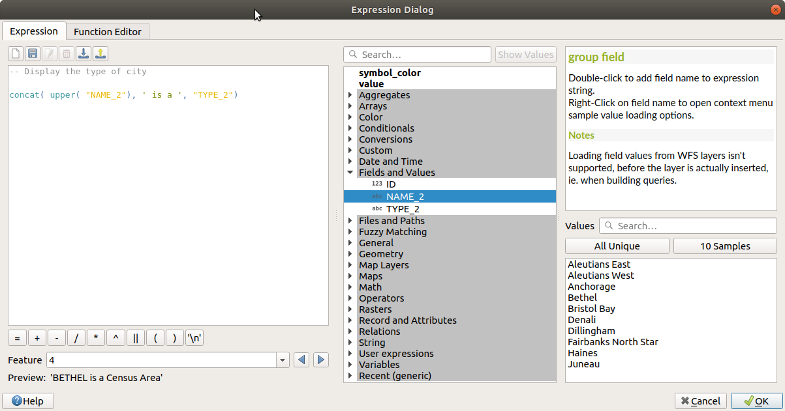

.. index:: Expressions

.. _vector_expressions:

************
Expressions
************

.. only:: html

   .. contents::
      :local:
      :depth: 2

Based on layer data and prebuilt or user defined functions, **Expressions**
offer a powerful way to manipulate attribute value, geometry and variables
in order to dynamically change the geometry style, the content or position
of the label, the value for diagram, the height of a layout item,
select some features, create virtual field ...

.. _expression_builder:

The Expression string builder
=============================

Main dialog to build expressions, the :guilabel:`Expression string builder`
is available from many parts in QGIS and, can particularly be accessed when:

* clicking the |expression| button;
* :ref:`selecting features <sec_selection>` with the |expressionSelect|
  :sup:`Select By Expression...` tool;
* :ref:`editing attributes <calculate_fields_values>` with e.g. the
  |calculateField| :sup:`Field calculator` tool;
* manipulating symbology, label or layout item parameters with the |dataDefined|
  :sup:`Data defined override` tool (see :ref:`data_defined`);
* building a :ref:`geometry generator <geometry_generator_symbol>` symbol layer;
* doing some :ref:`geoprocessing <label_processing>`.

The Expression builder dialog offers access to the:

* :ref:`Expression tab <functions_list>` which, thanks to a list of predefined
  functions, helps to write and check the expression to use;
* :ref:`Function Editor tab <function_editor>` which helps to extend the list of
  functions by creating custom ones.

**Some use cases of expressions:**

* From Field Calculator, calculate a "pop_density" field using existing "total_pop"
  and "area_km2" fields::

    "total_pop" / "area_km2"

* Update the field "density_level" with categories according to the "pop_density" values::

    CASE WHEN "pop_density" < 50 THEN 'Low population density'
         WHEN "pop_density" >= 50 and "pop_density" < 150 THEN 'Medium population density'
         WHEN "pop_density" >= 150 THEN 'High population density'
    END

* Apply a categorized style to all the features according to whether their average house
  price is smaller or higher than 10000€ per square metre::

    "price_m2" > 10000

* Using the "Select By Expression..." tool, select all the features representing
  areas of “High population density” and whose average house price is higher than
  10000€ per square metre::

    "density_level" = 'High population density' and "price_m2" > 10000

  Likewise, the previous expression could also be used to define which features
  should be labeled or shown in the map.

Using expressions offers you a lot of possibilities.

.. index:: Named parameters
   single: Expressions; Named parameters
   single: Functions; Named parameters

.. tip:: **Use named parameters to improve the expression reading**

  Some functions require many parameters to be set. The expression engine supports the
  use of named parameters. This means that instead of writing the cryptic expression
  ``clamp( 1, 2, 9)``, you can use ``clamp( min:=1, value:=2, max:=9)``. This also allows
  arguments to be switched, e.g. ``clamp( value:=2, max:=9, min:=1)``. Using named parameters
  helps clarify what the arguments for an expression function refer to, which is helpful
  when you are trying to interpret an expression at a later date!

.. index:: Functions
.. _functions_list:

List of functions
=================

The :guilabel:`Expression` tab provides the main interface to write expressions
using functions, layer's fields and values. It contains following widgets:

* An expression editor area to type or paste expressions. Autocompletion is
  available to speed expression writing:

  * Corresponding variables, function names and field names to the input text
    are shown below: use the :kbd:`Up` and :kbd:`Down` arrows to browse the
    items and press :kbd:`Tab` to insert in the expression or simply click
    on the wished item.
  * Function parameters are shown while filling them.

  QGIS also checks the expression rightness and highlights all the errors using:

  * *Underline*: for unknown functions, wrong or invalid arguments;
  * *Marker*: for every other error (eg, missing parenthesis, unexpected
    character) at a single location.

  .. tip:: **Document your expression with comments**

    When using complex expression, it is good practice to add
    text either as a multiline comment or inline comments to help you remember.

    ::

      /*
      Labels each region with its highest (in altitude) airport(s)
      and altitude, eg 'AMBLER : 264m' for the 'Northwest Artic' region
      */
      with_variable(
        'airport_alti', -- stores the highest altitude of the region
        aggregate(
          'airports',
          'max',
          "ELEV", -- the field containing the altitude
          -- and limit the airports to the region they are within
          filter := within( $geometry, geometry( @parent ) )
        ),
          aggregate( -- finds airports at the same altitude in the region
            'airports',
            'concatenate',
            "NAME",
            filter := within( $geometry, geometry( @parent ) )
              and "ELEV" = @airport_alti
          )
          || ' : ' || @airport_alti || 'm'
          -- using || allows regions without airports to be skipped
      )

* Above the expression editor, a set of tools helps you:

  * |fileNew|:sup:`Clear the expression editor`
  * create and manage :ref:`user expressions <user_expressions_functions>`

* Under the expression editor, you find:

  * a set of basic operators to help you build the expression
  * an indication of the expected format of output when you are data-defining
    feature properties
  * a live :guilabel:`Output preview` of the expression, evaluated
    on the first feature of the Layer by default.
    You can browse and evaluate other features of the layer using the
    :guilabel:`Feature` combobox (the values are taken from the
    :ref:`display name <maptips>` property of the layer).

    In case of error, it indicates it and you can access the details with the
    provided hyperlink.

* A function selector displays the list of functions, variables, fields...
  organized in groups. A search box is available to filter the list and quickly
  find a particular function or field.
  Double-clicking an item adds it to the expression editor.
* A help panel displays help for each selected item in the function selector.

  .. tip::

   Press :kbd:`Ctrl+Click` when hovering a function name in an expression to
   automatically display its help in the dialog.

  A field's values widget shown when a field is selected in the function selector
  helps to fetch features attributes:

  * Look for a particular field value
  * Display the list of :guilabel:`All Unique` or :guilabel:`10 Samples` values.
    Also available from right-click.

    When the field is mapped with another layer or a set of values, i.e. if the
    :ref:`field widget <edit_widgets>` is of *RelationReference*, *ValueRelation*
    or *ValueMap* type, it's possible to list all the values of the mapped field
    (from the referenced layer, table or list). Moreover, you can filter this
    list to |checkbox| :guilabel:`Only show values in use` in the current field.

  Double-clicking a field value in the widget adds it to the expression editor.

  .. tip::

   The right panel, showing functions help or field values, can be
   collapsed (invisible) in the dialog. Press the :guilabel:`Show Values`
   or :guilabel:`Show Help` button to get it back.

.. _figure_expression_tab:

   The Expression tab

.. index:: Aggregates
.. _aggregates_function:

Aggregates Functions
--------------------

This group contains functions which aggregate values over layers and fields.

.. contents::
   :local:
   :class: toc_columns

.. include:: expression_help/Aggregates.rst
   :start-after: :orphan:

**Examples:**

* Return the maximum of the "passengers" field from features in the layer
  grouped by "station_class" field::

   maximum("passengers", group_by:="station_class")

* Calculate the total number of passengers for the stations inside the current
  atlas feature::

   aggregate('rail_stations','sum',"passengers",
     intersects(@atlas_geometry, $geometry))

* Return the mean of the "field_from_related_table" field for all matching
  child features using the 'my_relation' relation from the layer::

   relation_aggregate('my_relation', 'mean', "field_from_related_table")

  or::

   relation_aggregate(relation:='my_relation', aggregate := 'mean',
     expression := "field_from_related_table")

.. index:: Array, List data structure
.. _array_functions:

Array Functions
---------------

This group contains functions to create and manipulate arrays (also known as
list data structures). The order of values within the array matters, unlike the
:ref:`'map' data structure <maps_functions>`, where the order of key-value pairs
is irrelevant and values are identified by their keys.

.. contents::
   :local:
   :class: toc_columns

.. include:: expression_help/Arrays.rst
   :start-after: :orphan:

Color Functions
----------------

This group contains functions for manipulating colors.

.. contents::
   :local:
   :class: toc_columns

.. include:: expression_help/Color.rst
   :start-after: :orphan:

Conditional Functions
---------------------

This group contains functions to handle conditional checks in expressions.

.. contents::
   :local:
   :class: toc_columns

.. include:: expression_help/Conditionals.rst
   :start-after: :orphan:

.. _conversion_functions:

Conversions Functions
---------------------

This group contains functions to convert one data type to another
(e.g., string to integer, integer to string).

.. contents::
   :local:
   :class: toc_columns

.. include:: expression_help/Conversions.rst
   :start-after: :orphan:

Custom Functions
-----------------

This group contains functions created by the user.
See :ref:`function_editor` for more details.

Date and Time Functions
------------------------

This group contains functions for handling date and time data.

.. contents::
   :local:
   :class: toc_columns

.. include:: expression_help/Date_and_Time.rst
   :start-after: :orphan:

This group shares several functions with the :ref:`conversion_functions` (
to_date, to_time, to_datetime, to_interval) and :ref:`string_functions`
(format_date) groups.

**Some examples:**

* Get today's month and year in the "month_number/year" format:

  .. code-block:: sql

     format_date(now(),'MM/yyyy')
     -- Returns '03/2017'

Besides these functions, subtracting dates, datetimes or times using the
``-`` (minus) operator will return an interval.

Adding or subtracting an interval to dates, datetimes or times, using the
``+`` (plus) and ``-`` (minus) operators, will return a datetime.

* Get the number of days until QGIS 3.0 release:

  .. code-block:: sql

     to_date('2017-09-29') - to_date(now())
     -- Returns <interval: 203 days>

* The same with time:

  .. code-block:: sql

     to_datetime('2017-09-29 12:00:00') - to_datetime(now())
     -- Returns <interval: 202.49 days>

* Get the datetime of 100 days from now:

  .. code-block:: sql

     now() + to_interval('100 days')
     -- Returns <datetime: 2017-06-18 01:00:00>

.. note:: **Storing date and datetime and intervals on fields**

   The ability to store *date*, *time* and *datetime* values directly on
   fields may depend on the data source's provider (e.g., Shapefile accepts
   *date* format, but not *datetime* or *time* format). The following are some
   suggestions to overcome this limitation:

   * *date*, *Datetime* and *time* can be stored in text type fields after
     using the ``to_format()`` function.

   * *Intervals* can be stored in integer or decimal type fields after using
     one of the date extraction functions (e.g., ``day()`` to get the interval
     expressed in days)

.. _fields_values:

Fields and Values
------------------

Contains a list of fields from the layer.

Double-click a field name to have it added to your expression. You can also
type the field name (preferably inside double quotes) or its :ref:`alias
<configure_field>`.

To retrieve fields values to use in an expression, select the appropriate field
and, in the shown widget, choose between :guilabel:`10 Samples` and :guilabel:`All
Unique`. Requested values are then displayed and you can use the :guilabel:`Search`
box at the top of the list to filter the result.
Sample values can also be accessed via right-clicking on a field.

To add a value to the expression you are writing, double-click on it in the list.
If the value is of a string type, it should be simple quoted, otherwise no quote
is needed.

Files and Paths Functions
------------------------------

This group contains functions which manipulate file and path names.

.. contents::
   :local:
   :class: toc_columns

.. include:: expression_help/Files_and_Paths.rst
   :start-after: :orphan:

Form Functions
--------------

This group contains functions that operate exclusively under the attribute form
context. For example, in field's widgets settings.

.. contents:: :local:

.. include:: expression_help/Form.rst
   :start-after: :orphan:

Fuzzy Matching Functions
-------------------------

This group contains functions for fuzzy comparisons between values.

.. contents::
   :local:
   :class: toc_columns

.. include:: expression_help/Fuzzy_Matching.rst
   :start-after: :orphan:

General Functions
------------------

This group contains general assorted functions.

.. contents::
   :local:
   :class: toc_columns

.. include:: expression_help/General.rst
   :start-after: :orphan:

.. _geometry_functions:

Geometry Functions
------------------

This group contains functions that operate on geometry objects
(e.g. buffer, transform, $area).

.. contents::
   :local:
   :class: toc_columns

.. include:: expression_help/GeometryGroup.rst
   :start-after: :orphan:

**Some examples:**

* Return the X coordinate of the current feature's centroid::

    x( $geometry )

* Send back a value according to feature's area::

    CASE WHEN $area > 10 000 THEN 'Larger' ELSE 'Smaller' END

* You can manipulate the current geometry using the variable ``$geometry`` to create
  a buffer or get a point on the geometry's surface::

    buffer( $geometry, 10 )
    point_on_surface( $geometry )

* Given a point feature, generate a closed line (using ``make_line``) around the
  point's geometry::

    make_line(
      -- using an array of points placed around the original
      array_foreach(
        -- list of angles for placing the projected points (every 90°)
        array:=generate_series( 0, 360, 90 ),
        -- translate the point 20 units in the given direction (angle)
        expression:=project( $geometry, distance:=20, azimuth:=radians( @element ) )
      )
    )

Layout Functions
----------------

This group contains functions to manipulate print layout items properties.

.. contents::
   :local:
   :class: toc_columns

.. include:: expression_help/Layout.rst
   :start-after: :orphan:

**An example:**

* Get the scale of the 'Map 0' in the current print layout::

    map_get( item_variables('Map 0'), 'map_scale')

Map Layers
----------

This group contains a list of the available layers in the current project.
This offers a convenient way to write expressions referring to multiple layers,
such as when performing :ref:`aggregates <aggregates_function>`, :ref:`attribute
<record_attributes>` or :ref:`spatial <geometry_functions>` queries.

It also provides some convenient functions to manipulate layers.

.. contents::
   :local:
   :class: toc_columns

.. include:: expression_help/Map_Layers.rst
   :start-after: :orphan:

.. index:: Map data structure, Dictionary, Key-value pairs, Associative arrays
.. _maps_functions:

Maps Functions
--------------

This group contains functions to create or manipulate keys and values of map
data structures (also known as dictionary objects, key-value pairs, or associative
arrays). Unlike the :ref:`list data structure <array_functions>` where values
order matters, the order of the key-value pairs in the map object is not relevant
and values are identified by their keys.

.. contents::
   :local:
   :class: toc_columns

.. include:: expression_help/Maps.rst
   :start-after: :orphan:

Mathematical Functions
-----------------------

This group contains math functions (e.g., square root, sin and cos).

.. contents::
   :local:
   :class: toc_columns

.. include:: expression_help/Math.rst
   :start-after: :orphan:

Operators
----------

This group contains operators (e.g., +, -, \*).
Note that for most of the mathematical functions below,
if one of the inputs is NULL then the result is NULL.

.. csv-table::
   :header: "Function", "Description"
   :widths: 27,68
   :class: longtable

   "a + b", "Addition of two values (a plus b)"
   "a - b", "Subtraction of two values (a minus b)."
   "a * b", "Multiplication of two values (a multiplied by b)"
   "a / b", "Division of two values (a divided by b)"
   "a % b", "Remainder of division of a by b (eg, 7 % 2 = 1, or 2 fits into 7 three times with remainder 1)"
   "a ^ b", "Power of two values (for example, 2^2=4 or 2^3=8)"
   "a < b", "Compares two values and evaluates to 1 if the left value is less than the right value (a is smaller than b)"
   "a <= b", "Compares two values and evaluates to 1 if the left value is less than or equal to the right value"
   "a <> b", "Compares two values and evaluates to 1 if they are not equal"
   "a = b", "Compares two values and evaluates to 1 if they are equal"
   "a != b", "a and b are not equal"
   "a > b", "Compares two values and evaluates to 1 if the left value is greater than the right value (a is larger than b)"
   "a >= b", "Compares two values and evaluates to 1 if the left value is greater than or equal to the right value"
   "a ~ b", "a matches the regular expression b"
   "||", "Joins two values together into a string. If one of the values is NULL the result will be NULL"
   "'\\n'", "Inserts a new line in a string"
   "LIKE", "Returns 1 if the first parameter matches the supplied pattern"
   "ILIKE", "Returns 1 if the first parameter matches case-insensitive the supplied
   pattern (ILIKE can be used instead of LIKE to make the match case-insensitive)"
   "a IS b", "Tests whether two values are identical. Returns 1 if a is the same as b"
   "a OR b", "Returns 1 when condition a or condition b is true"
   "a AND b", "Returns 1 when conditions a and b are true"
   "NOT", "Negates a condition"
   """Column_name""", "Value of the field *Column_name*, take care to not be confused with simple quote, see below"
   "'string'", "a string value, take care to not be confused with double quote, see above"
   "NULL", "null value"
   "a IS NULL", "a has no value"
   "a IS NOT NULL", "a has a value"
   "a IN (value[,value])", "a is below the values listed"
   "a NOT IN (value[,value])", "a is not below the values listed"

**Some examples:**

* Joins a string and a value from a column name::

    'My feature''s id is: ' || "gid"

* Test if the "description" attribute field starts with the 'Hello' string
  in the value (note the position of the ``%`` character)::

    "description" LIKE 'Hello%'

.. _processing_functions:

Processing Functions
-------------------------

This group contains functions that operate on processing algorithms.

.. contents:: :local:

.. include:: expression_help/Processing.rst
   :start-after: :orphan:

.. _raster_functions:

Rasters Functions
-----------------

This group contains functions to operate on raster layer.

.. contents:: :local:

.. include:: expression_help/Rasters.rst
   :start-after: :orphan:

.. _record_attributes:

Record and Attributes Functions
-------------------------------

This group contains functions that operate on record identifiers.

.. contents::
   :local:
   :class: toc_columns

.. include:: expression_help/Record_and_Attributes.rst
   :start-after: :orphan:

**Some examples:**

* Return the first feature in layer "LayerA" whose field "id" has the same value
  as the field "name" of the current feature (a kind of jointure)::

    get_feature( 'layerA', 'id', attribute( $currentfeature, 'name') )

* Calculate the area of the joined feature from the previous example::

    area( geometry( get_feature( 'layerA', 'id', attribute( $currentfeature, 'name') ) ) )

.. _string_functions:

String Functions
-----------------

This group contains functions that operate on strings
(e.g., that replace, convert to upper case).

.. contents::
   :local:
   :class: toc_columns

.. include:: expression_help/String.rst
   :start-after: :orphan:

**About fields concatenation**

You can concatenate strings or field values using either ``||`` or ``+``
operators or the ``concat`` function, with some special characteristics:

* The ``+`` operator also means sum up expression, so if you have an integer
  (field or numeric value) operand, this can be error prone and you better use
  the others::

   'My feature''s id is: ' + "gid" => triggers an error as gid is an integer

* When any of the arguments is a NULL value, either ``||`` or ``+`` will
  return a NULL value. To return the other arguments regardless the NULL value,
  you may want to use the ``concat`` function::

   "country_name" || NULL => NULL
   concat('My feature''s id is: ', NULL) => My feature's id is
   concat("firstname", "nickname", "lastname") => Chuck Norris (if empty nickname)
   "firstname" + "nickname" + "lastname" => NULL (if one field is empty)

* For other cases, do at your convenience::

   'My country is ' + "country_name" + ' (' + "country_code" + ')'
   'My country is ' || "country_name" || ' (' || "country_code" || ')'
   concat('My country is ', "country_name", ' (', "country_code", ')')
   # All the above return: My country is France (FR)

.. _user_expressions_functions:

User Expressions |312|
----------------------

This group contains the expressions saved as **user expressions** using
the |fileSave| :sup:`Add current expression to user expressions` button
above the expression editor frame.
It is meant for important expressions you want to have quick access to.
They are saved under the user profile (:file:`<userprofile>/QGIS/QGIS3.ini`
file) and available in all expression dialogs inside all projects of the
current user profile.

A set of tools available above the expression editor frame helps you manage
the user expressions:

* |fileSave|:sup:`Add the current expression to user expressions`: store the
  expression in the user profile. A label and a help text can be added for
  easy identification.
* |symbologyEdit| :sup:`Edit selected expression from user expressions`,
  as well as their help and label
* |deleteSelected| :sup:`Remove selected expression from user expressions`
* |sharingImport| :sup:`Import user expressions` from a ``.json`` file
  into the active user profile folder
* |sharingExport| :sup:`Export user expressions` as a ``.json`` file;
  all the user expressions in the user profile :file:`QGIS3.ini` file are
  shared

.. _expression_variables:

Variables
---------

This group contains dynamic variables related to the application, the project
file and other settings.
The availability of variables depends on the context:

- from the |expressionSelect| :sup:`Select by expression` dialog
- from the |calculateField| :sup:`Field calculator` dialog
- from the layer properties dialog
- from the print layout

To use these variables in an expression, they should be preceded by the
``@`` character (e.g, ``@row_number``).

.. csv-table::
   :header: "Function", "Description"
   :widths: 25, 70

   "algorithm_id", "The unique ID of an algorithm"
   "atlas_feature", "The current atlas feature (as feature object)"
   "atlas_featureid", "The current atlas feature ID"
   "atlas_featurenumber", "The current atlas feature number in the layout"
   "atlas_filename", "The current atlas file name"
   "atlas_geometry", "The current atlas feature geometry"
   "atlas_layerid", "The current atlas coverage layer ID"
   "atlas_layername", "The current atlas coverage layer name"
   "atlas_pagename", "The current atlas page name"
   "atlas_totalfeatures", "The total number of features in atlas"
   "canvas_cursor_point", "The last cursor position on the canvas in the
   project's geographical coordinates"
   "cluster_color", "The color of symbols within a cluster, or NULL if
   symbols have mixed colors"
   "cluster_size", "The number of symbols contained within a cluster"
   "current_feature", "The feature currently being edited in the attribute
   form or table row"
   "current_geometry", "The geometry of the feature currently being edited
   in the form or the table row"
   "fullextent_maxx", "Maximum x value from full canvas extent (including all layers)"
   "fullextent_maxy", "Maximum y value from full canvas extent (including all layers)"
   "fullextent_minx", "Minimum x value from full canvas extent (including all layers)"
   "fullextent_miny", "Minimum y value from full canvas extent (including all layers)"
   "geometry_part_count", "The number of parts in rendered feature's geometry"
   "geometry_part_num", "The current geometry part number for feature being rendered"
   "geometry_point_count", "The number of points in the rendered geometry's part"
   "geometry_point_num", "The current point number in the rendered geometry's part"
   "grid_axis", "The current grid annotation axis (eg, 'x' for longitude, 'y' for latitude)"
   "grid_number", "The current grid annotation value"
   "item_id", "The layout item user ID (not necessarily unique)"
   "item_uuid", "The layout item unique ID"
   "layer", "The current layer"
   "layer_id", "The ID of current layer"
   "layer_ids |314|", "The IDs of all the map layers in the current project as a list"
   "layer_name", "The name of current layer"
   "layers |314|", "All the map layers in the current project as a list"
   "layout_dpi", "The composition resolution (DPI)"
   "layout_name", "The layout name"
   "layout_numpages", "The number of pages in the layout"
   "layout_page", "The page number of the current item in the layout"
   "layout_pageheight", "The active page height in the layout (in mm)"
   "layout_pagewidth", "The active page width in the layout (in mm)"
   "legend_column_count", "The number of columns in the legend"
   "legend_filter_by_map", "Indicates if the content of the legend is
   filtered by the map"
   "legend_filter_out_atlas", "Indicates if the atlas is filtered out of the legend"
   "legend_split_layers", "Indicates if layers can be split in the legend"
   "legend_title", "The title of the legend"
   "legend_wrap_string", "The character(s) used to wrap the legend text"
   "map_crs", "The Coordinate reference system of the current map"
   "map_crs_acronym", "The acronym of the Coordinate reference
   system of the current map"
   "map_crs_definition", "The full definition of the Coordinate
   reference system of the current map"
   "map_crs_description", "The name of the Coordinate reference
   system of the current map"
   "map_crs_ellipsoid", "The acronym of the ellipsoid of the
   Coordinate reference system of the current map"
   "map_crs_proj4", "The Proj4 definition of the Coordinate
   reference system of the current map"
   "map_crs_wkt", "The WKT definition of the Coordinate reference
   system of the current map"
   "map_end_time |314|", "The end of the map's temporal time range
   (as a datetime value)"
   "map_extent", "The geometry representing the current extent of the map"
   "map_extent_center", "The point feature at the center of the map"
   "map_extent_height", "The current height of the map"
   "map_extent_width", "The current width of the map"
   "map_id", "The ID of current map destination. This will be 'canvas'
   for canvas renders, and the item ID for layout map renders"
   "map_interval |314|", "The duration of the map's temporal time range
   (as an interval value)"
   "map_layer_ids", "The list of map layer IDs visible in the map"
   "map_layers", "The list of map layers visible in the map"
   "map_rotation", "The current rotation of the map"
   "map_scale", "The current scale of the map"
   "map_start_time |314|", "The start of the map's temporal time range
   (as a datetime value)"
   "map_units", "The units of map measurements"
   "notification_message", "Content of the notification message sent by the provider
   (available only for actions triggered by provider notifications)."
   "parent", "Refers to the current feature in the parent layer, providing access to
   its attributes and geometry when filtering an :ref:`aggregate <aggregates_function>`
   function"
   "project_abstract", "The project abstract, taken from project metadata"
   "project_area_units", "The area unit for the current project, used when
   calculating areas of geometries"
   "project_author", "The project author, taken from project metadata"
   "project_basename", "The basename of current project's filename
   (without path and extension)"
   "project_creation_date", "The project creation date, taken from project metadata"
   "project_crs", "The Coordinate reference system of the project"
   "project_crs_arconym", "The acronym of the Coordinate reference system of the project"
   "project_crs_definition", "The full definition of the Coordinate reference
   system of the project"
   "project_crs_description", "The description of the Coordinate reference system of the project"
   "project_crs_ellipsoid", "The ellipsoid of the Coordinate reference system of the project"
   "project_crs_proj4", "The Proj4 representation of the Coordinate reference system of the project"
   "project_crs_wkt", "The WKT (well known text) representation of the coordinate reference system of the project"
   "project_distance_units", "The distance unit for the current project,
   used when calculating lengths of geometries and distances"
   "project_ellipsoid", "The name of the ellipsoid of the current project,
   used when calculating geodetic areas or lengths of geometries"
   "project_filename", "The filename of the current project"
   "project_folder", "The folder of the current project"
   "project_home", "The home path of the current project"
   "project_identifier", "The project identifier, taken from the project's metadata"
   "project_keywords", "The project keywords, taken from the project's metadata"
   "project_last_saved", "Date/time when project was last saved."
   "project_path", "The full path (including file name) of the current project"
   "project_title", "The title of current project"
   "project_units", "The units of the project's CRS"
   "qgis_locale", "The current language of QGIS"
   "qgis_os_name", "The current Operating system name, eg 'windows', 'linux' or 'osx'"
   "qgis_platform", "The QGIS platform, eg 'desktop' or 'server'"
   "qgis_release_name", "The current QGIS release name"
   "qgis_short_version", "The current QGIS version short string"
   "qgis_version", "The current QGIS version string"
   "qgis_version_no", "The current QGIS version number"
   "row_number", "Stores the number of the current row"
   "snapping_results", "Gives access to snapping results while digitizing a
   feature (only available in add feature)"
   "scale_value", "The current scale bar distance value"
   "symbol_angle", "The angle of the symbol used to render the feature
   (valid for marker symbols only)"
   "symbol_color", "The color of the symbol used to render the feature"
   "symbol_count", "The number of features represented by the symbol (in the layout legend)"
   "symbol_id", "The Internal ID of the symbol (in the layout legend)"
   "symbol_label", "The label for the symbol (either a user defined
   label or the default autogenerated label - in the layout legend)"
   "user_account_name", "The current user's operating system account name"
   "user_full_name", "The current user's operating system user name"
   "value", "The current value"
   "with_variable", "Allows setting a variable for usage within an expression
   and avoid recalculating the same value repeatedly"

**Some examples:**

* Return the X coordinate of a map item center in layout::

   x( map_get( item_variables( 'map1'), 'map_extent_center' ) )

* Return, for each feature in the current layer, the number of overlapping airport
  features::

   aggregate( layer:='airport', aggregate:='count', expression:="code",
                  filter:=intersects( $geometry, geometry( @parent ) ) )

* Get the object_id of the first snapped point of a line::

   with_variable(
     'first_snapped_point',
     array_first( @snapping_results ),
     attribute(
       get_feature_by_id(
         map_get( @first_snapped_point, 'layer' ),
         map_get( @first_snapped_point, 'feature_id' )
       ),
       'object_id'
     )
   )

Recent Functions
-----------------

This group contains recently used functions. Depending on the context of its
usage (feature selection, field calculator, generic), recently applied expressions
are added to the corresponding list (up to ten expressions), sorted from
more to less recent.
This makes it easy to quickly retrieve and reapply previously used expressions.

.. index:: Custom functions
.. _function_editor:

Function Editor
===============

With the :guilabel:`Function Editor` tab, you are able to write your own functions
in Python language. This provides a handy and comfortable way to address
particular needs that would not be covered by the predefined functions.

.. _figure_expression_function:

   The Function Editor tab

To create a new function:

#. Press the |signPlus| :sup:`New File` button.
#. Enter a name to use in the form that pops up and press :guilabel:`OK`.

   A new item of the name you provide is added in the left panel of the
   :guilabel:`Function Editor` tab; this is a Python :file:`.py` file based on
   QGIS template file and stored in the :file:`/python/expressions` folder
   under the active :ref:`user profile <user_profiles>` directory.
#. The right panel displays the content of the file: a python script template.
   Update the code and its help according to your needs.
#. Press the |start| :guilabel:`Save and Load Functions` button.
   The function you wrote is added to the functions tree in the :guilabel:`Expression`
   tab, by default under the ``Custom`` group.
#. Enjoy your new function.
#. If the function requires improvements, enable the :guilabel:`Function Editor`
   tab, do the changes and press again the |start| :guilabel:`Save and Load
   Functions` button to make them available in the file, hence in any expression
   tab.

Custom Python functions are stored under the user profile directory, meaning that at
each QGIS startup, it will auto load all the functions defined with the current user
profile. Be aware that new functions are only saved in the :file:`/python/expressions`
folder and not in the project file.
If you share a project that uses one of your custom functions you will need to also
share the :file:`.py` file in the :file:`/python/expressions` folder.

To delete a custom function:

#. Enable the :guilabel:`Function Editor` tab
#. Select the function in the list
#. Press the |signMinus| :sup:`Remove selected function`. The function is
   removed from the list and the corresponding ``.py`` file deleted from
   the user profile folder.

**Example**

Here's a short example on how to create your own functions:

.. code-block:: python

   from qgis.core import *
   from qgis.gui import *

   @qgsfunction(args='auto', group='Custom')
   def my_sum(value1, value2, feature, parent):
       """
       Calculates the sum of the two parameters value1 and value2.
       <h2>Example usage:</h2>
       <ul>
         <li>my_sum(5, 8) -> 13</li>
         <li>my_sum("field1", "field2") -> 42</li>
       </ul>
       """
       return value1 + value2

The short example creates a function ``my_sum`` that will give you a function
with two values.
When using the ``args='auto'`` function argument the number of function
arguments required will be calculated by the number of arguments the function
has been defined with in Python (minus 2 - ``feature``, and ``parent``).

This function can then be used in expressions:

.. _figure_expression_custom_function:

   Custom Function added to the Expression tab

Further information about creating Python code can be found in the
:ref:`PyQGIS-Developer-Cookbook`.

.. Substitutions definitions - AVOID EDITING PAST THIS LINE
   This will be automatically updated by the find_set_subst.py script.
   If you need to create a new substitution manually,
   please add it also to the substitutions.txt file in the
   source folder.

.. |312| replace:: ``NEW in 3.12``
.. |314| replace:: ``NEW in 3.14``
.. |calculateField| image:: /static/common/mActionCalculateField.png
   :width: 1.5em
.. |checkbox| image:: /static/common/checkbox.png
   :width: 1.3em
.. |dataDefined| image:: /static/common/mIconDataDefine.png
   :width: 1.5em
.. |deleteSelected| image:: /static/common/mActionDeleteSelected.png
   :width: 1.5em
.. |expression| image:: /static/common/mIconExpression.png
   :width: 1.5em
.. |expressionSelect| image:: /static/common/mIconExpressionSelect.png
   :width: 1.5em
.. |fileNew| image:: /static/common/mActionFileNew.png
   :width: 1.5em
.. |fileSave| image:: /static/common/mActionFileSave.png
   :width: 1.5em
.. |sharingExport| image:: /static/common/mActionSharingExport.png
   :width: 1.5em
.. |sharingImport| image:: /static/common/mActionSharingImport.png
   :width: 1.5em
.. |signMinus| image:: /static/common/symbologyRemove.png
   :width: 1.5em
.. |signPlus| image:: /static/common/symbologyAdd.png
   :width: 1.5em
.. |start| image:: /static/common/mActionStart.png
   :width: 1.5em
.. |symbologyEdit| image:: /static/common/symbologyEdit.png
   :width: 1.5em
