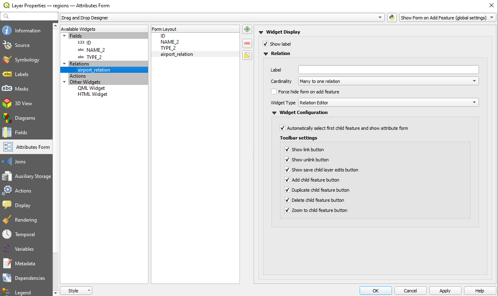
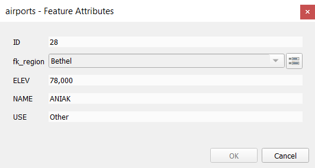
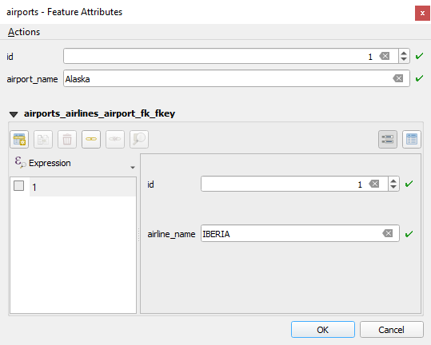

.. index:: Joins, Relations
.. _sec_joins_relations:

*******************************************
 Connecting and Editing Data Across Layers
*******************************************

.. only:: html

   .. contents::
      :local:

Ability to connect data from different layers is one of the duties of a GIS software.
Such a connection can be based on the spatial relationship between the features,
or on their shared attributes.
QGIS provides tools to handle any of these associations, such as:

* Processing algorithms that can create a new layer as a result of the connection,
  namely :ref:`qgisjoinattributesbylocation`, :ref:`qgisjoinbynearest`,
  :ref:`qgisjoinattributestable`, ...
* SQL queries to create a new layer from the :ref:`DB Manager <dbmanager>`
  or as a :ref:`virtual layer <vector_virtual_layers>`
* :ref:`Joins properties <sec_joins>` or :ref:`relations settings <vector_relations>`
  that temporarily extend attributes of features in a given layer,
  with those of features in another layer based on some matching attribute(s).

  Joins and relations are technical concepts borrowed from databases
  to get the most out of data stored in tables by combining their contents.
  The idea is that features (rows) of different layers (tables) can be associated to each other.
  The number of rows which are matching each other can be of any value (zero, one, many).

.. index:: Joins, Foreign key
.. _`sec_joins`:

Joining features between two layers
====================================

**Joins** in QGIS allow you to associate features of the current layer
to features from another loaded vector layer.
Whether they are spatially enabled and the type of geometry do not matter.
The join is based on an attribute that is shared by the layers, in a one-to-one relationship.

To create a join on a layer (identified below as ``target layer``):

#. Go to the layer :menuselection:`Properties -->` |join| :guilabel:`Joins` tab
#. Click the |symbologyAdd| :sup:`Add new join` button.
   The :guilabel:`Add vector join` dialog appears.
#. Select the :guilabel:`Join layer` you want to connect with the target vector layer
#. Specify the :guilabel:`Join field` (from the ``join layer``)
   and the :guilabel:`Target field` (from the ``target layer``).
   These are the fields that are used to find matching feature in both layers
   hence they should have values in common.
#. Press :guilabel:`OK` and a summary of selected parameters is added to the :guilabel:`Join` panel.

.. _figure_joins:

.. figure:: img/join_attributes.png
   :align: center

   Join an attribute table to an existing vector layer

The steps above will create a join,
where **ALL** the attributes of the **first matching feature** in the join layer
is added to the target layer's feature.
The following logic is used to pair features during a join process:

* All the features in the target layer are returned, regardless they have a match
* If the target field contains duplicate values, these features are assigned the same feature
  from the join layer.
* If the join field contains duplicate matching values, only the first fetched feature is picked.

.. note:: Joins in QGIS are based on a single field matching so most of the times,
  you would want to make sure that values in the matchable fields are unique.

QGIS provides some more options to tweak the join:

* |checkbox| :guilabel:`Cache join layer in virtual memory`: allows you to cache values
  in memory (without geometries) from the joined layer in order to speed up lookups.
* |unchecked| :guilabel:`Create attribute index on the join field` to speed up lookups
* |unchecked| :guilabel:`Dynamic form`: helps to synchronize join fields on the fly,
  according to the :guilabel:`Target field`.
  This way, constraints for join fields are also correctly updated.
  Note that it's deactivated by default because it may be very time consuming
  if you have a lot of features or a myriad of joins.
* If the target layer is editable, then some icons will be displayed
  in the attribute table next to fields, in order to inform about their status:

  * |joinNotEditable|: the join layer is not configured to be editable.
    If you want to be able to edit join features from the target attribute table,
    then you have to check the option |checkbox| :guilabel:`Editable join layer`.
  * |joinedLayerNotEditable|: the join layer is well configured to be editable,
    but its current status is read only.
  * |joinHasNotUpsertOnEdit|: the join layer is editable,
    but synchronization mechanisms are not activated.
    If you want to automatically add a feature in the join layer
    when a feature is created in the target layer,
    then you have to check the option |checkbox| :guilabel:`Upsert on edit`.
    Symmetrically, the option |checkbox| :guilabel:`Delete cascade` may be activated
    if you  want to automatically delete join features.
* |unchecked| :guilabel:`Joined fields`: instead of adding all the fields from the joined layer,
  you can specify a subset.
* |unchecked| :guilabel:`Custom field name prefix` for joined fields,
  in order to avoid name collision

.. index:: Relations, Foreign key
.. _vector_relations:

Setting relations between multiple layers
=========================================

Unlike joins that define a one-to-one link between features across two layers,
relations help you build interconnections between multiple features across two or more layers.
As such, relations are project level settings
and are set in :menuselection:`Project --> Properties -->` |relations| :guilabel:`Relations` tab.
From there, you can:

* |symbologyAdd| :guilabel:`Add relation` whose type can be:

  * :ref:`one to many relation <one_to_many_relation>`
  * :ref:`many to many relation <many_to_many_relation>`
  * :ref:`polymorphic relation <polymorphic_relation>` that you can add or edit
    with the dedicated tools in the action drop-down menu.

  .. note:: There is no simple way yet to edit a non-polymorphic relation once it has been created.
   Only the name can be edited with a double-click.
   For any other parameters of such a relation you will have to remove and recreate it.

* |symbologyAdd| :guilabel:`Discover relations`: QGIS is able to discover existing relations
  from supported database formats (PostgreSQL, GeoPackage, ESRI File Geodatabase, ...).
  This can be a good way to ease the relations definition.
* |symbologyRemove| :guilabel:`Remove relation`

.. _figure_relations:

.. figure:: ../introduction/img/project_relations.png
   :align: center

   Relations tab

.. TODO: Update and fill the dialog with examples of the different types of relations

.. _one_to_many_relation:

One to many (1-N) relations
---------------------------

As an example you have a layer with all regions of Alaska (polygon)
which provides some attributes about its name and region type
and a unique id (which acts as primary key).

Then you get another point layer or table with information about airports
that are located in the regions and you also want to keep track of these.
If you want to add them to the regions layer,
you need to create a one to many relation using foreign keys,
because there are several airports in most regions.

.. _figure_relations_map:

.. figure:: img/regions_with_airports.png
   :align: center

   Alaska region with airports

Layers and keys
.......................

QGIS makes no difference between a table and a vector layer.
Basically, a vector layer is a table with a geometry.
So you can add your table as a vector layer.
To demonstrate the 1-n relation, you can load the :file:`regions`
and :file:`airports` layers in the sample dataset.
In practice, each airport belongs to exactly one region
while each region can have any number of airports (a typical one to many relation).

which has a foreign key field (``fk_region``) to the layer regions.

In addition to the attributes describing the airports,
the aiports layer has another field ``fk_region`` which acts as a foreign key
(if you have a database, you will probably want to define a constraint on it).
This ``fk_region`` field will always contain an id of a region.
It can be seen like a pointer to the region it belongs to.

All you have to do is to tell QGIS the relation between the layers
so that you can design a custom edit form for editing and QGIS takes care of the setup.
It works with different providers (so you can also use it with shape and csv files).

Defining 1-N relations
......................

The first thing we are going to do is to let QGIS know about the relations between the layers.
This is done in :menuselection:`Project --> Properties...`.
Open the :guilabel:`Relations` tab and click on |symbologyAdd| :guilabel:`Add Relation`.

* **Name** is going to be used as a title. It should be a human readable string
  describing what the relation is used for.
  We will just call say **airport_relation** in this case.
* **Referenced Layer (Parent)** also considered as parent layer, is the one with the primary key,
  pointed to, so here it is the ``regions`` layer.
  You need to define the primary key of the referenced layer, so it is ``ID``.
* **Referencing Layer (Child)** also considered as child layer,
  is the one with the foreign key field on it.
  In our case, this is the ``airports`` layer.
  For this layer you need to add a referencing field which points to the other layer,
  so this is ``fk_region``.

  .. note:: Sometimes, you need more than a single field to uniquely identify features in a layer.
   Creating a relation with such a layer requires a **composite key**,
   i.e. more than a single pair of matching fields.
   Use the |symbologyAdd| :sup:`Add new field pair as part of a composite foreign key` button
   to add as many pairs as necessary.

* **Id** will be used for internal purposes and has to be unique.
  You may need it to build :ref:`custom forms <customize_form>`.
  If you leave it empty, one will be generated for you but you can assign one yourself
  to get one that is easier to handle
* **Relationship strength** sets the strength of the relation between the parent and the child layer.
  The default :guilabel:`Association` type means that the parent layer is *simply* linked to the child one
  while the :guilabel:`Composition` type allows you to duplicate also the child features
  when duplicating the parent ones and on deleting a feature the children are deleted as well,
  resulting in cascade over all levels (means children of children of... are deleted as well).

.. _figure_relations_manager:

.. figure:: img/regions_airports_mapping.png
   :align: center

   Adding a relation between regions and airports layers

From the :guilabel:`Relations` tab, you can also press the |symbologyAdd|
:guilabel:`Discover Relation` button to fetch the relations available from
the providers of the loaded layers.
This is possible for layers stored in data providers like PostgreSQL or SpatiaLite.

.. index:: Feature form, Linked forms, Embedded form

Forms for 1-N relations
.......................

Now that QGIS knows about the relation, it will be used to improve the forms it generates.
As we did not change the default form method (autogenerated), it will just add a new widget in our form.
So let's select the layer region in the legend and use the identify tool.
Depending on your settings, the form might open directly
or you will have to choose to open it in the identification dialog under actions.

.. _figure_embedded_form:

.. figure:: img/airport_relation_dataview.png
   :align: center

   Identification dialog regions with relation to airports

As you can see, the airports assigned to this particular region are all shown in a table.
And there are also some buttons available. Let's review them shortly:

* The |toggleEditing| button is for toggling the edit mode.
  Be aware that it toggles the edit mode of the airport layer,
  although we are in the feature form of a feature from the region layer.
  But the table is representing features of the airport layer.
* The |saveEdits| button is for saving all the edits in the child layer (airport).
* The |capturePoint| button lets you digitize the airport geometry in the map canvas
  and assigns the new feature to the current region by default.
  Note that the icon will change according to the geometry type.
* The |newTableRow| button adds a new record to the airport layer attribute table
  and assigns the new feature to the current region by default.
  The geometry can be drawn later with the :guilabel:`Add part` digitizing tool.
* The |duplicateFeature| button allows you to copy and paste one or more child features
  within the child layer.
  They can later be assigned to a different parent feature or have their attributes modified.
* The |deleteSelectedFeatures| button deletes the selected airport(s) permanently.
* The |link| symbol opens a new dialog where you can select any existing airport
  which will then be assigned to the current region.
  This may be handy if you created the airport on the wrong region by accident.
* The |unlink| symbol unlinks the selected airport(s) from the current region,
  leaving them unassigned (the foreign key is set to NULL) effectively.
* With the |zoomToSelected| button you can zoom the map to the selected child features.
* The two buttons |formView| and |openTable| to the right switch between the :ref:`table
  view and form view <attribute_table_view>` of the related child features.

If you use the :ref:`Drag and Drop Designer <customize_form>` for the regions feature,
you can select which tools are available.
You can even decide whether to open a new form when a new feature is added
using :guilabel:`Force hide form on add feature` option.
Be aware that this option implies that not null attributes must take a valid default value
to work correctly.

.. _figure_select_relation_tools:

   Drag and Drop Designer for configure regions-airports relation tools

In the above example the referencing layer has geometries (so it isn't just an alphanumeric table)
so the above steps will create an entry in the layer attribute table
that has no corresponding geometric feature.
To add the geometry:

#. Choose |openTable| :menuselection:`Open Attribute Table` for the referencing layer.
#. Select the record that has been added previously within the feature form of the referenced layer.
#. Use the |addPart| :sup:`Add Part` digitizing tool to attach a geometry
   to the selected attributes table record.

If you work on the airport table, the widget Relation Reference is automatically set up
for the ``fk_region`` field (the one used to create the relation),
see :ref:`Relation Reference widget <configure_field>`.

.. Todo: It could be nice that those advanced widgets get a description one day

In the airport form you will see the |formView| button at the right side of the ``fk_region`` field:
if you click on the button the form of the region layer will be opened.
This widget allows you to easily and quickly open the forms of the linked parent features.

.. _figure_linked_forms:

   Identification dialog airport with relation to regions

The Relation Reference widget has also an option to embed the form of the parent layer within the child one.
It is available in  the :menuselection:`Properties --> Attributes Form` menu of the airport layer:
select the ``fk_region`` field and check the ``Show embedded form`` option.

If you look at the feature dialog now,
you will see that the form of the region is embedded inside the airports form
and will even have a combobox, which allows you to assign the current airport to another region.

.. _figure_linked_forms_embedded:

.. figure:: img/airport_attributes_expanded.png
   :align: center

Moreover if you toggle the editing mode of the airport layer,
the ``fk_region`` field has also an autocompleter function:
while typing you will see all the values of the ``id`` field of the region layer.
Here it is possible to digitize a polygon for the region layer using the |symbologyAdd| button
if you chose the option ``Allow adding new features``
in the :menuselection:`Properties --> Attributes Form` menu of the airport layer.

The child layer can also be used in the :ref:`select_by_value` tool
in order to select features of the parent layer based on attributes of their children.

In :numref:`figure_select_by_value`, all the regions where the mean altitude
of the airports is greater than 500 meters above sea level are selected.

You will find that many different aggregation functions are available in the form.

.. _figure_select_by_value:

.. figure:: img/relation_select_by_value.png
   :align: center

   Select parent features with child values

.. index:: Many-to-many relation; Relation
.. _many_to_many_relation:

Many-to-many (N-M) relations
----------------------------

N-M relations are many-to-many relations between two tables.
For instance, the ``airports`` and ``airlines`` layers:
an airport receives several airline companies
and an airline company flies to several airports.

This SQL code creates the three tables we need for an N-M relationship
in a PostgreSQL/PostGIS schema named *locations*.
You can run the code using the :menuselection:`Database --> DB Manager…` for PostGIS
or external tools such as `pgAdmin <https://www.pgadmin.org>`_.
The airports table stores the ``airports`` layer and the airline table stores the ``airlines`` layer.
In both tables few fields are used for clarity.
The *tricky* part is the ``airports_airlines`` table.
We need it to list all airlines for all airports (or vice versa).
This kind of table is known as a *pivot table*.
The *constraints* in this table force that an airport can be associated with an airline
only if both already exist in their layers.

.. code-block:: sql

   CREATE SCHEMA locations;

   CREATE TABLE locations.airports
   (
      id serial NOT NULL,
      geom geometry(Point, 4326) NOT NULL,
      airport_name text NOT NULL,
      CONSTRAINT airports_pkey PRIMARY KEY (id)
   );

   CREATE INDEX airports_geom_idx ON locations.airports USING gist (geom);

   CREATE TABLE locations.airlines
   (
      id serial NOT NULL,
      geom geometry(Point, 4326) NOT NULL,
      airline_name text NOT NULL,
      CONSTRAINT airlines_pkey PRIMARY KEY (id)
   );

   CREATE INDEX airlines_geom_idx ON locations.airlines USING gist (geom);

   CREATE TABLE locations.airports_airlines
   (
      id serial NOT NULL,
      airport_fk integer NOT NULL,
      airline_fk integer NOT NULL,
      CONSTRAINT airports_airlines_pkey PRIMARY KEY (id),
      CONSTRAINT airports_airlines_airport_fk_fkey FOREIGN KEY (airport_fk)
         REFERENCES locations.airports (id)
         ON DELETE CASCADE
         ON UPDATE CASCADE
         DEFERRABLE INITIALLY DEFERRED,
      CONSTRAINT airports_airlines_airline_fk_fkey FOREIGN KEY (airline_fk)
         REFERENCES locations.airlines (id)
         ON DELETE CASCADE
         ON UPDATE CASCADE
         DEFERRABLE INITIALLY DEFERRED
    );

Instead of PostgreSQL you can also use GeoPackage.
In this case, the three tables can be created manually
using the :menuselection:`Database --> DB Manager…`.
In GeoPackage there are no schemas so the *locations* prefix is not needed.

Foreign key constraints in ``airports_airlines`` table can´t be created
using :menuselection:`Table --> Create Table…` or :menuselection:`Table --> Edit Table…`
so they should be created using :menuselection:`Database --> SQL Window…`.
GeoPackage doesn't support *ADD CONSTRAINT* statements so the ``airports_airlines``
table should be created in two steps:

#. Set up the table only with the ``id`` field using :menuselection:`Table --> Create Table…`
#. Using :menuselection:`Database --> SQL Window…`, type and execute this SQL code:

   .. code-block:: sql

      ALTER TABLE airports_airlines
         ADD COLUMN airport_fk INTEGER
         REFERENCES airports (id)
         ON DELETE CASCADE
         ON UPDATE CASCADE
         DEFERRABLE INITIALLY DEFERRED;

      ALTER TABLE airports_airlines
         ADD COLUMN airline_fk INTEGER
         REFERENCES airlines (id)
         ON DELETE CASCADE
         ON UPDATE CASCADE
         DEFERRABLE INITIALLY DEFERRED;

Then in QGIS, you should set up two :ref:`one-to-many relations <one_to_many_relation>`
as explained above:

* a relation between ``airlines`` table and the pivot table;
* and a second one between ``airports`` table and the pivot table.

An easier way to do it (only for PostgreSQL) is using the :guilabel:`Discover Relations`
in :menuselection:`Project --> Properties --> Relations`.
QGIS will automatically read all relations in your database
and you only have to select the two you need.
Remember to load the three tables in the QGIS project first.

.. _figure_setup_relations:

.. figure:: img/airports_airlines_relation.png
   :align: center

   Relations and autodiscover

In case you want to remove an ``airport`` or an ``airline``,
QGIS won't remove the associated record(s) in ``airports_airlines`` table.
This task will be made by the database if we specify the right *constraints*
in the pivot table creation as in the current example.

.. note:: **Combining N-M relation with automatic transaction group**

  You should enable the transaction mode in :menuselection:`Project Properties --> Data Sources -->`
  when working on such context.
  QGIS should be able to add or update row(s) in all tables (airlines, airports and the pivot tables).

Finally we have to select the right cardinality
in the :menuselection:`Layer Properties --> Attributes Form`
for the ``airports`` and ``airlines`` layers.
For the first one we should choose the **airlines (id)** option
and for the second one the **airports (id)** option.

.. _figure_cardinality:

.. figure:: img/airports_airlines_relation_formproperties.png
   :align: center

   Set relationship cardinality

Now you can associate an airport with an airline (or an airline with an airport)
using :guilabel:`Add child feature` or :guilabel:`Link existing child feature` in the subforms.
A record will automatically be inserted in the ``airports_airlines`` table.

.. _figure_relationship_working:

   N-M relationship between airports and airlines

.. note:: Using **Many to one relation** cardinality

  Sometimes hiding the pivot table in an N-M relationship is not desirable.
  Mainly because there are attributes in the relationship that can only have values
  when a relationship is established.
  If your tables have a geometry field, it could be interesting to activate the :guilabel:`On map identification` option
  (:menuselection:`Layer Properties --> Attributes Form --> Available widgets --> Fields`)
  for the foreign key fields in the pivot table.

.. note:: **Pivot table primary key**

  Avoid using multiple fields in the primary key in a pivot table.
  QGIS assumes a single  primary key so a constraint like
  ``constraint airports_airlines_pkey primary key (airport_fk, airline_fk)`` will not work.

.. index:: Polymorphic relation; Relation
.. _polymorphic_relation:

Polymorphic relations
---------------------

The purpose
...........

Polymorphic relations are special case of 1-N relations,
where a single referencing (document) layer contains the features for multiple referenced layers.
This differs from normal relations which require different referencing layer for each referenced layer.
A single referencing (document) layer is achieved by adding an adiditonal ``layer_field`` column
in the referencing (document) layer that stores information to identify the referenced layer.
In its most simple form, the referencing (document) layer will just insert the layer name
of the referenced layer into this field.

To be more precise, a polymorphic relation is a set of normal relations
having the same referencing layer but having the referenced layer dynamically defined.
The polymorphic setting of the layer is solved by using an expression
which has to match some properties of the referenced layer like the table name, layer id, layer name.

Imagine we are going to the park and want to take pictures of different species
of ``plants`` and ``animals`` we see there.
Each plant or animal has multiple pictures associated with it,
so if we use the normal 1:N relations to store pictures, we would need two separate tables,
``animal_images`` and ``plant_images``.
This might not be a problem for 2 tables, but imagine if we want to take separate pictures
for mushrooms, birds etc.

Polymorphic relations solve this problem as all the referencing features are stored
in the same table ``documents``.
For each feature the referenced layer is stored in the ``referenced_layer`` field
and the referenced feature id in the ``referenced_fk`` field.

Defining polymorphic relations
..............................

First, let QGIS know about the polymorphic relations between the layers.
This is done in :menuselection:`Project --> Properties...`.
Open the :guilabel:`Relations` tab and click on the little down arrow next to the |symbologyAdd|
:guilabel:`Add Relation` button, so you can select the :guilabel:`Add Polymorphic Relation` option
from the newly appeared dropdown.

.. _figure_define_polymorphic_relation:

.. figure:: img/polymorphic_relation_properties.png
   :align: center

   Adding a polymorphic relation using ``documents`` layer as referencing and ``animals`` and ``plants`` as referenced layers.

* **Id** will be used for internal purposes and has to be unique.
  You may need it to build :ref:`custom forms <customize_form>`.
  If you leave it empty, one will be generated for you but you can assign one yourself
  to get one that is easier to handle

* **Referencing Layer (Child)** also considered as child layer,
  is the one with the foreign key field on it.
  In our case, this is the ``documents`` layer.
  For this layer you need to add a referencing field which points to the other layer,
  so this is ``referenced_fk``.

  .. note:: Sometimes, you need more than a single field to uniquely identify features in a layer.
   Creating a relation with such a layer requires a **composite key**,
   i.e. more than a single pair of matching fields.
   Use the |symbologyAdd| :sup:`Add new field pair as part of a composite foreign key` button
   to add as many pairs as necessary.

* **Layer Field** is the field in the referencing table that stores the result
  of the evaluated layer expression which is the referencing table that this feature belongs to.
  In our example, this would be the ``referenced_layer`` field.

* **Layer expression** evaluates to a unique identifier of the layer.
  This can be the layer name ``@layer_name``, the layer id ``@layer_id``,
  the layer's table name ``decode_uri(@layer, 'table')``
  or anything that can uniquely identifies a layer.

* **Relationship strength** sets the strength of the generated relations between the parent and the child layer.
  The default :guilabel:`Association` type means that the parent layer is *simply* linked to the child one
  while the :guilabel:`Composition` type allows you to duplicate also the child features
  when duplicating the parent ones and on deleting a feature the children are deleted as well,
  resulting in cascade over all levels (means children of children of... are deleted as well).

* **Referenced Layers** also considered as parent layers, are those with the primary key,
  pointed to, so here they would be ``plants`` and ``animals`` layers.
  You need to define the primary key of the referenced layers from the dropdown, so it is ``fid``.
  Note that the definition of a valid primary key requires all the referenced layers
  to have a field with that name.
  If there is no such field you cannot save a polymorphic relation.

Once added, the polymorphic relation can be edited
via the :guilabel:`Edit Polymorphic Relation` menu entry.

.. _figure_list_polymorphic_relations:

.. figure:: img/polymorphic_relations.png
   :align: center

   Preview of the newly created polymorphic relation and its child relations for animals and plants.

The example above uses the following database schema:

.. code-block:: sql

   CREATE SCHEMA park;

   CREATE TABLE park.animals
   (
      fid serial NOT NULL,
      geom geometry(Point, 4326) NOT NULL,
      animal_species text NOT NULL,
      CONSTRAINT animals_pkey PRIMARY KEY (fid)
   );

   CREATE INDEX animals_geom_idx ON park.animals USING gist (geom);

   CREATE TABLE park.plants
   (
      fid serial NOT NULL,
      geom geometry(Point, 4326) NOT NULL,
      plant_species text NOT NULL,
      CONSTRAINT plants_pkey PRIMARY KEY (fid)
   );

   CREATE INDEX plants_geom_idx ON park.plants USING gist (geom);

   CREATE TABLE park.documents
   (
      fid serial NOT NULL,
      referenced_layer text NOT NULL,
      referenced_fk integer NOT NULL,
      image_filename text NOT NULL,
      CONSTRAINT documents_pkey PRIMARY KEY (fid)
   );

.. Substitutions definitions - AVOID EDITING PAST THIS LINE
   This will be automatically updated by the find_set_subst.py script.
   If you need to create a new substitution manually,
   please add it also to the substitutions.txt file in the
   source folder.

.. |addPart| image:: /static/common/mActionAddPart.png
   :width: 1.5em
.. |capturePoint| image:: /static/common/mActionCapturePoint.png
   :width: 1.5em
.. |checkbox| image:: /static/common/checkbox.png
   :width: 1.3em
.. |deleteSelectedFeatures| image:: /static/common/mActionDeleteSelectedFeatures.png
   :width: 1.5em
.. |duplicateFeature| image:: /static/common/mActionDuplicateFeature.png
   :width: 1.5em
.. |formView| image:: /static/common/mActionFormView.png
   :width: 1.2em
.. |join| image:: /static/common/join.png
   :width: 2em
.. |joinHasNotUpsertOnEdit| image:: /static/common/mIconJoinHasNotUpsertOnEdit.png
   :width: 1.5em
.. |joinNotEditable| image:: /static/common/mIconJoinNotEditable.png
   :width: 1.5em
.. |joinedLayerNotEditable| image:: /static/common/mIconJoinedLayerNotEditable.png
   :width: 1.5em
.. |link| image:: /static/common/mActionLink.png
   :width: 1.5em
.. |newTableRow| image:: /static/common/mActionNewTableRow.png
   :width: 1.5em
.. |openTable| image:: /static/common/mActionOpenTable.png
   :width: 1.5em
.. |relations| image:: /static/common/relations.png
   :width: 1.5em
.. |saveEdits| image:: /static/common/mActionSaveEdits.png
   :width: 1.5em
.. |symbologyAdd| image:: /static/common/symbologyAdd.png
   :width: 1.5em
.. |symbologyRemove| image:: /static/common/symbologyRemove.png
   :width: 1.5em
.. |toggleEditing| image:: /static/common/mActionToggleEditing.png
   :width: 1.5em
.. |unchecked| image:: /static/common/unchecked.png
   :width: 1.3em
.. |unlink| image:: /static/common/mActionUnlink.png
   :width: 1.5em
.. |zoomToSelected| image:: /static/common/mActionZoomToSelected.png
   :width: 1.5em
