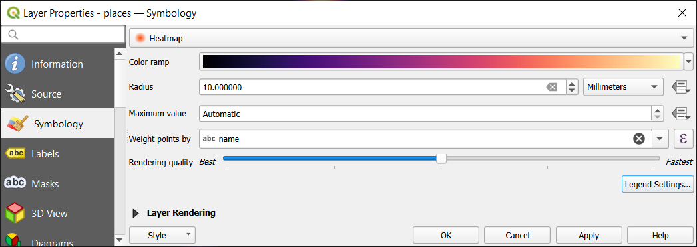
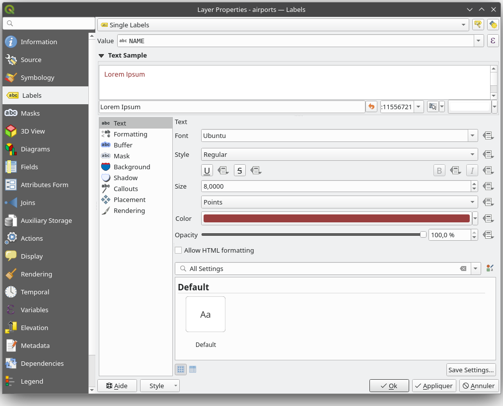
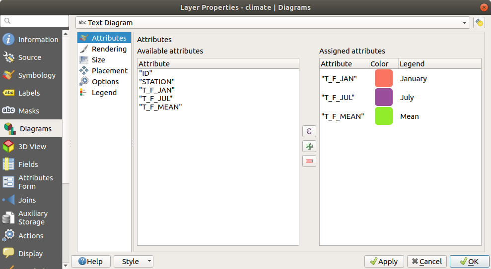
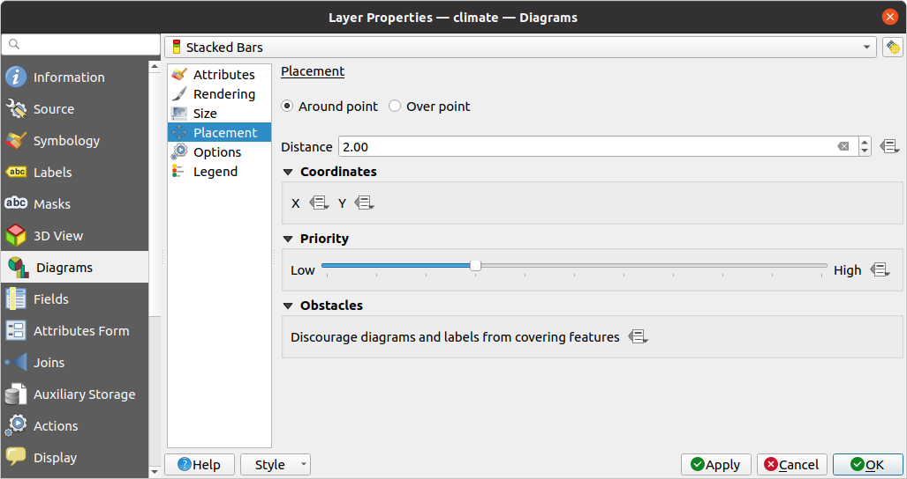
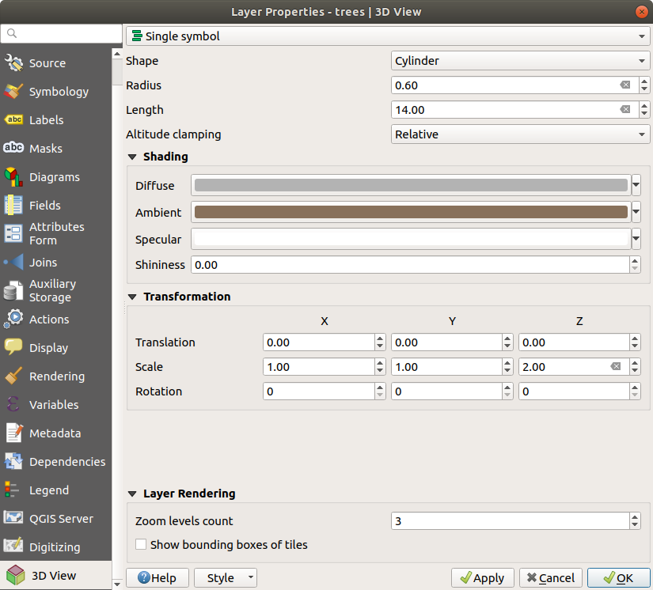
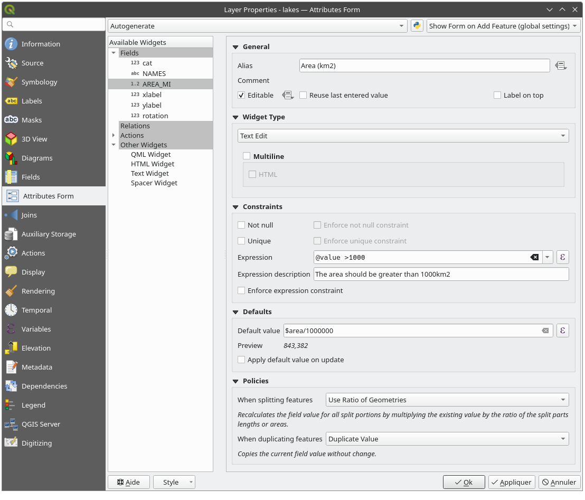
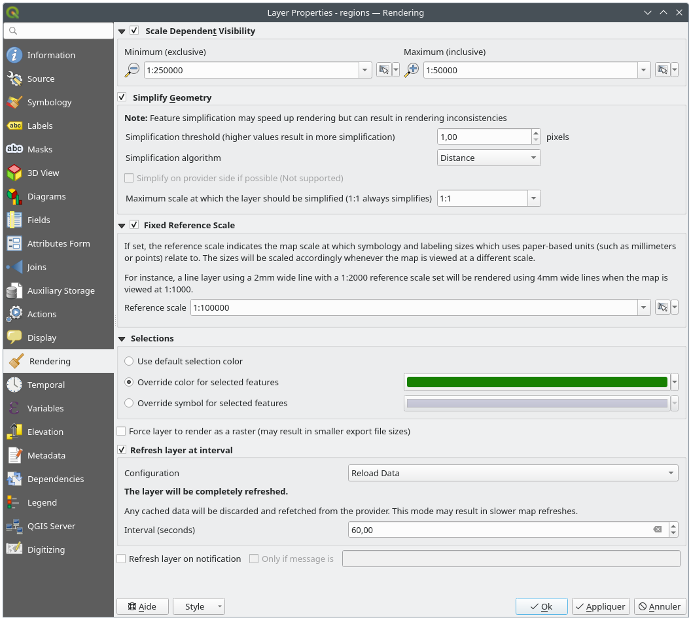
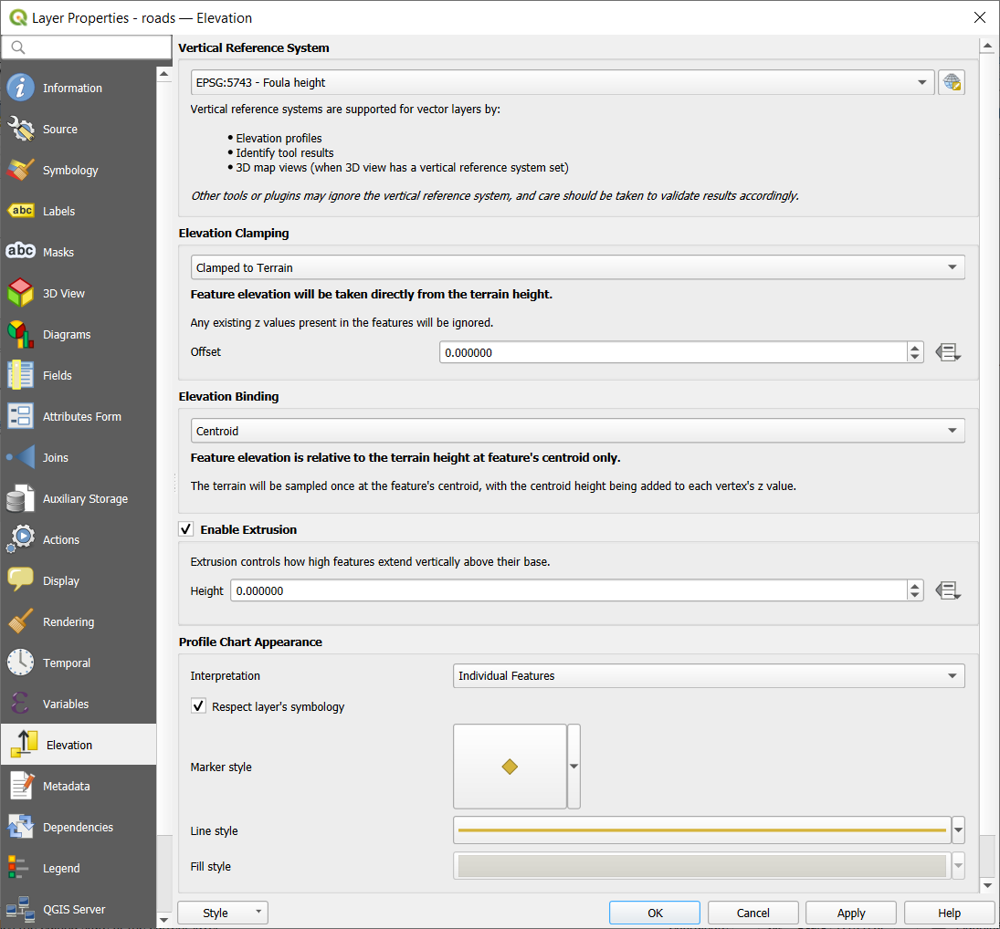

.. _vector_properties_dialog:

****************************
The Vector Properties Dialog
****************************

.. only:: html

   .. contents::
      :local:

The :guilabel:`Layer Properties` dialog for a vector layer provides general
settings to manage appearance of layer features in the map (symbology,
labeling, diagrams), interaction with the mouse (actions, map tips, form
design). It also provides information about the layer.

To access the :guilabel:`Layer Properties` dialog:

* In the :guilabel:`Layers` panel, double-click the layer or right-click
  and select :guilabel:`Properties...` from the pop-up menu;
* Go to :menuselection:`Layer --> Layer Properties...` menu when the layer
  is selected.

The vector :guilabel:`Layer Properties` dialog provides the following sections:

.. list-table::

   * - |metadata| :ref:`Information <vectorinformationmenu>`
     - |system| :ref:`Source <vectorsourcemenu>`
     - |symbology| :ref:`Symbology <vector_style_menu>`:sup:`[1]`
   * - |labelingSingle| :ref:`Labels <vector_labels_tab>`:sup:`[1]`
     - |labelmask| :ref:`Mask <vector_mask_menu>`:sup:`[1]`
     - |3d| :ref:`3D View <sec_3_d_view>`:sup:`[1]`
   * - |diagram| :ref:`Diagrams <sec_diagram>`
     - |sourceFields| :ref:`Fields <vector_fields_menu>`
     - |formView| :ref:`Attributes Form <vector_attributes_menu>`
   * - |join| :ref:`Joins <vector_joins>`
     - |auxiliaryStorage| :ref:`Auxiliary Storage <vector_auxiliary_storage>`
     - |action| :ref:`Actions <actions_menu>`
   * - |display| :ref:`Display <maptips>`
     - |rendering| :ref:`Rendering <vectorrenderingmenu>`
     - |temporal| :ref:`Temporal <vectortemporalmenu>`
   * - |expression| :ref:`Variables <vectorvariablesmenu>`
     - |elevationscale| :ref:`Elevation <vectorelevationmenu>`
     - |editMetadata| :ref:`Metadata <vectormetadatamenu>`
   * - |dependencies| :ref:`Dependencies <vectordependenciesmenu>`
     - |legend| :ref:`Legend <vectorlegendmenu>`
     - |overlay| :ref:`QGIS Server <vectorservermenu>`
   * - |digitizing| :ref:`Digitizing <digitizingmenu>`
     - :ref:`External plugins <plugins>`:sup:`[2]` tabs
     -

:sup:`[1]` Also available in the :ref:`Layer styling panel <layer_styling_panel>`

:sup:`[2]` :ref:`External plugins <plugins>` you install can optionally add tabs to this
dialog. Those are not presented in this document. Refer to their documentation.

.. tip:: **Share full or partial properties of the layer styles**

   The :menuselection:`Style` menu at the bottom of the dialog allows you to import or export
   these or part of these properties from/to several destination (file, clipboard, database).
   See :ref:`manage_custom_style`.

.. note::

   Because properties (symbology, label, actions, default values, forms...) of
   embedded layers (see :ref:`nesting_projects`) are pulled from the original
   project file and to avoid changes that may break this behavior, the layer
   properties dialog is made unavailable for these layers.

.. _vectorinformationmenu:

Information Properties
======================

The |metadata| :guilabel:`Information` tab is read-only and represents an interesting
place to quickly grab summarized information and metadata on the current layer.
Provided information are:

* general such as name in the project, source path, list of auxiliary files,
  last save time and size, the used provider
* based on the provider of the layer: format of storage, geometry type,
  data source encoding, extent, feature count...
* the Coordinate Reference System: name, units, method, accuracy, reference
  (i.e. whether it's static or dynamic)
* picked from the :ref:`filled metadata <vectormetadatamenu>`: access, extents,
  links, contacts, history...
* and related to its geometry (spatial extent, CRS...) or its attributes (number
  of fields, characteristics of each...).

.. _vectorsourcemenu:

Source Properties
=================

|system| Use this tab to define general settings for the vector layer.

.. _figure_vector_general:

.. figure:: img/vector_source_menu.png
   :align: center

   Source tab in vector Layer Properties dialog

Settings
--------

* Set a :guilabel:`Layer name` different from the layer filename that will be
  used to identify the layer in the project (in the :guilabel:`Layers Panel`, with
  expressions, in print layout legend, ...)
* Depending on the data format, select the :guilabel:`Data source encoding` if not
  correctly detected by QGIS.

Coordinate Reference System and Geometry
----------------------------------------

* Displays the layer's :ref:`Assigned Coordinate Reference System (CRS) <layer_crs>`.
  You can change the layer's CRS, selecting a recently used one
  in the drop-down list or clicking on |setProjection| :sup:`Select CRS` button
  (see :ref:`crs_selector`). Use this process only if the CRS applied to the
  layer is a wrong one or if none was applied.
  If you wish to reproject your data into another CRS, rather use layer reprojection
  algorithms from Processing or :ref:`Save it into another layer <general_saveas>`.
* :guilabel:`Create spatial index` (only for OGR-supported formats).
* :guilabel:`Update extents` information for a layer.

.. index:: Query builder
.. _vector_query_builder:

Query Builder
-------------

The Query Builder dialog is accessible through the :guilabel:`Query Builder` button
at the bottom of the :guilabel:`Source` tab in the Layer Properties dialog,
under the :guilabel:`Provider feature filter` group.

The Query Builder provides an interface that allows
you to define a subset of the features in the layer using a SQL-like WHERE
clause and to display the result in the main window. As long as the query is
active, only the features corresponding to its result are available in the
project.

You can use one or more layer attributes to define the filter in the ``Query
Builder``.
The use of more than one attribute is shown in :numref:`Figure_vector_querybuilder`.
In the example, the filter combines the attributes

* ``toa`` (``DateTime`` field: ``cast("toa" as character) > '2017-05-17'`` and
  ``cast("toa" as character) < '2019-12-24T18:00:00'``),
* ``name`` (``String`` field: ``"name" > 'S'``) and
* ``FID`` (``Integer`` field: ``FID > 10``)

using the AND, OR and NOT operators and parenthesis.
This syntax (including the DateTime format for the ``toa`` field) works for
GeoPackage datasets.

The filter is made at the data provider (OGR, PostgreSQL, MS SQL Server...) level.
So the syntax depends on the data provider (DateTime is for instance not
supported for the ESRI Shapefile format).
The complete expression::

  cast("toa" as character) > '2017-05-17' AND
  cast("toa" as character) < '2019-12-24T18:00:00' AND
  NOT ("name" > 'S' OR FID > 10)

You can also open the :guilabel:`Query Builder` dialog using the :guilabel:`Filter...`
option from the :menuselection:`Layer` menu or the layer contextual menu.
The :guilabel:`Fields`, :guilabel:`Values` and :guilabel:`Operators` sections in
the dialog help you to construct the SQL-like query exposed in the
:guilabel:`Provider specific filter expression` box.

.. _figure_vector_querybuilder:

.. figure:: img/queryBuilder.png
   :align: center

   Query Builder

The **Fields** list contains all the fields of the layer. To add an attribute
column to the SQL WHERE clause field, double-click its name or just type it into
the SQL box.

The **Values** frame lists the values of the currently selected field. To list all
unique values of a field, click the :guilabel:`All` button. To instead list the first
25 unique values of the column, click the :guilabel:`Sample` button. To add a value
to the SQL WHERE clause field, double click its name in the Values list.
You can use the search box at the top of the Values frame to easily browse and
find attribute values in the list.

The **Operators** section contains all usable operators. To add an operator to
the SQL WHERE clause field, click the appropriate button. Relational operators
( ``=`` , ``>`` , ...), string comparison operator (``LIKE``), and logical
operators (``AND``, ``OR``, ...) are available.

The :guilabel:`Test` button helps you check your query and displays a message box with
the number of features satisfying the current query.
Use the :guilabel:`Clear` button to wipe the SQL query and revert the layer to its
original state (ie, fully load all the features).
It is possible to :guilabel:`Save...` the query as a :file:`.QQF` file,
or :guilabel:`Load...` the query from a file into the dialog.

When a filter is applied,
QGIS treats the resulting subset acts as if it were the entire layer. For
example if you applied the filter above for 'Borough' (``"TYPE_2" = 'Borough'``),
you can not display, query, save or edit ``Anchorage``, because that is a
'Municipality' and therefore not part of the subset.

.. tip:: **Filtered layers are indicated in the Layers Panel**

  In the :guilabel:`Layers` panel, filtered layer is listed with a |indicatorFilter|
  :sup:`Filter` icon next to it indicating the query used when the mouse hovers over the button.
  Double-click the icon opens the :guilabel:`Query Builder` dialog for edit.
  This can also be achieved through the :menuselection:`Layer --> Filter...` menu.

.. index:: Style, Symbology, Renderer
.. _vector_style_menu:

Symbology Properties
====================

The |symbology| :guilabel:`Symbology` tab provides you with a comprehensive tool for
rendering and symbolizing your vector data. You can use tools that are
common to all vector data, as well as special symbolizing tools that were
designed for the different kinds of vector data. However all types share the
following dialog structure: in the upper part, you have a widget that helps
you prepare the classification and the symbol to use for features and at
the bottom the :ref:`layer_rendering` widget.

.. tip:: **Switch quickly between different layer representations**

   Using the :menuselection:`Styles --> Add` menu at the bottom of the
   :guilabel:`Layer Properties` dialog, you can save as many styles as needed.
   A style is the combination of all properties of a layer (such as symbology,
   labeling, diagram, fields form, actions...) as you want. Then, simply
   switch between styles from the context menu of the layer in :guilabel:`Layers Panel`
   to automatically get different representations of your data.

.. tip:: **Export vector symbology**

   You have the option to export vector symbology from QGIS into Google \*.kml,
   \*.dxf and MapInfo \*.tab files. Just open the right mouse menu of the layer
   and click on :menuselection:`Save As...` to specify the name of the output file
   and its format. In the dialog, use the :menuselection:`Symbology export` menu
   to save the symbology either as :menuselection:`Feature symbology -->` or as
   :menuselection:`Symbol layer symbology -->`. If you have used symbol layers,
   it is recommended to use the second setting.

.. ToDo: add information about the export options

Features rendering
------------------

The renderer is responsible for drawing a feature together with the correct
symbol. Regardless layer geometry type, there are four common types of
renderers: single symbol, categorized, graduated and rule-based. For point
layers, there are point displacement, point cluster and heatmap renderers available while
polygon layers can also be rendered with the merged features, inverted polygons and 2.5 D renderers.

There is no continuous color renderer, because it is in fact only a special
case of the graduated renderer. The categorized and graduated renderers can be
created by specifying a symbol and a color ramp - they will set the colors for
symbols appropriately. For each data type (points, lines and polygons), vector
symbol layer types are available. Depending on the chosen renderer, the dialog
provides different additional sections.

.. note::

   If you change the renderer type when setting the style of a vector layer the
   settings you made for the symbol will be maintained. Be aware that this
   procedure only works for one change. If you repeat changing the renderer
   type the settings for the symbol will get lost.

.. index::
   single: Symbology; Single symbol renderer
.. _single_symbol_renderer:

Single Symbol Renderer
......................

The |singleSymbol| :guilabel:`Single Symbol` renderer is used to render
all features of the layer using a single user-defined symbol.
See :ref:`symbol-selector` for further information about symbol representation.

.. _figure_single_symbology:

.. figure:: img/singlesymbol_ng_line.png
   :align: center

   Single symbol line properties

.. index::
   single: Symbology; No symbols renderer
.. _no_symbol_renderer:

No Symbols Renderer
...................

The |nullSymbol| :guilabel:`No Symbols` renderer is a special use case of the
Single Symbol renderer as it applies the same rendering to all features.
Using this renderer, no symbol will be drawn for features,
but labeling, diagrams and other non-symbol parts will still be shown.

Selections can still be made on the layer in the canvas and selected
features will be rendered with a default symbol. Features being edited
will also be shown.

This is intended as a handy shortcut for layers which you only want
to show labels or diagrams for, and avoids the need to render
symbols with totally transparent fill/border to achieve this.

.. index:: Classes
   single: Symbology; Categorized renderer
.. _categorized_renderer:

Categorized Renderer
....................

The |categorizedSymbol| :guilabel:`Categorized` renderer is used to render the
features of a layer, using a user-defined symbol whose aspect reflects the
discrete values of a field or an expression.

.. _figure_categorized_symbology:

   Categorized Symbolizing options

To use categorized symbology for a layer:

#. Select the :guilabel:`Value` of classification: it can be an existing field
   or an :ref:`expression <vector_expressions>` you can type in the box
   or build using the associated |expression| button.
   Using expressions for categorizing avoids the need to create a field for symbology purposes only
   (eg, if your classification criteria are derived from one or more attributes).

   The expression used to classify features can be of any type; eg, it can:

   * be a comparison. In this case, QGIS returns values ``1`` (**True**) and
     ``0`` (**False**). Some examples:

     ::

      myfield >= 100
      $id = @atlas_featureid
      myfield % 2 = 0
      within( $geometry, @atlas_geometry )

   * combine different fields:

     ::

      concat( field_1, ' ', field_2 )

   * be a calculation on fields:

     ::

      myfield % 2
      year( myfield )
      field_1 + field_2
      substr( field_1, -3 )

   * be used to transform linear values to discrete classes, e.g.:

     ::

      CASE WHEN x > 1000 THEN 'Big' ELSE 'Small' END

   * combine several discrete values into a single category, e.g.:

     ::

      CASE
      WHEN building IN ('residence', 'mobile home') THEN 'residential'
      WHEN building IN ('commercial', 'industrial') THEN 'Commercial and Industrial'
      END

   .. tip:: While you can use any kind of expression to categorize features,
    for some complex expressions it might be simpler to use :ref:`rule-based
    rendering <rule_based_rendering>`.

#. Configure the :ref:`Symbol <symbol-selector>`, which will be used as
   base symbol for all the classes;
#. Indicate the :ref:`Color ramp <color-ramp>`, ie the range of colors from which
   the color applied to each symbol is selected.

   Besides the common options of the :ref:`color ramp widget <color_ramp_widget>`,
   you can apply a |unchecked| :guilabel:`Random Color Ramp` to the categories.
   You can click the :guilabel:`Shuffle Random Colors` entry to regenerate a new set
   of random colors if you are not satisfied.
#. Then click on the :guilabel:`Classify` button to create classes from the
   distinct values of the provided field or expression.
#. :guilabel:`Apply` the changes if the :ref:`live update <layer_styling_panel>`
   is not in use and each feature on the map canvas will be rendered with the
   symbol of its class.

   By default, QGIS appends an :guilabel:`all other values` class to the list.
   While empty at the beginning, this class is used as a default class for any
   feature not falling into the other classes (eg, when you create features
   with new values for the classification field / expression).

Further tweaks can be done to the default classification:

* You can |symbologyAdd| :sup:`Add` new categories, |symbologyRemove| :sup:`Remove`
  selected categories or :guilabel:`Delete All` of them.
* A class can be disabled by unchecking the checkbox to the left of the
  class name; the corresponding features are hidden on the map.
* Drag-and-drop the rows to reorder the classes
* To change the symbol, the value or the legend of a class, double click the item.

Right-clicking over selected item(s) shows a contextual menu to:

* :guilabel:`Copy Symbol` and :guilabel:`Paste Symbol`, a convenient way
  to apply the item's representation to others
* :guilabel:`Change Color...` of the selected symbol(s)
* :guilabel:`Change Opacity...` of the selected symbol(s)
* :guilabel:`Change Output Unit...` of the selected symbol(s)
* :guilabel:`Change Width...` of the selected line symbol(s)
* :guilabel:`Change Size...` of the selected point symbol(s)
* :guilabel:`Change Angle...` of the selected point symbol(s)
* :guilabel:`Merge Categories`: Groups multiple selected categories into a single
  one. This allows simpler styling of layers with a large number of categories,
  where it may be possible to group numerous distinct categories into a smaller
  and more manageable set of categories which apply to multiple values.

  .. tip:: Since the symbol kept for the merged categories is the one of the
   topmost selected category in the list, you may want to move the category
   whose symbol you wish to reuse to the top before merging.

* :guilabel:`Unmerge Categories` that were previously merged

The created classes also appear in a tree hierarchy in the :guilabel:`Layers` panel.
Double-click an entry in the map legend to edit the assigned symbol.
Right-click and you will get some :ref:`more options <editing_style_layer>`.

.. _categorized_advanced_menu:

The :guilabel:`Advanced` menu gives access to options to speed classification
or fine-tune the symbols rendering:

* :guilabel:`Match to saved symbols`: Using the :ref:`symbols library
  <vector_style_manager>`, assigns to each category a symbol whose name
  represents the classification value of the category
* :guilabel:`Match to symbols from file...`: Provided a file with symbols,
  assigns to each category a symbol whose name represents the classification
  value of the category
* :ref:`Symbol levels... <Symbols_levels>` to define the order of symbols rendering.

.. index:: Natural Breaks (Jenks), Pretty Breaks, Equal Interval, Quantile, Histogram
   single: Symbology; Graduated renderer
.. _graduated_renderer:

Graduated Renderer
..................

The |graduatedSymbol| :guilabel:`Graduated` renderer is used to render
all the features from a layer, using an user-defined symbol whose color or size
reflects the assignment of a selected feature's attribute to a class.

Like the Categorized Renderer, the Graduated Renderer allows you
to define rotation and size scale from specified columns.

Also, analogous to the Categorized Renderer, it allows you to select:

* The :guilabel:`Value` of classification: it can be an existing field
  or an :ref:`expression <vector_expressions>` you can type in the box
  or build using the associated |expression| button.
  Using expressions for graduating avoids the need to create a field for symbology purposes only
  (eg, if your classification criteria are derived from one or more attributes).
* The symbol (using the Symbol selector dialog)
* The legend format and the precision
* The method to use to change the symbol: color or size
* The colors (using the color Ramp list) if the color method is selected
* The size (using the size domain and its unit)

Then you can use the Histogram tab which shows an interactive histogram of the
values from the assigned field or expression. Class breaks can be moved or
added using the histogram widget.

.. note::

   You can use Statistical Summary panel to get more information on your vector
   layer. See :ref:`statistical_summary`.

Back to the Classes tab, you can specify the number of classes and also the
mode for classifying features within the classes (using the Mode list). The
available modes are:

* Equal Count (Quantile): each class will have the same number of elements
  (the idea of a boxplot).
* Equal Interval: each class will have the same size (e.g. with the values
  from 1 to 16 and four classes, each class will have a size of four).
* Logarithmic scale: suitable for data with a wide range of values.
  Narrow classes for low values and wide classes for large values (e.g. for
  decimal numbers with range [0..100] and two classes, the first class will
  be from 0 to 10 and the second class from 10 to 100).
* Natural Breaks (Jenks): the variance within each class is minimized while
  the variance between classes is maximized.
* Pretty Breaks: computes a sequence of about n+1 equally spaced nice values
  which cover the range of the values in x. The values are chosen so that they
  are 1, 2 or 5 times a power of 10. (based on pretty from the R statistical
  environment https://www.rdocumentation.org/packages/base/topics/pretty).
* Standard Deviation: classes are built depending on the standard deviation of
  the values.

The listbox in the center part of the :guilabel:`Symbology` tab lists the classes
together with their ranges, labels and symbols that will be rendered.

Click on **Classify** button to create classes using the chosen mode. Each
classes can be disabled unchecking the checkbox at the left of the class name.

To change symbol, value and/or label of the class, just double click
on the item you want to change.

Right-clicking over selected item(s) shows a contextual menu to:

* :guilabel:`Copy Symbol` and :guilabel:`Paste Symbol`, a convenient way
  to apply the item's representation to others
* :guilabel:`Change Color...` of the selected symbol(s)
* :guilabel:`Change Opacity...` of the selected symbol(s)
* :guilabel:`Change Output Unit...` of the selected symbol(s)
* :guilabel:`Change Width...` of the selected line symbol(s)
* :guilabel:`Change Size...` of the selected point symbol(s)
* :guilabel:`Change Angle...` of the selected point symbol(s)

The example in :numref:`figure_graduated_symbology` shows the graduated rendering dialog for
the major_rivers layer of the QGIS sample dataset.

.. _figure_graduated_symbology:

.. figure:: img/graduatedsymbol_ng_line.png
   :align: center

   Graduated Symbolizing options

The created classes also appear in a tree hierarchy in the :guilabel:`Layers` panel.
Double-click an entry in the map legend to edit the assigned symbol.
Right-click and you will get some :ref:`more options <editing_style_layer>`.

.. index:: Proportional symbol, Multivariate analysis, Size assistant
.. _proportional_symbols:

Proportional Symbol and Multivariate Analysis
.............................................

Proportional Symbol and Multivariate Analysis are not
rendering types available from the Symbology rendering drop-down list.
However with the :ref:`data-defined override <data_defined>` options applied
over any of the previous
rendering options, QGIS allows you to display your point and line data with
such representation.

**Creating proportional symbol**

To apply a proportional rendering:

#. First apply to the layer the :ref:`single symbol renderer
   <single_symbol_renderer>`.
#. Then set the symbol to apply to the features.
#. Select the item at the upper level of the symbol tree, and use the
   |dataDefine| :sup:`Data-defined override` :ref:`button <data_defined>` next
   to the :guilabel:`Size` (for point layer) or :guilabel:`Width` (for line
   layer) option.
#. Select a field or enter an expression, and for each feature, QGIS will apply
   the output value to the property and proportionally resize the symbol in the
   map canvas.

   If need be, use the :guilabel:`Size assistant...` option of the |dataDefine|
   menu to apply some transformation (exponential, flannery...) to the symbol
   size rescaling (see :ref:`data_defined_assistant` for more details).

You can choose to display the proportional symbols in the :ref:`Layers panel
<label_legend>` and the :ref:`print layout legend item <layout_legend_item>`:
unfold the :guilabel:`Advanced` drop-down list at the bottom of the main dialog of
the :guilabel:`Symbology` tab and select **Data-defined size legend...** to
configure the legend items (see :ref:`data_defined_size_legend` for details).

**Creating multivariate analysis**

A multivariate analysis rendering helps you evaluate the relationship between
two or more variables e.g., one can be represented by a color ramp while the
other is represented by a size.

The simplest way to create multivariate analysis in QGIS is to:

#. First apply a categorized or graduated rendering on a layer, using the same
   type of symbol for all the classes.
#. Then, apply a proportional symbology on the classes:

   #. Click on the :guilabel:`Change` button above the classification frame:
      you get the :ref:`symbol-selector` dialog.
   #. Rescale the size or width of the symbol layer using the |dataDefine|
      :ref:`data defined override <data_defined>` widget as seen above.

Like the proportional symbol, the scaled symbology can be added to the layer
tree, on top of the categorized or graduated classes symbols using the
:ref:`data defined size legend <data_defined_size_legend>` feature. And
both representation are also available in the print layout legend item.

.. _figure_symbology_multivariate:

.. figure:: img/multivariate_example.png
   :align: center

   Multivariate example with scaled size legend

.. index::
   single: Symbology; Rule-based renderer
   single: Rule-based renderer; Create a rule
.. _rule_based_rendering:

Rule-based Renderer
....................

Rules are QGIS :ref:`expressions <vector_expressions>` used to discriminate
features according to their attributes or properties in order to apply specific
rendering settings to them. Rules can be nested, and features belong to a class
if they belong to all the upper nesting level(s).

The |ruleBasedSymbol| :guilabel:`Rule-based` renderer is thus designed
to render all the features from a layer, using symbols whose aspect
reflects the assignment of a selected feature to a fine-grained class.

To create a rule:

#. Activate an existing row by double-clicking it (by default, QGIS adds a
   symbol without a rule when the rendering mode is enabled) or click the
   |symbologyEdit| :sup:`Edit rule` or |symbologyAdd| :sup:`Add rule` button.
#. In the :guilabel:`Edit Rule` dialog that opens, you can define a label
   to help you identify each rule. This is the label that will be displayed
   in the :guilabel:`Layers Panel` and also in the print composer legend.
#. Manually enter an expression in the text box next to the |radioButtonOn|
   :guilabel:`Filter` option or press the |expression| button next to it to open
   the expression string builder dialog.
#. Use the provided functions and the layer attributes to build an :ref:`expression
   <vector_expressions>` to filter the features you'd like to retrieve. Press
   the :guilabel:`Test` button to check the result of the query.
#. You can enter a longer label to complete the rule description.
#. You can use the |checkbox| :guilabel:`Scale Range` option to set scales at which
   the rule should be applied.
#. Finally, configure the :ref:`symbol to use <symbol-selector>` for these features.
#. And press :guilabel:`OK`.

A new row summarizing the rule is added to the Layer Properties dialog.
You can create as many rules as necessary following the steps above or copy
pasting an existing rule. Drag-and-drop the rules on top of each other to nest
them and refine the upper rule features in subclasses.

.. _refine_selected_rule:

The rule-based renderer can be combined with categorized or graduated renderers.
Selecting a rule, you can organize its features in subclasses using the
:guilabel:`Refine selected rules` drop-down menu. Refined classes appear like
sub-items of the rule, in a tree hierarchy and like their parent, you can set
the symbology and the rule of each class.
Automated rule refinement can be based on:

* **scales**: given a list of scales, this option creates a set of classes
  to which the different user-defined scale ranges apply. Each new scale-based
  class can have its own symbology and expression of definition.
  This can e.g. be a convenient way to display the same features with various
  symbols at different scales, or display only a set of features depending on
  the scale (e.g. local airports at large scale vs international airports at
  small scale).
* **categories**: applies a :ref:`categorized renderer <categorized_renderer>`
  to the features falling in the selected rule.
* or **ranges**: applies a :ref:`graduated renderer <graduated_renderer>`
  to the features falling in the selected rule.

Refined classes appear like sub-items of the rule, in a tree hierarchy and like
above, you can set symbology of each class.
Symbols of the nested rules are stacked on top of each other so be careful in
choosing them. It is also possible to uncheck |unchecked| :guilabel:`Symbols`
in the :guilabel:`Edit rule` dialog to avoid rendering a particular symbol
in the stack.

In the :guilabel:`Edit rule` dialog, you can avoid writing all the rules and
make use of the |radioButtonOff| :guilabel:`Else` option to catch all the
features that do not match any of the other rules, at the same level. This
can also be achieved by writing ``Else`` in the *Rule* column of the
:menuselection:`Layer Properties --> Symbology --> Rule-based` dialog.

Right-clicking over selected item(s) shows a contextual menu to:

* :guilabel:`Copy` and :guilabel:`Paste`, a convenient way to create new
  item(s) based on existing item(s)
* :guilabel:`Copy Symbol` and :guilabel:`Paste Symbol`, a convenient way
  to apply the item's representation to others
* :guilabel:`Change Color...` of the selected symbol(s)
* :guilabel:`Change Opacity...` of the selected symbol(s)
* :guilabel:`Change Output Unit...` of the selected symbol(s)
* :guilabel:`Change Width...` of the selected line symbol(s)
* :guilabel:`Change Size...` of the selected point symbol(s)
* :guilabel:`Change Angle...` of the selected point symbol(s)
* :guilabel:`Refine Current Rule`: open a submenu that allows to
  refine the current rule with **scales**, **categories** or **Ranges**.
  Same as selecting the :ref:`corresponding menu <refine_selected_rule>`
  at the bottom of the dialog.

Unchecking a row in the rule-based renderer dialog hides in the map canvas
the features of the specific rule and the nested ones.

The created rules also appear in a tree hierarchy in the map legend.
Double-click an entry in the map legend to edit the assigned symbol.
Right-click and you will get some :ref:`more options <editing_style_layer>`.

The example in :numref:`figure_rule_based_symbology` shows the rule-based rendering
dialog for the rivers layer of the QGIS sample dataset.

.. _figure_rule_based_symbology:

.. figure:: img/rulesymbol_ng_line.png
   :align: center

   Rule-based Symbolizing options

.. index:: Displacement plugin, Displacement circle
   single: Symbology; Point displacement renderer
.. _point_displacement:

Point displacement Renderer
............................

The |pointDisplacementSymbol| :guilabel:`Point Displacement` renderer takes
the point features falling in a given distance tolerance from each other and
places their symbols around their barycenter, following different placement
methods. This can be a convenient way to visualize all the features of a point
layer, even if they have the same location (e.g. amenities in a building).

To configure a point displacement renderer, you have to:

#. Set the :guilabel:`Center symbol`: how the virtual point at the center will
   look like
#. Select the :guilabel:`Renderer` type: how you want to classify features
   in the layer (single, categorized, rule-based...)
#. Press the :guilabel:`Renderer Settings...` button to configure features'
   symbology according to the selected renderer
#. Indicate the :guilabel:`Distance` tolerance in which close features are
   considered overlapping and then displaced over the same virtual point.
   Supports common symbol units.
#. Configure the :guilabel:`Placement methods`:

   * **Ring**: places all the features on a circle whose radius depends on the
     number of features to display.
   * **Concentric rings**: uses a set of concentric circles to show the features.
   * **Grid**: generates a regular grid with a point symbol at each intersection.

#. Displaced symbols are placed on the :guilabel:`Displacement lines`.
   While the minimal spacing of the displacement lines depends on the
   point symbols renderer, you can still customize some of their settings such as
   the :guilabel:`Stroke width`, :guilabel:`Stroke color` and :guilabel:`Size
   adjustment` (e.g., to add more spacing between the rendered points).

#. Use the :guilabel:`Labels` group options to perform points labeling: the labels
   are placed near the displaced symbol, and not at the feature real position.

   #. Select the :guilabel:`Label attribute`: a field of the layer to use for labeling
   #. Indicate the :guilabel:`Label font` properties and size
   #. Pick a :guilabel:`Label color`
   #. Set a :guilabel:`Label distance factor`: for each point feature, offsets
      the label from the symbol center proportionally to the symbol's diagonal size.
   #. Turn on |unchecked| :guilabel:`Use scale dependent labeling`
      if you want to display labels only on scales larger than a given
      :guilabel:`Minimum map scale`.

.. _figure_displacement_symbology:

.. figure:: img/poi_displacement.png
   :align: center

   Point displacement dialog

.. note::

 Point Displacement renderer does not alter feature geometry, meaning that
 points are not moved from their position. They are still located
 at their initial place. Changes are only visual, for rendering purpose.
 Use instead the Processing :ref:`qgispointsdisplacement` algorithm
 if you want to create displaced features.

.. index:: Cluster
   single: Symbology; Point cluster renderer
.. _point_cluster:

Point Cluster Renderer
.......................

Unlike the |pointDisplacementSymbol| :guilabel:`Point Displacement` renderer
which blows up nearest or overlaid point features placement, the |pointClusterSymbol|
:guilabel:`Point Cluster` renderer groups nearby points into a single
rendered marker symbol. Points that fall within a specified distance
from each others are merged into a single symbol.
Points aggregation is made based on the closest group being formed, rather
than just assigning them the first group within the search distance.

From the main dialog, you can:

#. Set the symbol to represent the point cluster in the :guilabel:`Cluster symbol`;
   the default rendering displays the number of aggregated features thanks to the
   ``@cluster_size`` :ref:`variable <general_tools_variables>` on Font marker
   symbol layer.
#. Select the :guilabel:`Renderer` type, i.e. how you want to classify features
   in the layer (single, categorized, rule-based...)
#. Press the :guilabel:`Renderer Settings...` button to configure features' symbology
   as usual. Note that this symbology is only visible on features that are not clustered,
   the :guilabel:`Cluster symbol` being applied otherwise.
   Also, when all the point features in a cluster belong to the same rendering class,
   and thus would be applied the same color, that color represents the ``@cluster_color``
   variable of the cluster.
#. Indicate the maximal :guilabel:`Distance` to consider for clustering features.
   Supports common symbol units.

.. _figure_cluster_symbology:

.. figure:: img/cluster_symbol.png
   :align: center

   Point Cluster dialog

.. note::

 Point Cluster renderer does not alter feature geometry,
 meaning that points are not moved from their position. They are still located
 at their initial place. Changes are only visual, for rendering purpose.
 Use instead the Processing :ref:`qgiskmeansclustering` or
 :ref:`qgisdbscanclustering` algorithm if you want to create cluster-based
 features.

.. index:: Classes
   single: Symbology; Merged Features renderer
.. _merged_renderer:

Merged Features Renderer
........................

The |mergedFeatures| :guilabel:`Merged Features` renderer allows area and line
features to be “dissolved” into a single object prior to rendering to ensure that
complex symbols or overlapping features are represented by a uniform and
contiguous cartographic symbol.

.. index::
   single: Symbology; Inverted polygon renderer
.. _inverted_polygon_renderer:

Inverted Polygon Renderer
..........................

The |invertedSymbol| :guilabel:`Inverted Polygon` renderer allows user
to define a symbol to fill in
outside of the layer's polygons. As above you can select subrenderers, namely
Single symbol, Graduated, Categorized, Rule-Based or 2.5D renderer.

.. _figure_inverted_symbology:

.. figure:: img/inverted_polygon_symbol.png
   :align: center

   Inverted Polygon dialog

.. index:: Heatmap
   single: Symbology; Heatmap renderer
.. _heatmap:

Heatmap Renderer
.................

With the |heatmapSymbol| :guilabel:`Heatmap` renderer you can create live
dynamic heatmaps for (multi)point layers.
You can specify the heatmap radius in millimeters, points, pixels, map units or
inches, choose and edit a color ramp for the heatmap style and use a slider for
selecting a trade-off between render speed and quality. You can also define a
maximum value limit and give a weight to points using a field or an expression.
When adding or removing a feature the heatmap renderer updates the heatmap style
automatically.

.. _figure_heatmap_symbology:

   Heatmap dialog

.. index:: 2.5D
   single: Symbology; 2.5D renderer
.. _2.5_D_rendering:

2.5D Renderer
..............

Using the |25dSymbol| :guilabel:`2.5D` renderer it's possible to create
a 2.5D effect on your layer's features.
You start by choosing a :guilabel:`Height` value (in map units). For that
you can use a fixed value, one of your layer's fields, or an expression. You also
need to choose an :guilabel:`Angle` (in degrees) to recreate the viewer position
(0 |degrees| means west, growing in counter clock wise). Use advanced configuration options
to set the :guilabel:`Roof Color` and :guilabel:`Wall Color`. If you would like
to simulate solar radiation on the features walls, make sure to check the
|checkbox| :guilabel:`Shade walls based on aspect` option. You can also
simulate a shadow by setting a :guilabel:`Color` and :guilabel:`Size` (in map
units).

.. _figure_25d_symbology:

.. figure:: img/2_5dsymbol.png
   :align: center

   2.5D dialog

.. tip:: **Using 2.5D effect with other renderers**

   Once you have finished setting the basic style on the 2.5D renderer, you can
   convert this to another renderer (single, categorized, graduated). The 2.5D
   effects will be kept and all other renderer specific options will be
   available for you to fine tune them (this way you can have for example categorized
   symbols with a nice 2.5D representation or add some extra styling to your 2.5D
   symbols). To make sure that the shadow and the "building" itself do not interfere
   with other nearby features, you may need to enable Symbols Levels (
   :menuselection:`Advanced --> Symbol levels...`).
   The 2.5D height and angle values are saved in the layer's variables,
   so you can edit it afterwards in the variables tab of the layer's properties dialog.

.. index:: Classes
   single: Symbology; Embedded renderer
.. _embedded_renderer:

Embedded Renderer
....................

The :guilabel:`Embedded Symbols` renderer allows to display the 'native'
symbology of a provided datasource. This is mostly the case with :file:`KML`
and :file:`TAB` datasets that have predefined symbology.

.. index:: Layer rendering, Sort features, Z-level
.. _layer_rendering:

Layer rendering
---------------

From the Symbology tab, you can also set some options that invariably act on all
features of the layer:

* :guilabel:`Opacity` |slider|: You can make the underlying layer in
  the map canvas visible with this tool. Use the slider to adapt the visibility
  of your vector layer to your needs. You can also make a precise definition of
  the percentage of visibility in the menu beside the slider.

* :guilabel:`Blending mode` at the :guilabel:`Layer` and :guilabel:`Feature` levels:
  You can achieve special rendering effects with these tools that you may previously
  only know from graphics programs. The pixels of your overlaying and
  underlaying layers are mixed through the settings described in :ref:`blend-modes`.

* Apply :ref:`paint effects <draw_effects>` on all the layer features with the
  :guilabel:`Draw Effects` button.

* :guilabel:`Control feature rendering order` allows you, using features
  attributes, to define the z-order in which they shall be rendered.
  Activate the checkbox and click on the |sort| button beside.
  You then get the :guilabel:`Define Order` dialog in which you:

  #. Choose a field or build an expression to apply to the layer features.
  #. Set in which order the fetched features should be sorted, i.e. if you choose
     **Ascending** order, the features with lower value are rendered under those
     with higher value.
  #. Define when features returning NULL value should be rendered: **first**
     (bottom) or **last** (top).
  #. Repeat the above steps as many times as rules you wish to use.

  The first rule is applied
  to all the features in the layer, z-ordering them according to their returned value.
  Then, within each group of features with the same value (including those with
  NULL value) and thus the same z-level, the next rule is applied to sort them.
  And so on...

.. _figure_layer_rendering:

.. figure:: img/layer_rendering_options.png
   :align: center

   Layer rendering options

Other Settings
--------------

.. index:: Symbols levels
.. _Symbols_levels:

Symbol levels
.............

For renderers that allow stacked symbol layers (only heatmap doesn't) there is
an option to control the rendering order of each symbol's levels.

For most of the renderers, you can access the Symbols levels option by clicking
the :guilabel:`Advanced` button below the saved symbols list and choosing
:guilabel:`Symbol levels`. For the :ref:`rule_based_rendering` the option is
directly available through :guilabel:`Symbols Levels...` button, while for
:ref:`point_displacement` renderer the same button is inside the
:guilabel:`Rendering settings` dialog.

To activate symbols levels, select the |checkbox| :guilabel:`Enable symbol
levels`. Each row will show up a small sample of the combined symbol, its label
and the individual symbols layer divided into columns with a number next to it.
The numbers represent the rendering order level in which the symbol layer
will be drawn. Lower values levels are drawn first, staying at the bottom, while
higher values are drawn last, on top of the others.

.. _figure_symbol_levels:

.. figure:: img/symbol_levels.png
   :align: center

   Symbol levels dialog

.. note::

   If symbols levels are deactivated, the complete symbols will be drawn
   according to their respective features order. Overlapping symbols will
   simply obfuscate to other below. Besides, similar symbols won't "merge" with
   each other.

.. _figure_symbol_levels_example:

.. figure:: img/symbol_levels_examples.png
   :align: center

   Symbol levels activated (A) and deactivated (B) difference

.. _data_defined_size_legend:

Data-defined size legend
........................

When a layer is rendered with the :ref:`proportional symbol or the multivariate
rendering <proportional_symbols>` or when a :ref:`scaled size diagram
<diagram_size>` is applied to the layer, you can allow the display of the scaled
symbols in both the :ref:`Layers panel <label_legend>` and the :ref:`print
layout legend <layout_legend_item>`.

To enable the :guilabel:`Data-defined Size Legend` dialog to render symbology,
select the eponym option in the :guilabel:`Advanced` button below the saved symbols
list. For diagrams, the option is available under the :guilabel:`Legend` tab.
The dialog provides the following options to:

* select the type of legend: |radioButtonOn| :guilabel:`Legend not enabled`,
  |radioButtonOff| :guilabel:`Separated legend items` and |radioButtonOff|
  :guilabel:`Collapsed legend`. For the latter option, you can select whether
  the legend items are aligned at the **Bottom** or at the **Center**;
* preview the :ref:`symbol to use <symbol-selector>` for legend representation;
* insert the title in the legend;
* resize the classes to use: by default, QGIS provides you with a legend of
  five classes (based on natural pretty breaks) but you can apply your own
  classification using the |checkbox| :guilabel:`Manual size classes` option.
  Use the |symbologyAdd| and |symbologyRemove| buttons to set your custom classes
  values and labels.
* For collapsed legend, it's possible to:

  * :guilabel:`Align symbols` in the center or the bottom
  * configure the horizontal leader :guilabel:`Line symbol` from the symbol
    to the corresponding legend text.

A preview of the legend is displayed in the right panel of the dialog and
updated as you set the parameters.

.. _figure_size_legend:

.. figure:: img/data_defined_size_legend.png
   :align: center

   Setting size scaled legend

.. note:: Currently, data-defined size legend for layer symbology can only be
  applied to point layer using single, categorized or graduated symbology.

.. index:: Animation
.. _animation_settings:

Animation settings
..................

To allow any symbol to become an :ref:`animated symbol <animated_marker>`, 
you can utilize :guilabel:`Animation settings` panel. In this panel, 
you can enable animation for the symbol and set a specific frame rate for 
the symbol's redrawing.

#. Start by going to the top symbol level and select :guilabel:`Advanced`
   menu in the bottom right of the dialog
#. Find :guilabel:`Animation settings` option
#. Check |checkbox| :guilabel:`Is Animated` to enable animation for the symbol
#. Configure the :guilabel:`Frame rate`, i.e. how fast the animation would
   be played
#. You can now use ``@symbol_frame`` variable in any sub-symbol data defined 
   property in order to animate that property. 

For example, setting the symbol's rotation to data 
defined expression ``@symbol_frame % 360`` 
will cause the symbol to rotate over time, with rotation speed dictated by
the symbol's frame rate:

 .. only:: html

   .. figure:: img/animated_symbol.gif
      :align: center
      :width: 100%

      Setting the symbol's rotation to data defined expression

.. index:: Paint effects
.. _draw_effects:

Draw effects
............

In order to improve layer rendering and avoid (or at least reduce)
the resort to other software for final rendering of maps, QGIS provides another
powerful functionality: the |paintEffects| :guilabel:`Draw Effects` options,
which adds paint effects for customizing the visualization of vector layers.

The option is available in the :menuselection:`Layer Properties --> Symbology` dialog,
under the :ref:`Layer rendering <layer_rendering>` group (applying to the whole
layer) or in :ref:`symbol layer properties <symbol-selector>` (applying
to corresponding features). You can combine both usage.

Paint effects can be activated by checking the |checkbox| :guilabel:`Draw effects` option
and clicking the |paintEffects| :sup:`Customize effects` button. That will open
the :guilabel:`Effect Properties` Dialog (see :numref:`figure_effects_source`). The following
effect types, with custom options are available:

* **Source**: Draws the feature's original style according to the configuration
  of the layer's properties. The :guilabel:`Opacity` of its style can be adjusted
  as well as the :ref:`Blend mode <blend-modes>` and :ref:`Draw mode <draw_modes>`.
  These are common properties for all types of effects.

  .. _figure_effects_source:

  .. figure:: img/source.png
     :align: center

     Draw Effects: Source dialog

* **Blur**: Adds a blur effect on the vector layer. The custom options that you
  can change are the :guilabel:`Blur type` (:guilabel:`Stack blur (fast)` or
  :guilabel:`Gaussian blur (quality)`) and the :guilabel:`Blur strength`.

  .. _figure_effects_blur:

  .. figure:: img/blur.png
     :align: center

     Draw Effects: Blur dialog

* **Colorise**: This effect can be used to make a version of the style using one
  single hue. The base will always be a grayscale version of the symbol and you
  can:

  * Use the |selectString| :guilabel:`Grayscale` to select how to create it:
    options are 'By lightness', 'By luminosity', 'By average' and 'Off'.
  * If |checkbox| :guilabel:`Colorise` is selected, it will be possible to mix
    another color and choose how strong it should be.
  * Control the :guilabel:`Brightness`, :guilabel:`Contrast` and
    :guilabel:`Saturation` levels of the resulting symbol.

  .. _figure_effects_colorize:

  .. figure:: img/colorise.png
     :align: center

     Draw Effects: Colorize dialog

* **Drop Shadow**: Using this effect adds a shadow on the feature, which looks
  like adding an extra dimension. This effect can be customized by changing the
  :guilabel:`Offset` angle and distance, determining where the shadow shifts
  towards to and the proximity to the source object. :menuselection:`Drop Shadow`
  also has the option to change the :guilabel:`Blur radius` and the
  :guilabel:`Color` of the effect.

  .. _figure_effects_drop_shadow:

  .. figure:: img/drop_shadow.png
     :align: center

     Draw Effects: Drop Shadow dialog

* **Inner Shadow**: This effect is similar to the :guilabel:`Drop Shadow`
  effect, but it adds the shadow effect on the inside of the edges of the feature.
  The available options for customization are the same as the :guilabel:`Drop
  Shadow` effect.

  .. _figure_effects_inner_shadow:

  .. figure:: img/inner_shadow.png
     :align: center

     Draw Effects: Inner Shadow dialog

* **Inner Glow**: Adds a glow effect inside the feature. This effect can be
  customized by adjusting the :guilabel:`Spread` (width) of the glow, or
  the :guilabel:`Blur radius`. The latter specifies the proximity from
  the edge of the feature where you want any blurring to happen. Additionally,
  there are options to customize the color of the glow using a :guilabel:`Single
  color` or a :guilabel:`Color ramp`.

  .. _figure_effects_inner_glow:

  .. figure:: img/inner_glow.png
     :align: center

     Draw Effects: Inner Glow dialog

* **Outer Glow**: This effect is similar to the :guilabel:`Inner Glow` effect,
  but it adds the glow effect on the outside of the edges of the feature.
  The available options for customization are the same as the :guilabel:`Inner
  Glow` effect.

  .. _figure_effects_outer_glow:

  .. figure:: img/outer_glow.png
     :align: center

     Draw Effects: Outer Glow dialog

* **Transform**: Adds the possibility of transforming the shape of the symbol.
  The first options available for customization are the :guilabel:`Reflect
  horizontal` and :guilabel:`Reflect vertical`, which actually create a
  reflection on the horizontal and/or vertical axes. The other options are:

  * :guilabel:`Shear X,Y`: Slants the feature along the X and/or Y axis.
  * :guilabel:`Scale X,Y`: Enlarges or minimizes the feature along the X
    and/or Y axis by the given percentage.
  * :guilabel:`Rotation`: Turns the feature around its center point.
  * and :guilabel:`Translate X,Y` changes the position of the item based on
    a distance given on the X and/or Y axis.

  .. _figure_effects_transform:

  .. figure:: img/transform.png
     :align: center

     Draw Effects: Transform dialog

One or more effect types can be used at the same time. You (de)activate an effect
using its checkbox in the effects list. You can change the selected effect type by
using the |selectString| :guilabel:`Effect type` option. You can reorder the effects
using |arrowUp| :sup:`Move up` and |arrowDown| :sup:`Move down`
buttons, and also add/remove effects using the |symbologyAdd| :sup:`Add new effect`
and |symbologyRemove| :sup:`Remove effect` buttons.

There are some common options available for all draw effect types.
:guilabel:`Opacity` and :guilabel:`Blend mode` options work similar
to the ones described in :ref:`layer_rendering` and can be used in all draw
effects except for the transform one.

.. _draw_modes:

There is also a |selectString| :guilabel:`Draw mode` option available for
every effect, and you can choose whether to render and/or modify the
symbol, following some rules:

* Effects render from top to bottom.
* :guilabel:`Render only` mode means that the effect will be visible.
* :guilabel:`Modifier only` mode means that the effect will not be visible
  but the changes that it applies will be passed to the next effect
  (the one immediately below).
* The :guilabel:`Render and Modify` mode will make the effect visible and
  pass any changes to the next effect. If the effect is at the top of the
  effects list or if the immediately above effect is not in modify mode,
  then it will use the original source symbol from the layers properties
  (similar to source).

.. _vector_labels_tab:

Labels Properties
=================

The |labelingSingle| :guilabel:`Labels` properties provides you with all the needed
and appropriate capabilities to configure smart labeling on vector layers. This
dialog can also be accessed from the :guilabel:`Layer Styling` panel, or using
the |labelingSingle| :sup:`Layer Labeling Options` button of the **Labels toolbar**.

The first step is to choose the labeling method from the drop-down list.
Available methods are:

* |labelingNone| :guilabel:`No labels`: the default value, showing no labels
  from the layer
* |labelingSingle| :guilabel:`Single labels`: Show labels on the map using a single
  attribute or an expression
* |labelingRuleBased| :ref:`Rule-based labeling <rule_based_labeling>`
* and |labelingObstacle| :guilabel:`Blocking`: allows to set a layer as just an
  obstacle for other layer's labels without rendering any labels of its own.

The next steps assume you select the |labelingSingle| :guilabel:`Single labels`
option, opening the following dialog.

.. _figure_labels:

   Layer labeling settings - Single labels

At the top of the dialog, a :guilabel:`Value` drop-down list is enabled.
You can select an attribute column to use for labeling. By default, the
:ref:`display field <maptips>` is used. Click |expression| if you want to define
labels based on expressions - See :ref:`labeling_with_expressions`.

.. note::

   Labels with their formatting can be displayed as entries in the legends,
   if enabled in the :ref:`Legend <vectorlegendmenu>` tab.

Below are displayed options to customize the labels, under various tabs:

* |text| :ref:`Text <labels_text>`
* |labelformatting| :ref:`Formatting <labels_formatting>`
* |labelbuffer| :ref:`Buffer <labels_buffer>`
* |labelmask| :ref:`Mask <labels_mask>`
* |labelbackground| :ref:`Background <labels_background>`
* |labelshadow| :ref:`Shadow <labels_shadow>`
* |labelcallout| :ref:`Callouts <labels_callouts>`
* |labelplacement| :ref:`Placement <labels_placement>`
* |render| :ref:`Rendering <labels_rendering>`

Description of how to set each property is exposed at :ref:`showlabels`.

.. index:: Labels; Automated placement
.. _automated_placement:

Setting the automated placement engine
--------------------------------------

You can use the automated placement settings to configure a project-level
automated behavior of the labels. In the top right corner of the
:guilabel:`Labels` tab, click the |autoPlacementSettings| :sup:`Automated placement
settings (applies to all layers)` button, opening a dialog with the following
options:

.. _figure_automated_placement:

.. figure:: img/placement_engine.png
   :align: center

   The labels automated placement engine

* :guilabel:`Number of candidates`: calculates and assigns to line and
  polygon features the number of possible labels placement based on their size.
  The longer or wider a feature is, the more candidates it has, and its labels
  can be better placed with less risk of collision.
* :guilabel:`Text rendering`: sets the default value for label rendering
  widgets when :ref:`exporting a map canvas <exportingmapcanvas>` or
  :ref:`a layout <create-output>` to PDF or SVG.
  If :guilabel:`Always render labels as text` is selected then labels can be
  edited in external applications (e.g. Inkscape) as normal text. BUT the side
  effect is that the rendering quality is decreased, and there are issues with
  rendering when certain text settings like buffers are in place. That's why
  :guilabel:`Always render labels as paths (recommended)` which exports labels
  as outlines, is recommended.
* |checkbox| :guilabel:`Allow truncated labels on edges of map`: controls
  whether labels which fall partially outside of the map extent should be
  rendered. If checked, these labels will be shown (when there's no way to
  place them fully within the visible area). If unchecked then partially
  visible labels will be skipped. Note that this setting has no effects on
  labels' display in the :ref:`layout map item <layout_map_item>`.
* |unchecked| :guilabel:`Show all labels for all layers (i.e. including
  colliding objects)`. Note that this option can be also set per layer (see
  :ref:`labels_rendering`)
* |unchecked| :guilabel:`Show unplaced labels`: allows to determine whether any
  important labels are missing from the maps (e.g. due to overlaps or other
  constraints). They are displayed using a customizable color.
* |unchecked| :guilabel:`Show candidates (for debugging)`: controls whether boxes
  should be drawn on the map showing all the candidates generated for label placement.
  Like the label says, it's useful only for debugging and testing the effect different
  labeling settings have. This could be handy for a better manual placement with
  tools from the :ref:`label toolbar <label_toolbar>`.
* :guilabel:`Project labeling version`: QGIS supports two different versions of
  label automatic placement:

  * :guilabel:`Version 1`: the old system (used by QGIS versions 3.10 and earlier,
    and when opening projects created in these versions in QGIS 3.12 or later).
    Version 1 treats label and obstacle priorities as "rough guides" only,
    and it's possible that a low-priority label will be placed over a high-priority
    obstacle in this version. Accordingly, it can be difficult to obtain the
    desired labeling results when using this version and it is thus
    recommended only for compatibility with older projects.
  * :guilabel:`Version 2 (recommended)`: this is the default system in new
    projects created in QGIS 3.12 or later. In version 2, the logic dictating
    when labels are allowed to overlap :ref:`obstacles <labels_obstacles>`
    has been reworked. The newer logic forbids any labels from overlapping
    any obstacles with a greater obstacle weight compared to the label's
    priority. As a result, this version results in much more predictable
    and easier to understand labeling results.

.. _rule_based_labeling:

Rule-based labeling
-------------------

With rule-based labeling multiple label configurations can be defined
and applied selectively on the base of expression filters and scale range, as in
:ref:`Rule-based rendering <rule_based_rendering>`.

To create a rule:

#. Select the |labelingRuleBased| **Rule-based labeling** option in the main
   drop-down list from the :guilabel:`Labels` tab
#. Click the |symbologyAdd| :sup:`Add rule` button at the bottom of the dialog.
#. Fill the new dialog with:

   * :guilabel:`Description`: a text used to identify the rule in the
     :guilabel:`Labels` tab and as a :ref:`label legend entry <vectorlegendmenu>`
     in the print layout legend
   * :guilabel:`Filter`: an expression to select the features to apply the label
     settings to
   * If there are rules already set, the :guilabel:`Else` option can be
     used to select all the features not matching any filter of the rules
     in the same group.
#. You can set a :ref:`scale range <label_scaledepend>` in which the label
   rule should be applied.
#. The options available under the :guilabel:`Labels` group box are
   the usual :ref:`label settings <showlabels>`. Configure them and press
   :guilabel:`OK`.

   .. _figure_labels_rule_settings:

   .. figure:: img/label_rule_settings.png
      :align: center

      Rule settings

A summary of existing rules is shown in the main dialog (see :numref:`figure_labels_rule_based`).
You can add multiple rules, reorder or imbricate them with a drag-and-drop.
You can as well remove them with the |symbologyRemove| button or edit them with
|symbologyEdit| button or a double-click.

.. _figure_labels_rule_based:

.. figure:: img/label_rules_panel.png
   :align: center

   Rule based labeling panel

.. index::
   pair: Expression; Labels
.. _labeling_with_expressions:

Define labels based on expressions
----------------------------------

Whether you choose single or rule-based labeling type, QGIS allows using
expressions to label features.

Assuming you are using the :guilabel:`Single labels` method, click the
|expression| button near the :guilabel:`Value` drop-down list in the
|labelingSingle| :guilabel:`Labels` tab of the properties dialog.

In :numref:`figure_labels_expression`, you see a sample expression to label the alaska
trees layer with tree type and area, based on the field 'VEGDESC', some
descriptive text, and the function ``$area`` in combination with
``format_number()`` to make it look nicer.

.. _figure_labels_expression:

.. figure:: img/label_expression.png
   :align: center

   Using expressions for labeling

Expression based labeling is easy to work with. All you have to take
care of is that:

* You may need to combine all elements (strings, fields, and functions)
  with a string concatenation function such as ``concat``, ``+`` or ``||``. Be
  aware that in some situations (when null or numeric value are involved) not
  all of these tools will fit your need.
* Strings are written in 'single quotes'.
* Fields are written in "double quotes" or without any quote.

Let's have a look at some examples:

#. Label based on two fields 'name' and 'place' with a comma as separator::

   "name" || ', ' || "place"

   Returns::

      John Smith, Paris

#. Label based on two fields 'name' and 'place' with other texts:

   .. code-block:: none

      'My name is ' + "name" + 'and I live in ' + "place"
      'My name is ' || "name" || 'and I live in ' || "place"
      concat('My name is ', name, ' and I live in ', "place")

   Returns::

      My name is John Smith and I live in Paris

#. Label based on two fields 'name' and 'place' with other texts combining
   different concatenation functions:

   .. code-block:: none

      concat('My name is ', name, ' and I live in ' || place)

   Returns::

      My name is John Smith and I live in Paris

   Or, if the field 'place' is NULL, returns::

      My name is John Smith

#. Multi-line label based on two fields 'name' and 'place' with a
   descriptive text:

   .. code-block:: none

      concat('My name is ', "name", '\n' , 'I live in ' , "place")

   Returns::

      My name is John Smith
      I live in Paris

#. Label based on a field and the $area function to show the place's name
   and its rounded area size in a converted unit:

   .. code-block:: none

      'The area of ' || "place" || ' has a size of '
      || round($area/10000) || ' ha'

   Returns::

      The area of Paris has a size of 10500 ha

#. Create a CASE ELSE condition. If the population value in field
   `population` is <= 50000 it is a town, otherwise it is a city:

   .. code-block:: none

      concat('This place is a ',
      CASE WHEN "population" <= 50000 THEN 'town' ELSE 'city' END)

   Returns::

      This place is a town

#. Display name for the cities and no label for the other features
   (for the "city" context, see example above):

   .. code-block:: none

      CASE WHEN "population" > 50000 THEN "NAME" END

   Returns::

      Paris

As you can see in the expression builder, you have hundreds of functions available
to create simple and very complex expressions to label your data in QGIS. See
:ref:`vector_expressions` chapter for more information and examples on expressions.

.. index::
   single: Labels; Custom placement
   pair: Data-defined override; Labels
.. _data_defined_labeling:

Using data-defined override for labeling
----------------------------------------

With the |dataDefine| :sup:`Data defined override` function, the settings for
the labeling are overridden by entries in the attribute table or expressions
based on them. This feature can be used to
set values for most of the labeling options described above.

For example, using the Alaska QGIS sample dataset, let's label the :file:`airports`
layer with their name, based on their militarian ``USE``, i.e. whether the airport
is accessible to :

* military people, then display it in gray color, size 8;
* others, then show in blue color, size 10.

To do this, after you enabled the labeling on the ``NAME`` field of the layer
(see :ref:`showlabels`):

#. Activate the :guilabel:`Text` tab.
#. Click on the |dataDefine| icon next to the :guilabel:`Size` property.
#. Select :guilabel:`Edit...` and type::

    CASE
      WHEN "USE" like '%Military%' THEN 8 -- because compatible values are 'Military'
                                          -- and 'Joint Military/Civilian'
      ELSE 10
    END

#. Press :guilabel:`OK` to validate. The dialog closes and the |dataDefine| button
   becomes |dataDefineExpressionOn| meaning that an rule is being run.
#. Then click the button next to the color property, type the expression below
   and validate::

    CASE
      WHEN "USE" like '%Military%' THEN '150, 150, 150'
      ELSE '0, 0, 255'
    END

Likewise, you can customize any other property of the label, the way you want.
See more details on the |dataDefine| :sup:`Data-define override` widget's
description and manipulation in :ref:`data_defined` section.

.. _figure_labels_attribute_data_defined:

.. figure:: img/label_attribute_data_defined.png
   :align: center

   Airports labels are formatted based on their attributes

.. tip:: **Use the data-defined override to label every part of multi-part features**

   There is an option to set the labeling for multi-part features independently from
   your label properties. Choose the  |render| :ref:`Rendering <labels_rendering>`,
   ``Feature options``, go to the |dataDefine| :sup:`Data-define override` button
   next to the checkbox |unchecked| :guilabel:`Label every part of multipart-features`
   and define the labels as described in :ref:`data_defined`.

.. _label_toolbar:

The Label Toolbar
.................

The :guilabel:`Label Toolbar` provides some tools to manipulate |labelingSingle|
:ref:`label <vector_labels_tab>` (including their :ref:`callout <labels_callouts>`)
or |diagram| :ref:`diagram <sec_diagram>` properties:

.. _figure_labels_tools:

.. figure:: img/diagram_toolbar.png
   :align: center

   The Label toolbar

* |showPinnedLabels| :sup:`Highlight Pinned Labels, Diagrams and Callouts`.
  If the vector layer of the item is editable, then the highlighting is green,
  otherwise it's blue.
* |showUnplacedLabel| :sup:`Toggle Display of Unplaced Labels`: Allows to
  determine whether any important labels are missing from the maps (e.g. due
  to overlaps or other constraints). They are displayed with a customizable
  color (see :ref:`automated_placement`).
* |pinLabels| :sup:`Pin/Unpin Labels and Diagrams`. By clicking or draging an
  area, you pin overlaid items. If you click or drag an area holding :kbd:`Shift`,
  the items are unpinned. Finally, you can also click or drag an area holding
  :kbd:`Ctrl` to toggle their pin status.
* |showHideLabels| :sup:`Show/Hide Labels and Diagrams`. If you click on the items,
  or click and drag an area holding :kbd:`Shift`, they are hidden.
  When an item is hidden, you just have to click on the feature to restore its
  visibility. If you drag an area, all the items in the area will be restored.
* |moveLabel| :sup:`Move a Label, Diagram or Callout`: click to select
  the item and click to move it to the desired place. The new coordinates are
  stored in :ref:`auxiliary fields <vector_auxiliary_storage>`.
  Selecting the item with this tool and hitting the :kbd:`Delete` key
  will delete the stored position value.
* |rotateLabel| :sup:`Rotate a Label`. Click to select the label and click again
  to apply the desired rotation. Likewise, the new angle is stored in an auxiliary
  field. Selecting a label with this tool and hitting the
  :kbd:`Delete` key will delete the rotation value of this label.
* |changeLabelProperties| :sup:`Change Label Properties`. It opens a dialog to change the
  clicked label properties; it can be the label itself, its coordinates, angle,
  font, size, multiline alignment ... as long as this property has been mapped
  to a field. Here you can set the option to |checkbox| :guilabel:`Label every
  part of a feature`.

.. warning:: **Label tools overwrite current field values**

  Using the :guilabel:`Label toolbar` to customize the labeling actually writes
  the new value of the property in the mapped field. Hence, be careful to not
  inadvertently replace data you may need later!

.. note::

  The :ref:`vector_auxiliary_storage` mechanism may be used to customize
  labeling (position, and so on) without modifying the underlying data source.

Customize the labels from the map canvas
........................................

Combined with the :guilabel:`Label Toolbar`, the data defined override setting
helps you manipulate labels in the map canvas (move, edit, rotate).
We now describe an example using the data-defined override function for the
|moveLabel|:sup:`Move Label, Diagram or Callout` function
(see :numref:`figure_labels_coordinate_data_defined`).

#. Import :file:`lakes.shp` from the QGIS sample dataset.
#. Double-click the layer to open the Layer Properties. Click on :guilabel:`Labels`
   and :guilabel:`Placement`. Select |radioButtonOn| :guilabel:`Offset from centroid`.
#. Look for the :guilabel:`Data defined` entries. Click the |dataDefine| icon
   to define the field type for the :guilabel:`Coordinate`. Choose ``xlabel``
   for X and ``ylabel`` for Y. The icons are now highlighted in yellow.

   .. _figure_labels_coordinate_data_defined:

   .. figure:: img/label_coordinate_data_defined.png
      :align: center

      Labeling of vector polygon layers with data-defined override

#. Zoom into a lake.
#. Set editable the layer using the |toggleEditing| :sup:`Toggle Editing` button.
#. Go to the Label toolbar and click the |moveLabel| icon.
   Now you can shift the label manually to another position (see :numref:`figure_labels_move`).
   The new position of the label is saved in the ``xlabel`` and ``ylabel`` columns
   of the attribute table.
#. It's also possible to add a line connecting each lake to its moved label using:

   * the label's :ref:`callout property <labels_callouts>`
   * or the :ref:`geometry generator symbol layer <geometry_generator_symbol>` with
     the expression below:

     ::

      make_line( centroid( $geometry ), make_point( "xlabel", "ylabel" ) )

     .. _figure_labels_move:

     .. figure:: img/move_label.png
        :align: center

        Moved labels

.. note::

  The :ref:`vector_auxiliary_storage` mechanism may be used with data-defined
  properties without having an editable data source.

.. index:: Diagrams
.. _`sec_diagram`:

Diagrams Properties
===================

The |diagram| :guilabel:`Diagrams` tab allows you to add a graphic overlay to
a vector layer (see :numref:`figure_diagrams_attributes`).

The current core implementation of diagrams provides support for:

* |diagramNone| :guilabel:`No diagrams`: the default value with no diagram
  displayed over the features;
* |piechart| :guilabel:`Pie chart`, a circular statistical graphic divided into
  slices to illustrate numerical proportion. The arc length of each slice is
  proportional to the quantity it represents;
* |text| :guilabel:`Text diagram`, a horizontaly divided circle showing statistics
  values inside;
* |histogram| :guilabel:`Histogram`, bars of varying colors for each attribute
  aligned next to each other
* |stackedBar| :guilabel:`Stacked bars`, Stacks bars of varying colors for each
  attribute on top of each other vertically or horizontally

In the top right corner of the :guilabel:`Diagrams` tab, the |autoPlacementSettings|
:sup:`Automated placement settings (applies to all layers)` button provides
means to control diagram :ref:`labels placement <automated_placement>` on the
map canvas.

.. tip:: **Switch quickly between types of diagrams**

   Given that the settings are almost common to the different types of
   diagram, when designing your diagram, you can easily change the diagram type
   and check which one is more appropriate to your data without any loss.

For each type of diagram, the properties are divided into several tabs:

* :ref:`Attributes <diagram_attributes>`
* :ref:`Rendering <diagram_appearance>`
* :ref:`Size <diagram_size>`
* :ref:`Placement <diagram_placement>`
* :ref:`Options <diagram_options>`
* :ref:`Legend <diagram_legend>`

.. _diagram_attributes:

Attributes
----------

:guilabel:`Attributes` defines which variables to display in the diagram.
Use |symbologyAdd| :sup:`add item` button to select the desired fields into
the 'Assigned Attributes' panel. Generated attributes with :ref:`vector_expressions`
can also be used.

You can move up and down any row with click and drag, sorting how attributes
are displayed. You can also change the label in the 'Legend' column
or the attribute color by double-clicking the item.

This label is the default text displayed in the legend of the print layout
or of the layer tree.

.. _figure_diagrams_attributes:

   Diagram properties - Attributes tab

.. _diagram_appearance:

Rendering
----------

:guilabel:`Rendering` defines how the diagram looks like. It provides
general settings that do not interfere with the statistic values such as:

* the graphic's opacity, its outline width and color;
* depending on the type of diagram:

  * for histogram and stacked bars, the width of the bar and the spacing
    between the bars. You may want to set the spacing to ``0`` for stacked bars.
    Moreover, the :guilabel:`Axis line symbol` can be made visible on the
    map canvas and customized using :ref:`line symbol properties
    <vector_line_symbols>`.
  * for text diagram, the circle background color and
    the :ref:`font <font_selector>` used for texts;
  * for pie charts, the :guilabel:`Start angle` of the first
    slice and their :guilabel:`Direction` (clockwise or not).
* the use of :ref:`paint effects <draw_effects>` on the graphics.

In this tab, you can also manage and fine tune the diagram visibility with
different options:

* :guilabel:`Diagram z-index`: controls how diagrams are drawn on top of each
  other and on top of labels. A diagram with a high index is drawn over diagrams
  and labels;
* |checkbox| :guilabel:`Show all diagrams`: shows all the diagrams even if they
  overlap each other;
* :guilabel:`Show diagram`: allows only specific diagrams to be rendered;
* :guilabel:`Always Show`: selects specific diagrams to always render, even when
  they overlap other diagrams or map labels;
* setting the :ref:`Scale dependent visibility <label_scaledepend>`;

.. _figure_diagrams_appearance:

.. figure:: img/diagram_tab_appearance.png
   :align: center

   Diagram properties - Rendering tab

.. _diagram_size:

Size
----

:guilabel:`Size` is the main tab to set how the selected statistics are
represented. The diagram size :ref:`units <unit_selector>` can be 'Millimeters',
'Points', 'Pixels', 'Map Units' or 'Inches'.
You can use:

* :guilabel:`Fixed size`, a unique size to represent the graphic of all the
  features (not available for histograms)
* or :guilabel:`Scaled size`, based on an expression using layer attributes:

  #. In :guilabel:`Attribute`, select a field or build an expression
  #. Press :guilabel:`Find` to return the :guilabel:`Maximum value` of the
     attribute or enter a custom value in the widget.
  #. For histogram and stacked bars, enter a :guilabel:`Bar length` value,
     used to represent the :guilabel:`Maximum value` of the attributes.
     For each feature, the bar length will then be scaled linearly to keep
     this matching.
  #. For pie chart and text diagram, enter a :guilabel:`Size` value,
     used to represent the :guilabel:`Maximum value` of the attributes.
     For each feature, the circle area or diameter will then be scaled
     linearly to keep this matching (from ``0``).
     A :guilabel:`Minimum size` can however be set for small diagrams.

.. _figure_diagrams_size:

   Diagram properties - Size tab

.. _diagram_placement:

Placement
---------

:guilabel:`Placement` defines the diagram position.
Depending on the layer geometry type, it offers different options for the
placement (more details at :ref:`Placement <labels_placement>`):

* :guilabel:`Around point` or :guilabel:`Over point` for point geometry.
  The former variable requires a radius to follow.
* :guilabel:`Around line` or :guilabel:`Over line` for line geometry.
  Like point feature, the first variable requires a distance to respect
  and you can specify the diagram placement relative to the feature
  ('above', 'on' and/or 'below' the line)
  It's possible to select several options at once.
  In that case, QGIS will look for the optimal position of the diagram.
  Remember that you can also use the line orientation for the position
  of the diagram.
* :guilabel:`Around centroid` (at a set :guilabel:`Distance`),
  :guilabel:`Over centroid`, :guilabel:`Using perimeter` and
  :guilabel:`Inside polygon` are the options for polygon features.

The :guilabel:`Coordinate` group provides direct control on diagram
placement, on a feature-by-feature basis, using their attributes
or an expression to set the :guilabel:`X` and :guilabel:`Y` coordinate.
The information can also be filled using the :ref:`Move labels and diagrams
<label_toolbar>` tool.

In the :guilabel:`Priority` section, you can define the placement priority rank
of each diagram, ie if there are different diagrams or labels candidates for the
same location, the item with the higher priority will be displayed and the
others could be left out.

:guilabel:`Discourage diagrams and labels from covering features` defines
features to use as :ref:`obstacles <labels_obstacles>`, ie QGIS will try to not
place diagrams nor labels over these features.
The priority rank is then used to evaluate whether a diagram could be omitted
due to a greater weighted obstacle feature.

.. _figure_diagrams_placement:

   Vector properties dialog with diagram properties, Placement tab

.. _diagram_options:

Options
-------

The :guilabel:`Options` tab has settings for histograms and stacked bars.
You can choose whether the :guilabel:`Bar orientation` should be
:guilabel:`Up`, :guilabel:`Down`, :guilabel:`Right` or :guilabel:`Left`,
for horizontal and vertical diagrams.

.. index:: Size legend, Diagram legend
.. _diagram_legend:

Legend
-------

From the :guilabel:`Legend` tab, you can choose to display items of the diagram
in the :ref:`Layers panel <label_legend>`, and in the :ref:`print layout legend
<layout_legend_item>`, next to the layer symbology:

* check :guilabel:`Show legend entries for diagram attributes` to display in the
  legends the ``Color`` and ``Legend`` properties, as previously assigned in the
  :guilabel:`Attributes` tab;
* and, when a :ref:`scaled size <diagram_size>` is being used for the diagrams,
  push the :guilabel:`Legend Entries for Diagram Size...` button to configure the
  diagram symbol aspect in the legends. This opens the :guilabel:`Data-defined
  Size Legend` dialog whose options are described in :ref:`data_defined_size_legend`.

When set, the diagram legend items (attributes with color and diagram size)
are also displayed in the print layout legend, next to the layer symbology.

.. _vector_mask_menu:

Masks Properties
================

The |labelmask| :guilabel:`Masks` tab helps you configure the current layer
symbols overlay with other symbol layers or labels, from any layer.
This is meant to improve the readability of symbols and labels whose colors
are close and can be hard to decipher when overlapping; it adds a custom and
transparent mask around the items to "hide" parts of the symbol layers of
the current layer.

To apply masks on the active layer, you first need to enable in the project
either :ref:`mask symbol layers <mask_marker_symbol>` or :ref:`mask labels
<labels_mask>`. Then, from the :guilabel:`Masks` tab, check:

* the :guilabel:`Masked symbol layers`: lists in a tree structure all the symbol
  layers of the current layer. There you can select the symbol layer item you
  would like to transparently "cut out" when they overlap the selected mask sources
* the :guilabel:`Mask sources` tab: list all the mask labels and mask symbol
  layers defined in the project.
  Select the items that would generate the mask over the selected masked symbol
  layers

.. _figure_mask_properties:

.. figure:: img/masks_properties.png
   :align: center

   Layer properties - Masks tab

.. index:: 3d view properties
.. _`sec_3_d_view`:

3D View Properties
=======================

The |3d| :guilabel:`3D View` tab provides settings for vector layers that should
be depicted in the :ref:`3D Map view <label_3dmapview>` tool.

To display a layer in 3D, select from the combobox at the top of the tab, either:

* :guilabel:`Single symbol`: features are rendered using a common 3D symbol
  whose properties can be :ref:`data-defined <data_defined>` or not.
  Read details on :ref:`setting a 3D symbol <3dsymbols>` for each layer geometry type.
* :guilabel:`Rule-based`: multiple symbol configurations can be defined and applied
  selectively based on expression filters and scale range.
  More details on how-to at :ref:`Rule-based rendering <rule_based_rendering>`.

.. _figure_3dview_properties:

   3D properties of a point layer

.. attention:: **Prefer the** :guilabel:`Elevation` **tab for symbol elevation and terrain settings**

 Features' elevation and altitude related properties (:guilabel:`Altitude clamping`,
 :guilabel:`Altitude binding`, :guilabel:`Extrusion` or :guilabel:`Height`)
 in the :guilabel:`3D View` tab inherit their default values from the layer's
 :ref:`Elevation properties <vectorelevationmenu>` and should preferably be set
 from within the :guilabel:`Elevation` tab.

For better performance, data from vector layers are loaded in the background,
using multithreading, and rendered in tiles whose size can be controlled from
the :guilabel:`Layer rendering` section of the tab:

* :guilabel:`Zoom levels count`: determines how deep the quadtree will be.
  For example, one zoom level means there will be a single tile for the whole layer.
  Three zoom levels means there will be 16 tiles at the leaf level (every extra
  zoom level multiplies that by 4). The default is ``3`` and the maximum is ``8``.
* |checkbox| :guilabel:`Show bounding boxes of tiles`: especially useful if
  there are issues with tiles not showing up when they should.

.. index:: Fields, Forms
.. _vector_fields_menu:

Fields Properties
=================

The |sourceFields| :guilabel:`Fields` tab provides information on
fields related to the layer and helps you organize them.

The layer can be made :ref:`editable <editingvector>` using the |toggleEditing|
:sup:`Toggle editing mode`. At this moment, you can modify its structure using
the |newAttribute| :sup:`New field` and |deleteAttribute| :sup:`Delete field`
buttons.

When creating |newAttribute| :sup:`New field`, the :guilabel:`Comment` option is
available only for data sources that allow editing comments
(See :ref:`database_entries` for more details).
You can also set aliases within :guilabel:`Add Field` dialog, for supported
OGR formats (GeoPackage and ESRI File Geodatabase).

.. _figure_add_field:

.. figure:: img/add_field_comments_aliases.png
   :align: center

   Add Field Dialog

You can also rename fields by double-clicking its name. This is only supported
for data providers like PostgreSQL, Oracle, Memory layer and some GDAL layers
depending on the GDAL version.

If set in the underlying data source or in the :ref:`forms properties
<configure_field>`, the field's alias is also displayed. An alias is a human
readable field name you can use in the feature form or the attribute table.
Aliases are saved in the project file.

Other than the fields contained in the dataset, :ref:`virtual fields <virtual_field>`
and :ref:`Auxiliary Storage <vector_auxiliary_storage>` included, the
:guilabel:`Fields` tab also lists fields from any :ref:`joined layers <sec_joins>`.
Depending on the origin of the field, a different background color is applied to it.

For each listed field, the dialog also lists read-only characteristics such as
its :guilabel:`Type`, :guilabel:`Type name`, :guilabel:`Length` and
:guilabel:`Precision``.

Depending on the data provider, you can associate a comment with a field, for
example at its creation. This information is retrieved and shown in the
:guilabel:`Comment` column and is later displayed when hovering over the
field label in a feature form.

Under the :guilabel:`Configuration` column, you can set how the field should
behave in certain circumstances:

* ``Not searchable``: check this option if you do not want this field to be
  queried by the :ref:`search locator bar <locator_bar>`
* ``Do not expose via WMS``: check this option if you do not want to display
  this field if the layer is served as WMS from QGIS server
* ``Do not expose via WFS``: check this option if you do not want to display
  this field if the layer is served as WFS from QGIS server

.. _figure_fields_tab:

.. figure:: img/fields_properties.png
   :align: center

   Fields properties tab

.. _vector_attributes_menu:

Attributes Form Properties
==========================

The |formView| :guilabel:`Attributes Form` tab helps you set up the form to
display when creating new features or querying existing one. You can define:

* the look and the behavior of each field in the feature form or the attribute
  table (label, widget, constraints...);
* the form's structure (custom or autogenerated):
* extra logic in Python to handle interaction with the form or field widgets.

At the top right of the dialog, you can set whether the form is opened by
default when creating new features. This can be configured per layer or globally
with the :guilabel:`Suppress attribute form pop-up after feature creation`
option in the :menuselection:`Settings --> Options --> Digitizing` menu.

.. index:: Form, Built-in form, Custom form
.. _customize_form:

Customizing a form for your data
--------------------------------

By default, when you click on a feature with the |identify| :sup:`Identify
Features` tool or switch the attribute table to the *form view* mode, QGIS
displays a basic form with predefined widgets (generally spinboxes and
textboxes --- each field is represented on a dedicated row by its label next
to the widget). If :ref:`relations <vector_relations>` are set on the layer,
fields from the referencing layers are shown in an embedded frame
at the bottom of the form, following the same basic structure.

This rendering is the result of the default ``Autogenerate`` value of the
:guilabel:`Attribute editor layout` setting in the :menuselection:`Layer
properties --> Attributes Form` tab. This property holds three different
values:

* ``Autogenerate``: keeps the basic structure of "one row - one field" for the
  form but allows to customize each corresponding widget.
* ``Drag-and-drop designer``: other than widget customization, the form
  structure can be made more complex eg, with widgets embedded in groups and
  tabs.
* ``Provide ui file``: allows to use a Qt designer file, hence a potentially
  more complex and fully featured template, as feature form.

The autogenerated form
......................

When the ``Autogenerate`` option is on, the :guilabel:`Available widgets` panel
shows lists of fields (from the layer and its relations) that would be shown in
the form. Select a field and you can configure its appearance and behavior in
the right panel:

* adding :ref:`custom label and automated checks <configure_field>` to the field;
* setting a :ref:`particular widget <edit_widgets>` to use.

.. TODO: we should insert a screenshot showing the default form here

.. _drag_drop_designer:

The drag and drop designer
..........................

The drag and drop designer allows you to create a form with several containers
(tabs or groups) to present the attribute fields or other widgets that are not
directly linked to a particular field (like the HTML/QML widgets or the
:ref:`actions <actions_menu>` defined for the layer), as shown for example in
:numref:`figure_fields_form`.

.. _figure_fields_form:

.. figure:: img/resulting_feature_form.png
   :align: center

   Resulting built-in form with tabs and named groups

#. Choose ``Drag and drop designer`` from the :guilabel:`Select attribute layout editor` combobox.
   This enables the :guilabel:`Form Layout` panel next to the :guilabel:`Available widgets` panel,
   filled with existing fields.
   The selected field displays its :ref:`properties <configure_field>` in a third panel.
#. Select fields you do not want to use in your :guilabel:`Form Layout`
   panel and hit the |symbologyRemove| button to remove them.
   You can also toggle the selection with the |invertSelection| :sup:`Invert selection` button.
#. Drag and drop fields from the first panel to the :guilabel:`Form Layout` one to re-add them.
   The same field can be added multiple times.
#. Drag and drop fields within the :guilabel:`Form Layout` panel to reorder their position.
#. Add containers to associate fields that belong to  the same category
   and better structure the form.

   #. The first step is to use the |symbologyAdd| :sup:`Add a new tab or group to the form layout` icon.
      Fields and other groups will be displayed in it.
   #. Then set the properties of the container, ie:

      * the :guilabel:`Label`: the title that will be used for the container
      * the :guilabel:`Container Type`: it can be a :guilabel:`Tab`,
        :guilabel:`Group box in container` (a collapsible group box inside a tab or another group)
        or a :guilabel:`Row` (a container type that allows you to arrange your widgets in a horizontal row,
        automatically determining the number of columns based on the number of widgets),
      * the :guilabel:`Within`: this optional feature allows you to select an existing container 
        in which the new container (:guilabel:`Group box in container` or :guilabel:`Row`) will be embedded.
      * and the :guilabel:`Number of columns` the embedded fields should be distributed over

      .. _figure_fields_layout:

      .. figure:: img/attribute_editor_layout.png
         :align: center

         Dialog to create containers with the **Attribute editor layout**

      These, and other properties can later be updated by selecting the item and,
      from the third panel:

      * hide or show the container's label
      * rename the container
      * set the number of columns
      * enter an expression to control the container's visibility.
        The expression will be re-evaluated every time values in the form change,
        and the tab or group box shown/hidden accordingly
      * |checkbox| :guilabel:`Show as Group Box`: converts a tab into a top-level group box
        and vice versa
      * in case of a group box, set whether at the form opening,
        it should show as :guilabel:`Collapsed` for every features,
        or only for those matching an expression (:guilabel:`Control collapsed by expression`).
      * configure the :guilabel:`Style` look of the container, with custom :guilabel:`Background color`,
        label color and font properties
   #. You can create and embed as many containers as you want by pressing again
      the |symbologyAdd| :sup:`Add a new tab or group to the form layout` icon.

#. The next step is to assign the relevant fields to each container,
   by simple drag and drop. Group boxes and tabs can also be moved the same way.
#. :ref:`Customize the widget <configure_field>` of the fields in use
#. In case the layer is involved in a :ref:`one or many to many relation
   <vector_relations>`, drag-and-drop the relation name from the
   :guilabel:`Available Widgets` panel to the :guilabel:`Form Layout` panel.
   The associated layer attribute form will be embedded at the chosen place
   in the current layer's form. As for the other items, select the relation label
   to configure some properties:

   * hide or show the relation label
   * show the link button
   * show the unlink button
#. In case the layer has one or more :ref:`actions <actions_menu>` enabled for
   ``Layer`` or ``Feature`` scope, the actions will be listed under :guilabel:`Actions`
   and you can drag and drop them as with the other fields.
   The associated action will be embedded at the chosen place
   in the current layer's form.
#. Further customize the form by adding one or more widgets from :guilabel:`Other Widgets`
   (see :ref:`other_widgets`)
#. Apply the layer's properties dialog
#. Open a feature attribute form (eg, using the |identify| :sup:`Identify features` tool)
   and it should display the new form.

.. _other_widgets:

Other Widgets
^^^^^^^^^^^^^

The drag and drop designer offers a number of widgets that are not connected to a particular field.
They can be used to enhance the appearance of the form or to display dynamically calculated values.

* :guilabel:`HTML Widget`: embeds an HTML page, the HTML source may contain the result of dynamically calculated expressions.

  HTML widgets can be used for example to display images stored as BLOB in a field
  (let's call it ``photo``):

  #. In the ``Drag-and-drop designer`` mode, add a :guilabel:`HTML Widget`
     to your :guilabel:`Form Layout`.
  #. Double-click on the :guilabel:`HTML Widget` to configure it.
  #. Change the default :guilabel:`Title` or hide it.
  #. Press the |expression| button and enter the following QGIS expression:

     .. code-block::

       ''

     Ensure that you replace *photo* with your own BLOB field name.
     The above expression creates a string with HTML image tag in which the BLOB file is encoded.
  #. Apply the dialog and then press the |symbologyAdd| button.
  #. QGIS automatically applies HTML formatting and functions to evaluate your expression,
     resulting in following code:

     .. code-block:: HTML

       

     A preview of your image is displayed on the right.

* :guilabel:`QML Widget`: embeds a QML page, the QML source may contain the result of dynamically calculated expressions.
* :guilabel:`Text Widget`: displays a text widget which supports basic HTML markup
  and may contain the result of dynamically calculated expressions.
* :guilabel:`Spacer Widget`: inserts an empty transparent rectangle, increasing the vertical distance between two widgets.

.. tip:: **Display Dynamic Content**

   The widgets mentioned above (except the :guilabel:`Spacer Widget`) support expressions that can be used to display
   content that dynamically changes whenever another field in the form changes.
   This can be achieved using the ``current_value('field_name')`` function in the expression to examine
   the value of another field.

.. _provide_ui_file:

Using custom ui-file
....................

The ``Provide ui-file`` option allows you to use complex dialogs made with
Qt-Designer. Using a UI-file allows a great deal of freedom in creating a
dialog. Note that, in order to link the graphical objects (textbox,
combobox...) to the layer's fields, you need to give them the same name.

Use the :guilabel:`Edit UI` to define the path to the file to use.

UI-files can also be hosted on a remote server.
In this case, you provide the URL of the form instead of the file path in :guilabel:`Edit UI`.

You'll find some example in the :ref:`Creating a new form <creating-new-form>`
lesson of the :ref:`QGIS-training-manual-index-reference`. For more advanced information,
see https://woostuff.wordpress.com/2011/09/05/qgis-tips-custom-feature-forms-with-python-logic/.

.. _form_custom_functions:

Enhance your form with custom functions
.......................................

QGIS forms can have a Python function that is called when the dialog is opened.
Use this function to add extra logic to your dialogs. The form code can be
specified in three different ways:

* ``load from the environment``: use a function, for example in
  :file:`startup.py` or from an installed plugin
* ``load from an external file``: a file chooser will let you
  select a Python file from your filesystem or enter a URL for a remote file.
* ``provide code in this dialog``: a Python editor will appear where you can
  directly type the function to use.

In all cases you must enter the name of the function that will be called
(``open`` in the example below).

An example is (in module MyForms.py):

::

  def open(dialog,layer,feature):
      geom = feature.geometry()
      control = dialog.findChild(QWidget,"My line edit")

Reference in Python Init Function like so: ``open``

.. index:: Edit widget, Field configuration
.. _configure_field:

Configure the field behavior
----------------------------

The main part of the :guilabel:`Attributes Form` tab helps you set the
type of widget used to fill or display values of the field, in the attribute
table or the feature form: you can define how user interacts with each field
and the values or range of values that are allowed to be added to each.

.. _figure_fields_widget:

   Dialog to select an edit widget for an attribute column

.. index:: Default values, Fields constraints, Alias

Common settings
...............

Regardless the type of widget applied to the field, there are some common
properties you can set to control whether and how a field can be edited.

Widget display
^^^^^^^^^^^^^^

Only available for the :ref:`Drag and drop <drag_drop_designer>` designer mode,
this group helps you configure the look of the widget assigned to the field:

* :guilabel:`Show label`: indicates whether the field name should be displayed in the form
* :guilabel:`Override label color`: applies specific color to the field's label
* :guilabel:`Override label font`: applies specific font properties (bold, italic, underline,
  strikethrough, or font family) to the field's label

General options
^^^^^^^^^^^^^^^

* :guilabel:`Alias`: a human readable name to use for fields. The alias will be
  displayed in the feature form, the attribute table, or in the :guilabel:`Identify
  results` panel.
  It can also be used as field name replacement in the :ref:`expression builder
  <vector_expressions>`, easing expressions understanding and reviews.
  Aliases are saved in project file.
* :guilabel:`Comment`: displays the field's comment as shown in the
  :guilabel:`Fields` tab, in a read-only state. This information is shown as
  tooltip when hovering over the field label in a feature form.
* |checkbox| :guilabel:`Editable`: uncheck this option to set the field read-only
  (not manually modifiable) even when the layer is in edit mode. Note that
  checking this setting doesn't override any edit limitation from the provider.
  This option can be controlled by a data-defined property thanks to the
  |dataDefine| :sup:`Data-defined override` button.
* |checkbox| :guilabel:`Reuse last entered value`: remembers the last value
  entered in this field and uses it as default for the next feature being edited
  in the layer.
* |checkbox| :guilabel:`Label on top`: places the field name above or beside
  the widget in the feature form.

.. _constraints:

Constraints
^^^^^^^^^^^

You can constrain the value to insert in the field. This constraint can be:

* |checkbox| :guilabel:`Not null`: requires the user to provide a value;
* |checkbox| :guilabel:`Unique`: guarantee the inserted value to be unique
  throughout the field;
* based on a custom :guilabel:`expression`: e.g. ``not regexp_match(col0,'[^A-Za-z]')``
  will ensure that the value of the field *col0* has only alphabet letters.
  A short description can be added to help you remember the constraint.

Whenever a value is added or edited in a field, it's submitted to the existing
constraints and:

* if it meets all the requirements, a green check is shown beside the field
  in the form;
* if it does not meet all the requirements, then the field is colored in yellow
  or orange and a corresponding cross is displayed next to the widget.
  You can hover over the cross to remind which
  constraints are applied to the field and fix the value:

  * A yellow cross appears when the unmet constraint is an unenforced one (``soft constraint``)
    and it does not prevent you to save the changes with the "wrong" values;
  * An orange cross can not be ignored and does not allow you to save your
    modifications until they meet the constraints. It appears when the
    |checkbox| :guilabel:`Enforce constraint` option is checked (``hard constraint``).

.. _default_values:

Default values
^^^^^^^^^^^^^^

* :guilabel:`Default value`: for new features, automatically populates by default
  the field with a predefined value or an :ref:`expression-based one <vector_expressions>`.
  For example, you can:

  * use ``$x``, ``$length``, ``$area`` to automatically populate a field with the
    feature's X coordinate, length, area or any geometric information at its creation;
  * increment a field by 1 for each new feature using ``maximum("field")+1``;
  * save the feature creation datetime using ``now()``;
  * use :ref:`variables <general_tools_variables>` in expressions, making it
    easier to e.g. insert the operator name (``@user_full_name``), the project
    file path (``@project_path``), ...

  A preview of the resulting default value is displayed at the bottom of the widget.

  .. note:: The ``Default value`` option is not aware of the values in any other
    field of the feature being created so it won't be possible to use an expression
    combining any of those values i.e using an expression like ``concat(field1, field2)``
    may not work.

* |checkbox| :guilabel:`Apply default value on update`: whenever the feature
  attribute or geometry is changed, the default value is recalculated. This
  could be handy to save values like last user that modifies data, last time it
  was changed...

.. _policies:

Policies
^^^^^^^^

:guilabel:`Policies` allows you to determine how values are assigned to the field when :guilabel:`Splitting features`:

* :guilabel:`Duplicate Values`: Keeps the existing value of the field for the resulting split features.
* :guilabel:`Use Default Value`: Resets the field by recalculating its :ref:`default value <default_values>`.
  If no default value clause exists, the existing value is kept for the resulting split features.
* :guilabel:`Remove Value`: Clears the field to an unset state.
* :guilabel:`Use Ratio Geometries`: Recalculates the field value for all split portions
  by multiplying the existing value by ratio of the split parts lengths or areas.

.. _edit_widgets:

Edit widgets
............

Based on the field type, QGIS automatically determines and assigns a default
widget type to it. You can then replace the widget with any other compatible
with the field type. The available widgets are:

* **Binary (BLOB)**: Available only for binary fields, it displays by default a label
  with the size of the embedded data, if not empty.
  A drop-down button next to the label allows to:

  * :guilabel:`Embed file`, replacing or filling the field
  * :guilabel:`Clear contents`, removing any data in the field
  * :guilabel:`Save contents to file`, exporting the data as a file on disk

  It is also possible to preview the embedded binary file in the field,
  if combined in a drag-and-drop form with e.g. a :ref:`QML or HTML widget <other_widgets>`.
* **Checkbox**: Displays a checkbox whose state defines the value to insert.
* **Classification**: Only available when a :ref:`categorized symbology
  <categorized_renderer>` is applied to the layer, displays a combo box with
  the values of the classes.
* **Color**: Displays a :ref:`color widget <color-selector>` allowing to select
  a color; the color value is stored as a html notation in the attribute table.
* **Date/Time**: Displays a line field which can open a calendar widget to enter
  a date, a time or both. Column type must be text. You can select a custom
  format, pop-up a calendar, etc.
* **Enumeration**: Opens a combo box with predefined values fetched from the
  database. This is currently only supported by the PostgreSQL provider, for
  fields of ``enum`` type.
* **Attachment**: Uses a "Open file" dialog to store file path in a
  relative or absolute mode. It can be used to display a hyperlink (to
  document path), a picture or a web page. User can also configure an
  :ref:`external storage system <external_storage>` to fetch/store resources.

  .. tip:: **Relative Path in Attachment widget**

   If the path which is selected with the file browser is located in the same
   directory as the :file:`.qgs` project file or below, paths are converted to
   relative paths. This increases portability of a :file:`.qgs` project with
   multimedia information attached.

* **Hidden**: A hidden attribute column is invisible. The user is not able
  to see its contents.
* **Key/Value**: Displays a two-columns table to store sets of key/value
  pairs within a single field. This is currently supported by the PostgreSQL
  provider, for fields of ``hstore`` type.
* **JSON View**: Displays JSON data in a syntax highlighted text edit or in
  tree view. This widget is currently read only. Several options are available
  to change how the data is displayed. 'Default view' specify if the widget should
  appear in Text or Tree mode. 'Format JSON' has three options which are related
  to the tree view only:

  * Indented: Display data in a human readable form with newlines and four space characters for indentation.
  * Compact: Display data in a one-line size optimized string without newlines or spaces.
  * Disabled: Display data as it comes from the provider.

* **List**: Displays a single column table to add different values within a
  single field. This is currently supported by the PostgreSQL provider,
  for fields of ``array`` type.
* **Range**: Allows you to set numeric values from a specific range. The edit
  widget can be either a slider or a spin box.
* **Relation Reference**: This is the default widget assigned to the referencing
  field (i.e., the foreign key in the child layer) when a :ref:`relation <vector_relations>`
  is set. It provides direct access to the parent feature's form which in turn
  embeds the list and form of its children. The number of entries in the widget
  can be limited for efficiency, and if limit is not set, all entries will be loaded.
* **Text Edit** (default): This opens a text edit field that allows simple
  text or multiple lines to be used. If you choose multiple lines you
  can also choose html content.
* **Unique Values**: You can select one of the values already used in
  the attribute table. If 'Editable' is activated, a line edit is shown with
  autocompletion support, otherwise a combo box is used.
* **Uuid Generator**: Generates a read-only UUID (Universally Unique Identifiers)
  field, if empty.
* **Value Map**: A combo box with predefined items. The value is stored in
  the attribute, the description is shown in the combo box. You can define
  values manually or load them from a layer or a CSV file.
* **Value Relation**: Offers values from a related table in a combobox. You can
  select layer, key column and value column. Several options are available to
  change the standard behaviors: allow null value, order by value, allow
  multiple selections and use of auto-completer. The forms will display either
  a drop-down list or a line edit field when completer checkbox is enabled.

  If a layer that is stored in PostgreSQL, GeoPackage or SpatiaLite is
  configured to use a value relation widget, but the required layer is
  not already loaded into the project, QGIS will automatically search for
  the layer in the same database/connection.

.. index:: Jointure, Join layers
.. _vector_joins:

Joins Properties
================

The |join| :guilabel:`Joins` tab allows you to associate features
of the current layer to features from another loaded vector layer (or table).
The join is based on an attribute that is shared by the layers,
in a one-to-one relationship.
For more details on joins, please read :ref:`sec_joins`.

.. _vector_auxiliary_storage:

Auxiliary Storage Properties
============================

The regular way to customize styling and labeling is to use data-defined
properties as described in :ref:`data_defined`. However, it may not be
possible if the underlying data is read only. Moreover, configuring these
data-defined properties may be very time consuming or not desirable! For
example, if you want to fully use map tools coming with :ref:`label_toolbar`,
then you need to add and configure more than 20 fields in your original data
source (X and Y positions, rotation angle, font style, color and so on).

The Auxiliary Storage mechanism provides the solution to these limitations
and awkward configurations. Auxiliary fields are a roundabout way to
automatically manage and store these data-defined properties (labels,
diagram, symbology...) in a SQLite database thanks to editable joins.
This allows you to store properties for layers that aren't editable.

A tab is available in vector layer properties dialog to manage auxiliary
storage:

.. figure:: img/auxiliary_storage_tab.png
   :align: center

   Auxiliary Storage tab

.. _vector_auxiliary_storage_key:

Labeling
--------

Considering that the data source may be customized thanks to data-defined
properties without being editable, labeling map tools described in
:ref:`label_toolbar` are always available as soon as labeling is activated.

Actually, the auxiliary storage system needs an auxiliary layer to store these
properties in a SQLite database (see :ref:`vector_auxiliary_storage_database`).
Its creation process is run the first time you click on the map while a
labeling map tool is currently activated. Then, a window is displayed, allowing
you to select the primary key to use for joining (to ensure that features are
uniquely identified):

.. _figure_auxiliary_layer_creation:

.. figure:: img/auxiliary_storage_key.png
   :align: center

   Auxiliary Layer creation dialog

As soon as an auxiliary layer is configured for the current data source, you can
retrieve its information in the tab:

.. figure:: img/auxiliary_storage_tabkey.png
   :align: center

   Auxiliary Layer key

The auxiliary layer now has these characteristics:

* the primary key is ``ID``,
* there are ``0`` features using an auxiliary field,
* there are ``0`` auxiliary fields.

Now that the auxiliary layer is created, you can edit the layer labels.
Click on a label while the |changeLabelProperties| :sup:`Change Label`
map tool is activated, then you can update styling properties like sizes,
colors, and so on. The corresponding data-defined properties are created
and can be retrieved:

.. figure:: img/auxiliary_storage_fields.png
   :align: center

   Auxiliary Fields

As you can see in the figure above, ``21`` fields are automatically created and
configured for labeling. For example, the ``FontStyle`` auxiliary field type is
a ``String`` and is named ``labeling_fontstyle`` in the underlying SQLite
database. There is also ``1`` feature which is currently using these auxiliary
fields.

Notice that the icon |dataDefineOn| is displayed in the :guilabel:`Labels`
properties tab indicating that the data-defined override options are set
correctly:

.. figure:: img/auxiliary_storage_dd.png
   :align: center

   Data-defined properties automatically created

Otherwise, there's another way to create an auxiliary field for a
specific property thanks to the
|dataDefine| :sup:`Data-defined override` button.
By clicking on :guilabel:`Store data in the project`, an auxiliary
field is automatically created for the :guilabel:`Opacity` field.
If you click on this button and the auxiliary layer is not created
yet, a window (:numref:`figure_auxiliary_layer_creation`) is first
displayed to select the primary key to use for joining.

Symbology
---------

Like the method described above for customizing labels, auxiliary fields can
also be used to stylize symbols and diagrams. To do this, click on
|dataDefine| :sup:`Data-defined override` and select :guilabel:`Store data in
the project` for a specific property. For example, the :guilabel:`Fill
color` field:

.. figure:: img/auxiliary_storage_symbol.png
   :align: center

   Data-defined property menu for symbol

There are different attributes for each symbol (e.g. fill style, fill color,
stroke color, etc...), so each auxiliary field representing an attribute
requires a unique name to avoid conflicts. After selecting :guilabel:`Store
data in the project`, a window opens and displays the :guilabel:`Type` of the
field and prompts you to enter a unique name for the auxiliary field. For
example, when creating a :guilabel:`Fill color` auxiliary field the following
window opens:

.. figure:: img/auxiliary_storage_symbol_name.png
   :align: center

   Name of the auxiliary field for a symbol

Once created, the auxiliary field can be retrieved in the auxiliary storage
tab:

.. figure:: img/auxiliary_storage_symbol_field.png
   :align: center

   Auxiliary field symbol

Attribute table and widgets
---------------------------

Auxiliary fields can be edited using the
:ref:`attribute table <sec_attribute_table>`. However, not all auxiliary fields
are initially visible in the attribute table.

Auxiliary fields representing attributes of a layer's symbology, labeling,
appearance, or diagrams will appear automatically in the attribute table. The
exception are attributes that can be modified using the :ref:`Label Toolbar <label_toolbar>`
which are hidden by default. Auxiliary fields representing a ``Color`` have a
widget **Color** set by default, otherwise auxiliary fields default to the
**Text Edit** widget.

Auxiliary fields that represent attributes that can be modified using
the :ref:`Label toolbar<label_toolbar>` are **Hidden** in the attribute table
by default. To make a field visible, open the :ref:`Attribute Form properties
tab <vector_attributes_menu>` and change the value of an auxiliary field
:guilabel:`Widget Type` from **Hidden** to another relevant value. For example,
change the **auxiliary_storage_labeling_size** to **Text Edit** or change
**auxiliary_storage_labeling_color** to the **Color** widget. Those fields will
now be visible in the attribute table.

Auxiliary fields in the attribute table will appear like the following image:

.. figure:: img/auxiliary_storage_widgets.png
   :align: center

   Form with auxiliary fields

Management
----------

The :guilabel:`Auxiliary Layer` menu allows you to manage the auxiliary fields:

.. figure:: img/auxiliary_storage_actions.png
   :align: center

   Auxiliary layer management

The first item :guilabel:`Create` is disabled in this case because the auxiliary
layer is already created. But in case of a fresh work, you can use this action to
create an auxiliary layer. As explained in :ref:`vector_auxiliary_storage_key`,
a primary key will be needed then.

The :guilabel:`Clear` action allows to keep all auxiliary fields, but remove
their contents. This way, the number of features using these fields will fall to
``0``.

The :guilabel:`Delete` action completely removes the auxiliary layer. In other
words, the corresponding table is deleted from the underlying SQLite database
and properties customization are lost.

Finally, the :guilabel:`Export` action allows to save the auxiliary layer as a
:ref:`new vector layer <general_saveas>`. Note that geometries are not stored
in auxiliary storage. However, in this case, geometries are exported from the
original data source too.

.. _vector_auxiliary_storage_database:

Auxiliary storage database
--------------------------

When you save your project with the ``.qgs`` format, the SQLite database
used for auxiliary storage is saved at the same place but with the extension
``.qgd``.

For convenience, an archive may be used instead thanks to the ``.qgz`` format.
In this case, ``.qgd`` and  ``.qgs`` files are both embedded in the archive.

.. index:: Tab; Actions
.. _actions_menu:

Actions Properties
==================

The |action| :guilabel:`Actions` tab provides the ability to perform an action
based on the attributes of a feature.
This can be used to perform any number of actions, for example,
running a program with arguments built from the attributes of a feature
or passing parameters to a web reporting tool.

.. _figure_actions:

.. figure:: img/action_dialog.png
   :align: center

   Overview action dialog with some sample actions

Actions are useful when you frequently want to run an external application
or view a web page based on one or more values in your vector layer.
They are of different types and can be used like this:

* :guilabel:`Generic`, :guilabel:`macOS`, :guilabel:`Windows`
  and :guilabel:`Unix` actions start an external process.
* :guilabel:`Python` actions execute a Python expression.
* :guilabel:`Generic` and :guilabel:`Python` actions are visible everywhere.
* :guilabel:`macOS`, :guilabel:`Windows` and :guilabel:`Unix`
  actions are visible only on the respective platform
  (i.e., you can define three "Edit" actions to open an editor and the users can only
  see and execute the one "Edit" action for their platform to run the editor).
* :guilabel:`Open URL`: Uses a HTTP GET request to open a provided URL.
* :guilabel:`Submit URL (urlencoded or JSON)`:
  Same as the :guilabel:`Open URL` action but using a HTTP POST request.
  Data are posted to a URL, using "application/x-www-form-urlencoded"
  or "application/json" if the body is a valid JSON.

  An example of action call could be::

    http://localhost:8000?/[% url_encode(map('file', 'index.php')) %]

* :guilabel:`Submit URL (multipart)`: Same as the :guilabel:`Open URL` action
  but using a HTTP POST request.
  Data are posted to a URL, using "multipart/form-data".

There are several examples included in the dialog. You can load them by clicking
on :guilabel:`Create Default Actions`. To edit any of the examples, double-click
its row. One example is performing a search based on an attribute value. This
concept is used in the following discussion.

The |checkbox| :guilabel:`Show in Attribute Table` allows you to display in the
attribute table dialog the checked feature-scoped actions, either as :guilabel:`Combo
Box` or as :guilabel:`Separate Buttons` (see :ref:`configure_table_columns`).

.. index:: Actions, Attribute Actions
   single: Actions; Define an action
.. _adding_actions:

Defining Actions
----------------

To define an attribute action, open the vector :guilabel:`Layer
Properties` dialog and click on the :guilabel:`Actions` tab. In the
:guilabel:`Actions` tab, click the |symbologyAdd| :sup:`Add a new action`
to open the :guilabel:`Edit Action` dialog.

Select the action :guilabel:`Type` and provide a descriptive name
for the action. The action itself must contain the name of the application
that will be executed when the action is invoked.
You can add one or more attribute field values as arguments to the application.
When the action is invoked, any set of characters that start with a ``%``
followed by the name of a field will be replaced by the value of that field.
The special characters ``%%`` will be replaced by the value of the field
that was selected from the identify results or attribute table (see :ref:`using_actions`).
Double quote marks can be used to group text into a single argument to the program, script or command.
Double quotes will be ignored if preceded by a backslash.

The :guilabel:`Action Scopes` allows you to define where the action should be available.
You have following choices:

#. :guilabel:`Field`: action is available when right click in the cell
   within the attribute table, in the feature form and in the default action
   button of the main toolbar.
#. :guilabel:`Feature`: action is available when right click in the cell
   within the attribute table.
#. :guilabel:`Canvas`: action is available in the main action button in the toolbar.
#. :guilabel:`Form`: action is available only in a feature form designed
   using the :ref:`drag-and-drop <drag_drop_designer>` mode.
#. :guilabel:`Layer`: action is available in the action button in the attribute table toolbar.
   Be aware that this type of action involves the entire layer and not the single features.

If you have field names that are substrings of other field names (e.g.,
``col1`` and ``col10``), you should indicate that by surrounding the field name
(and the \% character) with square brackets (e.g., ``[%col10]``). This will
prevent the ``%col10`` field name from being mistaken for the ``%col1`` field
name with a ``0`` on the end. The brackets will be removed by QGIS when it
substitutes in the value of the field. If you want the substituted field to be
surrounded by square brackets, use a second set like this: ``[[%col10]]``.

Using the :guilabel:`Identify Features` tool, you can open the
:guilabel:`Identify Results` dialog. It includes a *(Derived)* item that contains
information relevant to the layer type. The values in this item can be accessed
in a similar way to the other fields by proceeding the derived field name with
``(Derived).``. For example, a point layer has an ``X`` and ``Y`` field, and the
values of these fields can be used in the action with ``%(Derived).X`` and
``%(Derived).Y``. The derived attributes are only available from the
:guilabel:`Identify Results` dialog box, not the :guilabel:`Attribute Table` dialog box.

.. index::
   single: Actions; Examples

Two example actions are shown below:

* ``konqueror https://www.google.com/search?q=%nam``
* ``konqueror https://www.google.com/search?q=%%``

In the first example, the web browser konqueror is invoked and passed a URL
to open. The URL performs a Google search on the value of the ``nam`` field
from our vector layer. Note that the application or script called by the
action must be in the path, or you must provide the full path. To be certain, we
could rewrite the first example as:
``/opt/kde3/bin/konqueror https://www.google.com/search?q=%nam``. This will
ensure that the konqueror application will be executed when the action is
invoked.

The second example uses the \%\% notation, which does not rely on a particular
field for its value. When the action is invoked, the \%\% will be replaced by
the value of the selected field in the identify results or attribute table.

.. index::
   single: Actions; Using actions
.. _using_actions:

Using Actions
-------------

QGIS offers many ways to execute actions you enabled on a layer. Depending on
their settings, they can be available:

* in the drop-down menu of |actionRun| :sup:`Run Feature Action` button from
  the :guilabel:`Attributes toolbar` or :guilabel:`Attribute table` dialog;
* when right-clicking a feature with the |identify| :sup:`Identify Features` tool
  (see :ref:`identify` for more information);
* from the :guilabel:`Identify Results` panel, under the :guilabel:`Actions` section;
* as items of an :guilabel:`Actions` column in the :guilabel:`Attribute Table` dialog.

If you are invoking an action that uses the ``%%`` notation, right-click on the
field value in the :guilabel:`Identify Results` dialog or the
:guilabel:`Attribute Table` dialog that you wish to pass to the application
or script.

Here is another example that pulls data out of a vector layer and inserts
it into a file using bash and the ``echo`` command (so it will only work on
|nix| or perhaps |osx|). The layer in question has fields for a species name
``taxon_name``, latitude ``lat`` and longitude ``long``. We would like to be
able to make a spatial selection of localities and export these field values
to a text file for the selected record (shown in yellow in the QGIS map area).
Here is the action to achieve this:

::

  bash -c "echo \"%taxon_name %lat %long\" >> /tmp/species_localities.txt"

After selecting a few localities and running the action on each one, opening
the output file will show something like this:

::

  Acacia mearnsii -34.0800000000 150.0800000000
  Acacia mearnsii -34.9000000000 150.1200000000
  Acacia mearnsii -35.2200000000 149.9300000000
  Acacia mearnsii -32.2700000000 150.4100000000

As an exercise, we can create an action that does a Google search on the ``lakes``
layer. First, we need to determine the URL required to perform a search on a
keyword. This is easily done by just going to Google and doing a simple
search, then grabbing the URL from the address bar in your browser. From this
little effort, we see that the format is https://www.google.com/search?q=QGIS,
where ``QGIS`` is the search term. Armed with this information, we can proceed:

#. Make sure the ``lakes`` layer is loaded.
#. Open the :guilabel:`Layer Properties` dialog by double-clicking on the
   layer in the legend, or right-click and choose :menuselection:`Properties`
   from the pop-up menu.
#. Click on the :guilabel:`Actions` tab.
#. Click |symbologyAdd| :sup:`Add a new action`.
#. Choose the :guilabel:`Open URL` action type,
#. Enter a name for the action, for example ``Google Search``.
#. Additionally you can add a :guilabel:`Short Name` or even an :guilabel:`Icon`.
#. Choose the :guilabel:`Action Scopes`.
   See :ref:`adding_actions` for further information.
   Leave the default settings for this example.
#. For the action, add the URL used for doing a Google search, up to but not including the search term:
   ``https://www.google.com/search?q=``
#. The text in the :guilabel:`Action` field should now look like this::

     https://www.google.com/search?q=

#. Click on the drop-down box containing the field names for the ``lakes`` layer.
   It's located just to the left of the :guilabel:`Insert` button.
#. From the drop-down box, select :guilabel:`NAMES` and click :guilabel:`Insert`.
#. Your action text now looks like this::

     https://www.google.com/search?q=[%NAMES%]

#. To finalize and add the action, click the :guilabel:`OK` button.

   .. _figure_add_action:

   .. figure:: img/add_action_edit.png
      :align: center

      Edit action dialog configured with the example

This completes the action, and it is ready to use.

Close the :guilabel:`Layer Properties` dialog and zoom in to an area of interest.
Make sure the ``lakes`` layer is active and identify a lake.
In the result box you'll now see that our action is visible:

.. _figure_actions_selection:

.. figure:: img/action_identifyaction.png
   :align: center

   Select feature and choose action

When we click on the action, it brings up our default browser and navigates to the URL
https://www.google.com/search?q=Tustumena. It is also possible to add further
attribute fields to the action. Therefore, you can add a ``+`` to the end of
the action text, select another field and click on :guilabel:`Insert Field`. In
this example, there is just no other field available that would make sense
to search for.

You can define multiple actions for a layer, and each will show up in the
:guilabel:`Identify Results` dialog.

You can also invoke actions from the attribute table
by selecting a row and right-clicking, then choosing the action from the
pop-up menu.

There are all kinds of uses for actions. For example, if you have
a point layer containing locations of images or photos along with a file name,
you could create an action to launch a viewer to display the image. You could
also use actions to launch web-based reports for an attribute field or
combination of fields, specifying them in the same way we did in our
Google search example.

We can also make more complex examples, for instance, using **Python** actions.

Usually, when we create an action to open a file with an external application,
we can use absolute paths, or eventually relative paths. In the second case,
the path is relative to the location of the external program executable file.
But what about if we need to use relative paths, relative to the selected layer
(a file-based one, like Shapefile or SpatiaLite)? The following code will
do the trick:

.. code-block:: python

  command = "firefox"
  imagerelpath = "images_test/test_image.jpg"
  layer = qgis.utils.iface.activeLayer()
  import os.path
  layerpath = layer.source() if layer.providerType() == 'ogr'
    else (qgis.core.QgsDataSourceURI(layer.source()).database()
      if layer.providerType() == 'spatialite' else None)
  path = os.path.dirname(str(layerpath))
  image = os.path.join(path,imagerelpath)
  import subprocess
  subprocess.Popen( [command, image ] )

We just have to remember that the action is one of type *Python* and
the *command* and *imagerelpath* variables must be changed to fit our needs.

But what about if the relative path needs to be relative to the (saved)
project file? The code of the Python action would be:

.. code-block:: python

  command = "firefox"
  imagerelpath = "images_test/test_image.jpg"
  projectpath = qgis.core.QgsProject.instance().fileName()
  import os.path
  path = os.path.dirname(str(projectpath)) if projectpath != '' else None
  image = os.path.join(path, imagerelpath)
  import subprocess
  subprocess.Popen( [command, image ] )

Another Python action example is the one that allows us to add new layers
to the project. For instance, the following examples will add to the project
respectively a vector and a raster. The names of the files to be added to the
project and the names to be given to the layers are data driven (*filename* and
*layername* are column names of the table of attributes of the vector where
the action was created):

.. code-block:: python

  qgis.utils.iface.addVectorLayer('/yourpath/[% "filename" %].shp',
    '[% "layername" %]', 'ogr')

To add a raster (a TIF image in this example), it becomes:

.. code-block:: python

  qgis.utils.iface.addRasterLayer('/yourpath/[% "filename" %].tif',
    '[% "layername" %]')

.. index:: Map Tips
.. _maptips:

Display Properties
==================

The |display| :guilabel:`Display` tab helps you configure fields to use for
feature identification:

* The :guilabel:`Display name`: based on a field or an :ref:`expression <vector_expressions>`.
  By default, this is set to the first field in the layer if no field with ``<name>`` component exists.
  This is used as:

  * the label shown on top of the feature information in the :ref:`Identify tool <identify>` results
  * the field used in the :ref:`locator bar <locator_options>` when looking for
    features in all layers
  * the feature identifier in the attribute table :ref:`form view <attribute_table_view>`
  * the feature identifier when the map or layout is exported to a layered
    output format such as GeoPDF
  * the map tip information, i.e. the message displayed in the map canvas
    when hovering over a feature of the active layer with the |mapTips| :sup:`Show Map Tips` icon pressed.
    Applicable when |checkbox| :guilabel:`Enable Map Tips` is active
    and no :guilabel:`HTML Map Tip` is set.
* |checkbox| :guilabel:`Enable Map Tips` controls whether to display map tips for the layer
* The :guilabel:`HTML Map Tip` provides a complex and full HTML text editor for map tips,
  mixing QGIS expressions and html styles and tags (multiline, fonts, images, hyperlink, tables, ...).
  You can check the result of your code sample in the :guilabel:`Preview` frame
  (also convenient for previewing the :guilabel:`Display name` output).

.. _figure_display_code:

.. figure:: img/display_html.png
   :align: center

   HTML code for map tip

To display map tips:

#. Select the menu option :menuselection:`View --> Show Map Tips`
   or click on the |mapTips| :sup:`Show Map Tips` icon of the :guilabel:`Attributes Toolbar`.
#. Make sure that the layer you target is active
   and has the |checkbox| :guilabel:`Enable Map Tips` property checked.
#. Move over a feature, and the corresponding information will be displayed over.

Map tip is a cross-layer feature meaning that once activated,
it stays on and applies to any map tip enabled layer in the project until it's toggled off.

.. _figure_display_mapped:

.. figure:: img/map_tip.png
   :align: center

   Map tip made with HTML code

.. index:: Generalisation, Feature simplification, Rasterisation
.. _vectorrenderingmenu:

Rendering Properties
====================

.. _figure_rendering:

   Layer Rendering Properties dialog

The |rendering| :guilabel:`Rendering` tab offers following properties:

* Under |unchecked| :guilabel:`Scale dependent visibility`,
  you can set the :guilabel:`Maximum (inclusive)`
  and :guilabel:`Minimum (exclusive)` scales,
  defining a range of scales in which features will be visible.
  Out of this range, they are hidden.
  The |mapIdentification| :sup:`Set to current canvas scale` button helps you
  use the current map canvas scale as boundary of the range visibility.
  See :ref:`label_scaledepend` for more information.

  .. note::

   You can also activate scale dependent visibility on a layer from within
   the :guilabel:`Layers` panel: right-click on the layer and in the contextual menu,
   select :guilabel:`Set Layer Scale Visibility`.

* QGIS offers support for on-the-fly feature generalisation.
  This can improve rendering times when drawing many complex features at small scales.
  This feature can be enabled or disabled in the layer settings
  using the |checkbox| :guilabel:`Simplify geometry` option.
  There is also a global setting that enables generalisation by default for newly added layers
  (see :ref:`global simplification <global_simplification>` for more information).

  .. note::
   Feature generalisation may introduce artefacts into your rendered output in some cases.
   These may include slivers between polygons
   and inaccurate rendering when using offset-based symbol layers.

* The |unchecked| :guilabel:`Fixed reference scale` indicates the map scale
  at which symbology and labeling sizes which uses paper-based units (such as millimeters or points) relate to.
  The sizes will be scaled accordingly whenever the map is viewed at a different scale.

  For instance, a line layer using a 2mm wide line with a 1:2000 :guilabel:`Reference scale` set
  will be rendered using 4mm wide lines when the map is viewed at 1:1000.

* The :guilabel:`Selections` group allows you to control whether a specific color or symbol should be used
  in place of the defaults (:menuselection:`Project properties --> General --> Selection color`)
  for a particular layer.
  This is useful to improve the visibility of selected features with certain symbology:

  * :guilabel:`Use default selection color`
  * :guilabel:`Override color for selected features`: e.g. if the layer uses a yellow color by default
    and the standard yellow selection is not visible.
  * :guilabel:`Override symbol for selected features`: e.g. if a line layer uses a thin symbol,
    and coloring the lines might not make them visible enough, overriding the symbol with a thicker line can help.
    Also, if the layer uses raster symbology or gradient fills/lines/shapeburst with color ramp symbology,
    then the default selection color is not applied at all;
    being able to set a specific simpler symbol to use for selected features in the layer can help.

* Rendering extremely detailed layers (e.g. polygon layers with a huge number of nodes),
  can cause layout exports in PDF/SVG format to be huge as all nodes are included in the exported file.
  This can also make the resultant file very slow to work with/open in other programs.

  Checking |checkbox| :guilabel:`Force layer to render as raster` forces these layers
  to be rasterised so that the exported files won't have to include all the nodes
  contained in these layers and the rendering is therefore sped up.

  You can also do this by forcing the layout to export as a raster,
  but that is an all-or-nothing solution, given that the rasterisation is applied to all layers.
  Alternatively, you can rely on geometry simplification in :ref:`layout export settings <create-output>`.

* |unchecked| :guilabel:`Refresh layer at interval`: controls whether and how regular a layer can be refreshed.
  Available :guilabel:`Configuration` options are:

  * :guilabel:`Reload data`: the layer will be completely refreshed.
    Any cached data will be discarded and refetched from the provider.
    This mode may result in slower map refreshes.
  * :guilabel:`Redraw layer only`: this mode is useful for animation
    or when the layer's style will be updated at regular intervals.
    Canvas updates are deferred in order to avoid refreshing multiple times
    if more than one layer has an auto update interval set.

    .. todo: Add a link to animation styling when available

  It is also possible to set the :guilabel:`Interval (seconds)` between consecutive refreshments.

* Depending on the data provider (e.g. PostgreSQL), notifications can be sent to
  QGIS when changes are applied to the data source, out of QGIS. Use the |checkbox|
  :guilabel:`Refresh layer on notification` option to trigger an update.
  You can also limit the layer refresh to a specific message set in the |checkbox|
  :guilabel:`Only if message is` text box.

.. index:: Temporal
.. _vectortemporalmenu:

Temporal Properties
===================

The |temporal| :guilabel:`Temporal` tab provides options to control
the rendering of the layer over time. Such dynamic rendering requires the
:ref:`temporal navigation <maptimecontrol>` to be enabled over the map canvas.

.. _figure_temporalvector:

.. figure:: img/vector_temporal.png
   :align: center

   Vector layer temporal properties dialog

Check the |checkbox| :guilabel:`Dynamic Temporal Control` option to
configure the vector layer temporal rendering.
Depending on the structure of your dataset, you may want to use one of the
provided :guilabel:`Configuration` options:

* :guilabel:`Fixed time range`: all the features are rendered if the
  map canvas temporal frame overlaps the given :guilabel:`Start date` and
  :guilabel:`End date` range.
* :guilabel:`Single field with date/time`: features are rendered if their
  :guilabel:`Field`'s value falls within the map canvas temporal frame.
  An :guilabel:`Event duration` can be set.
  With checking the :guilabel:`Accumulate features over time` option,
  all features which occur before or within the map's temporal range will
  continue to be rendered. The event duration is thus ignored.
* :guilabel:`Separate fields for start and end date/time`: features are rendered
  if the range specified by their :guilabel:`Start field` and :guilabel:`End field`
  values overlaps the map canvas temporal.
* :guilabel:`Separate fields for start and event duration`: features are rendered
  if the range defined by their :guilabel:`Start field` and :guilabel:`Event duration field`
  values overlaps the map canvas temporal.
* :guilabel:`Start and end date/time from expressions`: features are rendered
  if the time range specified by the fields :guilabel:`Start expression` and
  :guilabel:`End expression` overlaps the map canvas temporal.
* :guilabel:`Redraw layer only`: the layer is redrawn at each new animation
  frame but no time-based filtering is applied to the features.
  It's useful when the layer uses time-based expression values for renderer
  settings (e.g. data-defined symbology).

It is also possible to set the :guilabel:`Limits` of the features time range as:

* :guilabel:`Include start, exclude end`
* :guilabel:`Include start, include end`

.. TODO: Provide meaning of what these Limits options actually refer to

.. index:: Variables
.. _vectorvariablesmenu:

Variables Properties
====================

The |expression| :guilabel:`Variables` tab lists all the variables available at
the layer's level (which includes all global and project's variables).

It also allows the user to manage layer-level variables. Click the |symbologyAdd|
button to add a new custom layer-level variable. Likewise, select a custom
layer-level variable from the list and click the |symbologyRemove| button to remove
it.

More information on variables usage in the General Tools
:ref:`general_tools_variables` section.

.. index:: Elevation, Terrain
.. _vectorelevationmenu:

Elevation Properties
====================

The |elevationscale| :guilabel:`Elevation` tab provides options to control
the layer elevation properties within a :ref:`3D map view <label_3dmapview>`
and its appearance in the :ref:`profile tool charts <label_elevation_profile_view>`.
Specifically, you can set:

.. _figure_elevationvector:

   Vector layer elevation properties dialog

* :guilabel:`Elevation Clamping`: defines how and whether the features altitude
  should be:

  * :guilabel:`Clamped to terrain`: takes elevation directly from the terrain
    height and ignores any existing Z values in the features. A data-defined
    :guilabel:`Offset` value from the terrain can also be filled.
  * :guilabel:`Relative to terrain`: any existing Z values in the features
    are added to the terrain height. A :guilabel:`Scale` factor followed by
    a data-defined :guilabel:`Offset` can be used to adjust the elevation.
    This option is not available for 2D geometry layers.
  * :guilabel:`Absolute`: ignores the terrain height and directly takes Z values
    from the features for the elevation. A :guilabel:`Scale` factor followed
    by a data-defined :guilabel:`Offset` can be used to adjust the elevation.
    For 2D geometry layers (with no Z values), a data-defined
    :guilabel:`Base height` can instead be set.
* |unchecked| :guilabel:`Enable extrusion`: you can set a :guilabel:`Height`
  to control how high features vertically extend above their base.
  This is convenient to indicate that a 2D geometry layers, e.g. a polygon
  building footprints layer, actually represents 3D objects.
* :guilabel:`Elevation Binding`: only relevant when combining an
  :guilabel:`Elevation clamping` relying on the terrain with a line or
  polygon layer, this option controls how feature elevation is set relative
  to the terrain height. The terrain can be sampled:

  * at the feature's :guilabel:`Centroid`, with the centroid height being
    added to each vertex's z value
  * at every individual :guilabel:`Vertex` before being added to the vertex's
    z value

* :guilabel:`Profile Chart Appearance`: controls how features are rendered
  when drawing a profile chart. Two main :guilabel:`Interpretation` modes
  are available:

  * as :guilabel:`Individual features`: samples discrete positions where
    the cross section profile line intersects the vector features.
    That intersection can be represented as point, line or surface
    depending on the layer type and whether an extrusion is applied.

    With checking |checkbox| :guilabel:`Respect layer symbology`,
    features will be rendered on the profile chart with their corresponding
    :ref:`layer styling <vector_style_menu>` (allowing e.g. categorized
    classes to be visible on the profile chart).
    If the profile symbol type does not match the layer's renderer symbol types,
    only the symbol color from the renderer is applied to the profile symbol.

    Depending on the layer settings, profile symbols can be represented with
    a custom style, using:

    * :ref:`Marker style <vector_marker_symbols>`: for non-extruded point and line
      features, and for non-extruded polygon features touched by the profile line
    * :ref:`Line style <vector_line_symbols>`: for extruded point and line features,
      and for non-extruded polygon features intersected by the profile line
    * :ref:`Fill style <vector_fill_symbols>`: for extruded polygon features

  * as :guilabel:`Continuous Surface (e.g. contours)`: the elevation chart
    will be rendered as a surface instead of separate features by joining
    the sampled elevation results into a continuous line. This can enhance
    visualisation and is designed for vector layers which represent a
    continuous elevation surface, e.g. contour lines or surveyed elevation points.
    The profile :guilabel:`Style` can be set as:

    * a :guilabel:`Line` with a specific :ref:`Line style <vector_line_symbols>`
    * an elevation surface rendered using a fill symbol either above (:guilabel:`Fill above`)
      or below (:guilabel:`Fill below`) the elevation curve line.
      The surface symbology is represented using:

      * a :ref:`Fill style <vector_fill_symbols>`
      * and a :guilabel:`Limit`: the maximum (respectively minimum) altitude
        determining how high the fill surface will be

    Moreover, you can check |unchecked| :guilabel:`Show markers at sampled points`
    to make them visible over the interpretation line and assign them
    a :guilabel:`Marker style`.

.. index:: Metadata, Metadata editor, Keyword
.. _vectormetadatamenu:

Metadata Properties
===================

The |editMetadata| :guilabel:`Metadata` tab provides you with options
to create and edit a metadata report on your layer.
See :ref:`metadatamenu` for more information.

.. index:: Dependencies
.. _vectordependenciesmenu:

Dependencies Properties
=======================

The |dependencies| :guilabel:`Dependencies` tab allows to declare data
dependencies between layers. A data dependency occurs when a data modification
in a layer, not by direct user manipulation, may modify data of other layers.
This is the case for instance when geometry of a layer is updated by a
database trigger or custom PyQGIS scripting after modification of another
layer's geometry.

In the :guilabel:`Dependencies` tab, you can select any layers which may externally
alter the data in the current layer. Correctly specifying dependent layers
allows QGIS to invalidate caches for this layer when the dependent layers are
altered.

.. index:: Legend, Embedded widget, Text on symbol
.. _vectorlegendmenu:

Legend Properties
=================

The |legend| :guilabel:`Legend` properties tab provides you with advanced
settings for the :ref:`Layers panel <label_legend>` and/or the :ref:`print
layout legend <layout_legend_item>`. These options include:

* Depending on the symbology applied to the layer, you may end up with several
  entries in the legend, not necessarily readable/useful to display.
  The :guilabel:`Legend placeholder image` helps you :ref:`select an image
  <embedded_file_selector>` for replacement, displayed both in the
  :guilabel:`Layers` panel and the print layout legend.
* |checkbox| :guilabel:`Show label legend`: Displays overviews of the different
  label settings as entries in the legends.
  The :ref:`label style <showlabels>` is previewed along with the description.
* |checkbox| :guilabel:`Text on symbols`: In some cases it can be useful to add
  extra information to the symbols in the legend. With this frame, you can
  affect to any of the symbols used in the layer symbology a text that is
  displayed over the symbol, in both :guilabel:`Layers` panel and print layout
  legend. This mapping is done by typing each text next to the symbol in the
  table widget or filling the table using the :guilabel:`Set Labels from Expression`
  button. Text appearance is handled through the font and color selector
  widgets of the :guilabel:`Text Format` button.

.. _figure_legend_text_symbol:

.. figure:: img/text_legend_symbols.png
   :align: center

   Setting text on symbols (left) and its rendering in the :guilabel:`Layers` panel (right)

* a list of widgets you can embed within the layer tree in the Layers panel.
  The idea is to have a way to quickly access some actions that are often used
  with the layer (setup transparency, filtering, selection, style or other
  stuff...).

  By default, QGIS provides transparency widget but this can be extended by
  plugins registering their own widgets and assign custom actions to layers
  they manage.

.. index:: Metadata, Keyword, QGIS Server

.. _vectorservermenu:

QGIS Server Properties
======================

The |overlay| :guilabel:`QGIS Server` tab consists of :guilabel:`Description`,
:guilabel:`Attribution`, :guilabel:`Metadata URL`, and :guilabel:`Legend URL`
sections.

From the :guilabel:`Description` section, you can change the :guilabel:`Short name`
used to reference the layer in requests (to learn more about short names, read
:ref:`services_basics_short_name`). You can also add or edit a :guilabel:`Title` and
:guilabel:`Abstract` for the layer, or define a :guilabel:`Keyword list` here. These
keyword lists can be used in a metadata catalog. If you want to use a title from an
XML metadata file, you have to fill in a link in the :guilabel:`Data URL` field.

Use :guilabel:`Attribution` to get attribute data from an XML metadata catalog.

In :guilabel:`Metadata URL`, you can add the general paths to the XML metadata
catalog. This information will be saved in the QGIS project file for subsequent
sessions and will be used for QGIS Server.

In the :guilabel:`Legend URL` section, you can provide the url of a legend image
in the url field. You can use the Format drop-down option to apply the appropriate
format of the image. Currently png, jpg and jpeg image formats are supported.

.. _figure_server_vector:

   QGIS Server tab in vector layers properties dialog

To learn more about QGIS Server, read the :ref:`QGIS-Server-manual`.

.. index:: Geometry fix
.. _digitizingmenu:

Digitizing Properties
=====================

The |digitizing| :guilabel:`Digitizing` tab gives access to options that help
to ensure the quality of digitized geometries.

.. _figure_digitizing_vector:

.. figure:: img/vector_digitizing_properties.png
   :align: center

   The QGIS Digitizing tab in the vector layers properties dialog

.. _snap_to_grid:

Automatic Fixes
---------------

Options in the :guilabel:`Automatic Fixes` section will directly affect the vertices
of any geometry which is added or modified.
If the |checkbox| :guilabel:`Remove duplicate nodes` option is checked, any two subsequent
vertices with exactly the same coordinates will be removed.
If the :guilabel:`Geometry precision` is set, all vertices will be rounded to
the closest multiple of the configured geometry precision. The rounding will
happen in the layer coordinate reference system. Z and M values are not
rounded. With many map tools, a grid is shown on the canvas while digitizing.

.. _figure_snap_to_grid:

.. figure:: img/vertex_snap_to_grid.png
   :align: center

   Moving the top vertex snaps all the vertices to the grid

Geometry Checks
---------------

In the :guilabel:`Geometry checks` section, additional validations on a per
geometry basis can be activated. Immediately after any geometry modification,
failures in these checks are reported to the user in the :guilabel:`Geometry validation` panel.
As long as a check is failing, it is not possible to save the layer.
The |checkbox| :guilabel:`Is valid` check will run basic validity checks like self intersection on
geometries.

Topology Checks
---------------

In the :guilabel:`Topology checks` section, additional topology validation
checks can be activated. Topology checks will be executed when the user
saves the layer. Check errors will be reported in the :guilabel:`Geometry validation`
panel. As long as validation errors are present, the layer can not be saved.
Topology checks are executed in the area of the bounding box of the modified
features. Since other features may be present in the same area, topological
errors concerning these features are reported as well as errors introduced
in the current edit session.

.. list-table::
   :header-rows: 1

   * - Topology check option
     - Illustration
   * - The |checkbox| :guilabel:`Gap` check will check for
       gaps between neighbouring polygons.
     - .. figure:: img/gapcheck.png
   * - The |checkbox| :guilabel:`Overlap` check will check
       for overlaps between neighbouring polygons.
     - .. figure:: img/overlapcheck.png
   * - The |checkbox| :guilabel:`Missing vertex` check will
       check for shared boundaries of neighbouring polygons
       where one border misses a vertex which is present on
       the other one.
     - .. figure:: img/missingvertexcheck.png

Gap check exceptions
....................

Sometimes it is desirable to keep gaps inside an area in a polygon
layer that otherwise is fully covered by polygons.
For example, a land use layer may have acceptable holes for lakes.
It is possible to define areas that are ignored in the gap check. Since gaps inside
these areas are allowed, we will refer to them as *Allowed Gaps* areas.

In the options for the gap checks under :guilabel:`Allowed Gaps`, an *Allowed Gaps layer*
can be configured.

Whenever the gap check is executed, gaps which are covered by one or more polygons
in the *Allowed Gaps Layer* are not reported as topology errors.

It is also possible to configure an additional :guilabel:`Buffer`.
This buffer is applied to each polygon on the *Allowed Gaps Layer*.
This makes it possible to make the tests less susceptible to small changes in the
outlines at the borders of gaps.

When *Allowed Gaps* are enabled, an additional button (:guilabel:`Add Allowed Gap`) for
detected gap errors is available in the geometry validation dock, where gaps are reported
during digitizing.
If the :guilabel:`Add Allowed Gap` button is pushed, a new polygon with the geometry
of the detected gap is inserted into the *Allowed Gaps Layer*.
This makes it possible to quickly flag gaps as allowed.

.. _geometry_validation_panel:

Geometry validation panel
.........................

The :guilabel:`Geometry Validation` panel is triggered when any of the abovementioned
digitizing checks finds an error. The dialog provides you with the list of errors
and their description, and you can to browse the list using the keyboard arrows or
dedicated arrows.

You'll need to address all the issues before you can save edits to the layer.
To do so:

#. Select an error, and it's possible to:

   * |zoomToSelected| :guilabel:`Zoom to Feature(s)`
   * |zoomToLayer| :guilabel:`Zoom to problem`

#. Pick the usual :ref:`digitizing tools <editingvector>` to fix the issue.

.. Substitutions definitions - AVOID EDITING PAST THIS LINE
   This will be automatically updated by the find_set_subst.py script.
   If you need to create a new substitution manually,
   please add it also to the substitutions.txt file in the
   source folder.

.. |25dSymbol| image:: /static/common/renderer25dSymbol.png
   :width: 1.5em
.. |3d| image:: /static/common/3d.png
   :width: 1.5em
.. |action| image:: /static/common/action.png
   :width: 2em
.. |actionRun| image:: /static/common/mAction.png
   :width: 1.5em
.. |arrowDown| image:: /static/common/mActionArrowDown.png
   :width: 1.5em
.. |arrowUp| image:: /static/common/mActionArrowUp.png
   :width: 1.5em
.. |autoPlacementSettings| image:: /static/common/mIconAutoPlacementSettings.png
   :width: 1.5em
.. |auxiliaryStorage| image:: /static/common/mIconAuxiliaryStorage.png
   :width: 1.5em
.. |categorizedSymbol| image:: /static/common/rendererCategorizedSymbol.png
   :width: 1.5em
.. |changeLabelProperties| image:: /static/common/mActionChangeLabelProperties.png
   :width: 1.5em
.. |checkbox| image:: /static/common/checkbox.png
   :width: 1.3em
.. |dataDefine| image:: /static/common/mIconDataDefine.png
   :width: 1.5em
.. |dataDefineExpressionOn| image:: /static/common/mIconDataDefineExpressionOn.png
   :width: 1.5em
.. |dataDefineOn| image:: /static/common/mIconDataDefineOn.png
   :width: 1.5em
.. |degrees| unicode:: 0x00B0
   :ltrim:
.. |deleteAttribute| image:: /static/common/mActionDeleteAttribute.png
   :width: 1.5em
.. |dependencies| image:: /static/common/dependencies.png
   :width: 1.5em
.. |diagram| image:: /static/common/diagram.png
   :width: 2em
.. |diagramNone| image:: /static/common/diagramNone.png
   :width: 1.5em
.. |digitizing| image:: /static/common/digitizing.png
   :width: 1.5em
.. |display| image:: /static/common/display.png
   :width: 1.5em
.. |editMetadata| image:: /static/common/editmetadata.png
   :width: 1.2em
.. |elevationscale| image:: /static/common/elevationscale.png
   :width: 1.5em
.. |expression| image:: /static/common/mIconExpression.png
   :width: 1.5em
.. |formView| image:: /static/common/mActionFormView.png
   :width: 1.2em
.. |graduatedSymbol| image:: /static/common/rendererGraduatedSymbol.png
   :width: 1.5em
.. |heatmapSymbol| image:: /static/common/rendererHeatmapSymbol.png
   :width: 1.5em
.. |histogram| image:: /static/common/histogram.png
   :width: 1.5em
.. |identify| image:: /static/common/mActionIdentify.png
   :width: 1.5em
.. |indicatorFilter| image:: /static/common/mIndicatorFilter.png
   :width: 1.5em
.. |invertSelection| image:: /static/common/mActionInvertSelection.png
   :width: 1.5em
.. |invertedSymbol| image:: /static/common/rendererInvertedSymbol.png
   :width: 1.5em
.. |join| image:: /static/common/join.png
   :width: 2em
.. |labelbackground| image:: /static/common/labelbackground.png
   :width: 1.5em
.. |labelbuffer| image:: /static/common/labelbuffer.png
   :width: 1.5em
.. |labelcallout| image:: /static/common/labelcallout.png
   :width: 1.5em
.. |labelformatting| image:: /static/common/labelformatting.png
   :width: 1.5em
.. |labelingNone| image:: /static/common/labelingNone.png
   :width: 1.5em
.. |labelingObstacle| image:: /static/common/labelingObstacle.png
   :width: 1.5em
.. |labelingRuleBased| image:: /static/common/labelingRuleBased.png
   :width: 1.5em
.. |labelingSingle| image:: /static/common/labelingSingle.png
   :width: 1.5em
.. |labelmask| image:: /static/common/labelmask.png
   :width: 1.5em
.. |labelplacement| image:: /static/common/labelplacement.png
   :width: 1.5em
.. |labelshadow| image:: /static/common/labelshadow.png
   :width: 1.5em
.. |legend| image:: /static/common/legend.png
   :width: 1.2em
.. |mapIdentification| image:: /static/common/mActionMapIdentification.png
   :width: 1.5em
.. |mapTips| image:: /static/common/mActionMapTips.png
   :width: 1.5em
.. |mergedFeatures| image:: /static/common/rendererMergedFeatures.png
   :width: 1.5em
.. |metadata| image:: /static/common/metadata.png
   :width: 1.5em
.. |moveLabel| image:: /static/common/mActionMoveLabel.png
   :width: 1.5em
.. |newAttribute| image:: /static/common/mActionNewAttribute.png
   :width: 1.5em
.. |nix| image:: /static/common/nix.png
   :width: 1em
.. |nullSymbol| image:: /static/common/rendererNullSymbol.png
   :width: 1.5em
.. |osx| image:: /static/common/osx.png
   :width: 1em
.. |overlay| image:: /static/common/overlay.png
   :width: 1.5em
.. |paintEffects| image:: /static/common/mIconPaintEffects.png
   :width: 1.5em
.. |piechart| image:: /static/common/pie-chart.png
   :width: 1.5em
.. |pinLabels| image:: /static/common/mActionPinLabels.png
   :width: 1.5em
.. |pointClusterSymbol| image:: /static/common/rendererPointClusterSymbol.png
   :width: 1.5em
.. |pointDisplacementSymbol| image:: /static/common/rendererPointDisplacementSymbol.png
   :width: 1.5em
.. |radioButtonOff| image:: /static/common/radiobuttonoff.png
   :width: 1.5em
.. |radioButtonOn| image:: /static/common/radiobuttonon.png
   :width: 1.5em
.. |render| image:: /static/common/render.png
   :width: 1.5em
.. |rendering| image:: /static/common/rendering.png
   :width: 1.5em
.. |rotateLabel| image:: /static/common/mActionRotateLabel.png
   :width: 1.5em
.. |ruleBasedSymbol| image:: /static/common/rendererRuleBasedSymbol.png
   :width: 1.5em
.. |selectString| image:: /static/common/selectstring.png
   :width: 2.5em
.. |setProjection| image:: /static/common/mActionSetProjection.png
   :width: 1.5em
.. |showHideLabels| image:: /static/common/mActionShowHideLabels.png
   :width: 1.5em
.. |showPinnedLabels| image:: /static/common/mActionShowPinnedLabels.png
   :width: 1.5em
.. |showUnplacedLabel| image:: /static/common/mActionShowUnplacedLabel.png
   :width: 1.5em
.. |singleSymbol| image:: /static/common/rendererSingleSymbol.png
   :width: 1.5em
.. |slider| image:: /static/common/slider.png
.. |sort| image:: /static/common/sort.png
   :width: 1.5em
.. |sourceFields| image:: /static/common/mSourceFields.png
   :width: 1.5em
.. |stackedBar| image:: /static/common/stacked-bar.png
   :width: 1.5em
.. |symbology| image:: /static/common/symbology.png
   :width: 2em
.. |symbologyAdd| image:: /static/common/symbologyAdd.png
   :width: 1.5em
.. |symbologyEdit| image:: /static/common/symbologyEdit.png
   :width: 1.5em
.. |symbologyRemove| image:: /static/common/symbologyRemove.png
   :width: 1.5em
.. |system| image:: /static/common/system.png
   :width: 1.5em
.. |temporal| image:: /static/common/temporal.png
   :width: 1.5em
.. |text| image:: /static/common/text.png
   :width: 1.5em
.. |toggleEditing| image:: /static/common/mActionToggleEditing.png
   :width: 1.5em
.. |unchecked| image:: /static/common/unchecked.png
   :width: 1.3em
.. |zoomToLayer| image:: /static/common/mActionZoomToLayer.png
   :width: 1.5em
.. |zoomToSelected| image:: /static/common/mActionZoomToSelected.png
   :width: 1.5em
