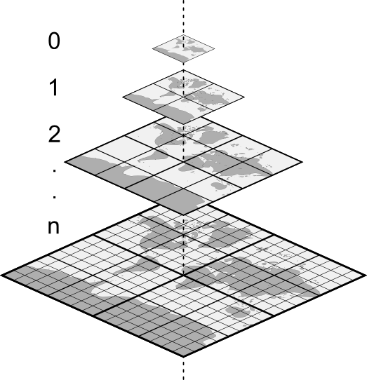
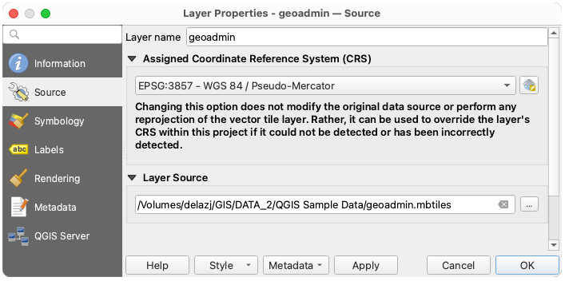
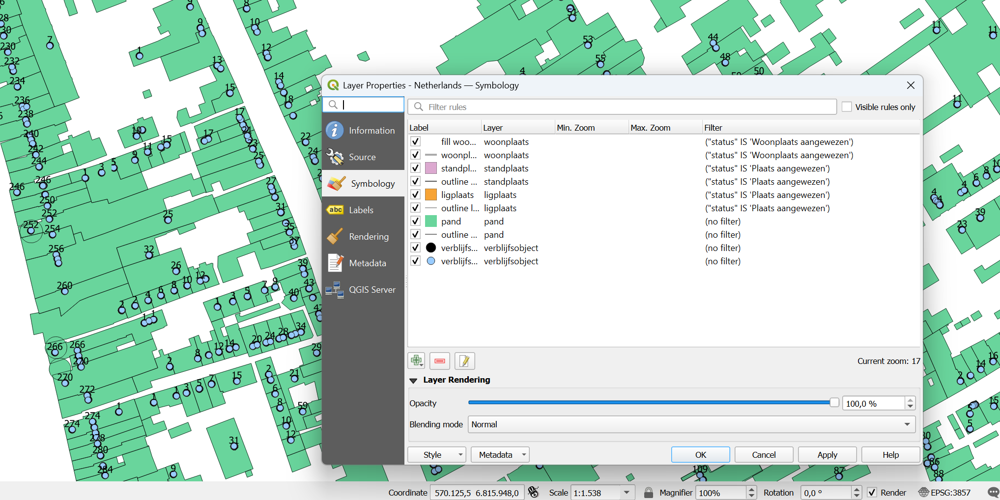
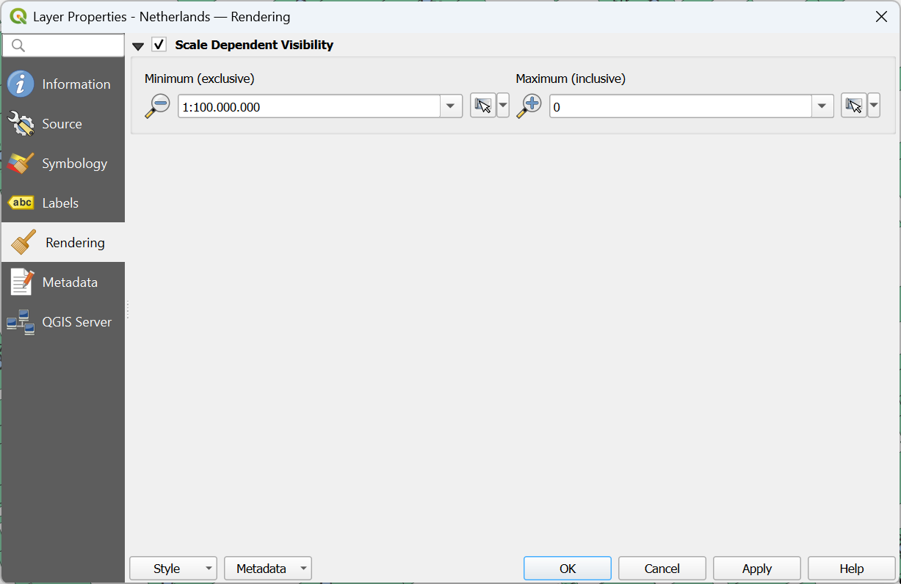

.. index:: Vector Tiles, vector tiles properties
.. _`label_vector_tiles`:

*************************
Working with Vector Tiles
*************************

.. only:: html

   .. contents::
      :local:

What are Vector Tiles?
======================

Vector tiles are packets of geographic data, packaged into pre-defined
roughly-square shaped "tiles" for transfer over the web. They combine
pre-rendered raster map tiles and vector map tiles. 
The vector tile server returns vector map data, which has been clipped
to the boundaries of each tile, instead of a pre-rendered map image.
The clipped tiles represent the zoom-levels of the vector tile service,
derived from a pyramid approach.
Using this structure, the data-transfer is reduced in comparison to
un-tiled vector maps. Only data within the current map view, and at the
current zoom level need to be transferred.
Also, compared to a tiled raster map, data transfer is also greatly reduced,
as vector data is typically much smaller than a rendered bitmap.
Vector tiles do not have any styling information assigned so QGIS needs to
apply a cartographic style in order to display the data. 

.. _figure_vector_tiles_pyramidstructure:

   Pyramid structure of vector tiles with zoom-levels

Supported Formats
=================

There is support for vector tiles through:

* remote sources (HTTP/S) - with XYZ template - ``type=xyz&url=http://example.com/{z}/{x}/{y}.pbf``
* local files - with XYZ template - e.g. ``type=xyz&url=file:///path/to/tiles/{z}/{x}/{y}.pbf``
* local MBTiles database - e.g. ``type=mbtiles&url=file:///path/to/file.mbtiles``

To load a vector tiles dataset into QGIS, use the |addVectorTileLayer| :guilabel:`Vector Tile` tab
in the :guilabel:`Data Source Manager` dialog.
Read :ref:`vector_tiles` for more details.

.. _vectortiles_properties:

Vector Tiles Dataset Properties
===============================

The vector tiles :guilabel:`Layer Properties` dialog provides the following sections:

.. list-table::

   * - |metadata| :ref:`Information <vectortilesinformationmenu>`
     - |system| :ref:`Source <vectortilessourcemenu>`
     - |symbology| :ref:`Symbology <vectortilesstylesmenu>`:sup:`[1]`
   * - |labelingSingle| :ref:`Labels <vectortilesstylesmenu>`:sup:`[1]`
     - |rendering| :ref:`Rendering <vectortilesrenderingmenu>`
     - |editMetadata| :ref:`Metadata <vectortilesmetadatamenu>`

:sup:`[1]` Also available in the :ref:`Layer styling panel <layer_styling_panel>`

.. _vectortilesinformationmenu:

Information Properties
----------------------

The :guilabel:`Information` tab is read-only and represents an interesting
place to quickly grab summarized information and metadata on the current layer.
Provided information are:

* based on the provider of the layer: name, URI, source type and path, number
  of zoom levels
* the Coordinate Reference System: name, units, method, accuracy, reference
  (i.e. whether it's static or dynamic)
* picked from the :ref:`filled metadata <vectortilesmetadatamenu>`: access,
  extents, links, contacts, history...

.. _vectortilessourcemenu:

Source Properties
-----------------

The |system| :guilabel:`Source` tab displays basic information about
the selected vector tile, including:

* the :guilabel:`Layer name` to display in the :guilabel:`Layers Panel`;
* the :guilabel:`Coordinate Reference System`:
  Displays the layer's
  :ref:`Coordinate Reference System (CRS) <layer_crs>`.
  You can change the layer's CRS, by selecting a recently used one in
  the drop-down list or clicking on the |setProjection|
  :sup:`Select CRS` button (see :ref:`crs_selector`).
  Use this process only if the layer CRS is wrong or not specified.

.. _figure_vector_tile_source:

   Vector Tiles Properties - Source Dialog

.. _vectortilesstylesmenu:

Symbology and Labels Properties
-------------------------------

.. _figure_vector_tile_symbology:

   Vector Tile Layer Symbology

Setting rules
.............

As vector tiles consist of point, line and polygon geometries, the respective symbols are available.
To apply a cartographic style (with symbology and/or labels), you can either:

* Use a :guilabel:`Style URL` when creating the :ref:`Vector Tiles Connection <vector_tiles>`.
  The symbology will be shown immediately in the |symbology| :guilabel:`Symbology` tab
  after the layer is loaded in QGIS.
* Or build your own symbology and labeling in the corresponding tabs of the layer properties.
  By default, QGIS assigns an identical symbol to the features based on their geometry type.

In both cases, setting a style for a vector tile relies on a set of :ref:`rules <rule_based_rendering>`
applied to the features, indicating:

* a vector :ref:`symbol <symbol-selector>` or :ref:`label <showlabels>`
* a :guilabel:`Label`, a title for comprehensive identification of the rule
* the name of a particular :guilabel:`Layer` the rule should apply to, if not applied to ``(all layers)``
* a :guilabel:`Min. Zoom` and a :guilabel:`Max. Zoom`, for the range of display.
  Symbology and labeling can be dependent on the zoom level.
* a :guilabel:`Filter`, a QGIS expression to identify the features to apply the style to

Each rule is added pressing the |symbologyAdd| :sup:`Add rule` button
and selecting the type of symbols (:guilabel:`Marker`, :guilabel:`Line`, :guilabel:`Fill`)
corresponding to the features geometry type.
You can as well |symbologyRemove| :sup:`Remove selected rules` or |symbologyEdit| :sup:`Edit current rule`.

At the bottom the :guilabel:`Current Zoom` is shown.
Check the |unchecked| :guilabel:`Visible rules only` option at the top of the dialog
to filter the list of rules to only those that are visible at the current zoom level.
This makes it easier to work with complex vector styling and to locate troublesome rules.
The |search| :guilabel:`Filter rules` text box also helps you easily find a rule,
by searching the :guilabel:`Label`, :guilabel:`Layer` and :guilabel:`Filter` fields.

In :numref:`figure_vector_tile_symbology` we set up style for the OpenStreetMap ``landuse`` layer.
For better visibility most of the rules are deselected.

Layer rendering
...............

From the :guilabel:`Symbology` tab, you can also set some options that invariably act
on all features of the layer:

* :guilabel:`Opacity`: You can make the underlying layer in the map canvas visible with this tool.
  Use the slider to adapt the visibility of your vector layer to your needs.
  You can also make a precise definition of the percentage of visibility in the menu beside the slider.
* :guilabel:`Blending mode`: You can achieve special rendering effects with these tools
  that you may previously only know from graphics programs.
  The pixels of your overlaying and underlaying layers are mixed through the settings
  described in :ref:`blend-modes`.

Styles
......

Available at the bottom of most of the tabs, the :menuselection:`Styles -->` menu provides shortcuts
to save, load, create, switch styles to apply to the vector tiles.
Vector tiles can have their style saved from QGIS as :guilabel:`QML` files
and they can be imported as:

* :guilabel:`QML` files (:ref:`qgisstylefile`)
* :guilabel:`MapBox GL Json` style configuration files

More details at :ref:`save_layer_property`.

.. _vectortilesrenderingmenu:

Rendering Properties
--------------------

Under |unchecked| :guilabel:`Scale dependent visibility`,
you can set the :guilabel:`Maximum (inclusive)`
and :guilabel:`Minimum (exclusive)` scales,
defining a range of scales in which features will be visible.
Out of this range, they are hidden.
The |mapIdentification| :sup:`Set to current canvas scale` button helps you
use the current map canvas scale as boundary of the range visibility.
See :ref:`label_scaledepend` for more information.

.. _figure_vector_tile_rendering:

   Vector Tiles Properties - Rendering Dialog

.. index:: Metadata, Metadata editor, Keyword
.. _vectortilesmetadatamenu:

Metadata Properties
-------------------

The |editMetadata| :guilabel:`Metadata` tab provides you with options
to create and edit a metadata report on your layer.
See :ref:`metadatamenu` for more information.

.. Substitutions definitions - AVOID EDITING PAST THIS LINE
   This will be automatically updated by the find_set_subst.py script.
   If you need to create a new substitution manually,
   please add it also to the substitutions.txt file in the
   source folder.

.. |addVectorTileLayer| image:: /static/common/mActionAddVectorTileLayer.png
   :width: 1.5em
.. |editMetadata| image:: /static/common/editmetadata.png
   :width: 1.2em
.. |labelingSingle| image:: /static/common/labelingSingle.png
   :width: 1.5em
.. |mapIdentification| image:: /static/common/mActionMapIdentification.png
   :width: 1.5em
.. |metadata| image:: /static/common/metadata.png
   :width: 1.5em
.. |rendering| image:: /static/common/rendering.png
   :width: 1.5em
.. |search| image:: /static/common/search.png
   :width: 1.5em
.. |setProjection| image:: /static/common/mActionSetProjection.png
   :width: 1.5em
.. |symbology| image:: /static/common/symbology.png
   :width: 2em
.. |symbologyAdd| image:: /static/common/symbologyAdd.png
   :width: 1.5em
.. |symbologyEdit| image:: /static/common/symbologyEdit.png
   :width: 1.5em
.. |symbologyRemove| image:: /static/common/symbologyRemove.png
   :width: 1.5em
.. |system| image:: /static/common/system.png
   :width: 1.5em
.. |unchecked| image:: /static/common/unchecked.png
   :width: 1.3em
