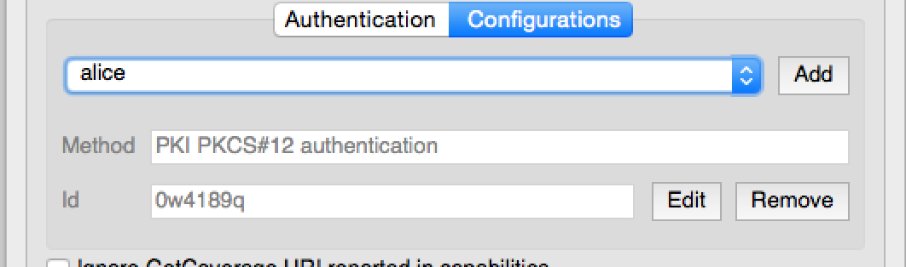
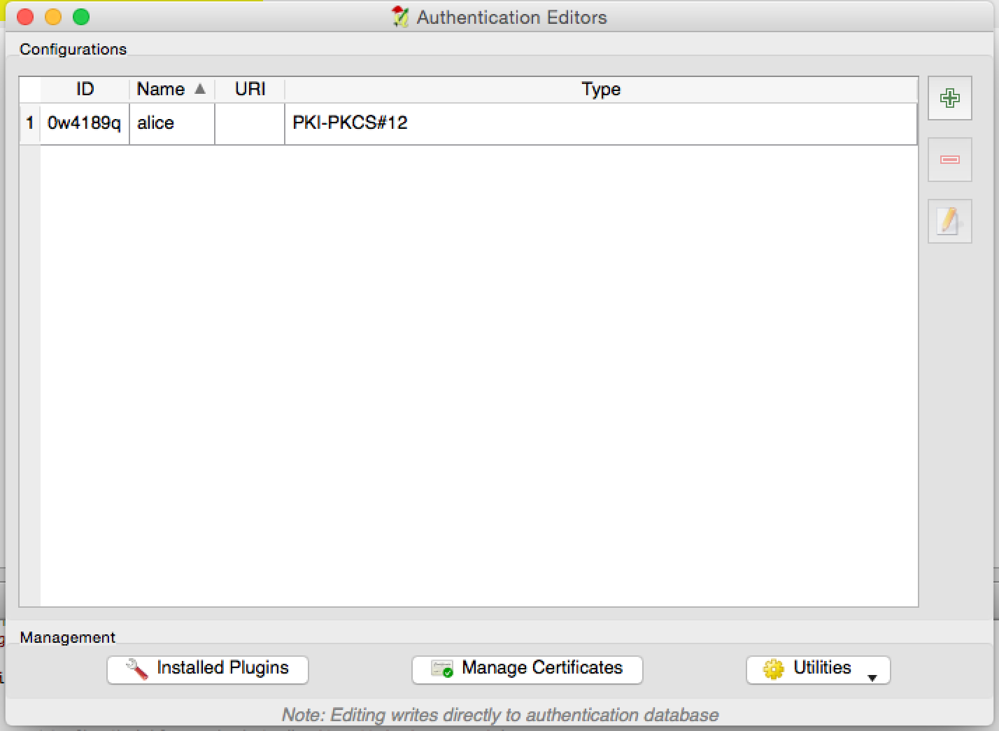
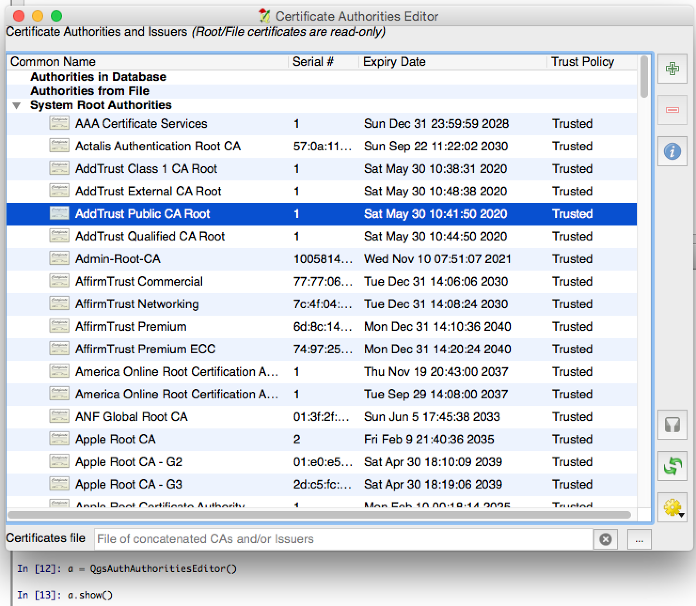

.. only:: html

   |updatedisclaimer|

.. index:: Plugins; Developing, Python; Authentication infrastructure

.. highlight:: python
   :linenothreshold: 5

.. _Authentication_Infrastructure:

*****************************
Authentication infrastructure
*****************************
.. contents::
   :local:

.. warning:: |outofdate|

.. _Authentication_Introduction:

Introduction
============

User reference of the Authentication infrastructure can be read
in the  User Manual in the :ref:`authentication_overview` paragraph.

This chapter describes the best practices to use the Authentication system from
a developer perspective.

Most of the following snippets are derived from the code of Geoserver Explorer
plugin and its tests. This is the first plugin that used Authentication
infrastructure. The plugin code and its tests can be found at this
`link <https://github.com/boundlessgeo/qgis-geoserver-plugin>`_.
Other good code reference can be read from the authentication infrastructure
:source:`tests code <tests/src/python/test_qgsauthsystem.py>`.

.. _Authentication_manager_glossary:

Glossary
========

Here are some definition of the most common objects treated in this chapter.

.. glossary::

  Master Password
    Password to allow access and decrypt credential stored in the QGIS
    Authentication DB

  Authentication Database
    A :term:`Master Password` crypted sqlite db :file:`qgis-auth.db`
    where :term:`Authentication Configuration` are stored. e.g user/password,
    personal certificates and keys, Certificate Authorities

  Authentication DB
    :term:`Authentication Database`

  Authentication Configuration
    A set of authentication data depending on :term:`Authentication Method`.
    e.g Basic authentication method stores the couple of user/password.

  Authentication config
    :term:`Authentication Configuration`

  Authentication Method
    A specific method used to get authenticated. Each method has its own
    protocol used to gain the authenticated level. Each method is implemented
    as shared library loaded dynamically during QGIS authentication
    infrastructure init.

.. _QgsAuthManager_the_entry_point:

QgsAuthManager the entry point
==============================

The :class:`QgsAuthManager <qgis.core.QgsAuthManager>` singleton
is the entry point to use the credentials stored in the QGIS encrypted
:term:`Authentication DB`, i.e. the :file:`qgis-auth.db` file under the
active :ref:`user profile <user_profiles>` folder.

This class takes care of the user interaction: by asking to set master
password or by transparently using it to access crypted stored info.

.. _Init_manager_and_set_master_password:

Init the manager and set the master password
---------------------------------------------

The following snippet gives an example to set master password to open the
access to the authentication settings. Code comments are important to
understand the snippet.

.. code-block:: python

  authMgr = QgsApplication.authManager()
  # check if QgsAuthManager has been already initialized... a side effect
  # of the QgsAuthManager.init() is that AuthDbPath is set.
  # QgsAuthManager.init() is executed during QGIS application init and hence
  # you do not normally need to call it directly.
  if authMgr.authenticationDatabasePath():
      # already initilised => we are inside a QGIS app.
      if authMgr.masterPasswordIsSet():
          msg = 'Authentication master password not recognized'
          assert authMgr.masterPasswordSame( "your master password" ), msg
      else:
          msg = 'Master password could not be set'
          # The verify parameter check if the hash of the password was
          # already saved in the authentication db
          assert authMgr.setMasterPassword( "your master password",
                                            verify=True), msg
  else:
      # outside qgis, e.g. in a testing environment => setup env var before
      # db init
      os.environ['QGIS_AUTH_DB_DIR_PATH'] = "/path/where/located/qgis-auth.db"
      msg = 'Master password could not be set'
      assert authMgr.setMasterPassword("your master password", True), msg
      authMgr.init( "/path/where/located/qgis-auth.db" )

.. _Populate_authdb_with_a_new_Auth_entry:

Populate authdb with a new Authentication Configuration entry
-------------------------------------------------------------

Any stored credential is a :term:`Authentication Configuration` instance of the
:class:`QgsAuthMethodConfig <qgis.core.QgsAuthMethodConfig>`
class accessed using a unique string like the following one::

  authcfg = 'fm1s770'

that string is generated automatically when creating an entry using QGIS API or
GUI.

:class:`QgsAuthMethodConfig <qgis.core.QgsAuthMethodConfig>` is the base class
for any :term:`Authentication Method`.
Any Authentication Method sets a configuration hash map where authentication
informations will be stored. Hereafter an useful snippet to store PKI-path
credentials for an hypothetic alice user:

.. code-block:: python

  authMgr = QgsApplication.authManager()
  # set alice PKI data
  p_config = QgsAuthMethodConfig()
  p_config.setName("alice")
  p_config.setMethod("PKI-Paths")
  p_config.setUri("https://example.com")
  p_config.setConfig("certpath", "path/to/alice-cert.pem" )
  p_config.setConfig("keypath", "path/to/alice-key.pem" )
  # check if method parameters are correctly set
  assert p_config.isValid()

  # register alice data in authdb returning the ``authcfg`` of the stored
  # configuration
  authMgr.storeAuthenticationConfig(p_config)
  newAuthCfgId = p_config.id()
  assert (newAuthCfgId)

.. _Available_Auth_methods:

Available Authentication methods
................................

:term:`Authentication Method`\s are loaded dynamically during authentication
manager init. The list of Authentication method can vary with QGIS evolution,
but the original list of available methods is:

#. ``Basic`` User and password authentication
#. ``Identity-Cert`` Identity certificate authentication
#. ``PKI-Paths`` PKI paths authentication
#. ``PKI-PKCS#12`` PKI PKCS#12 authentication

The above strings are that identify authentication methods in the QGIS
authentication system.
In `Development <https://www.qgis.org/en/site/getinvolved/development/index.html>`_
section is described how to create a new c++ :term:`Authentication Method`\.

.. _Populate_Authorities:

Populate Authorities
....................

.. code-block:: python

    authMgr = QgsApplication.authManager()
    # add authorities
    cacerts = QSslCertificate.fromPath( "/path/to/ca_chains.pem" )
    assert cacerts is not None
    # store CA
    authMgr.storeCertAuthorities(cacerts)
    # and rebuild CA caches
    authMgr.rebuildCaCertsCache()
    authMgr.rebuildTrustedCaCertsCache()

.. warning::

    Due to QT4/OpenSSL interface limitation, updated cached CA are exposed to
    OpenSsl only almost a minute later. Hope this will be solved in QT5
    authentication infrastructure.

.. _Manage_PKI_bundles_with_QgsPkiBundle:

Manage PKI bundles with QgsPkiBundle
....................................

A convenience class to pack PKI bundles composed on SslCert, SslKey and CA
chain is the :class:`QgsPkiBundle <qgis.core.QgsPkiBundle>`
class. Hereafter a snippet to get password protected:

.. code-block:: python

  # add alice cert in case of key with pwd
  boundle = QgsPkiBundle.fromPemPaths( "/path/to/alice-cert.pem",
                                       "/path/to/alice-key_w-pass.pem",
                                       "unlock_pwd",
                                       "list_of_CAs_to_bundle" )
  assert boundle is not None
  assert boundle.isValid()

Refer to :class:`QgsPkiBundle <qgis.core.QgsPkiBundle>` class documentation
to extract cert/key/CAs from the bundle.

.. _Remove_entry_from_authdb:

Remove entry from authdb
------------------------
We can remove an entry from :term:`Authentication Database` using it's
``authcfg`` identifier with the following snippet:

.. code-block:: python

  authMgr = QgsApplication.authManager()
  authMgr.removeAuthenticationConfig( "authCfg_Id_to_remove" )

.. _Leave_AuthCfg_expansion_to_QgsAuthManager:

Leave authcfg expansion to QgsAuthManager
-----------------------------------------

The best way to use an :term:`Authentication Config` stored in the
:term:`Authentication DB` is referring it with the unique identifier
``authcfg``. Expanding, means convert it from an identifier to a complete
set of credentials.
The best practice to use stored :term:`Authentication Config`\s, is to leave it
managed automatically by the Authentication manager.
The common use of a stored configuration is to connect to an authentication
enabled service like a WMS or WFS or to a DB connection.

.. note::

  Take into account that not all QGIS data providers are integrated with the
  Authentication infrastructure. Each authentication method, derived from the
  base class :class:`QgsAuthMethod <qgis.core.QgsAuthMethod>`
  and support a different set of Providers. For example the :meth:`certIdentity ()
  <qgis.core.QgsAuthManager.certIdentity>` method supports the following list
  of providers:

  .. code-block:: python

    In [19]: authM = QgsApplication.authManager()
    In [20]: authM.authMethod("Identity-Cert").supportedDataProviders()
    Out[20]: ['ows', 'wfs', 'wcs', 'wms', 'postgres']

For example, to access a WMS service using stored credentials identified with
``authcfg = 'fm1s770'``, we just have to use the ``authcfg`` in the data source
URL like in the following snippet:

.. code-block:: python

  authCfg = 'fm1s770'
  quri = QgsDataSourceUri()
  quri.setParam("layers", 'usa:states')
  quri.setParam("styles", '')
  quri.setParam("format", 'image/png')
  quri.setParam("crs", 'EPSG:4326')
  quri.setParam("dpiMode", '7')
  quri.setParam("featureCount", '10')
  quri.setParam("authcfg", authCfg)   # <---- here my authCfg url parameter
  quri.setParam("contextualWMSLegend", '0')
  quri.setParam("url", 'https://my_auth_enabled_server_ip/wms')
  rlayer = QgsRasterLayer(str(quri.encodedUri(), "utf-8"), 'states', 'wms')

In the upper case, the ``wms`` provider will take care to expand ``authcfg``
URI parameter with credential just before setting the HTTP connection.

.. warning::

  The developer would have to leave ``authcfg`` expansion to the :class:`QgsAuthManager
  <qgis.core.QgsAuthManager>`, in this way he will be sure that expansion is not done too early.

Usually an URI string, built using the :class:`QgsDataSourceURI <qgis.core.QgsDataSourceUri>`
class, is used to set a data source in the following way:

.. code-block:: python

  rlayer = QgsRasterLayer( quri.uri(False), 'states', 'wms')

.. note::

  The ``False`` parameter is important to avoid URI complete expansion of the
  ``authcfg`` id present in the URI.

.. _PKI_examples_with_other_data_providers:

PKI examples with other data providers
......................................

Other example can be read directly in the QGIS tests upstream as in
:source:`test_authmanager_pki_ows <tests/src/python/test_authmanager_pki_ows.py>` or
:source:`test_authmanager_pki_postgres <tests/src/python/test_authmanager_pki_postgres.py>`.

.. _Adapt_plugins_to_use_Auth_infrastructure:

Adapt plugins to use Authentication infrastructure
==================================================

Many third party plugins are using httplib2 to create HTTP connections instead
of integrating with :class:`QgsNetworkAccessManager <qgis.core.QgsNetworkAccessManager>`
and its related Authentication Infrastructure integration.
To facilitate this integration an helper python function has been created
called ``NetworkAccessManager``. Its code can be found `here
<https://github.com/boundlessgeo/qgis-geoserver-plugin/blob/master/geoserverexplorer/geoserver/networkaccessmanager.py#L78>`_.

This helper class can be used as in the following snippet:

.. code-block:: python

  http = NetworkAccessManager(authid="my_authCfg", exception_class=My_FailedRequestError)
  try:
    response, content = http.request( "my_rest_url" )
  except My_FailedRequestError, e:
    # Handle exception
    pass

.. _Authentication_GUIs:

Authentication GUIs
===================

In this paragraph are listed the available GUIs useful to integrate
authentication infrastructure in custom interfaces.

.. _GUI_to_select_credentials:

GUI to select credentials
-------------------------

If it's necessary to select a :term:`Authentication Configuration` from the set
stored in the :term:`Authentication DB` it is available in the GUI class
`QgsAuthConfigSelect <qgis.gui.QgsAuthConfigSelect>`.

and can be used as in the following snippet:

.. code-block:: python

  # create the instance of the QgsAuthConfigSelect GUI hierarchically linked to
  # the widget referred with `parent`
  gui = QgsAuthConfigSelect( parent, "postgres" )
  # add the above created gui in a new tab of the interface where the
  # GUI has to be integrated
  tabGui.insertTab( 1, gui, "Configurations" )

The above example is taken from the QGIS source :source:`code
<src/providers/postgres/qgspgnewconnection.cpp#L42>`
The second parameter of the GUI constructor refers to data provider type. The
parameter is used to restrict the compatible :term:`Authentication Method`\s with
the specified provider.

.. _Authentication_Editor_GUI:

Authentication Editor GUI
-------------------------

The complete GUI used to manage credentials, authorities and to access to
Authentication utilities is managed by the
:class:`QgsAuthEditorWidgets <qgis.gui.QgsAuthEditorWidgets>` class.

and can be used as in the following snippet:

.. code-block:: python

 # create the instance of the QgsAuthEditorWidgets GUI hierarchically linked to
 # the widget referred with `parent`
 gui = QgsAuthConfigSelect( parent )
 gui.show()

an integrated example can be found in the related :source:`test
<tests/src/python/test_qgsauthsystem.py#L80>`.

.. _Authorities_Editor_GUI:

Authorities Editor GUI
----------------------

A GUI used to manage only authorities is managed by the
`QgsAuthAuthoritiesEditor <qgis.gui.QgsAuthAuthoritiesEditor>` class.

and can be used as in the following snippet:

.. code-block:: python

 # create the instance of the QgsAuthAuthoritiesEditor GUI hierarchically
 #  linked to the widget referred with `parent`
 gui = QgsAuthAuthoritiesEditor( parent )
 gui.show()   

.. Substitutions definitions - AVOID EDITING PAST THIS LINE
   This will be automatically updated by the find_set_subst.py script.
   If you need to create a new substitution manually,
   please add it also to the substitutions.txt file in the
   source folder.

.. |outofdate| replace:: `Despite our constant efforts, information beyond this line may not be updated for QGIS 3. Refer to https://qgis.org/pyqgis/master for the python API documentation or, give a hand to update the chapters you know about. Thanks.`
.. |updatedisclaimer| replace:: :disclaimer:`Docs in progress for 'QGIS testing'. Visit https://docs.qgis.org/3.4 for QGIS 3.4 docs and translations.`
