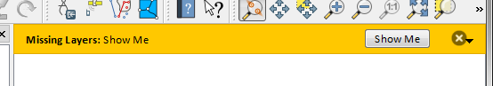

.. only:: html

.. index:: Plugins; User interaction

***************************
Communicating with the user
***************************

.. contents::
   :local:

This section shows some methods and elements that should be used to communicate
with the user, in order to keep consistency in the User Interface.

Showing messages. The QgsMessageBar class
=========================================

Using message boxes can be a bad idea from a user experience point of view. For
showing a small info line or a warning/error messages, the QGIS message bar is
usually a better option.

Using the reference to the QGIS interface object, you can show a message in the
message bar with the following code

.. code-block:: python

  from qgis.core import Qgis
  iface.messageBar().pushMessage("Error", "I'm sorry Dave, I'm afraid I can't do that", level=Qgis.Critical)

   QGIS Message bar

You can set a duration to show it for a limited time

.. code-block:: python

    iface.messageBar().pushMessage("Ooops", "The plugin is not working as it should", level=Qgis.Critical, duration=3)

.. figure:: img/errorbar-timed.png
   :align: center
   :width: 40em

   QGIS Message bar with timer

The examples above show an error bar, but the ``level`` parameter can be used
to creating warning messages or info messages, using the
:class:`Qgis.MessageLevel <qgis.core.Qgis.MessageLevel>` enumeration. You can use up to 4 different levels:

0. Info
1. Warning
2. Critical
3. Success

.. figure:: img/infobar.png
   :align: center
   :width: 40em

   QGIS Message bar (info)

Widgets can be added to the message bar, like for instance a button to show
more info

.. code-block:: python

    def showError():
        pass

    widget = iface.messageBar().createMessage("Missing Layers", "Show Me")
    button = QPushButton(widget)
    button.setText("Show Me")
    button.pressed.connect(showError)
    widget.layout().addWidget(button)
    iface.messageBar().pushWidget(widget, Qgis.Warning)

   QGIS Message bar with a button

You can even use a message bar in your own dialog so you don't have to show a
message box, or if it doesn't make sense to show it in the main QGIS window

.. code-block:: python

    class MyDialog(QDialog):
        def __init__(self):
            QDialog.__init__(self)
            self.bar = QgsMessageBar()
            self.bar.setSizePolicy( QSizePolicy.Minimum, QSizePolicy.Fixed )
            self.setLayout(QGridLayout())
            self.layout().setContentsMargins(0, 0, 0, 0)
            self.buttonbox = QDialogButtonBox(QDialogButtonBox.Ok)
            self.buttonbox.accepted.connect(self.run)
            self.layout().addWidget(self.buttonbox, 0, 0, 2, 1)
            self.layout().addWidget(self.bar, 0, 0, 1, 1)
        def run(self):
            self.bar.pushMessage("Hello", "World", level=Qgis.Info)

    myDlg = MyDialog()
    myDlg.show()

.. figure:: img/dialog-with-bar.png
   :align: center
   :width: 40em

   QGIS Message bar in custom dialog

Showing progress
================

Progress bars can also be put in the QGIS message bar, since, as we have seen,
it accepts widgets. Here is an example that you can try in the console.

.. code-block:: python

    import time
    from qgis.PyQt.QtWidgets import QProgressBar
    from qgis.PyQt.QtCore import *
    progressMessageBar = iface.messageBar().createMessage("Doing something boring...")
    progress = QProgressBar()
    progress.setMaximum(10)
    progress.setAlignment(Qt.AlignLeft|Qt.AlignVCenter)
    progressMessageBar.layout().addWidget(progress)
    iface.messageBar().pushWidget(progressMessageBar, Qgis.Info)

    for i in range(10):
        time.sleep(1)
        progress.setValue(i + 1)

    iface.messageBar().clearWidgets()

Also, you can use the built-in status bar to report progress, as in the next
example:

.. code-block:: python

 vlayer = QgsProject.instance().mapLayersByName("countries")[0]

 count = vlayer.featureCount()
 features = vlayer.getFeatures()

 for i, feature in enumerate(features):
     # do something time-consuming here
     print('') # printing should give enough time to present the progress

     percent = i / float(count) * 100
     # iface.mainWindow().statusBar().showMessage("Processed {} %".format(int(percent)))
     iface.statusBarIface().showMessage("Processed {} %".format(int(percent)))

 iface.statusBarIface().clearMessage()

Logging
=======

You can use the QGIS logging system to log all the information that you want to
save about the execution of your code.

.. code-block:: python

 # You can optionally pass a 'tag' and a 'level' parameters
 QgsMessageLog.logMessage("Your plugin code has been executed correctly", 'MyPlugin', level=Qgis.Info)
 QgsMessageLog.logMessage("Your plugin code might have some problems", level=Qgis.Warning)
 QgsMessageLog.logMessage("Your plugin code has crashed!", level=Qgis.Critical)

.. warning::

 Use of the Python ``print`` statement is unsafe to do in any code which may be
 multithreaded. This includes **expression functions**, **renderers**,
 **symbol layers** and **Processing algorithms** (amongst others). In these
 cases you should always use thread safe classes (:class:`QgsLogger <qgis.core.QgsLogger>`
 or :class:`QgsMessageLog <qgis.core.QgsMessageLog>`) instead.

.. note::

   You can see the output of the :class:`QgsMessageLog <qgis.core.QgsMessageLog>`
   in the :ref:`log_message_panel`

.. note::

 * :class:`QgsLogger <qgis.core.QgsLogger>` is for messages for debugging / developers (i.e. you suspect they are triggered by some broken code)
 * :class:`QgsMessageLog <qgis.core.QgsMessageLog>` is for messages to investigate issues by sysadmins (e.g. to help a sysadmin to fix configurations)

.. Substitutions definitions - AVOID EDITING PAST THIS LINE
   This will be automatically updated by the find_set_subst.py script.
   If you need to create a new substitution manually,
   please add it also to the substitutions.txt file in the
   source folder.

.. |outofdate| replace:: `Despite our constant efforts, information beyond this line may not be updated for QGIS 3. Refer to https://qgis.org/pyqgis/master for the python API documentation or, give a hand to update the chapters you know about. Thanks.`
