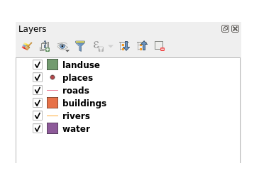
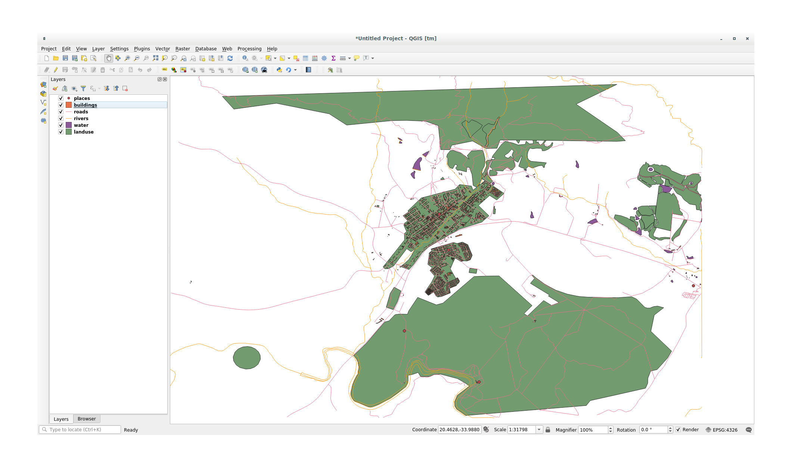

.. only:: html

   |updatedisclaimer|

.. _tm_working_vector_data:

|LS| Working with Vector Data
===============================================================================

Vector data is arguably the most common kind of data you will find in the daily
use of GIS. It describes geographic data in terms of points, that may be
connected into lines and polygons. Every object in a vector dataset is called a
**feature**, and is associated with data that describes that feature.

**The goal for this lesson:** To learn about the structure of vector data, and
how to load vector datasets into a map.

|basic| |FA| Viewing Layer Attributes
-------------------------------------------------------------------------------

It's important to know that the data you will be working with does not only
represent **where** objects are in space, but also tells you **what** those
objects are.

From the previous exercise, you should have the :guilabel:`roads` layer
loaded in your map. What you can see right now is merely the position of the
roads.

To see all the data available to you, with the :guilabel:`roads` layer
selected in the Layers panel, click on this button: |openTable|

It will show you a table with more data about the :guilabel:`roads` layer.
This extra data is called *attribute data*. The lines that you can see on your
map represent where the roads go; this is the *spatial data*.

These definitions are commonly used in GIS, so it's essential to remember them!

You may now close the attribute table.

Vector data represents features in terms of points, lines and polygons on a
coordinate plane. It is usually used to store discrete features, like roads and
city blocks.

.. _load_geopackage:

|basic| |FA| Loading Vector Data From GeoPackage Database
-------------------------------------------------------------------------------

Databases allow you to store a large volume of associated data in one file. You
may already be familiar with a database management system (DBMS) such as
Libreoffice Base or MS Access. GIS applications can also make use of databases.
GIS-specific DBMSes (such as PostGIS) have extra functions, because they need to
handle spatial data.

The `GeoPackage <https://www.geopackage.org/>`_ open format is a database container that
allows you to store GIS data (layers) in a single file. Unlike the ESRI
Shapefile format (e.g. the :file:`roads.shp` file you previously load that
contains only roads vector data), a single GeoPackage file can contain various
data, vector and raster types, in different coordinate reference systems,
as well as tables without spatial information; all these features allow you to
easily share data and avoid file duplication in your computer.

In order to load a layer from GeoPackage, you will first need to create the
connection to the database:

#. Click on the |dataSourceManager| :sup:`Open Data Source Manager` button.
#. On the left click on the |newGeoPackageLayer| :guilabel:`GeoPackage` tab.
#. Click on the :guilabel:`New` button and browse to the :file:`training_data.gpkg`
   file in the :file:`exercise_data` folder you have downloaded before.
#. Select the file and press :guilabel:`Open`. The file path is now added to the
   Geopackage connections list, and shown in the drop-down menu.

From now, you can add any layer from this GeoPackage file to QGIS.

#. Click on :guilabel:`Connect` button.
   You should see in the central part of the window the list of all the layers
   contained in the GeoPackage file.
#. Select the :guilabel:`roads` layer and click on the :guilabel:`Add` button.

   .. image:: img/add_data_dialog_geopackage.png
      :align: center

   A :guilabel:`roads` layer is added to the :guilabel:`Layers` panel with
   features displayed in the map canvas.
#. Click on :guilabel:`Close`.

Congratulations! You have loaded the first layer from a GeoPackage file.

.. _backlink-vector-load-from-database-1:

|basic| |FA| Loading Vector Data From a SpatiaLite Database with the Browser
-------------------------------------------------------------------------------

QGIS provides access to many other database formats. Like GeoPackage, the
SpatiaLite database format is an extension of the SQLite library. And adding
the first time a layer from SpatiaLite provider follows the same rules as seen
above: Create the connection --> Enable it --> Add the layer(s).

We could apply these steps and add SpatiaLite data from our sample
data but let's explore another powerful feature of data loading in QGIS:
the :guilabel:`Browser`.

#. Click the icon |dataSourceManager| to open the :guilabel:`Data Source Manager`
   window.
#. Click on the |fileOpen| :guilabel:`Browser` tab.
#. In this tab you can see all the storage disks connected to your computer
   as well as entries for most of the tabs in the left. These allow quick access
   to connected databases or folders.

   For example, click on the drop-down icon next to the |geoPackage|
   :guilabel:`GeoPackage` entry. You'll see the :file:`training-data.gpkg` file
   we previously connected, and its layers if expanded.
#. Right-click the |spatialite| :guilabel:`SpatiaLite` entry and select
   :guilabel:`New Connection...`.
#. Navigate to the :file:`exercise_data` folder, select the :file:`landuse.sqlite`
   file and click :guilabel:`Open`.

   Notice that a |dbSchema| :guilabel:`landuse.sqlite` collapsible entry has
   been added under the :guilabel:`SpatiaLite` one.
#. Expand the |dbSchema| :guilabel:`landuse.sqlite` entry.
#. Double-click the |polygonLayer| :guilabel:`landuse` layer or select and
   drag-and-drop it over the map canvas. A new layer is added to the
   :guilabel:`Layers` panel and its features are displayed in the map canvas.

   .. image:: img/spatialite_dialog_connected.png
      :align: center

   |

.. tip:: Enable the :guilabel:`Browser` panel in :menuselection:`View --> Panels -->`
  and use it to add your data. It's a handy shortcut for the :guilabel:`Data Source
  Manager --> Browser` tab, with the same functionalities.

.. note:: Remember to save the map often! The map file doesn't contain any of
   the data directly, but it remembers which layers you loaded into your map.

|FA| Reordering the Layers
-------------------------------------------------------------------------------

The layers in your Layers list are drawn on the map in a certain order. The
layer at the bottom of the list is drawn first, and the layer at the top is
drawn last. By changing the order that they are shown on the list, you can
change the order they are drawn in.

.. note:: You can alter this behavior using the :guilabel:`Control rendering
   order` checkbox beneath the :guilabel:`Layer Order` panel. We will
   however not discuss this feature yet.

The order in which the layers have been loaded into the map is probably not
logical at this stage. It's possible that the road layer is completely hidden
because other layers are on top of it.

For example, this layer order...

... would result in roads and places being hidden as they run *underneath*
urban areas.

To resolve this problem:

#. Click and drag on a layer in the Layers list.
#. Reorder them to look like this:

You'll see that the map now makes more sense visually, with roads and buildings
appearing above the land use regions.

|IC|
-------------------------------------------------------------------------------

Now you've added all the layers you need from several different sources.

|WN|
-------------------------------------------------------------------------------

Using the random palette automatically assigned when loading the layers, your
current map is probably not easy to read. It would be preferable to assign your
own choice of colors and symbols. This is what you'll learn to do in the next
lesson.

.. Substitutions definitions - AVOID EDITING PAST THIS LINE
   This will be automatically updated by the find_set_subst.py script.
   If you need to create a new substitution manually,
   please add it also to the substitutions.txt file in the
   source folder.

.. |FA| replace:: Follow Along:
.. |IC| replace:: In Conclusion
.. |LS| replace:: Lesson:
.. |WN| replace:: What's Next?
.. |addSpatiaLiteLayer| image:: /static/common/mActionAddSpatiaLiteLayer.png
   :width: 1.5em
.. |basic| image:: /static/global/basic.png
.. |dataSourceManager| image:: /static/common/mActionDataSourceManager.png
   :width: 1.5em
.. |dbSchema| image:: /static/common/mIconDbSchema.png
   :width: 1.5em
.. |fileOpen| image:: /static/common/mActionFileOpen.png
   :width: 1.5em
.. |geoPackage| image:: /static/common/mGeoPackage.png
   :width: 1.5em
.. |moderate| image:: /static/global/moderate.png
.. |newGeoPackageLayer| image:: /static/common/mActionNewGeoPackageLayer.png
   :width: 1.5em
.. |openTable| image:: /static/common/mActionOpenTable.png
   :width: 1.5em
.. |polygonLayer| image:: /static/common/mIconPolygonLayer.png
   :width: 1.5em
.. |spatialite| image:: /static/common/mIconSpatialite.png
   :width: 1.5em
.. |updatedisclaimer| replace:: :disclaimer:`Docs in progress for 'QGIS testing'. Visit https://docs.qgis.org/2.18 for QGIS 2.18 docs and translations.`
