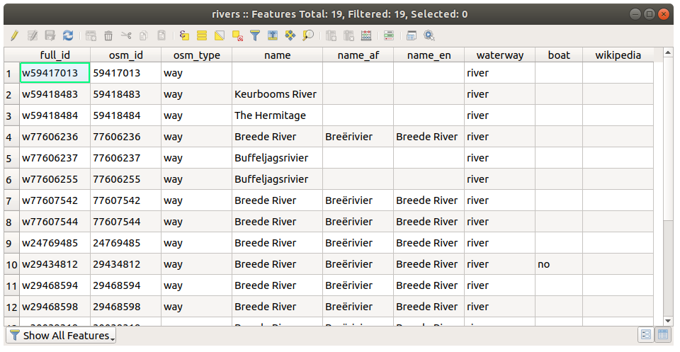

.. only:: html

   |updatedisclaimer|

.. _tm_working_vector_data:

|LS| Working with Vector Data
===============================================================================

Vector data is arguably the most common kind of data you will find in the daily
use of GIS. The vector model represents the location and shape of geographic
features using points, lines and polygons (and for 3D data also surfaces and
volumes), while their other properties are included as attributes (often presented
as a table in QGIS).
It is usually used to store discrete features, like roads and
city blocks. The objects in a vector dataset are called **features**,
and contain data that describe their location and properties.

**The goal for this lesson:** To learn about the structure of vector data, and
how to load vector datasets into a map.

|basic| |FA| Viewing Layer Attributes
-------------------------------------------------------------------------------

It's important to know that the data you will be working with does not only
represent **where** objects are in space, but also tells you **what** those
objects are.

From the previous exercise, you should have the :guilabel:`rivers` layer
loaded in your map. The lines that you can see right now are merely the
position of the rivers: this is the *spatial data*.

To see all the available data in the :guilabel:`rivers` layer,
select it in the Layers panel and click the |openTable| button.

It will show you a table with more data about the :guilabel:`rivers` layer.
This is the layer's :guilabel:`Attribute table`. A row is called
a *record*, and represents a river *feature*. A column is called a *field*,
and represents a property of the river. Cells show *attributes*.

|

These definitions are commonly used in GIS, so it's essential to remember them!

You may now close the attribute table.

.. _backlink-vector-explore-attribute-data:

|basic| |TY| Exploring Vector Data Attributes
-------------------------------------------------------------------------------

#. How many fields are available in the :guilabel:`rivers` layer?
#. Tell us a bit about the ``town`` places in your dataset.

:ref:`Check your results <vector-explore-attribute-data>`

.. _backlink-vector-load-geopackage-1:

|basic| |FA| Loading Vector Data From GeoPackage
-------------------------------------------------------------------------------

The `GeoPackage <https://www.geopackage.org/>`_ is a database container that allows
you to store GIS data (layers) in a single file. A single GeoPackage file can
contain both vector and raster data also in different coordinate reference systems:
all these features allow you to easily share data and to avoid file duplication
in your computer.

Refer back to the introductory exercise in the previous section for
instructions on how to add vector layers.

Load the data sets from the :file:`training_data.gpkg` file into your map following
the same method:

* :guilabel:`buildings`
* :guilabel:`places`
* :guilabel:`rivers`
* :guilabel:`water`

:ref:`Check your results <vector-load-geopackage-1>`

.. _backlink-vector-load-from-database-1:

|basic| |FA| Loading Vector Data From a Database
-------------------------------------------------------------------------------

Databases allow you to store a large volume of associated data in one file. You
may already be familiar with a database management system (DBMS) such as
Libreoffice Base or MS Access. GIS applications can also make use of databases.
GIS-specific DBMSes (such as PostGIS) have extra functions, because they need to
handle spatial data.

Adding a layer from a SpatiaLite database or from a GeoPackage archive is not
so different: in fact, both are spatial extension of the SQLite library.

Let's add some layer from a SpatiaLite database.

#. Click the icon |dataSourceManager| to open the Data Source Manager window
   (If you're sure you can't see it at all, check that the :guilabel:`Data
   Source Manager` toolbar is enabled.)
#. Click on the |addSpatiaLiteLayer| :guilabel:`SpatiaLite` tab.
#. In this tab you can see all the connections to existing databases or set up
   new connections.
#. Click the :guilabel:`New` button.
#. In the main folder of the Training Data, you should find the file
   :file:`landuse.sqlite`. Select it and click :guilabel:`Open`.

   Notice that the drop-down above the three buttons now reads "landuse.sqlite@...",
   followed by the path of the database file on your computer.

#. Click the :guilabel:`Connect` button. You should see this in the previously
   empty box:

   .. image:: img/spatiallite_dialog_connected.png
      :align: center

#. Click on the :guilabel:`landuse` layer to select it, then click
   :menuselection:`Add`

.. tip:: Once you have set up a connection to a database you can see this connection
  and load all the layers contained into it also in the QGIS Browser. We will
  repeat this forever: the QGIS Browser is the quickest and best way to handle
  your data!

.. note::  Remember to save the map often! The map file doesn't contain any of
   the data directly, but it remembers which layers you loaded into your map.

|FA| Reordering the Layers
-------------------------------------------------------------------------------

The layers in your Layers list are drawn on the map in a certain order. The
layer at the bottom of the list is drawn first, and the layer at the top is
drawn last. By changing the order that they are shown on the list, you can
change the order they are drawn in.

.. note:: You can alter this behavior using the :guilabel:`Control rendering
   order` checkbox beneath the :guilabel:`Layer Order` panel. We will
   however not discuss this feature yet.

The order in which the layers have been loaded into the map is probably not
logical at this stage. It's possible that the road layer is completely hidden
because other layers are on top of it.

For example, this layer order...

.. image:: img/incorrect_layer_order.png
   :align: center

... would result in roads and places being hidden as they run *underneath*
urban areas.

To resolve this problem:

#. Click and drag on a layer in the Layers list.
#. Reorder them to look like this:

.. image:: img/correct_layer_order.png
   :align: center

You'll see that the map now makes more sense visually, with roads and buildings
appearing above the land use regions.

|IC|
-------------------------------------------------------------------------------

Now you've added all the layers you need from several different sources.

|WN|
-------------------------------------------------------------------------------

Using the random palette automatically assigned when loading the layers, your
current map is probably not easy to read. It would be preferable to assign your
own choice of colors and symbols. This is what you'll learn to do in the next
lesson.

.. Substitutions definitions - AVOID EDITING PAST THIS LINE
   This will be automatically updated by the find_set_subst.py script.
   If you need to create a new substitution manually,
   please add it also to the substitutions.txt file in the
   source folder.

.. |FA| replace:: Follow Along:
.. |IC| replace:: In Conclusion
.. |LS| replace:: Lesson:
.. |TY| replace:: Try Yourself
.. |WN| replace:: What's Next?
.. |addSpatiaLiteLayer| image:: /static/common/mActionAddSpatiaLiteLayer.png
   :width: 1.5em
.. |basic| image:: /static/global/basic.png
.. |dataSourceManager| image:: /static/common/mActionDataSourceManager.png
   :width: 1.5em
.. |openTable| image:: /static/common/mActionOpenTable.png
   :width: 1.5em
.. |updatedisclaimer| replace:: :disclaimer:`Docs in progress for 'QGIS testing'. Visit https://docs.qgis.org/2.18 for QGIS 2.18 docs and translations.`
