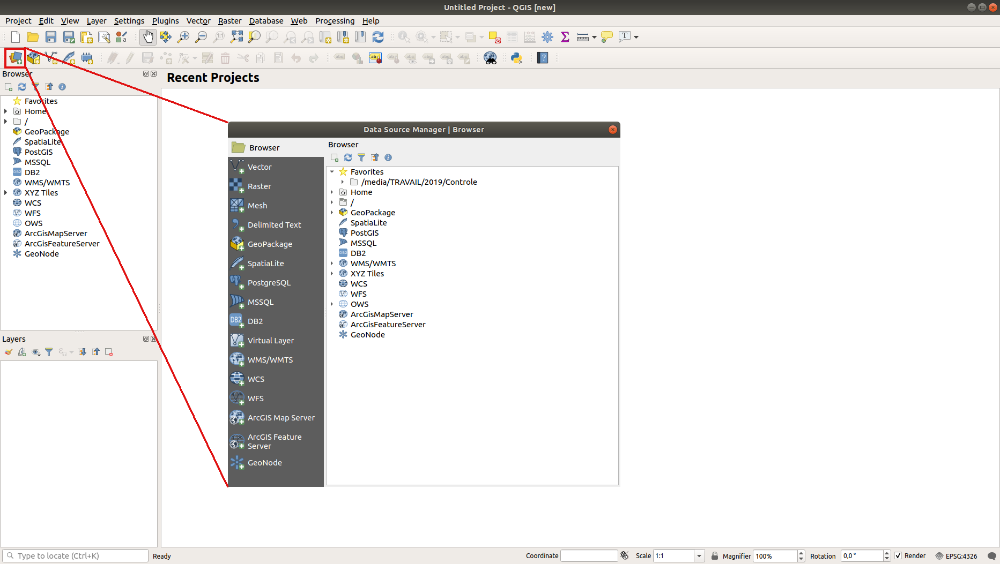

.. only:: html

   |updatedisclaimer|

|LS| Adding your first layer
===============================================================================

We will start the application, and create a basic map to use for examples and
exercises.

**The goal for this lesson:** To get started with an example map.

.. note::  Before starting this exercise, QGIS must be installed on your
   computer. Also, download the ``training_manual_exercise_data.zip`` file
   from the `QGIS data downloads area <https://github.com/qgis/QGIS-Training-Data/archive/QGIS-Training-Data-v1.0.zip>`_.

Launch QGIS from its desktop shortcut, menu item, etc., depending on how you
configured its installation.

.. note::  The screenshots for this course were taken in QGIS 3.4 running on
   Linux. Depending on your setup, the screens you encounter may well appear
   somewhat different. However, all the same buttons will still be available,
   and the instructions will work on any OS. You will need QGIS 3.4 (the latest
   version at time of writing) to use this course.

Let's get started right away!

.. _backlink-interface-preparation-1:

|basic| |FA| Prepare a map
-------------------------------------------------------------------------------

* Open QGIS. You will have a new, blank map.

* Look for the :guilabel:`Open Data Source Manager` button: |dataSourceManager|

* The dialog allows you to choose the data to load depending on the data type:
  each tab on the left part of the dialog lists the available data types.
  You can also can browse the files directly from the folder of your computer
  with the *Browser* tab (see :ref:`browser_panel_tm` section):

* Click on the :guilabel:`Vector` tab and on the **[Browse]** button and
  navigate to the file :file:`exercise_data/shapefile/roads.shp` (in your course
  directory). With this file selected, click :guilabel:`Open`. You will see the
  original dialog, but with the file path filled in. Click  **[Add]** here
  as well. The data you specified will now load.

.. image:: img/add_vector_dialog.png
  :align: center

Congratulations! You now have a basic map. Now would be a good time to save
your work.

* Click on the :guilabel:`Save As` button: |fileSaveAs|

* Save the map under :kbd:`exercise_data/` and call it :kbd:`basic_map.qgs`.

:ref:`Check your results <interface-preparation-1>`

.. _load_geopackage:

|moderate| |FA| Load a layer from GeoPackage
-------------------------------------------------------------------------------

`GeoPackage <http://www.geopackage.org/>`_ is an open format for storing
geospatial data. QGIS adds a lot of support to this new format that is slowly
replacing the ESRI shapefile format.

GeoPackage is a single file format that can contain different types of data: vector
and raster files but also tables without spatial information in them (like CSV
file).

Within the `Training data <https://github.com/qgis/QGIS-Training-Data/archive/QGIS-Training-Data-v1.0.zip>`_
archive you will find the :file:`training_data.gpkg` file. We will now see how
to load layers from a GeoPackage file.

In order to load a layer from a GeoPackage:

#. click on the |dataSourceManager| button
#. on the left click on the |newGeoPackageLayer| :guilabel:`GeoPackage` tab
#. click on the  **[New]** button and look for the :file:`training_data.gpkg` file in
   the Training Data folder you have downloaded before
#. choose the layer to load and click on  **[Connect]** button
#. you should see in the central part of the window the list of all the layers
   contained in the GeoPackage
#. select the layer you want to load and click on  the  **[Add]** button

.. image:: img/add_data_dialog_geopackage.png
  :align: center

Congratulations! You have loaded the first layer from a GeoPackage file.

|IC|
-------------------------------------------------------------------------------

You've learned how to add a layer and create a basic map!

|WN|
-------------------------------------------------------------------------------

Now you're familiar with the function of the :guilabel:`Open Data Source Manager`
button, but what about all the others? How does this interface work? Before we
go on with the more involved stuff, let's first take a good look at the general
layout of the QGIS interface. This is the topic of the next lesson.

.. Substitutions definitions - AVOID EDITING PAST THIS LINE
   This will be automatically updated by the find_set_subst.py script.
   If you need to create a new substitution manually,
   please add it also to the substitutions.txt file in the
   source folder.

.. |FA| replace:: Follow Along:
.. |IC| replace:: In Conclusion
.. |LS| replace:: Lesson:
.. |WN| replace:: What's Next?
.. |basic| image:: /static/global/basic.png
.. |dataSourceManager| image:: /static/common/mActionDataSourceManager.png
   :width: 1.5em
.. |fileSaveAs| image:: /static/common/mActionFileSaveAs.png
   :width: 1.5em
.. |moderate| image:: /static/global/moderate.png
.. |newGeoPackageLayer| image:: /static/common/mActionNewGeoPackageLayer.png
   :width: 1.5em
.. |updatedisclaimer| replace:: :disclaimer:`Docs in progress for 'QGIS testing'. Visit http://docs.qgis.org/2.18 for QGIS 2.18 docs and translations.`
