.. only:: html

   |updatedisclaimer|

|LS| Using Print Layout
===============================================================================

Now that you've got a map, you need to be able to print it or to export it to a
document. The reason is, a GIS map file is not an image. Rather, it saves the
state of the GIS program, with references to all the layers, their labels,
colors, etc. So for someone who doesn't have the data or the same GIS program
(such as QGIS), the map file will be useless. Luckily, QGIS can export its map
file to a format that anyone's computer can read, as well as printing out the
map if you have a printer connected. Both exporting and printing is handled via
the print layout.

**The goal for this lesson:** To use the QGIS print layout to create a basic
map with all the required settings.

|basic| |FA| The Layout Manager
-------------------------------------------------------------------------------

QGIS allows you to create multiple maps using the same map file. For this
reason, it has a tool called the :guilabel:`Layout Manager`.

* Click on the :menuselection:`Project --> Layout Manager` menu entry to open
  this tool.  You'll see a blank :guilabel:`Layout manager` dialog appear.
* Click the :guilabel:`Add` button and give the new layout the name of
  |majorUrbanName|.
* Click :guilabel:`OK`.
* Click the :guilabel:`Show` button.

(You could also close the dialog and navigate to a layout via the
:menuselection:`Project --> Layouts -->` menu, as in the image below.)

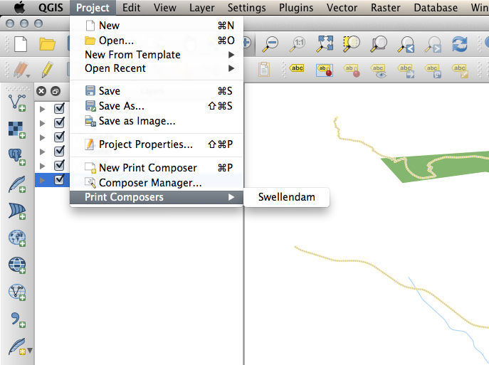

Whichever route you take to get there, you will now see the :guilabel:`Print
Layout` window:

|basic| |FA| Basic Map Composition
-------------------------------------------------------------------------------

In this example, the composition was already the way we wanted it. Ensure that
yours is as well.

* In the :guilabel:`Print Layout` window, check that the values under
  :menuselection:`Composition --> Paper and Quality` are set to the following:

- :guilabel:`Size`: :kbd:`A4 (210x297mm)`
- :guilabel:`Orientation`: :kbd:`Landscape`
- :guilabel:`Quality`: :kbd:`300dpi`

Now you've got the page layout the way you wanted it, but this page is still
blank. It clearly lacks a map. Let's fix that!

* Click on the :guilabel:`Add New Map` button: |addMap|

With this tool activated, you'll be able to place a map on the page.

* Click and drag a box on the blank page:

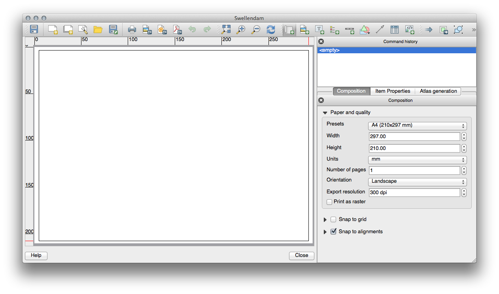

The map will appear on the page.

* Move the map by clicking and dragging it around:

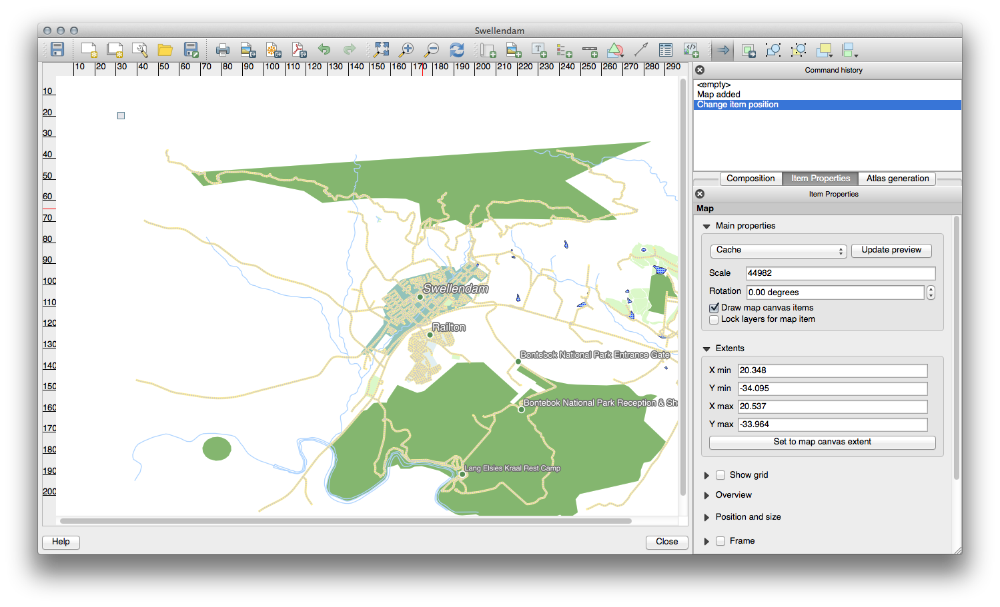

* Resize it by clicking and dragging the boxes in the corners:

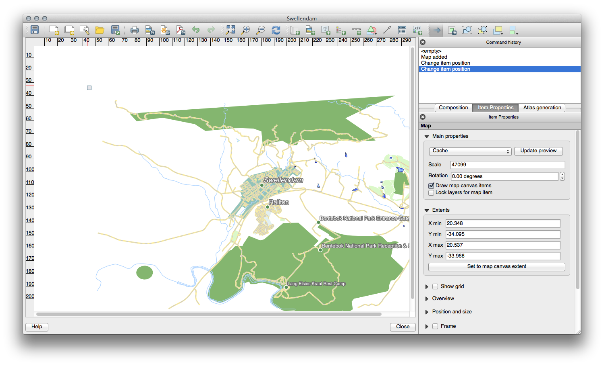

.. note::  Your map may look a lot different, of course! This depends on how
   your own project is set up. But not to worry! These instructions are
   general, so they will work the same regardless of what the map itself looks
   like.

* Be sure to leave margins along the edges, and a space along the top for the
  title.

* Zoom in and out on the page (but not the map!) by using these buttons:

  |zoomFullExtent| |zoomIn| |zoomOut|

* Zoom and pan the map in the main QGIS window. You can also pan the map using
  the :guilabel:`Move item content` tool: |moveItemContent|

When zooming in, the map view will not refresh by itself. This is so that it
doesn't waste your time redrawing the map while you're zooming the page to
where you want it, but it also means that if you zoom in or out, the map will
be at the wrong resolution and will look ugly or unreadable.

* Force the map to refresh by clicking this button:

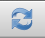

Remember that the size and position you've given the map doesn't need to be
final. You can always come back and change it later if you're not satisfied.
For now, you need to ensure that you've saved your work on this map. Because a
:guilabel:`Layout` in QGIS is part of the main map file, you'll need to save
your main project. Go to the main QGIS window (the one with the
:guilabel:`Layers` panel and all the other familiar elements you were working
with before), and save your project from there as usual.

|basic| |FA| Adding a Title
-------------------------------------------------------------------------------

Now your map is looking good on the page, but your readers/users are not being
told what's going on yet. They need some context, which is what you'll provide
for them by adding map elements. First, let's add a title.

* Click on this button: |label|

* Click on the page, above the map, and a label will appear at the top of the
  map.

* Resize it and place it in the top center of the page. It can be resized and
  moved in the same way that you resized and moved the map.

As you move the title, you'll notice that guidelines appear to help you
position the title in the center of the page.

However, there is also a tool to help position the title relative to the map
(not the page):

|alignLeft|

* Click the map to select it.
* Hold in :kbd:`Shift` on your keyboard and click on the label so that both the
  map and the label are selected.
* Look for the :guilabel:`Align` button |alignLeft| and click on the
  dropdown arrow next to it to reveal the positioning options and click
  :guilabel:`Align center`:

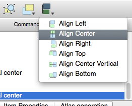

To make sure that you don't accidentally move these elements around now that
you've aligned them:

* Right-click on both the map and the label.

A small lock icon will appear in the corner to tell you that an element can't
be dragged right now. You can always right-click on an element again to unlock
it, though.

Now the label is centered to the map, but not the contents. To center the
contents of the label:

* Select the label by clicking on it.
* Click on the :guilabel:`Item Properties` tab in the side panel of the
  :guilabel:`Layout` window.
* Change the text of the label to "|majorUrbanName|":

* Use this interface to set the font and alignment options:

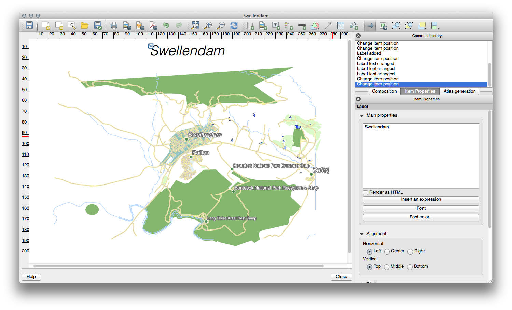

* Choose a large but sensible font (the example will use the default font with
  a size of :kbd:`36`) and set the :guilabel:`Horizontal Alignment` to
  :guilabel:`Center`.

You can also change the font color, but it's probably best to keep it black as
per the default.

The default setting is not to add a frame to the title's text box. However, if
you wish to add a frame, you can do so:

* In the :guilabel:`Item Properties` tab, scroll down until you see the
  :guilabel:`Frame` option.
* Click the :guilabel:`Frame` checkbox to enable the frame. You can also change
  the frame's color and width.

In this example, we won't enable the frame, so here is our page so far:

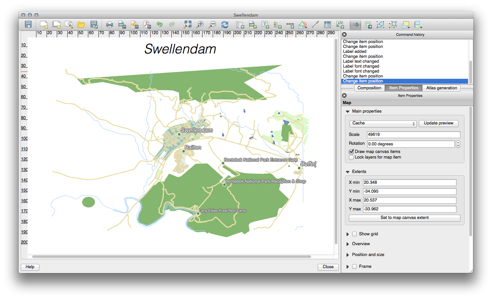

|basic| |FA| Adding a Legend
-------------------------------------------------------------------------------

The map reader also needs to be able to see what various things on the map
actually mean. In some cases, like the place names, this is quite obvious. In
other cases, it's more difficult to guess, like the colors of the farms. Let's
add a new legend.

* Click on this button: |addLegend|

* Click on the page to place the legend, and move it to where you want it:

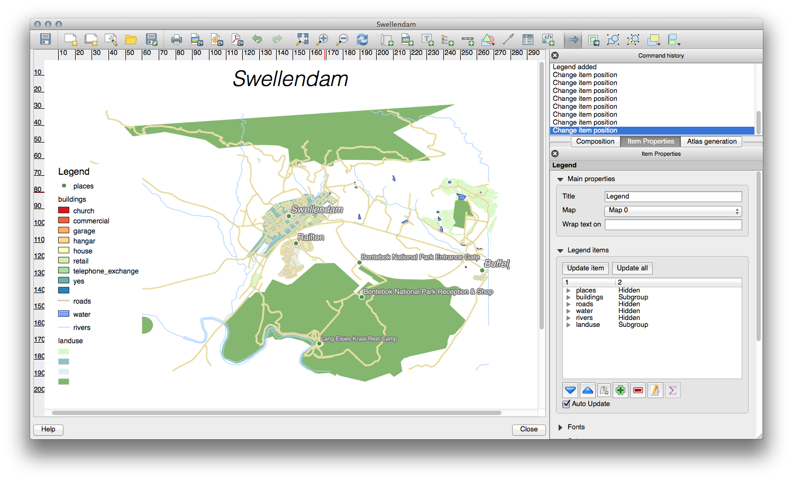

|moderate| |FA| Customizing Legend Items
-------------------------------------------------------------------------------

Not everything on the legend is necessary, so let's remove some unwanted items.

* In the :guilabel:`Item Properties` tab, you'll find the
  :guilabel:`Legend items` panel.
* Select the :guilabel:`buildings` entry.
* Delete it from the legend by clicking the :guilabel:`minus` button:
  |signMinus|

You can also rename items.

* Select a layer from the same list.
* Click the :guilabel:`Edit` button: |edit|

* Rename the layers to :kbd:`Places`, :kbd:`Roads and Streets`,
  :kbd:`Surafce Water`, and :kbd:`Rivers`.
* Set :kbd:`landuse` to :guilabel:`Hidden`, then click the down arrow and edit
  each category to name them on the legend. You can also reorder the items:

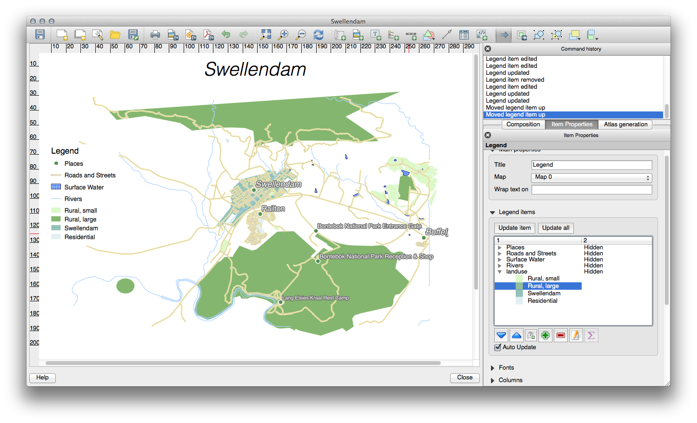

As the legend will likely be widened by the new layer names, you may wish to
move and resize the legend and or map. This is the result:

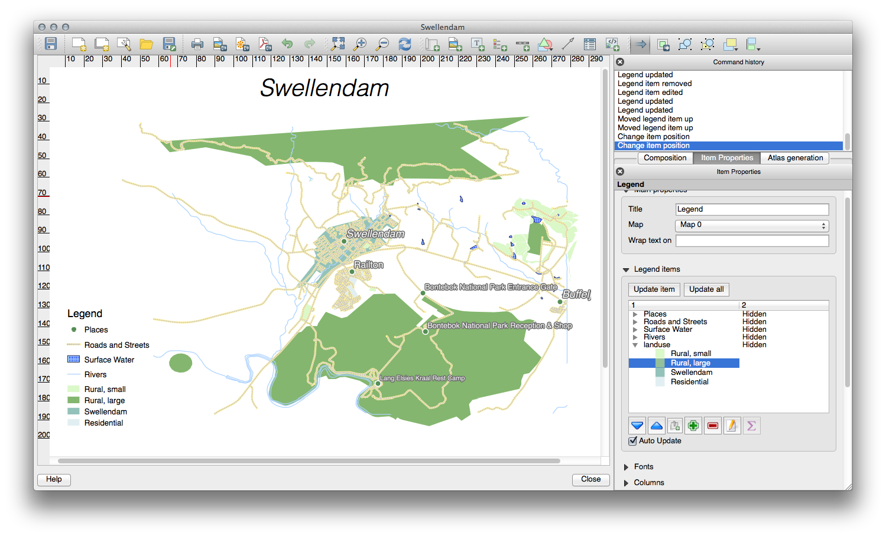

|basic| |FA| Exporting Your Map
-------------------------------------------------------------------------------

.. note::  Did you remember to save your work often?

Finally the map is ready for export! You'll see the export buttons near the top
left corner of the :guilabel:`Layout` window:

  |filePrint| |saveMapAsImage| |saveAsSVG|
  |saveAsPDF|

The button on the left is the :guilabel:`Print` button, which interfaces with
a printer. Since the printer options will differ depending on the model of
printer that you're working with, it's probably better to consult the printer
manual or a general guide to printing for more information on this topic.

The other three buttons allow you to export the map page to a file. There are
three export formats to choose from:

- :guilabel:`Export as Image`
- :guilabel:`Export as SVG`
- :guilabel:`Export as PDF`

Exporting as an image will give you a selection of various common image formats
to choose from. This is probably the simplest option, but the image it creates
is "dead" and difficult to edit.

The other two options are more common.

If you're sending the map to a cartographer (who may want to edit the map for
publication), it's best to export as an SVG. SVG stands for "Scalable Vector
Graphic", and can be imported to programs like `Inkscape <https://inkscape.org/>`_
or other vector image editing software.

If you need to send the map to a client, it's most common to use a PDF, because
it's easier to set up printing options for a PDF. Some cartographers may prefer
PDF as well, if they have a program that allows them to import and edit this
format.

For our purposes, we're going to use PDF.

* Click the :guilabel:`Export as PDF` button: |saveAsPDF|

* Choose a save location and a file name as usual.
* Click :guilabel:`Save`.

|IC|
-------------------------------------------------------------------------------

* Close the :guilabel:`Layout` window.
* Save your map.
* Find your exported PDF using your operating system's file manager.
* Open it.
* Bask in its glory.

Congratulations on your first completed QGIS map project!

|LS| Creating a Dynamic Print Layout
===============================================================================

Now that you've learned to create a basic map layout we go a step further and
create a map layout that adapts dynamically to our map extent and to the page
properties, e.g. when you change the size of the page. Also, the date of creation
will adapt dynamically.

|moderate| |FA| Creating the dynamic map canvas
-------------------------------------------------------------------------------

* Load the ESRI Shapefile format dataset :file:`regions.shp` into the map canvas and adapt its properties
  to suit your own convenience.
* After everything is rendered and symbolized to your liking,
  click the |newLayout| :sup:`New Print Layout` icon in the toolbar or
  choose :menuselection:`File --> New Print Layout`. You will be prompted to
  choose a title for the new layer.
* We want to create a map layout consisting of a header and a map with the regions of
  Alaska. The layout should have a margin of 7.5 mm and the header should be 36mm high.
* Create a map item called ``main map`` on the canvas and go to the :guilabel:`Layout` panel.
  Scroll down to the :guilabel:`Variables` section and find the :guilabel:`Layout` part.
  Here we set some variables you
  can use all over the dynamic print layout. The first variable will define the margin.
  Press the |signPlus| button and type in the name ``rg_layout_margin``. Set the value to ``7.5``. Press
  the |signPlus| button again and type in the name ``rg_layout_height_header``. Set the value to ``36``.
* Now you are ready to create the position and the size of the map canvas automatically
  by means of the variables. Go to the :guilabel:`Item Properties` panel and open the :guilabel:`Position and Size` section.
  Click the |dataDefineExpressionOn| :sup:`Data defined override` for ``X``.
  From :guilabel:`Variables`, choose ``@rg_layout_margin``.
  Click the |dataDefineExpressionOn| :sup:`Data defined override` for ``Y``.
  Choose :guilabel:`Edit...` and type in the formula
  ``to_real(@rg_layout_margin) + to_real(@rg_layout_height_header)``. This means that the
  reference point (where the header ends) will have 7.5 mm as its X-Position and 43.5 mm as its Y-Postion.
  Notice that the values used for the Y-Position have to be converted from
  string to a real number. Now finally let's define the width and height of the map canvas.
  For :guilabel:`Width` use the |dataDefineExpressionOn| :sup:`Data defined override` typing in
  ``@layout_pagewidth - @zg_layout_rand * 2'``
  under :guilabel:`Edit...`.
  Here the variable ``layout_pagewidth`` (created automatically by QGIS) is used.
  Finally, set the :guilabel:`Height` with the expression
  ``@layout_pageheight -  @rg_layout_header -  @rg_layout_margin * 2``
  with the |dataDefineExpressionOn| :sup:`Data defined override`.
* We will also create a grid containing the coordinates of the main canvas map extent.
  Go to :guilabel:`Item Properties` again and choose the :guilabel:`Grids` section.
  Insert a grid by clicking the
  |signPlus| button. Go to :guilabel:`Modify grid ...` and apply the Intervals for X, Y and Offset according
  to the map scale you chose in the QGIS main canvas. The Grid type :guilabel:`Cross` is very well suited
  for our purposes.
   
|moderate| |FA| Creating the dynamic header
-------------------------------------------------------------------------------

* Insert a rectangle which will contain the header with the |addBasicShape| :sup:`Add Shape` button. 
  In the :guilabel:`Items` panel enter the name ``header``.
* Again, go to the :guilabel:`Item Properties` and open the :guilabel:`Position and Size` section.
  Using |dataDefineOn| :sup:`Data defined override`,
  choose the ``@rg_layout_margin`` variable for :guilabel:`X` as well as for :guilabel:`Y`.
  :guilabel:`Width` shall be defined by the expression
  ``@layout_pagewidth - @zg_layout_rand * 2`` and :guilabel:`Height` by the expression ``@rg_layout_header``. 
* We will insert a horizontal line and two vertical lines to divide the header into different sections
  using the |addNodesShape| :sup:`Add Node Item`. Create a horizontal line and two vertical lines.
  After entering the names,
  insert the expression ``@rg_layout_margin`` and ``@rg_layout_margin + 8`` for :guilabel:`X` and :guilabel:`Y`, and
  ``@layout_pagewidth -  @rg_layout_margin * 2 - 53.5`` for the :guilabel:`Width`.
* The first vertical line is defined by ``@layout_pagewidth -  @rg_layout_margin * 2 - 53.5`` for :guilabel:`X`
  and ``@rg_layout_margin`` for :guilabel:`Y`. It's defined by the height of the header we created, so enter
  the expression ``@rg_layout_height_header`` for :guilabel:`Height`.
  The second vertical line is placed left to it. Enter the expression ``@layout_pagewidth-@rg_layout_margin*2-83.5``
  for :guilabel:`X` and ``@rg_layout_margin`` for :guilabel:`Y`.
  It shall have the same value for :guilabel:`Height` as the first vertical line: 
  ``@rg_layout_height_header``. The figure below shows the structure of our dynamic layout. We will fill
  the areas created by the lines with some elements.

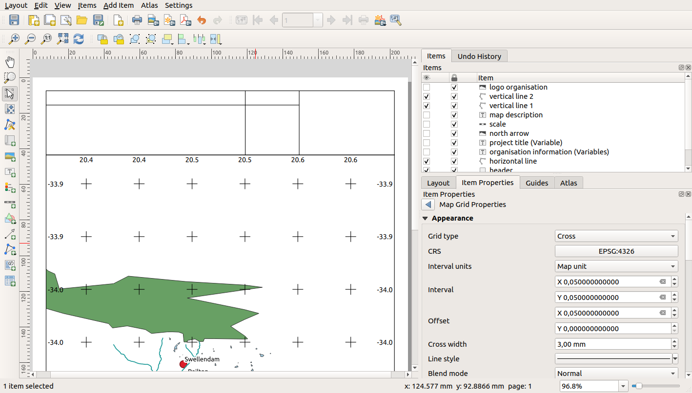

|moderate| |FA| Creating labels for the dynamic header
---------------------------------------------------------------------------------------

* The title of your QGIS project can be included automatically. The title is set
  in the :guilabel:`Project Properties`. Insert a label with the |addLabel| :sup:`Adds a new Label to the layout` button
  and enter the name ``project title (variable)``.
  In the :guilabel:`Main Properties` of the :guilabel:`Items Properties` Panel enter the expression
  ``[%@project title%]``. Set the
  position of the label with the expression ``@rg_layout_margin +3`` for :guilabel:`X` and
  ``@rg_layout_margin + 0.25`` for :guilabel:`Y`.
  The label box should have a width of 105 mm. Enter the expression ``@layout_pagewidth - @rg_layout_margin *2 -90``
  for Width and enter ``11,25`` for Height. Under :guilabel:`Appearance` set the Font to 16 pt.
* The second label will include a description of the map you created. Again, insert a label and name it
  ``map description``. In the Main Properties also enter the text ``map description``. Here also enter
  the date of description by typing in ``printed on: [%format_date(now(),'dd.MM.yyyy')%]``. We are using
  a variable that QGIS creates automatically again. For x insert the expression ``@rg_layout_margin +3`` and
  for y enter the expression ``@rg_layout_margin +11.5``.
* The third label will include information about your organisation. We will create some variables first
  in the :guilabel:`Variables` menu of the :guilabel:`Item Properties`. Click the |signPlus| button each time
  and enter the names ``o_department``, ``o_name`` , ``o_adress`` and ``o_postcode`` as shown in the picture below.
  In the second row enter the detailed information about your organisation. We will use these variables in the :guilabel:`Main Properties`
  menu. The position is defined by ``@layout_pagewidth - @rg_layout_margin - 49.5`` for ``X`` and
  ``@rg_layout_margin + 15.5`` for ``Y``. The ``Width`` is ``49,00`` and the ``Height`` is defined by ``@rg_layout_header - 15.5``.

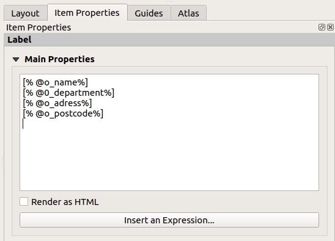

|moderate| |FA| Creating the pictures of the dynamic header
---------------------------------------------------------------------------------------

* Go to the |addNewImage| :sup:`Adds a new Picture to the layout` item and place a picture on top of your
  label ``organisation information``. After entering the name ``organisation logo`` define the position
  for ``X`` with ``@layout_pagewidth - @rg_layout_margin-48.5`` and for ``Y`` with ``@rg_layout_margin+3.5``.
  The size of the logo is defined statically by ``39,292`` for ``Width`` and ``9,583`` for ``Height``.
  To include a logo of your organisation you have to save your logo under your home directory and enter
  the path under :menuselection:`Main Properties --> Image Source`.
* Our layout still needs a north arrow. This will also be insterted by using |addNewImage| :sup:`Adds a new Picture to the layout`.
  Give the name ``nort arrow`` and go to :menuselection:``Main Properties`` and select the
  :guilabel:`Image source`  ``/usr/local/share/qgis/svg/arrows/Arrow_02.svg``. The position is defined by
  ``@layout_pagewidth - @rg_layout_margin - 68.25`` for x and by ``@rg_layout_margin + 22.5``.
  We use static numbers here to define the ``Width`` and the ``Height``: ``21,027`` and ``21,157``.
  
|moderate| |FA| Creating the scalebar of the dynamic header
----------------------------------------------------------------------------------------

* To insert a scalebar in the header click on |addScalebar| :sup:`Adds a new Scale Bar to the layout` and
  place it in the rectangle on top of the north arrow. From the :guilabel:`Main Properties` refer to your ``main map(Map 0)``
  which we created before. This means that the scale changes automatically according to the extent you choose
  in the QGIS main canvas. Choose the :guilabel:`Style` ``Numeric``. This means that we insert a simple scale without
  a scalebar. The scale still needs a position and size. For x enter ``@layout_pagewidth - @rg_layout_margin - 68.25``,
  for y enter ``@rg_layout_margin + 6.5``, for Width enter ``28,639`` and for Height ``13,100``. The ``Reference point``
  should be placed in the center.
  
Congratulations! You created your first dynamic map layout. Take a look at the layout and check if everything looks the way you want it!
The dynamic map layout reacts automatically when you change the :guilabel:`page properties`.
For example, if you change the page size from DIN A4 to DIN A3, just click the |draw| :sup:`Refresh view` button and
the page design is adapted.

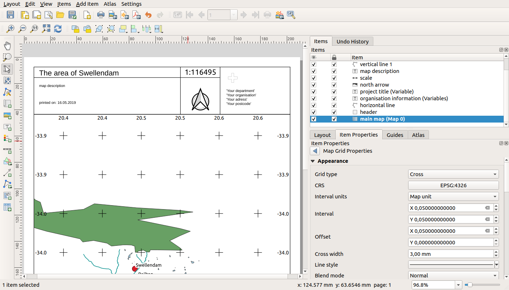

|WN|
-------------------------------------------------------------------------------

On the next page, you will be given an assignment to complete. This will allow
you to practice the techniques you have learned so far.

.. Substitutions definitions - AVOID EDITING PAST THIS LINE
   This will be automatically updated by the find_set_subst.py script.
   If you need to create a new substitution manually,
   please add it also to the substitutions.txt file in the
   source folder.

.. |FA| replace:: Follow Along:
.. |IC| replace:: In Conclusion
.. |LS| replace:: Lesson:
.. |WN| replace:: What's Next?
.. |addLegend| image:: /static/common/mActionAddLegend.png
   :width: 1.5em
.. |addMap| image:: /static/common/mActionAddMap.png
   :width: 1.5em
.. |alignLeft| image:: /static/common/mActionAlignLeft.png
.. |edit| image:: /static/common/edit.png
   :width: 1.5em
.. |basic| image:: /static/global/basic.png
   :width: 1.5em
.. |filePrint| image:: /static/common/mActionFilePrint.png
   :width: 1.5em
.. |label| image:: /static/common/mActionLabel.png
   :width: 1.5em
.. |majorUrbanName| replace:: Swellendam
.. |moderate| image:: /static/global/moderate.png
.. |moveItemContent| image:: /static/common/mActionMoveItemContent.png
   :width: 1.5em
.. |saveAsPDF| image:: /static/common/mActionSaveAsPDF.png
   :width: 1.5em
.. |saveAsSVG| image:: /static/common/mActionSaveAsSVG.png
   :width: 1.5em
.. |saveMapAsImage| image:: /static/common/mActionSaveMapAsImage.png
   :width: 1.5em
.. |signMinus| image:: /static/common/symbologyRemove.png
   :width: 1.5em
.. |updatedisclaimer| replace:: :disclaimer:`Docs in progress for 'QGIS testing'. Visit https://docs.qgis.org/3.4 for QGIS 3.4 docs and translations.`
.. |zoomFullExtent| image:: /static/common/mActionZoomFullExtent.png
   :width: 1.5em
.. |zoomIn| image:: /static/common/mActionZoomIn.png
   :width: 1.5em
.. |zoomOut| image:: /static/common/mActionZoomOut.png
   :width: 1.5em
.. |signPlus| image:: /static/common/symbologyAdd.png
   :width: 1.5em
.. |newLayout| image:: /static/common/mActionNewLayout.png
   :width: 1.5em
.. |addBasicShape| image:: /static/common/mActionAddBasicShape.png
   :width: 1.5em
.. |addLabel| image:: /static/common/mActionLabel.png
   :width: 1.5em
.. |dataDefineExpressionOn| image:: /static/common/mIconDataDefineExpressionOn.png
   :width: 1.5em
.. |addNodesShape| image:: /static/common/mActionAddNodesShape.png
   :width: 1.5em
.. |addNewImage| image:: /static/common/mActionAddImage.png
   :width: 1.5em
.. |addScalebar| image:: /static/common/mActionScaleBar.png
   :width: 1.5em
.. |draw| image:: /static/common/mActionDraw.png
   :width: 1.5em

