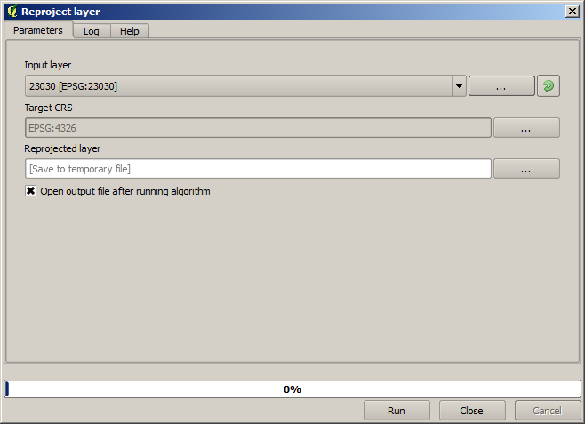

CRSs. Reprojecting
============================================================

.. note:: In this lesson we will discuss how Processing uses CRSs. We will also see a very useful algorithm: reprojecting.

CRS's are a great source of confusion for QGIS Processing users, so here are some general rules about how they are handled by geoalgorithms when creating a new layer.

- If there are input layers, it will use the CRS of the first layer. This is assumed to be the CRS of all input layers, since they should have the same one. If you use layers with unmatching CRS's, QGIS will warn you about it. Notice that the CRS of input layers is shown along with its name in the parameters dialog.

.. image:: img/crs/crs_layer.png

- If there are no input layer, it will use the project CRS, unless the algorithm contains a specific CRS field (as it happenend in the last lesson with the graticule algorithm)

Open the project corresponding to this lesson and you will see two layers named 23030 and 4326. They both contain the same points, but in different CRSs (EPSG:23030 and EPSG:4326). They appear in the same place because QGIS is reprojecting on the fly to the project CRS (EPSG:4326), but they are not actually the same layer.

Open the *Add geometry columns* algorithm.

.. image:: img/crs/add_geom.png

This algorithm add new columns to the attributes table of a vector layer. The content of the columns depend on the type of geometry of the layer. In the case of points, it adds new columns with the X and Y coordinates of each point.

In the list of available layers that you will find in the input layer field, you will see each one with its corresponding CRS. That means that, although they appear in the same place in your canvas, they will be treated differently. Select the 4326 layer.

The other parameter of the algorithm allows to set how the algorithm uses coordiantes to calculate the new value that it will add to the resulting layers. Most algorithms do not have an option like that, and just use the coordinates directly. Select the *Layer CRS* option to just use coordinates as they are. This is how almost all geoalgorithms work.

You should get a new layer with exactly the same points as the other two layers. If you right click on the name of the layer and open its properties, you will see that it shares the same CRS of the input layer, that is, EPSG:4326. When the layer is loaded into QGIS, you will not be asked to enter the CRS of the layer, since QGIS already knows about it.

If you open the attributes table of the new layer you will see that it contains two new fields with the X and Y coordinates of each point.

.. image:: img/crs/attribs2.png

Those coordinate values are given in the layer CRS, since we chose that option. However, even if you choose another option, the output CRS of the layer would have been the same, since the input CRS is used to set the CRS of the output layer. Choosing another option will cause the values to be different, but not the resulting point to change or the CRS of the ouput layer to be different to the CRS of the input one.

Now do the same calculation using the other layer. You should find the resulting layer rendered exactly in the same place as the other ones, and it will have the EPSG:23030 CRS, since that was the one of the input layer.

If you go to its attribute table, you will see values that are different to the ones in the first layer that we created.

.. image:: img/crs/attribs.png

This is because the original data is different (it uses a different CRS), and those coordinates are taken from it.

What should you learn from this? The main idea behind these examples is that geoalgorithms use the layer as it is in its original data source, and completely ignore the reprojections that QGIS might be doing before rendering. In other words, do not trust what you see in the canvas, but always have in mind that the original data will be used. That is no so important in this case, since we are just using one single layer at a time, but in an algorithm that needs several of them (such as a clip algorithm), layers that appear to match or overlay might be very far one from each other, since they might have different CRSs. 

Algorithms performs no reprojection (except in the reprojection algorithm that we will see next), so it is up to you to make sure that layers have matching CRS's.

An interesting module that deals with CRS's is the reprojection one. It represents a particular case, since it has an input layer (the one to reproject), but it will not use its CRS for the the output one.

Open the *Reprojection* algorithm.

Select any of the layers as input, and select EPSG:23029 as the destination CRS. Run the algorithm and you will get a new layer, identical to the input one, but with a different CRS. It will appear on the same region of the canvas, like the other ones, since QGIS will reproject it on the fly, but its original coordinates are different. You can see that by running the *Add geometry columns* algorithm using this new layer as input, and veryfing that the added coordinates are different to the ones in the attribute tables of both of the two layers that we had computed before.