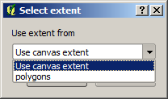

Defining extents
============================================================

.. note:: In this lesson we will see how to define extents, which are needed by some algorithms, especially raster ones.

Some algorithms require an extent to define the area to be covered by the analysis they perform, and usually to define the extent of the resulting layer.

When an extent is required, it can be defined manually by entering the four values that define it (min X, min Y, max X, max Y), but there are other more practical and more interesting ways of doing it as well. We will see all of them in this lesson.

First, let's open an algorithm that requires an extent to be defined. Open the *Shapes to grid* algorithm, which creates a raster layer from a vector layer.

.. image:: img/extents/rasterize.png

All the parameters, except for the last two ones, are used to define which layer is to be rasterized, and configure how the rasterization process should work. The two last parameters, on the other hand, define the characteristics of the output layer. That means that they define the area that is covered (which is not necesarily the same area covered by the input vector layer), and the resolution/cellsize (which cannot be infered from the vector layer, since vector layers do not have a cellsize).

The first thing you can do is to type the 4 defining values explained before, separated by commas.

.. image:: img/extents/type.png

That doesn't need any extra explanation. While this is the most flexible option, it is also the less practical in some cases, and that's why other options are implemented. To access them, you have to click on the button on the right--hand side of the extent text box.

.. image:: img/extents/menu.png

Let's see what each one of them does.

The first option is *Use layer/canvas extent*, which will show the selection dialog shown below.

Here you can select the extent of the canvas (the extent covered by the current zoom), or the extension any of the available layers. Select it and click on *OK*, and the text box will be automatically filled with the corresponding values.

The second option is *Select extent on canvas*. In this case, the algorithm dialog disappears and you can click and drag on the QGIS canvas to define the desired extent. 

.. image:: img/extents/extent_drag.png
 
Once you release the mouse button, the dialog will reappear and the text box will already have the values corresponding to the defined extent.

The last option is *Use min covering extent from input layers*, which is the default option. This will compute the min covering extent of all layers used to run the algorithm, and there is no need to enter any value in the text box. In the case of a single input layer, as in the algorithm we are running, the same extent can be obtained by selecting that same input layer in the *Use layer/canvas extent* that we already saw. However, when there are several input layers, the min covering extent does not correspond to any of the input layer extent, since it is computed from all of them together.

We will use this last method to execute our rasterization algorithm.

Fill the parameters dialog as shown next, and press *OK*.

.. image:: img/extents/parameters.png

.. note:: In this case, better use an *Integer (1 byte)* instead of a *Floating point (4 byte)*, since the *NAME* is an integer with maximum value=64. This will result in a smaller file size and faster computations.

You will get a rasterized layer that covers exactly the area covered by the original vector layer.

.. image:: img/extents/result.png

In some cases, the last option, *Use min covering extent from input layers*, might not be available. This will happen in those algorithm that do not have input layers, but just parameters of other types. In that case, you will have to enter the value manually or use any of the other options.

Notice that, when a selection exist, the extent of the layer is that of the whole set of features, and the selection is not used to compute the extent, even though the rasterization is executed on the selected items only. In that case, you might want to actually create a new layer from the selection, and then use it as input.
