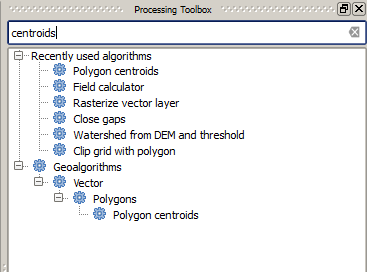
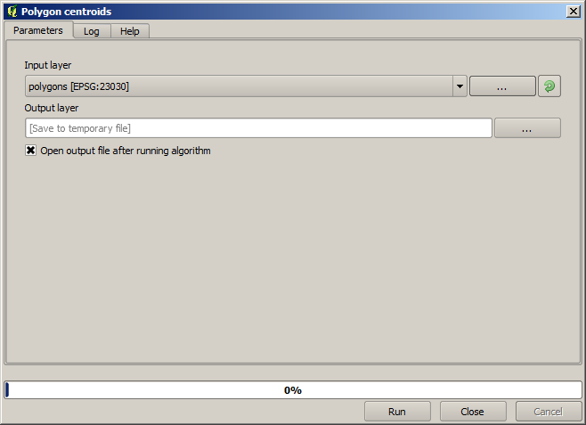

Running our first algorithm. The  toolbox
============================================================


.. note:: In this lesson we will run our first algorithm, and get our first result from it.


As we have already mentioned, the processing framework can run algorithms from other applications, but it also contains native algorithm that need no external software to be run. To start exploring the processing framework, we are going to run one of those native algorithms. In particular, we are going to calculate the centroids of set of polygons.

First, open the QGIS project corresponding to this lesson. It contains just a single layer with two polygons

.. image:: img/first_alg/canvas.png

Now go to the text box at the top of the toolbox. That is the search box, and if you type text in it, it will filter the list of algorithms so just those ones contaning the entered text are shown. Type ``centroids`` and you should see something like this.



The search box is a very practical way of finding the algorithm you are looking for.

To execute an algorithm, you just have to double-click on its name in the toolbox. When you double-click on the *Centroids* algorithm, you will see the following dialog.



All algorithms have a similar interface, which basically contains input parameters that you have to fill, and outputs that you have to select where to store. In this case, the only inputs we have are a vector layer with polygons and a selector to select whether we want several centroids for a single feature in case it is a multipart features, or the algorithm should generate just one centroid for each feature.

Select the *Polygons* layer as input. The other field will have no effect at all, since the input layer has no multi-part features.

The algorithm has a single output, which is the centroids layer. There are two options to define where a data output is saved: enter a filepath or save it to a temporary filename

In case you want to set a destination and not save the result in a temporary file, the format of the output is defined by the filename extension. To select a format,
just select the corresponding file extension (or add it if you are directly typing the filepath instead). If the extension of the filepath you entered does not
match any of the supported ones, a default extension (usually ``.dbf``` for tables, ``.tif`` for raster layers and ``.shp`` for vector ones) will be appended to the filepath and the file format corresponding to that extension will be used to save the layer or table.

In all the exercises in this guide, we will be saving results to a temporary file, since there is no need to save them for a later use. Feel free to save them to a permament location if you want to.

Notice that temporary files are deleted once you close QGIS. If you create a project with an output that was saved as a temporary output, QGIS will complain when you try to open back the project later, since that output file will not exist.

Once you have configured the algorithm dialog, press *Run* to run the algorithm.

You will get the following output.

.. image:: img/first_alg/canvas2.png

The output has the same CRS as the input.  Geoalgorithms assumes all input layers share the in the same CRS and does not perform any reprojection. Except in the case of some special algorithms (for instance, reprojection ones), the outputs will also have that same CRS. We will see more about this soon.

Try yourself saving it using different file formats (use, for instance, ``shp`` and ``geojson`` as extensions). Also, if you do not want the layer to be loaded in QGIS after it is generated, you can check off the check box that is found below the output path box.


