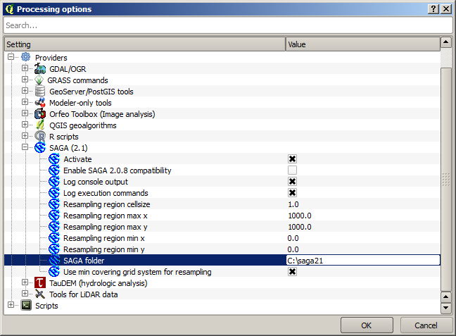

Running an external algorithm
============================================================

.. note:: In this lesson we will see how to use algorithms that depend on a third-party application, particularly SAGA, which is one of the main algorithm providers.

All the algorithms that we have run so far are part of processing framework. That is, they are *native* algorithms implemented in the plugin and run by QGIS just like the plugin itself is run. However, one of the greatest features of the processing framework is that it can use algorithms from external applications and extend the possibilites of those applications. Such algorithms are wrapped and included in the toolbox, so you can easily use them from QGIS, and use QGIS data to run them.

Some of the algorithms that you see in the simplified view require third party applications to be installed in your system. One algorithm provider of special interest is SAGA (System for Automated Geospatial Analysis). First, we need to configure everything so QGIS can correctly call SAGA. This is not difficult, but it's important to understand how it works. Each external application has its own configuration, and later in this same manual we will talk about some of the other ones, but SAGA is going to be our main backend, so we will discuss it here.

If you are on Windows, the best way to work with external algorithms is to install QGIS using the standalone installer. It will take care of installing all the needed dependencies, including SAGA, so if you have used it, there is nothing else to do. You can open the settings dialog and go to the *Providers/SAGA* group.

The SAGA path should already be configured and pointing to the folder where SAGA is installed. 

If you have installed QGIS not using the standalone installer, then you must enter the path to your SAGA installation (which you must have installed separately) there. The required version is SAGA 2.1

In case you are using Linux, you do not have to set the path to your SAGA installation in the processing configuration. Instead, you must install SAGA and make sure that the SAGA folder is in PATH, so it can be called from the console (just open a console and type ``saga_cmd`` to check it). Under Linux, the target version for SAGA is also 2.1, but in some installations (such as the OSGeo Live DVD) you might have just 2.0.8 available. There are some 2.1 packages available, but they are not commonly installed and might have some issues, so if you prefer to use the more common and stable 2.0.8, you can do it by enabling 2.0.8 compatibility in the configuration dialog, under the *SAGA* group

.. image:: img/first_saga_alg/enable208.png

Once SAGA is installed, you can launch a SAGA algorithm double clicking on its name, as with any other algorithm. Since we are using the simplified interface, you do not know which algorithms are based on SAGA or in another external application, but if you happen to double--click on one of them and the corresponding application is not installed, you will see something like this.

.. image:: img/first_saga_alg/missing_saga.png

In our case, and assuming that SAGA is correctly installed and configured, you should not see this window, and you will get to the parameters dialog instead.

Let's try with a SAGA--based algorithm, the one called *Split shapes layer randomly*.

.. image:: img/first_saga_alg/split.png

Use the points layer in the project corresponding to this lesson as input, and the default parameter values, and you will get something like this (the split is random, so your result might be different).

.. image:: img/first_saga_alg/split_layer.png

The input layer has been split in two layers, each one with the same number of points. This result has been computed by SAGA, and later taken by QGIS and added to the QGIS project.

If all goes fine, you will not notice any difference between this SAGA--based algorithm and one of the others that we have previously run. However, SAGA might, for some reason, not be able to produce a result and not generate the file that QGIS is expecting. In that case, there will be problems adding the result to the QGIS project, and an error message like this will be shown.

.. image:: img/first_saga_alg/missing_result.png

This kind of problems might happen, even if SAGA (or any other application that we are calling from the processing framework) is correctly installed, and it is important to know how to deal with them. Let's produce one of those error messages.

Open the *Create graticule from extent* algorithm and use the following values.

.. image:: img/first_saga_alg/create_graticule.png

We are using  width and height values that is larger than the specified extent, so SAGA cannot produce any output. In other words, the parameter values are wrong, but they are not checked until SAGA gets them and tries to create the graticule. Since it cannot create it, it will not produce the expected layer, and you will see the error message shown above.

Understanding this kind of problems will help you solve them and find an explanation to what is happening. As you can see in the error message, a test is performed to check that the connection with SAGA is working correctly, indicating you that there might be a problem in how the algorithm was executed. This applies not only to SAGA, but also to other external applications as well.

In the next lesson we will introduce the processing log, where information about commands run by geoalgorithms is kept, and you will see how to get more detail when issues like this appear.
