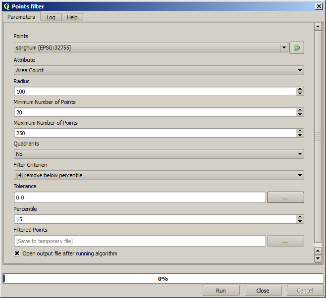

Interpolation
============================================================

.. note:: This chapter shows how to interpolate point data, and will show you another real example of performing spatial analysis

In this lesson, we are going to interpolate points data to obtain a raster layer. Before doing it, we will have to do some data preparation, and after interpolating we will add some extra processing to modify the resulting layer, so we will have a complete analysis routine.

Open the example data for this lesson, which should look like this.

.. image:: img/interpolation/project.png

The data correspond to crop yield data, as produced by a modern harvester, and we will use it to get a raster layer of crop yield. We do not plan to do any further analysis with that layer, but just to use it as a background layer for easily identifying the most productive areas and also those where productivity can be improved.

The first thing to do is to clean--up the layer, since it contains redundant points. These are caused by the movement of the harvester, in places where it has to do a turn or it changes its speed for some reason. The *Point filter* algorithm will be useful for this. We will use it twice, to remove points that can be considered outliers both in the upper and lower part of the distribution.

For the first execution, use the following parameter values.

Now for the next one, use the configuration shown below.

.. image:: img/interpolation/filter2.png

Notice that we are not using the original layer as input, but the output of the previous run instead.

The final filter layer, with a reduced set of points, should look similar to the original one, but it contains a smaller number of points. You can check that by comparing their attribute tables.

Now let's rasterize the layer using the *Shapes to grid* algorithm.

.. image:: img/interpolation/rasterize.png

The *Filtered points* layer refers to the resulting one of the second filter. It has the same name as the one produced by the first filter, since the name is assigned by the algorithm, but you should not use the first one. Since we will not be using it for anything else, you can safely remove it from your project to avoid confusion, and leave just the last filtered layer.

The resulting raster layer looks like this.

.. image:: img/interpolation/rasterized.png

It is already a raster layer, but it is missing data in some of its cells. It only contain valid values in those cells that contained a point from the vector layer that we have just rasterized, and a no--data value in all the other ones. To fill the missing values, we can use the *Close gaps* algorithm.

.. image:: img/interpolation/close_gaps.png

The layer without no--data values looks like this.

.. image:: img/interpolation/filled.png

To restrict the area covered by the data to just the region where crop yield was measured, we can clip the raster layer with the provided limits layer.

.. image:: img/interpolation/clip.png

And for a smoother result (less accurate but better for rendering in the background as a support layer), we can apply a Gaussian filter to the layer.

.. image:: img/interpolation/gaussian.png

With the above parameters you will get the following result

.. image:: img/interpolation/filtered_raster.png

