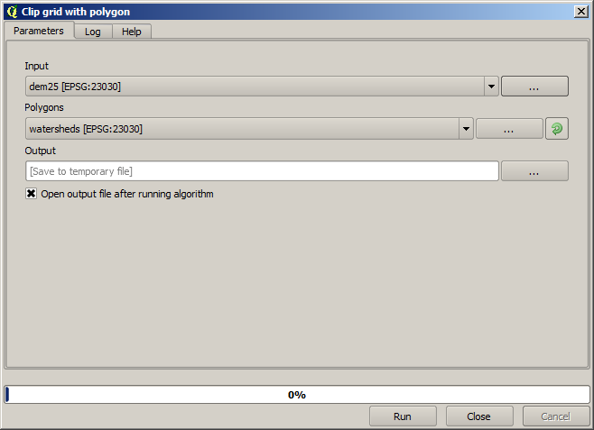
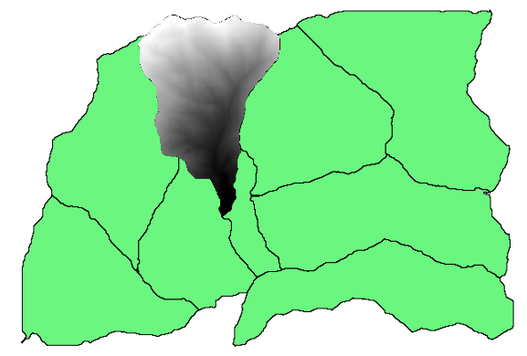

Iterative execution of algorithms
==================================

.. note:: This lesson shows a different way of executing algorithms that use vector layers, by running them repeatedly, iterating over the features in an input vector layer

We already know the graphical modeler, which is one way of automating processing tasks. However, in some situations, the modeler might not be what we need to automate a given task. Let's see one of those situation and how to easily solve it using a different functionality: the iterative execution of algorithms.

Open the data corresponding to this chapter. It should look like this.

.. image:: img/iterative/project.png

You will recognize our well-known DEM from previous chapters and a set of watersheds extracted from it. Imagine that you need to cut the DEM into several smaller layers, each of them containing just the elevation data corresponding to a single watershed. That will be useful if you later want to calculate some parameters related to each watershed, such as its mean elevation or it hypsographic curve.

This can be a lengthy and tedious task, especially if the number of watersheds is large. However, it is a task that can be easily automated, as we will see.

The algorithm to use for clipping a raster layer with a polygon layer is called *Clip grid with polygons*, and has the following parameters dialog.

Yo can run it using the watersheds layer and the DEM as input, and you will get the following result.

.. image:: img/iterative/full_clip.png

As you can see, the area covered by all the watershed polygons is used.

You can have the DEM clipped with just a single watershed by selecting the desired watershed and then running the algorithm as we did before. 

.. image:: img/iterative/selection.png

Since only selected features are used, only the selected polygon will be used to crop the raster layer.

Doing this for all the watersheds will produce the result we are looking for, but it doesn't look like a very practical way of doing it. Instead, let's see how to automate that *select and crop* routine.

First of all, remove the previous selection, so all polygons will be used again. Now open the *Clip grid with polygon* algorithm and select the same inputs as before, but this time click on the button that you will find in the right--hand side of the vector layer input where you have selected the watersheds layer.

.. image:: img/iterative/iterate_button.png

This button will cause the selected input layer to be split into as many layer as feature are found in it, each of them containing a single polygon. With that, the algorithm will be called repeatedly, one for each one of those single-polygon layers. The result, instead of just one raster layer in the case of this algorithm, will be a set of raster layers, each one of them corresponding to one of the executions of the algorithm.

Here's the result that you will get if you run the clipping algorithm as explained.

.. image:: img/iterative/result_iterative.png

For each layer, the black and white color palette, (or whatever palette you are using), is adjusted differently, from its minimum to its maximum values. That's the reason why you can see the different pieces and the colors do not seem to match in the border between layers. Values, however, do match.

If you enter an output filename, resulting files will be named using that filename and a number corresponding to each iteration as suffix.

