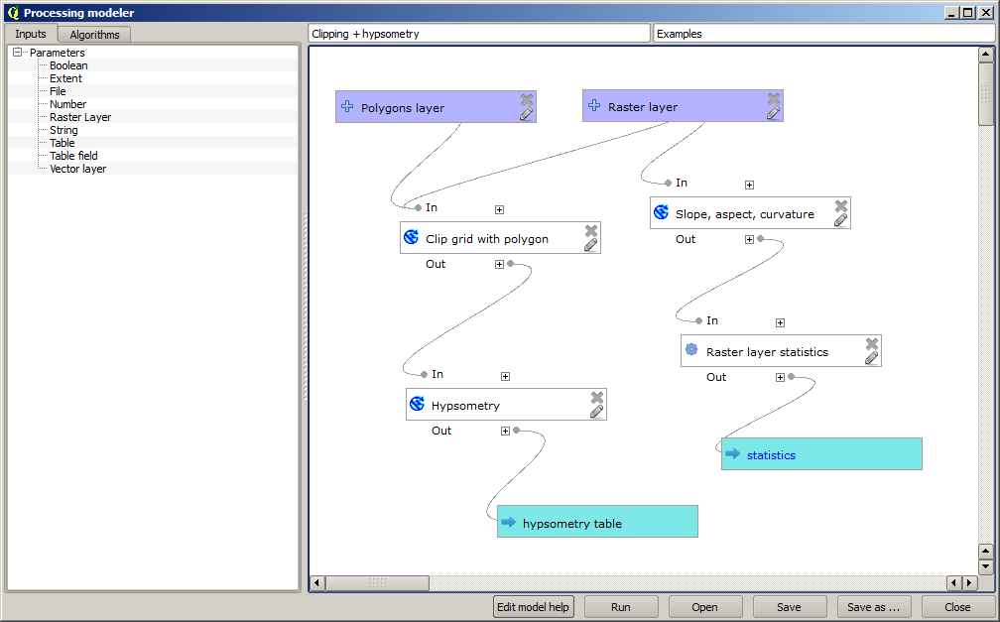

More iterative execution of algorithms
=======================================

.. note:: This lessons shows how to combine the iterative execution of algorithm with the modeler to get more automation

The iterative execution of algorithms is available not just for built-in algorithms, but also for the algorithms that you can create your self, such as models. We are going to see how to combine a model and the iterative execution of algorithms, so we can obtain more complex results with ease.

The data the we are going to use for this lesson is the same one that we already used for the last one. In this case, instead of just clipping the DEM with each watershed polygon, we will add some extra steps and calculate a hypsometric curve for each of them, to study how elevation is distributed within the watershed.

Since we have a workflow that involves several steps (clipping + computing the hypsometric curve), we should go to the modeler and create the corresponding model for that workflow.

You can find the model already created in the data folder for this lesson, but it would be good if you first try to create it yourself. The clipped layer is not a final result in this case, since we are just interested in the curves, so this model will not generated any layers, but just a table with the curve data.

The model should look like this:

.. image:: img/iterative_model/model.png

Add the model to you models folder, so it is available in the toolbox, and now execute it.

.. image:: img/iterative_model/model.png

Select the DEM and watersheds basins, and do not forget to toggle the button that indicates that the algorithm has to be run iteratively.

The algorithm will be run several times, and the corresponding tables will be created and open in your QGIS project.

.. image:: img/iterative_model/tables.png

We can make this example more complex by extending the model and computing some slope statistics. Add the *Slope, aspect, curvatures* algorithm to the model, and then the *Raster statistics* algorithm, which should use the slope output as its only input.

If you now run the model, apart from the tables you will get a set of pages with statistics. These pages will be available in the results dialog.
