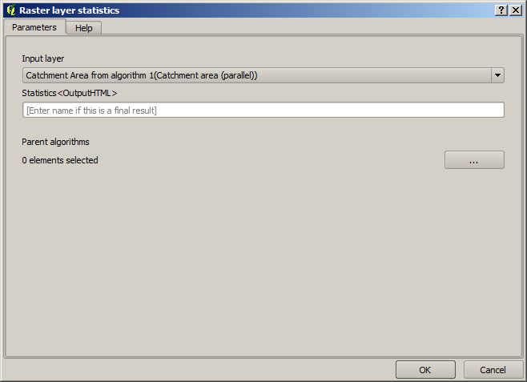
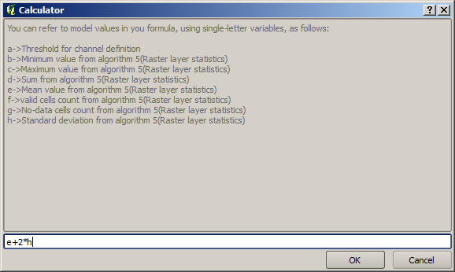
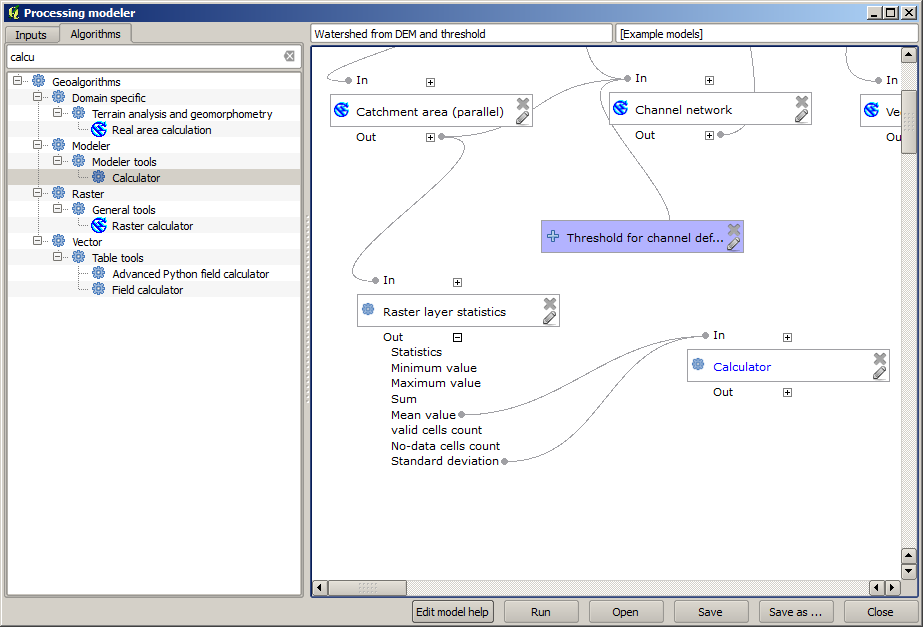

Numeric calculations in the modeler
============================================================

.. warning:: Beware, this chapter is not well tested, please report any issue; images are missing

.. note:: In this lesson we will see how to use numeric outputs in the modeler

For this lesson, we are going to modify the hydrological model that we created in the last chapter (open it in the modeler before starting), so we can automate the calculation of a valid threshold value and we do not have to ask the user to enter it. Since that value refers to the variable in the threshold raster layer, we will extract it from that layer, based on some simple statistical analysis.

Starting with the aforemetioned model, let's do the following modifications:

First, calculate statistics of the flow accumulation layer using the *Raster layer statistics* algorithm.

This will generate a set of statistical values that will now be available for all numeric fields in other algorithms. 

If you double click on the  *Channel network* algorithm to modify it, as we did in the last lesson, you will see now that you have other options apart from the numeric input that you added.

.. image:: img/modeler_hydro_calculator/unfolded.png

However, none of this values is suitable for being used as a valid threshold, since they will result in channel networks that will not be very realistic. We can, instead, derive some new parameter based on them, to get a better result. For instance, we can use the mean plus 2 times the standard deviation.

To add that arithmetical operation, we can use the calculator that you will find in the *Geoalgorithms/modeler/modeler-tools* group. This group contains algorithms that are not very useful outside of the modeler, but that provide some useful functionality when creating a model.

The parameters dialog of the calculator algorithm looks like this:

As you can see, the dialgo is different to the other ones we have ssen, but you have in there the same variables that were available in the *Threshold* field in the *Channel network* algorithm. Enter the above formula and click on *OK* to add the algorithm. 

If you expand the outputs entry, as shown above, you will see that the model is connected to two of the values, namely the mean and the standard deviation, which are the ones that we have used in the formula.

Adding this new algorithm will add a new numeric value. If you go again to the *Channel network* algorithm, you can now select that value in the *Threshold* parameter. 

.. image:: img/modeler_hydro_calculator/unfolded2.png

Click on *OK* and your model should look like this.

.. image:: img/modeler_hydro_calculator/calculator_output.png

We are not using the numeric input that we added to the model, so it can be removed. Right--click on it and select *Remove*

.. image::

Our new model is now finished.

