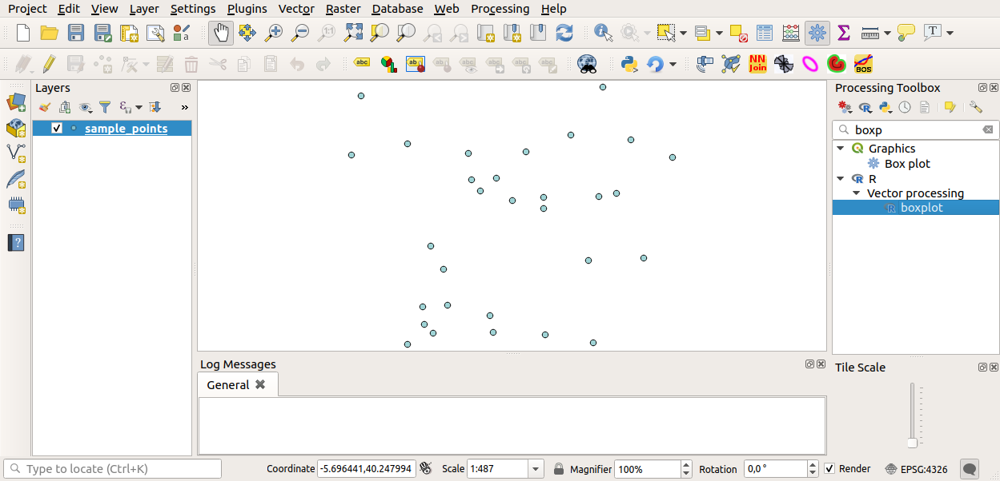

Use R scripts in Processing
===========================
Module contributed by Matteo Ghetta - `Dropcode <www.dropcode.weebly.com>`_ 

Processing allows to write and run R scripts inside QGIS. 

In this tutorial we are going to create a boxplot of a vector layer field.

Open the :file:`r_intro.qps` QGIS project.

Adding scripts
--------------
Adding a script is very simple. Open the Processing toolbox and just click on the :menuselection:`R --> Tools --> Create new R script`.

.. image:: img/r_intro/r_intro_1.png

.. note:: R has to be installed on your computer and the PATH has to correctly set up. See the related `chapter <http://docs.qgis.org/testing/en/docs/user_manual/processing/3rdParty.html>`_ in the training manual.

.. note:: If you cannot see R in Processing, you have to activate it in :menuselection:`Processing --> Options --> Providers`

It opens a *script editor window* in which you have to specify some parameters before you can add the script body.

.. image:: img/r_intro/r_intro_2.png
    :scale: 70%
    :align: center

Script parameters
^^^^^^^^^^^^^^^^^
Start writing at the beginning of the editor. 

You **must** specify some parameters before the script body:

1. the name of the group in which you want to put your script::

    ##plots=group
    
so you will find your script in the **plots** group in the Processing toolbox.

2. you have to tell Processing that you want to display a plot (just in this example):: 
    
    ##showplots
    
this way in the **Result Viewer** of Processing you'll see the plot.

3. You need also to tell Processing with which kind of data you are working with. In this example we want to create a plot from a field of a vector layer::

    ##Layer=vector
    
Processing knows now that the input is a vector. The name *Layer* is not important, what matters is the **vector** parameter.

4. Finally, you have to specify the input field of the vector layer you want to plot::

    ##X=Field Layer
    
So Processing knows that you have called **X** the **Field Layer**.

Script body
^^^^^^^^^^^
Now that you have set up the *heading* of the script you can add the function::

    boxplot(Layer[[X]])

Notice that **boxplot** is the name of the R function itself that calls **Layer** as dataset and **X** as the field of the dataset.

.. warning:: The parameter **X** is within a double square bracket ``[[]]``

The script you looks like this::

    ##Vector processing=group
    ##showplots
    ##Layer=vector
    ##X=Field Layer
    boxplot(Layer[[X]])

.. image:: img/r_intro/r_intro_3.png

Save the script in the default path suggested by Processing. The name you choose will be the same as the name of the script you'll find in the Processing toolbox.

.. note:: You can save the script in other paths, but Processing isn't able to upload them automatically and you have to upload all the scripts manually

Now just run it using the button on the top of the editor window:

.. image:: img/r_intro/r_intro_4.png

Otherwise, once the editor window has been closed, use the text box of Processing to find your script:

You are now able to fill the parameters required in the Processing algorithm window:

* as **Layer** choose the *sample points* one
* fill the **X** field with the **value** parameter

Click on **Run**.

.. image:: img/r_intro/r_intro_6.png

The **Result window** should be automatically opened, if not, just click on :menuselection:`Processing --> Result Viewer...`.

This is the final result you'll see:

.. image:: img/r_intro/r_intro_7.png

.. note:: You can open, copy and save the image by right clicking on the plot

Beware that Processing uses some special syntax to get the results out of R::

  ``+`` means 
  ``>`` means
