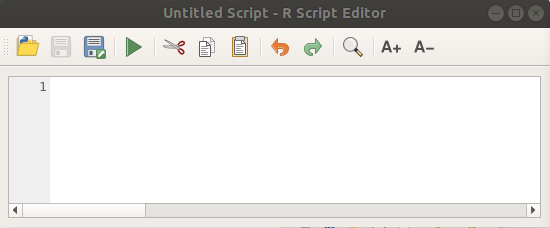

.. _r-intro:

****************************
Use R scripts in Processing
****************************

Module contributed by Matteo Ghetta - funded by
`Scuola Superiore Sant'Anna <https://www.santannapisa.it/it>`_

Processing (with the ``Processing R Provider`` plugin) makes it possible to write
and run R scripts inside QGIS.

.. warning::
   R has to be installed on your computer and the PATH has to be correctly
   set up. Moreover Processing just calls the external R packages, it is not able
   to install them. So be sure to install external packages directly in R.
   See the related :ref:`chapter <creating_r_scripts>` in the user manual.

.. note::
   If you have *package* problems, it may be related to missing
   *mandatory* packages required by Processing, like ``sp``, ``rgdal`` and ``raster``.

Adding scripts
==============

Adding a script is very simple. Open the Processing toolbox and just click on
the :menuselection:`R --> Tools --> Create new R script`.
In case this tool is not available, you have to create the script in for
instance a text editor and save it in your R scripts folder - when it has
been saved, it will be available for editing by right-clicking on the script
name in the processing toolbox and then choose :menuselection:`Edit Script...`).

.. note::
   If you cannot see R in Processing, you have to activate it in
   :menuselection:`Processing --> Options --> Providers`

It opens a *script editor window* in which you have to specify some parameters
before you can add the script body.

Creating plots
==============

In this tutorial we are going to create a **boxplot** of a vector layer field.

Open the :file:`r_intro.qgs` QGIS project under the :file:`exercise_data/processing/r_intro/` folder.

Script parameters
-----------------

Open the editor and start writing at the beginning of it.

You **must** specify some parameters **before** the script body:

#. the name of the group (`plots` in this case) in which you want to put your
   script (if the group does not exist, it will be created)::

    ##plots=group

   You will find your script in the **plots** R group in the Processing toolbox.

#. you have to tell Processing that you want to display a plot (in this example)::

    ##showplots

   You will then find a link to the plot in **Result Viewer** of Processing.

#. You also need to tell Processing about your input data.
   In this example we want to create a plot from a field of a vector layer::

    ##Layer=vector

   Processing now knows that the input is a vector. The name *Layer* is not
   important, what matters is the **vector** parameter.

#. Finally, you have to specify the input field of the vector layer (using the
   name you have provided above - *Layer*)::

    ##X=Field Layer

   Processing now knows that you need a field of *Layer*, and that you will
   call it **X**.

#. It is also possible to define the name of your script using ``name``::

    ##My box plot script=name
    
   If not defined, the file name will be used as the name of the script.

Script body
-----------

Now that you have set up the *heading* of the script you can add the function::

    boxplot(Layer[[X]])

**boxplot** is the name of the R function, the parameter **Layer**
is the name of the input dataset and **X** is the name
of the field of that dataset (as defined above).

.. warning::
   The parameter **X** has to be within double square brackets ``[[]]``

The final script looks like this::

    ##Vector processing=group
    ##showplots
    ##Layer=vector
    ##X=Field Layer
    boxplot(Layer[[X]])

Save the script in the default path suggested by Processing (processing/rscripts).
If you have not defined a ``name`` in the script heading, the name you choose will
become the name of the script in the Processing toolbox.

.. note::
   You can save the script wherever you like, but Processing will then not
   be able to upload them automatically, so you have to upload it manually.

Now just run it using the button on the top of the editor window:

.. image:: img/r_intro/r_intro_4.png

Once the editor window has been closed, use the text box of Processing to find your
script:

.. image:: img/r_intro/r_intro_5.png

You can now fill the parameters required in the Processing algorithm window:

* as **Layer** choose *sample points*
* as **X** field choose *value*

Click on **Run**.

.. image:: img/r_intro/r_intro_6.png

The **Result window** should be automatically opened, if not, just click on
:menuselection:`Processing --> Result Viewer...`.

Click on the link in the viewer and you will see:

.. image:: img/r_intro/r_intro_7.png

.. note::
   You can open, copy and save the image by right clicking on the plot

Create a vector
===============

With an R script you can also create a vector and automatically load it into QGIS.

The following example has been taken from the ``Random sampling grid`` script
that you can download from the online collection :menuselection:`R --> Tools -->
Download R scripts from the on-line collection`.

The aim of this exercise is to create a random point vector in a layer extent using
the ``spsample`` function of the ``sp`` package.

Script parameters
------------------

As before we have to set some parameters before the script body:

#. specify the name of the group in which you want to put your script, for
   example *Point pattern analysis*::

    ##Point pattern analysis=group
#. set the layer that will contain the random points::

    ##Layer=vector

#. set the number of points that are going to be created::

    ##Size=number 10

   .. note:: 10 is the default value. You can change this number or
      you can leave the parameter without a default number.

#. specify that the output is a vector layer::

    ##Output=output vector

Script body
-----------

Now you can add the body of the function:

#. run the ``spsample`` function::

    pts=spsample(Layer, Size, type="random")

   The function takes the extent of the *Layer*, the number of points
   is taken from the *Size* parameter and the point generation is *random*.

#. Write the line that contains the parameters of the output::

    Output=SpatialPointsDataFrame(pts, as.data.frame(pts))

The final script looks like this::

    ##Point pattern analysis=group
    ##Layer=vector
    ##Size=number 10
    ##Output=output vector
    pts=spsample(Layer, Size, type="random")
    Output=SpatialPointsDataFrame(pts, as.data.frame(pts))

.. image:: img/r_intro/r_intro_8.png

Save it and run it, clicking on the run button.

In the new window type in the right parameters:

.. image:: img/r_intro/r_intro_9.png

and click on run.

The result layer will be added to the table of contents and its points will
be displayed in the map canvas:

.. image:: img/r_intro/r_intro_10.png

Text and graph output from R - syntax
=====================================

Processing uses some special syntax to get the results out of R:

* ``>`` before your command, as in ``>lillie.test(Layer[[Field]])`` means
  the result should be sent to R output (Result viewer)
* ``+`` after a plot enables overlay plots. For example ``plot(Layer[[X]],
  Layer[[Y]]) + abline(h=mean(Layer[[X]]))``
