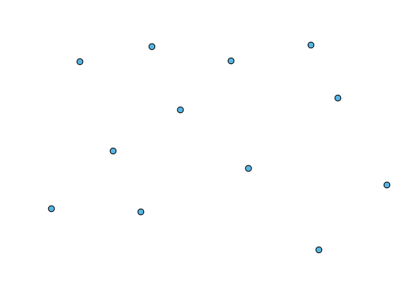
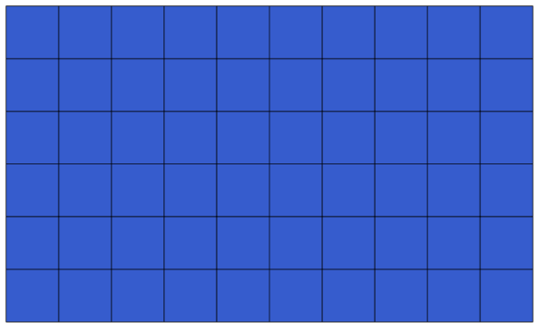

More algorithms and data types
============================================================

.. note:: In this lesson we will run three more algorithms, learn how to use other input types, and configure outputs to be saved to a given folder automatically.

For this lessons we will need a table and a polygons layer. We are going to create a points layer based on coordinates in the table, and then count the number of points in each polygon. If you open the QGIS project corresponding to this lesson, you will find a table with X and Y coordinates, but you will find no polygons layer. Don't worry, we will create it using a processing geoalgorithm.

The first thing we are going to do is to create a points layer from the coordinates in the table, using the *Points layer from table* algorithm. You now know how to use the search box, so it should not be hard for you to find it. Double--click on it to run it and get to its following dialog.

This algorithm, like the one from the previous lesson, just generates a single output, and it has three inputs:

- Table: the table with the coordinates. You should select here the table from the lesson data.
- X an Y fields: these two parameters are linked to the first one. The corresponding selector will show the name of those fields that are available in the selected table. Select the *XCOORD* field for the *X* parameter, and the *YYCOORD* field for the *Y* parameter.
- CRS: Since this algorithm takes no input layers, it cannot assign a CRS to the output layer based on them. Instead, it asks you to manually select the CRS that the coordinates in the table use. Click on the button on the left--hand side to open the QGIS CRS selector, and select EPSG:4326 as the output CRS. We are using this CRS because the coordinates in the table are in that CRS.

Your dialog should look like this.

.. image:: img/second_alg/points_from_table.png

Now press the *Run* button to get the following layer:

The next thing we need is the polygon layer. We are going to create a regular grid of polygons using the *Create graticule* algorithm, which has the following parameters dialog.

.. image:: img/second_alg/graticule_dialog.png

The inputs required to create the grid are all numbers. When you have to enter a numerical value, you have two options: typing it directly on the corresponding box or clicking the button on the right--hand side to get to a dialog like the one shown next.

.. image:: img/second_alg/number_dialog.png

The dialog contains a simple calculator, so you can type expressions such as ``11 * 34.7 + 4.6``, and the result will be computed and put in the corresponding text box in the parameters dialog. Also, it contains constants that you can use, and values from other layers available.

In this case, we want to create a grid that covers the extent of the inut points layer, so we should use its coordinates to calculate the center coordinate of the grid and its width and height, since those are the parameters that the algorithm takes to create the grid. o a little bit of math and try to do that yourself using the calculator dialog and the constants from the input points layer. 

Select *Rectangles (polygons)* in the *Type* field.

As in the case of the last algorithm, we have to enter the CRS here as well. Select EPSG:4326 as the target CRS, as we did before.

In the end, you should have a parameters dialog like this:

.. image:: img/second_alg/graticule_parameters.png

Press *Run* and you will get the graticule layer.

The last step is to count the points in each on of the rectangles of that graticule. We will use the *Count points in polygons* algorithm.

.. image:: img/second_alg/count_points.png

Now we have the result we were looking for.

Before finishing this lesson, here is a quick tip to make your life easier in case you want to persistently save your data. If you want all your output files to be saved in a given folder, you do not have to type the folder name each time. Instead, go to the processing menu and select the * Options and configuration* item. It will open the configuration dialog.

.. image:: img/second_alg/config.png

In the *Output folder* entry that you will find in the *General* group, type the path to your destination folder.

.. image:: img/second_alg/output_folder.png

Now when you run an algorithm, just use the filename instead of the full path. For instance, with the configuratino shown above, if you enter ``graticule.shp`` as the output path for the algorithm that we have just used, the result will be saved in ``D:\processing_output\graticule.shp``. You can still enter a full path in case you want a result to be saved in a different folder.

Try yourself the *Create grid* algorithm with different grid sizes, and also with different types of grids. We will use the hexagonal one in a later chapter.