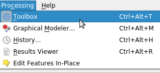
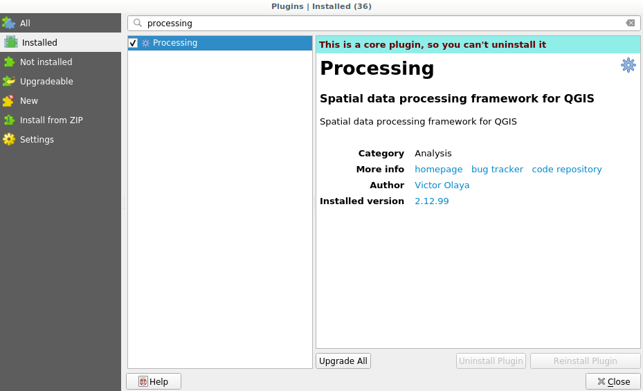
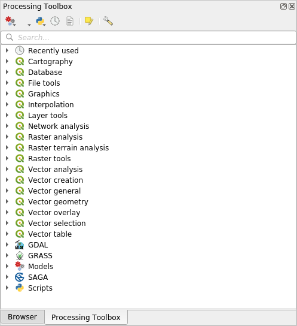

Setting-up the processing framework
====================================

The first thing to do before using the processing framework is to configure it. There is not much to set-up, so this is an easy task. 

Later on we will show how to configure the external applications that are used for extending the list of available algorithms, but for now we are just going to work with the framework itself.

The processing framework is a core QGIS plugin, which means that, if you are running QGIS 2.0 or later, it should already be installed in your system, since it is included with QGIS. In case it is active, you should see a menu called *Processing* in your menu bar. There you will find an access to all the framework components.

If you cannot find that menu, you have to enable the plugin by going to the plugin manager and activating it.

The main element that we are going to work with is the toolbox. Click on the corresponding menu entry and you will see the toolbox docked at the right side of the QGIS window.

The toolbox contains a list of all the available algorithms, divided in groups. There are two ways of displaying and organizing those algorithms: the *Advanced interface* and the *Simplified interface*.

By default, you will see the simplified mode, which groups algorithms according to the kind of operation they perform. Although some of the algorithms that you will see in the toolbox depend on other external applications (most of them do, in fact), you will not see any mention to those applications. The origin of algorithms is hidden in this mode, which is a facade that simplifies using algorithms through the processing framework.

First examples in this guide only use the simplified mode. The advanced mode has some additional features and algorithms, but it requires understanding the applications that are called, so they are a more advanced topic, and will be explained later on.

You can change between the simplified and the advanced interface by using the selector on the bottom part of the toolbox.

The toolbox box, when using the advanced mode, looks like this.

.. image:: img/set_up/toolbox_advanced.png

If you have reached this point, now you are ready to use geoalgorithms. There is no need to configure anything else by now. We can already run our first algorithm, which we will do in the next lesson.
