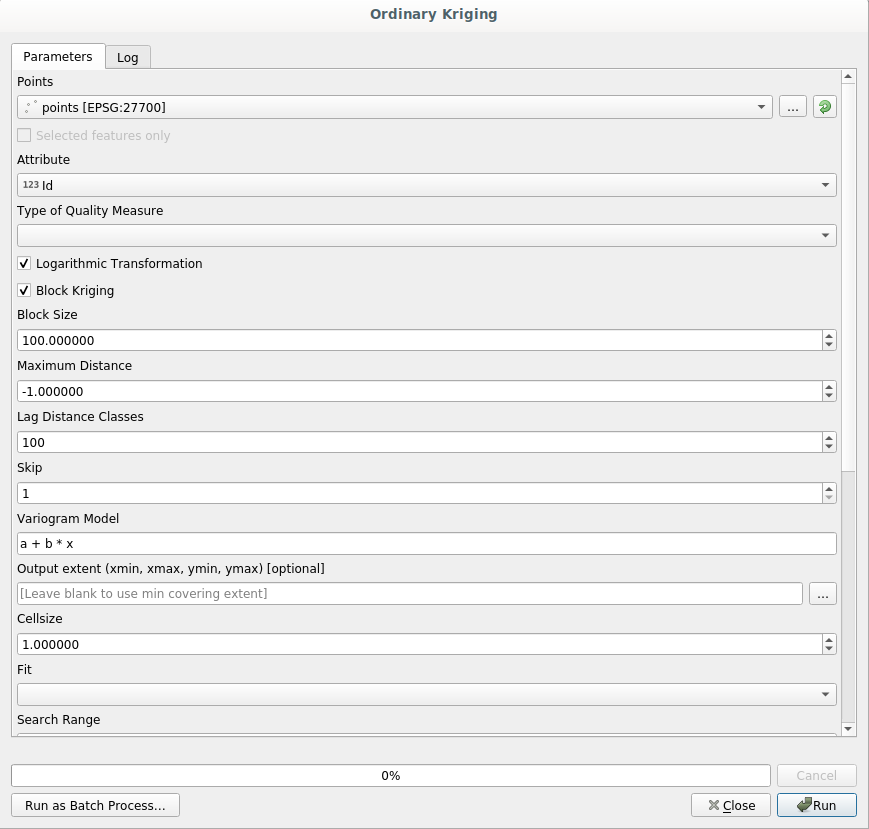

An important warning before starting
============================================================

Just like the manual of a word processor doesn't teach you how to write a novel or a poem, or a CAD tutorial doesn't show you how to calculate the size of a beam for a building, this guide will not teach you spatial analysis. Instead, it will show you how to use the QGIS processing framework, a powerful tool for performing spatial analysis, but it is up to you to learn the required concepts that are needed to understand that type of analysis. Without them, there is no point on using the framework and its algorithms, although you might be tempted to try.

Let's show this more clearly with an example.

Given a set of points and a value of a given variable value at each point, you can calculate a raster layer from them using the *Kriging* geoalgorithm. The parameters dialog for that module is like the following one.

It look complex, right? 

By reading this manual, you will learn things such as how to use that module, how to run it in a batch process to create raster layers from hundreds of points layers in a single run, or what happens if the input layer has some points selected. However, the parameters themselves are not explained. A seasoned analyst with a good knowledge of geostatistics will have no problem understanding those parameters. If you are not one of them and *sill*, *range*, or *nugget* are not familiar concepts to you, then you should not use the *Kriging* module. More than that, you are far from being ready to use the *Kriging* module, since it requires learning about concepts such as spatial autocorrelation or semivariograms, which probably you also haven't heard before, or at least haven't studied long enough. You should first study and understand them, and then come back to QGIS to actually run it and perform the analysis. Ignoring this will result in wrong results and poor (and most likely useless) analysis.

Although not all algorithms are as complex as kriging (but some of them are even more complex!), almost all of them require understanding the fundamental analysis ideas that they are based on. Without that knowledge, using them will most likely lead to poor results.

Using geoalgorithms without having a good foundation of spatial analysis is like trying to write a novel without knowing anything about grammar or syntax, and having no knowledge about storytelling. You might get a result, but it is likely to have no value at all.  Please, don't fool yourself and think that after reading this guide you are already capable of performing spatial analysis and get sound results. You need to study spatial analysis as well.

Here is a good reference that you can read to learn more about spatial data analysis.

*Geospatial Analysis (3rd Edition)*: A Comprehensive Guide to Principles, Techniques and Software Tools
Michael John De Smith, Michael F. Goodchild, Paul A. Longley

It is available online `here <http://www.spatialanalysisonline.com/>`_

