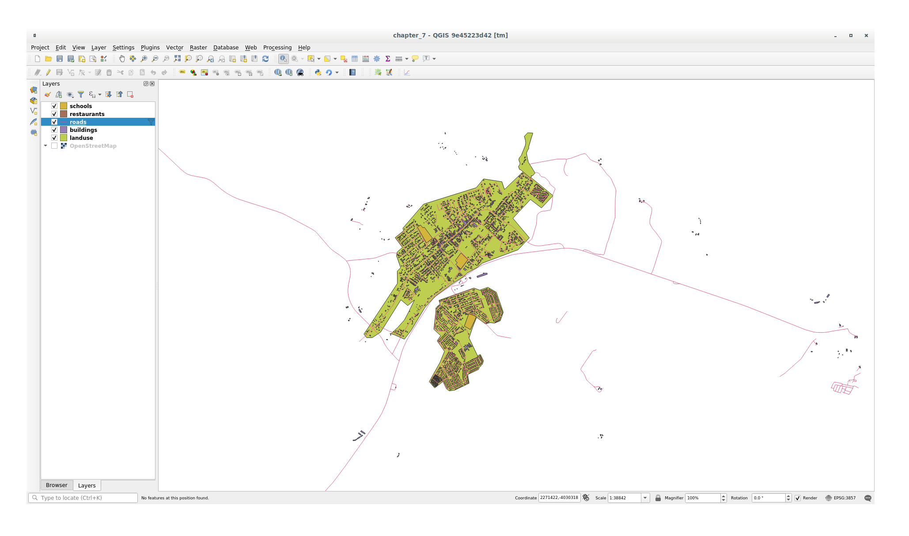
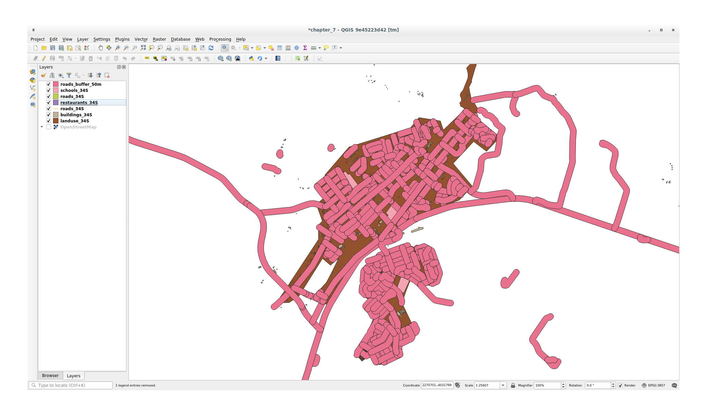
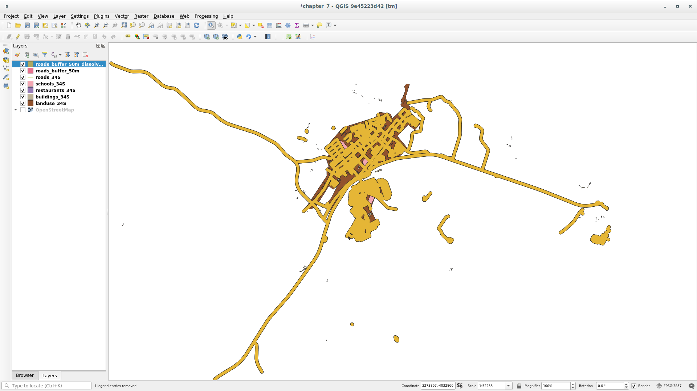

.. only:: html

   |updatedisclaimer|

|LS| Vector Analysis
===============================================================================

Vector data can also be analyzed to reveal how different features interact with
each other in space. There are many different analysis-related functions in
GIS, so we won't go through them all. Rather, we'll pose a question and try to
solve it using the tools that QGIS provides.

**The goal for this lesson:** To ask a question and solve it using analysis
tools.

|basic| The GIS Process
-------------------------------------------------------------------------------

Before we start, it would be useful to give a brief overview of a process that
can be used to solve any GIS problem. The way to go about it is:

#. State the Problem
#. Get the Data
#. Analyze the Problem
#. Present the Results

|basic| The Problem
-------------------------------------------------------------------------------

Let's start off the process by deciding on a problem to solve. For example,
you are an estate agent and you are looking for a residential property in
|majorUrbanName| for clients who have the following criteria:

#. It needs to be in |majorUrbanName|
#. It must be within reasonable driving distance of a school (say 1km)
#. It must be more than 100m squared in size
#. Closer than 50m to a main road
#. Closer than 500m to a restaurant

|basic| The Data
-------------------------------------------------------------------------------

To answer these questions, we're going to need the following data:

#. The residential properties (buildings) in the area
#. The roads in and around the town
#. The location of schools and restaurants
#. The size of buildings

All of this data is available through OSM and you should find that the dataset
you have been using throughout this manual can also be used for this lesson.

If you want to download data from another area jump to
:ref:`Introduction Chapter <tm_preparing_data>` section to read how to do it.

.. note:: Although OSM downloads have consistent data fields, the coverage and
    detail does vary. If you find that your chosen region does not contain
    information on restaurants, for example, you may need to chose a different
    region.

|basic| |FA| Start a Project and get the Data
-------------------------------------------------------------------------------

We first need to load the data to work with.

#. Start a new QGIS project
#. If you want you can add a background map. Open the :guilabel:`Browser` and load
   the :guilabel:`OSM` background map from the :guilabel:`XYZ Tiles` menu.

   .. image:: img/osm_swellendam.png
      :align: center

#. In the :file:`training_data.gpkg` Geopackage database load all the files we will
   use in this chapter:

   #. ``landuse``
   #. ``buildings``
   #. ``roads``
   #. ``restaurants``
   #. ``schools``

#. Zoom to the layer extent to see |majorUrbanName|, South Africa

Before proceeding we should filter the :guilabel:`roads` layer in order to have
only some specific road types to work with.

Some of the roads in OSM dataset are listed as ``unclassified``, ``tracks``,
``path`` and ``footway``. We want to exclude these from our dataset and focus on
the other road types, more suitable for this exercise.

Moreover, OSM data might not be updated everywhere and we will also exclude
``NULL`` values.

#. Right click on the :guilabel:`roads` layer and choose :guilabel:`Filter...`.
#. In the dialog that pops up we can filter these features with the following
   expression::

    "highway" NOT IN ('footway','path','unclassified','track') OR "highway" != NULL

   The concatenation of the two operators ``NOT`` and ``IN`` means to exclude all
   the unwanted features that have these attributes in the ``highway`` field.

   ``!= NULL`` combined with the ``OR`` operator is excluding roads with no values
   in the ``highway`` field.

   You will note the |indicatorFilter| icon next to the :guilabel:`roads` layer
   that helps you remember that this layer has a filter activated and not all the
   features are available in the project.

The map with all the data should look like the following one:

|basic| |TY| Convert Layers' CRS
-------------------------------------------------------------------------------

Because we are going to be measuring distances within our layers, we need to
change the layers' CRS. To do this, we need to select each layer in turn,
save the layer to a new one with our new projection, then import that new
layer into our map.

You have many different options, e.g. you can export each layer as a new
Shapefile, you can append the layers to an existing GeoPackage file or you can
create another GeoPackage file and fill it with the new reprojected layers. We
will show the last option so the :file:`training_data.gpkg` will remain clean.
But feel free to choose the best workflow for yourself.

.. note:: In this example, we are using the
    :guilabel:`WGS 84 / UTM zone 34S` CRS, but you may use a UTM CRS which is
    more appropriate for your region.

#. Right click the :guilabel:`roads` layer in the :guilabel:`Layers` panel;
#. Click :guilabel:`Export --> Save Features As...`;
#. In the :guilabel:`Save Vector Layer As` dialog choose :guilabel:`GeoPackage`
   as :guilabel:`Format`;
#. Click on |browseButton| of :guilabel:`File name` parameter and name the new
   GeoPackage as :guilabel:`vector_analysis`;
#. Change the :guilabel:`Layer name` as :guilabel:`roads_34S`;
#. Change the :guilabel:`CRS` parameter to :guilabel:`WGS 84 / UTM zone 34S`;
#. Finally click on :guilabel:`OK`:

   .. image:: img/save_roads_34S.png
      :align: center

   This will create the new GeoPackage database and fill it with the
   :guilabel:`roads_34S` layer.

#. Repeat this process for each layer, creating a new layer in the
   :file:`vector_analysis.gpkg` GeoPackage file with ``_34S`` appended to the
   original name and removing each of the old layers from the project.

   .. note:: When you choose to save a layer to an existing GeoPackage, QGIS will
      **append** that layer in the GeoPackage.

#. Once you have completed the process for each layer, right click on any layer and
   click :guilabel:`Zoom to layer extent` to focus the map to the area of interest.

Now that we have converted OSM's data to a UTM projection, we can begin our
calculations.

|basic| |FA| Analyzing the Problem: Distances From Schools and Roads
-------------------------------------------------------------------------------

QGIS allows you to calculate distances from any vector object.

#. Make sure that only the :guilabel:`roads_34S` and :guilabel:`buildings_34S`
   layers are visible, to simplify the map while you're working
#. Click on the :menuselection:`Processing --> Toolbox` to open the analytical
   *core* of QGIS. Basically: **all** algorithms (for vector **and** raster)
   analysis are available within this toolbox.
#. We start by calculating the area around the :guilabel:`roads_34S` by using the
   :guilabel:`Buffer` algorithm. You can find it expanding the
   :menuselection:`Vector Geometry` group.

   .. image:: img/processing_buffer_1.png
      :align: center

   Or you can type ``buffer`` in the search menu in the upper part of the toolbox:

   .. image:: img/processing_buffer_2.png
      :align: center

#. Double click on it to open the algorithm dialog
#. Set it up like this

   .. image:: img/vector_buffer_setup.png
      :align: center

#. The default :guilabel:`Distance` is in meters because our input dataset is in
   a Projected Coordinate System that uses meter as its basic measurement unit.
   You can use the combo box to choose other projected units like kilometers,
   yards, etc.

   .. note:: If you are trying to make a buffer on a layer with a Geographical
       Coordinate System, Processing will warn you and suggest to reproject the
       layer to a metric Coordinate System.

#. By default Processing creates temporary layers and adds them to the
   :guilabel:`Layers` panel. You can also append the result to the GeoPackage
   database by:
   
   #. clicking on the |browseButton| button and choose :guilabel:`Save to GeoPackage...`
   #. naming the new layer :guilabel:`roads_buffer_50m`
   #. and saving it in the :file:`vector_analysis.gpkg` file

   .. image:: img/buffer_saving.png
      :align: center

#. Click on :guilabel:`Run` and then close the :guilabel:`Buffer` dialog.

Now your map will look something like this:

If your new layer is at the top of the :guilabel:`Layers` list, it will probably
obscure much of your map, but this gives you all the areas in your region which are
within 50m of a road.

However, you'll notice that there are distinct areas within your buffer, which
correspond to all the individual roads. To get rid of this problem:

#. Uncheck the :guilabel:`roads_buffer_50m` layer and re-create the buffer using
   the settings shown here:

   .. image:: img/dissolve_buffer_setup.png
      :align: center

   Note that we're now checking the :guilabel:`Dissolve result` box
#. Save the output as :guilabel:`roads_buffer_50m_dissolved`
#. Click :guilabel:`Run` and close the :guilabel:`Buffer` dialog again

Once you've added the layer to the :guilabel:`Layers` panel, it will look like
this:

Now there are no unnecessary subdivisions.

.. note:: The *Short Help* on the right side of the dialog explains how the
    algorithm works. If you need more information, just click on the :guilabel:`Help`
    button in the bottom part to open a more detailed guide of the algorithm.

.. _backlink-vector-analysis-basic-1:

|basic| |TY| Distance from schools
-------------------------------------------------------------------------------

Use the same approach as above and create a buffer for your schools.

It needs to be :guilabel:`1 km` in radius. Save the new layer in the
:file:`vector_analysis.gpkg` file as :guilabel:`schools_buffer_1km_dissolved`.

:ref:`Check your results <vector-analysis-basic-1>`

|basic| |FA| Overlapping Areas
-------------------------------------------------------------------------------

Now we have areas where the road is 50 meters away and there's a school within
1 km (direct line, not by road). But obviously, we only want the areas where
both of these criteria are satisfied. To do that, we'll need to use the
:guilabel:`Intersect` tool. You can find it in :menuselection:`Vector Overlay`
group within :menuselection:`Processing --> Toolbox`.

#. Set it up like this:

   .. image:: img/school_roads_intersect.png
      :align: center

   * The input layers are the two buffers
   * The saving location is, once again, the :file:`vector_analysis.gpkg` GeoPackage
   * And the output layer name is :guilabel:`road_school_buffers_intersect`

#. Click :guilabel:`Run`.

   In the image below, the blue areas show us where both distance criteria are
   satisfied at once!

   .. image:: img/intersect_result.png
      :align: center

#. You may remove the two buffer layers and only keep the one that shows where
   they overlap, since that's what we really wanted to know in the first place:

   .. image:: img/final_intersect_result.png
      :align: center

.. _select-by-location:

|basic| |FA| Extract the Buildings
-------------------------------------------------------------------------------

Now you've got the area that the buildings must overlap. Next, you want to
extract the buildings in that area.

#. Look for the menu entry :menuselection:`Vector Selection --> Extract by location`
   within :menuselection:`Processing --> Toolbox`
#. Set up the algorithm dialog like in the following picture

   .. image:: img/location_select_dialog.png
      :align: center

#. Click :guilabel:`Run` and then close the dialog
#. You'll probably find that not much seems to have changed. If so, move the
   :guilabel:`well_located_houses` layer to the top of the layers list, then
   zoom in.

   .. image:: img/select_zoom_result.png
      :align: center

   The red buildings are those which match our criteria, while the buildings
   in green are those which do not.

#. Now you have two separated layers and can remove :guilabel:`buildings_34S`
   from layer list.

.. _backlink-vector-analysis-basic-2:

|moderate| |TY| Further Filter our Buildings
-------------------------------------------------------------------------------

We now have a layer which shows us all the buildings within 1km of a school and
within 50m of a road. We now need to reduce that selection to only show
buildings which are within 500m of a restaurant.

Using the processes described above, create a new layer called
:guilabel:`houses_restaurants_500m` which further filters
your :guilabel:`well_located_houses` layer to show only those which are within
500m of a restaurant.

:ref:`Check your results <vector-analysis-basic-2>`

|basic| |FA| Select Buildings of the Right Size
-------------------------------------------------------------------------------

To see which buildings are of the correct size (more than 100 square meters),
we first need to calculate their size.

#. Select the :guilabel:`houses_restaurants_500m` layer and open the
   :guilabel:`Field Calculator` by clicking on the |calculateField| button in
   the main toolbar or within the attribute table
#. Set it up like this

   .. image:: img/buildings_area_calculator.png
      :align: center

   We are creating the new field :guilabel:`AREA` that will contain the area of
   each building square meters.
#. Click :guilabel:`OK`.
   The :guilabel:`AREA` field has been added at the end of the attribute table.
#. Click the edit mode button again to finish editing, and save your edits
   when prompted.
#. Build a query as earlier in this lesson

   .. image:: img/buildings_area_query.png
      :align: center

#. Click :guilabel:`OK`.

Your map should now only show you those buildings which
match our starting criteria and which are more than 100m squared in size.

|basic| |TY|
-------------------------------------------------------------------------------

Save your solution as a new layer, using the approach you learned above for
doing so. The file should be saved within the same GeoPackage database, with
the name :guilabel:`solution`.

|IC|
-------------------------------------------------------------------------------

Using the GIS problem-solving approach together with QGIS vector analysis
tools, you were able to solve a problem with multiple criteria quickly and
easily.

|WN|
-------------------------------------------------------------------------------

In the next lesson, we'll look at how to calculate the shortest distance along
the road from one point to another.

.. Substitutions definitions - AVOID EDITING PAST THIS LINE
   This will be automatically updated by the find_set_subst.py script.
   If you need to create a new substitution manually,
   please add it also to the substitutions.txt file in the
   source folder.

.. |FA| replace:: Follow Along:
.. |IC| replace:: In Conclusion
.. |LS| replace:: Lesson:
.. |TY| replace:: Try Yourself
.. |WN| replace:: What's Next?
.. |basic| image:: /static/global/basic.png
.. |browseButton| image:: /static/common/browsebutton.png
   :width: 2.3em
.. |calculateField| image:: /static/common/mActionCalculateField.png
   :width: 1.5em
.. |indicatorFilter| image:: /static/common/mIndicatorFilter.png
   :width: 1.5em
.. |majorUrbanName| replace:: Swellendam
.. |moderate| image:: /static/global/moderate.png
.. |updatedisclaimer| replace:: :disclaimer:`Docs in progress for 'QGIS testing'. Visit https://docs.qgis.org/3.4 for QGIS 3.4 docs and translations.`
