.. only:: html

   |updatedisclaimer|

|LS| Vector Analysis
===============================================================================

Vector data can also be analyzed to reveal how different features interact with
each other in space. There are many different analysis-related functions in
GIS, so we won't go through them all. Rather, we'll pose a question and try to
solve it using the tools that QGIS provides.

**The goal for this lesson:** To ask a question and solve it using analysis
tools.

|basic| The GIS Process
-------------------------------------------------------------------------------

Before we start, it would be useful to give a brief overview of a process that
can be used to solve any GIS problem. The way to go about it is:

1. State the Problem
2. Get the Data
3. Analyze the Problem
4. Present the Results

|basic| The Problem
-------------------------------------------------------------------------------

Let's start off the process by deciding on a problem to solve. For example,
you are an estate agent and you are looking for a residential property in
|majorUrbanName| for clients who have the following criteria:

#. It needs to be in |majorUrbanName|.
#. It must be within reasonable driving distance of a school (say 1km).
#. It must be more than 100m squared in size.
#. Closer than 50m to a main road.
#. Closer than 500m to a restaurant.

|basic| The Data
-------------------------------------------------------------------------------

To answer these questions, we're going to need the following data:

#. The residential properties (buildings) in the area.
#. The roads in and around the town.
#. The location of schools and restaurants.
#. The size of buildings.

All of this data is available through OSM and you should find that the dataset
you have been using throughout this manual can also be used for this lesson.

.. note:: Although OSM downloads have consistent data fields, the coverage and
    detail does vary. If you find that your chosen region does not contain
    information on restaurants, for example, you may need to chose a different
    region.

|basic| |FA| Start a Project and get the Data
-------------------------------------------------------------------------------

We first need to load the data to work with.

* Start a new QGIS project.
* Before to load all the data we will add a background map. Open the :guilabel:`Browser`
  and load the :guilabel:`OSM` background map from the :guilabel:`XYZ Tiles` menu.
* Once the map is loaded zoom to |majorUrbanName|, South Africa.

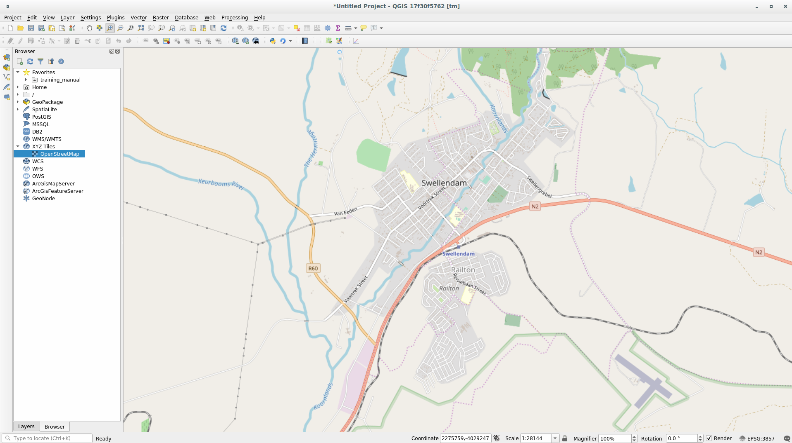

In the :file:`training_data.gpkg` Geopackage database load all the file we will
use in this chapter:

#. ``landuse``
#. ``buildings``
#. ``roads``
#. ``restaurants``
#. ``schools``

.. note:: all these data have been downloaded with the :guilabel:`QuickOSM` plugin.
    You can replicate the same analysis in another location by downloading the
    same data. Follow the :ref:`Introduction Chapter <tm_preparing_data>` for more
    information.

Before to proceed we should *filter* the :guilabel:`roads` layer in order to have
only some specific road types to work with.

Some of the roads in OSM’s dataset are listed as ``unclassified``, ``tracks``,
``path`` and ``footway``. We want to exclude these from our roads dataset.

Right click on the :guilabel:`roads` layer and choose :guilabel:`Filter...`. In
the dialog that pops up we can *filter* these features with the following
expression::

  "highway" NOT IN ('footway','path','unclassified','track')

The concatenation of the two operators ``NOT`` and ``IN`` means to exclude all
the unwanted features that have these attributes in the ``highway`` field.

You will note the |indicatorFilter| icon next to the :guilabel:`roads` layer that
helps you to remember that this layer has a filter activated and not all features
are shown in the map.

The map with all the data should look like the following one:

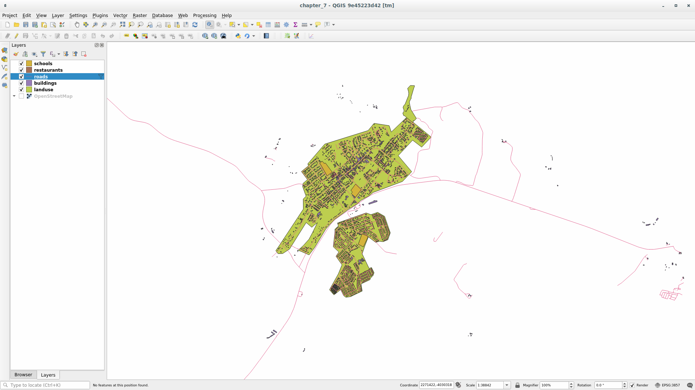

|basic| |TY| Convert Layers' CRS
-------------------------------------------------------------------------------

Because we are going to be measuring distances within our layers, we need to
change the layers' CRS. To do this, we need to select each layer in turn,
save the layer to a new one with our new projection, then import that new
layer into our map.

You have many different options: you can export each layer as a new shapefile,
you can append the layers to an existing GeoPackage file or you can create another
GeoPackage file and fill it with the new reprojected layers. We will
show the last option so the :file:`training_data.gpkg` will remain clean. But
feel free to choose the best workflow for yourself.

.. note:: In this example, we are using the
    :guilabel:`WGS 84 / UTM zone 34S` CRS, but you may use a UTM CRS which is
    more appropriate for your region.

* Right click the :guilabel:`roads` layer in the :guilabel:`Layers` panel.
* Click :menuselection:`Export --> Save Features As...`
* In the :menuselection:`Save Vector Layer As` dialog, choose the following
  settings and click **[[OK]]** (making sure you select :kbd:`Add saved file to map`):

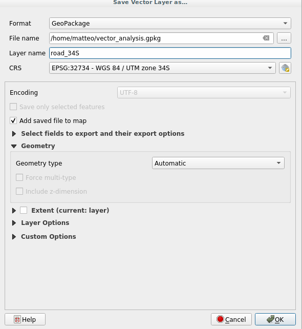

This will create the new GeoPackage database and fill it with the :guilabel:`roads_34S`
layer. To see the new GeoPackage and all the layers you need to add the connection
in the :guilabel:`Browser` Panel.

* Open the :guilabel:`Browser` Panel.
* Right click on GeoPackage and choose :guilabel:`New Connection...`.
* Browse to the location where you saved the file to set up the connection.

* You can now remove the :guilabel:`roads`.

Repeat this process for each layer, creating a new layer in the GeoPackage file
with ``_34S`` appended to the original name and removing each of the old layers.

.. note:: When you choose to save a layer in an existing GeoPackage, QGIS will
    **append** that layer in the GeoPackage, not creating a new file.

Once you have completed the process for each layer, right click on any layer and
click :guilabel:`Zoom to layer extent` to focus the map to the area of interest.

Now that we have converted OSM's data to a UTM projection, we can begin our
calculations.

|basic| |FA| Analyzing the Problem: Distances From Schools and Roads
-------------------------------------------------------------------------------

QGIS allows you to calculate distances from any vector object.

* Make sure that only the :guilabel:`roads_34S` and
  :guilabel:`buildings_34S` layers are visible, to simplify the map while
  you're working.
* Click on the :menuselection:`Processing --> Toolbox` to open the analytical
  *core* of QGIS. Basically: **all** algorithms (for vector **and** raster) analysis
  are available within this toolbox.

.. note:: :guilabel:`Processing` has its own Training Manual chapter (see :ref:`processing_tm`).
    It is extremely powerful but also complex.

* We start by calculating the area around the :guilabel:`roads_34S` will use the
  :guilabel:`Buffer` algorithm. You can find it in the
  :menuselection:`Vector Geometry --> Buffer`:

  .. image:: img/processing_buffer_1.png
     :align: center

  Or you can type ``buffer`` in the more comfortable search menu in the upper part
  of the toolbox:

  .. image:: img/processing_buffer_2.png
     :align: center

Double click on it to open the algorithm dialog.

* Set it up like this:

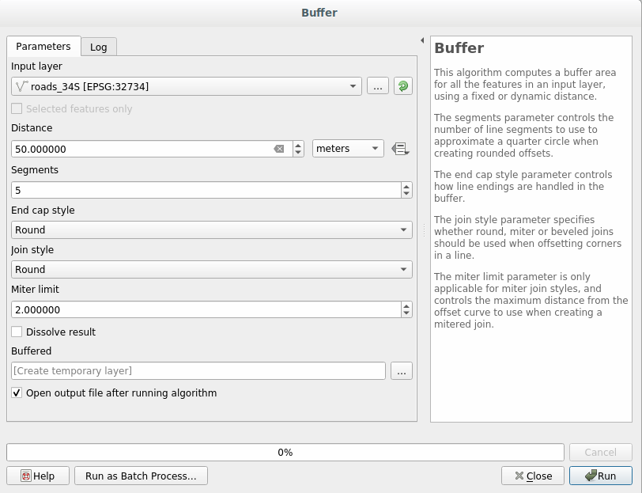

The default :guilabel:`Distance` is in meters because our input dataset is in a
Projected Coordinate System that uses meter as its basic measurement unit.
You can use the combo box to choose other projected units like kilometers, yards,
etc.

.. warning:: If you are trying to make a buffer on a layer with a Geographical
    Coordinate System, Processing will warn you and suggest to reproject the
    layer to a metric Coordinate System.

* By default Processing creates temporary layer and adds them to the :guilabel:`Layer`
  Panel. You can easily append the result to the GeoPackage database by clicking
  on the |browseButton| button. Name the new layer :guilabel:`roads_buffer_50m`:

  .. image:: img/buffer_saving.png
     :align: center

* Click on **[Run]** and then close the :guilabel:`Buffer` dialog.

Now your map will look something like this:

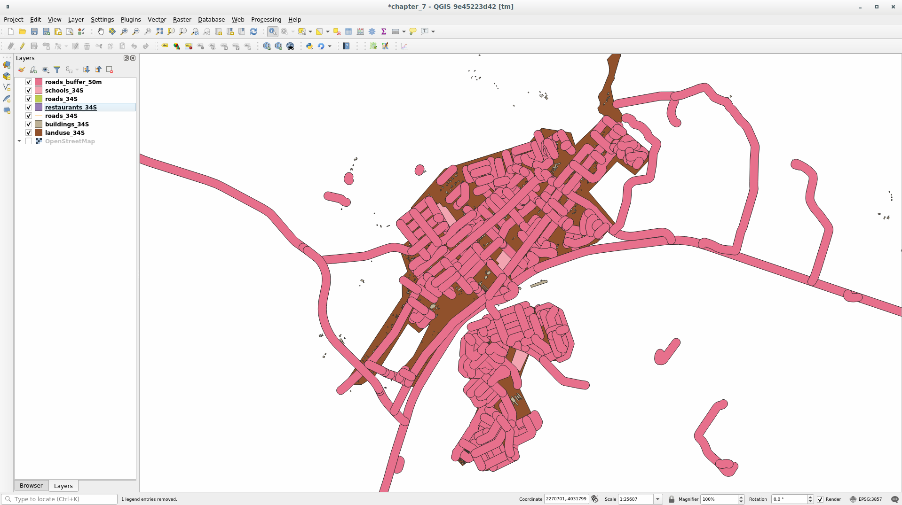

If your new layer is at the top of the :guilabel:`Layers` list, it will probably
obscure much of your map, but this gives us all the areas in your region which are
within 50m of a road.

However, you'll notice that there are distinct areas within our buffer, which
correspond to all the individual roads. To get rid of this problem, uncheck the
:guilabel:`roads_buffer_50m` layer and re-create the buffer using the settings
shown here:

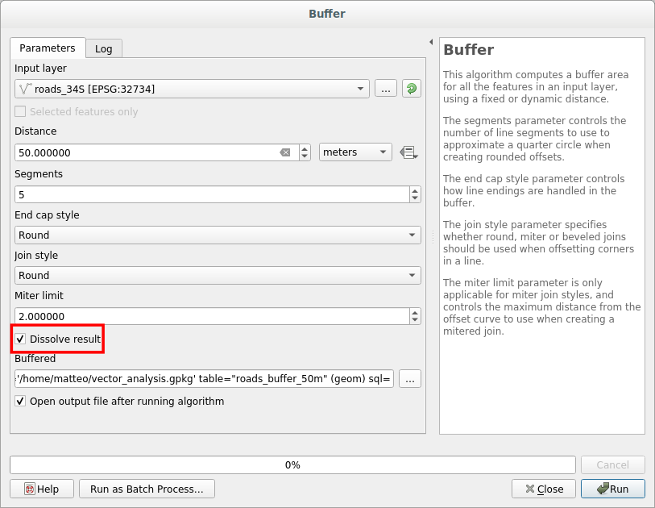

* Note that we're now checking the :guilabel:`Dissolve result` box.
* Save the output under the same name as :guilabel:`roads_buffer_50m_dissolved`,
  always appending the layer to the GeoPackage database.
* Click **[Run]** and close the :guilabel:`Buffer` dialog again.

Once you've added the layer to the :guilabel:`Layers` panel, it will look like
this:

Now there are no unnecessary subdivisions.

.. note:: If you have any doubt on an algorithm, please ready carefully the
    *Short Help* on the right side of the dialog. If you need more information,
    just click on the **[Help]** button in the bottom part to open a more
    detailed guide of the algorithm.

.. _backlink-vector-analysis-basic-1:

|basic| |TY| Distance from schools
-------------------------------------------------------------------------------

Use the same approach as above and create a buffer for your schools.

It needs to be :guilabel:`1 km` in radius, and saved under the usual directory as
:guilabel:`schools_buffer_1km_dissolved.shp`.

:ref:`Check your results <vector-analysis-basic-1>`

|basic| |FA| Overlapping Areas
-------------------------------------------------------------------------------

Now we have areas where the road is 50 meters away and there's a school within
1 km (direct line, not by road). But obviously, we only want the areas where
both of these criteria are satisfied. To do that, we'll need to use the
:guilabel:`Intersect` tool. Find it under :menuselection:`Vector Overlay -->  Intersect`
within :menuselection:`Processing --> Toolbox`. Set it up like this:

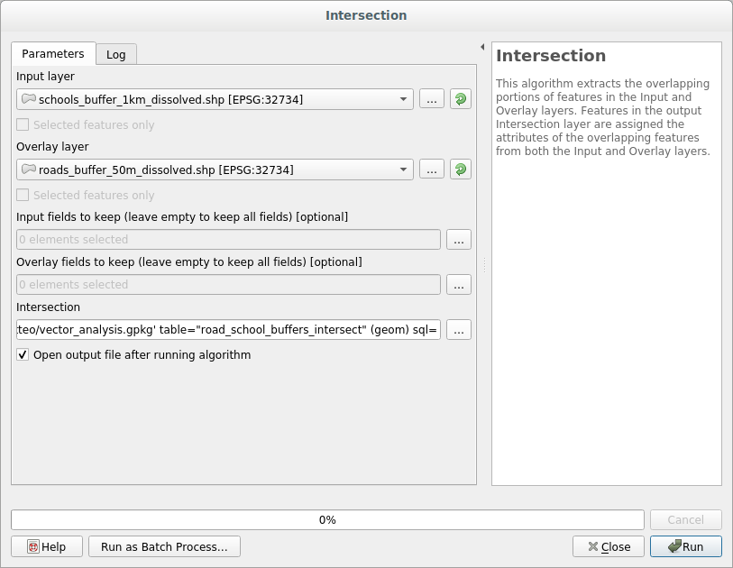

The two input layers are the two buffers; the saving location is as usual in the
existing GeoPackage; and the file name is :guilabel:`road_school_buffers_intersect`.
Once it's set up like this, click **[Run]**:

In the image below, the blue areas show us where both distance criteria are
satisfied at once!

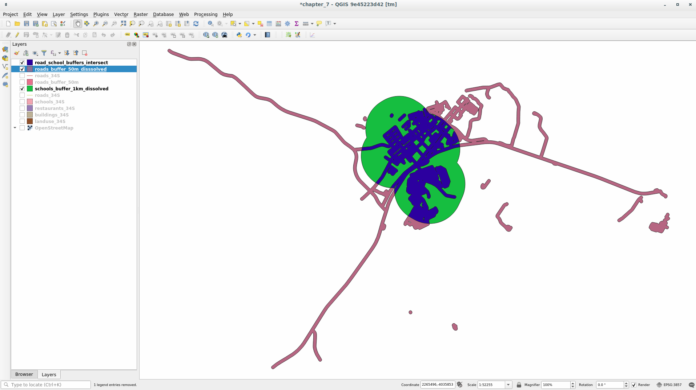

You may remove the two buffer layers and only keep the one that shows where
they overlap, since that's what we really wanted to know in the first place:

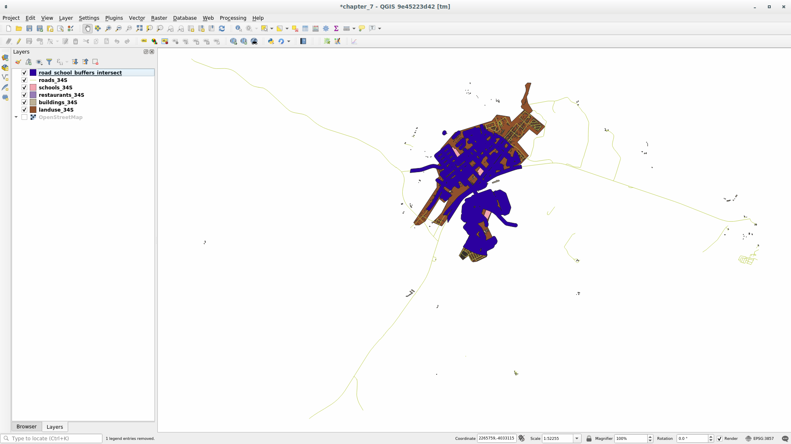

.. _select-by-location:

|basic| |FA| Extract the Buildings
-------------------------------------------------------------------------------

Now you've got the area that the buildings must overlap. Next, you want to
extract the buildings in that area.

* Look for on the menu entry :menuselection:`Vector Selection --> Extract by location`
  within :menuselection:`Processing --> Toolbox`.

* Set up the algorithm dialog like the following picture:

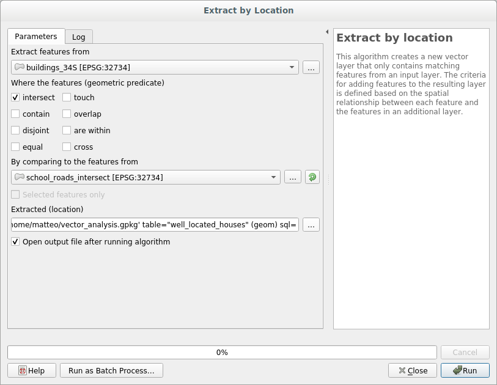

* Click **[Run]** and then close the dialog.
* You'll probably find that not much seems to have changed. If so, move the
  :guilabel:`well_located_houses` layer to the top of the layers list, then
  zoom in:

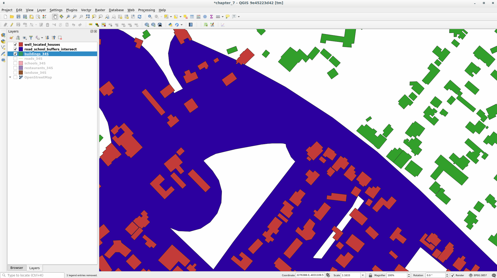

The red buildings are those which match our criteria, while the buildings in green
are those which do not.

Now you have two separated layers and can remove :guilabel:`buildings_34S`  from
layer list.

.. _backlink-vector-analysis-basic-2:

|moderate| |TY| Further Filter our Buildings
-------------------------------------------------------------------------------

We now have a layer which shows us all the buildings within 1km of a school and
within 50m of a road. We now need to reduce that selection to only show
buildings which are within 500m of a restaurant.

Using the processes described above, create a new layer called
:guilabel:`houses_restaurants_500m` which further filters
your :guilabel:`well_located_houses` layer to show only those which are within
500m of a restaurant.

:ref:`Check your results <vector-analysis-basic-2>`

|basic| |FA| Select Buildings of the Right Size
-------------------------------------------------------------------------------

To see which buildings are the correct size (more than 100 square meters), we
first need to calculate their size.

* Select the :guilabel:`houses_restaurants_500m` layer and open the :guilabel:`Field Calculator`
  by clicking on the |calculateField| button in the main toolbar or within the
  attribute table.
* Set it up like this:

.. image:: img/buildings_area_calculator.png
   :align: center

* We are creating the new field :guilabel:`AREA` that will contain the area in
  square meters of each building.
* Click **[OK]**.
* The :guilabel:`AREA` field has been added to the end of the attribute table.
* Click the edit mode button again to finish editing, and save your edits
  when prompted.
* Build a query as earlier in this lesson:

.. image:: img/buildings_area_query.png
   :align: center

* Click **[OK]**. Your map should now only show you those buildings which
  match our starting criteria and which are more than 100m squared in size.

|basic| |TY|
-------------------------------------------------------------------------------

Save your solution as a new layer, using the approach you learned above for
doing so. The file should be saved within the same GeoPackage database, with
the name :guilabel:`solution`.

|IC|
-------------------------------------------------------------------------------

Using the GIS problem-solving approach together with QGIS vector analysis
tools, you were able to solve a problem with multiple criteria quickly and
easily.

|WN|
-------------------------------------------------------------------------------

In the next lesson, we'll look at how to calculate the shortest distance along
the road from one point to another.

.. Substitutions definitions - AVOID EDITING PAST THIS LINE
   This will be automatically updated by the find_set_subst.py script.
   If you need to create a new substitution manually,
   please add it also to the substitutions.txt file in the
   source folder.

.. |FA| replace:: Follow Along:
.. |IC| replace:: In Conclusion
.. |LS| replace:: Lesson:
.. |TY| replace:: Try Yourself
.. |WN| replace:: What's Next?
.. |basic| image:: /static/global/basic.png
.. |browseButton| image:: /static/common/browsebutton.png
   :width: 2.3em
.. |calculateField| image:: /static/common/mActionCalculateField.png
   :width: 1.5em
.. |indicatorFilter| image:: /static/common/mIndicatorFilter.png
   :width: 1.5em
.. |majorUrbanName| replace:: Swellendam
.. |moderate| image:: /static/global/moderate.png
.. |updatedisclaimer| replace:: :disclaimer:`Docs in progress for 'QGIS testing'. Visit http://docs.qgis.org/2.18 for QGIS 2.18 docs and translations.`
