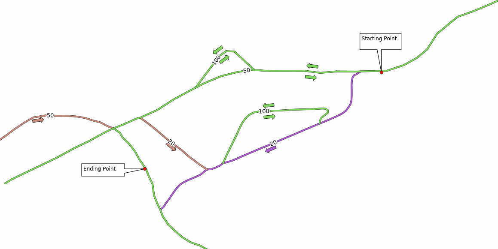
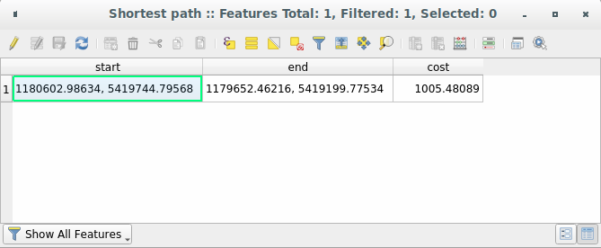
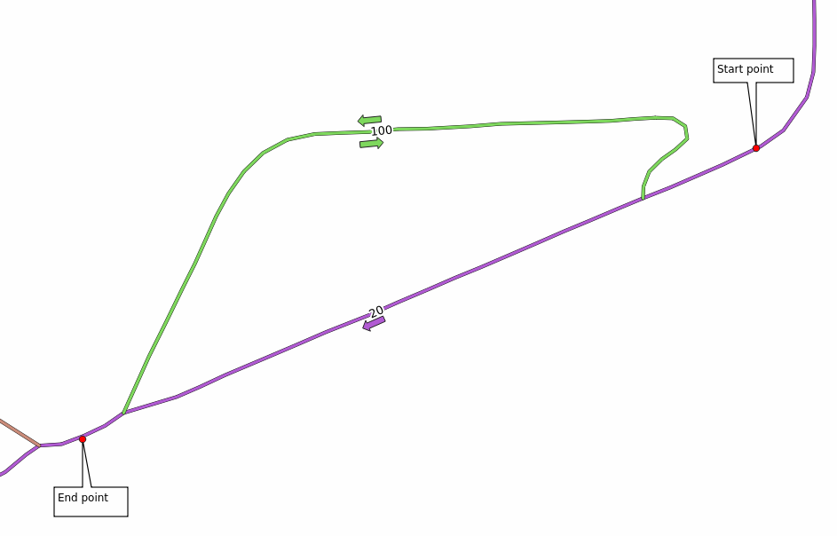
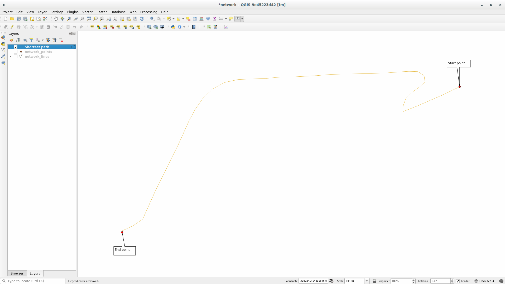
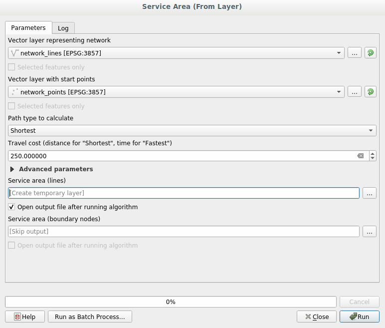

.. only:: html

   |updatedisclaimer|

|LS| Network Analysis
===============================================================================

Calculating the shortest distance between two points is a commonly cited use
for GIS. Tools for this can be found in the :guilabel:`Processing` toolbox.

**The goal for this lesson:** learn to use :guilabel:`Network analysis`
algorithms.

|basic| |FA| The Tools and the Data
-------------------------------------------------------------------------------

You can find all the network analysis algorithms in the
:menuselection:`Processing --> Network Analysis` menu. You can see that there
are many tools available:

Open the project :file:`exercise_data/network_analysis/network.qgz`, it contains
two layers:

1. :guilabel:`network_points`
2. :guilabel:`network_lines`

As you can see the :guilabel:`network_lines` layer has already a style that helps
to understand the road network.

The shortest path tools provide ways to calculate either the shortest or the fastest path
between two points of a network, given:

* start point and end point selected on the map;
* start point selected on the map and end points taken from a point layer;
* start points taken from a point layer and end point selected on the map;

Let's start.

|basic| Calculate the shortest path (point to point)
----------------------------------------------------
The :menuselection:`Network analysis --> Shortest path (point to point)` allows
you to calculate the shortest distance between two manually selected points on
the map.

In this example we will calculate the **shortest** (not fastest) path between two
points.

In the following image we choose these two points as starting and ending point
for the analysis:

* Open the :guilabel:`Shortest path (point to point)` algorithm;
* Select :guilabel:`network_lines` for :guilabel:`Vector layer representing network`;
* Let ``Shortest`` in the :guilabel:`Path type to calculate` parameter;
* Click on the :guilabel:`...` button next to the :guilabel:`Start point (x, y)`
  and choose the location tagged with ``Starting Point`` in the picture. The menu
  is filled with the coordinates of the clicked point;
* Do the same thing but choosing the location tagged with ``Ending point`` for
  :guilabel:`End point (x, y)`;
* Click on the :guilabel:`Run` button:

.. image:: img/shortest_point.png
   :align: center

A new line layer is created representing the shortest path between the chosen
points. Uncheck the :guilabel:`network_lines` layer to see the result better:

.. image:: img/shortest_point_result.png
   :align: center

Let's open the attribute table of the output layer. It contains three fields,
representing the coordinates of the starting and ending points and the
**cost**.

We chose ``Shortest`` as :guilabel:`Path type to calculate`, so the **cost**
represent the **distance**, in layer units, between the two locations.

In our case, the *shortest* distance between the chosen points is around ``1000``
meters:

Now that you now how to use the tool, feel free to change them and test other
locations.

.. _backlink-network_analysis_1:

|moderate| |TY| Fastest path
--------------------------------------------------------------------------------

With the same data of the previous exercise, try to calculate the fastest path
between the two points.

How much time do you need to go from the start to the end point?

:ref:`Check your results <network-analysis-1>`

|moderate| |FA| Advanced options
-------------------------------------------------------------------------------

Let's explore some more options of the Network Analysis tools. In the :ref:`previous
exercise <backlink-network_analysis_1>` we calculated the **fastest** route
between two points. As you can imagine, the time depends on the travel **speed**.

We will use the same layers and same starting and ending points of the previous
exercises.

* Open the :guilabel:`Shortest path (point to point)` algorithm;
* Fill the :guilabel:`Input layer`, :guilabel:`Start point (x, y)` and
  :guilabel:`End point (x, y)` as we did before;
* Choose ``Fastest`` as the :guilabel:`Path type to calculate`;
* Open the :guilabel:`Advanced parameter` menu;
* Change the :guilabel:`Default speed (km/h)` from the default ``50`` value to
  ``4``;

  .. image:: img/shortest_path_advanced.png
     :align: center

* Click on :guilabel:`Run`.

Once the algorithm is finished, close the dialog and open the attribute table of
the output layer.

The :guilabel:`cost` field contains the value according to the speed parameter
you have chosen.

We can convert the :guilabel:`cost` field from hours with fractions to the more
readable *minutes* values.

* Open the field calculator by clicking on the |calculateField| icon and add the
  new field :guilabel:`minutes` by multiplying the :guilabel:`cost` field by 60:

  .. image:: img/shortest_path_conversion.png
     :align: center

That's it! Now you know how many minutes it will take to get from one point to
the other one.

|hard| Shortest map with speed limit
-------------------------------------------------------------------------------
The Network analysis toolbox has other interesting options. Looking at the
following map:

we would like to know the **fastest** route considering the **speed limits** of
each road (the labels represent the speed limits in km/h). The shortest path
without considering speed limits would of course be the purple path. But in that
road the speed limit is 20 km/h, while in the green road you can go at 100 km/h!

As we did in the first exercise, we will use the
:menuselection:`Network analysis --> Shortest path (point to point)` and we will
manually choose the start and end points.

* Open the :menuselection:`Network analysis --> Shortest path (point to point)`
  algorithm;
* Select :guilabel:`network_lines` for the :guilabel:`Vector layer representing network`
  parameter;
* Choose ``Fastest`` as the :guilabel:`Path type to calculate`;
* Click on the :guilabel:`...` button next to the :guilabel:`Start point (x, y)`
  and choose the location tagged with ``Start Point`` in the picture. The menu
  is filled with the coordinates of the clicked point;
* Do the same thing but choosing the location tagged with ``End point`` for
  :guilabel:`End point (x, y)`;
* Open the :guilabel:`Advanced parameters` menu;
* Choose the ``speed`` field as the :guilabel:`Speed Field` parameter. With this
  option the algorithm will take into account the speed values for each road;

  .. image:: img/speed_limit_parameters.png
     :align: center

* Click on the :guilabel:`Run` button:

Turn off the :guilabel:`network_lines` layer to better see the result.

As you can see the fastest route does not correspond to the shortest one.

|moderate| Service area (from layer)
-------------------------------------------------------------------------------
The :menuselection:`Network Analysis --> Service area (from layer)` algorithm
can answer the question: given a point layer, what are all the reachable areas
given a distance or a time value?

.. note:: The :menuselection:`Network Analysis --> Service area (from point)`
    is the same algorithm but, it allows you to manually choose the point on the
    map.

Given a distance of ``250`` meters we want to know how far we can go on the
network from each point of the :guilabel:`network_points` layer.

* Uncheck all the layers except :guilabel:`network_points`;
* Open the :menuselection:`Network Analysis --> Service area (from layer)` algorithm;
* Choose :guilabel:`network_lines` for :guilabel:`Vector layer representing network`;
* Choose :guilabel:`network_points` for :guilabel:`Vector layer with start points`;
* Choose ``Shortest`` in :guilabel:`Path type to calculate`;
* Enter ``250`` in the :guilabel:`Travel cost` parameter;
* Click on :guilabel:`Run` and then close the dialog.

The output layer represents the maximum path you can reach from the point features
given a distance of 250 meters:

.. image:: img/service_area_result.png
   :align: center

Cool isn't it?

|IC|
-------------------------------------------------------------------------------

Now you know how to use :guilabel:`Network analysis` algorithm to solve
shortest-fastest path problems.

We are now ready to perform some spatial statistic on vector layer data. Let's
go!

|WN|
-------------------------------------------------------------------------------

Next you'll see how to run spatial statistics algorithms on vector datasets.

.. Substitutions definitions - AVOID EDITING PAST THIS LINE
   This will be automatically updated by the find_set_subst.py script.
   If you need to create a new substitution manually,
   please add it also to the substitutions.txt file in the
   source folder.

.. |FA| replace:: Follow Along:
.. |IC| replace:: In Conclusion
.. |LS| replace:: Lesson:
.. |TY| replace:: Try Yourself
.. |WN| replace:: What's Next?
.. |basic| image:: /static/global/basic.png
.. |calculateField| image:: /static/common/mActionCalculateField.png
   :width: 1.5em
.. |hard| image:: /static/global/hard.png
.. |moderate| image:: /static/global/moderate.png
.. |updatedisclaimer| replace:: :disclaimer:`Docs in progress for 'QGIS testing'. Visit https://docs.qgis.org/3.4 for QGIS 3.4 docs and translations.`
