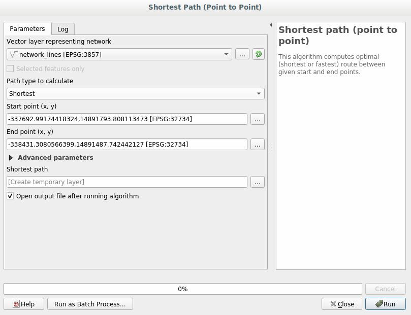
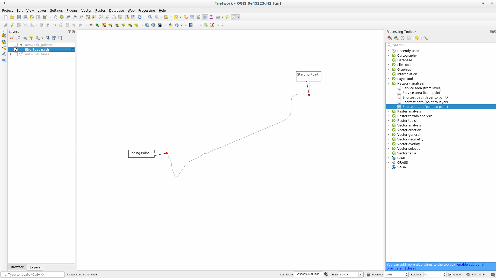
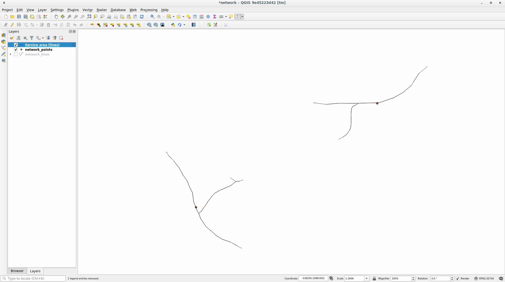

.. only:: html

   |updatedisclaimer|

|LS| Network Analysis
===============================================================================

Calculating the shortest distance between two points is a commonly cited use
for GIS. QGIS ships with this tool within the :guilabel:`Processing` toolbox.

**The goal for this lesson:** learn to use the :guilabel:`Network analysis`
algorithms.

|basic| |FA| The Tool and the Data
-------------------------------------------------------------------------------

You can find all the network analysis algorithms in the
:menuselection:`Processing --> Network Analysis` menu. You can see that there
are many tool available, depending on which is the analysis you want to perform.

.. image:: img/select_road_graph_plugin.png
   :align: center

Open the project :file:`exercise_data/network_analysis/network.qgz`, it contains
two layers:

1. :guilabel:`network_point`
2. :guilabel:`network_lines`

As you can see the :guilabel:`network_lines` layer has already a style that helps
to understand the road network.

|basic| |FA| Use the Tool
-------------------------------------------------------------------------------

Depending on the aim of your analysis you may want to calculate the shortest or
the fastest path between two point of a network.

The tools has many different options: e.g. it lets allows you to choose manually
the starting and ending point on the map, or it lets you to use a point layer that
contains starting and ending points.

Let's start.

Shortest path (point to point)
------------------------------
The :menuselection:`Network analysis --> Shortest path (point to point)` allows
you to calculate the shortest distance between two point that you will select
manually on the map.

In this example we will calculate the **shortest** (not fastest) path between two
points.

In the following image we choose these two points as starting and ending point
for the analysis, feel free to change them and test other locations.

.. image:: img/start_end_point.png
   :align: center

* Open the :guilabel:`Shortest path (point to point)` algorithm.
* Select :guilabel:`network_lines` for :guilabel:`Vector layer representing network`.
* Let ``Shortest`` in the :guilabel:`Path type to calculate` parameter.
* Click on the |browseButton| button next to the :guilabel:`Start Point (x,y)`
  and choose the location you want. The menu is filled with the coordinates of
  the clicked point.
* Do the same thing for :guilabel:`End Point(x,y)`.
* Click on the **[Run]** button:

A new line layer is created representing the shortest path between the chosen
points. Uncheck the :guilabel:`network_lines` layer to see better only the final
result:

Let's open now the attribute table of the output layer. It is made of three
field, containing the coordinates of the staring and ending points and the
**cost** one.

Depending on what you choose in the :guilabel:`Path type to calculate` it will
contain either the distance, in layer units, between points (``Shortest``) or
the time, in hour units (``Fastest``).

In out case, the *shortest* distance between the chosen points is around ``1000``
meters:

.. image:: img/shortest_point_attributes.png
   :align: center

.. _backlink-network_analysis_1:

|moderate| |TY| Fastest path
--------------------------------------------------------------------------------
Redo the previous exercise but change the :guilabel:`Path type to calculate`
from ``Shortest`` to ``Fastest``.

How much time do you need to go from the star to the end point?

:ref:`Check your results <network-analysis-1>`

|moderate| |FA| Advanced options
-------------------------------------------------------------------------------

Let's explore some more options of the Network Analysis tool. In the :ref:`previous
exercise <backlink-network_analysis_1>` we calculated the **fastest** route
between two points. As you can imagine, the time changes accordingly to the
travel **speed**.

We will use the same layers and same starting and ending points of the previous
exercises, but again, fell free to experiment other options.

* Open the :guilabel:`Shortest path (point to point)` algorithm.
* Fill the :guilabel:`Input layer`, :guilabel:`Start Point (x,y)` and
  :guilabel:`End Point (x,y)` as we did before.
* Choose ``Fastest`` as the :guilabel:`Path type to calculate`.
* Open the :guilabel:`Advanced parameter` menu.
* Change the :guilabel:`Default speed (km/h)` from the default ``60`` value to
  ``4``.

  .. image:: img/shortest_path_advanced.png
     :align: center

* Click on **[Run]**.

Once the algorithm is finished, close the dialog and open the attribute table of
the output layer.

The :guilabel:`cost` field contains the value according to the speed parameter
you have chosen.

We can convert the :guilabel:`cost` field from hour fraction to the more readable
*minutes* values.

* Open the field calculator by clicking on the |calculateField| icon and add the
  new field :guilabel:`minutes` by multiplying the :guilabel:`cost` field for 60:

  .. image:: img/shortest_path_conversion.png
     :align: center

That's it! Now you know how many minutes it will take to get from one point to
the other one.

|moderate| Service area (from layer)
-------------------------------------------------------------------------------
The :menuselection:`Network Analysis --> Service area (from layer)` algorithm
answers to the question: given a point layer what are all the reachable areas
given a distance or a time value?

.. note:: The :menuselection:`Network Analysis --> Service area (from points)`
    is the same algorithm but you can manually choose the point on the map.

Given a distance of ``250`` meters we want to know how far we can get from each
of the two points of the :guilabel:`network_point` layer.

* Uncheck all the layers except :guilabel:`network_point`.
* Open the :menuselection:`Network Analysis --> Service area (from layer)` algorithm.
* Choose :guilabel:`network_lines` for :guilabel:`Vector layer representing network`.
* Choose :guilabel:`network_points` for :guilabel:`Vector layer with start points`.
* Choose ``Shortest`` in :guilabel:`Path type to calculate`.
* Enter ``250`` in the :guilabel:`Travel cost` parameter.
* Click on **[Run]** and then close the dialog.

.. image:: img/service_area.png
   :align: center

The output layer represent the maximum path you can reach from the point features
given a distance of 250 meters:

Cool isn't it?

|hard| Shortest map with speed limit
-------------------------------------------------------------------------------
The Network analysis toolbox has other interesting options. Looking at the
following map:

.. image:: img/speed_limit.png
   :align: center

we would know the **fastest** route considering the **speed limits** of each
road (the labels represent the speed limits in km/h). The shortest path without
considering speed limits would of course be the purple path. But in that road
the speed limit is 20 km/h, while in the green road you can go at 100 km/h!

As we did in the first exercise, we will use the
:menuselection:`Network analysis --> Shortest path (point to point)` and we will
manually choose the start and end points.

* Open the :menuselection:`Network analysis --> Shortest path (point to point)`
  algorithm.
* Select :guilabel:`network_lines` for the :guilabel:`Vector layer representing network`
  parameter.
* Choose ``Fastest`` as the :guilabel:`Path type to calculate`.
* Click on the |browseButton| button next to the :guilabel:`Start Point (x,y)`
  and choose the location you want. The menu is filled with the coordinates of
  the clicked point.
* Do the same thing for :guilabel:`End Point(x,y)`.
* Open the :guilabel:`Advanced parameter` menu.
* Choose the ``speed`` field as the :guilabel:`Speed Field` parameter. With this
  option the algorithm will take into account the speed values for each road.

  .. image:: img/speed_limit_parameters.png
     :align: center

* Click on the **[Run]** button:

Turn off the :guilabel:`network_lines` layer to see better the final result.

.. image:: img/speed_limit_result.png
   :align: center

As you can see the fastest route does not correspond to the shortest one.

|IC|
-------------------------------------------------------------------------------

Now you know how to use the :guilabel:`Network analysis` algorithm to solve
shortest-fastest path problems.

|WN|
-------------------------------------------------------------------------------

Next you'll see how to run spatial statistics algorithms on vector datasets.

.. Substitutions definitions - AVOID EDITING PAST THIS LINE
   This will be automatically updated by the find_set_subst.py script.
   If you need to create a new substitution manually,
   please add it also to the substitutions.txt file in the
   source folder.

.. |FA| replace:: Follow Along:
.. |IC| replace:: In Conclusion
.. |LS| replace:: Lesson:
.. |TY| replace:: Try Yourself
.. |WN| replace:: What's Next?
.. |basic| image:: /static/global/basic.png
.. |browseButton| image:: /static/common/browsebutton.png
   :width: 2.3em
.. |calculateField| image:: /static/common/mActionCalculateField.png
   :width: 1.5em
.. |hard| image:: /static/global/hard.png
.. |moderate| image:: /static/global/moderate.png
.. |updatedisclaimer| replace:: :disclaimer:`Docs in progress for 'QGIS testing'. Visit http://docs.qgis.org/2.18 for QGIS 2.18 docs and translations.`
