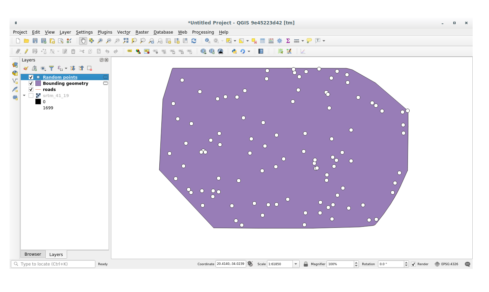
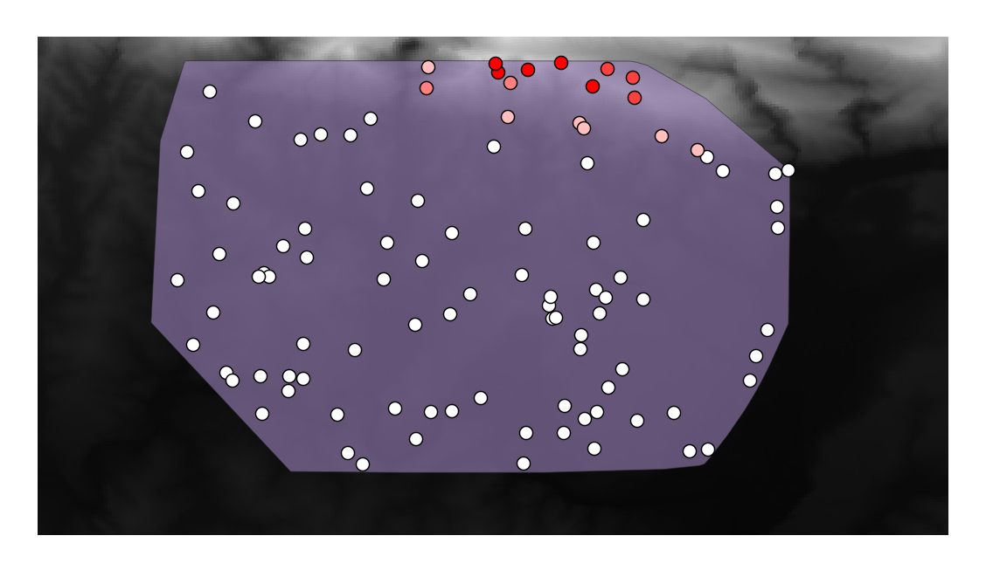
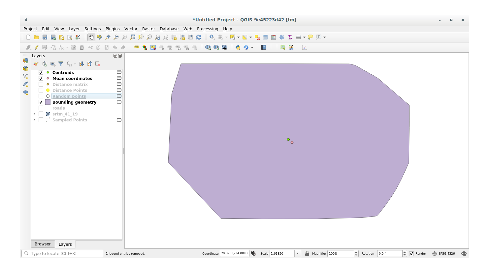
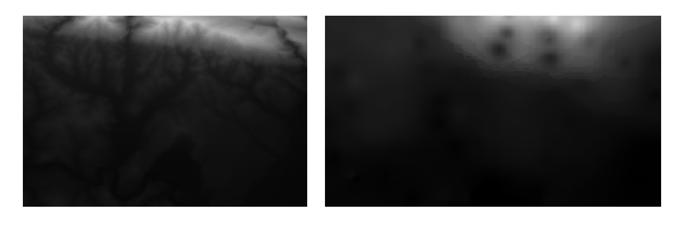
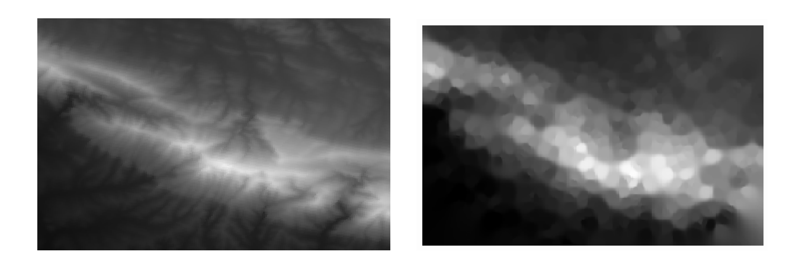

.. only:: html

|LS| Spatial Statistics
===============================================================================

.. note:: Lesson developed by Linfiniti and S Motala (Cape Peninsula University
   of Technology)

Spatial statistics allow you to analyze and understand what is going on in a
given vector dataset. QGIS includes several standard tools for statistical
analysis which prove useful in this regard.

**The goal for this lesson:** To know how to use QGIS' spatial statistics
tools within the :guilabel:`Processing` toolbox.

|basic| |FA| Create a Test Dataset
-------------------------------------------------------------------------------

In order to get a point dataset to work with, we'll create a random set of
points.

To do so, you'll need a polygon dataset defining the extents of the area you
want to create the points in.

We'll use the area covered by streets.

#. Start a new project.
#. Add your :guilabel:`roads` layer, as well as the :guilabel:`srtm_41_19`
   raster file (elevation data) found in :file:`exercise_data/raster/SRTM/`.

   .. note:: You might find that your SRTM DEM layer has a different CRS to that of
    the roads layer. QGIS is reprojecting both layers in a single CRS. For the
    following exercises this difference does not matter, but feel free to
    reproject a layer in another CRS as shown in this module.

#. Open :guilabel:`Processing` toolbox.
#. Use the :menuselection:`Vector Geometry --> Minimum bounding geometry` tool to
   generate an area enclosing all the roads by selecting ``Convex Hull`` as the
   :guilabel:`Geometry Type` parameter:

   .. image:: img/roads_hull_setup.png
      :align: center

   As you know, if you don't specify the output, :guilabel:`Processing` creates
   temporary layers. It is up to you to save the layers immediately or in a
   second moment.

Creating random points
...............................................................................

* Create random points in this area using the tool at :menuselection:`Vector
  Creation --> Random points in layer bounds`:

  .. image:: img/random_points_setup.png
     :align: center

  .. note:: The yellow warning sign is telling you that that parameter concerns
    something about the distance. The :guilabel:`Bounding geometry` layer is in a
    Geographical Coordinate System and the algorithm is just reminding you this.
    For this example we won't use this parameter so you can ignore it.

If needed, move the generated random point at the top of the legend to see them
better:

Sampling the data
...............................................................................

To create a sample dataset from the raster, you'll need to use the
:menuselection:`Raster Analysis --> Sample raster values` algorithm within
:guilabel:`Processing` toolbox. This tool samples the raster at the points
locations and copies the raster values in other field(s) depending on how many
bands the raster is made of.

#. Open the :guilabel:`Sample raster values` algorithm dialog
#. Select :guilabel:`random_points` as the layer containing sampling points, and
   the SRTM raster as the band to get values from. The default name of the new
   field is ``rvalue_N``, where ``N`` is the number of the raster band. You can
   change the name of the prefix if you want:

   .. image:: img/sample_raster_dialog.png
      :align: center

#. Press :guilabel:`Run`

Now you can check the sampled data from the raster file in the attributes
table of the :guilabel:`Random points` layer, they will be in a new field with
the name you have chosen.

A possible sample layer is shown here:

The sample points are classified by their ``rvalue_1`` field such that red
points are at a higher altitude.

You'll be using this sample layer for the rest of the statistical exercises.

|basic| |FA| Basic Statistics
-------------------------------------------------------------------------------

Now get the basic statistics for this layer.

#. Click on the |sum| icon in the :guilabel:`Attributes Toolbar` of QGIS main dialog.
   A new panel will pop up.
#. In the dialog that appears, specify the :guilabel:`Sampled Points` layer as
   the source.
#. Select the :guilabel:`rvalue_1` field in the field combo box which is the
   field you will calculate statistics for.
#. The :guilabel:`Statistics` Panel will be automatically updated with the
   calculated statistics:

   .. image:: img/basic_statistics_results.png
      :align: center

   .. note:: You can copy the values by clicking on the |editCopy|:sup:`Copy Statistics To Clipboard`
    button and paste the results into a spreadsheet.

#. Close the :guilabel:`Statistics` Panel when done.

Many different statistics are available, below some description:

Count
  The amount of samples/values.

Sum
  All the values added together.

Mean
  The mean (average) value is simply the sum of the values divided by the
  amount of values.

Median
  If you arrange all the values from least to greatest, the middle value (or
  the average of the two middle values, if N is an even number) is the median
  of the values.

St Dev (pop)
  The standard deviation. Gives an indication of how closely the values are
  clustered around the mean. The smaller the standard deviation, the closer
  values tend to be to the mean.

Minimum
  The minimum value.

Maximum
  The maximum value.

Range
  The difference between the minimum and maximum values.

Q1
  First quartile of the data.

Q3
  Third quartile of the data.

Missing (null) values
  Total count of values with missing data-

|basic| |FA| Compute statistics on distances between points using the Distance Matrix tool
------------------------------------------------------------------------------------------

#. Create a new point layer as a ``Temporary layer``.
#. Enter edit mode and digitize three points somewhere among the other points.

   Alternatively, use the same random point generation method as before, but
   specify only **three** points.
#. Save your new layer as :guilabel:`distance_points` in the format you prefer.

To generate statistics on the distances between points in the two layers:

#. Open the tool :menuselection:`Vector Analysis --> Distance matrix`.
#. Select the :guilabel:`distance_points` layer as the input layer, and the
   :guilabel:`Sampled Points` layer as the target layer.
#. Set it up like this:

   .. image:: img/distance_matrix_setup.png
      :align: center

#. If you want you can save the output layer as a file or just run the algorithm
   and save the temporary output layer in a second moment.
#. Click :guilabel:`Run` to generate the distance matrix layer.
#. Open the attribute table of the generated layer: values refer to the distances
   between the :guilabel:`distance_points` features and their two nearest points
   in the :guilabel:`Sampled Points` layer:

   .. image:: img/distance_matrix_example.png
      :align: center

With these parameters, the ``Distance Matrix`` tool calculates distance
statistics for each point of the input layer with respect to the nearest points
of the target layer. The fields of the output layer contains the mean, standard
deviation, minimum and maximum for the distances to the nearest neighbors of the
points in the input layer.

|basic| |FA| Nearest Neighbor Analysis (within layer)
-------------------------------------------------------------------------------

To do a nearest neighbor analysis of a point layer:

#. Click on the menu item :menuselection:`Vector analysis --> Nearest neighbor
   analysis`.
#. In the dialog that appears, select the :guilabel:`Random points` layer and
   click :guilabel:`Run`.
#. The results will appear in the Processing :guilabel:`Result Viewer` Panel.

   .. image:: img/result_viewer.png
      :align: center

#. Click on the blue link to open the ``html`` page with the results:

   .. image:: img/nearest_neighbour_example.png
     :align: center

|basic| |FA| Mean Coordinates
-------------------------------------------------------------------------------

To get the mean coordinates of a dataset:

#. Click on the :menuselection:`Vector analysis --> Mean coordinate(s)` menu item.
#. In the dialog that appears, specify :guilabel:`Random points` as the input
   layer, but leave the optional choices unchanged.
#. Click :guilabel:`Run`.

Let's compare this to the central coordinate of the polygon that was used to
create the random sample.

#. Click on the :menuselection:`Vector geometry --> Centroids` menu item.
#. In the dialog that appears, select :guilabel:`Bounding geometry` as the input
   layer.

As you can see from the example below, the mean coordinates (pink point) and the
center of the study area (in green) don't necessarily coincide.

The centroid is the barycenter of the layer (the barycenter of a square is the
center of the square) while the mean coordinates represent the average of all
node coordinates.

|basic| |FA| Image Histograms
-------------------------------------------------------------------------------

The histogram of a dataset shows the distribution of its values. The simplest
way to demonstrate this in QGIS is via the image histogram, available in the
:guilabel:`Layer Properties` dialog of any image layer (raster dataset).

#. In your :guilabel:`Layers` panel, right-click on the :guilabel:`srtm_41_19`
   layer.
#. Select :menuselection:`Properties`.
#. Choose the tab :guilabel:`Histogram`. You may need to click on the
   :guilabel:`Compute Histogram` button to generate the graphic. You will see a
   graph describing the frequency of values in the image.
#. You can export it as an image:

   .. image:: img/histogram_export.png
      :align: center

#. Select the :guilabel:`Information` tab, you can see more detailed information
   of the layer.

The mean value is ``332.8``, and the maximum value is ``1699``! But those
values don't show up on the histogram. Why not? It's because there are so few
of them, compared to the abundance of pixels with values below the mean. That's
also why the histogram extends so far to the right, even though there is no
visible red line marking the frequency of values higher than about ``250``.

.. note:: If the mean and maxmimum values are not the same as those of the example,
    it can be due to the min/max value calculation. Open the :guilabel:`Symbology`
    tab and expand the :guilabel:`Min / Max Value Settings` menu. Choose
    ``|radioButtonOn| Min / max`` and click on :guilabel:`Apply`.

Therefore, keep in mind that a histogram shows you the distribution of values,
and not all values are necessarily visible on the graph.

|basic| |FA| Spatial Interpolation
-------------------------------------------------------------------------------

Let's say you have a collection of sample points from which you would like to
extrapolate data. For example, you might have access to the
:guilabel:`Sampled points` dataset we created earlier, and would like to have
some idea of what the terrain looks like.

#. To start, launch the :menuselection:`GDAL --> Raster analysis --> Grid (IDW
   with nearest neighbor searching)` tool within :guilabel:`Processing` toolbox.
#. In the :guilabel:`Point layer` parameter, select :guilabel:`Sampled points`
#. Set ``5.0`` as the :guilabel:`Weighting power`
#. In the :guilabel:`Advanced parameters` set :guilabel:`rvalue_1` for the
   :guilabel:`Z value from field` parameter
#. Finally click on :guilabel:`Run` and wait until the algorithm ends
#. Close the dialog

Here's a comparison of the original dataset (left) to the one constructed from
our sample points (right). Yours may look different due to the random nature of
the location of the sample points.

As you can see, 100 sample points aren't really enough to get a detailed
impression of the terrain. It gives a very general idea, but it can be
misleading as well.

|moderate| |TY| Different interpolation methods
-------------------------------------------------------------------------------

#. Use the processes shown above to create a new set of ``10 000`` random points.

   .. note:: If the points amount is really big the processing time can take a
      long time.

#. Use these points to sample the original DEM.
#. Use the :guilabel:`Grid (IDW with nearest neighbor searching)` tool on this
   new dataset as above.
#. Set the :guilabel:`Power` and :guilabel:`Smoothing` to ``5.0`` and ``2.0``,
   respectively.

The results (depending on the positioning of your random points) will look more
or less like this:

This is a much better representation of the terrain, due to the much greater
density of sample points. Remember, bigger samples give better results.

|IC|
-------------------------------------------------------------------------------

QGIS allows many possibilities for analyzing the spatial statistical properties
of datasets.

|WN|
-------------------------------------------------------------------------------

Now that we've covered vector analysis, why not see what can be done with
rasters? That's what we'll do in the next module!

.. Substitutions definitions - AVOID EDITING PAST THIS LINE
   This will be automatically updated by the find_set_subst.py script.
   If you need to create a new substitution manually,
   please add it also to the substitutions.txt file in the
   source folder.

.. |FA| replace:: Follow Along:
.. |IC| replace:: In Conclusion
.. |LS| replace:: Lesson:
.. |TY| replace:: Try Yourself
.. |WN| replace:: What's Next?
.. |basic| image:: /static/global/basic.png
.. |editCopy| image:: /static/common/mActionEditCopy.png
   :width: 1.5em
.. |moderate| image:: /static/global/moderate.png
.. |radioButtonOn| image:: /static/common/radiobuttonon.png
.. |sum| image:: /static/common/mActionSum.png
   :width: 1.5em
