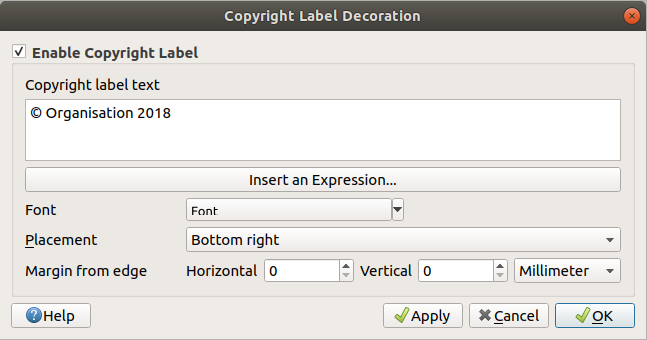
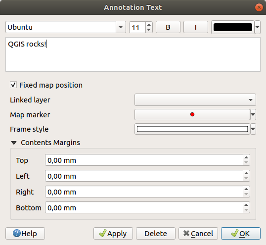
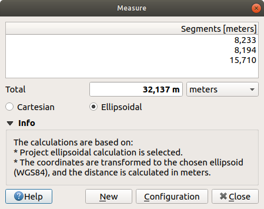
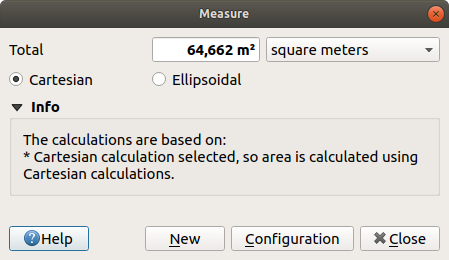
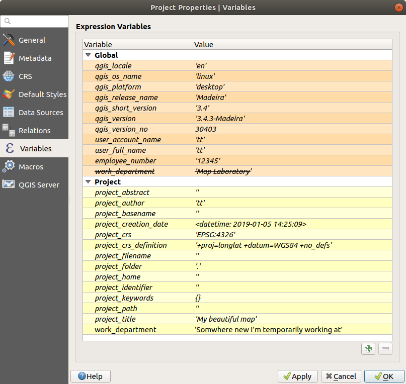
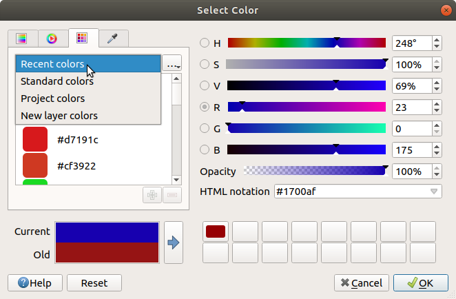
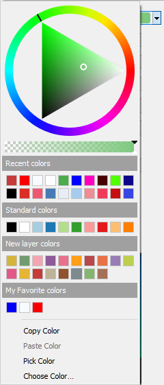

.. only:: html

   |updatedisclaimer|

.. Purpose: This chapter aims to describe generic tools that can be used even
.. if the user is in another chapter.

.. _general_tools:

*************
General Tools
*************

.. only:: html

   .. contents::
      :local:

.. _`context_help`:

Context help
============

.. index::
   single: Context help

Whenever you need help on a specific topic, you can access the corresponding
page in the current User Manual via the
**[Help]** button available in most dialogs --- please note that third-party
plugins can point to dedicated web pages.

.. index:: Panels

Panels
=======
QGIS provides by default many panels to work with.
Some of these panels are described below while others may be found in different
parts of the document. A complete list of default panels provided by QGIS is
available through :menuselection:`View --> Panels -->` menu and mentioned at
:ref:`panels_tools`.

.. index:: Panels; Layers
.. _`label_legend`:

Layers Panel
------------

.. index::
   single: Legend

The :guilabel:`Layers` panel (also called ``map legend``) lists all
the layers in the project and helps you
manage their visibility. A layer can be selected and dragged up or down in the
legend to change the Z-ordering. Z-ordering means that layers listed nearer the
top of the legend are drawn over layers listed lower down in the legend.

.. note:: The Z-ordering behavior can be overridden by the
   :ref:`Layer Order <layer_order>` panel.

At the top of the Layers panel that you can also enable pressing :kbd:`Ctrl+1`,
a toolbar allows you to:

* |symbology| :sup:`Open the layer styling dock (F7)`: toggle the layer styling
  panel on and off.
* |addGroup| :sup:`Add new group`
* |showMapTheme| :sup:`Manage Map Themes`: control visibility of layers and
  arrange them in different map themes.
* |filterMap| :sup:`Filter Legend by Map Content`: only the layers that are set
  visible and whose features intersect the current map canvas have their style
  rendered in the layers panel. Otherwise, a generic NULL symbol is applied to
  the layer. Based on the layer symbology, this is a convenient way to identify
  which kind of features from which layers cover your area of interest.
* |expressionFilter| :sup:`Filter Legend by Expression`: helps you apply an
  expression to remove from the selected layer tree styles that have no feature
  satisfying the condition. This can be used for example to highlight features
  that are within a given area/feature of another layer.
  From the drop-down list, you can edit and clear the expression set.
* |expandTree| :sup:`Expand All` or |collapseTree| :sup:`Collapse All`
  layers and groups in the layers panel.
* and |removeLayer| :sup:`Remove Layer/Group` currently selected.

.. _figure_layer_toolbar:

   Layer Toolbar in Layers Panel

.. note::
   Tools to manage the layers panel are also available for map
   and legend items of the print layout

.. index:: Map themes
.. _map_themes:

Configuring map themes
......................

The |showMapTheme| :sup:`Manage Map Themes` drop-down button provides access to
convenient shortcuts to manipulate visibility of the layers in the :guilabel:`Layers`
panel:

* |showAllLayers| :guilabel:`Show All Layers`;
* |hideAllLayers| :guilabel:`Hide All Layers`;
* |showSelectedLayers| :guilabel:`Show Selected Layers`;
* |hideSelectedLayers| :guilabel:`Hide Selected Layers`;
* |hideDeselectedLayers| :guilabel:`Hide Deselected Layers`.

Beyond the quick control of layers visibility,
the |showMapTheme| :sup:`Manage Map Themes` menu allows you to configure
**Map Themes** in the legend and switch from one to another.
A map theme is a **snapshot** of the current map legend that records:

* the layers set as visible in the :guilabel:`Layers` panel;
* AND for each visible layer:

  * the reference to the applied :ref:`style <save_layer_property>`;
  * the visible classes of the style ie, the layer checked node items in the
    :guilabel:`Layers panel`. This applies to :ref:`symbologies <vector_style_menu>`
    other than the single symbol rendering;
  * the collapsed/expanded state of the layer node(s) and the group(s) it's placed
    inside.

To create a map theme:

#. Check the layer you want to show;
#. Configure the layer properties (symbology, diagram, labels...) and, using
   the :menuselection:`Symbology --> Style -->` menu, click on **[Add...]** to
   store the settings as :ref:`a new style embedded in the project
   <manage_custom_style>`.

   .. note:: A map theme does not remember the current details of the properties;
     only a reference to the style name is saved so whenever you apply
     modifications (eg, change the symbology rendering) to the layer while this
     style is enabled, the map theme is updated with new information.

#. Repeat the previous steps as necessary;
#. If applicable, expand or collapse groups or visible layers nodes in the
   :guilabel:`Layers` panel.
#. Click on the |showMapTheme| :sup:`Manage Map Themes` button on top of the panel,
   and **[Add Theme...]**;
#. Enter the map theme's name and click **[OK]**. The new theme is listed in
   the lower part of the |showMapTheme| drop-down menu.

You can create as many map themes as you need: whenever the current combination
in the map legend (visible layers, their active style, the map legend nodes)
does not match any existing map theme contents as defined above, click on
**[Add Theme]** for a creation or use :menuselection:`Replace Theme -->` to
update the map theme.
Use :menuselection:`Remove Current Theme` button to delete the active theme.

Map themes are helpful to quickly switch between different preconfigured
combinations; select a map theme in the list to restore its combination.
All configured themes are also accessible in the print layout, allowing you to
create a map layout based on specific themes (see :ref:`layout_main_properties`).

Overview of the context menu of the Layers panel
................................................

At the bottom of the toolbar, the main component of the Layers panel is the
frame listing vector or raster layers added to the project and, those layers
can be organized in groups. Depending on the item selected in the panel, a
right-click shows a dedicated set of options presented below.

=================================================================  ==================  =================  =============
Option                                                             Vector Layer        Raster Layer       Group
=================================================================  ==================  =================  =============
|zoomToLayer| :guilabel:`Zoom to Layer/Group`                      |checkbox|          |checkbox|         |checkbox|
|zoomToLayer| :guilabel:`Zoom to Selection`                        |checkbox|          \                  \
|inOverview| :guilabel:`Show in Overview`                          |checkbox|          |checkbox|         \
:guilabel:`Show Feature Count`                                     |checkbox|          \                  \
:guilabel:`Copy Layer/Group`                                       |checkbox|          |checkbox|         |checkbox|
:guilabel:`Rename Layer/Group`                                     |checkbox|          |checkbox|         |checkbox|
|zoomActual| :guilabel:`Zoom to Native Resolution (100%)`          \                   |checkbox|         \
:guilabel:`Stretch Using Current Extent`                           \                   |checkbox|         \
|dbManager| :guilabel:`Update SQL Layer...`                        |checkbox|          \                  \
|addGroup| :guilabel:`Add Group`                                   \                   \                  |checkbox|
|duplicateLayer| :guilabel:`Duplicate Layer`                       |checkbox|          |checkbox|         \
|removeLayer| :guilabel:`Remove Layer/Group...`                    |checkbox|          |checkbox|         |checkbox|
:guilabel:`Move Out of Group`                                      |checkbox|          |checkbox|         \
:guilabel:`Move to Top`                                            |checkbox|          |checkbox|         |checkbox|
:guilabel:`Check and all its Parents`                              |checkbox|          |checkbox|         \
:guilabel:`Group Selected`                                         |checkbox|          |checkbox|         \
|openTable| :guilabel:`Open Attribute Table`                       |checkbox|          \                  \
|toggleEditing| :guilabel:`Toggle Editing`                         |checkbox|          \                  \
|allEdits| :menuselection:`Current Edits -->`                      |checkbox|          \                  \
:guilabel:`Filter...`                                              |checkbox|          \                  \
:guilabel:`Set Layer Scale Visibility...`                          |checkbox|          |checkbox|         \
:guilabel:`Zoom to Visible Scale`                                  |checkbox|          |checkbox|         \
:menuselection:`Set CRS -->`                                       |checkbox|          |checkbox|         \
* :guilabel:`Set Layer/Group CRS...`                               |checkbox|          |checkbox|         |checkbox|
* :guilabel:`Set Project CRS from Layer`                           |checkbox|          |checkbox|         \
:guilabel:`Set Group WMS Data...`                                  \                   \                  |checkbox|
|unchecked| :guilabel:`Mutually Exclusive Group`                   \                   \                  |checkbox|
:guilabel:`Check and all its children (Ctrl-click)`                \                   \                  |checkbox|
:guilabel:`Uncheck and all its children (Ctrl-click)`              \                   \                  |checkbox|
:guilabel:`Make Permanent`                                         |checkbox|          \                  \
:menuselection:`Export -->`                                        |checkbox|          |checkbox|         |checkbox|
* :guilabel:`Save As...`                                           \                   |checkbox|         \
* :guilabel:`Save Features As...`                                  |checkbox|          \                  \
* :guilabel:`Save Selected Features As...`                         |checkbox|          \                  \
* :guilabel:`Save As Layer Definition File...`                     |checkbox|          |checkbox|         |checkbox|
* :guilabel:`Save As QGIS Layer Style File...`                     |checkbox|          |checkbox|         \
:menuselection:`Styles -->`                                        |checkbox|          |checkbox|         \
* :guilabel:`Copy Style`                                           |checkbox|          |checkbox|         \
* :guilabel:`Paste Style`                                          |checkbox|          |checkbox|         |checkbox|
* :guilabel:`Add...`                                               |checkbox|          |checkbox|         \
* :guilabel:`Rename Current...`                                    |checkbox|          |checkbox|         \
:guilabel:`Properties...`                                          |checkbox|          |checkbox|         \
=================================================================  ==================  =================  =============

Table: Context menu from Layers Panel items

For GRASS vector layers, |toggleEditing| :sup:`Toggle editing` is not available.
See section :ref:`grass_digitizing` for information on editing GRASS vector
layers.

.. index:: Group, Layer
.. _group_layers_interact:

Interact with Groups and layers
...............................

Layers in the legend window can be organized into groups. There are two ways to
do this:

#. Press the |folder| icon to add a new group. Type in a name for
   the group and press :kbd:`Enter`. Now click on an existing layer and
   drag it onto the group.
#. Select some layers, right click in the legend window and choose
   :guilabel:`Group Selected`. The selected layers will automatically be placed
   in a new group.

To bring a layer out of a group, you can drag it out, or right click on it and
choose :guilabel:`Move Out of Group`; the layer is moved from the group and
placed above the group. Groups can also be nested inside other groups. If a layer
is placed in a nested group, this function will move the layer out of any of the
nested groups.

To move a group or a layer to the top of the layer panel, you can either drag it to
the top, or choose :guilabel:`Move to Top`. If you use this option on a layer nested
in a group, the layer is moved to the top in the current group.

The checkbox for a group will show or hide all the layers in the group
with one click.

Enabling the **Mutually Exclusive Group** option you can make a group have only
one layer visible at the same time.
Whenever a layer within the group is set visible the others will be toggled not visible.

It is possible to select more than one layer or group at the same time by
holding down the :kbd:`Ctrl` key while selecting the layers with the left mouse
button. You can then move all selected layers to a new group at the same time.

You may also delete more than one layer or group at once by selecting
several items with the :kbd:`Ctrl` key and pressing :kbd:`Ctrl+D` afterwards.
This way, all selected layers or groups will be removed from the layers list.

More information on layer or group using indicator icon
^^^^^^^^^^^^^^^^^^^^^^^^^^^^^^^^^^^^^^^^^^^^^^^^^^^^^^^

In some circumstances, the :guilabel:`Layers` panel can display next to the
layer or group an icon to advertize some properties. These symbols are:

* |toggleEditing| to indicate that the layer is in edit mode and you can modify
  the data;
* |editableEdits| to indicate that the layer being edited has some unsaved changes;
* |indicatorFilter| to indicate :ref:`a filter <vector_query_builder>` applied
  to the layer. Hover over the icon to see the filter expression and double-click
  to update the setting;
* |indicatorEmbedded| to identify an :ref:`embedded group or layer
  <nesting_projects>` and the path to their original project file;
* |indicatorMemory| to remind you that the layer is a :ref:`temporary scratch
  layer <vector_new_scratch_layer>` and its content will be discarded after
  closing this project. To avoid data loss and make the layer permanent, click
  the icon to store the layer in any of the OGR vector formats supported by QGIS.

.. index:: Style

.. _editing_style_layer:

Editing vector layer style
...........................

From the Layers panel, you have shortcuts to easily and quickly edit the layer
rendering. Right-click on a vector layer and select :menuselection:`Styles -->`
in the list in order to:

* see the currently applied :ref:`styles <manage_custom_style>` to the layer. In
  case you defined many styles for the layer, you can switch from one to another
  and have your layer rendering automatically updated in the map canvas.
* copy the current style, and when applicable, paste a copied style from another layer
* rename the current style, add a new one (which is actually a copy of the current
  one) or delete the current style (when multiple styles available).

.. note:: The previous options are also available for raster layer.

Whether the features in the vector layer have all the same unique symbol or they are
classified (in that case, the layer is displayed in a tree structure with each class
as sub-item), the following options are available at layer level or class level:

* a :guilabel:`Edit Symbol...` button to open the :ref:`symbol-selector` dialog and
  update any property (symbol, size, color...) of the layer or feature symbol.
  Double-clicking on a feature does also open the :guilabel:`Symbol Selector` dialog.
* a :ref:`color-selector` widget with a **Color Wheel** from which you can click a
  color and have it automatically update the symbol fill color. For convenience,
  **Recent colors** are available at the bottom of the color wheel.
* a |showAllLayers| :guilabel:`Show All Items` and |hideAllLayers| :guilabel:`Hide All
  Items` to toggle on or off the visibility of all the classes of features. This avoids
  (un)checking items one by one.

.. tip:: **Quickly share a layer style**

    From the context menu, copy the style of a layer and paste it to a group
    or a selection of layers: the style is applied to all the layers that
    are of the same type (vector vs raster) as the original layer and,
    in case of vector, have the same geometry type (point, line or polygon).

.. index::
   single: Layer properties
   single: Panels; Style
.. _layer_styling_panel:

Layer Styling Panel
--------------------

The :guilabel:`Layer Styling` panel (also enabled with :kbd:`Ctrl+3`) is somehow
a shortcut to some of the functionalities of the :guilabel:`Layer Properties`
dialog. It indeed offers you a quick and handy way to define the rendering and the
behavior of a layer, and to visualize its effects without opening the layer
properties dialog.

Besides avoiding you dealing with the modal and blocking dialog of the layer
properties, it also avoids you cluttering the screen with features dialogs given
that it embeds most of them (color selector, effects properties, rule edit,
label substitution...): e.g., clicking color buttons inside the layer style panel
causes the color selector dialog to be opened inside the layer style panel itself
rather than as a separate dialog.

From a drop-down list of current layers in the layer panel, select an item and:

* set its |symbology| :guilabel:`Symbology`, |transparency| :guilabel:`Transparency`,
  and |rasterHistogram| :guilabel:`histogram` properties in case of raster layer.
  These options are the same available in :ref:`raster_properties_dialog`;
* set its |symbology| :guilabel:`Symbology`, |3d| :guilabel:`3D View` and
  |labeling| :guilabel:`Labels` properties in case of vector layer.
  These options are the same available in :ref:`vector_properties_dialog`;
* manage the associated style(s) in the |stylePreset| :guilabel:`Style Manager`
  (more details at :ref:`manage_custom_style`)
* follow the whole |history| :guilabel:`History` of changes you applied to the
  layer style in the current project; you can therefore cancel or restore to any
  state by selecting it in the list and hit **[Apply]** button.

Another powerful feature of this panel is the |checkbox| :guilabel:`Live update` checkbox.
Tick it and your changes are automatically rendered in the map canvas as you go on.
You no longer need to hit the **[Apply]** button.

.. _figure_layer_styling:

    Defining a layer symbology from the layer styling panel

.. tip:: **Add custom tabs to the Layer Styling panel**

  Using :ref:`PyQGIS <PyQGIS-Developer-Cookbook>`, you can set new tabs to manage
  layer properties in the Layer Styling Panel. See
  https://nathanw.net/2016/06/29/qgis-style-dock-part-2-plugin-panels/ for an example.

.. Todo: Actually, what could be nice is to provide example in the Cookbook to have an
 internal and always guaranteed link (see #2071)

.. index:: Layers; Order
.. _layer_order:

Layer Order Panel
-----------------

By default, layers shown in QGIS map canvas are drawn following their order
in the :guilabel:`Layers` panel i.e., the higher a layer is in the panel, the
upper (hence, more visible) it'll be in the map view.

You can however choose another visibility logic and define an independent
drawing order for the layers with the :guilabel:`Layer Order` panel enabled
in :menuselection:`View --> Panels -->` menu or with :kbd:`Ctrl+9` command.
Check the |checkbox| :guilabel:`Control rendering order` box underneath
the list of layers and reorganize the layers in the panel as you want. This
order becomes the one applied to the map canvas.
For example, in figure_layer_order_, you can notice that the ``airports``
features are displayed over the ``alaska`` polygon despite their layers
placement in the Layers panel.

Unchecking the |checkbox| :guilabel:`Control rendering order` box will cause
a revert to default behavior.

.. _figure_layer_order:

    Define a legend independent layer order

.. index::
   single: Map; Overview
   single: Panels; Overview
.. _`overview_panels`:

Overview Panel
--------------

The :guilabel:`Overview` panel (:kbd:`Ctrl+8`) can constantly display a map with
full extent view of some of the layers. The Overview map is filled with layers
using the :guilabel:`Show in Overview` option from the :menuselection:`Layer`
menu or in the layer contextual menu. Within the view,
a red rectangle shows the current map canvas extent, helping you to quickly
determine which area of the whole map you are currently viewing. If you
click-and-drag the red rectangle in the overview frame, the main map view
extent will update accordingly.

Note that labels are not rendered to the map overview even
if the layers used in the map overview have been set up for labeling.

.. index::
   single: Log messages
   single: Panels; Log messages

.. _`log_message_panel`:

Log Messages Panel
------------------

When loading or processing some operations, you can track and follow messages
that appear in different tabs using the |messageLog| :guilabel:`Log Messages Panel`.
It can be activated using the most right icon in the bottom status bar.

.. index:: Undo, Redo
   single: Panels; Undo
   single: Panels; Redo

.. _`undo_redo_panel`:

Undo/Redo Panel
---------------

For each layer being edited, the :guilabel:`Undo/Redo` (:kbd:`Ctrl+5`) panel
shows the list of actions done, allowing
to quickly undo a set of actions by simply selecting the action listed above.
More details at :ref:`Undo and Redo edits <undoredo_edits>`.

.. index::
   single: Panels; Statistic
   single: Statistic

.. _`statistical_summary`:

Statistical Summary Panel
--------------------------

The :guilabel:`Statistics` panel (:kbd:`Ctrl+6`) provides summarized information
on any vector layer. This panel allows you to select:

* the vector layer to compute the statistics on;
* the column to use or enter any |expression| :ref:`expression <vector_expressions>`;
* the statistics to return using the drop-down button at the right bottom of the
  dialog. Depending on the field's (or expression's values) type, available
  statistics are:

================================== ============ ============  ============  ============
 Statistics                         String       Integer       Float         Date
================================== ============ ============  ============  ============
Count                               |checkbox|   |checkbox|    |checkbox|    |checkbox|
Count Distinct Value                |checkbox|                               |checkbox|
Count Missing value                 |checkbox|                               |checkbox|
Sum                                              |checkbox|    |checkbox|
Mean                                             |checkbox|    |checkbox|    |checkbox|
Standard Deviation                               |checkbox|    |checkbox|
Standard Deviation on Sample                     |checkbox|    |checkbox|
Minimal value                       |checkbox|   |checkbox|    |checkbox|    |checkbox|
Maximal value                       |checkbox|   |checkbox|    |checkbox|    |checkbox|
Range                                            |checkbox|    |checkbox|    |checkbox|
Minority                                         |checkbox|    |checkbox|
Majority                                         |checkbox|    |checkbox|
Variety                                          |checkbox|    |checkbox|
First Quartile                                   |checkbox|    |checkbox|
Third Quartile                                   |checkbox|    |checkbox|
Inter Quartile Range                             |checkbox|    |checkbox|
Minimum Length                      |checkbox|
Maximum Length                      |checkbox|
================================== ============ ============  ============  ============

Table: Statistics available for each field type

The statistical summary can then be:

* returned for the whole layer or the |checkbox| :guilabel:`selected features only`;
* recalculated using the |draw| button when the underlying data source changes
  (eg, new or removed features/fields, attribute modification);
* |editCopy| copied to the clipboard and pasted as table in another application.

.. _figure_statistical_summary:

    Show statistics on a field

.. index:: Nesting projects, Embed layers and groups
.. _nesting_projects:

Nesting Projects
================

Sometimes, you'd like to keep in different projects a bunch of layers with the
same style. You can either create a :ref:`default style <store_style>` for
these layers or embed them from another project to save you tons of work.

Embed layers and groups from an existing project has some advantages over
styling:

* all types of layers (vector or raster, local or online...) can be added
* fetching groups and layers, you can keep the same tree structure of the
  "background" layers in your different projects
* While the embedded layers are editable, you can't change their properties
  such as symbology, labels, forms, default values, actions... This ensures
  homogeneity throughout the projects
* modify the items in the original project and changes are propagated to all
  the other projects.

If you want to embed content from other project files into your project, select
:menuselection:`Layer --> Embed Layers and Groups` and:

#. Press |browseButton| to look for a project; you can see the content of the
   project (see figure_embed_dialog_).
#. Press :kbd:`Ctrl` ( or |osx| :kbd:`Cmd`) and click on the layers and
   groups you wish to retrieve.
#. Press **[OK]**. The selected layers and groups are embedded in the :guilabel:`Layers`
   panel and can be visualized in the map canvas now. An |indicatorEmbedded|
   icon is added next to their name for recognition and hovering over displays
   a tooltip with the original project file path.

.. _figure_embed_dialog:

.. figure:: img/embed_dialog.png
   :align: center

   Select layers and groups to embed

Like any other layer, an embedded layer can be removed from the project by
right-click on the layer and choose |removeLayer| :sup:`Remove`.

.. tip:: **Change rendering of an embedded layer**

 It's not possible to change rendering of an embedded layer, unless you make
 the changes in the original project file. However, right-click on a layer and
 select :guilabel:`Duplicate` creates a layer which is fully-featured and not
 dependent to the original project. You can then safely remove the linked
 layer.

.. _working_canvas:

Working with map canvas
=======================

.. index:: Rendering
.. _`redraw_events`:

Rendering
---------

By default, QGIS renders all visible layers whenever the map canvas is
refreshed. The events that trigger a refresh of the map canvas include:

*  Adding a layer
*  Panning or zooming
*  Resizing the QGIS window
*  Changing the visibility of a layer or layers

QGIS allows you to control the rendering process in a number of ways.

.. index:: Rendering scale dependent, Scale
.. _`label_scaledepend`:

Scale Dependent Rendering
.........................

Scale-dependent rendering allows you to specify the minimum and maximum scales
at which a layer (raster or vector) will be visible. To set scale-dependent rendering,
open the :guilabel:`Properties` dialog by double-clicking on the layer in the legend.
On the :guilabel:`Rendering` tab, tick the |checkbox| :guilabel:`Scale
dependent visibility` checkbox and enter the :guilabel:`Minimum (exclusive)` and
:guilabel:`Maximum (inclusive)` scale values.

You can also activate the scale dependent visibility on a layer from the Layers panel.
Right-click on the layer and in the context menu, select :guilabel:`Set Layer Scale Visibility`.

The |mapIdentification| :sup:`Set to current canvas scale` button helps you use
the current map canvas scale as boundary of the range visibility.

.. note::
   When a layer is not rendered in the map canvas due to the map scale out of
   its visibility scale range, the layer is greyed in the Layers panel and
   a new option :guilabel:`Zoom to Visible Scale` appears in the layer context menu.
   Select it and the map is zoomed to the layer's nearest visibility scale.

.. _`label_controlmap`:

Controlling Map Rendering
.........................

Map rendering can be controlled in various ways, as described below.

.. index::
   single: Rendering; Suspending
.. _`label_suspendrender`:

Suspending Rendering
^^^^^^^^^^^^^^^^^^^^

To suspend rendering, click the |checkbox| :guilabel:`Render` checkbox in the
lower right corner of the status bar. When the |checkbox| :guilabel:`Render`
checkbox is not checked, QGIS does not redraw the canvas in response to any of
the events described in section :ref:`redraw_events`. Examples of when you
might want to suspend rendering include:

* Adding many layers and symbolizing them prior to drawing
* Adding one or more large layers and setting scale dependency before drawing
* Adding one or more large layers and zooming to a specific view before drawing
* Any combination of the above

Checking the |checkbox| :guilabel:`Render` checkbox enables rendering and
causes an immediate refresh of the map canvas.

.. index::
   single: Rendering; Options
   single: Layers; Initial visibility
.. _`label_settinglayer`:

Setting Layer Add Option
^^^^^^^^^^^^^^^^^^^^^^^^

You can set an option to always load new layers without drawing them. This
means the layer will be added to the map, but its visibility checkbox in the
legend will be unchecked by default. To set this option, choose menu option
:menuselection:`Settings --> Options` and click on the :guilabel:`Rendering`
tab. Uncheck the |checkbox| :guilabel:`By default new layers added to the map
should be displayed` checkbox. Any layer subsequently added to the map will be off
(invisible) by default.

.. index::
   single: Rendering; Halting
.. _label_stoprender:

Stopping Rendering
^^^^^^^^^^^^^^^^^^

To stop the map drawing, press the :kbd:`Esc` key. This will halt the refresh of
the map canvas and leave the map partially drawn. It may take a bit of time
between pressing :kbd:`Esc` and the time the map drawing is halted.

.. note::
   It is currently not possible to stop rendering --- this was disabled in the Qt4
   port because of User Interface (UI) problems and crashes.

.. index::
   single: Rendering; Quality
.. _`label_renderquality`:

Influence Rendering Quality
^^^^^^^^^^^^^^^^^^^^^^^^^^^

QGIS has an option to influence the rendering quality of the map. Choose menu
option :menuselection:`Settings --> Options`, click on the :guilabel:`Rendering`
tab and select or deselect |checkbox| :guilabel:`Make lines appear less jagged
at the expense of some drawing performance`.

.. index::
   single: Rendering; Speed-up

Speed-up rendering
^^^^^^^^^^^^^^^^^^

There are some settings that allow you to improve rendering speed. Open the QGIS options
dialog using :menuselection:`Settings --> Options`, go to the :guilabel:`Rendering`
tab and select or deselect the following checkboxes:

* |checkbox| :guilabel:`Use render caching where possible to speed up redraws`
* |checkbox| :guilabel:`Render layers in parallel using many CPU cores` and then
  set the |checkbox| :guilabel:`Max cores to use`.
* The map renders in the background onto a separate image and each
  |checkbox| :guilabel:`Map Update interval`, the content from this
  (off-screen) image will be taken to update the visible screen representation.
  However, if rendering finishes faster than this duration, it will be shown
  instantaneously.
* With |checkbox| :guilabel:`Enable Feature simplification by default for newly
  added layers`, you simplify features' geometry (less nodes) and as  a result,
  they quickly display.
  Be aware that you can also face rendering inconsistencies.

.. index:: Zoom, Pan, Map navigation
.. _zoom_pan:

Zooming and Panning
-------------------

QGIS provides tools to zoom and pan to your area of interest.

Apart from using the |pan| :sup:`pan` and |zoomIn|
:sup:`zoom-in` / |zoomOut| :sup:`zoom-out` icons on the toolbar
with the mouse, navigating can also be done with the mouse wheel, spacebar
and the arrow keys. A :guilabel:`Zoom factor` can be set under the
:menuselection:`Settings -->` |options| :menuselection:`Options --> Map tools`
menu to define the scale behavior while zooming.

With the mouse wheel
....................

You can press the mouse wheel to pan inside of the main window (on macOS,
you may need to hold :kbd:`cmd` key).
You can roll the mouse wheel to zoom in and out on the map; the mouse
cursor position will be the center of the zoomed area of interest.
Holding down :kbd:`Ctrl` while rolling the mouse wheel results in a finer zoom.

With the arrow keys
...................

Panning the map is possible with the arrow keys.
Place the mouse cursor inside the map area, and click on the right arrow key
to pan east, left arrow key to pan west, up arrow key to pan north, and down
arrow key to pan south.

You can also use the space bar to temporarily cause mouse movements to pan
the map. The :kbd:`PgUp` and :kbd:`PgDown` keys on your keyboard will cause
the map display to zoom in or out following the zoom factor set. Pressing
:kbd:`Ctrl++` or :kbd:`Ctrl+-` also performs an immediate zoom in/out
on the map canvas.

When certain map tools are active (Identify, Measure...), you can perform a zoom by
holding down :kbd:`Shift` and dragging a rectangle on the map to zoom to that area.
This is enabled for the map tools which are not selection tools (since they
use :kbd:`Shift` for adding to selection) nor edit tools.

.. index::
   single: Bookmarks
   see: Spatial bookmarks; Bookmarks
.. _`sec_bookmarks`:

Spatial Bookmarks
-----------------

Spatial Bookmarks allow you to "bookmark" a geographic location and return to
it later. By default, bookmarks are saved on the computer, meaning that they are available
from any project in the same computer. If you wish to store the bookmark in the project
file (:file:`.qgs`) then you can do this by selecting the :guilabel:`In Project` checkbox.

Creating a Bookmark
...................

To create a bookmark:

#. Zoom or pan to the area of interest.
#. Select the menu option :menuselection:`View --> New Bookmark` or press
   :kbd:`Ctrl+B`. The Spatial Bookmark panel opens with the newly created bookmark.
#. Enter a descriptive name for the bookmark (up to 255 characters).
#. Check the :guilabel:`In Project` box if you wish to save the bookmark in the project file.
#. Press :kbd:`Enter` to add the bookmark or click elsewhere.

Note that you can have multiple bookmarks with the same name.

Working with Bookmarks
......................

To use or manage bookmarks, select the menu option :menuselection:`View --> Show
Bookmarks` or press :kbd:`Ctrl+7`. The :guilabel:`Spatial Bookmarks`
panel allows you to:

* Zoom to a Bookmark: select the desired bookmark and then click
  :guilabel:`Zoom To Bookmark`. You can also zoom to a bookmark by
  double-clicking on it.
* Delete a Bookmark: select the bookmark and click :guilabel:`Delete Bookmark`.
  Confirm your choice.
* Import or Export a bookmark: To share or transfer your bookmarks between
  computers you can use the :guilabel:`Import/Export Bookmarks` pull down menu
  in the :guilabel:`Spatial Bookmarks` dialog. All the bookmarks are transferred.

You can also zoom to saved bookmarks by typing the bookmark name in the :ref:`locator <label_statusbar>`.

.. index:: Decorations
.. _decorations:

Decorations
-----------

The Decorations of QGIS include the Grid, the Copyright Label, the North Arrow,
the Scale Bar and Layout Extents. They are used to 'decorate' the map by adding cartographic
elements.

.. index:: Grid
.. _grid_decoration:

Grid
....

|transformed| :sup:`Grid` allows you to add a coordinate grid and coordinate
annotations to the map canvas.

.. _figure_decorations_grid:

   The Grid Dialog

#. Select from menu :menuselection:`View --> Decorations --> Grid`.
   The dialog starts (see figure_decorations_grid_).
#. Activate the |checkbox| :guilabel:`Enable grid` checkbox and set grid
   definitions according to the layers loaded in the map canvas.
#. Activate the |checkbox| :guilabel:`Draw annotations` checkbox and set
   annotation definitions according to the layers loaded in the map canvas.
#. Click **[Apply]** to verify that it looks as expected or **[OK]** if you're satisfied.

.. index:: Copyright
.. _copyright_decoration:

Copyright Label
...............

|copyrightLabel| :sup:`Copyright label` adds a copyright label using the text
you prefer to the map.

.. _figure_decorations_copyright:

   The Copyright Dialog

#. Select from menu :menuselection:`View --> Decorations --> Copyright Label`.
   The dialog starts (see figure_decorations_copyright_).
#. Make sure the |checkbox| :guilabel:`Enable Copyright Label` checkbox is
   checked.
#. Enter the text you want to place on the map. You can use HTML as
   shown in the example.
#. Choose the placement of the label from the :guilabel:`Placement`
   |selectString| combo box.
#. You can refine the placement of the item by setting a Horizontal and/or Vertical
   `Marging from (Canvas) Edge`. These values can be a distance in **Millimeter** or
   **Pixels** or set as **Percentage** of the width or height of the map canvas.
#. You can change the color to apply.
#. Click **[Apply]** to verify that it looks as expected or **[OK]** if you're satisfied.

In the example above, which is the default, QGIS places a copyright symbol
followed by the date in the lower right-hand corner of the map canvas.

.. index:: North arrow
.. _northarrow_decoration:

North Arrow
...........

|northArrow| :sup:`North Arrow` adds a north arrow on the map canvas.
You can control the style and placement of the north arrow.

.. _figure_decorations_north:

.. figure:: img/north_arrow_dialog.png
   :align: center

   The North Arrow Dialog

To add a north arrow:

#. Select from menu :menuselection:`View --> Decorations --> North Arrow`.
   The dialog starts (see figure_decorations_north_).
#. Make sure the |checkbox| :guilabel:`Enable north arrow` checkbox is checked.
#. Optionally, change the color, size or choose a custom svg.
#. Optionally, change the angle or choose **Automatic** to let QGIS determine the
   direction.
#. Optionally, choose the placement from the Placement combo box.
#. Optionally, refine the placement of the arrow by setting a Horizontal and/or Vertical
   `Marging from (Canvas) Edge`. These values can be a distance in **Millimeter** or
   **Pixels** or set as **Percentage** of the width or height of the map canvas.
#. Click **[Apply]** to verify that it looks as expected and **[OK]** if you're satisfied.

.. index:: Scale bar
.. _scalebar_decoration:

Scale Bar
.........

|scaleBar| :sup:`Scale Bar` adds a simple scale bar to the map canvas. You
can control the style and placement, as well as the labelling of the bar.

.. _figure_decorations_scale:

.. figure:: img/scale_bar_dialog.png
   :align: center

   The Scale Bar Dialog

QGIS only supports displaying the scale in the same units as your map frame.
So if the units of your layers are in meters, you can't create a scale bar in
feet. Likewise, if you are using decimal degrees, you can't create a scale
bar to display distance in meters.

To add a scale bar:

#. Select from menu :menuselection:`View --> Decorations --> Scale Bar`.
   The dialog starts (see figure_decorations_scale_).
#. Make sure the |checkbox| :guilabel:`Enable scale bar` checkbox is checked.
#. Choose the style from the :guilabel:`Scale bar style` |selectString|
   combo box.
#. Select the color for the bar :guilabel:`Color of bar` |selectColor| or use
   the default black color.
#. Set the :guilabel:`Size of bar` |selectNumber|.
#. Optionally, check |checkbox| :guilabel:`Automatically snap to round number
   on resize` to display values easy-to-read.
#. Choose the placement from the :guilabel:`Placement` |selectString| combo box.
#. You can refine the placement of the item by setting a Horizontal and/or Vertical
   `Marging from (Canvas) Edge`. These values can be a distance in **Millimeter** or
   **Pixels** or set as **Percentage** of the width or height of the map canvas.
#. Click **[Apply]** to verify that it looks as expected or **[OK]** if you're satisfied.

Layout Extents
..............
|addMap| :sup:`Layout Extents` adds the extents of :ref:`map item(s) <layout_map_item>` in print
layout(s) to the canvas. When enabled, the extents of all map items within all print layouts are
shown using a lightly dotted border labeled with the name of the print layout and map item.
You can control the style and labeling of the displayed layout extents.
This decoration is useful when you are tweaking the positioning of map elements such as labels,
and need to know the actual visible region of print layouts.

.. _figure_decorations_layoutextents:

   The Layout Extents Dialog

.. _figure_decorations_layoutextents_example:

   Example of displayed layout extents in a QGIS project with two print layouts. The print
   layout named 'Sights' contains two map items, while the other print layout contains one
   map item.

To add layout extent(s):

#. Select from menu :menuselection:`View --> Decorations --> Layout Extents`.
   The dialog starts (see figure_decorations_layoutextents_).
#. Make sure the |checkbox| :guilabel:`Show layout extents` checkbox is checked.
#. Optionally, change the symbol and labeling of the extents
#. Click **[Apply]** to verify that it looks as expected and **[OK]** if you're satisfied.

.. tip::

   **Settings of Decorations**

   When you save a :file:`.qgs` project, any changes you have made to Grid,
   North Arrow, Scale Bar, Copyright and Layout Extents will be saved in the project and restored
   the next time you load the project.

.. index::
   single: Annotation
   see: Annotation; Form annotation
.. _sec_annotations:

Annotation Tools
----------------

Annotations are information added to the map canvas and shown within a
balloon. These information can be of different types and annotations are
added using the corresponding tools in the :guilabel:`Attributes Toolbar`:

* |textAnnotation| :sup:`Text Annotation` for custom formatted text;
* |htmlAnnotation| :sup:`Html Annotation` to place the content of an :file:`html`
  file ;
* |svgAnnotation| :sup:`SVG Annotation` to add an :file:`SVG` symbol;
* |formAnnotation| :sup:`Form Annotation`: useful to display attributes
  of a vector layer in a customized :file:`ui` file (see figure_custom_annotation_).
  This is similar to the :ref:`custom attribute forms <provide_ui_file>`,
  but displayed in an annotation item. Also see this video
  https://youtu.be/0pDBuSbQ02o?t=2m25s from Tim Sutton for more information.

.. _figure_custom_annotation:

.. figure:: img/custom_annotation.png
   :align: center

   Customized qt designer annotation form

.. Todo: Ideally, to sync with the text, this screen shot should not show the
 dialog of form annotation but instead different forms in action, this will be all
 about showing what an annotation looks like.
 Annotation dialog will need to be shown only when it's described (which is done below)

To add an annotation, select the corresponding tool and click on the map canvas.
An empty balloon is added. Double-click on it and a dialog opens with various
options. This dialog is almost the same for all the annotation types:

* at the top, a file selector to fill with the path to a :file:`html`, :file:`svg`
  or :file:`ui` file depending on the type of annotation. For text annotation,
  you have instead to enter your message in a text box and set its rendering with
  provided font tools;
* |checkbox| :guilabel:`Fixed map position`: when unchecked, the balloon placement
  is based on a screen position (instead of the map), meaning that it's always shown
  regardless the map canvas extent;
* :guilabel:`Linked layer`: allows the annotation to be associated with a map layer
  and visible only when that layer is visible;
* :guilabel:`Map marker`: using :ref:`QGIS symbols <symbol-selector>`, allows to
  set the symbol to display at the balloon anchor position (shown only when
  :guilabel:`Fixed map position` is checked);
* :guilabel:`Frame style`: Allows to set the frame background color, transparency,
  stroke color or width... of the balloon using QGIS symbols;
* :guilabel:`Contents margins`: set interior margins of the annotation frame.

.. _figure_annotation:

   Annotation text dialog

Annotation can be selected when an annotation tool is enabled. Then it can be
moved by map position (by dragging the map marker) or by moving only the balloon.
Also the |annotation| :sup:`Move Annotation` tool allows you to move the
balloon on the map canvas.

To delete an annotation, select it and either press the :kbd:`Del` or :kbd:`Backspace`
button or either double-click and press the **[Delete]** button in its properties dialog.

.. note::
   If you press :kbd:`Ctrl+T` while an :guilabel:`Annotation` tool (move annotation,
   text annotation, form annotation) is active, the visibility states of the items
   are inverted.

.. tip:: **Layout the map with annotations**

  You can print or export annotations with your map to various formats using:

  * map canvas export tools available in :menuselection:`Project` menu;
  * or :ref:`print layout <create-output>`: in that case you need to check the
    :guilabel:`Draw map canvas items` in the corresponding map item properties.

.. index::
   pair: Tools; Measure
.. _`sec_measure`:

Measuring
---------

General information
...................

QGIS provides four means of measuring geometries:

* the interactive measurement tools |measure|,
* measuring in the |calculateField| :sup:`Field Calculator`,
* derived measures in the :ref:`identify` tool,
* and a vector analysis tool: :menuselection:`Vector --> Geometry Tools -->
  Export/Add Geometry Columns`

Measuring works within projected coordinate systems (e.g., UTM) and unprojected
data. The first three measuring tools behave equally to global project settings:

* If :guilabel:`"on the fly" CRS transformation` (see :ref:`otf_transformation`)
  is enabled, the default measurement metric is
  - different from most other GIS - ellipsoidal, using the ellipsoid defined in
  :menuselection:`Project --> Properties... --> General`. This is true both
  when geographic and projected coordinate systems are defined for the project.
* If you want to calculate the projected / planimetric area or distance using cartesian
  maths, the measurement ellipsoid has to be set to "None / Planimetric"
  (:menuselection:`Project --> Properties... --> CRS`). However,
  with a geographic (= unprojected) CRS defined for the data and project, area and
  distance measurement will be ellipsoidal.
* If :guilabel:`"on the fly" CRS transformation` is disabled, the measurement
  metric is planimetric when the project coordinate system is projected and
  ellipsoidal when the project coordinate system is unprojected / geographic.

However, neither the identify tool nor the field calculator will transform your
data to the project CRS before measuring. If you want to achieve this, you have
to use the vector analysis tool: :menuselection:`Vector --> Geometry Tools -->
Export/Add Geometry Columns`. Here, measurement is by default planimetric except
if you choose the ellipsoidal measure.

Measure length, areas and angles interactive
............................................

Click the |measure| icon in the Attribute toolbar to begin measurements.
The downward arrow near the icon helps you switch to the convenient tool to measure
|measure| length, |measureArea| area or |measureAngle| angle.
The default unit used in the dialog is the one set in :menuselection:`Project -->
Properties... --> General` menu.

.. note:: **Configuring the measure tool**

   While measuring length or area, clicking the :guilabel:`Configuration` button
   at the bottom of the widget helps you define in menu :menuselection:`Settings -->
   Options --> Map Tools` the rubberband color, the precision of the measurements
   and the unit behavior. You can also choose your preferred measurement or angle
   units but keep in mind that those values are superseded in the current project
   by options made in :menuselection:`Project --> Properties... --> General` menu.

All measuring modules use the snapping settings from the digitizing module (see
section :ref:`snapping_tolerance`). So, if you want
to measure exactly along a line feature, or around a polygon feature, first set
its layer snapping tolerance. Now, when using the measuring
tools, each mouse click (within the tolerance setting) will snap to that layer.

.. index::
   single: Measure; Distances
   single: Measure; Areas
   single: Measure; Angles

By default, |measure| :sup:`Measure Line`: QGIS measures real distances
between given points according to a defined ellipsoid.
The tool then allows you to click points on the map. Each segment length,
as well as the total, shows up in the measure window.
To stop measuring, click your right mouse button.

Note that you can use the drop-down list near the total to interactively change
the measurement units while measuring. This unit is kept for the widget until
a new or another project is opened.

The :guilabel:`Info` section in the dialog explains how calculations are made
according to CRS settings available.

.. %FixMe: currently, validating the Settings --> Options dialog revert any change
   made on units in the measurement dialog (see http://hub.qgis.org/issues/15436
   bug or not? should it be documented?)

.. _figure_measure_length:

   Measure Distance

|measureArea| :sup:`Measure Area`: Areas can also be measured. In the
measure window, the accumulated area size appears. Right-click to stop drawing.
The Info section is also available as well as the ability to switch between
different area units.

.. _figure_measure_area:

   Measure Area

|measureAngle| :sup:`Measure Angle`: You can also measure angles. The
cursor becomes cross-shaped. Click to draw the first segment of the angle you
wish to measure, then move the cursor to draw the desired angle. The measure
is displayed in a pop-up dialog.

.. _figure_measure_angle:

   Measure Angle

Interacting with features
=========================

.. index::
   see: Select; Selection tools
   single: Selection tools; Select all
   single: Selection tools; Invert selection
   single: Selection tools; Select by expression
   single: Selection tools; Select by form
   single: Selection tools; Select by polygon
   single: Selection tools; Select by freehand
   single: Selection tools; Select by rectangle
   single: Selection tools; Select by radius
   pair: Select; Deselect

.. _`sec_selection`:

Selecting features
------------------

QGIS provides several tools to select features in the map canvas. Selection
tools are available in :menuselection:`View --> Select` menu or in the
:guilabel:`Attributes toolbar`.

.. note::

   Selection tools work with the currently active layer.

Selecting manually in the map canvas
....................................

To select one or several features with the mouse, you can use one of the following
tools:

* |selectRectangle| :sup:`Select Features by area or single click`
* |selectPolygon| :sup:`Select Features by Polygon`
* |selectFreehand| :sup:`Select Features by Freehand`
* |selectRadius| :sup:`Select Features by Radius`

.. note:: Except the |selectPolygon| :sup:`Select Features by Polygon` tool, these
   manual selection tools allow you to select feature(s) in the map canvas with a
   single click.

While using the |selectRectangle| :guilabel:`Select Feature(s)` tool,
holding :kbd:`Shift` or :kbd:`Ctrl` toggles whether feature is selected
(ie either adds to the current selection or remove from it).

For the other tools, different behaviors can be performed holding:

* :kbd:`Shift`: add features to the current selection
* :kbd:`Ctrl`: substract features from the current selection
* :kbd:`Ctrl+Shift`: intersect with current selection, ie only keep
  overlapping features from the current selection
* :kbd:`Alt`: select features that are totally within the selection shape.
  Combined to :kbd:`Shift` or :kbd:`Ctrl` keys, you can add or substract
  features to/from the current selection.

.. _automatic_selection:

Automatic selection
...................

The other selection tools, also available from the :ref:`Attribute table
<sec_attribute_table>`, perform a selection based on feature's attribute
or its selection state (note that attribute table and map canvas show the
same information, so if you select one feature in attribute table, it will
be selected in map canvas also):

* |expressionSelect| :sup:`Select By Expression...` allows user to select
  features using expression dialog.
* |formSelect| :sup:`Select Features By Value...` or press :kbd:`F3`
* |deselectAll| :sup:`Deselect Features from All Layers` or press
  :kbd:`Ctrl+Shift+A` to deselect all selected features in all layers.
* |selectAll| :sup:`Select All Features` or press :kbd:`Ctrl+A` to select all
  features in the current layer.
* |invertSelection| :sup:`Invert Feature Selection` to invert the selection in
  the current layer.

For example, if you want to find regions that are boroughs from
:file:`regions.shp` of the QGIS sample data, you can use the |expressionSelect|
:sup:`Select features using an Expression` icon. Then, you open the
:guilabel:`Fields and Values` menu and choose the field that you want to query.
Double-click the field 'TYPE_2' and also click **[Load all unique values]**
in the right panel. From the list, choose and double-click 'Borough'. In the
:guilabel:`Expression` field, then you'd write the following query:

::

 "TYPE_2"  =  'Borough'

From the expression builder dialog, you can also use the :menuselection:`Function
list --> Recent (Selection)` to make a selection that you used before. The
dialog remembers the last 20 used expressions. See :ref:`vector_expressions`
chapter for more information and some example.

.. tip:: **Save your selection into a new file**

   Users can save selected features into a **New Temporary Scratch Layer** or a
   **New Vector Layer** using :menuselection:`Edit --> Copy Features` and
   :menuselection:`Edit --> Paste Features as` in the wanted format.

.. index::
   single: Selection tools; Select by value

.. _select_by_value:

Select Features By Value
........................

This selection tool opens the layer's feature form allowing the user to choose,
for each field, which value to look for, if the search should be case sensitive,
and the operation that should be used. The tool has also the autocompleter function
that fills automatically the search box with the existing values.

.. _figure_filter_form:

   Filter/Select features using form dialog

Alongside each field, there is a drop-down list with the operation options to
control the search behaviour. The common options are:

* :guilabel:`Exclude Field` - The field will not be used for searching
* :guilabel:`Equal to (=)`
* :guilabel:`Not equal to`
* :guilabel:`Is missing (null)`
* :guilabel:`Is not missing (not null)`

For numeric and datetime fields, the additional options are:

* :guilabel:`Greater than (>)`
* :guilabel:`Less than (<)`
* :guilabel:`Greater than or equal to (>=)`
* :guilabel:`Less than or equal to (<=)`
* :guilabel:`Between (inclusive)`
* :guilabel:`Is not between (inclusive)`

For text fields, the additional options are:

* :guilabel:`Contains`
* :guilabel:`Does not contain`
* :guilabel:`Starts with`
* :guilabel:`Ends with`

For the text options above, it is also possible to use the |checkbox|
:guilabel:`Case sensitive` option.

After setting all search options, you can use the :guilabel:`Select features`
button to select the matching features. The drop-down options are:

* :guilabel:`Select features`
* :guilabel:`Add to current selection`
* :guilabel:`Filter current selection`
* :guilabel:`Remove from current current selection`

You can also clean all search options using the :guilabel:`Reset form` button.

Once the conditions are set, you can also either:

* :guilabel:`Zoom to features` in the map canvas without the need of a preselection;
* or :guilabel:`Flash features`, highlighting the concerned features. This is a
  handy way to identify a feature without selection or using the Identify tool.
  Note that the flash does not alter the map canvas extent and would be visible only
  if the feature resides in the current canvas.

.. index::
   single: Identify features
.. _`identify`:

Identifying Features
--------------------

The Identify tool allows you to interact with the map canvas and get information
on features in a pop-up window. To identify features, use:

* :menuselection:`View --> Identify Features` menu,
* or press :kbd:`Ctrl+Shift+I` (or |osx| :kbd:`Cmd+Shift+I`),
* or click the |identify| :sup:`Identify Features` icon on the Attributes toolbar.

Using the Identify Features tool
................................

QGIS offers two ways to identify features with the |identify|
:sup:`Identify Features` tool:

* **left click** will identify features according to the :ref:`selection mask
  <identify_selection>` and the :ref:`interaction mode <identify_mode>` set in the
  :guilabel:`Identify Results` panel
* **right click** will fetch all the snapped features from all the visible layers.
  This will open a context menu, allowing the user to choose more precisely the
  features to identify or the action to execute on it.

.. tip:: **Filter the layers to query with the Identify Features tool**

   Under :guilabel:`Layer Capabilities` in :menuselection:`Project --> Properties...
   --> Data Sources` tab, uncheck the :guilabel:`Identifiable` column next to a
   layer to avoid it
   being queried when using the |identify| :sup:`Identify Features` tool in a mode
   other than **Current Layer**. This is a handy way to return features from
   only layers that are of interest for you.

If you click on feature(s), the :guilabel:`Identify Results` dialog will list
information about the clicked feature(s). The default view is a tree view where
the first item is the name of the layer and its children are its identified feature(s).
Each feature is described by the name of a field along with its value.
This field is the one set in :menuselection:`Layer Properties --> Display`.
Then follows all the other information about the feature.

Feature informations
....................

The Identify Results dialog can be customized to display custom fields, but by
default it will display three kinds of information:

.. index:: Actions

* **Actions**: Actions can be added to the identify feature windows.
  The action is run by clicking on the action label. By default, only one action
  is added, namely ``View feature form`` for editing. You can define more actions
  in the layer's properties dialog (see :ref:`actions_menu`).
* **Derived**: This information is calculated or derived from other information.
  This includes:

  * the feature ID;
  * general information about its geometry:

    * depending on the geometry type, the cartesian measurements of length,
      perimeter or area in the layer's CRS units;
    * depending on the geometry type and if an ellipsoid is set in the project
      properties dialog for :guilabel:`Measurements`, the ellipsoidal values of
      length, perimeter or area using the chosen units;
    * the count of geometry parts in the feature and the number of the part you
      clicked on;
    * and the count of vertices in the feature.
  * coordinate information, using the project properties :guilabel:`Coordinates
    display` settings:

    * the ``X`` and ``Y`` coordinate values of the clicked point;
    * the number of the closest vertex to the clicked point;
    * the ``X`` and ``Y`` (and ``Z``/``M`` if applicable) coordinate values of the
      closest vertex;
    * in case you click on a curved line using the info tool, QGIS will also
      display the radius of that section in the panel result.

* **Data attributes**: This is the list of attribute fields and values for the
  feature that has been clicked.

.. note:: Links in feature's attributes are clickable from the :guilabel:`Identify
   Results` panel and will open in your default web browser.

.. _figure_identify:

   Identify Results dialog

The Identify Results dialog
...........................

At the top of the window, you have handful tools:

* |formView| :sup:`Open Form` of the current feature
* |expandTree| :sup:`Expand tree`
* |collapseTree| :sup:`Collapse tree`
* |expandNewTree| :sup:`Expand New Results by Default` to define whether next
  identified features information should be collapsed or expanded
* |deselectAll| :sup:`Clear Results`
* |editCopy| :sup:`Copy selected feature to clipboard`
* |filePrint| :sup:`Print selected HTML response`

.. _identify_selection:

* and selection mode to use to fetch features to identify. it can be:

  * |identifyByRectangle| :sup:`Identify Features by area or single click`
  * |identifyByPolygon| :sup:`Identify Features by Polygon`
  * |identifyByFreehand| :sup:`Identify Features by Freehand`
  * |identifyByRadius| :sup:`Identify Features by Radius`

.. _identify_mode:

At the bottom of the window, you have the :guilabel:`Mode` and :guilabel:`View`
comboboxes.
With the :guilabel:`Mode` combobox you can define from which layers features
should be identified:

* **Current layer**: only features from the selected layer are identified. The
  layer may not be visible in the canvas.
* **Top down, stop at first**: for only features from the upper visible layer.
* **Top down**: for all features from the visible layers. The results are shown in
  the panel.
* and **Layer selection**: opens a context menu where the user selects the layer to
  identify features from. Operates like a right-click. Only the chosen features
  will be shown in the result panel.

.. note:: **Identify tool configuration**

   You can configure the identify feature in :menuselection:`Project -->
   Properties...` in the :guilabel:`Identify Layers` tab. The table allows
   you to select layer(s) whose features can be identified with by this tool
   (column :guilabel:`Identifiable`). You can also put this layer in read-only
   mode with the checkbox in the last column.

The :guilabel:`View` can be set as **Tree**, **Table** or **Graph**.
'Table' and 'Graph' views can only be set for raster layers.

The identify tool allows you to |checkbox|:guilabel:`Auto open form`.
If checked, each time a single feature is identified QGIS will open a form
showing its attributes. This is a handy way to quickly edit a feature's attributes.

Other functions can be found in the context menu of the identified item. For
example, from the context menu you can:

* View the feature form
* Zoom to feature
* Copy feature: Copy all feature geometry and attributes
* Toggle feature selection: Adds identified feature to selection
* Copy attribute value: Copy only the value of the attribute that you click on
* Copy feature attributes: Copy the attributes of the feature
* Clear result: Remove results in the window
* Clear highlights: Remove features highlighted on the map
* Highlight all
* Highlight layer
* Activate layer: Choose a layer to be activated
* Layer properties: Open layer properties window
* Expand all
* Collapse all

.. index:: Save properties, Save style, QML, SLD
.. _save_layer_property:

Save and Share Layer Properties
===============================

.. _manage_custom_style:

Managing Custom Styles
-----------------------

When a vector layer is added to map canvas, QGIS uses by default a random
symbol/color to render its features. You can however set a default symbol in
:menuselection:`Project --> Properties... --> Default styles` that will be
applied to each newly added layer according to its geometry type.

.. any idea on how it works for raster?

But, most of the time, you'd prefer to have a custom and more complex style
that can be applied automatically or manually (with less efforts) to the layers.
You can achieve this goal using the :menuselection:`Style` combobox at the bottom
of the Layer Properties dialog. This combobox provides you with functions to
create, load and manage styles.

A style stores any information set in the layer properties dialog to render
or interact with the features (including symbology, labeling, action, diagram...
settings) for vector layer, or the pixels (band or color rendering, transparency,
pyramids, histogram ...) for raster.

.. _figure_manage_style:

   Vector layer style combobox options

By default, the style applied to a loaded layer is named ``default``. Once you
have got the ideal and appropriate rendering for your layer, you can save it by
clicking the |selectString| :menuselection:`Style` combobox and choose:

* **Rename Current**: The active style gets renamed and updated with the current
  options
* **Add**: A new style is created using the current options. By default, it will
  be saved in the QGIS project file. See below to save the style in another file
  or a database
* **Remove**: Delete unwanted style, in case you have more than one style defined
  for the layer.

At the bottom of the Style drop-down list, you see the styles set for the layer
and the active one is checked.

Note that each time you validate the layer properties dialog, the active style
is updated with the changes you've done.

You can create as many styles as you wish for a layer but only one can be active
at a time. In combination with :ref:`Map Themes <map_themes>`,
this offers a quick and powerful way to manage complex projects without the need
to duplicate any layer in the map legend.

.. note::

  Given that whenever you apply modifications to the layer properties, changes
  are stored in the active style, always ensure you are editing the right style
  to avoid mistakenly alter a style used in a :ref:`map theme <map_themes>`.

.. tip:: **Manage styles from layer context menu**

   Right-click on the layer in :guilabel:`Layers Panel` to add, rename
   or remove layer style.

.. _store_style:

Storing Style in a File or a Database
--------------------------------------

While created styles from the :guilabel:`Style` combobox are by default saved
inside the project and can be copied and pasted from layer to layer in the project,
it's also possible to save them outside the project so that they can be loaded
in another project.

Save in plain text file
........................

Clicking the |selectString| :menuselection:`Style --> Save Style`, you can
save the style as a:

* QGIS layer style file (:file:`.qml`)
* or SLD file (:file:`.sld`), only available for vector layers.

Used on file based format layers (:file:`.shp`, :file:`.tab`...), :guilabel:`Save
as Default` generates a :file:`.qml` file along the layer (with the same name).
SLDs can be exported from any type of renderer -- single symbol,
categorized, graduated or rule-based -- but when importing an SLD, either a
single symbol or rule-based renderer is created.
That means that categorized or graduated styles are converted to rule-based.
If you want to preserve those renderers, you have to stick to the QML format.
On the other hand, it can be very handy sometimes to have this easy way of
converting styles to rule-based.

Save in database
.................

Vector layer style can also be stored in a database if the layer datasource is a
database provider. Supported formats are PostGIS, GeoPackage, SpatiaLite, MSSQL
and Oracle. The layer style is saved inside a table (named :file:`layer_styles`)
of the database. Click on :menuselection:`Save Style --> Save in database` item
then fill in the dialog to define a style name, add a description, a :file:`.ui`
file if applicable and check if the style should be the default style.

You can save several styles for a single table in the database. However each
table can have only one default style. Default style can be saved in the layer
database or in the QGIS local database, a SQLite database in the :file:`~/.qgis2/`
directory (where QGIS stores its local settings).

.. _figure_save_style_database:

   Save Style in database Dialog

.. tip:: **Sharing style files between databases**

  You can only save your style in a database if the layer comes from such a
  database. You can't mix databases (layer in Oracle and style in MSSQL for
  instance). Use instead a plain text file if you want the style to be shared
  among databases.

.. note::

  You may encounter issues to restore the :file:`layer_styles` table from a
  PostgreSQL database backup. Follow :ref:`layer_style_backup` to fix that.

Load style
...........

When loading a layer in QGIS, if a default style already exists for this layer,
QGIS loads the layer with this style. Also :menuselection:`Style --> Restore Default`
looks for and loads that file when pressed, replacing current style of the layer.

The :menuselection:`Style --> Load Style` helps you apply any saved style to a
layer. While plain text file style (:file:`.sld` or :file:`.qml`) can be applied
to any layer whatever its format is, loading styles stored in database is only
possible if the layer is from the same database or the style is stored in the
QGIS local database.

The :guilabel:`Load Style from Database` dialog displays a list of related
styles to the layer found in the database and all the other styles saved in it,
with name and description.

.. tip:: **Quickly share a layer style within the project**

   You can also share layer style within a project without importing a file or
   database style: right-click on the layer in the :guilabel:`Layers Panel` and,
   from the :guilabel:`Styles` combobox , copy the style of a layer and paste it
   to a group or a selection of layers: the style is applied to all the layers
   that are of the same type (vector vs raster) as the original layer and, in
   case of vector, have the same geometry type (point, line or polygon).

.. index:: Variables, Expressions
.. _`general_tools_variables`:

Storing values in Variables
===========================

In QGIS, you can use variables to store useful recurrent values (e.g. the
project's title, or the user's full name) that can be used in expressions.
Variables can be defined at the application's global level, project level,
layer level, layout level, and layout item's level. Just like CSS
cascading rules, variables can be overwritten - e.g., a project level
variable will overwrite any application's global level variables set with
the same name. You can use these variables to build text strings or other
custom expressions using the ``@`` character before the variable name. For
example in print layout creating a label with this content::

  This map was made using QGIS [% @qgis_version %]. The project file for this
  map is: [% @project_path %]

Will render the label like this::

  This map was made using QGIS 2.14. The project file for this map is:
  /gis/qgis-user-conference-2015.qgs

Besides the :ref:`preset read-only variables <variables_functions>`, you can
define your own custom variables for any of the levels mentioned above. You can
manage:

* **global variables** from the :menuselection:`Settings --> Options` menu;
* **project's variables** from the :guilabel:`Project Properties` dialog (see
  :ref:`project_properties`);
* **vector layer's variables** from the :guilabel:`Layer Properties` dialog
  (see :ref:`vector_properties_dialog`);
* **layout's variables** from the :guilabel:`Layout` panel in the
  Print layout (see :ref:`layout_panel`);
* and **layout item's variables** from the :guilabel:`Item Properties`
  panel in the Print layout (see :ref:`layout_item_options`).

To differentiate from editable variables, read-only variable's names and
values are emphasized in italic. On the other hand, higher level
variables overwritten by lower level ones are strike through.

.. _figure_variables_dialog:

   Variables editor at the project's level

.. note:: You can read more about variables and find some examples
   in Nyall Dawson's `Exploring variables in QGIS 2.12, part 1
   <http://nyalldawson.net/2015/12/exploring-variables-in-qgis-2-12-part-1/>`_,
   `part 2 <http://nyalldawson.net/2015/12/exploring-variables-in-qgis-pt-2-project-management/>`_
   and `part 3 <http://nyalldawson
   .net/2015/12/exploring-variables-in-qgis-pt-3-layer-level-variables/>`_
   blog posts.

.. _authentication:

Authentication
==============

QGIS has facility to store/retrieve authentication credentials in a secure
manner. Users can securely save credentials into authentication configurations,
which are stored in a portable database, can be applied to server or database
connections, and safely referenced by their ID tokens in project or settings
files. For more information see :ref:`authentication_index`.

A master password needs to be set up when initializing the authentication
system and its portable database.

.. _common_widgets:

Common widgets
==============

In QGIS, there are some options you'll often have to work with. To ease their
manipulation, QGIS provides you with special widgets that are presented below.

.. index:: Colors
.. _color-selector:

Color Selector
--------------

The color dialog
................

The :guilabel:`Select Color` dialog will appear whenever you push
the |selectColor| icon to choose a color. The features of this dialog
depends on the state of the :guilabel:`Use native color chooser dialogs` parameter
checkbox in :menuselection:`Settings --> Options... --> General` menu.
When checked, the color dialog used is the one of the OS being used. Otherwise,
QGIS custom color chooser is used.

The custom color chooser dialog has four different tabs which allow you to
select colors by |colorBox| :sup:`Color ramp`, |colorWheel| :sup:`Color wheel`,
|colorSwatches| :sup:`Color swatches` or |colorPicker| :sup:`Color picker`.
With the first two tabs, you can browse to all possible color combinations and
apply it to the item.

.. _figure_color_selector_ramp:

   Color selector ramp tab

In the |colorSwatches| :sup:`Color swatches` tab, you can choose from a
list of color palettes (see :ref:`colors_options` for details).
All but the :guilabel:`Recent colors` palette can be modified thanks to the
|signPlus| :sup:`Add current color` and |signMinus| :sup:`Remove selected color`
buttons at the bottom of the frame.

The :guilabel:`...` button next to the palette combobox also offers several
options to:

* copy, paste, import or export colors;
* create, import or remove color palettes;
* add the custom palette to the color selector widget with the :guilabel:`Show
  in Color Buttons` item (see figure_color_selector_).

.. _figure_color_selector_swatches:

   Color selector swatches tab

.. index:: Color picker

Another option is to use the |colorPicker| :sup:`Color picker` which allows
you to sample a color from under your mouse cursor at any part of QGIS or even
from another application: press the space bar while the tab is active, move the
mouse over the desired color and click on it or press again the space bar. You
can also click the **[Sample color]** button to trigger the picker capability.

Whatever method you use, the selected color is always described through color
sliders for ``HSV`` (Hue, Saturation, Value) and ``RGB`` (Red, Green, Blue)
values. The color is also identifiable as a :guilabel:`HTML notation`.

Modifying a color is as simple as clicking in the color wheel or ramp or in any
of the color parameters sliders. You can adjust such parameters with the spinbox
beside or, handy, scrolling the mouse wheel over the corresponding slider. You
can also typeset the color html notation.
Finally, there is an :guilabel:`Opacity` slider to set transparency level.

The dialog also provides a visual comparison between the
:guilabel:`Old` (applied to widget) and the :guilabel:`Current` (being selected)
colors. Thanks to drag-and-drop or pressing the |atlasNext| :sup:`Add color to
swatch` button, any of these colors can be saved in a slot for an easy access.

.. _quick_color_modification:

.. tip:: **Quick color modification**

  Drag-and-drop a color selector widget on another one to apply its color.

.. _color_widget:

The color drop-down shortcut
............................

Click the drop-down arrow at the right of the |selectColor| color button
to display a widget for a quick color selection. This shortcut provides access
to:

* a color wheel to pick a color from;
* an alpha slider to tweak the selected color opacity;
* the color palettes previously set to :guilabel:`Show in Color Buttons`;
* copy the current color and paste it in another widget;
* pick color from anywhere on your computer;
* and choose color from the color selector dialog.

.. _figure_color_selector:

   Quick color selector menu

.. _color_ramp_widget:

The color ramp drop-down shortcut
.................................

Color ramps are a practical way to apply a set of colors to one or many features.
Their creation is described in the :ref:`color-ramp` section. As for the colors,
pressing the |selectColorRamp| color ramp button opens the corresponding color
ramp type dialog allowing you to tweak its properties.

.. _figure_colorBrewer_ramp:

   Customizing a colorbrewer ramp

Likewise, the drop-down menu at the right of the button gives quick access to a
wider set of color ramps and options:

* :guilabel:`Invert Color Ramp`;
* a preview of the ``gradient`` or ``catalog: cpt-city`` color ramps flagged as
  **Favorites** in the :guilabel:`Style Manager` dialog to select from;
* :guilabel:`All Color Ramps` to access the compatible color ramps database;
* :guilabel:`Create New Color Ramp...` of any supported type that could be used
  in the current widget. Note that this color ramp is not available elsewhere
  unless you save it in the library;
* :guilabel:`Edit Color Ramp...`, same as pushing the whole color ramp button;
* :guilabel:`Save Color Ramp...` allows to save the current color ramp with its
  customizations in the style library.

.. _figure_color_ramp_widget:

   Quick color ramp selection widget

.. index::
   single: Rendering effects; Blending modes
.. _blend-modes:

Blending Modes
--------------

QGIS offers different options for special rendering effects with these tools that
you may previously only know from graphics programs. Blending modes can be applied
on layers, on features but also on print layout items:

* **Normal**: This is the standard blend mode, which uses the alpha channel of the top
  pixel to blend with the pixel beneath it. The colors aren't mixed.
* **Lighten**: This selects the maximum of each component from the foreground and
  background pixels. Be aware that the results tend to be jagged and harsh.
* **Screen**: Light pixels from the source are painted over the destination, while
  dark pixels are not. This mode is most useful for mixing the texture of one item
  with another item (e.g., you can use a hillshade to texture another layer).
* **Dodge**: Dodge will brighten and saturate underlying pixels based on the lightness
  of the top pixel. So, brighter top pixels cause the saturation and brightness of
  the underlying pixels to increase. This works best if the top pixels aren't too
  bright; otherwise the effect is too extreme.
* **Addition**: This blend mode simply adds pixel values of one item with the other.
  In case of values above one (in the case of RGB), white is displayed.
  This mode is suitable for highlighting features.
* **Darken**: This creates a resultant pixel that retains the smallest components of the
  foreground and background pixels. Like lighten, the results tend to be jagged and harsh.
* **Multiply**: Here, the numbers for each pixel of the top item are multiplied with
  the corresponding pixels for the bottom item. The results are darker pictures.
* **Burn**: Darker colors in the top item cause the underlying items to darken.
  Burn can be used to tweak and colorise underlying layers.
* **Overlay**: This mode combines the multiply and screen blending modes.
  In the resulting picture, light parts become lighter and dark parts become darker.
* **Soft light**: This is very similar to overlay, but instead of using multiply/screen
  it uses color burn/dodge. This is supposed to emulate shining a soft light onto an image.
* **Hard light**: Hard light is also very similar to the overlay mode. It's supposed
  to emulate projecting a very intense light onto an image.
* **Difference**: Difference subtracts the top pixel from the bottom pixel, or the other
  way around, to always get a positive value. Blending with black produces no change,
  as the difference with all colors is zero.
* **Subtract**: This blend mode simply subtracts pixel values of one item from the other.
  In case of negative values, black is displayed.

.. index:: Data-defined override
.. _data_defined:

Data defined override setup
---------------------------

Beside many options in the vector layer properties dialog or settings in the print
layout, you can find a |dataDefined| :sup:`Data defined override` icon.
Thanks to :ref:`expressions <vector_expressions>` based on layer attributes or item
settings, prebuild or custom functions and :ref:`variables <general_tools_variables>`,
this tool allows you to set dynamic value for the concerned parameter. When enabled,
the value returned by this widget is applied to the parameter regardless its normal
value (checkbox, textbox, slider...).

The data defined override widget
................................

Clicking the |dataDefined| :sup:`Data defined override` icon shows following entries:

* :guilabel:`Description...` that indicates if the option is enabled, which input is
  expected, the valid input type and the current definition. Hovering over the
  widget also pops up these information;
* :guilabel:`Store data in the project`: a button allowing to store the property
  thanks to the :ref:`vector_auxiliary_storage` mechanism;
* :guilabel:`Field type`: an entry to select from the layer's fields that match the
  valid input type;
* an entry to list the :guilabel:`Variable` available;
* :guilabel:`Edit...` button to create or edit the expression to apply, using
  the :guilabel:`Expression String Builder` dialog. To help you correctly fill
  in the expression, a reminder of the expected output's format is provided in
  the dialog;
* :guilabel:`Paste` and :guilabel:`Copy` buttons;
* :guilabel:`Clear` button to remove the setup;
* and, for numeric and color properties, :guilabel:`Assistant...` to rescale
  how the feature data is applied to the property (more details :ref:`below
  <data_defined_assistant>`).

.. tip:: **Use right-click to (de)activate the data overriding**

 When the data-defined override option is setup correctly the
 icon is yellow |dataDefineOn| or |dataDefineExpressionOn|; if it is broken,
 the icon is red |dataDefineError| or |dataDefineExpressionError|.
 
 You can enable or disable a configured |dataDefined| :sup:`data-defined
 override` button by simply clicking the widget with the mouse right button.

.. _data_defined_assistant:

Using the data-defined assistant interface
..........................................

When the |dataDefined| :sup:`Data-defined override` button is associated to a
numeric or color parameter, it has an :guilabel:`Assistant...` option that
allows you to modulate how the data is applied to the parameter, for each
feature. The assistant lets you:

* define the :guilabel:`Input` data, ie:

  * the attribute to represent, using the Field listbox or the |expression|
    :sup:`Set column expression` function (see :ref:`vector_expressions`)
  * the range of values to represent: you can manually enter the values or use
    the |draw| :sup:`Fetch value range from layer` button to automatically fill
    these fields with the minimum and maximum values returned by the chosen
    attribute or the expression applied to your data.
* |unchecked| :guilabel:`Apply transform curve`: By default, output values (see
  below for setting) are applied to input features following a linear scaling.
  You can override this logic: enable the transform option, click on the
  graphic to add break point(s) and drag the point(s) to apply a custom
  distribution;
* define the :guilabel:`Output` values: the options vary according to the
  parameter to define. You can globally set:

  * the minimum and maximum values to apply to the selected property. In case
    of a color setting, you'll need to provide a :ref:`color ramp
    <color-ramp>`;
  * the :guilabel:`Scale method` of representation which can be **Flannery**,
    **Exponential**, **Surface** or **Radius**;
  * the :guilabel:`Exponent` to use for data scaling;
  * the output value or :ref:`color <color-selector>` to represent features
    with NULL values.

When compatible with the property, a live-update preview is displayed on the
right of the dialog and helps you control the value scaling.

.. _figure_symbology_size_assistant:

.. figure:: img/varying_size_assistant.png
   :align: center

   The data-defined size assistant

The values presented in the varying size assistant above will set the size
'Data-defined override' with:
::

 coalesce(scale_exp(Importance, 1, 20, 2, 10, 0.57), 1)

.. Substitutions definitions - AVOID EDITING PAST THIS LINE
   This will be automatically updated by the find_set_subst.py script.
   If you need to create a new substitution manually,
   please add it also to the substitutions.txt file in the
   source folder.

.. |3d| image:: /static/common/3d.png
   :width: 1.5em
.. |addGroup| image:: /static/common/mActionAddGroup.png
   :width: 1.5em
.. |addMap| image:: /static/common/mActionAddMap.png
   :width: 1.5em
.. |allEdits| image:: /static/common/mActionAllEdits.png
   :width: 1.5em
.. |annotation| image:: /static/common/mActionAnnotation.png
   :width: 1.5em
.. |atlasNext|  image:: /static/common/mActionAtlasNext.png
   :width: 1.5em
.. |browseButton| image:: /static/common/browsebutton.png
   :width: 2.3em
.. |calculateField| image:: /static/common/mActionCalculateField.png
   :width: 1.5em
.. |checkbox| image:: /static/common/checkbox.png
   :width: 1.3em
.. |collapseTree| image:: /static/common/mActionCollapseTree.png
   :width: 1.5em
.. |colorBox| image:: /static/common/mIconColorBox.png
   :width: 1.5em
.. |colorPicker| image:: /static/common/mIconColorPicker.png
   :width: 1.5em
.. |colorSwatches| image:: /static/common/mIconColorSwatches.png
   :width: 1.5em
.. |colorWheel| image:: /static/common/mIconColorWheel.png
   :width: 1.5em
.. |copyrightLabel| image:: /static/common/copyright_label.png
   :width: 1.5em
.. |dataDefineError| image:: /static/common/mIconDataDefineError.png
   :width: 1.5em
.. |dataDefineExpressionError| image:: /static/common/mIconDataDefineExpressionError.png
   :width: 1.5em
.. |dataDefineExpressionOn| image:: /static/common/mIconDataDefineExpressionOn.png
   :width: 1.5em
.. |dataDefineOn| image:: /static/common/mIconDataDefineOn.png
   :width: 1.5em
.. |dataDefined| image:: /static/common/mIconDataDefine.png
   :width: 1.5em
.. |dbManager| image:: /static/common/dbmanager.png
   :width: 1.5em
.. |deselectAll| image:: /static/common/mActionDeselectAll.png
   :width: 1.5em
.. |draw| image:: /static/common/mActionDraw.png
   :width: 1.5em
.. |duplicateLayer| image:: /static/common/mActionDuplicateLayer.png
   :width: 1.5em
.. |editCopy| image:: /static/common/mActionEditCopy.png
   :width: 1.5em
.. |editableEdits| image:: /static/common/mIconEditableEdits.png
   :width: 1.5em
.. |expandNewTree| image:: /static/common/mActionExpandNewTree.png
   :width: 1.5em
.. |expandTree| image:: /static/common/mActionExpandTree.png
   :width: 1.5em
.. |expression| image:: /static/common/mIconExpression.png
   :width: 1.5em
.. |expressionFilter| image:: /static/common/mIconExpressionFilter.png
   :width: 1.5em
.. |expressionSelect| image:: /static/common/mIconExpressionSelect.png
   :width: 1.5em
.. |filePrint| image:: /static/common/mActionFilePrint.png
   :width: 1.5em
.. |filterMap| image:: /static/common/mActionFilterMap.png
   :width: 1.5em
.. |folder| image:: /static/common/mActionFolder.png
   :width: 1.5em
.. |formAnnotation| image:: /static/common/mActionFormAnnotation.png
   :width: 1.5em
.. |formSelect| image:: /static/common/mIconFormSelect.png
   :width: 1.5em
.. |formView| image:: /static/common/mActionFormView.png
   :width: 1.5em
.. |hideAllLayers| image:: /static/common/mActionHideAllLayers.png
   :width: 1.5em
.. |hideDeselectedLayers| image:: /static/common/mActionHideDeselectedLayers.png
   :width: 1.5em
.. |hideSelectedLayers| image:: /static/common/mActionHideSelectedLayers.png
   :width: 1.5em
.. |history|  image:: /static/common/mActionHistory.png
   :width: 1.5em
.. |htmlAnnotation| image:: /static/common/mActionHtmlAnnotation.png
   :width: 1.5em
.. |identify| image:: /static/common/mActionIdentify.png
   :width: 1.5em
.. |identifyByFreehand| image:: /static/common/mActionIdentifyByFreehand.png
   :width: 1.5em
.. |identifyByPolygon| image:: /static/common/mActionIdentifyByPolygon.png
   :width: 1.5em
.. |identifyByRadius| image:: /static/common/mActionIdentifyByRadius.png
   :width: 1.5em
.. |identifyByRectangle| image:: /static/common/mActionIdentifyByRectangle.png
   :width: 1.5em
.. |inOverview| image:: /static/common/mActionInOverview.png
   :width: 1.5em
.. |indicatorEmbedded| image:: /static/common/mIndicatorEmbedded.png
   :width: 1.5em
.. |indicatorFilter| image:: /static/common/mIndicatorFilter.png
   :width: 1.5em
.. |indicatorMemory| image:: /static/common/mIndicatorMemory.png
   :width: 1.5em
.. |invertSelection| image:: /static/common/mActionInvertSelection.png
   :width: 1.5em
.. |labeling| image:: /static/common/labelingSingle.png
   :width: 1.5em
.. |mapIdentification| image:: /static/common/mActionMapIdentification.png
   :width: 1.5em
.. |measure| image:: /static/common/mActionMeasure.png
   :width: 1.5em
.. |measureAngle| image:: /static/common/mActionMeasureAngle.png
   :width: 1.5em
.. |measureArea| image:: /static/common/mActionMeasureArea.png
   :width: 1.5em
.. |messageLog| image:: /static/common/mMessageLog.png
   :width: 1.5em
.. |northArrow| image:: /static/common/north_arrow.png
   :width: 1.5em
.. |openTable| image:: /static/common/mActionOpenTable.png
   :width: 1.5em
.. |options| image:: /static/common/mActionOptions.png
   :width: 1em
.. |osx| image:: /static/common/osx.png
   :width: 1em
.. |pan| image:: /static/common/mActionPan.png
   :width: 1.5em
.. |rasterHistogram| image:: /static/common/rasterHistogram.png
   :width: 1.5em
.. |removeLayer| image:: /static/common/mActionRemoveLayer.png
   :width: 1.5em
.. |scaleBar| image:: /static/common/mActionScaleBar.png
   :width: 1.5em
.. |selectAll| image:: /static/common/mActionSelectAll.png
   :width: 1.5em
.. |selectColor| image:: /static/common/selectcolor.png
.. |selectColorRamp| image:: /static/common/selectcolorramp.png
.. |selectFreehand| image:: /static/common/mActionSelectFreehand.png
   :width: 1.5em
.. |selectNumber| image:: /static/common/selectnumber.png
   :width: 2.8em
.. |selectPolygon| image:: /static/common/mActionSelectPolygon.png
   :width: 1.5em
.. |selectRadius| image:: /static/common/mActionSelectRadius.png
   :width: 1.5em
.. |selectRectangle| image:: /static/common/mActionSelectRectangle.png
   :width: 1.5em
.. |selectString| image:: /static/common/selectstring.png
   :width: 2.5em
.. |showAllLayers| image:: /static/common/mActionShowAllLayers.png
   :width: 1.5em
.. |showMapTheme| image:: /static/common/mActionShowPresets.png
   :width: 1.5em
.. |showSelectedLayers| image:: /static/common/mActionShowSelectedLayers.png
   :width: 1.5em
.. |signMinus| image:: /static/common/symbologyRemove.png
   :width: 1.5em
.. |signPlus| image:: /static/common/symbologyAdd.png
   :width: 1.5em
.. |stylePreset| image:: /static/common/stylepreset.png
   :width: 1.5em
.. |svgAnnotation| image:: /static/common/mActionSvgAnnotation.png
   :width: 1.5em
.. |symbology| image:: /static/common/symbology.png
   :width: 2em
.. |textAnnotation| image:: /static/common/mActionTextAnnotation.png
   :width: 1.5em
.. |toggleEditing| image:: /static/common/mActionToggleEditing.png
   :width: 1.5em
.. |transformed| image:: /static/common/transformed.png
   :width: 1.5em
.. |transparency| image:: /static/common/transparency.png
   :width: 1.5em
.. |unchecked| image:: /static/common/checkbox_unchecked.png
   :width: 1.3em
.. |updatedisclaimer| replace:: :disclaimer:`Docs in progress for 'QGIS testing'. Visit http://docs.qgis.org/2.18 for QGIS 2.18 docs and translations.`
.. |zoomActual| image:: /static/common/mActionZoomActual.png
   :width: 1.5em
.. |zoomIn| image:: /static/common/mActionZoomIn.png
   :width: 1.5em
.. |zoomOut| image:: /static/common/mActionZoomOut.png
   :width: 1.5em
.. |zoomToLayer| image:: /static/common/mActionZoomToLayer.png
   :width: 1.5em
