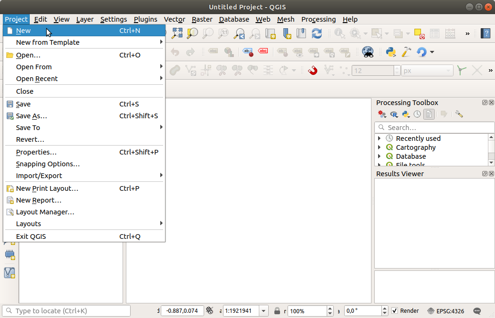

.. Purpose: This chapter aims to describe the general interaction one can have with a 
 project file that does not belong to another particular section.

.. index:: Projects
.. _`project_files`:

***************************
Working with Project Files
***************************

.. only:: html

   .. contents::
      :local:

.. index:: Projects
.. _sec_projects:

Introducing QGIS projects
=========================

The state of your QGIS session is called a project. QGIS works on one
project at a time. Any settings can be project-specific or an application-wide
default for new projects (see section :ref:`gui_options`). QGIS can save the
state of your workspace into a project file using the menu options
:menuselection:`Project -->` |fileSave| :menuselection:`Save`
or :menuselection:`Project -->` |fileSaveAs| :menuselection:`Save As...`.

.. note::

  If the project you loaded has been modified in the meantime, by default, QGIS
  will ask you if you want to overwrite the changes. This behavior is controlled
  by the |checkbox| :guilabel:`Prompt to save project and data source changes when
  required` setting under :menuselection:`Settings --> Options --> General` menu.

You can load existing projects into QGIS using :menuselection:`Project -->`
|fileOpen| :menuselection:`Open...`,
:menuselection:`Project --> New from template` or
:menuselection:`Project --> Open Recent -->`.

At startup, a list of recently opened projects is displayed, including screenshots, names and file paths
(for up to ten projects). This is a handy quick way to access recently used projects.
Double-click an entry in this list to open the corresponding project.
If you instead want to create a new project, just add any layer and the list disappears, giving
way to the map canvas.

If you want to clear your session and start fresh, go to
:menuselection:`Project -->` |fileNew| :menuselection:`New`.
This will prompt you to save the existing project if
changes have been made since it was opened or last saved.

.. _figure_new_project:

 
   Starting a new project in QGIS 

The information saved in a project file includes:

* Layers added
* Which layers can be queried
* Layer properties, including symbolization and styles
* Projection for the map view
* Last viewed extent
* Print layouts
* Print layout elements with settings
* Print layout atlas settings
* Digitizing settings
* Table Relations
* Project Macros
* Project default styles
* Plugins settings
* QGIS Server settings from the OWS settings tab in the Project properties
* Queries stored in the DB Manager

The project file is saved in XML format. This means that it is possible to edit the file
outside of QGIS if you know what you are doing. The file format has been updated several
times compared with earlier QGIS versions. Project files from older QGIS versions
may not work properly any more.

.. note::

  By default, QGIS will warn you of version differences.
  This behavior is controlled in :menuselection:`Settings --> Options`. On the
  :guilabel:`General` tab, you should tick |checkbox|
  :guilabel:`Warn when opening a project file saved with an older version of QGIS`.

Whenever you save a ``.qgs`` project in QGIS, a backup of the project file is created with the
extension ``.qgs~`` and stored in the same directory as the project file.

The extension for QGIS projects is ``.qgs`` but when saving from QGIS, the
default is to save using a compressed format with the ``.qgz`` extension.
The ``.qgs`` file is embedded in the ``.qgz`` file (a zip archive), together
with its associated sqlite database (``.qgd``) for :ref:`auxiliary data <vector_auxiliary_storage>`.
You can get to these files by unzipping.

.. note::

  A zipped project may be particularly useful with the
  :ref:`vector_auxiliary_storage` mechanism in order to embed the underlying
  database.

.. _`saveprojecttodb`:

Projects can also be saved/loaded to/from a PostgreSQL database using the
following Project menu items:

* :menuselection:`Project --> Open from`
* :menuselection:`Project --> Save to`

Both menu items have a sub-menu with a list of extra project storage implementations
(currently just PostgreSQL). Clicking the action will open a dialog to pick
a PostgreSQL connection name, schema name and project.

Projects stored in PostgreSQL can be also loaded from the QGIS browser panel
(the entries are located within the schema they are stored in), either by
double-clicking them or by dragging them to the map canvas.

.. _`sec_output`:

Generating output
=================

.. index:: Print layout, Quick print, World file
   single: Output; Save as image

There are several ways to generate output from your QGIS session. We have
already discussed saving as a project file in :ref:`sec_projects`.
Other ways to produce output files are:

* Creating images: :menuselection:`Project --> Import/Export -->` |saveMapAsImage|
  :menuselection:`Export Map
  to Image...` opens a file dialog where you select the name, path and type of
  image (PNG, JPG and many other formats). This will also create a world file
  (with extension ``PNGW`` or ``JPGW``) that is saved in the same folder as your
  image. This world file is used to georeference the image.
* Exporting to DXF files: :menuselection:`Project --> Import/Export --> Export
  Project to DXF...` opens
  a dialog where you can define the 'Symbology mode', the 'Symbology scale' and
  vector layers you want to export to DXF. Through the 'Symbology mode' symbols
  from the original QGIS Symbology can be exported with high fidelity
  (see section :ref:`create_dxf_files`).
* Exporting to PDF files: :menuselection:`Project --> Import/Export --> Export
  Map to PDF...` opens a dialog where you can define the part
  (:guilabel:`Extent`) of the map to be exported, the :guilabel:`Scale`,
  :guilabel:`Resolution`, :guilabel:`Output width` (pixels) and
  :guilabel:`Output height` (pixels).
  You can also choose to :guilabel:`Draw active decorations` and
  :guilabel:`Draw annotations`, as well as :guilabel:`Rasterize map`.
  Since QGIS 3.10, with GDAL 3 it is also possible to
  :guilabel:`Create geospatial PDF`, choose the GeoPDF :guilabel:`Format` and
  :guilabel:`Include vector feature information` in the GeoPDF file
  (GeoPDFGDAL_).
  Checking the last one will include all the geometry and attribute information
  from features visible within the page in the output GeoPDF file.
  Since QGIS 3.10, with GDAL 3 a GeoPDF file can also be used as a data source.
  For more on GeoPDF support in QGIS, see: GeoPDFQGIS_.
* Designing print maps: :menuselection:`Project -->` |newLayout|
  :menuselection:`New Print Layout...` opens a dialog where you can layout and
  print the current map canvas (see section :ref:`label_printlayout`).

.. _GeoPDFGDAL: https://gdal.org/drivers/raster/pdf.html
.. _GeoPDFQGIS: https://north-road.com/2019/09/03/qgis-3-10-loves-geopdf/

.. Substitutions definitions - AVOID EDITING PAST THIS LINE
   This will be automatically updated by the find_set_subst.py script.
   If you need to create a new substitution manually,
   please add it also to the substitutions.txt file in the
   source folder.

.. |checkbox| image:: /static/common/checkbox.png
   :width: 1.3em
.. |fileNew| image:: /static/common/mActionFileNew.png
   :width: 1.5em
.. |fileOpen| image:: /static/common/mActionFileOpen.png
   :width: 1.5em
.. |fileSave| image:: /static/common/mActionFileSave.png
   :width: 1.5em
.. |fileSaveAs| image:: /static/common/mActionFileSaveAs.png
   :width: 1.5em
.. |newLayout| image:: /static/common/mActionNewLayout.png
   :width: 1.5em
.. |saveMapAsImage| image:: /static/common/mActionSaveMapAsImage.png
   :width: 1.5em
