.. only:: html

   |updatedisclaimer|

******************
QGIS Configuration
******************

.. only:: html

   .. contents::
      :local:

QGIS is highly configurable. Through the :menuselection:`Settings` menu, it
provides different tools to:

* |options| :guilabel:`Options...`: set global :ref:`options <gui_options>` to
  apply in different areas of the software. These preferences are saved in the
  active :guilabel:`User profile` settings and applied by default whenever you
  open a new project with this profile.
  Also, they can be overridden during each QGIS session by the :ref:`project
  properties <project_properties>` (accessible under :menuselection:`Project` menu).

.. Todo: Add a link to user profile description when available

* |interfaceCustomization| :guilabel:`Interface Customization...`: configure the
  :ref:`application interface <sec_customization>`, hiding dialogs or tools you may
  not need.
* |keyboardShortcuts| :guilabel:`Keyboard Shortcuts...`: define your own set of
  :ref:`keyboard shortcuts <shortcuts>`.
* |styleManager| :guilabel:`Style Manager...`: create and manage :ref:`symbols and
  color ramps <vector_style_manager>`.
* |customProjection| :guilabel:`Custom Projections...`: create your own
  :ref:`coordinate reference systems <sec_custom_projections>`.

.. index:: Options, Configuration
.. _gui_options:

Options
=======

|options| Some basic options for QGIS can be selected using the
:guilabel:`Options` dialog. Select the menu option :menuselection:`Settings -->`
|options| :menuselection:`Options`.
You can modify the options according to your needs. Some of the changes may
require a restart of QGIS before they will be effective.

The tabs where you can customize your options are described below.

.. note:: **Plugins can embed their settings within the Options dialog**

 While only Core settings are presented below, note that this list can be extended
 by :ref:`installed plugins <plugins>` implementing their own options into the
 standard Options dialog. This avoids each plugin having their own config dialog
 with extra menu items just for them...

 .. Todo: Would be nice to link in the future to a place in the PyQGIS Cookbook
   showing the code to use to implement plugin options in standard dialog

.. _general_options:

General Settings
----------------

.. index:: Overwrite language
.. _locale_options:

**Locale Settings**

* Check |checkbox| :guilabel:`Override system locale` if you want to use a language
  different from your system's and pick the replacement in :guilabel:`Locale to use
  instead` combobox.
* Information about active system locale are provided.

**Application**

* Select the :guilabel:`Style (QGIS restart required)` |selectString| and choose
  between 'Oxygen', 'Windows', 'Motif', 'CDE', 'Plastique' and 'Cleanlooks';
* Define the :guilabel:`UI theme` |selectString|. It can be 'default' or 'Night Mapping';
* Define the :guilabel:`Icon size` |selectString|;
* Define the :guilabel:`Font` and its :guilabel:`Size`. The font can be
  |radioButtonOn| :guilabel:`Qt default` or a user-defined one;
* Change the :guilabel:`Timeout for timed messages or dialogs` |selectString|;
* |checkbox| :guilabel:`Hide splash screen at startup`;
* |checkbox| :guilabel:`Check QGIS version at startup` to keep you informed
  if a newer version is released;
* |checkbox| :guilabel:`Modeless data source manager dialog` to keep the
  :ref:`data source manager <datasourcemanager>` dialog opened and allow
  interaction with QGIS interface while adding layers to project; 
* |checkbox| :guilabel:`QGIS-styled group boxes`;
* |checkbox| :guilabel:`Use native color chooser dialogs` (see :ref:`color-selector`).

.. _projectfiles_options:

**Project files**

* :guilabel:`Open project on launch` |selectString| (choose between 'New',
  'Most recent', 'Welcome Page', and 'Specific'). When choosing 'Specific' use
  the |browseButton| to define the project to use by default. The 'Welcome Page'
  displays a list of recent projects with screenshot.
* |checkbox| :guilabel:`Create new project from default project`. You have the
  possibility to press on :guilabel:`Set current project as default` or on
  :guilabel:`Reset default`. You can browse through your files and define a
  directory where you find your user-defined project templates. This will be
  added to :menuselection:`Project --> New From Template`. If you first activate
  |checkbox| :guilabel:`Create new project from default project` and then save
  a project in the project templates folder.
* |checkbox| :guilabel:`Prompt to save project and data source changes when
  required` to avoid losing changes you made.
* |checkbox| :guilabel:`Prompt for confirmation when a layer is to be removed`
* |checkbox| :guilabel:`Warn when opening a project file saved with an older
  version of QGIS`. You can always open projects created with older version of
  QGIS but once the project is saved, trying to open with older release may fail
  because of features not available in that version.
* :guilabel:`Enable macros` |selectString|. This option was created to handle
  macros that are written to perform an action on project events. You can
  choose between 'Never', 'Ask', 'For this session only' and
  'Always (not recommended)'.

.. index:: Environment variables
.. _`env_options`:

System Settings
---------------

**SVG paths**

Add or Remove :guilabel:`Path(s) to search for Scalable Vector Graphic (SVG)
symbols`. These SVG files are then available to symbolize features or
decorate your map composition.

**Plugin paths**

Add or Remove :guilabel:`Path(s) to search for additional C++
plugin libraries`.

**Documentation paths**

Add or Remove :guilabel:`Documentation Path(s)` to use for QGIS help. By default,
a link to the official online User Manual corresponding to the version being used
is added. You can however add other links and prioritize them from top to bottom:
each time you click on a :guilabel:`Help` button in a dialog, the topmost link
is checked and if no corresponding page is found, the next one is tried,
and so on.

.. note::
  Documentation is versioned and translated only for QGIS Long Term Releases (LTR),
  meaning that if you are running a regular release (eg, QGIS 3.0), help button will
  open the *testing* manual page, which may contain description of features
  in newer release (3.2 and 3.4) or in development (3.1 and 3.3).

**QSettings**

It helps you :guilabel:`Reset user interface to default settings (restart required)`
if you made any :ref:`customization <sec_customization>`.

**Environment**

System environment variables can now be viewed, and many configured, in the
**Environment** group (see figure_environment_variables_). This is useful for
platforms, such as Mac, where a GUI application does not necessarily inherit
the user's shell environment. It's also useful for setting and viewing environment
variables for the external tool sets controlled by the Processing toolbox (e.g.,
SAGA, GRASS), and for turning on debugging output for specific sections of the
source code.

* |checkbox| :guilabel:`Use custom variables (restart required - include separators)`.
  You can :guilabel:`Add` and :guilabel:`Remove` variables. Already-defined environment
  variables are displayed in :guilabel:`Current environment variables`, and it's
  possible to filter them by activating
  |checkbox| :guilabel:`Show only QGIS-specific variables`.

.. _figure_environment_variables:

   System environment variables in QGIS

.. index:: CRS, Datum transformation, On-the-fly reprojection
.. _crs_options:

CRS Settings
------------

You can select a :guilabel:`Default CRS for new projects` applied each time you
open a new project. This Coordinate Reference System can then be overridden by
selected value in :menuselection:`Project --> Project properties --> CRS` tab.

**CRS for new layers**

This area allows you to define the action to take when a new layer is created,
or when a layer without a CRS is loaded.

* |radioButtonOn| :guilabel:`Prompt for CRS`
* |radioButtonOff| :guilabel:`Use project CRS`
* |radioButtonOff| :guilabel:`Use a default CRS`

**Default datum transformations**

In this group, you can control whether reprojecting layers to another CRS should be:

* automatically processed using QGIS default transformations settings;
* and/or more controlled by you with custom preferences such as:

  * |checkbox| :guilabel:`Ask for datum transformation if several are available`
  * a predefined list of datum transformations to apply by default.
    See :ref:`datum_transformation` for more details.

.. note:: For more information on how QGIS handles layers projection, please
  read the dedicated section at :ref:`label_projections`.

.. _figure_crs_options:

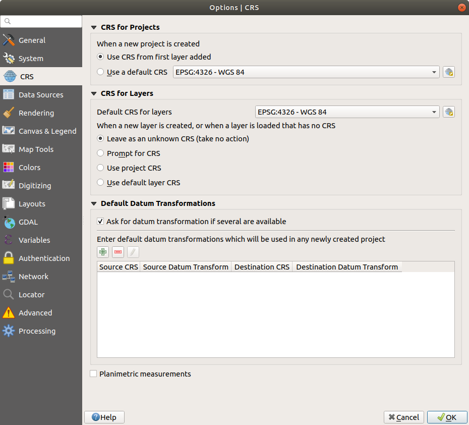

   CRS Settings in QGIS

.. _datasources_options:

Data Sources Settings
---------------------

**Feature attributes and table**

* |checkbox| :guilabel:`Open attribute table in a dock window`
* :guilabel:`Copy features as` 'Plain text, no geometry', 'Plain text, WKT geometry',
  or 'GeoJSON' when pasting features in other applications.
* :guilabel:`Attribute table behavior` |selectString|: set filter on the attribute
  table at the opening. There are three possibilities: 'Show all features',
  'Show selected features' and 'Show features visible on map'.
* :guilabel:`Default view`: define the view mode of the attribute table at every
  opening. It can be 'Remember last view', 'Table view' or 'Form view'.
* :guilabel:`Attribute table row cache` |selectNumber|. This row cache makes
  it possible to save the last loaded N attribute rows so that working with the
  attribute table will be quicker. The cache will be deleted when closing the
  attribute table.
* :guilabel:`Representation for NULL values`. Here, you can define a value for
  data fields containing a NULL value.

.. _tip_table_filtering:

.. tip:: **Improve opening of big data attribute table**

 When working with layers with big amount of records, opening the attribute table
 may be slow as the dialog request all the rows in the layer. Setting the
 :guilabel:`Attribute table behavior` to **Show features visible on map** will
 make QGIS request only the features in the current map canvas when opening the
 table, allowing a quick data loading.

 Note that data in this attribute table instance will be always tied to the canvas
 extent it was opened with, meaning that selecting **Show All Features** within
 such a table will not display new features. You can however update the set of
 displayed features by changing the canvas extent and selecting **Show Features
 Visible On Map** option in the attribute table.

**Data source handling**

* :guilabel:`Scan for valid items in the browser dock` |selectString|. You can
  choose between 'Check extension' and 'Check file contents'.
* :guilabel:`Scan for contents of compressed files (.zip) in browser dock`
  |selectString| defines how detailed is the widget information at the bottom
  of the Browser panel when querying such files. 'No', 'Basic scan' and 'Full scan'
  are possible options.
* :guilabel:`Prompt for raster sublayers when opening`. Some rasters support
  sublayers --- they are called subdatasets in GDAL. An example is netCDF files
  --- if there are many netCDF variables, GDAL sees every variable as a
  subdataset. The option allows you to control how to deal with sublayers when a file
  with sublayers is opened. You have the following choices:

  * ‘Always’: Always ask (if there are existing sublayers)
  * ‘If needed’: Ask if layer has no bands, but has sublayers
  * ‘Never’: Never prompt, will not load anything
  * ‘Load all’: Never prompt, but load all sublayers

* |checkbox| :guilabel:`Ignore shapefile encoding declaration`. If a shapefile
  has encoding information, this will be ignored by QGIS.
* |checkbox| :guilabel:`Add PostGIS layers with double click and select in
  extended mode`
* |checkbox| :guilabel:`Add Oracle layers with double click and select in
  extended mode`
* |checkbox| :guilabel:`Execute expressions on server-side if possible`
* |checkbox| :guilabel:`Evaluate default values` defines whether default values
  from database provider should be calculated when digitizing the new feature
  (checked status) or when saving the changes.

**Hidden Browser Path**

This widget lists all the folders you chose to hide from the :ref:`Browser panel
<browser_panel>`.
Removing a folder from the list will make it available in the Browser panel.

.. _figure_data_sources_settings:

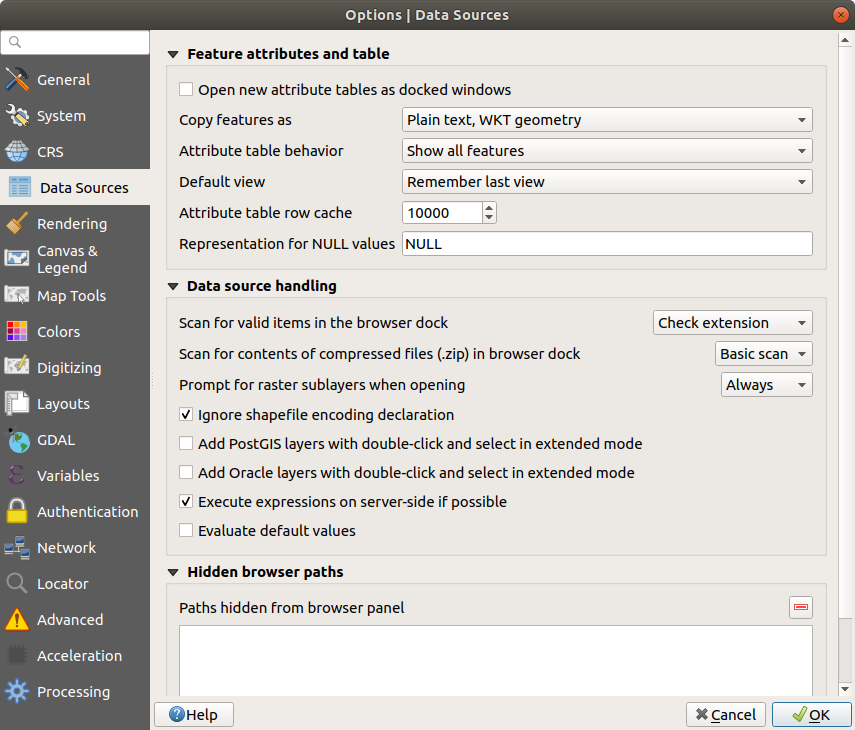

   Data Sources Settings in QGIS

.. index:: Rendering
.. _rendering_options:

Rendering Settings
------------------

.. _figure_rendering_menu:

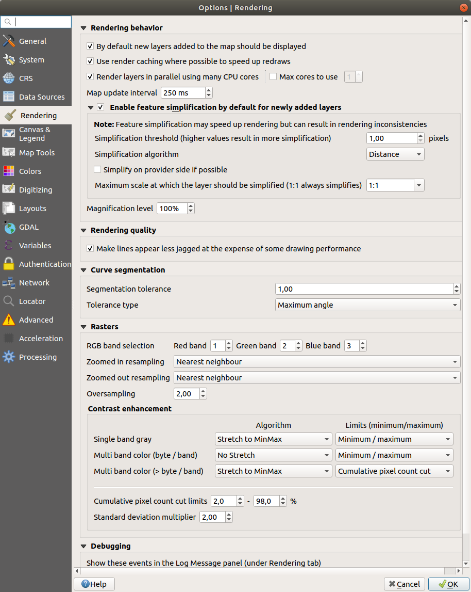

   Rendering tab of Project Properties dialog

**Rendering behavior**

* |unchecked| :guilabel:`By default new layers added to the map should be
  displayed`: unchecking this option can be handy when loading multiple layers
  to avoid each new layer being rendered in the canvas and slow down the process
* |checkbox| :guilabel:`Use render caching where possible to speed up redraws`
* |checkbox| :guilabel:`Render layers in parallel using many CPU cores`
* |checkbox| :guilabel:`Max cores to use`
* :guilabel:`Map update interval (default to 250 ms)`

.. _global_simplification:

* |checkbox| :guilabel:`Enable feature simplification by default for newly added layers`
* :guilabel:`Simplification threshold`
* :guilabel:`Simplification algorithm`: This option performs a local
  "on-the-fly" simplification on feature's and speeds up geometry rendering. It
  doesn't change the geometry fetched from the data providers. This is important
  when you have expressions that use the feature geometry (e.g. calculation of
  area) - it ensures that these calculations are done on the original geometry,
  not on the simplified one. For this purpose, QGIS provides three algorithms:
  'Distance' (default), 'SnapToGrid' and 'Visvalingam'.
* |checkbox| :guilabel:`Simplify on provider side if possible`: the geometries
  are simplified by the provider (PostGIS, Oracle...) and unlike the
  local-side simplification, geometry-based calculations may be affected
* :guilabel:`Maximum scale at which the layer should be simplified`
* |doubleSpinBox| :guilabel:`Magnification level` (see the :ref:`magnifier <magnifier>`)

.. note:: Besides the global setting, feature simplification can be set for any
   specific layer from its :menuselection:`Layer properties --> Rendering` menu.

**Rendering quality**

* |checkbox| :guilabel:`Make lines appear less jagged at the expense of some
  drawing performance`

**Curve segmentation**

* :guilabel:`Segmentation tolerance`: this setting controls the way circular arcs
  are rendered. **The smaller** maximum angle (between the two consecutive vertices
  and the curve center, in degrees) or maximum difference (distance between the
  segment of the two vertices and the curve line, in map units), the **more
  straight line** segments will be used during rendering.
* :guilabel:`Tolerance type`: it can be *Maximum angle* or *Maximum difference*
  between approximation and curve.

**Rasters**

* With :guilabel:`RGB band selection`, you can define the number for the Red,
  Green and Blue band.

*Contrast enhancement*

Contrast enhancement options can be applied to :guilabel:`Single band gray`,
:guilabel:`Multi band color (byte/band)` or :guilabel:`Multi band color (>byte/band)`.
For each, you can set:

* the :guilabel:`Algorithm` to use, whose values can be 'No stretch',
  'Stretch to MinMax', 'Stretch and Clip to MinMax' or 'Clip to MinMax'
* the :guilabel:`Limits (minimum/maximum)` to apply, with values such as 'Cumulative
  pixel count cut', 'Minimum/Maximum', 'Mean +/- standard deviation'.

For rasters rendering, you can also define the following options:

* :guilabel:`Cumulative pixel count cut limits`
* :guilabel:`Standard deviation multiplier`

**Debugging**

* |checkbox| :guilabel:`Map canvas refresh` to debug rendering duration in
  the :guilabel:`Log Messages` panel.

.. _canvas_legend_options:

Canvas and Legend Settings
--------------------------

.. _figure_canvas_legend:

   Canvas and Legend Settings

These properties let you set:

* the **Default map appearance (overridden by project properties)**: the
  :guilabel:`Selection color` and :guilabel:`Background color`.

* **Layer legend** interaction:

  * :guilabel:`Double click action in legend` |selectString|. You can either
    'Open layer properties', 'Open attribute table' or 'Open layer styling dock'
    with the double click.
  * |checkbox| :guilabel:`Display classification attribute names` in the Layers
    panel, e.g. when applying a categorized or rule-based renderer
    (see :ref:`vector_style_menu` for more information).
  * the :guilabel:`WMS getLegendGraphic Resolution`
* the :guilabel:`Delay` in milliseconds of layers :ref:`map tips <maptips>` display

.. index:: Map tools
.. _maptools_options:

Map tools Settings
------------------

This tab offers some options regarding the behavior of the :ref:`Identify tool <identify>`.

* :guilabel:`Search radius for identifying features and displaying map tips` is
  a tolerance distance within which the identify tool will depict results
  as long as you click within this tolerance.
* :guilabel:`Highlight color` allows you to choose with which color should features being
  identified be highlighted.
* :guilabel:`Buffer` determines a buffer distance
  to be rendered from the outline of the identify highlight.
* :guilabel:`Minimum width` determines how thick should
  the outline of a highlighted object be.

**Measure tool**

* Define :guilabel:`Rubberband color` for measure tools
* Define :guilabel:`Decimal places`
* |checkbox| :guilabel:`Keep base unit` to not automatically convert large numbers
  (e.g., meters to kilometers)
* :guilabel:`Preferred distance units` |radioButtonOn| ('Meters', 'Kilometers', 'Feet',
  'Yards', 'Miles', 'Nautical Miles', 'Degrees' or 'Map Units' )
* :guilabel:`Preferred area units` |radioButtonOn| ('Square meters', 'Square
  kilometers', 'Square feet', 'Square yards', 'Square miles', 'Hectares',
  'Acres', 'Square nautical miles', 'Square degrees' or 'Map Units')
* :guilabel:`Preferred angle units` |radioButtonOn| ('Degrees', 'Radians', 'Gon/gradians',
  'Minutes of arc', 'Seconds of arc' or 'Turns/revolutions')

**Panning and zooming**

* Define a :guilabel:`Zoom factor` for zoom tools or wheel mouse

.. _predefinedscales:

**Predefined scales**

Here, you find a list of predefined scales. With the |signPlus|
and |signMinus| buttons you can add or remove your personal scales.
You can also import or export scales from/to a ``.XML`` file. Note that you still have
the possibility to remove your changes and reset to the predefined list.

.. _figure_map_tools_settings:

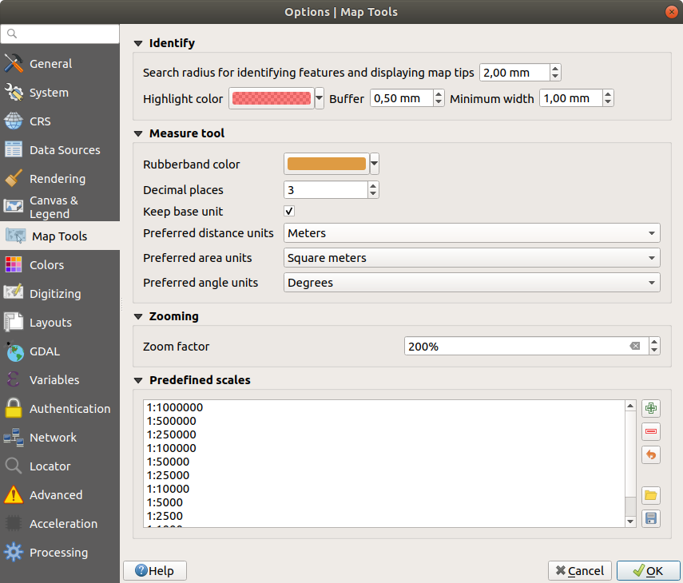

   Map tools Settings in QGIS

.. index:: Colors
.. _colors_options:

Colors Settings
---------------

This menu allows you to create or update palettes of colors used throughout the
application in the :ref:`color selector widget <color_widget>`. You can choose
from:

* :guilabel:`Recent colors` showing recently used colors;
* :guilabel:`Standard colors`, the default palette of colors;
* :guilabel:`Project colors`, a set of colors specific to the current project;
* :guilabel:`New layer colors`, a set of colors to use by default when new
  layers are added to QGIS;
* or custom palette(s) you can create or import using the :guilabel:`...`
  button next to the palette combobox.

By default, :guilabel:`Recent colors`, :guilabel:`Standard colors` and
:guilabel:`Project colors` palettes can not be removed and are set to appear in
the color button drop-down. Custom palettes can also be added to this widget
thanks to the :guilabel:`Show in Color Buttons` option.

For any of the palettes, you can manage the list of colors using the set of
tools next to the frame, ie: 

* add or remove colors;
* copy or paste colors;
* import or export the set of colors from/to :file:`.gpl` file.

Double-click a color in the list to tweak or replace it in the :ref:`Color
Selector <color-selector>` dialog.

.. _figure_colors_options:

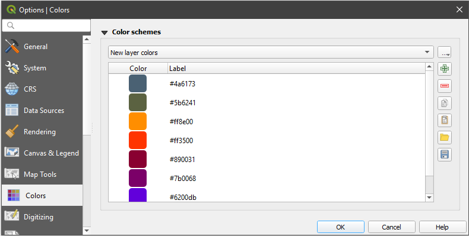

   Colors Settings

.. index:: Digitizing configuration
.. _digitizing_options:

Digitizing Settings
-------------------

This tab helps you configure general settings when :ref:`editing vector layer
<editingvector>` (attributes and geometry).

**Feature creation**

* |checkbox| :guilabel:`Suppress attribute form pop-up after feature creation`:
  this choice can be overridden in each layer properties dialog.
* |checkbox| :guilabel:`Reuse last entered attribute values`.
* :guilabel:`Validate geometries`. Editing complex lines and polygons with many
  nodes can result in very slow rendering. This is because the default
  validation procedures in QGIS can take a lot of time. To speed up rendering, it
  is possible to select GEOS geometry validation (starting from GEOS 3.3) or to
  switch it off. GEOS geometry validation is much faster, but the disadvantage
  is that only the first geometry problem will be reported.
* :guilabel:`Default Z value` to use when creating new 3D features.

**Rubberband**

* Define Rubberband :guilabel:`Line width`, :guilabel:`Line color`
  and :guilabel:`Fill color`.
* :guilabel:`Don't update rubberband during vertex editing`.

**Snapping**

* |checkbox| :guilabel:`Enable snapping by default`
* Define :guilabel:`Default snap mode` |selectString| ('Vertex', 'Vertex and segment',
  'Segment')
* Define :guilabel:`Default snapping tolerance` in map units or pixels
* Define the :guilabel:`Search radius for vertex edits` in map units or pixels
* :guilabel:`Display main dialog as (restart required)`: set whether the
  Advanced Snapping dialog should be shown as 'Dialog' or 'Dock'.
* :guilabel:`Snapping marker color`
* |checkbox| :guilabel:`Show snapping tooltips` such as name of the layer whose
  feature you are about to snap. Helpful when multiple features overlap.
* |checkbox| :guilabel:`Enable snapping on invisible features` 

**Vertex markers**

* |checkbox| :guilabel:`Show markers only for selected features`
* Define vertex :guilabel:`Marker style` |selectString| ('Cross' (default), 'Semi
  transparent circle' or 'None')
* Define vertex :guilabel:`Marker size`

**Curve offset tool**

The next 3 options refer to the |offsetCurve| :sup:`Offset Curve` tool in
:ref:`sec_advanced_edit`. Through the various settings, it is possible to
influence the shape of the line offset. These options are possible starting
from GEOS 3.3.

* :guilabel:`Join style`: 'Round', 'Mitre' or 'Bevel'
* :guilabel:`Quadrant segments`
* :guilabel:`Miter limit`

.. _figure_digitizing_settings:

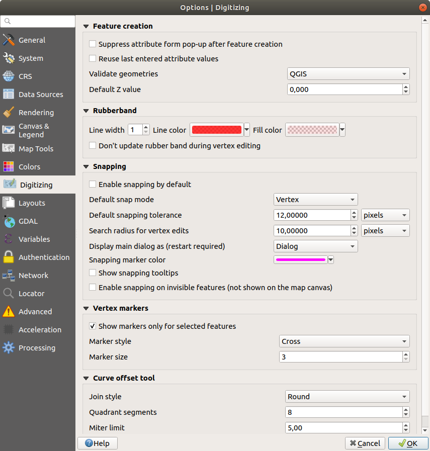

   Digitizing Settings in QGIS

.. _layout_options:

Layouts Settings
----------------

**Composition defaults**

You can define the :guilabel:`Default font` used within the :ref:`print layout
<label_printlayout>`.

**Grid appearance**

* Define the :guilabel:`Grid style` |selectString| ('Solid', 'Dots', 'Crosses')
* Define the :guilabel:`Grid color`

**Grid and guide defaults**

* Define the :guilabel:`Grid spacing` |selectNumber|
* Define the :guilabel:`Grid offset` |selectNumber| for x and y
* Define the :guilabel:`Snap tolerance` |selectNumber|

**Layout Paths**

* Define :guilabel:`Path(s) to search for extra print templates`: a list of folders
  with custom layout templates to use while creating new one.

.. _figure_layouts_settings:

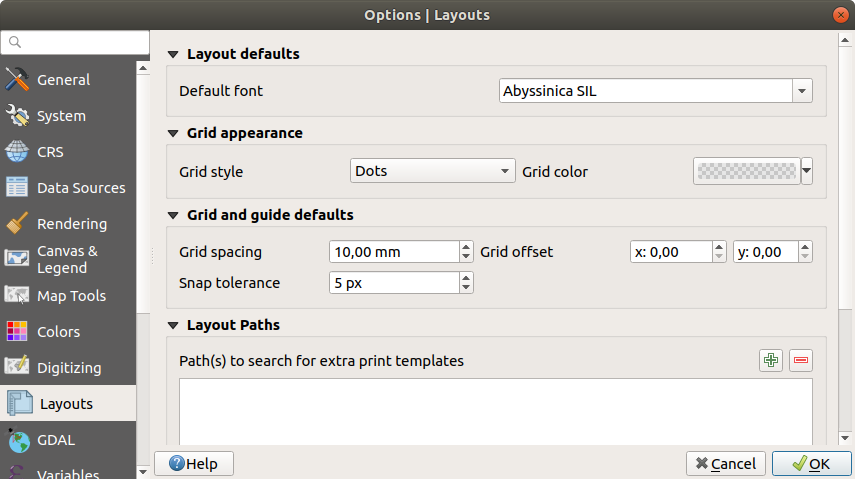

   Layouts Settings in QGIS

.. _gdal_options:

GDAL Settings
-------------

GDAL is a data exchange library for raster files. In this tab, you can
:guilabel:`Edit create options` and :guilabel:`Edit Pyramids Options` of the
raster formats. You can define which GDAL driver is to be used for a raster
format, as in some cases more than one GDAL driver is available.

.. _figure_gdal_settings:

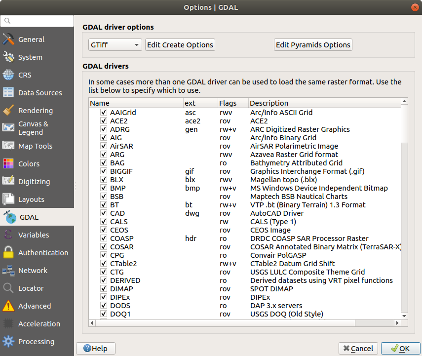

   GDAL Settings in QGIS

.. index:: Variables
.. _variables_options:

Variables Settings
------------------

The :guilabel:`Variables` tab lists all the variables available at the
global-level.

It also allows the user to manage global-level variables. Click the |signPlus|
button to add a new custom global-level variable. Likewise, select a custom
global-level variable from the list and click the |signMinus| button to remove
it.

More information about variables in the :ref:`general_tools_variables`
section.

.. _figure_variables_settings:

.. figure:: img/options_variables.png
   :align: center

   Variables Settings in QGIS

.. index:: Authentication
.. _authentication_options:

Authentication Settings
-----------------------

In the :guilabel:`Authentication` tab you can set authentication configurations
and manage PKI certificates. See :ref:`authentication_index` for more
details.

.. _figure_authentication_settings:

.. figure:: img/options_authentication.png
   :align: center

   Authentication Settings in QGIS

.. _figure_authentication_settings_adding_new:

.. figure:: img/options_authentication_add.png
   :align: center

   Adding authentication configuration to Authentication Settings

.. index:: Proxy, Network
.. _network_options:

Network Settings
----------------

**General**

* Define :guilabel:`WMS search address`, default is
  ``http://geopole.org/wms/search?search=\%1\&type=rss``
* Define :guilabel:`Timeout for network requests (ms)` - default is 60000
* Define :guilabel:`Default expiration period for WMS Capabilities (hours)` - default is 24
* Define :guilabel:`Default expiration period for WMSC/WMTS tiles (hours)` - default is 24
* Define :guilabel:`Max retry in case of tile or feature request errors`
* Define :guilabel:`User-Agent`

.. _figure_network_tab:

.. figure:: img/proxy-settings.png
   :align: center

   Proxy-settings in QGIS

**Cache settings**

Defines the :guilabel:`Directory` and a :guilabel:`Size` for the cache.
Also offers tools to :guilabel:`automatically clear the connection authentication
cache on SSL errors (recommanded)`.

**Proxy for web access**

* |checkbox| :guilabel:`Use proxy for web access`
* Set the :guilabel:`Proxy type` |selectString| according to your needs and
  define 'Host' and 'Port'. Available proxy types are:

  * :menuselection:`Default Proxy`: Proxy is determined based on system's proxy
  * :menuselection:`Socks5Proxy`: Generic proxy for any kind of connection.
    Supports TCP, UDP, binding to a port (incoming connections) and authentication.
  * :menuselection:`HttpProxy`: Implemented using the "CONNECT" command, supports
    only outgoing TCP connections; supports authentication.
  * :menuselection:`HttpCachingProxy`: Implemented using normal HTTP commands, it
    is useful only in the context of HTTP requests.
  * :menuselection:`FtpCachingProxy`: Implemented using an FTP proxy, it is
    useful only in the context of FTP requests.

Credentials of proxy are set using the :ref:`authentication widget <authentication>`.

Excluding some URLs can be added to the text box below the proxy settings (see
Figure_Network_Tab_).

If you need more detailed information about the different proxy settings,
please refer to the manual of the underlying QT library documentation at
https://doc.qt.io/qt-5.9/qnetworkproxy.html#ProxyType-enum

.. tip:: **Using Proxies**

   Using proxies can sometimes be tricky. It is useful to proceed by 'trial and
   error' with the above proxy types, to check if they succeed in your case.

.. index:: Search widget, Locator
.. _locator_options:

Locator Settings
----------------

|search| The :guilabel:`Locator` tab allows to configure the **Locator bar**, a
quick search widget available on the status bar that helps you perform searches
anywhere in the application. It provides some default filters (with prefix) to use:

* Project layers (``l``): finds and selects a layer in the :guilabel:`Layers`
  panel.
* Project layouts (``pl``): finds and opens a print layout.
* Actions (``.``): finds and executes a QGIS action; actions can be any tool
  or menu in QGIS, opening a panel...
* Active layer features (``f``): searches for matching attributes in any field
  from the current active layer and zooms to the selected feature.
* Features in all layers (``af``): searches for matching attributes in the
  :ref:`display name <maptips>` of each :ref:`searchable layers <project_layer_capabilities>`
  and zooms to the selected feature.
* Calculator (``=``): allows evaluation of any QGIS expression and, if valid,
  gives an option to copy the result to the clipboard.
* Spatial bookmarks (``b``): finds and zooms to the bookmark extent.
* Settings (``set``): browses and opens project and application-wide properties
  dialogs.
* Processing (``a``): searches and opens a Processing algorithm dialog.
* Edit selected features (``ef``): gives quick access and runs a compatible
  :ref:`modify-in-place <processing_inplace_edit>` Processing algorithm on the
  active layer.

For each filter, you can customize the filter, set whether it is enabled by default or not.
The set of default locator filters can be extended by plugins, eg for OSM
nominatim searches, direct database searching, layer catalog searches.

The locator search bar can be activated pressing :kbd:`Ctrl+K`. Type your text
to perform a search. By default, results are returned for all enabled locator
filters but you can limit the search to a certain filter by prefixing your
text with the locator filter prefix, ie. typing ``l cad`` will return only the
layers whose name contains ``cad``. Click on the result to execute the
corresponding action, depending on the type of item.

Searching is handled using threads, so that results always become available as
quickly as possible, regardless of whether any slow search filters may be
installed. They also appear as soon as each result is encountered by each
filter, which means that e.g. a file search filter will show results one by one
as the file tree is scanned. This ensures that the UI is always responsive even
if a very slow search filter is present (e.g. one which uses an online service).

.. tip:: **Quick access to the locator's configurations**

  Click on the |search| icon inside the locator widget on the status bar to
  display the list of filters you can use and a :guilabel:`Configure` entry that
  opens the :guilabel:`Locator` tab of the :menuselection:`Settings -->
  Options...` menu.

.. _figure_locator_settings:

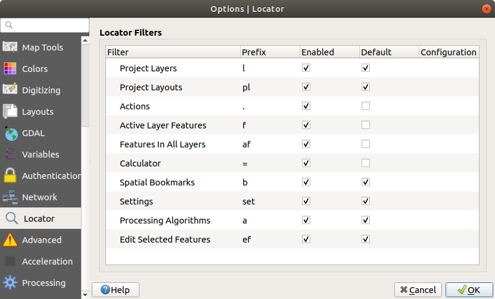

   Locator Settings in QGIS

.. _optionsadvanced:

Advanced Settings
-----------------

Depending on your OS, all the settings related to QGIS (UI, tools, data providers,
default values, plugins options...) are saved:

* |nix| in a text file: :file:`$HOME/.config/QGIS/QGIS2.conf`
* |osx| in the properties list file: :file:`$HOME/Library/Preferences/org.qgis.qgis.plist`
* |win| in the registry under: ``HKEY\CURRENT_USER\Software\QGIS\qgis``

The :guilabel:`Advanced` tab offers you in a single place, regardless your OS,
means to manage these settings through the :guilabel:`Advanced Settings Editor`.
After you promise to be careful,
the widget is populated with a tree of all QGIS settings, which you can directly edit.

.. warning:: **Avoid using the Advanced tab settings blindly**

   Be careful while modifying items in this dialog given that changes are
   automatically applied. Doing changes without knowledge can break your
   QGIS installation in various ways.

.. _figure_advanced_settings:

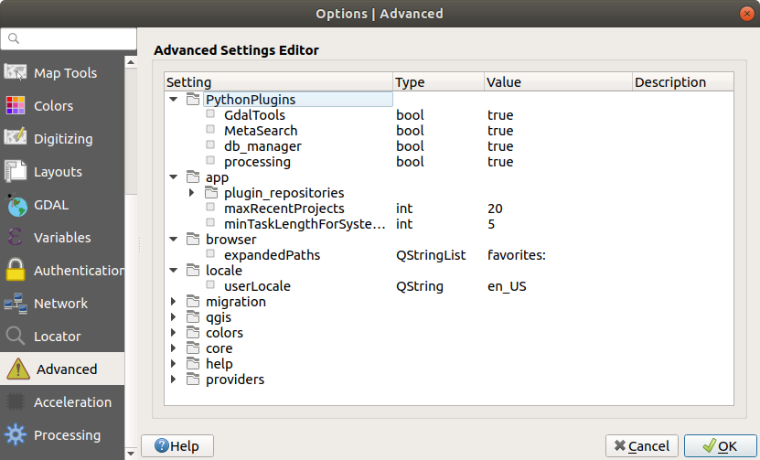

   Advanced Settings tab in QGIS

Processing Settings
-------------------

The |processing| :guilabel:`Processing` tab provides you with general settings
of tools and data providers that are used in the QGIS Processing framework.
More information at :ref:`label_processing`.

.. comment for writers:
 Actually, there seems to not be a real section describing the Processing options
 dialog. So the link above should be redirected if ever such a section is
 created, preferably in Processing chapter.

.. _figure_processing_settings:

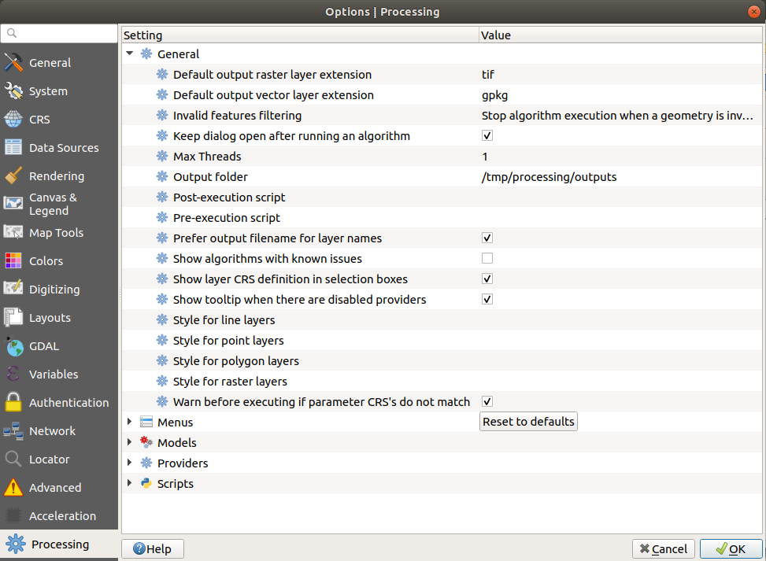

   Processing Settings tab in QGIS

.. index:: Project properties
   single: Project; Properties
   single: Settings; Project

.. _project_properties:

Project Properties
==================

In the properties window for the project under :menuselection:`Project -->
Project Properties`, you can set project-specific options.
The project-specific options overwrite their equivalent in the :guilabel:`Options`
dialog described above.

General Properties
------------------

In the :guilabel:`General` tab, the :guilabel:`General settings` let you:

* give a title to the project beside the project file path
* choose the color to use for features when they are selected
* choose the background color: the color to use for the map canvas
* set whether the path to layers in the project should be saved as absolute
  (full) or as relative to the project file location. You may prefer
  relative path when both layers and project files can be moved or shared
  or if the project is accessed from computers on different platforms.
* choose to avoid artifacts when project is rendered as map tiles. Note that
  checking this option can lead to performance degradation.

Calculating areas and distances is a common need in GIS. However, these values
are really tied to the underlying projection settings. The :guilabel:`Measurements`
frame lets you control these parameters. You can indeed choose:

* the :guilabel:`Ellipsoid`, on which distance and area calculations are entirely
  based; it can be:

  * **None/Planimetric**: returned values are in this case cartesian measurements.
  * a **Custom** one: you'll need to set values of the semi-major and semi-minor axes.
  * or an existing one from a predefined list (Clarke 1866, Clarke 1880 IGN,
    New International 1967, WGS 84...).
* the :guilabel:`units for distance measurements` for length and perimeter and
  the :guilabel:`units for area measurements`. These settings, which default
  to the units set in QGIS options but then overrides it for the current project,
  are used in:

  * Attribute table field update bar
  * Field calculator calculations
  * Identify tool derived length, perimeter and area values
  * Default unit shown in measure dialog

The :guilabel:`Coordinate display` allows you to choose and customize the format of units
to use to display the mouse coordinate in the status bar and the derived coordinates
shown via the identify tool.

Finally, you can set a :guilabel:`Project predefined scales` list, which overrides
the global predefined scales.

.. _figure_general_tab:

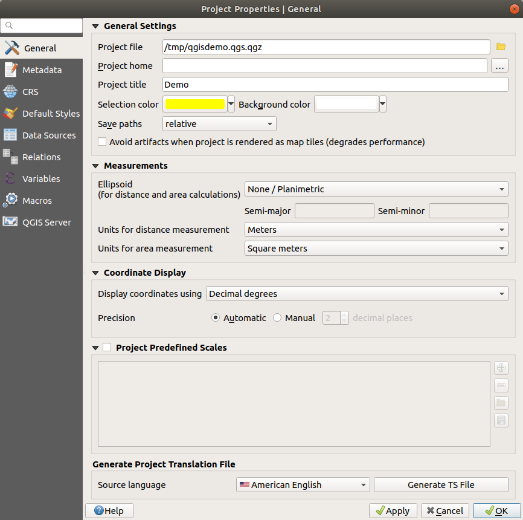

   General tab of Project Properties dialog

Metadata Properties
-------------------

The :guilabel:`Metadata` tab allows detailed metadata to be defined,
including (among the others): author, creation date, language, abstracts,
categories, keywords, contact details, links, history. There is also a
validation functionality that checks if specific fields were filled, anyway
this is not enforced. See :ref:`vector layer metadata properties
<vectormetadatamenu>` for some details.

CRS Properties
--------------

The |crs| :guilabel:`CRS` tab helps you set the coordinate reference system
to use in this project. It can be:

* |checkbox| :guilabel:`No projection (or unknown/non-Earth projection)`:
  this setting can be used to guess a layer CRS or when using QGIS for non
  earth uses like role-playing game maps, building mapping or microscopic stuff.
  In this case:

  * No reprojection is done while rendering the layers: features are just drawn
    using their raw coordinates.
  * The ellipsoid is locked out and forced to ``None/Planimetric``.
  * The distance and area units, and the coordinate display are locked out and
    forced to "unknown units"; all measurements are done in unknown map units,
    and no conversion is possible.

* or an existing coordinate reference system that can be *geographic*, *projected*
  or *user-defined*. A preview of the CRS extent on earth is displayed to
  help you select the appropriate one.
  Layers added to the project are on-the-fly translated to this CRS in order
  to overlay them regardless their original CRS. Use of units, ellipsoid setting
  are available and make sense and you can perform calculations accordingly.

The |crs| :guilabel:`CRS` tab also helps you control the layers reprojection
settings by configuring the datum transformation preferences to apply in the
current project. As usual, these override any corresponding global settings.
See :ref:`datum_transformation` for more details.

Default Styles Properties
-------------------------

The :guilabel:`Default Styles` tab lets you control how new layers will be
drawn when they do not have an existing :file:`.qml` style defined. You can
also set the default transparency level for new layers and whether symbols
should have random colors assigned to them.
There is also an additional section where you can define specific colors for the
running project. You can find the added colors in the drop down menu of the color dialog
window present in each renderer.

Data Sources Properties
-----------------------

In the :guilabel:`Data Sources` tab, you can:

* |unchecked| :guilabel:`Automatically create transaction groups where possible`:
  When this mode is turned on, all
  (postgres) layers from the same database are synchronised in their edit state,
  i.e. when one layer is put into edit state, all are, when one layer is committed
  or one layer is rolled back, so are the others. Also, instead of buffering edit
  changes locally, they are directly sent to a transaction in the database which
  gets committed when the user clicks save layer.
  Note that you can (de)activate this option only if no layer is being edited
  in the project.
* |unchecked| :guilabel:`Evaluate default values on provider side`: When adding
  new features in a PostgreSQL table, fields with default value constraint are
  evaluated and populated at the form opening, and not at the commit moment.
  This means that instead of an expression like ``nextval('serial')``, the field
  in the :guilabel:`Add Feature` form will display expected value (e.g., ``25``).
* |unchecked| :guilabel:`Trust project when data source has no metadata`:
  To speed up project loading by skipping data checks. Useful in QGIS Server context
  or in projects with huge database views/materialized views. The extent of layers
  will be read from the QGIS project file (instead of data sources) and when
  using the PostgreSQL provider the primary key unicity will not be 
  checked for views and materialized views.

.. _project_layer_capabilities:

* Configure the :guilabel:`Layers Capabilities`, i.e.:
  
  * Set (or disable) which layers are ``identifiable``, i.e. will respond to the
    :ref:`identify tool <identify>`. By default, layers are set queryable.
  * Set whether a layer should appear as ``read-only``, meaning that
    it can not be edited by the user, regardless of the data provider's
    capabilities. Although this is a weak protection, it remains a quick and handy
    configuration to avoid end-users modifying data when working with file-based layers.
  * Define which layers are ``searchable``, i.e. could be queried using the
    :ref:`locator widget <locator_options>`. By default, layers are set searchable.
  * Define which layers are defined as ``required``. Checked layers in this list
    are protected from inadvertent removal from the project.

  The :guilabel:`Layers Capabilities` table provides some convenient tools to:

  * Select multiple cells and press :guilabel:`Toggle Selection` to have them change their
    checkbox state;
  * |unchecked| :guilabel:`Show spatial layers only`, filtering out non-spatial
    layers from the layers list;
  * |search| :guilabel:`Filter layers...` and quickly find a particular layer to
    configure.

Relations Properties
--------------------

The :guilabel:`Relations` tab is used to define 1:n relations. The relations
are defined in the project properties dialog. Once relations exist for a layer,
a new user interface element in the form view (e.g. when identifying a feature
and opening its form) will list the related entities. This provides a powerful
way to express e.g. the inspection history on a length of pipeline or road segment.
You can find out more about 1:n relations support in Section :ref:`vector_relations`.

Variables Properties
--------------------

The :guilabel:`Variables` tab lists all the variables available at
the project's level (which includes all global variables). Besides, it
also allows the user to manage project-level variables. Click the |signPlus|
button to add a new custom project-level variable. Likewise, select a custom
project-level variable from the list and click the |signMinus| button to
remove it.
More information on variables usage in the General Tools
:ref:`general_tools_variables` section.

Macros Properties
-----------------

The :guilabel:`Macros` tab is used to edit Python macros for projects. Currently,
only three macros are available: ``openProject()``, ``saveProject()`` and
``closeProject()``.

.. _figure_macro_tab:

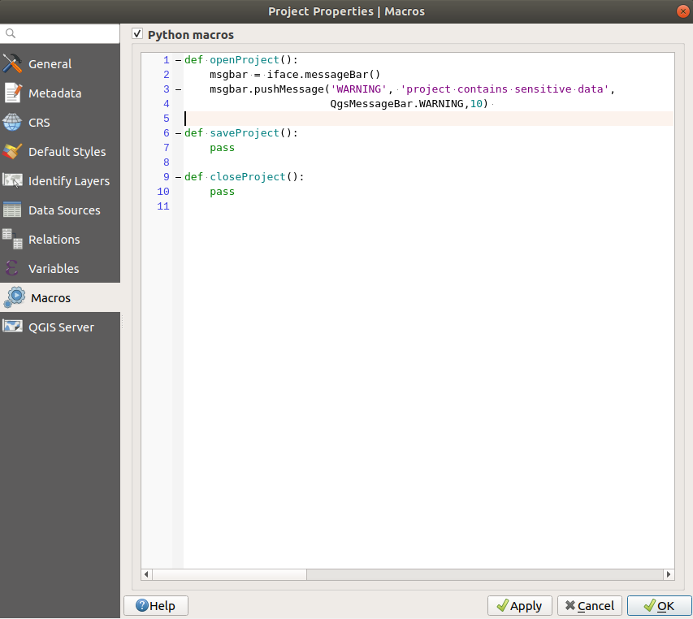

   Macro settings in QGIS

QGIS Server Properties
----------------------

The tab :guilabel:`QGIS Server` allows you to configure your project in order
to publish it online. Here you can define information about the QGIS
Server WMS and WFS capabilities, extent and CRS restrictions. More information
available in section :ref:`Creatingwmsfromproject` and subsequent.

.. index:: Customization
.. _sec_customization:

Customization
=============

The customization dialog lets you (de)activate almost every element in the QGIS
user interface. This can be very useful if you want to provide your end-users with a
'light' version of QGIS, containing only the icons, menus or panels they need.

.. note::
   Before your changes are applied, you need to restart QGIS.

.. _figure_customization:

   The Customization dialog

Ticking the |checkbox| :guilabel:`Enable customization` checkbox is the first step
on the way to QGIS customization. This enables the toolbar and the widget
panel from which you can uncheck and thus disable some GUI items.

The configurable item can be:

* a **Menu** or some of its sub-menus from the :ref:`label_menubar`
* a whole **Panel** (see :ref:`sec_panels_and_toolbars`)
* the **Status bar** described in :ref:`label_statusbar` or some of its items
* a **Toolbar**: the whole bar or some of its icons
* or any **widget** from any dialog in QGIS: label, button, combobox...

With |select| :sup:`Switch to catching widgets in main application`, you
can click on an item in QGIS interface that you want to be hidden and
QGIS automatically unchecks the corresponding entry in the Customization dialog.

Once you setup your configuration, click :guilabel:`Apply` or :guilabel:`OK` to validate your
changes. This configuration becomes the one used by default by QGIS at the next startup.

The modifications can also be saved in a ``.ini`` file using |fileSave|
:sup:`Save To File` button. This is a handy way to share a common QGIS
interface among multiple users. Just click on |fileOpen| :sup:`Load from File`
from the destination computer in order to import the ``.ini`` file.
You can also run :ref:`command line tools <custom_commandline>` and save various
setups for different use cases as well.

.. _tip_restoring_configuration:

.. tip:: **Easily restore predefined QGIS**

   The initial QGIS GUI configuration can be restored by one of the methods below:

   * unchecking |checkbox| :guilabel:`Enable customization` option in the
     Customization dialog or click the |selectAllTree| :sup:`Check All` button
   * pressing the :guilabel:`Reset` button in the **QSettings** frame under
     :menuselection:`Settings --> Options` menu, :guilabel:`System` tab
   * launching QGIS at a command prompt with the following command line
     ``qgis --nocustomization``
   * setting to ``false`` the value of :menuselection:`UI --> Customization -->
     Enabled` variable under :menuselection:`Settings --> Options` menu,
     :guilabel:`Advanced` tab (see the :ref:`warning <optionsadvanced>`).

   In most cases, you need to restart QGIS in order to have the change applied.

.. index:: Keyboard shortcuts
.. _shortcuts:

Keyboard shortcuts
==================

QGIS provides default keyboard shortcuts for many features. You can find them in
section :ref:`label_menubar`. Additionally, the menu option
:menuselection:`Settings -->` |keyboardShortcuts| :menuselection:`Keyboard
Shortcuts...` allows you to change the default keyboard shortcuts and add new
ones to QGIS features.

.. _figure_shortcuts:

   Define shortcut options

Configuration is very simple. Use the search box at the top of the dialog
to find a particular action, select it from the list and click on :

* :guilabel:`Change` and press the new combination you want to assign as new shortcut
* :guilabel:`Set None` to clear any assigned shortcut
* or :guilabel:`Set Default` to backup the shortcut to its original and default value.

Proceed as above for any other tools you wish to customize. Once you have
finished your configuration, simply :guilabel:`Close` the dialog to have your changes
applied. You can also :guilabel:`Save` the changes as an :file:`.XML` file
and :guilabel:`Load` them into another QGIS installation.

.. Substitutions definitions - AVOID EDITING PAST THIS LINE
   This will be automatically updated by the find_set_subst.py script.
   If you need to create a new substitution manually,
   please add it also to the substitutions.txt file in the
   source folder.

.. |browseButton| image:: /static/common/browsebutton.png
   :width: 2.3em
.. |checkbox| image:: /static/common/checkbox.png
   :width: 1.3em
.. |crs| image:: /static/common/CRS.png
   :width: 1.5em
.. |customProjection| image:: /static/common/mActionCustomProjection.png
   :width: 1.5em
.. |doubleSpinBox| image:: /static/common/doublespinbox.png
   :width: 1.5em
.. |fileOpen| image:: /static/common/mActionFileOpen.png
   :width: 1.5em
.. |fileSave| image:: /static/common/mActionFileSave.png
   :width: 1.5em
.. |interfaceCustomization| image:: /static/common/mActionInterfaceCustomization.png
   :width: 1.5em
.. |keyboardShortcuts| image:: /static/common/mActionKeyboardShortcuts.png
   :width: 1.5em
.. |nix| image:: /static/common/nix.png
   :width: 1em
.. |offsetCurve| image:: /static/common/mActionOffsetCurve.png
   :width: 1.5em
.. |options| image:: /static/common/mActionOptions.png
   :width: 1em
.. |osx| image:: /static/common/osx.png
   :width: 1em
.. |processing| image:: /static/common/processingAlgorithm.png
   :width: 1.5em
.. |radioButtonOff| image:: /static/common/radiobuttonoff.png
.. |radioButtonOn| image:: /static/common/radiobuttonon.png
.. |search| image:: /static/common/search.png
   :width: 1.5em
.. |select| image:: /static/common/mActionSelect.png
   :width: 1.5em
.. |selectAllTree| image:: /static/common/mActionSelectAllTree.png
   :width: 1.5em
.. |selectNumber| image:: /static/common/selectnumber.png
   :width: 2.8em
.. |selectString| image:: /static/common/selectstring.png
   :width: 2.5em
.. |setProjection| image:: /static/common/mActionSetProjection.png
   :width: 1.5em
.. |signMinus| image:: /static/common/symbologyRemove.png
   :width: 1.5em
.. |signPlus| image:: /static/common/symbologyAdd.png
   :width: 1.5em
.. |styleManager| image:: /static/common/mActionStyleManager.png
   :width: 1.5em
.. |symbology| image:: /static/common/symbology.png
   :width: 2em
.. |unchecked| image:: /static/common/checkbox_unchecked.png
   :width: 1.3em
.. |updatedisclaimer| replace:: :disclaimer:`Docs in progress for 'QGIS testing'. Visit https://docs.qgis.org/2.18 for QGIS 2.18 docs and translations.`
.. |win| image:: /static/common/win.png
   :width: 1em
