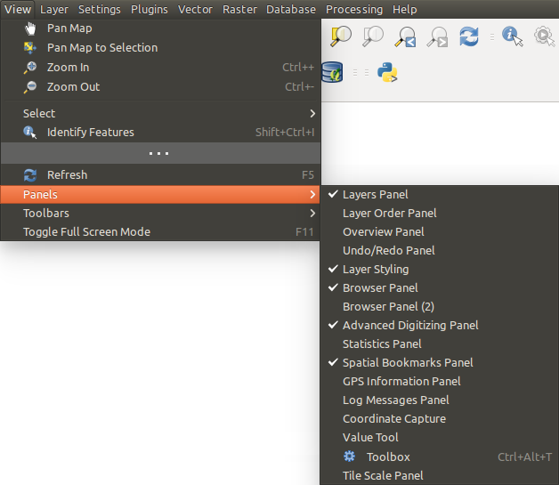

.. only:: html

   |updatedisclaimer|

.. Purpose: This chapter aims to describe only the interface of the default
.. QGIS interface. Details should be written in other parts with a link toward it.

.. _`label_qgismainwindow`:

********
QGIS GUI
********

.. only:: html

   .. contents::
      :local:

.. index::
   single: Main window

When QGIS starts, a GUI displays as shown in the figure below (the
numbers 1 through 5 in yellow circles are discussed below).

.. _figure_startup:

.. figure:: img/startup.png
   :align: center

   QGIS GUI with Alaska sample data

.. note::
   Your window decorations (title bar, etc.) may appear different depending
   on your operating system and window manager.

The QGIS GUI is divided into five components:

#. Menu Bar
#. Toolbars
#. Panels
#. Map View
#. Status Bar

Scroll down for detailed explanations of these features. 

.. index:: Menu
.. _label_menubar:

Menu Bar
========

The Menu bar provides access to various QGIS functions using a standard
hierarchical menu. The Menus, their options, associated 
icons and keyboard shortcuts are outlined below. These keyboard
shortcuts are the default settings, but they can be reconfigured using
the :guilabel:`Keyboard Shortcuts` via the :menuselection:`Settings -->` menu.

Most Menu options have a corresponding tool and vice-versa. However, the Menus
are not organized exactly like the toolbars. The locations of menu options
in the toolbars are indicated below in the table. Plugins may add new
options to Menus. For more information about tools and toolbars, see 
:ref:`label_toolbars`.

.. note:: QGIS is a cross-platform application - while the same tools are
   available on all platforms, they may be placed in different menus on
   different operating systems. The lists below show the most common locations
   including known variations.

.. index:: Project

Project
-------

The :menuselection:`Project` menu provides access and exit points of
the :ref:`project file <sec_projects>`. It provides you with tools to:

* Create a :guilabel:`New` file from scratch or using another project file as
  a template (see :ref:`Project files options <projectfiles_options>` for
  template configuration)
* :guilabel:`Open...` a project file from either a file browser or PostgreSQL database
* :guilabel:`Close` a project or revert it to its last saved state
* :guilabel:`Save` a project in :file:`.qgs` or :file:`.qgz` file format, either as a file
  or within a PostgreSQL database
* Export the map canvas to different formats or
  use a :ref:`print layout <label_printlayout>` for more complex output
* Set the project properties and the snapping options when editing layers.

=======================================================  ====================  =========================  ===============================
Menu Option                                              Shortcut              Toolbar                    Reference
=======================================================  ====================  =========================  ===============================
|fileNew| :guilabel:`New`                                :kbd:`Ctrl+N`         :guilabel:`Project`        :ref:`sec_projects`
:menuselection:`New from template -->`                   \                     \                          :ref:`sec_projects`
|fileOpen| :guilabel:`Open...`                           :kbd:`Ctrl+O`         :guilabel:`Project`        :ref:`sec_projects`
:menuselection:`Open from --> PostgreSQL`                \                     \                          :ref:`sec_projects`
:menuselection:`Open Recent -->`                         \                     \                          :ref:`sec_projects`
:guilabel:`Close`                                        \                     \                          :ref:`sec_projects`
|fileSave| :guilabel:`Save`                              :kbd:`Ctrl+S`         :guilabel:`Project`        :ref:`sec_projects`
|fileSaveAs| :guilabel:`Save As...`                      :kbd:`Ctrl+Shift+S`   :guilabel:`Project`        :ref:`sec_projects`
:menuselection:`Save to --> PostgreSQL`                  \                     \                          :ref:`sec_projects`
:guilabel:`Revert...`                                    \                     \                          \
:guilabel:`Properties...`                                :kbd:`Ctrl+Shift+P`   \                          :ref:`project_properties`
:guilabel:`Snapping Options...`                          \                     \                          :ref:`snapping_tolerance`
:menuselection:`Import/Export -->`                       \                     \                          \
|saveMapAsImage| :guilabel:`Export Map to Image...`      \                     \                          :ref:`sec_output`
|saveAsPDF| :guilabel:`Export Map to PDF...`             \                     \                          :ref:`sec_output`
:guilabel:`Export Project to DXF...`                     \                     \                          :ref:`sec_output`
:guilabel:`Import Layers from DWG/DXF...`                \                     \                          :ref:`import_dxfdwg`
|newLayout| :guilabel:`New Print Layout...`              :kbd:`Ctrl+P`         :guilabel:`Project`        :ref:`label_printlayout`
|newReport| :guilabel:`New Report...`                    \                     \                          :ref:`label_printlayout`
|layoutManager| :guilabel:`Layout Manager...`            \                     :guilabel:`Project`        :ref:`label_printlayout`
:menuselection:`Layouts -->`                             \                     \                          :ref:`label_printlayout`
|fileExit| :guilabel:`Exit QGIS`                         :kbd:`Ctrl+Q`         \                          \
=======================================================  ====================  =========================  ===============================

|

Under |osx| macOS, the :guilabel:`Exit QGIS` command corresponds to
:menuselection:`QGIS --> Quit QGIS` (:kbd:`Cmd+Q`).

Edit
----

The :menuselection:`Edit` menu provides most of the native tools needed to edit
layer attributes or geometry (see :ref:`editingvector` for details).

=======================================================================  ====================  =================================   ===================================
Menu Option                                                              Shortcut              Toolbar                             Reference
=======================================================================  ====================  =================================   ===================================
|undo| :guilabel:`Undo`                                                  :kbd:`Ctrl+Z`         :guilabel:`Digitizing`              :ref:`undoredo_edits`
|redo| :guilabel:`Redo`                                                  :kbd:`Ctrl+Shift+Z`   :guilabel:`Digitizing`              :ref:`undoredo_edits`
|editCut| :guilabel:`Cut Features`                                       :kbd:`Ctrl+X`         :guilabel:`Digitizing`              :ref:`clipboard_feature`
|editCopy| :guilabel:`Copy Features`                                     :kbd:`Ctrl+C`         :guilabel:`Digitizing`              :ref:`clipboard_feature`
|editPaste| :guilabel:`Paste Features`                                   :kbd:`Ctrl+V`         :guilabel:`Digitizing`              :ref:`clipboard_feature`
:menuselection:`Paste Features as -->`                                   \                     \                                   :ref:`sec_attribute_table`
:menuselection:`Select -->`                                              \                     :guilabel:`Attributes`              :ref:`sec_selection`
|newTableRow| :guilabel:`Add Record`                                     :kbd:`Ctrl+.`         :guilabel:`Digitizing`              \
|capturePoint| :guilabel:`Add Point Feature`                             :kbd:`Ctrl+.`         :guilabel:`Digitizing`              :ref:`add_feature`
|capturePoint| :guilabel:`Add Line Feature`                              :kbd:`Ctrl+.`         :guilabel:`Digitizing`              :ref:`add_feature`
|capturePolygon| :guilabel:`Add Polygon Feature`                         :kbd:`Ctrl+.`         :guilabel:`Digitizing`              :ref:`add_feature`
|circularStringCurvePoint| :guilabel:`Add Circular String`               \                     :guilabel:`Shape Digitizing`        :ref:`add_circular_string`
|circularStringRadius| :guilabel:`Add Circular String by Radius`         \                     :guilabel:`Shape Digitizing`        :ref:`add_circular_string`
:menuselection:`Add Circle -->`                                          \                     :guilabel:`Shape Digitizing`        \
:menuselection:`Add Rectangle -->`                                       \                     :guilabel:`Shape Digitizing`        \
:menuselection:`Add Regular Polygon -->`                                 \                     :guilabel:`Shape Digitizing`        \
:menuselection:`Add Ellipse -->`                                         \                     :guilabel:`Shape Digitizing`        \
|moveFeature| :guilabel:`Move Feature(s)`                                \                     :guilabel:`Advanced Digitizing`     :ref:`move_feature`
|moveFeatureCopy| :guilabel:`Copy and Move Feature(s)`                   \                     :guilabel:`Advanced Digitizing`     :ref:`move_feature`
|deleteSelected| :guilabel:`Delete Selected`                             \                     :guilabel:`Digitizing`              :ref:`delete_feature`
|multiEdit| :guilabel:`Modify Attributes of Selected Features`           \                     :guilabel:`Digitizing`              :ref:`calculate_fields_values`
|rotateFeature| :guilabel:`Rotate Feature(s)`                            \                     :guilabel:`Advanced Digitizing`     :ref:`rotate_feature`
|simplifyFeatures| :guilabel:`Simplify Feature`                          \                     :guilabel:`Advanced Digitizing`     :ref:`simplify_feature`
|addRing| :guilabel:`Add Ring`                                           \                     :guilabel:`Advanced Digitizing`     :ref:`add_ring`
|addPart| :guilabel:`Add Part`                                           \                     :guilabel:`Advanced Digitizing`     :ref:`add_part`
|fillRing| :guilabel:`Fill Ring`                                         \                     :guilabel:`Advanced Digitizing`     :ref:`fill_ring`
|deleteRing| :guilabel:`Delete Ring`                                     \                     :guilabel:`Advanced Digitizing`     :ref:`delete_ring`
|deletePart| :guilabel:`Delete Part`                                     \                     :guilabel:`Advanced Digitizing`     :ref:`delete_part`
|reshape| :guilabel:`Reshape Features`                                   \                     :guilabel:`Advanced Digitizing`     :ref:`reshape_feature`
|offsetCurve| :guilabel:`Offset Curve`                                   \                     :guilabel:`Advanced Digitizing`     :ref:`offset_curve`
|splitFeatures| :guilabel:`Split Features`                               \                     :guilabel:`Advanced Digitizing`     :ref:`split_feature`
|splitParts| :guilabel:`Split Parts`                                     \                     :guilabel:`Advanced Digitizing`     :ref:`split_part`
|mergeFeatures| :guilabel:`Merge Selected Features`                      \                     :guilabel:`Advanced Digitizing`     :ref:`mergeselectedfeatures`
|mergeFeatAttributes| :guilabel:`Merge Attributes of Selected Features`  \                     :guilabel:`Advanced Digitizing`     :ref:`mergeattributesfeatures`
|vertexTool| :guilabel:`Vertex Tool (All Layers)`                        \                     :guilabel:`Digitizing`              :ref:`vertex_tool`
|vertexToolActiveLayer| :guilabel:`Vertex Tool (Current Layer)`          \                     :guilabel:`Digitizing`              :ref:`vertex_tool`
|rotatePointSymbols| :guilabel:`Rotate Point Symbols`                    \                     :guilabel:`Advanced Digitizing`     :ref:`rotate_symbol`
|offsetPointSymbols| :guilabel:`Offset Point Symbols`                    \                     :guilabel:`Advanced Digitizing`     :ref:`offset_symbol`
|reverseLine| :guilabel:`Reverse Line`                                   \                     :guilabel:`Advanced Digitizing`     \
=======================================================================  ====================  =================================   ===================================

|

Tools dependent on the selected layer geometry type i.e. point, polyline or polygon, are activated accordingly:

.. :tabularcolumns: |l|c|c|c|

=====================================  ========================  ========================  ==========================
Menu Option                            Point                     Polyline                  Polygon
=====================================  ========================  ========================  ==========================
:guilabel:`Move Feature(s)`            |moveFeaturePoint|        |moveFeatureLine|         |moveFeature|
:guilabel:`Copy and Move Feature(s)`   |moveFeatureCopyPoint|    |moveFeatureCopyLine|     |moveFeatureCopy|
=====================================  ========================  ========================  ==========================

.. _view_menu:

View
----

The map is rendered in map views. You can interact with these
views using the :menuselection:`View` tools (see :ref:`working_canvas`
for more information). For example, you can:

* Create new 2D or 3D map views next to the main map canvas
* :ref:`Zoom or pan <zoom_pan>` to any place
* Query displayed features' attributes or geometry
* Enhance the map view with preview modes, annotations or decorations
* Access any panel or toolbar

The menu also allows you to reorganize the QGIS interface itself using actions like:

* :guilabel:`Toggle Full Screen Mode`: covers the whole screen
  while hiding the title bar
* :guilabel:`Toggle Panel Visibility`: shows or hides enabled :ref:`panels
  <panels_tools>` - useful when digitizing features (for
  maximum canvas visibility) as well as for (projected/recorded)
  presentations using QGIS' main canvas
* :guilabel:`Toggle Map Only`: hides panels, toolbars, menus and status bar
  and only shows the map canvas. Combined with the full screen option, it makes
  your screen display only the map

=========================================================  =======================  =============================  ==========================================
Menu Option                                                Shortcut                 Toolbar                        Reference
=========================================================  =======================  =============================  ==========================================
|newMap| :guilabel:`New Map View`                          :kbd:`Ctrl+M`            :guilabel:`Map Navigation`     \
|new3DMap| :guilabel:`New 3D Map View`                     :kbd:`Ctrl+Shift+M`      \                              :ref:`label_3dmapview`
|pan| :guilabel:`Pan Map`                                  \                        :guilabel:`Map Navigation`     :ref:`zoom_pan`
|panToSelected| :guilabel:`Pan Map to Selection`           \                        :guilabel:`Map Navigation`     \
|zoomIn| :guilabel:`Zoom In`                               :kbd:`Ctrl+Alt++`        :guilabel:`Map Navigation`     :ref:`zoom_pan`
|zoomOut| :guilabel:`Zoom Out`                             :kbd:`Ctrl+Alt+-`        :guilabel:`Map Navigation`     :ref:`zoom_pan`
|identify| :guilabel:`Identify Features`                   :kbd:`Ctrl+Shift+I`      :guilabel:`Attributes`         :ref:`identify`
:menuselection:`Measure -->`                               \                        :guilabel:`Attributes`         :ref:`sec_measure`
|sum| :guilabel:`Statistical Summary`                      \                        :guilabel:`Attributes`         :ref:`statistical_summary`
|zoomFullExtent| :guilabel:`Zoom Full`                     :kbd:`Ctrl+Shift+F`      :guilabel:`Map Navigation`     \
|zoomToLayer| :guilabel:`Zoom To Layer`                    \                        :guilabel:`Map Navigation`     \
|zoomToSelected| :guilabel:`Zoom To Selection`             :kbd:`Ctrl+J`            :guilabel:`Map Navigation`     \
|zoomLast| :guilabel:`Zoom Last`                           \                        :guilabel:`Map Navigation`     \
|zoomNext| :guilabel:`Zoom Next`                           \                        :guilabel:`Map Navigation`     \
|zoomActual| :guilabel:`Zoom To Native Resolution (100%)`  \                        :guilabel:`Map Navigation`     \
:menuselection:`Decorations -->`                           \                        \                              :ref:`decorations`
:menuselection:`Preview mode -->`                          \                        \                              \
|mapTips| :guilabel:`Show Map Tips`                        \                        :guilabel:`Attributes`         :ref:`maptips`
|newBookmark| :guilabel:`New Bookmark...`                  :kbd:`Ctrl+B`            :guilabel:`Map Navigation`     :ref:`sec_bookmarks`
|showBookmarks| :guilabel:`Show Bookmarks`                 :kbd:`Ctrl+Shift+B`      :guilabel:`Map Navigation`     :ref:`sec_bookmarks`
|draw| :guilabel:`Refresh`                                 :kbd:`F5`                :guilabel:`Map Navigation`     \
|showAllLayers| :guilabel:`Show All Layers`                :kbd:`Ctrl+Shift+U`      \                              :ref:`label_legend`
|hideAllLayers| :guilabel:`Hide All Layers`                :kbd:`Ctrl+Shift+H`      \                              :ref:`label_legend`
|showSelectedLayers| :guilabel:`Show Selected Layers`      \                        \                              :ref:`label_legend`
|hideSelectedLayers| :guilabel:`Hide Selected Layers`      \                        \                              :ref:`label_legend`
|hideDeselectedLayers| :guilabel:`Hide Deselected Layers`  \                        \                              :ref:`label_legend`
:menuselection:`Panels -->`                                \                        \                              :ref:`sec_panels_and_toolbars`
:menuselection:`Toolbars -->`                              \                        \                              :ref:`sec_panels_and_toolbars`
:guilabel:`Toggle Full Screen Mode`                        :kbd:`F11`               \                              \
:guilabel:`Toggle Panel Visibility`                        :kbd:`Ctrl+Tab`          \                              \
:guilabel:`Toggle Map Only`                                :kbd:`Ctrl+Shift+Tab`    \                              \
=========================================================  =======================  =============================  ==========================================

|

Under |kde| Linux KDE, :menuselection:`Panels -->`, :menuselection:`Toolbars -->`
and :guilabel:`Toggle Full Screen Mode` are in the :menuselection:`Settings`
menu.

Layer
-----

The :menuselection:`Layer` menu provides a large set of tools to :ref:`create
<sec_create_vector>` new data sources, :ref:`add <opening_data>` them to a project
or :ref:`save modifications <sec_edit_existing_layer>` to them. Using the
same data sources, you can also:

* :guilabel:`Duplicate` a layer, generating a copy you can modify within the
  same project
* :guilabel:`Copy` and :guilabel:`Paste` layers or groups from one project to
  another as a new instance whose features and properties you can modify
  independently of the original
* or :guilabel:`Embed Layers and Groups...` from another project, as read-only
  copies which you cannot modify (see :ref:`nesting_projects`)
  
The :menuselection:`Layer` menu also contains tools to configure, copy
or paste layer properties (style, scale, CRS...).

============================================================  ====================  ================================  =====================================
Menu Option                                                   Shortcut              Toolbar                           Reference
============================================================  ====================  ================================  =====================================
|dataSourceManager| :guilabel:`Data Source Manager`           :kbd:`Ctrl+L`         :guilabel:`Data Source Manager`    :ref:`Opening Data <datasourcemanager>`
:menuselection:`Create Layer -->`                             \                     :guilabel:`Data Source Manager`    :ref:`sec_create_vector`
:menuselection:`Add Layer -->`                                \                     :guilabel:`Data Source Manager`    :ref:`opening_data`
:guilabel:`Embed Layers and Groups...`                        \                     \                                  :ref:`nesting_projects`
:guilabel:`Add from Layer Definition File...`                 \                     \                                  :ref:`layer_definition_file`
|editCopy| :guilabel:`Copy Style`                             \                     \                                  :ref:`save_layer_property`
|editPaste| :guilabel:`Paste Style`                           \                     \                                  :ref:`save_layer_property`
|editCopy| :guilabel:`Copy Layer`                             \                     \                                  \
|editPaste| :guilabel:`Paste Layer/Group`                     \                     \                                  \
|openTable| :guilabel:`Open Attribute Table`                  :kbd:`F6`             :guilabel:`Attributes`             :ref:`sec_attribute_table`
|toggleEditing| :guilabel:`Toggle Editing`                    \                     :guilabel:`Digitizing`             :ref:`sec_edit_existing_layer`
|fileSave| :guilabel:`Save Layer Edits`                       \                     :guilabel:`Digitizing`             :ref:`save_feature_edits`
|allEdits| :menuselection:`Current Edits -->`                 \                     :guilabel:`Digitizing`             :ref:`save_feature_edits`
:guilabel:`Save As...`                                        \                     \                                  :ref:`general_saveas`
:guilabel:`Save As Layer Definition File...`                  \                     \                                  :ref:`layer_definition_file`
|removeLayer| :guilabel:`Remove Layer/Group`                  :kbd:`Ctrl+D`         \                                  \
|duplicateLayer| :guilabel:`Duplicate Layer(s)`               \                     \                                  \
:guilabel:`Set Scale Visibility of Layer(s)`                  \                     \                                  \
:guilabel:`Set CRS of Layer(s)`                               :kbd:`Ctrl+Shift+C`   \                                  \
:guilabel:`Set Project CRS from Layer`                        \                     \                                  \
:guilabel:`Layer Properties...`                               \                     \                                  :ref:`vector_properties_dialog`
:guilabel:`Filter...`                                         :kbd:`Ctrl+F`         \                                  :ref:`vector_query_builder`
|labeling| :guilabel:`Labeling`                               \                     \                                  :ref:`vector_labels_tab`
|inOverview| :guilabel:`Show in Overview`                     \                     \                                  :ref:`overview_panels`
|addAllToOverview| :guilabel:`Show All in Overview`           \                     \                                  :ref:`overview_panels`
|removeAllOVerview| :guilabel:`Hide All from Overview`        \                     \                                  :ref:`overview_panels`
============================================================  ====================  ================================  =====================================

Settings
--------

=================================================================  ===================================
Menu Option                                                        Reference
=================================================================  ===================================
:menuselection:`User Profiles -->`                                 :ref:`user_profiles`
|styleManager| :guilabel:`Style Manager...`                        :ref:`vector_style_manager`
|customProjection| :guilabel:`Custom Projections...`               :ref:`sec_custom_projections`
|keyboardShortcuts| :guilabel:`Keyboard Shortcuts...`              :ref:`shortcuts`
|interfaceCustomization| :guilabel:`Interface Customization...`    :ref:`sec_customization`
|options| :guilabel:`Options...`                                   :ref:`gui_options`
=================================================================  ===================================

|

Under |kde| Linux KDE, you'll find more tools in the :menuselection:`Settings`
menu such as :menuselection:`Panels -->`,
:menuselection:`Toolbars -->` and :guilabel:`Toggle Full Screen Mode`.

Plugins
-------

======================================================================  ====================  =======================  ===============================
Menu Option                                                             Shortcut               Toolbar                 Reference
======================================================================  ====================  =======================  ===============================
|showPluginManager| :guilabel:`Manage and Install Plugins...`           \                     \                        :ref:`managing_plugins`
|pythonFile| :guilabel:`Python Console`                                 :kbd:`Ctrl+Alt+P`     :guilabel:`Plugins`      :ref:`console`
======================================================================  ====================  =======================  ===============================

|

When starting QGIS for the first time not all core plugins are loaded.

Vector
------

This is what the :guilabel:`Vector` menu looks like if all core plugins
are enabled.

==============================================================  =======================  =======================  ===============================
Menu Option                                                     Shortcut                 Toolbar                  Reference
==============================================================  =======================  =======================  ===============================
|coordinateCapture| :guilabel:`Coordinate Capture`              \                        :guilabel:`Vector`       :ref:`coordcapt`
|geometryChecker| :guilabel:`Check Geometries...`               \                        :guilabel:`Vector`       :ref:`geometry_checker`
|gpsImporter| :guilabel:`GPS Tools`                             \                        :guilabel:`Vector`       :ref:`plugin_gps`
|topologyChecker| :guilabel:`Topology Checker`                  \                        :guilabel:`Vector`       :ref:`topology`
:menuselection:`Geoprocessing Tools -->`                        :kbd:`Alt+O` + :kbd:`G`  \                        :ref:`processing.options`
:menuselection:`Geometry Tools -->`                             :kbd:`Alt+O` + :kbd:`E`  \                        :ref:`processing.options`
:menuselection:`Analysis Tools -->`                             :kbd:`Alt+O` + :kbd:`A`  \                        :ref:`processing.options`
:menuselection:`Data Management Tools -->`                      :kbd:`Alt+O` + :kbd:`D`  \                        :ref:`processing.options`
:menuselection:`Research Tools -->`                             :kbd:`Alt+O` + :kbd:`R`  \                        :ref:`processing.options`
==============================================================  =======================  =======================  ===============================

|

By default, QGIS adds :ref:`Processing <sec_processing_intro>` algorithms to the
:guilabel:`Vector` menu, grouped by sub-menus. This provides shortcuts
for many common vector-based GIS tasks from different providers.
If not all these sub-menus are available, enable
the Processing plugin in :menuselection:`Plugins --> Manage and Install Plugins...`.

Note that the list of the :guilabel:`Vector` menu tools can be extended with
any Processing algorithms or some external :ref:`plugins <plugins>`.

Raster
------

This is what the :guilabel:`Raster` menu looks like if all core plugins
are enabled.

==========================================================  ====================  ==================================
Menu Option                                                 Toolbar               Reference
==========================================================  ====================  ==================================
|showRasterCalculator| :guilabel:`Raster calculator...`     \                     :ref:`label_raster_calc`
:guilabel:`Align Raster...`                                 \                     :ref:`label_raster_align`
:menuselection:`Analysis -->`                               \                     :ref:`processing.options`
:menuselection:`Projection -->`                             \                     :ref:`processing.options`
:menuselection:`Miscellaneous -->`                          \                     :ref:`processing.options`
:menuselection:`Extraction -->`                             \                     :ref:`processing.options`
:menuselection:`Conversion -->`                             \                     :ref:`processing.options`
|georefRun| :guilabel:`Georeferencer`                       :guilabel:`Raster`    :ref:`georef`
==========================================================  ====================  ==================================

|

By default, QGIS adds :ref:`Processing <sec_processing_intro>` algorithms to the 
:guilabel:`Raster` menu, grouped by sub-menus. This provides a shortcut
for many common raster-based GIS tasks from different providers.
If not all these sub-menus are available, enable
the Processing plugin in :menuselection:`Plugins --> Manage and Install Plugins...`.

Note that the list of the :guilabel:`Raster` menu tools can be extended with
any Processing algorithms or some external :ref:`plugins <plugins>`.

Database
--------

This is what the :guilabel:`Database` menu looks like if all the core plugins
are enabled.
If no database plugins are enabled, there will be no guilabel:`Database` menu.

===============================================  ============================  ===============================
Menu Option                                      Toolbar                       Reference
===============================================  ============================  ===============================
|dbManager| :guilabel:`DB Manager`               :guilabel:`Database`          :ref:`dbmanager`
:menuselection:`eVis -->`                        :guilabel:`Database`          :ref:`evis`
:menuselection:`Offline Editing -->`             :guilabel:`Database`          :ref:`offlinedit`
===============================================  ============================  ===============================

|

When starting QGIS for the first time not all core plugins are loaded.

Web
---

This is what the :guilabel:`Database` menu looks like if all the core plugins
are enabled.
If no web plugins are enabled, there will be no guilabel:`Web` menu.

===============================================  ===========================  ===============================
Menu Option                                      Toolbar                      Reference
===============================================  ===========================  ===============================
|metasearch| :menuselection:`MetaSearch`         :guilabel:`Web`              :ref:`metasearch`
===============================================  ===========================  ===============================

|

When starting QGIS for the first time not all core plugins are loaded.

Mesh
----

The :menuselection:`Mesh` menu provides tools needed to manipulate
:ref:`mesh layers <label_meshdata>`.

========================================================  ===========================  ===============================
Menu Option                                               Toolbar                      Reference
========================================================  ===========================  ===============================
|showMeshCalculator| :menuselection:`Mesh Calculator`
========================================================  ===========================  ===============================

Processing
----------

==============================================================  ==========================  ==========================================
Menu Option                                                     Shortcut                    Reference
==============================================================  ==========================  ==========================================
|processing| :guilabel:`Toolbox`                                :kbd:`Ctrl+Alt+T`           :ref:`processing.toolbox`
|processingModel| :guilabel:`Graphical Modeler...`              :kbd:`Ctrl+Alt+M`           :ref:`processing.modeler`
|processingHistory| :guilabel:`History...`                      :kbd:`Ctrl+Alt+H`           :ref:`processing.history`
|processingResult| :guilabel:`Results Viewer`                   :kbd:`Ctrl+Alt+R`           :ref:`processing.results`
|processSelected| :guilabel:`Edit Features In-Place`            \                           :ref:`processing_inplace_edit`
==============================================================  ==========================  ==========================================

|

When starting QGIS for the first time not all core plugins are loaded.

Help
----

=======================================================  ===========================  ===============================
Menu Option                                              Shortcut                     Toolbar
=======================================================  ===========================  ===============================
|helpContents| :guilabel:`Help Contents`                 :kbd:`F1`                    :guilabel:`Help`
:guilabel:`API Documentation`                            \                            \
:guilabel:`Report an Issue`                              \                            \
:guilabel:`Need commercial support?`                     \                            \
|qgisHomePage| :guilabel:`QGIS Home Page`                :kbd:`Ctrl+H`                \
|success| :guilabel:`Check QGIS Version`                 \                            \
|logo| :guilabel:`About`                                 \                            \
|helpSponsors| :guilabel:`QGIS Sponsors`                 \                            \
=======================================================  ===========================  ===============================

QGIS
-----

This menu is only available under |osx| macOS and contains some OS related
commands.

================================  ====================  =========================
Menu Option                       Shortcut              Reference
================================  ====================  =========================
:guilabel:`Preferences`           \                     \
:guilabel:`About QGIS`            \                     \
:guilabel:`Hide QGIS`             \                     \
 :guilabel:`Show All`              \                     \
:guilabel:`Hide Others`           \                     \
:guilabel:`Quit QGIS`             :kbd:`Cmd+Q`          \
================================  ====================  =========================

|

:guilabel:`Preferences` and :guilabel:`About QGIS` are the same commands as
:menuselection:`Settings --> Options` and :menuselection:`Help --> About`.
:guilabel:`Quit QGIS` corresponds to :menuselection:`Project --> Exit QGIS`
under the other platforms.

.. _sec_panels_and_toolbars:

Panels and Toolbars
===================

From the :menuselection:`View` menu (or |kde| :menuselection:`Settings`), you can
switch QGIS widgets (:menuselection:`Panels -->`) and toolbars
(:menuselection:`Toolbars -->`) on and off. To (de)activate any of them,
right-click the menu bar or toolbar and choose the item you want.
Each panel or toolbar can be moved and placed wherever you feel comfortable
within the QGIS interface.
The list can also be extended with the activation of :ref:`Core or external
plugins <plugins>`.

.. index:: Toolbars
.. _`label_toolbars`:

Toolbars
--------

The toolbar provides access to most of the same functions as the menus, plus
additional tools for interacting with the map. Each toolbar item has pop-up help
available. Hover your mouse over the item and a short description of the tool's
purpose will be displayed.

Every toolbar can be moved around according to your needs. Additionally,
they can be switched off using the right mouse button context menu, or by
holding the mouse over the toolbars.

.. _figure_toolbars:

.. figure:: img/toolbars.png
   :align: center

   The Toolbars menu

.. index::
   single: Toolbars; Layout

.. tip:: **Restoring toolbars**

   If you have accidentally hidden a toolbar, you can get it
   back by choosing menu option :menuselection:`View --> Toolbars -->`
   (or |kde| :menuselection:`Settings --> Toolbars -->`).
   If for some reason a toolbar (or any other widget) totally disappears
   from the interface, you'll find tips to get it back at :ref:`restoring
   initial GUI <tip_restoring_configuration>`.

.. index:: Panels
.. _panels_tools:

Panels
------

Besides toolbars, QGIS provides many panels to work with by default. Panels are
special widgets that you can interact with (selecting options, checking boxes,
filling values...) to perform more complex tasks.

.. _figure_panels:

   The Panels menu

Below are listed default panels provided by QGIS:

* the :ref:`label_legend`
* the :ref:`Browser Panel <browser_panel>`
* the :ref:`Advanced Digitizing Panel <advanced_digitizing_panel>`
* the :ref:`Spatial Bookmarks Panel <sec_bookmarks>`
* the :ref:`GPS Information Panel <sec_gpstracking>`
* the :ref:`Tile Scale Panel <tilesets>`
* the :ref:`Identify Panel <identify>`
* the :ref:`User Input Panel <rotate_feature>`
* the :ref:`Layer Order Panel <layer_order>`
* the :ref:`layer_styling_panel`
* the :ref:`statistical_summary`
* the :ref:`overview_panels`
* the :ref:`log_message_panel`
* the :ref:`undo_redo_panel`
* the :ref:`Processing Toolbox <label_processing>`

.. index:: Map view
.. _`label_mapview`:

Map View
========

Also called **Map canvas**, this is the "business end" of QGIS ---
maps are displayed in this area. The map displayed in this window
will depend on the vector and raster layers you have chosen to load.

When you add a layer (see e.g. :ref:`opening_data`), QGIS automatically
looks for its Coordinate Reference System (CRS) and zooms to its extent if you
start with a blank QGIS project. The layer's CRS is then applied to the project.
If there are already layers in the project, and if the new layer has
the same CRS as the project, its features falling in the current map canvas
extent will be visualized. If the new layer is in a different CRS from the
project's, you must :guilabel:`Enable on-the-fly CRS transformation` from the
:menuselection:`Project --> Properties... --> CRS`
(see :ref:`otf_transformation`). The added layer should now be visible if data
are available in the current view extent.

The map view can be panned, shifting the display to another region
of the map, and it can be zoomed in and out. Various other operations can be
performed on the map as described in the :ref:`label_toolbars` section.
The map view and the legend are tightly bound to each other --- the maps in
the view reflect changes you make in the legend area.

.. index:: Zoom, Mouse wheel

.. tip::
   **Zooming the Map with the Mouse Wheel**

   You can use the mouse wheel to zoom in and out on the map. Place the mouse
   cursor inside the map area and roll the wheel forward (away from you) to
   zoom in and backwards (towards you) to zoom out. The zoom is centered on the
   mouse cursor position. You can customize the behavior of the
   mouse wheel zoom using the :guilabel:`Map tools` tab under the
   :menuselection:`Settings --> Options` menu.

.. index:: Pan, Arrow

.. tip::
   **Panning the Map with the Arrow Keys and Space Bar**

   You can use the arrow keys to pan the map. Place the mouse cursor inside
   the map area and click on the arrow keys to pan left, right, up and down. You can
   also pan the map by moving the mouse while holding down the space bar or the
   middle mouse button (or holding down the mouse wheel).

.. index:: 3D Map view
.. _`label_3dmapview`:

3D Map View
===========

3D visualization support is offered through the 3D map view.

.. note::
   3D visualization in QGIS requires a recent version of the
   QT library (5.8 or later).

You create and open a 3D map view via :menuselection:`View -->` |new3DMap| :menuselection:`New 3D Map
View`.
A floating QGIS panel will appear. The panel can be docked.

To begin with, the 3D map view has the same extent and view as the 2D canvas.
There is no dedicated toolbar for navigation in the 3D canvas.
You zoom in/out and pan in the same way as in the main 2D canvas.
You can also zoom in and out by dragging the mouse down/up with the
right mouse button pressed.

Navigation options for exploring the map in 3D:

* Tilt and rotate

  * To tilt the terrain (rotating it around a horizonal axis that goes
    through the center of the window):

    * Drag the mouse forward/backward with the middle mouse button
      pressed
    * Press :kbd:`Shift` and drag the mouse forward/backward
      with the left mouse button pressed
    * Press :kbd:`Shift` and use the up/down keys

  * To rotate the terrain (around a vertical axis that goes through the
    center of the window):

    * Drag the mouse right/left with the middle mouse button
      pressed
    * Press :kbd:`Shift` and drag the mouse right/left with the
      left mouse button pressed
    * Press :kbd:`Shift` and use the left/right keys

* Change the camera angle

  * Pressing :kbd:`Ctrl` and dragging the mouse with the left mouse
    button pressed changes the camera angle corresponding to
    directions of dragging
  * Pressing :kbd:`Ctrl` and using the arrow keys turns
    the camera up, down, left and right

* Move the camera up/down

  * Pressing the :kbd:`Page Up`/:kbd:`Page Down` keys moves the
    terrain up and down, respectively

* Zoom in and out

  * Dragging the mouse with the right mouse button pressed will
    zoom in (drag down) and out (drag up)

* Move the terrain around

  * Dragging the mouse with the left mouse button pressed moves the
    terrain around
  * Using the up/down/left/right keys moves the
    terrain closer, away, right and left, respectively
        
To reset the camera view, click the |zoomFullExtent| :sup:`Zoom Full`
button on the top of the 3D canvas panel.

Terrain Configuration
---------------------

A terrain raster provides the elevation.
This raster layer must contain a band that represents elevation.
To select the terrain raster:

#. Click the |3dconfigure| :sup:`Configure...` button at the top of
   the 3D canvas panel to open the :guilabel:`3D configuration` window
#. Choose the terrain raster layer in the :guilabel:`Elevation`
   pull-down menu

In the 3D Configuration window there are various other options to
fine-tune the 3D scene.
Before diving into the details, it is worth noting that terrain in a 3D view
is represented by a hierarchy of terrain tiles and as the camera moves
closer to the terrain, existing tiles that do not have sufficient detail
are replaced by smaller tiles with more details.
Each tile has mesh geometry derived from the elevation raster layer and
texture from 2D map layers.

Configuration options and their meaning:

* :guilabel:`Elevation`: Raster to be used for generation of terrain.
* :guilabel:`Vertical scale`: Scale factor for vertical axis.
  Increasing the scale will exaggerate the terrain.
* :guilabel:`Tile resolution`: How many samples from the terrain raster layer to
  use for each tile.
  A value of 16px means that the geometry of each tile will be built
  from 16x16 elevation samples.
  Higher numbers create more detailed terrain tiles at the expense of
  increased rendering complexity.
* :guilabel:`Skirt height`: Sometimes it is possible to see small cracks
  between tiles of the terrain.
  Raising this value will add vertical walls ("skirts") around terrain
  tiles to hide the cracks.
* :guilabel:`Map tile resolution`: Width and height of the 2D map images used
  as textures for the terrain tiles.
  256px means that each tile will be rendered into an image of
  256x256 pixels.
  Higher numbers create more detailed terrain tiles at the expense of
  increased rendering complexity.
* :guilabel:`Max. screen error`: Determines the threshold for swapping terrain
  tiles with more detailed ones (and vice versa) - i.e. how soon the
  3D view will use higher quality tiles.
  Lower numbers mean more details in the scene at the expense of
  increased rendering complexity.
* :guilabel:`Max. ground error`: The resolution of the terrain tiles at which
  dividing tiles into more detailed ones will stop (splitting them
  would not introduce any extra detail anyway).
  This value limits the depth of the hierarchy of tiles: lower values 
  make the hierarchy deep, increasing rendering complexity.
* :guilabel:`Zoom labels`: Shows the number of zoom levels (depends on the
  map tile resolution and max. ground error).
* |unchecked| :guilabel:`Show labels`: Toggles map labels on/off
* |unchecked| :guilabel:`Show map tile info`: Include border and tile numbers for the
  terrain tiles (useful for troubleshooting terrain issues)
* |unchecked| :guilabel:`Show bounding boxes`: Show 3D bounding boxes of the terrain
  tiles (useful for troubleshooting terrain issues)
* |unchecked| :guilabel:`Show camera's view center`

3D vector layers
----------------

A vector layer with elevation values can be shown in the 3D map
view by checking :guilabel:`Enable 3D Renderer` in the
:guilabel:`3D View` section of the vector layer properties.
A number of options are available for controlling the rendering of
the 3D vector layer.

.. _`label_statusbar`:

Status Bar
==========

The status bar provides you with general information about the map view
and processed or available actions, and offers you tools to manage the map view.

.. _`locator_bar`:

On the left side of the status bar, the locator bar, a quick search widget,
helps you find and run any feature or options in QGIS. Simply type text
associated with the item you are looking for (name, tag, keyword...) and you get
a list that updates as you write. You can also limit the search scope using
:ref:`locator filters <locator_options>`. Click the |search| button to
select any of them and press the :guilabel:`Configure` entry for global settings.

In the area next to the locator bar, a summary of actions you've carried out will
be shown when needed  (such as selecting features in a layer, removing layer) or
a long description of the tool you are hovering over (not available for all tools).

In case of lengthy operations, such as gathering of statistics in raster layers,
executing Processing algorithms or rendering several layers in the map view, a
progress bar is displayed in the status bar.

The |tracking| :guilabel:`Coordinate` option shows the current position of the mouse,
following it while moving across the map view. You can set the units (and precision)
in the :menuselection:`Project --> Properties... --> General` tab.
Click on the small button at the left of the textbox to toggle between
the Coordinate option and the |extents| :guilabel:`Extents` option that displays
the coordinates of the current bottom-left and top-right
corners of the map view in map units.

Next to the coordinate display you will find the :guilabel:`Scale` display.
It shows the scale of the map view. There is a scale selector, which allows you to
choose between :ref:`predefined and custom scales <predefinedscales>`.

.. index:: Magnification
.. _magnifier:

On the right side of the scale display, press the |lockedGray| button to lock
the scale to use the magnifier to zoom in or out. The magnifier allows you to zoom
in to a map without altering the map scale, making it easier to tweak the
positions of labels and symbols accurately. The magnification level is expressed as a
percentage. If the :guilabel:`Magnifier` has a level of 100%, then the current
map is not magnified. Additionally, a default magnification value can be defined
within :menuselection:`Settings --> Options --> Rendering --> Rendering behavior`,
which is very useful for high-resolution screens to enlarge small symbols.

To the right of the magnifier tool you can define a current clockwise rotation for
your map view in degrees.

On the right side of the status bar, there is a small
checkbox which can be used temporarily to prevent layers being rendered to the
map view (see section :ref:`redraw_events`).

To the right of the render functions, you find the |projectionEnabled|
:guilabel:`EPSG:code` button showing the current project CRS. Clicking on
this opens the :guilabel:`Project Properties` dialog and lets you apply another
CRS to the map view.

The |messageLog| :sup:`Messages` button next to it opens the :guilabel:`Log
Messages Panel` which has information on underlying processes (QGIS startup, plugins
loading, processing tools...)

Depending on the :ref:`Plugin Manager settings <setting_plugins>`, the status
bar can sometimes show icons to the right to inform you about availability
of |pluginNew| new or |pluginUpgrade| upgradeable plugins. Click the icon to
open the Plugin Manager dialog.

.. index::
   single: Scale calculate

.. tip::
   **Calculating the Correct Scale of Your Map Canvas**

   When you start QGIS, the default CRS is ``WGS 84 (EPSG 4326)`` and
   units are degrees. This means that QGIS will interpret any
   coordinate in your layer as specified in degrees. To get correct scale values,
   you can either manually change this setting in the :guilabel:`General`
   tab under :menuselection:`Project --> Properties...` (e.g. to meters), or you can use
   the |projectionEnabled| :sup:`EPSG:code` icon seen above. In the latter case,
   the units are set to what the project projection specifies (e.g., ``+units=us-ft``).

   Note that CRS choice on startup can be set in :menuselection:`Settings --> Options --> CRS`.

.. Substitutions definitions - AVOID EDITING PAST THIS LINE
   This will be automatically updated by the find_set_subst.py script.
   If you need to create a new substitution manually,
   please add it also to the substitutions.txt file in the
   source folder.

.. |3dconfigure| image:: /static/common/mIconProperties.png
   :width: 1.3em
.. |addAllToOverview| image:: /static/common/mActionAddAllToOverview.png
   :width: 1.5em
.. |addPart| image:: /static/common/mActionAddPart.png
   :width: 1.5em
.. |addRing| image:: /static/common/mActionAddRing.png
   :width: 2em
.. |allEdits| image:: /static/common/mActionAllEdits.png
   :width: 1.5em
.. |capturePoint| image:: /static/common/mActionCapturePoint.png
   :width: 1.5em
.. |capturePolygon| image:: /static/common/mActionCapturePolygon.png
   :width: 1.5em
.. |circularStringCurvePoint| image:: /static/common/mActionCircularStringCurvePoint.png
   :width: 1.5em
.. |circularStringRadius| image:: /static/common/mActionCircularStringRadius.png
   :width: 1.5em
.. |coordinateCapture| image:: /static/common/coordinate_capture.png
   :width: 1.5em
.. |customProjection| image:: /static/common/mActionCustomProjection.png
   :width: 1.5em
.. |dataSourceManager| image:: /static/common/mActionDataSourceManager.png
   :width: 1.5em
.. |dbManager| image:: /static/common/dbmanager.png
   :width: 1.5em
.. |deletePart| image:: /static/common/mActionDeletePart.png
   :width: 2em
.. |deleteRing| image:: /static/common/mActionDeleteRing.png
   :width: 2em
.. |deleteSelected| image:: /static/common/mActionDeleteSelected.png
   :width: 1.5em
.. |draw| image:: /static/common/mActionDraw.png
   :width: 1.5em
.. |duplicateLayer| image:: /static/common/mActionDuplicateLayer.png
   :width: 1.5em
.. |editCopy| image:: /static/common/mActionEditCopy.png
   :width: 1.5em
.. |editCut| image:: /static/common/mActionEditCut.png
   :width: 1.5em
.. |editPaste| image:: /static/common/mActionEditPaste.png
   :width: 1.5em
.. |extents| image:: /static/common/extents.png
   :width: 1.5em
.. |fileExit| image:: /static/common/mActionFileExit.png
.. |fileNew| image:: /static/common/mActionFileNew.png
   :width: 1.5em
.. |fileOpen| image:: /static/common/mActionFileOpen.png
   :width: 1.5em
.. |fileSave| image:: /static/common/mActionFileSave.png
   :width: 1.5em
.. |fileSaveAs| image:: /static/common/mActionFileSaveAs.png
   :width: 1.5em
.. |fillRing| image:: /static/common/mActionFillRing.png
   :width: 1.5em
.. |geometryChecker| image:: /static/common/geometrychecker.png
   :width: 1.5em
.. |georefRun| image:: /static/common/mGeorefRun.png
   :width: 1.5em
.. |gpsImporter| image:: /static/common/gps_importer.png
   :width: 1.5em
.. |helpContents| image:: /static/common/mActionHelpContents.png
   :width: 1.5em
.. |helpSponsors| image:: /static/common/mActionHelpSponsors.png
   :width: 1.5em
.. |hideAllLayers| image:: /static/common/mActionHideAllLayers.png
   :width: 1.5em
.. |hideDeselectedLayers| image:: /static/common/mActionHideDeselectedLayers.png
   :width: 1.5em
.. |hideSelectedLayers| image:: /static/common/mActionHideSelectedLayers.png
   :width: 1.5em
.. |identify| image:: /static/common/mActionIdentify.png
   :width: 1.5em
.. |inOverview| image:: /static/common/mActionInOverview.png
   :width: 1.5em
.. |interfaceCustomization| image:: /static/common/mActionInterfaceCustomization.png
   :width: 1.5em
.. |kde| image:: /static/common/kde.png
   :width: 1.5em
.. |keyboardShortcuts| image:: /static/common/mActionKeyboardShortcuts.png
   :width: 1.5em
.. |labeling| image:: /static/common/labelingSingle.png
   :width: 1.5em
.. |layoutManager| image:: /static/common/mActionLayoutManager.png
   :width: 1.5em
.. |lockedGray| image:: /static/common/lockedGray.png
   :width: 1.5em
.. |logo| image:: /static/common/logo.png
   :width: 1.5em
.. |mapTips| image:: /static/common/mActionMapTips.png
   :width: 1.5em
.. |mergeFeatAttributes| image:: /static/common/mActionMergeFeatureAttributes.png
   :width: 1.5em
.. |mergeFeatures| image:: /static/common/mActionMergeFeatures.png
   :width: 1.5em
.. |messageLog| image:: /static/common/mMessageLog.png
   :width: 1.5em
.. |metasearch| image:: /static/common/MetaSearch.png
   :width: 1.5em
.. |moveFeature| image:: /static/common/mActionMoveFeature.png
   :width: 1.5em
.. |moveFeatureCopy| image:: /static/common/mActionMoveFeatureCopy.png
   :width: 1.5em
.. |moveFeatureCopyLine| image:: /static/common/mActionMoveFeatureCopyLine.png
   :width: 1.5em
.. |moveFeatureCopyPoint| image:: /static/common/mActionMoveFeatureCopyPoint.png
   :width: 1.5em
.. |moveFeatureLine| image:: /static/common/mActionMoveFeatureLine.png
   :width: 1.5em
.. |moveFeaturePoint| image:: /static/common/mActionMoveFeaturePoint.png
   :width: 1.5em
.. |multiEdit| image:: /static/common/mActionMultiEdit.png
   :width: 1.5em
.. |new3DMap| image:: /static/common/mActionNew3DMap.png
   :width: 1.5em
.. |newBookmark| image:: /static/common/mActionNewBookmark.png
   :width: 1.5em
.. |newLayout| image:: /static/common/mActionNewLayout.png
   :width: 1.5em
.. |newMap| image:: /static/common/mActionNewMap.png
   :width: 1.5em
.. |newReport| image:: /static/common/mActionNewReport.png
   :width: 1.5em
.. |newTableRow| image:: /static/common/mActionNewTableRow.png
   :width: 1.5em
.. |offsetCurve| image:: /static/common/mActionOffsetCurve.png
   :width: 1.5em
.. |offsetPointSymbols| image:: /static/common/mActionOffsetPointSymbols.png
   :width: 1.5em
.. |openTable| image:: /static/common/mActionOpenTable.png
   :width: 1.5em
.. |options| image:: /static/common/mActionOptions.png
   :width: 1em
.. |osx| image:: /static/common/osx.png
   :width: 1em
.. |pan| image:: /static/common/mActionPan.png
   :width: 1.5em
.. |panToSelected| image:: /static/common/mActionPanToSelected.png
   :width: 1.5em
.. |pluginNew| image:: /static/common/pluginNew.png
   :width: 1.5em
.. |pluginUpgrade| image:: /static/common/pluginUpgrade.png
   :width: 1.5em
.. |processSelected| image:: /static/common/mActionProcessSelected.png
   :width: 1.5em
.. |processing| image:: /static/common/processingAlgorithm.png
   :width: 1.5em
.. |processingHistory| image:: /static/common/history.png
   :width: 1.5em
.. |processingModel| image:: /static/common/processingModel.png
   :width: 1.5em
.. |processingResult| image:: /static/common/processingResult.png
   :width: 1.5em
.. |projectionEnabled| image:: /static/common/mIconProjectionEnabled.png
   :width: 1.5em
.. |pythonFile| image:: /static/common/mIconPythonFile.png
   :width: 1.5em
.. |qgisHomePage| image:: /static/common/mActionQgisHomePage.png
   :width: 1.5em
.. |redo| image:: /static/common/mActionRedo.png
   :width: 1.5em
.. |removeAllOVerview| image:: /static/common/mActionRemoveAllFromOverview.png
   :width: 1.5em
.. |removeLayer| image:: /static/common/mActionRemoveLayer.png
   :width: 1.5em
.. |reshape| image:: /static/common/mActionReshape.png
   :width: 1.5em
.. |reverseLine| image:: /static/common/mActionReverseLine.png
   :width: 1.5em
.. |rotateFeature| image:: /static/common/mActionRotateFeature.png
   :width: 1.5em
.. |rotatePointSymbols| image:: /static/common/mActionRotatePointSymbols.png
   :width: 1.5em
.. |saveAsPDF| image:: /static/common/mActionSaveAsPDF.png
   :width: 1.5em
.. |saveMapAsImage| image:: /static/common/mActionSaveMapAsImage.png
   :width: 1.5em
.. |search| image:: /static/common/search.png
   :width: 1.5em
.. |showAllLayers| image:: /static/common/mActionShowAllLayers.png
   :width: 1.5em
.. |showBookmarks| image:: /static/common/mActionShowBookmarks.png
   :width: 1.5em
.. |showPluginManager| image:: /static/common/mActionShowPluginManager.png
   :width: 1.5em
.. |showRasterCalculator| image:: /static/common/mActionShowRasterCalculator.png
   :width: 1.5em
.. |showSelectedLayers| image:: /static/common/mActionShowSelectedLayers.png
   :width: 1.5em
.. |simplifyFeatures| image:: /static/common/mActionSimplify.png
   :width: 2em
.. |splitFeatures| image:: /static/common/mActionSplitFeatures.png
   :width: 1.5em
.. |splitParts| image:: /static/common/mActionSplitParts.png
   :width: 1.5em
.. |styleManager| image:: /static/common/mActionStyleManager.png
   :width: 1.5em
.. |success| image:: /static/common/mIconSuccess.png
   :width: 1em
.. |sum| image:: /static/common/mActionSum.png
   :width: 1.5em
.. |toggleEditing| image:: /static/common/mActionToggleEditing.png
   :width: 1.5em
.. |topologyChecker| image:: /static/common/mActionTopologyChecker.png
   :width: 1.5em
.. |tracking| image:: /static/common/tracking.png
   :width: 1.5em
.. |unchecked| image:: /static/common/checkbox_unchecked.png
   :width: 1.3em
.. |undo| image:: /static/common/mActionUndo.png
   :width: 1.5em
.. |updatedisclaimer| replace:: :disclaimer:`Docs in progress for 'QGIS testing'. Visit https://docs.qgis.org/3.4 for QGIS 3.4 docs and translations.`
.. |vertexTool| image:: /static/common/mActionVertexTool.png
   :width: 1.5em
.. |vertexToolActiveLayer| image:: /static/common/mActionVertexToolActiveLayer.png
   :width: 1.5em
.. |zoomActual| image:: /static/common/mActionZoomActual.png
   :width: 1.5em
.. |zoomFullExtent| image:: /static/common/mActionZoomFullExtent.png
   :width: 1.5em
.. |zoomIn| image:: /static/common/mActionZoomIn.png
   :width: 1.5em
.. |zoomLast| image:: /static/common/mActionZoomLast.png
   :width: 1.5em
.. |zoomNext| image:: /static/common/mActionZoomNext.png
   :width: 1.5em
.. |zoomOut| image:: /static/common/mActionZoomOut.png
   :width: 1.5em
.. |zoomToLayer| image:: /static/common/mActionZoomToLayer.png
   :width: 1.5em
.. |zoomToSelected| image:: /static/common/mActionZoomToSelected.png
   :width: 1.5em
