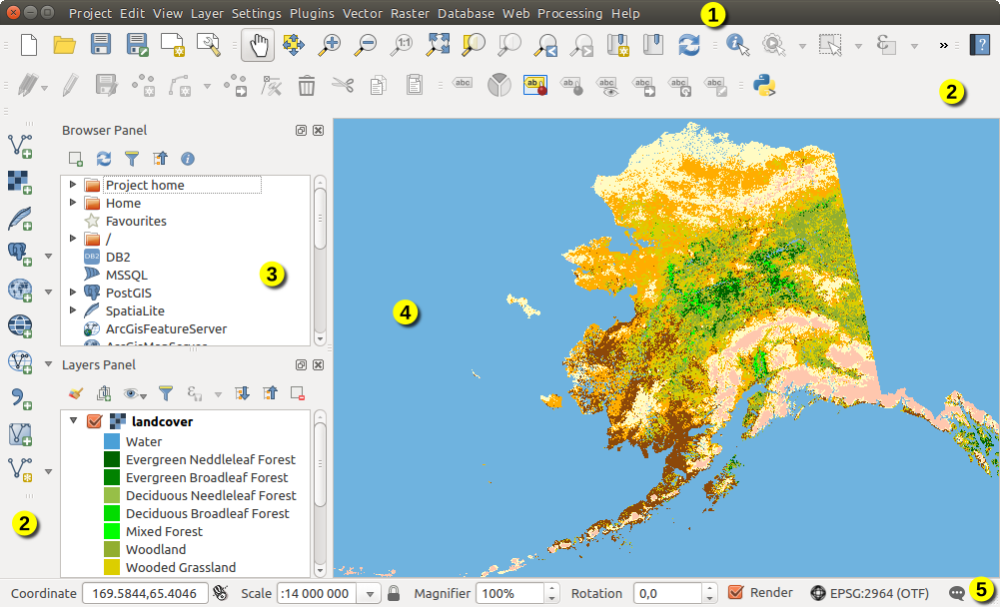

.. only:: html

   |updatedisclaimer|

.. Purpose: This chapter aims to describe only the interface of the default
.. QGIS interface. Details should be written in other parts with a link toward it.

.. _`label_qgismainwindow`:

********
QGIS GUI
********

.. only:: html

   .. contents::
      :local:

.. index::
   single: Main window

When QGIS starts, you are presented with the GUI as shown in the figure (the
numbers 1 through 5 in yellow circles are discussed below).

.. _figure_startup:

   QGIS GUI with Alaska sample data

.. note::
   Your window decorations (title bar, etc.) may appear different depending
   on your operating system and window manager.

The QGIS GUI is divided into five components:

#. Menu Bar
#. Toolbars
#. Panels
#. Map View
#. Status Bar

These five components of the QGIS interface are described in more detail in
the following sections. Two more sections present keyboard shortcuts and
context help.

.. index:: Menu
.. _label_menubar:

Menu Bar
========

The menu bar provides access to various QGIS features using a standard
hierarchical menu. The top-level menus and a summary of some of the menu
options are listed below, together with the associated icons as
they appear on the toolbar, and keyboard shortcuts. The shortcuts presented in
this section are the defaults; however, keyboard shortcuts can also be configured
manually using the :guilabel:`Keyboard Shortcuts` dialog, opened from
:menuselection:`Settings -->` menu.

Although most menu options have a corresponding tool and vice-versa, the menus
are not organized exactly like the toolbars. The toolbar containing the tool is
listed after each menu option as a checkbox entry. Some menu options only
appear if the corresponding plugin is loaded. For more information about tools
and toolbars, see section :ref:`label_toolbars`.

.. note:: QGIS is a cross-platform application meaning that though it provides you
   with the same tools, they may be placed in different menus according to the
   operating system specification. The lists below show the most common location
   and precise when there is a variation.

.. index:: Project

Project
-------

The :menuselection:`Project` menu is somehow the entrance and exit points of
the :ref:`project file <sec_projects>`. It provides you with tools to:

* Create :guilabel:`New` file from scratch or using another project file as
  template (see :ref:`Project files options <projectfiles_options>` for
  template configuration);
* :guilabel:`Open...` project file from file browser or PostgreSQL database;
* :guilabel:`Close` a project or revert it to its last saved state;
* Save a project in a :file:`.qgs` or :file:`.qgz` file format, either as file
  or within a PotgreSQL database;
* Export the project rendering to different formats from the map canvas or
  using a :ref:`print layout <label_printlayout>`;
* Set the project properties and the snapping options when editing layers.

=======================================================  ====================  =========================  ===============================
Menu Option                                              Shortcut              Toolbar                    Reference
=======================================================  ====================  =========================  ===============================
|fileNew| :guilabel:`New`                                :kbd:`Ctrl+N`         :guilabel:`Project`        :ref:`sec_projects`
:menuselection:`New from template -->`                   \                     \                          :ref:`sec_projects`
|fileOpen| :guilabel:`Open...`                           :kbd:`Ctrl+O`         :guilabel:`Project`        :ref:`sec_projects`
:menuselection:`Open from --> PostgreSQL`                \                     \                          \
:menuselection:`Open Recent -->`                         \                     \                          :ref:`sec_projects`
:guilabel:`Close`                                        \                     \                          :ref:`sec_projects`
|fileSave| :guilabel:`Save`                              :kbd:`Ctrl+S`         :guilabel:`Project`        :ref:`sec_projects`
|fileSaveAs| :guilabel:`Save As...`                      :kbd:`Ctrl+Shift+S`   :guilabel:`Project`        :ref:`sec_projects`
:menuselection:`Save to --> PostgreSQL`                  \                     \                          \
:guilabel:`Revert...`                                    \                     \                          \
:guilabel:`Properties...`                                :kbd:`Ctrl+Shift+P`   \                          :ref:`project_properties`
:guilabel:`Snapping Options...`                          \                     \                          :ref:`snapping_tolerance`
:menuselection:`Import/Export -->`                       \                     \                          \
|saveMapAsImage| :guilabel:`Export Map to Image...`      \                     \                          :ref:`sec_output`
|saveAsPDF| :guilabel:`Export Map to PDF...`             \                     \                          :ref:`sec_output`
:guilabel:`Export Project to DXF...`                     \                     \                          :ref:`sec_output`
:guilabel:`Import Layers from DWG/DXF...`                \                     \                          \
|newLayout| :guilabel:`New Print Layout...`              :kbd:`Ctrl+P`         :guilabel:`Project`        :ref:`label_printlayout`
|newReport| :guilabel:`New Report...`                    \                     \                          :ref:`label_printlayout`
|layoutManager| :guilabel:`Layout Manager...`            \                     :guilabel:`Project`        :ref:`label_printlayout`
:menuselection:`Layouts -->`                             \                     \                          :ref:`label_printlayout`
|fileExit| :guilabel:`Exit QGIS`                         :kbd:`Ctrl+Q`         \                          \
=======================================================  ====================  =========================  ===============================

Under |osx| macOS, the :guilabel:`Exit QGIS` command corresponds to
:menuselection:`QGIS --> Quit QGIS` (:kbd:`Cmd+Q`).

Edit
----

The :menuselection:`Edit` menu presents most of the native tools needed to edit
layers attributes or geometry (see :ref:`editingvector` for details).

=======================================================================  ====================  =================================   ===================================
Menu Option                                                              Shortcut              Toolbar                             Reference
=======================================================================  ====================  =================================   ===================================
|undo| :guilabel:`Undo`                                                  :kbd:`Ctrl+Z`         :guilabel:`Digitizing`              :ref:`undoredo_edits`
|redo| :guilabel:`Redo`                                                  :kbd:`Ctrl+Shift+Z`   :guilabel:`Digitizing`              :ref:`undoredo_edits`
|editCut| :guilabel:`Cut Features`                                       :kbd:`Ctrl+X`         :guilabel:`Digitizing`              :ref:`clipboard_feature`
|editCopy| :guilabel:`Copy Features`                                     :kbd:`Ctrl+C`         :guilabel:`Digitizing`              :ref:`clipboard_feature`
|editPaste| :guilabel:`Paste Features`                                   :kbd:`Ctrl+V`         :guilabel:`Digitizing`              :ref:`clipboard_feature`
:menuselection:`Paste features as -->`                                   \                     \                                   :ref:`sec_attribute_table`
:menuselection:`Select -->`                                              \                     :guilabel:`Attributes`              :ref:`sec_selection`
|newTableRow| :guilabel:`Add Record`                                     :kbd:`Ctrl+.`         :guilabel:`Digitizing`              \
|capturePoint| :guilabel:`Add Point Feature`                             :kbd:`Ctrl+.`         :guilabel:`Digitizing`              :ref:`add_feature`
|capturePoint| :guilabel:`Add Line Feature`                              :kbd:`Ctrl+.`         :guilabel:`Digitizing`              :ref:`add_feature`
|capturePolygon| :guilabel:`Add Polygon Feature`                         :kbd:`Ctrl+.`         :guilabel:`Digitizing`              :ref:`add_feature`
|circularStringCurvePoint| :guilabel:`Add Circular String`               \                     :guilabel:`Shape Digitizing`        :ref:`add_circular_string`
|circularStringRadius| :guilabel:`Add Circular String by Radius`         \                     :guilabel:`Shape Digitizing`        :ref:`add_circular_string`
:menuselection:`Add Circle -->`                                          \                     :guilabel:`Shape Digitizing`        \
:menuselection:`Add Rectangle -->`                                       \                     :guilabel:`Shape Digitizing`        \
:menuselection:`Add Regular Polygon -->`                                 \                     :guilabel:`Shape Digitizing`        \
:menuselection:`Add Ellipse -->`                                         \                     :guilabel:`Shape Digitizing`        \
|moveFeature| :guilabel:`Move Feature(s)`                                \                     :guilabel:`Advanced Digitizing`     :ref:`move_feature`
|moveFeatureCopy| :guilabel:`Copy and Move Feature(s)`                   \                     :guilabel:`Advanced Digitizing`     :ref:`move_feature`
|deleteSelected| :guilabel:`Delete Selected`                             \                     :guilabel:`Digitizing`              :ref:`delete_feature`
|multiEdit| :guilabel:`Modify Attributes of Selected Features`           \                     :guilabel:`Digitizing`              :ref:`calculate_fields_values`
|rotateFeature| :guilabel:`Rotate Feature(s)`                            \                     :guilabel:`Advanced Digitizing`     :ref:`rotate_feature`
|simplifyFeatures| :guilabel:`Simplify Feature`                          \                     :guilabel:`Advanced Digitizing`     :ref:`simplify_feature`
|addRing| :guilabel:`Add Ring`                                           \                     :guilabel:`Advanced Digitizing`     :ref:`add_ring`
|addPart| :guilabel:`Add Part`                                           \                     :guilabel:`Advanced Digitizing`     :ref:`add_part`
|fillRing| :guilabel:`Fill Ring`                                         \                     :guilabel:`Advanced Digitizing`     :ref:`fill_ring`
|deleteRing| :guilabel:`Delete Ring`                                     \                     :guilabel:`Advanced Digitizing`     :ref:`delete_ring`
|deletePart| :guilabel:`Delete Part`                                     \                     :guilabel:`Advanced Digitizing`     :ref:`delete_part`
|reshape| :guilabel:`Reshape Features`                                   \                     :guilabel:`Advanced Digitizing`     :ref:`reshape_feature`
|offsetCurve| :guilabel:`Offset Curve`                                   \                     :guilabel:`Advanced Digitizing`     :ref:`offset_curve`
|splitFeatures| :guilabel:`Split Features`                               \                     :guilabel:`Advanced Digitizing`     :ref:`split_feature`
|splitParts| :guilabel:`Split Parts`                                     \                     :guilabel:`Advanced Digitizing`     :ref:`split_part`
|mergeFeatures| :guilabel:`Merge Selected Features`                      \                     :guilabel:`Advanced Digitizing`     :ref:`mergeselectedfeatures`
|mergeFeatAttributes| :guilabel:`Merge Attributes of Selected Features`  \                     :guilabel:`Advanced Digitizing`     :ref:`mergeattributesfeatures`
|vertexTool| :guilabel:`Vertex Tool (All Layers)`                        \                     :guilabel:`Digitizing`              :ref:`vertex_tool`
|vertexToolActiveLayer| :guilabel:`Vertex Tool (Current Layer)`          \                     :guilabel:`Digitizing`              :ref:`vertex_tool`
|rotatePointSymbols| :guilabel:`Rotate Point Symbols`                    \                     :guilabel:`Advanced Digitizing`     :ref:`rotate_symbol`
|offsetPointSymbols| :guilabel:`Offset Point Symbols`                    \                     :guilabel:`Advanced Digitizing`     :ref:`offset_symbol`
=======================================================================  ====================  =================================   ===================================

Depending on the selected layer geometry type, some of the tools may look different:

.. :tabularcolumns: |l|c|c|c|

=====================================  ========================  ========================  ==========================
Menu Option                            Point                     Polyline                  Polygon
=====================================  ========================  ========================  ==========================
:guilabel:`Move Feature(s)`            |moveFeaturePoint|        |moveFeatureLine|         |moveFeature|
:guilabel:`Copy and Move Feature(s)`   |moveFeatureCopyPoint|    |moveFeatureCopyLine|     |moveFeatureCopy|
=====================================  ========================  ========================  ==========================

.. _view_menu:

View
----

The map being designed is rendered in map views. You can interact with these
interfaces using the :menuselection:`View` tools (see :ref:`working_canvas`
for more information). For example, you can:

* Create new map views, 2D or 3D, next to the main map canvas;
* :ref:`Zoom or pan <zoom_pan>` to any place;
* Query displayed features attributes or geometry;
* Change the map view aspect using preview modes, annotations or decorations;
* Access any panel or toolbar.

Moreover the menu allows to reorganize QGIS interface itself using actions like:

* :guilabel:`Toggle Full Screen Mode`: covers the whole screen with the
  application items while hiding its title bar;
* :guilabel:`Toggle Panel Visibility`: shows or hides enabled :ref:`panels
  <panels_tools>`, quite useful when digitizing features (where you want
  maximum canvas visibility) as well as when you do a (projected/recorded)
  presentation using QGIS' main canvas;
* :guilabel:`Toggle Map Only`: hides panels, toolbars, menus and status bar
  and only shows the map canvas. Combined with full screen option, it makes
  your screen display only the map.

=========================================================  =======================  =============================  ==========================================
Menu Option                                                Shortcut                 Toolbar                        Reference
=========================================================  =======================  =============================  ==========================================
|newMap| :guilabel:`New Map View`                          :kbd:`Ctrl+M`            :guilabel:`Map Navigation`     \
:guilabel:`New 3D Map View`                                :kbd:`Ctrl+Shift+M`      \                              \
|pan| :guilabel:`Pan Map`                                  \                        :guilabel:`Map Navigation`     :ref:`zoom_pan`
|panToSelected| :guilabel:`Pan Map to Selection`           \                        :guilabel:`Map Navigation`     \
|zoomIn| :guilabel:`Zoom In`                               :kbd:`Ctrl+Alt++`        :guilabel:`Map Navigation`     :ref:`zoom_pan`
|zoomOut| :guilabel:`Zoom Out`                             :kbd:`Ctrl+Alt+-`        :guilabel:`Map Navigation`     :ref:`zoom_pan`
|identify| :guilabel:`Identify Features`                   :kbd:`Ctrl+Shift+I`      :guilabel:`Attributes`         :ref:`identify`
:menuselection:`Measure -->`                               \                        :guilabel:`Attributes`         :ref:`sec_measure`
|sum| :guilabel:`Statistical Summary`                      \                        :guilabel:`Attributes`         :ref:`statistical_summary`
|zoomFullExtent| :guilabel:`Zoom Full`                     :kbd:`Ctrl+Shift+F`      :guilabel:`Map Navigation`     \
|zoomToLayer| :guilabel:`Zoom To Layer`                    \                        :guilabel:`Map Navigation`     \
|zoomToSelected| :guilabel:`Zoom To Selection`             :kbd:`Ctrl+J`            :guilabel:`Map Navigation`     \
|zoomLast| :guilabel:`Zoom Last`                           \                        :guilabel:`Map Navigation`     \
|zoomNext| :guilabel:`Zoom Next`                           \                        :guilabel:`Map Navigation`     \
|zoomActual| :guilabel:`Zoom To Native Resolution (100%`)  \                        :guilabel:`Map Navigation`     \
:menuselection:`Decorations -->`                           \                        \                              :ref:`decorations`
:menuselection:`Preview mode -->`                          \                        \                              \
|mapTips| :guilabel:`Show Map Tips`                             \                        :guilabel:`Attributes`         :ref:`maptips`
|newBookmark| :guilabel:`New Bookmark...`                  :kbd:`Ctrl+B`            :guilabel:`Map Navigation`     :ref:`sec_bookmarks`
|showBookmarks| :guilabel:`Show Bookmarks`                 :kbd:`Ctrl+Shift+B`      :guilabel:`Map Navigation`     :ref:`sec_bookmarks`
|draw| :guilabel:`Refresh`                                 :kbd:`F5`                :guilabel:`Map Navigation`     \
|showAllLayers| :guilabel:`Show All Layers`                :kbd:`Ctrl+Shift+U`      \                              :ref:`label_legend`
|hideAllLayers| :guilabel:`Hide All Layers`                :kbd:`Ctrl+Shift+H`      \                              :ref:`label_legend`
|showSelectedLayers| :guilabel:`Show Selected Layers`      \                        \                              :ref:`label_legend`
|hideSelectedLayers| :guilabel:`Hide Selected Layers`      \                        \                              :ref:`label_legend`
|hideDeselectedLayers| :guilabel:`Hide Deselected Layers`  \                        \                              :ref:`label_legend`
:menuselection:`Panels -->`                                \                        \                              :ref:`sec_panels_and_toolbars`
:menuselection:`Toolbars -->`                              \                        \                              :ref:`sec_panels_and_toolbars`
:guilabel:`Toggle Full Screen Mode`                        :kbd:`F11`               \                              \
:guilabel:`Toggle Panel Visibility`                        :kbd:`Ctrl+Tab`          \                              \
:guilabel:`Toggle Map Only`                                :kbd:`Ctrl+Shift+Tab`    \                              \
=========================================================  =======================  =============================  ==========================================

Under |kde| Linux KDE, :menuselection:`Panels -->`, :menuselection:`Toolbars -->`
and :guilabel:`Toggle Full Screen Mode` are rather placed in :menuselection:`Settings`
menu.

Layer
-----

The :menuselection:`Layer` menu provides a large set of tools to :ref:`create
<sec_create_vector>` new data source, :ref:`add <opening_data>` it to a project
or :ref:`save modifications <sec_edit_existing_layer>` done to it. Using the
same data source, you can also:

* :guilabel:`Duplicate` a layer, generating a copy you can modify within the
  same project;
* :guilabel:`Copy` and :guilabel:`Paste` layers or group from one project to
  another, with their properties you can freely customize;
* or :guilabel:`Embed Layers and Groups...` from another project, with their
  unmodifiable properties (see :ref:`nesting_projects`).
  
The :menuselection:`Layer` menu  also gives access to tools to configure, copy
or paste layer properties (style, scale, CRS...).

============================================================  ====================  ================================  =====================================
Menu Option                                                   Shortcut              Toolbar                           Reference
============================================================  ====================  ================================  =====================================
|dataSourceManager| :guilabel:`Data Source Manager`           :kbd:`Ctrl+L`         :guilabel:`Data Source Manager`    \
:menuselection:`Create Layer -->`                             \                     :guilabel:`Data Source Manager`    :ref:`sec_create_vector`
:menuselection:`Add Layer -->`                                \                     :guilabel:`Data Source Manager`    :ref:`opening_data`
:guilabel:`Embed Layers and Groups...`                        \                     \                                  :ref:`nesting_projects`
:guilabel:`Add from Layer Definition File...`                 \                     \                                  \
|editCopy| :guilabel:`Copy style`                             \                     \                                  :ref:`save_layer_property`
|editPaste| :guilabel:`Paste style`                           \                     \                                  :ref:`save_layer_property`
|editCopy| :guilabel:`Copy Layer`                             \                     \                                  \
|editPaste| :guilabel:`Paste Layer/Group`                     \                     \                                  \
|openTable| :guilabel:`Open Attribute Table`                  :kbd:`F6`             :guilabel:`Attributes`             :ref:`sec_attribute_table`
|toggleEditing| :guilabel:`Toggle Editing`                    \                     :guilabel:`Digitizing`             :ref:`sec_edit_existing_layer`
|fileSave| :guilabel:`Save Layer Edits`                       \                     :guilabel:`Digitizing`             :ref:`save_feature_edits`
|allEdits| :menuselection:`Current Edits -->`                 \                     :guilabel:`Digitizing`             :ref:`save_feature_edits`
:guilabel:`Save As...`                                        \                     \                                  :ref:`general_saveas`
:guilabel:`Save As Layer Definition File...`                  \                     \                                  \
|removeLayer| :guilabel:`Remove Layer/Group`                  :kbd:`Ctrl+D`         \                                  \
|duplicateLayer| :guilabel:`Duplicate Layer(s)`               \                     \                                  \
:guilabel:`Set Scale Visibility of Layer(s)`                  \                     \                                  \
:guilabel:`Set CRS of Layer(s)`                               :kbd:`Ctrl+Shift+C`   \                                  \
:guilabel:`Set Project CRS from Layer`                        \                     \                                  \
:guilabel:`Properties...`                                     \                     \                                  :ref:`vector_properties_dialog`
:guilabel:`Filter...`                                         :kbd:`Ctrl+F`         \                                  :ref:`vector_query_builder`
|labeling| :guilabel:`Labeling`                               \                     \                                  :ref:`vector_labels_tab`
|inOverview| :guilabel:`Show in Overview`                     \                     \                                  :ref:`overview_panels`
|addAllToOverview| :guilabel:`Show All in Overview`           \                     \                                  :ref:`overview_panels`
|removeAllOVerview| :guilabel:`Hide All from Overview`        \                     \                                  :ref:`overview_panels`
============================================================  ====================  ================================  =====================================

Settings
--------

=================================================================  ====================  ====================  ===================================
Menu Option                                                        Shortcut              Toolbar               Reference
=================================================================  ====================  ====================  ===================================
:menuselection:`User Profiles -->`                                 \                     \                     \
|styleManager| :guilabel:`Style Manager...`                        \                     \                     :ref:`vector_style_manager`
|customProjection| :guilabel:`Custom Projections...`               \                     \                     :ref:`sec_custom_projections`
|keyboardShortcuts| :guilabel:`Keyboard Shortcuts...`              \                     \                     :ref:`shortcuts`
|interfaceCustomization| :guilabel:`Interface Customization...`    \                     \                     :ref:`sec_customization`
|options| :guilabel:`Options...`                                   \                     \                     :ref:`gui_options`
=================================================================  ====================  ====================  ===================================

Under |kde| Linux KDE, you'll find more tools in :menuselection:`Settings`
menu such as :menuselection:`Panels -->`,
:menuselection:`Toolbars -->` and :guilabel:`Toggle Full Screen Mode`.

Plugins
-------

======================================================================  ====================  =======================  ===============================
Menu Option                                                             Shortcut               Toolbar                 Reference
======================================================================  ====================  =======================  ===============================
|showPluginManager| :guilabel:`Manage and Install Plugins...`           \                     \                        :ref:`managing_plugins`
|pythonFile| :guilabel:`Python Console`                                 :kbd:`Ctrl+Alt+P`     :guilabel:`Plugins`      :ref:`console`
======================================================================  ====================  =======================  ===============================

When starting QGIS for the first time not all core plugins are loaded.

Vector
------

This is what the :guilabel:`Vector` menu will look like if all the core plugins
are enabled.

==============================================================  =======================  =======================  ===============================
Menu Option                                                     Shortcut                 Toolbar                  Reference
==============================================================  =======================  =======================  ===============================
:menuselection:`Geoprocessing Tools -->`                        :kbd:`Alt+O` + :kbd:`G`  \                        :ref:`processing.options`
:menuselection:`Geometry Tools -->`                             :kbd:`Alt+O` + :kbd:`E`  \                        :ref:`processing.options`
:menuselection:`Analysis Tools -->`                             :kbd:`Alt+O` + :kbd:`A`  \                        :ref:`processing.options`
:menuselection:`Data Management Tools -->`                      :kbd:`Alt+O` + :kbd:`D`  \                        :ref:`processing.options`
:menuselection:`Research Tools -->`                             :kbd:`Alt+O` + :kbd:`R`  \                        :ref:`processing.options`
|coordinateCapture| :guilabel:`Coordinate Capture`              \                        :guilabel:`Vector`       :ref:`coordcapt`
|geometryChecker| :guilabel:`Geometry Checker`                  \                        :guilabel:`Vector`       :ref:`geometry_checker`
|gpsImporter| :guilabel:`GPS Tools`                             \                        :guilabel:`Vector`       :ref:`plugin_gps`
|topologyChecker| :guilabel:`Topology Checker`                  \                        :guilabel:`Vector`       :ref:`topology`
==============================================================  =======================  =======================  ===============================

By default, QGIS adds :ref:`Processing <sec_processing_intro>` algorithms grouped
by sub-menus to the :guilabel:`Vector` menu. This provides shortcuts
for many common vector-based GIS tasks picked from different providers.
If not all aforementioned sub-menus are available, then you would need to enable
the Processing plugin in :menuselection:`Plugins --> Manage and Install Plugins...`.

Note that the list of the :guilabel:`Vector` menu tools can be extended with
any Processing algorithms or some external :ref:`plugins <plugins>`.

Raster
------

This is what the :guilabel:`Raster` menu will look like if all the core plugins
are enabled.

==========================================================  ====================  ==================================
Menu Option                                                 Toolbar               Reference
==========================================================  ====================  ==================================
|showRasterCalculator| :guilabel:`Raster calculator...`     \                     :ref:`label_raster_calc`
:guilabel:`Align Raster...`                                 \                     :ref:`label_raster_align`
:menuselection:`Analysis -->`                               \                     :ref:`processing.options`
:menuselection:`Projection -->`                             \                     :ref:`processing.options`
:menuselection:`Conversion -->`                             \                     :ref:`processing.options`
:menuselection:`Miscellaneous -->`                          \                     :ref:`processing.options`
:menuselection:`Extraction -->`                             \                     :ref:`processing.options`
:menuselection:`Conversion -->`                             \                     :ref:`processing.options`
|georefRun| :guilabel:`Georeferencer`                       :guilabel:`Raster`    :ref:`georef`
==========================================================  ====================  ==================================

By default, QGIS adds :ref:`Processing <sec_processing_intro>` algorithms grouped
by sub-menus to the :guilabel:`Raster` menu. This provides a shortcut
for many common raster-based GIS tasks picked from different providers.
If not all aforementioned sub-menus are available, then you would need to enable
the Processing plugin in :menuselection:`Plugins --> Manage and Install Plugins...`.

Note that the list of the :guilabel:`Raster` menu tools can be extended with
any Processing algorithms or some external :ref:`plugins <plugins>`.

Database
--------

If the DB Manager core plugin is enabled, the :guilabel:`Database` menu will be
available.
This is what the :guilabel:`Database` menu will look like if all the core plugins
are enabled.

===============================================  ============================  ===============================
Menu Option                                      Toolbar                       Reference
===============================================  ============================  ===============================
|dbManager| :guilabel:`DB Manager`               :guilabel:`Database`          :ref:`dbmanager`
:menuselection:`eVis -->`                        :guilabel:`Database`          :ref:`evis`
:menuselection:`Offline Editing -->`             :guilabel:`Database`          :ref:`offlinedit`
===============================================  ============================  ===============================

When starting QGIS for the first time not all core plugins are loaded.

Web
---

If the Metasearch Catalog Client core plugin is enabled, the :guilabel:`Web`
menu will be available.

===============================================  ===========================  ===============================
Menu Option                                      Toolbar                      Reference
===============================================  ===========================  ===============================
|metasearch| :menuselection:`Metasearch`         :guilabel:`Web`              :ref:`metasearch`
===============================================  ===========================  ===============================

When starting QGIS for the first time not all core plugins are loaded.

Processing
----------

==============================================================  ==========================  ==========================================
Menu Option                                                     Shortcut                    Reference
==============================================================  ==========================  ==========================================
|processing| :guilabel:`Toolbox`                                :kbd:`Ctrl+Alt+T`           :ref:`processing.toolbox`
|processingModel| :guilabel:`Graphical Modeler...`              :kbd:`Ctrl+Alt+M`           :ref:`processing.modeler`
|processingHistory| :guilabel:`History...`                      :kbd:`Ctrl+Alt+H`           :ref:`processing.history`
|processingResult| :guilabel:`Results Viewer`                   :kbd:`Ctrl+Alt+R`           :ref:`processing.results`
==============================================================  ==========================  ==========================================

When starting QGIS for the first time not all core plugins are loaded.

Help
----

=======================================================  ===========================  ===============================
Menu Option                                              Shortcut                     Toolbar
=======================================================  ===========================  ===============================
|helpContents| :guilabel:`Help Contents`                 :kbd:`F1`                    :guilabel:`Help`
|whatsThis| :guilabel:`What's This?`                     :kbd:`Shift+F1`              :guilabel:`Help`
:guilabel:`API Documentation`                            \                            \
:guilabel:`Report an Issue`                              \                            \
:guilabel:`Need commercial support?`                     \                            \
|qgisHomePage| :guilabel:`QGIS Home Page`                :kbd:`Ctrl+H`                \
|checkQgisVersion| :guilabel:`Check QGIS Version`        \                            \
|helpAbout| :guilabel:`About`                            \                            \
|helpSponsors| :guilabel:`QGIS Sponsors`                 \                            \
=======================================================  ===========================  ===============================

QGIS
-----

This menu is only available under |osx| macOS and contains some OS related
commands.

================================  ====================  =========================
Menu Option                       Shortcut              Reference
================================  ====================  =========================
:guilabel:`Preferences`           \                     \
:guilabel:`About QGIS`            \                     \
:guilabel:`Hide QGIS`             \                     \
 :guilabel:`Show All`              \                     \
:guilabel:`Hide Others`           \                     \
:guilabel:`Quit QGIS`             :kbd:`Cmd+Q`          \
================================  ====================  =========================

:guilabel:`Preferences` and :guilabel:`About QGIS` are the same commands as
:menuselection:`Settings --> Options` and :menuselection:`Help --> About`.
:guilabel:`Quit QGIS` corresponds to :menuselection:`Project --> Exit QGIS`
under the other platforms.

.. _sec_panels_and_toolbars:

Panels and Toolbars
===================

From the :menuselection:`View` menu (or |kde| :menuselection:`Settings`), you can
switch on and off QGIS widgets (:menuselection:`Panels -->`) or toolbars
(:menuselection:`Toolbars -->`). You can (de)activate any of them by
right-clicking the menu bar or a toolbar and choose the item you want.
Each panel or toolbar can be moved and placed wherever you feel comfortable
within QGIS interface.
The list can also be extended with the activation of :ref:`Core or external
plugins <plugins>`.

.. index:: Toolbars
.. _`label_toolbars`:

Toolbars
--------

The toolbar provides access to most of the same functions as the menus, plus
additional tools for interacting with the map. Each toolbar item has pop-up help
available. Hold your mouse over the item and a short description of the tool's
purpose will be displayed.

Every toolbar can be moved around according to your needs. Additionally,
they can be switched off using the right mouse button context menu, or by
holding the mouse over the toolbars.

.. _figure_toolbars:

.. figure:: img/toolbars.png
   :align: center

   The Toolbars menu

.. index::
   single: Toolbars; Layout

.. tip:: **Restoring toolbars**

   If you have accidentally hidden a toolbar, you can get it
   back by choosing menu option :menuselection:`View --> Toolbars -->`
   (or |kde| :menuselection:`Settings --> Toolbars -->`).
   If for some reason a toolbar (or any other widget) totally disappears
   from the interface, you'll find tips to get it back at :ref:`restoring
   initial GUI <tip_restoring_configuration>`.

.. index:: Panels
.. _panels_tools:

Panels
------

Besides toolbars, QGIS provides by default many panels to work with. Panels are
special widgets that you can interact with (selecting options, checking boxes,
filling values...) in order to perform a more complex task.

.. _figure_panels:

.. figure:: img/panels.png
   :align: center

   The Panels menu

Below are listed default panels provided by QGIS:

* the :ref:`label_legend`
* the :ref:`Browser Panel <browser_panel>`
* the :ref:`Advanced Digitizing Panel <advanced_digitizing_panel>`
* the :ref:`Spatial Bookmarks Panel <sec_bookmarks>`
* the :ref:`GPS Information Panel <sec_gpstracking>`
* the :ref:`Tile Scale Panel <tilesets>`
* the :ref:`Identify Panel <identify>`
* the :ref:`User Input Panel <rotate_feature>`
* the :ref:`Layer Order Panel <layer_order>`
* the :ref:`layer_styling_panel`
* the :ref:`statistical_summary`
* the :ref:`overview_panels`
* the :ref:`log_message_panel`
* the :ref:`undo_redo_panel`
* the :ref:`Processing Toolbox <label_processing>`

.. index:: Map view
.. _`label_mapview`:

Map View
========

Also called **Map canvas**, this is the "business end" of QGIS ---
maps are displayed in this area. The map displayed in this window
will depend on the vector and raster layers you have chosen to load.

When you add a layer (see e.g. :ref:`opening_data`), QGIS automatically
looks for its Coordinate Reference System (CRS) and zooms to its extent if you
work in a blank QGIS project. The layer's CRS is then applied to the project.
If there are already layers in the project, and in the case the new layer has
the same CRS as the project, its features falling in the current map canvas
extent will be visualized. If the new layer is in a different CRS from the
project's, you must :guilabel:`Enable on-the-fly CRS transformation` from the
:menuselection:`Project --> Properties... --> CRS`
(see :ref:`otf_transformation`). The added layer should now be visible if data
are available in the current view extent.

The map view can be panned, shifting the focus of the map display to another
region, and it can be zoomed in and out. Various other operations can be
performed on the map as described in the :ref:`label_toolbars` description.
The map view and the legend are tightly bound to each other --- the maps in
view reflect changes you make in the legend area.

.. index:: Zoom, Mouse wheel

.. tip::
   **Zooming the Map with the Mouse Wheel**

   You can use the mouse wheel to zoom in and out on the map. Place the mouse
   cursor inside the map area and roll the wheel forward (away from you) to
   zoom in and backwards (towards you) to zoom out. The zoom is centered on the
   mouse cursor position. You can customize the behavior of the
   mouse wheel zoom using the :guilabel:`Map tools` tab under the
   :menuselection:`Settings --> Options` menu.

.. index:: Pan, Arrow

.. tip::
   **Panning the Map with the Arrow Keys and Space Bar**

   You can use the arrow keys to pan the map. Place the mouse cursor inside
   the map area and click on the right arrow key to pan east, left arrow key to
   pan west, up arrow key to pan north and down arrow key to pan south. You can
   also pan the map using the space bar or the click on mouse wheel: just move
   the mouse while holding down space bar or click on mouse wheel.

.. _`label_statusbar`:

Status Bar
==========

The status bar provides you with general information about the map view,
processed or available actions and offers you tools to manage the map view.

On the left side of the status bar, the locator bar, a quick search widget,
helps you find and run any feature or options in QGIS. Simply write a text
associated to the item you are looking for (name, tag, keyword...) and you get
a list that updates as you write. You can also limit the search scope thanks to
the :ref:`locator filters <locator_options>`. Click the |search| button to
select any of them and press the **[Configure]** entry for global settings.

In the area next to it, will be shown when needed summary of actions you've done
(such as selecting features in a layer, removing layer) or a long description
of the tool you are hovering over (not available for all tools).

In case of lengthy operations, such as gathering of statistics in raster layers,
Processing algorithms' execution or rendering several layers in map view, a
progress bar is displayed in the status bar to show the current progress of the
action.

The |tracking| :guilabel:`Coordinate` option shows the current position of the mouse,
following it while moving across the map view. You can set the unit (and precision)
to use in the :menuselection:`Project --> Properties... --> General` tab.
Click on the small button at the left of the textbox to toggle between
the Coordinate option and the |extents| :guilabel:`Extents` option that displays
in map units, the coordinates of the current lower leftmost and upper rightmost
points of the map view, as you pan and zoom in and out.

Next to the coordinate display you will find the :guilabel:`Scale` display.
It shows the scale of the map view. If you zoom in or out, QGIS shows you the
current scale. There is a scale selector, which allows you to choose among
:ref:`predefined and custom scales <predefinedscales>` to assign to the map view.

.. index:: Magnification
.. _magnifier:

On the right side of the scale display, press the |lockedGray| button to lock
the scale to use the magnifier to zoom in or out. The magnifier allows to zoom
in to a map without altering the map scale, making it easier to accurately
tweak the positions of labels and symbols. The magnification level is expressed as a
percentage. If the :guilabel:`Magnifier` has a level of 100%, then the current
map is not magnified. Additionally, a default magnification value can be defined
within :menuselection:`Settings --> Options --> Rendering --> Rendering behavior`,
which is very useful for high resolution screen to avoid too small symbols.

On the right of the magnifier tool you can define a current clockwise rotation for
your map view in degrees.

On the right side of the status bar, there is a small
checkbox which can be used to temporarily prevent layers being rendered to the
map view (see section :ref:`redraw_events`).

To the right of the render functions, you find the |projectionEnabled|
:guilabel:`EPSG:code` button mentioning the current project CRS. Clicking on
this opens the :guilabel:`Project Properties` dialog and lets you apply another
CRS to the map view.

The |messageLog| :sup:`Messages` button next to it opens the :guilabel:`Log
Messages Panel` which informs you on underlying process (QGIS startup, plugins
loading, processing tools...)

Depending on the :ref:`Plugin Manager settings <setting_plugins>`, the status
bar can sometimes show icons at the to right to inform you about availability
of |pluginNew| new or |pluginUpgrade| upgradeable plugins. Click the icon to
open the Plugin Manager dialog.

.. index::
   single: Scale calculate

.. tip::
   **Calculating the Correct Scale of Your Map Canvas**

   When you start QGIS, the default CRS is ``WGS 84 (epsg 4326)`` and
   units are degrees. This means that QGIS will interpret any
   coordinate in your layer as specified in degrees. To get correct scale values,
   you can either manually change this setting, e.g. to meters, in the :guilabel:`General`
   tab under :menuselection:`Project --> Properties...`, or you can use
   the |projectionEnabled| :sup:`EPSG:code` icon seen above. In the latter case,
   the units are set to what the project projection specifies (e.g., ``+units=us-ft``).

   Note that CRS choice on startup can be set in :menuselection:`Settings --> Options --> CRS`.

.. Substitutions definitions - AVOID EDITING PAST THIS LINE
   This will be automatically updated by the find_set_subst.py script.
   If you need to create a new substitution manually,
   please add it also to the substitutions.txt file in the
   source folder.

.. |addAllToOverview| image:: /static/common/mActionAddAllToOverview.png
   :width: 1.5em
.. |addPart| image:: /static/common/mActionAddPart.png
   :width: 1.5em
.. |addRing| image:: /static/common/mActionAddRing.png
   :width: 2em
.. |allEdits| image:: /static/common/mActionAllEdits.png
   :width: 1.5em
.. |capturePoint| image:: /static/common/mActionCapturePoint.png
   :width: 1.5em
.. |capturePolygon| image:: /static/common/mActionCapturePolygon.png
   :width: 1.5em
.. |checkQgisVersion| image:: /static/common/mActionCheckQgisVersion.png
   :width: 1.5em
.. |circularStringCurvePoint| image:: /static/common/mActionCircularStringCurvePoint.png
   :width: 1.5em
.. |circularStringRadius| image:: /static/common/mActionCircularStringRadius.png
   :width: 1.5em
.. |coordinateCapture| image:: /static/common/coordinate_capture.png
   :width: 1.5em
.. |customProjection| image:: /static/common/mActionCustomProjection.png
   :width: 1.5em
.. |dataSourceManager| image:: /static/common/mActionDataSourceManager.png
   :width: 1.5em
.. |dbManager| image:: /static/common/dbmanager.png
   :width: 1.5em
.. |deletePart| image:: /static/common/mActionDeletePart.png
   :width: 2em
.. |deleteRing| image:: /static/common/mActionDeleteRing.png
   :width: 2em
.. |deleteSelected| image:: /static/common/mActionDeleteSelected.png
   :width: 1.5em
.. |draw| image:: /static/common/mActionDraw.png
   :width: 1.5em
.. |duplicateLayer| image:: /static/common/mActionDuplicateLayer.png
   :width: 1.5em
.. |editCopy| image:: /static/common/mActionEditCopy.png
   :width: 1.5em
.. |editCut| image:: /static/common/mActionEditCut.png
   :width: 1.5em
.. |editPaste| image:: /static/common/mActionEditPaste.png
   :width: 1.5em
.. |extents| image:: /static/common/extents.png
   :width: 1.5em
.. |fileExit| image:: /static/common/mActionFileExit.png
.. |fileNew| image:: /static/common/mActionFileNew.png
   :width: 1.5em
.. |fileOpen| image:: /static/common/mActionFileOpen.png
   :width: 1.5em
.. |fileSave| image:: /static/common/mActionFileSave.png
   :width: 1.5em
.. |fileSaveAs| image:: /static/common/mActionFileSaveAs.png
   :width: 1.5em
.. |fillRing| image:: /static/common/mActionFillRing.png
   :width: 1.5em
.. |geometryChecker| image:: /static/common/geometrychecker.png
   :width: 1.5em
.. |georefRun| image:: /static/common/mGeorefRun.png
   :width: 1.5em
.. |gpsImporter| image:: /static/common/gps_importer.png
   :width: 1.5em
.. |helpAbout| image:: /static/common/mActionHelpAbout.png
   :width: 1.5em
.. |helpContents| image:: /static/common/mActionHelpContents.png
   :width: 1.5em
.. |helpSponsors| image:: /static/common/mActionHelpSponsors.png
   :width: 1.5em
.. |hideAllLayers| image:: /static/common/mActionHideAllLayers.png
   :width: 1.5em
.. |hideDeselectedLayers| image:: /static/common/mActionHideDeselectedLayers.png
   :width: 1.5em
.. |hideSelectedLayers| image:: /static/common/mActionHideSelectedLayers.png
   :width: 1.5em
.. |identify| image:: /static/common/mActionIdentify.png
   :width: 1.5em
.. |inOverview| image:: /static/common/mActionInOverview.png
   :width: 1.5em
.. |interfaceCustomization| image:: /static/common/mActionInterfaceCustomization.png
   :width: 1.5em
.. |kde| image:: /static/common/kde.png
   :width: 1.5em
.. |keyboardShortcuts| image:: /static/common/mActionKeyboardShortcuts.png
   :width: 1.5em
.. |labeling| image:: /static/common/labelingSingle.png
   :width: 1.5em
.. |layoutManager| image:: /static/common/mActionLayoutManager.png
   :width: 1.5em
.. |lockedGray| image:: /static/common/lockedGray.png
   :width: 1.5em
.. |mapTips| image:: /static/common/mActionMapTips.png
   :width: 1.5em
.. |mergeFeatAttributes| image:: /static/common/mActionMergeFeatureAttributes.png
   :width: 1.5em
.. |mergeFeatures| image:: /static/common/mActionMergeFeatures.png
   :width: 1.5em
.. |messageLog| image:: /static/common/mMessageLog.png
   :width: 1.5em
.. |metasearch| image:: /static/common/MetaSearch.png
   :width: 1.5em
.. |moveFeature| image:: /static/common/mActionMoveFeature.png
   :width: 1.5em
.. |moveFeatureCopy| image:: /static/common/mActionMoveFeatureCopy.png
   :width: 1.5em
.. |moveFeatureCopyLine| image:: /static/common/mActionMoveFeatureCopyLine.png
   :width: 1.5em
.. |moveFeatureCopyPoint| image:: /static/common/mActionMoveFeatureCopyPoint.png
   :width: 1.5em
.. |moveFeatureLine| image:: /static/common/mActionMoveFeatureLine.png
   :width: 1.5em
.. |moveFeaturePoint| image:: /static/common/mActionMoveFeaturePoint.png
   :width: 1.5em
.. |multiEdit| image:: /static/common/mActionMultiEdit.png
   :width: 1.5em
.. |newBookmark| image:: /static/common/mActionNewBookmark.png
   :width: 1.5em
.. |newLayout| image:: /static/common/mActionNewLayout.png
   :width: 1.5em
.. |newMap| image:: /static/common/mActionNewMap.png
   :width: 1.5em
.. |newReport| image:: /static/common/mActionNewReport.png
   :width: 1.5em
.. |newTableRow| image:: /static/common/mActionNewTableRow.png
   :width: 1.5em
.. |offsetCurve| image:: /static/common/mActionOffsetCurve.png
   :width: 1.5em
.. |offsetPointSymbols| image:: /static/common/mActionOffsetPointSymbols.png
   :width: 1.5em
.. |openTable| image:: /static/common/mActionOpenTable.png
   :width: 1.5em
.. |options| image:: /static/common/mActionOptions.png
   :width: 1em
.. |osx| image:: /static/common/osx.png
   :width: 1em
.. |pan| image:: /static/common/mActionPan.png
   :width: 1.5em
.. |panToSelected| image:: /static/common/mActionPanToSelected.png
   :width: 1.5em
.. |pluginNew| image:: /static/common/pluginNew.png
   :width: 1.5em
.. |pluginUpgrade| image:: /static/common/pluginUpgrade.png
   :width: 1.5em
.. |processing| image:: /static/common/processingAlgorithm.png
   :width: 1.5em
.. |processingHistory| image:: /static/common/history.png
   :width: 2em
.. |processingModel| image:: /static/common/processingModel.png
   :width: 1.5em
.. |processingResult| image:: /static/common/processingResult.png
   :width: 1.5em
.. |projectionEnabled| image:: /static/common/mIconProjectionEnabled.png
   :width: 1.5em
.. |pythonFile| image:: /static/common/mIconPythonFile.png
   :width: 1.5em
.. |qgisHomePage| image:: /static/common/mActionQgisHomePage.png
   :width: 1.5em
.. |redo| image:: /static/common/mActionRedo.png
   :width: 1.5em
.. |removeAllOVerview| image:: /static/common/mActionRemoveAllFromOverview.png
   :width: 1.5em
.. |removeLayer| image:: /static/common/mActionRemoveLayer.png
   :width: 1.5em
.. |reshape| image:: /static/common/mActionReshape.png
   :width: 1.5em
.. |rotateFeature| image:: /static/common/mActionRotateFeature.png
   :width: 1.5em
.. |rotatePointSymbols| image:: /static/common/mActionRotatePointSymbols.png
   :width: 1.5em
.. |saveAsPDF| image:: /static/common/mActionSaveAsPDF.png
   :width: 1.5em
.. |saveMapAsImage| image:: /static/common/mActionSaveMapAsImage.png
   :width: 1.5em
.. |search| image:: /static/common/search.png
   :width: 1.5em
.. |showAllLayers| image:: /static/common/mActionShowAllLayers.png
   :width: 1.5em
.. |showBookmarks| image:: /static/common/mActionShowBookmarks.png
   :width: 1.5em
.. |showPluginManager| image:: /static/common/mActionShowPluginManager.png
   :width: 1.5em
.. |showRasterCalculator| image:: /static/common/mActionShowRasterCalculator.png
   :width: 1.5em
.. |showSelectedLayers| image:: /static/common/mActionShowSelectedLayers.png
   :width: 1.5em
.. |simplifyFeatures| image:: /static/common/mActionSimplify.png
   :width: 2em
.. |splitFeatures| image:: /static/common/mActionSplitFeatures.png
   :width: 1.5em
.. |splitParts| image:: /static/common/mActionSplitParts.png
   :width: 1.5em
.. |sum| image:: /static/common/mActionSum.png
   :width: 1.5em
.. |styleManager| image:: /static/common/mActionStyleManager.png
   :width: 1.5em
.. |symbology| image:: /static/common/symbology.png
   :width: 2em
.. |toggleEditing| image:: /static/common/mActionToggleEditing.png
   :width: 1.5em
.. |topologyChecker| image:: /static/common/mActionTopologyChecker.png
   :width: 1.5em
.. |tracking| image:: /static/common/tracking.png
   :width: 1.5em
.. |undo| image:: /static/common/mActionUndo.png
   :width: 1.5em
.. |updatedisclaimer| replace:: :disclaimer:`Docs in progress for 'QGIS testing'. Visit http://docs.qgis.org/2.18 for QGIS 2.18 docs and translations.`
.. |vertexTool| image:: /static/common/mActionVertexTool.png
   :width: 1.5em
.. |vertexToolActiveLayer| image:: /static/common/mActionVertexToolActiveLayer.png
   :width: 1.5em
.. |whatsThis| image:: /static/common/whats_this.png
   :width: 1.5em
.. |zoomActual| image:: /static/common/mActionZoomActual.png
   :width: 1.5em
.. |zoomFullExtent| image:: /static/common/mActionZoomFullExtent.png
   :width: 1.5em
.. |zoomIn| image:: /static/common/mActionZoomIn.png
   :width: 1.5em
.. |zoomLast| image:: /static/common/mActionZoomLast.png
   :width: 1.5em
.. |zoomNext| image:: /static/common/mActionZoomNext.png
   :width: 1.5em
.. |zoomOut| image:: /static/common/mActionZoomOut.png
   :width: 1.5em
.. |zoomToLayer| image:: /static/common/mActionZoomToLayer.png
   :width: 1.5em
.. |zoomToSelected| image:: /static/common/mActionZoomToSelected.png
   :width: 1.5em
