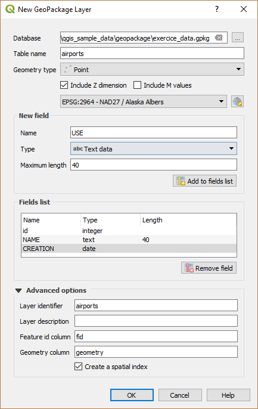
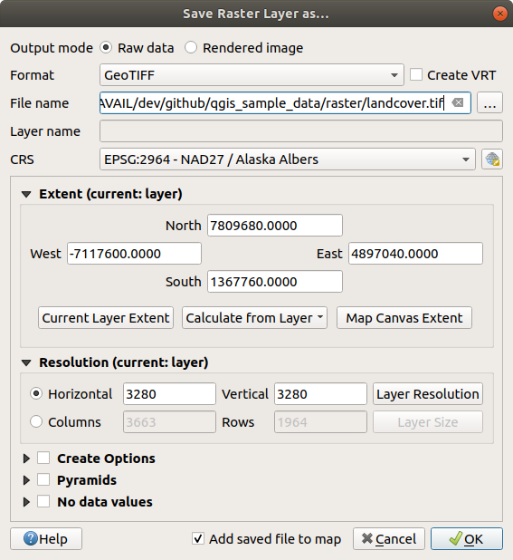

.. only:: html

   |updatedisclaimer|

.. _creating_layers:

*****************
 Creating Layers
*****************

.. only:: html

   .. contents::
      :local:

Layers can be created in many ways, including:

* empty layers from scratch;
* layers from existing layers;
* layers from the clipboard;
* layers as a result of an SQL-like query based on one or many layers: the
  :ref:`virtual layer <vector_virtual_layers>`.

QGIS also provides tools to import/export different formats.

.. index:: Create new layers
.. index:: Shapefile, SpatiaLite, GPX

.. _sec_create_vector:

Creating new vector layers
==========================

QGIS allows you to create new Shapefile layers, new SpatiaLite layers, new
GPX layers and new Temporary Scratch layers. Creation of a new GRASS layer
is supported within the GRASS plugin.
(Please refer to section :ref:`creating_new_grass_vectors` for more information
on creating GRASS vector layers.)

.. index:: New GeoPackage layer
.. _vector_create_geopackage:

Creating a new GeoPackage layer
-------------------------------

To create a new GeoPackage layer go to :menuselection:`Layer --> New -->`
|newGeoPackageLayer| :menuselection:`New GeoPackage Layer...`.
The :guilabel:`New GeoPackage Layer` dialog will
be displayed as shown in figure_create_geopackage_.

.. _figure_create_geopackage:

   Creating a New GeoPackage layer dialog

The first step is to select an existing GeoPackage or create a new one. This
can be done by pressing the ellipses :guilabel:`...` button at the right of the
Database field. Then, give a name for the new layer, define the layer type and
specify the coordinate reference system with :guilabel:`Specify CRS`.

To define an attribute table for the new GeoPackage layer, add the names of
the attribute columns you want to create with the corresponding column type, 
and click on the :guilabel:`Add to Fields List` button. Once you are happy with the
attributes, click :guilabel:`OK`. QGIS will automatically add the new layer to the
legend, and you can edit it in the same way as described in section
:ref:`sec_edit_existing_layer`.

.. _vector_create_shapefile:

Creating a new Shapefile layer
------------------------------

To create a new Shapefile layer, choose :menuselection:`Create Layer -->`
|newVectorLayer| :menuselection:`New Shapefile Layer...` from the
:menuselection:`Layer` menu or select it from the :guilabel:`Data Source Manager`
toolbar. The :guilabel:`New Shapefile Layer` dialog will be
displayed as shown in figure_create_shapefile_. 
The first step is to provide a path and name for the Shapefile. QGIS will
automatically add the :file:`.shp` extension to the name you specify
Next, choose the type of layer (point, line or polygon) and optional Z or M 
dimensions, as well as the CRS (coordinate reference system).

.. _figure_create_shapefile:

   Creating a new Shapefile layer dialog

To complete the creation of the new Shapefile layer, add the desired attributes
by specifying a name and type for each attribute and clicking on the 
:guilabel:`Add to Fields List` button. 
A first 'id' column is added by default but can be
removed, if not wanted. Only :guilabel:`Decimal number` |selectString|,
:guilabel:`Whole number` |selectString|, :guilabel:`Text data`
|selectString| and :guilabel:`Date` |selectString| attributes are
supported. Additionally, depending on the attribute type, you can also define
the length and precision of the new attribute column. Once you are happy with the
attributes, click :guilabel:`OK`. 
Once the Shapefile has been created, it will be added to the map as a new layer,
and you can edit it in the same way as described in section :ref:`sec_edit_existing_layer`.

.. index:: New SpatiaLite layer
.. _vector_create_spatialite:

Creating a new SpatiaLite layer
-------------------------------

To create a new SpatiaLite layer for editing, choose :menuselection:`Create Layer
-->` |newSpatiaLiteLayer| :menuselection:`New SpatiaLite Layer...` from the
:menuselection:`Layer` menu or select it from the :guilabel:`Data Source Manager`
toolbar.
The :guilabel:`New SpatiaLite Layer` dialog will be displayed as shown in
Figure_create_spatialite_.

.. _figure_create_spatialite:

   Creating a New SpatiaLite layer dialog

The first step is to select an existing SpatiaLite database or to create a new
SpatiaLite database. This can be done with the :guilabel:`...` button at
the right of the database field. Then, add a name for the new layer, define
the layer type, and specify the coordinate reference system with :guilabel:`Specify CRS`.
If desired, you can select |checkbox| :guilabel:`Create an autoincrementing primary key`.

To define an attribute table for the new SpatiaLite layer, add the names of
the attribute columns you want to create with the corresponding column type, and
click on the :guilabel:`Add to Fields List` button. Once you are happy with the
attributes, click :guilabel:`OK`. QGIS will automatically add the new layer to the
legend, and you can edit it in the same way as described in section
:ref:`sec_edit_existing_layer`.

Further management of SpatiaLite layers can be done with the DB Manager. See
:ref:`dbmanager`.

.. index:: New GPX layer
.. _vector_create_gpx:

Creating a new GPX layer
-------------------------

To create a new GPX file, you need to load the GPS plugin first.
:menuselection:`Plugins -->` |showPluginManager| :menuselection:`Plugin
Manager...` opens the Plugin Manager Dialog. Activate the |checkbox|
:guilabel:`GPS Tools` checkbox.

When this plugin is loaded, choose :menuselection:`New -->` |createGPX|
:menuselection:`Create new GPX Layer...` from the :menuselection:`Layer` menu.
In the :guilabel:`Save new GPX file as` dialog, choose where to save the
new file and press :guilabel:`Save`. Three new layers are added to the
:guilabel:`Layers Panel`: ``waypoints``, ``routes`` and ``tracks`` with
predefined structure.

.. index:: New Temporary Scratch layer
.. _vector_new_scratch_layer:

Creating a new Temporary Scratch Layer
--------------------------------------

Temporary Scratch Layers are in-memory layers, meaning that they are not saved
on disk and will be discarded when QGIS is closed. They can be handy to store
features you temporarily need or as intermediate layers during geoprocessing
operations. 

Empty, editable temporary scratch layers can be defined using :menuselection:`Layer
--> Create Layer -->` |createMemory| :menuselection:`New Temporary Scratch Layer`
or |createMemory| :sup:`New temporary scratch layer` button from the :guilabel:`Data
Source Manager Toolbar`. Here you can create a:

* ``No geometry`` type layer, served as simple table,
* ``Point`` or ``MultiPoint`` layer,
* ``LineString/CompoundCurve`` or ``MultiLineString/MultiCurve`` layer,
* ``Polygon/CurvePolygon`` or ``MultiPolygon/MultiSurface`` layer.

.. _figure_create_temporary:

   Creating a new Temporary Scratch layer dialog

By default, a new temporary scratch layer is created without any attribute. But
you can also create prepopulated temporary scratch layers using e.g. the
clipboard (see :ref:`paste_into_layer`) or as a result of a :ref:`Processing
algorithm <processing_algs>`.

.. tip:: **Permanently store a memory layer on disk**

  To avoid data loss when closing project with temporary scratch layers, you can
  save these layers to any vector format supported by QGIS:

  * clicking the |indicatorMemory| indicator icon next to the layer;
  * selecting the :guilabel:`Make permanent` entry in the layer contextual menu;
  * or as of any other vector layer, using the :menuselection:`Export -->` entry
    from the contextual menu or the :menuselection:`Layer --> Save As...` menu.

  Each of these commands prompts the :guilabel:`Save Vector Layer as` dialog
  exposed in :ref:`general_saveas` section and the saved file replaces the temporary
  one in the :guilabel:`Layers` panel.

.. index:: Save layer
.. _general_saveas:

Creating new layers from an existing layer
==========================================

Both raster and vector layers can be saved in a different format and/or reprojected
to a different coordinate reference system (CRS) using the :menuselection:`Layer -->
Save As...` menu or right-clicking on the layer in the :guilabel:`Layers panel` and
selecting:

* :menuselection:`Export --> Save As...` for raster layer
* :menuselection:`Export --> Save Features As...` or :menuselection:`Export -->
  Save Selected Features As...` for vector layer.
* Drag'n drop layer from the layer tree to the PostGIS entry in the
  :guilabel:`Browser Panel`. Note that you should have already a PostGIS
  connection in the :guilabel:`Browser Panel`.

Common parameters
-----------------

The :guilabel:`Save Layer as...` dialog shows several parameters to change the
behavior when saving the layer. Among the common parameters for raster and vector
are:

* :guilabel:`File name`
* :guilabel:`CRS`: can be changed to reproject the data
* :guilabel:`Add saved file to map`: to add the new layer to the canvas
* :guilabel:`Extent` (possible values are **layer**, **Map view** or
  **user-defined** extent)

However, some parameters are specific to raster and vector formats:

Raster specific parameters
--------------------------

Depending on the format of export, some of these options may not be available:

* :guilabel:`Output mode` (it can be **raw data** or **rendered image**)
* :guilabel:`Format`: exports to any raster format GDAL can write to, such as
  GeoTiff, GeoPackage, MBTiles, Geospatial PDF, SAGA GIS Binary Grid,
  Intergraph Raster, ESRI .hdr Labelled...
* :guilabel:`Resolution`
* :guilabel:`Create Options`: use advanced options (file compression, block
  sizes, colorimetry...) when generating files, either from the :ref:`predefined
  create profiles <gdal_createoptions>` related to the output format or by
  setting each parameter.
* :guilabel:`Pyramids` creation
* :guilabel:`VRT Tiles` in case you opted to |checkbox| :guilabel:`Create VRT`
* :guilabel:`No data values`

.. _figure_save_raster:

   Saving as a new raster layer

Vector specific parameters
--------------------------

Depending on the format of export, some of these options are available or not:

* :guilabel:`Format`: exports to any vector format GDAL can write to, such as
  GeoPackage, ESRI Shapefile, AutoCAD DXF, ESRI FileGDB, Mapinfo TAB or MIF,
  SpatiaLite, CSV, KML, ODS...
* :guilabel:`Layer name` depending on the selected format
* :guilabel:`Encoding`
* :guilabel:`Save only selected features`
* :guilabel:`Select fields to export and their export options`. In case you set
  your fields behavior with some :ref:`Edit widgets <configure_field>`, e.g.
  ``value map``, you can keep the displayed values in the layer by checking
  |checkbox| :guilabel:`Replace all selected raw fields values by displayed
  values`.
* :guilabel:`Symbology export`: can be used mainly for DXF export and for all
  file formats who manage OGR feature styles (see note below) as DXF, KML, tab
  file formats:

  * **No symbology**: default style of the application that reads the data
  * **Feature symbology**: save style with OGR Feature Styles (see note below)
  * **Symbol Layer symbology**: save with OGR Feature Styles (see note below)
    but export the same geometry multiple times if there are multiple symbology
    symbol layers used
  * A **Scale** value can be applied to the latest options.

.. _ogr_features_note:

.. note:: *OGR Feature Styles* are a way to store style directly in
     the data as a hidden attribute. Only some formats can handle this kind of
     information. KML, DXF and TAB file formats are such formats. For advanced
     users, you can read the `OGR Feature Styles specification
     <https://gdal.org/user/ogr_feature_style.html>`_ document.

* :guilabel:`Geometry`: you can configure the geometry capabilities of the
  output layer

  * :guilabel:`geometry type`: keeps the original geometry of the features when
    set to **Automatic**, otherwise removes or overrides it with any type. You
    can add an empty geometry column to an attribute table, remove the geometry
    column of a spatial layer.
  * :guilabel:`Force multi-type`: forces creation of multi-geometry features in
    the layer.
  * :guilabel:`Include z-dimension` to geometries.

.. tip::

  Overriding layer geometry type makes it possible to do things like save a
  geometryless table (e.g. :file:`.csv` file) into a shapefile WITH any type of
  geometry (point, line, polygon), so that geometries can then be manually added
  to rows with the |addPart| :sup:`Add Part` tool.

* :guilabel:`Datasources Options`, :guilabel:`Layer Options` or
  :guilabel:`Custom Options` which allow you to configure some advanced
  parameters. See the `gdal-ogr <https://www.gdal.org>`_ driver documentation.

.. _figure_save_vector:

   Saving as a new vector layer

.. index:: Overwrite file, Append features

When saving a vector layer into an existing file, depending on the capabilities
of the output format (Geopackage, SpatiaLite, FileGDB...), the user can
decide whether to:

* overwrite the whole file
* overwrite only the target layer (the layer name is configurable)
* append features to the existing target layer
* append features, add new fields if there are any.

For formats like ESRI Shapefile, MapInfo .tab, feature append is also available.

.. index:: GeoJSON Export
.. _export_geojson_files:

GeoJSON specific parameters
---------------------------

GeoJSON has some specific Layer options available. These option actually come
from GDAL which is responsible for the writing of the file:

* :guilabel:`COORDINATE_PRECISION` the maximum number of figures after the
  decimal separator to write in coordinates. Defaults to 15 (note: for Lat Lon
  coordinates 6 is considered enough). Truncation will occur to remove
  trailing zeros.
* :guilabel:`RFC7946` by default GeoJSON 2008 initial version will be used.
  If set to YES, then the updated RFC 7946 standard will be used.
  Default is NO (thus GeoJSON 2008).
  See https://gdal.org/drivers/vector/geojson.html#rfc-7946-write-support for
  the main differences, in short: only EPSG:4326 is allowed, other crs's will
  be transformed, polygons will be written such as to follow the right-hand
  rule for orientation, values of a "bbox" array are
  [west, south, east, north], not [minx, miny, maxx, maxy]. Some extension
  member names are forbidden in the FeatureCollection, Feature and Geometry
  object, the default coordinate precision is 7 decimal digits
* :guilabel:`WRITE_BBOX` set to YES to write a bbox property with the bounding
  boxof the geometries at the feature and feature collection level

Besides GeoJSON there is also an option to export to
"GeoJSON - Newline Delimited" (see https://www.gdal.org/drv_geojsonseq.html).
Instead of a FeatureCollection with Features, you can stream one type
(probably only Features) sequentially separated with newlines.

GeoJSON - Newline Delimited has some specific Layer options availabe too:

* :guilabel:`COORDINATE_PRECISION` see above at GeoJSON
* :guilabel:`RS` whether to start records with the RS=0x1E character. The
  difference is how the features are separated: only by a newline (LF) character
  (Newline Delimited JSON, geojsonl) or by prepending a record-separator (RS)
  character too (giving GeoJSON Text Sequences, geojsons). Default to NO.
  Note that files are written with the json extension if not given.

.. index:: DXF Export
.. _create_dxf_files:

Creating new DXF files
======================

Besides the :guilabel:`Save As...` dialog which provides options to export a
single layer to another format, including :file:`*.DXF`, QGIS provides another
tool to export multiple layers as a single DXF layers. It's accessible in the
:menuselection:`Project --> Import/Export --> Export Project to DXF...` menu.

In the :guilabel:`DXF Export` dialog:

#. Indicate the destination layer file.
#. Choose the symbology mode and scale (see the `OGR Feature Styles
   <ogr_features_note>`_ note) if applicable.
#. Select the data :guilabel:`Encoding`.
#. Select the :guilabel:`CRS` to apply: the selected layers will be reprojected
   to the given CRS.
#. select the layers to include in the DXF files either by checking each in the
   table widget or automatically pick them from an existing :ref:`map theme
   <map_themes>`. The :guilabel:`Select All` and :guilabel:`Deselect All` buttons
   can also help to quickly set the data to export.

   For each layer, you can also choose whether to export all the features in a
   single DXF layer or rely on a field whose values are used to split the features
   in generated destination layers in the DXF output.
  
Optionally, you can also choose to:

* |checkbox| :guilabel:`Use the layer title as name if set` instead of the
  layer name itself;
* |checkbox| :guilabel:`Export features intersecting the current map extent`;
* |unchecked| :guilabel:`Force 2d output (eg. to support polyline width)`;
* |checkbox| :guilabel:`Export label as MTEXT elements` or TEXT elements.

.. _figure_create_dxf:

   Exporting a project to DXF dialog

.. _paste_into_layer:

Creating new layers from the clipboard
======================================

Features that are on the clipboard can be pasted into a new layer. To do this,
Select some features, copy them to the clipboard, and then paste them into a
new layer using :menuselection:`Edit --> Paste Features as -->` and choosing:

* :guilabel:`New Vector Layer...`: you need to select the layer CRS, poping
  up the :guilabel:`Save vector layer as...` dialog from which you can select
  any supported data format (see :ref:`general_saveas` for parameters);
* or :guilabel:`Temporary Scratch Layer...`: you need to select the layer
  CRS and give a name.

A new layer, filled with selected features and their attributes is created and
added to map canvas if asked.

.. note:: Creating layers from clipboard is possible with features selected and
   copied within QGIS as well as features from another application, as long as
   they are defined using well-known text (WKT) string.

.. index:: Virtual layers
.. _vector_virtual_layers:

Creating virtual layers
=======================

Virtual layers are a special kind of vector layer.
They allow you to define a layer as the result of an
SQL query involving any number of other vector layers that
QGIS is able to open. Virtual layers do not carry
data by themselves and can be seen as views to other layers.

To create a virtual layer, open the virtual layer creation dialog by:

* clicking |virtualLayer| :guilabel:`Add Virtual Layer` option in the
  :menuselection:`Layer --> Add Layer -->` menu;
* enabling the |virtualLayer| :guilabel:`Add Virtual Layer` tab in the
  :guilabel:`Data Source Manager` dialog;
* or using the :guilabel:`DB Manager` dialog tree item.

The dialog allows you to specify a :guilabel:`Layer name` and an SQL
:guilabel:`Query`. The query can use the name (or id) of loaded vector
layers as tables, as well as their field names as columns.

For example, if you have a layer called ``airports``, you can create a new
virtual layer called ``public_airports`` with an SQL query like:

.. code-block:: sql

   SELECT *
   FROM airports
   WHERE USE = "Civilian/Public"

The SQL query will be executed, regardless of the underlying provider of the
``airports`` layer, even if this provider does not directly support SQL
queries.

   Create virtual layers dialog

Joins and complex queries can also be created, for example, to join airports
and country information:

.. code-block:: sql

   SELECT airports.*, country.population
   FROM airports
   JOIN country
   ON airports.country = country.name

.. note::

   It's also possible to create virtual layers using the SQL window of
   :ref:`dbmanager`.

Embedding layers for use in queries
-----------------------------------

Besides the vector layers available in the map canvas, the user can add layers
to the :guilabel:`Embedded layers` list, which he can use in queries
without the need to have them showing in the map canvas or Layers panel.

To embed a layer, click :guilabel:`Add` and provide the :guilabel:`Local name`,
:guilabel:`Provider`, :guilabel:`Encoding` and the path to the
:guilabel:`Source`.

The :guilabel:`Import` button allows adding layers loaded in the map canvas into
the Embedded layers list. This allows to later remove those layers from the
Layers panel without breaking any existent query.

Supported query language
------------------------

The underlying engine uses SQLite and SpatiaLite to operate.

It means you can use all of the SQL your local installation of SQLite
understands.

Functions from SQLite and spatial functions from SpatiaLite
can also be used in a virtual layer query. For instance, creating a point
layer out of an attribute-only layer can be done with a query similar to:

.. code-block:: sql

   SELECT id, MakePoint(x, y, 4326) as geometry
   FROM coordinates

:ref:`Functions of QGIS expressions<functions_list>` can also be used in a
virtual layer query.

To refer the geometry column of a layer, use the name ``geometry``.

Contrary to a pure SQL query, all the fields of a virtual layer query must
be named. Don't forget to use the ``as`` keyword to name your columns if they
are the result of a computation or function call.

Performance issues
------------------

With default parameters set, the virtual layer engine will try its best to
detect the type of the different columns of the query, including the type of the
geometry column if one is present.

This is done by introspecting the query when possible or by fetching the first
row of the query (LIMIT 1) at last resort.
Fetching the first row of the result just to create the layer may be undesirable
for performance reasons.

The creation dialog allows to specify different parameters:

* :guilabel:`Unique identifier column`: this option allows specifying which
  field of the query represents unique integer values that QGIS can use as row
  identifiers. By default, an autoincrementing integer value is used.
  Defining a unique identifier column allows to speed up the selection of
  rows by id.

* :guilabel:`No geometry`: this option forces the virtual layer to ignore
  any geometry field. The resulting layer is an attribute-only layer.

* Geometry :guilabel:`Column`: this option allows to specify the name
  of the column that is to be used as the geometry of the layer.

* Geometry :guilabel:`Type`: this option allows to specify the type
  of the geometry of the virtual layer.

* Geometry :guilabel:`CRS`: this option allows to specify the
  coordinate reference system of the virtual layer.

Special comments
----------------

The virtual layer engine tries to determine the type of each column of the
query. If it fails, the first row of the query is fetched to determine
column types.

The type of a particular column can be specified directly in the query by
using some special comments.

The syntax is the following: ``/*:type*/``. It has to be placed just after
the name of a column. ``type`` can be either ``int`` for integers, ``real``
for floating point numbers or ``text``.

For instance:

.. code-block:: sql

  SELECT id+1 as nid /*:int*/
  FROM table

The type and coordinate reference system of the geometry column can also be set
thanks to special comments with the following syntax ``/*:gtype:srid*/`` where
``gtype`` is the geometry type (``point``, ``linestring``, ``polygon``,
``multipoint``, ``multilinestring`` or ``multipolygon``) and ``srid`` an
integer representing the EPSG code of a coordinate reference system.

Use of indexes
--------------

When requesting a layer through a virtual layer, indexes of this source layer
will be used in the following ways:

* if an ``=`` predicate is used on the primary key column of the layer, the
  underlying data provider will be asked for a particular id (FilterFid)

* for any other predicates (``>``, ``<=``, ``!=``, etc.) or on a column without
  a primary key, a request built from an expression will be used to request the
  underlying vector data provider. It means indexes may be used on database
  providers if they exist.

A specific syntax exists to handle spatial predicates in requests and triggers
the use of a spatial index: a hidden column named ``_search_frame_`` exists
for each virtual layer. This column can be compared for equality to a bounding
box. Example:

.. code-block:: sql

   SELECT *
   FROM vtab
   WHERE _search_frame_=BuildMbr(-2.10,49.38,-1.3,49.99,4326)

Spatial binary predicates like ``ST_Intersects`` are significantly sped up when
used in conjunction with this spatial index syntax.

.. Substitutions definitions - AVOID EDITING PAST THIS LINE
   This will be automatically updated by the find_set_subst.py script.
   If you need to create a new substitution manually,
   please add it also to the substitutions.txt file in the
   source folder.

.. |addPart| image:: /static/common/mActionAddPart.png
   :width: 1.5em
.. |checkbox| image:: /static/common/checkbox.png
   :width: 1.3em
.. |createGPX| image:: /static/common/create_gpx.png
   :width: 1.5em
.. |createMemory| image:: /static/common/mActionCreateMemory.png
   :width: 1.5em
.. |indicatorMemory| image:: /static/common/mIndicatorMemory.png
   :width: 1.5em
.. |newGeoPackageLayer| image:: /static/common/mActionNewGeoPackageLayer.png
   :width: 1.5em
.. |newSpatiaLiteLayer| image:: /static/common/mActionNewSpatiaLiteLayer.png
   :width: 1.5em
.. |newVectorLayer| image:: /static/common/mActionNewVectorLayer.png
   :width: 1.5em
.. |selectString| image:: /static/common/selectstring.png
   :width: 2.5em
.. |showPluginManager| image:: /static/common/mActionShowPluginManager.png
   :width: 1.5em
.. |unchecked| image:: /static/common/checkbox_unchecked.png
   :width: 1.3em
.. |updatedisclaimer| replace:: :disclaimer:`Docs in progress for 'QGIS testing'. Visit https://docs.qgis.org/3.4 for QGIS 3.4 docs and translations.`
.. |virtualLayer| image:: /static/common/mActionAddVirtualLayer.png
   :width: 1.5em
