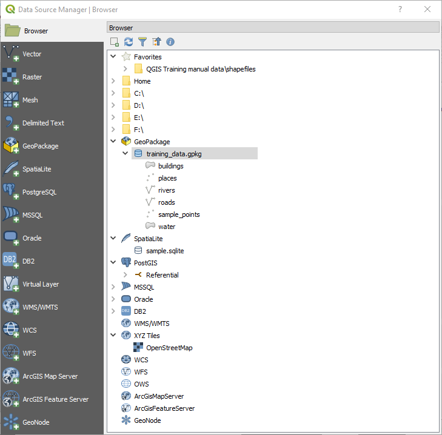
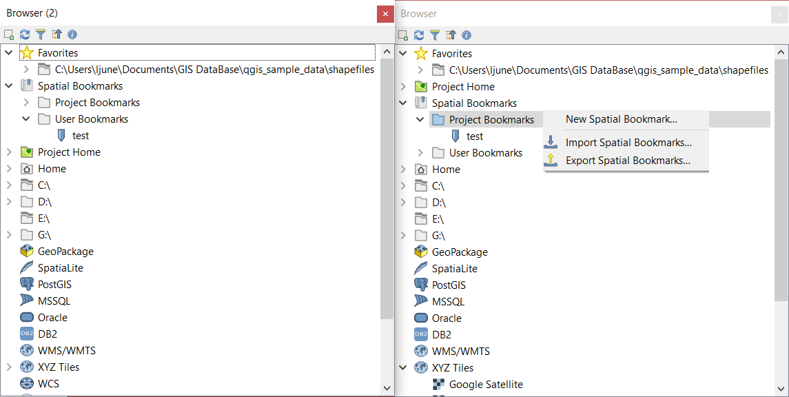
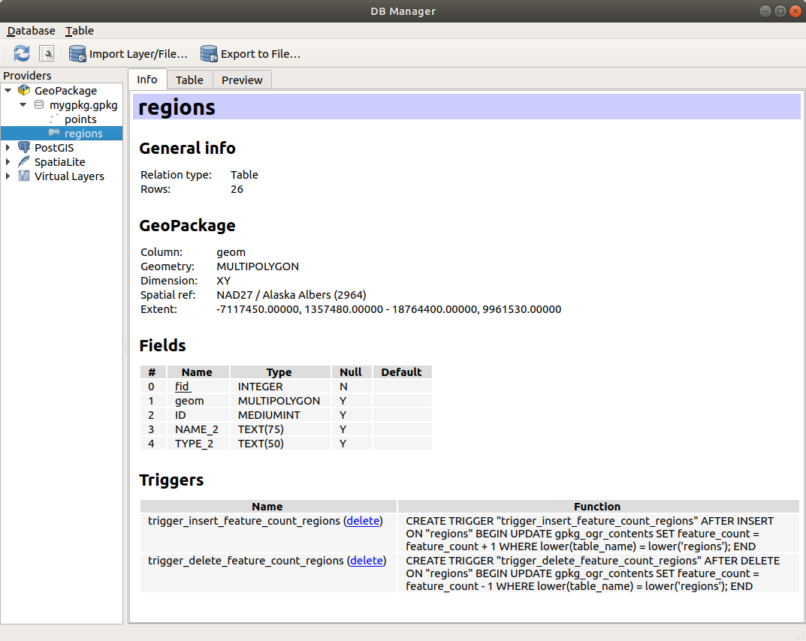
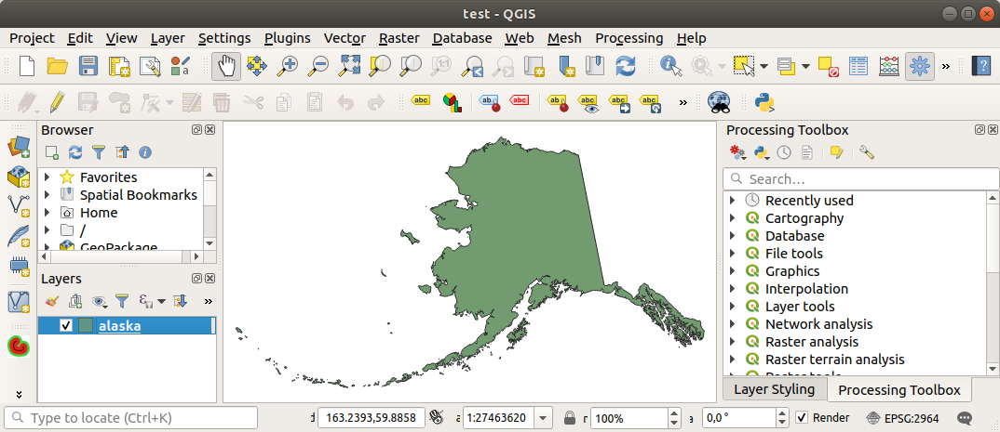
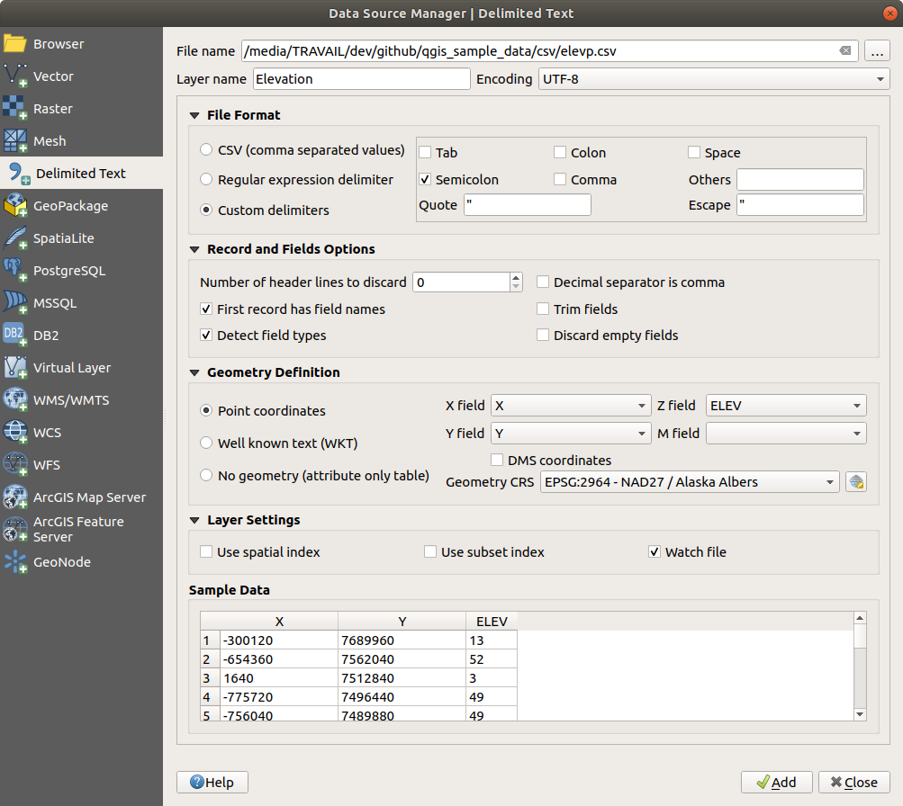
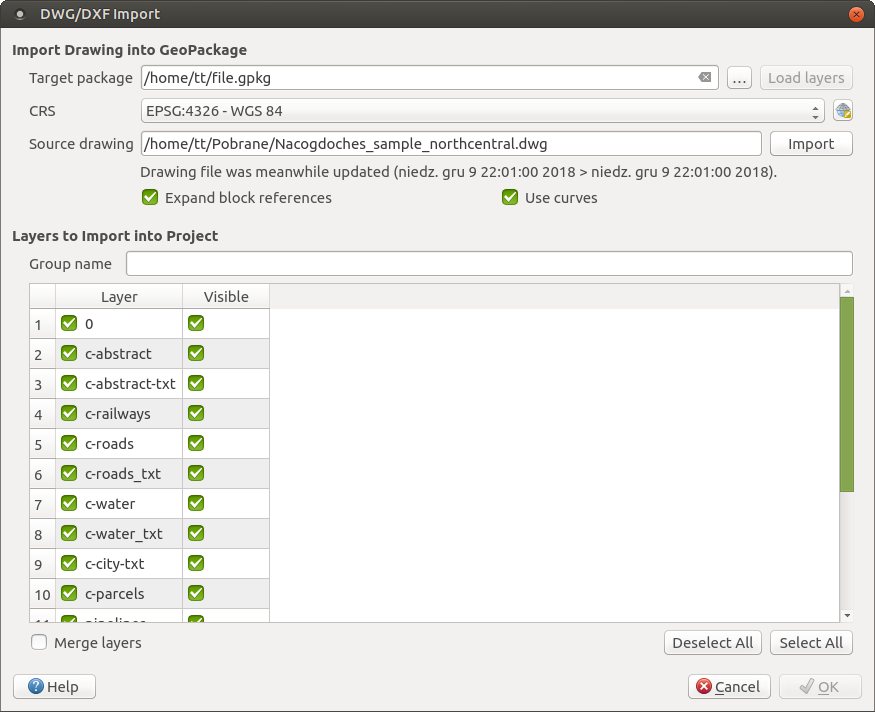
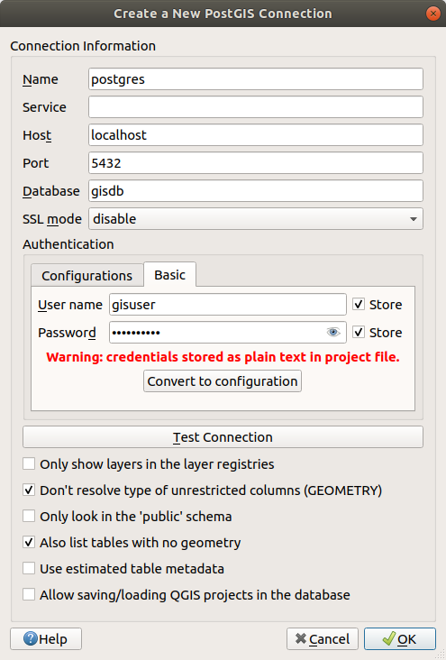
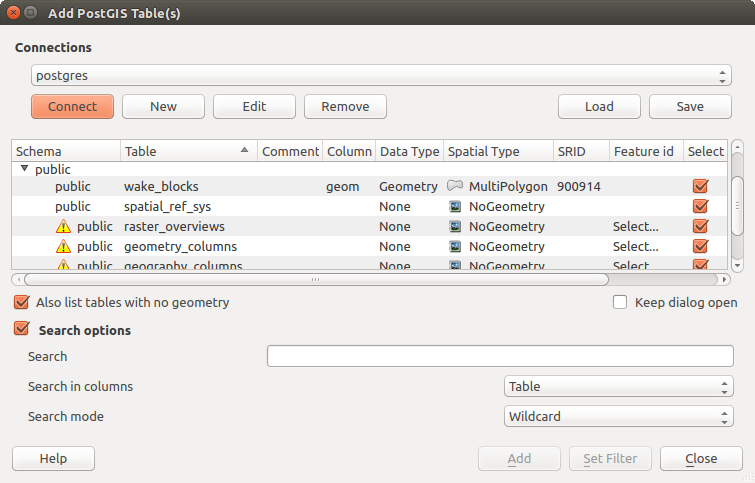

.. only:: html

.. index:: Vector, OGR, Raster, GDAL, Data, Format
.. index:: PostGreSQL, PostGIS, GeoPackage, SpatiaLite, GRASS, DXF
.. index:: ArcInfo Binary Grid, ArcInfo ASCII Grid, GeoTIFF, Erdas Imagine

.. _opening_data:

**************
 Opening Data
**************

.. only:: html

   .. contents::
      :local:

As part of an Open Source Software ecosystem, QGIS is built upon different
libraries that, combined with its own providers, offer capabilities to read
and often write a lot of formats:

* Vector data formats include ESRI formats (Shapefile, Geodatabase...),
  MapInfo and MicroStation file formats, AutoCAD DWG/DXF, GeoPackage, GeoJSON,
  GRASS, GPX, KML, Comma Separated Values, and many more...
  Read the complete list of `OGR vector supported formats
  <https://www.gdal.org/ogr_formats.html>`_.
* Raster data formats include ArcInfo Binary Grid, ArcInfo ASCII Grid, JPEG,
  GeoTIFF, ERDAS IMAGINE, MBTiles, R or Idrisi rasters, ASCII Gridded XYZ,
  GDAL Virtual, SRTM, Sentinel Data, and many more...
  Read the complete list of `raster supported formats
  <https://www.gdal.org/formats_list.html>`_.
* Database formats include PostgreSQL/PostGIS, SQLite/SpatiaLite, Oracle, DB2
  or MSSQL Spatial, MySQL...
* Support of web data services (WM(T)S, WFS, WCS, CSW, ArcGIS Servers...) is
  also handled by QGIS providers (see :ref:`working_with_ogc`).
* You can also read supported files from archived folders and use QGIS native
  formats such as virtual and memory layers.

As of the date of this document, more than 80 vector and 140 raster formats are
supported by the `GDAL/OGR <https://www.gdal.org/>`_ and QGIS native providers.

.. note::

   Not all of the listed formats may work in QGIS for various reasons. For
   example, some require external proprietary libraries, or the GDAL/OGR
   installation of your OS may not have been built to support the format you
   want to use. To have a list of available formats, run the command line
   ``ogrinfo --formats`` (for vector) or check :menuselection:`settings -->
   Options --> GDAL` menu (for raster) in QGIS.
   
.. let's use ogrinfo until a list of vector formats is provided in a (GDAL/)OGR tab

.. _datasourcemanager:

In QGIS, depending on the data format, there are different tools to open it,
mainly available in the :menuselection:`Layer --> Add Layer -->` menu
or from the :guilabel:`Manage Layers` toolbar (enabled through :menuselection:`View
--> Toolbars` menu).
However, all these tools point to a unique dialog, the :guilabel:`Data Source
Manager` dialog that you can directly open with the |dataSourceManager|
:sup:`Open Data Source Manager` button available on the :guilabel:`Data Source
Manager Toolbar` or by pressing :kbd:`Ctrl+L`. Indeed, the :guilabel:`Data Source
Manager` dialog offers a unified interface to open vector or raster file-based
data as well as databases or web services supported by QGIS. It can be set
modal or not with the |checkbox| :guilabel:`Modeless data source manager dialog`
in :menuselection:`Settings --> Options --> General` menu.

.. _figure_datasource_manager:

   QGIS Data Source Manager dialog

Beside this main entry point, you also have the |dbManager| :guilabel:`DB Manager`
plugin that offers advanced capabilities to analyze and manipulate connected
databases. More information on DB Manager capabilities are exposed in :ref:`dbmanager`.

There are also many other tools, native or third-party plugins, that help you open
dedicated data formats.

This chapter will describe only the tools provided by default in QGIS to load
data. It will mainly focus on the :guilabel:`Data Source Manager` dialog but
more than describing each tab, it will also explore the tools based on the data
provider or format specificities.

.. index:: Browse data, Add layers
.. _browser_panel:

The Browser Panel
=================

The :guilabel:`Browser` is one of the main ways to quickly and easily
add your data to projects. It's available as:

* a :guilabel:`Data Source Manager` tab, enabled pressing the
  |dataSourceManager| :sup:`Open Data Source Manager` button (:kbd:`Ctrl+L`);
* as a QGIS panel you can open from the menu :menuselection:`View --> Panels`
  (or |kde| :menuselection:`Settings --> Panels`) or by pressing :kbd:`Ctrl+2`.

In both cases, the :guilabel:`Browser` helps you navigate in your file system
and manage geodata, regardless the type of layer (raster, vector, table),
or the datasource format (plain or compressed files, database, web services).

To add a layer into a project, using the :guilabel:`Browser` interface:

#. Enable the :guilabel:`Browser` as described above.
   A browser tree with your file system, databases and web services is
   displayed. You may need to connect databases and web services before they appear
   (see dedicated sections).
#. Find the layer in the list.
#. Double-click its name or drag-and-drop it into the :ref:`map canvas
   <label_mapview>`. Your layer is now added to the :ref:`Layers panel
   <label_legend>` and can be viewed in the map canvas.

   .. tip:: **Open a QGIS project directly from the browser**

    You can also open a QGIS project directly from the Browser
    panel by double-clicking its name or by drag-and-drop into the map canvas.

Once a file is loaded, you can zoom around it using the map navigation tools.
To change the style of a layer, open the :guilabel:`Layer Properties` dialog
by double clicking on the layer name or by right-clicking on the name in the
legend and choosing :menuselection:`Properties` from the context menu. See
section :ref:`vector_style_menu` for more information on setting symbology of
vector layers.

At the top of the Browser panel, you find some icons that help you to:

* |addLayer| :sup:`Add Selected Layers`: you can also add data into the map
  canvas by selecting **Add selected layer(s)** from the layer's context menu;
* |draw| :sup:`Refresh` the browser tree;
* |filterMap| :sup:`Filter Browser` to search for specific data. Enter a search
  word or wildcard and the browser will filter the tree to only show paths to
  matching DB tables, filenames or folders -- other data or folders won't be
  displayed. See the Browser Panel(2) example on the figure_browser_panels_.
  The comparison can be case-sensitive or not. It can also be set to:

  * **normal**: return any item containing the search text;
  * using **wildcard(s)**: fine tune the search using ``?`` and/or ``*``
    characters to specify the position of the search text;
  * using a **regular expression**.

* |collapseTree| :sup:`Collapse All` the whole tree;
* |metadata| :sup:`Enable/disable properties widget`: when toggled on,
  a new widget is added at the bottom of the panel showing, if applicable,
  metadatas of the selected item.

Right-click an item in the browser tree helps you to:

* in case of file or table, display its metadata or open it in your project.
  Tables can even be renamed, deleted or truncated;
* in case of folder, bookmark it into your favourites, hide it from the browser
  tree. Hidden folders can be managed from the :menuselection:`Settings -->
  Options --> Data Sources` tab;
* create connection to databases or web servers;
* refresh, rename or delete schema.

You can also import files into databases or copy tables from one schema/database
to another one with a simple drag-and-drop. There is a second browser panel
available to avoid long scrolling while dragging. Just select the file and
drag-and-drop from one panel to the other.

.. _figure_browser_panels:

   QGIS Browser panels side-by-side

.. tip:: **Add layers to QGIS by simple drag-and-drop from your OS file browser**

   You can also add file(s) to the project by drag-and-dropping them from your
   operating system file browser to the :guilabel:`Layers Panel` or the map
   canvas.

.. index:: DB Manager

The DB Manager
==============

The :guilabel:`DB Manager` Plugin is another one of the main and native tools
to integrate and manage spatial database formats supported by
QGIS (PostGIS, SpatiaLite, GeoPackage, Oracle Spatial, MSSQL, DB2, Virtual
layers) in one user interface. It can be activated from the
:menuselection:`Plugins --> Manage and Install Plugins...` menu.

The |dbManager| :sup:`DB Manager` Plugin provides several features:

* connect to databases and display its structure and contents;
* preview tables of databases;
* add layers to map canvas, either by double-click or drag-and-drop;
* add layers to a database from the QGIS Browser or from another database;
* create and add output of SQL queries to the map canvas;
* create :ref:`virtual layers <vector_virtual_layers>`.

More information on DB Manager capabilities are exposed in :ref:`dbmanager`.

.. _figure_db_manager_bis:

   DB Manager dialog

Provider-based loading tools
=============================

Beside Browser Panel and DB Manager, the main tools provided by QGIS to add
layers regardless the format, you'll also find tools that are specific to data
providers.

.. note::

  Some :ref:`external plugins <plugins>` also propose tools to open specific
  format files in QGIS.

.. index:: Loading vector, Loading raster
.. index:: ODBC, OGDI, Esri Personal Geodatabase, MySQL
.. _loading_file:

Loading a layer from a file
---------------------------

To load a layer from a file, you can:

* for vector data (like Shapefile, Mapinfo or dxf layer), click on
  |addOgrLayer| :sup:`Add Vector Layer` toolbar button, select the
  :menuselection:`Layer --> Add Layer -->` |addOgrLayer|:guilabel:`Add Vector
  Layer` menu option or press :kbd:`Ctrl+Shift+V`.
  This will bring up a new window (see figure_vector_add_) from which you can
  check |radioButtonOn| :guilabel:`File` and click on :guilabel:`Browse`. You can
  also specify the encoding for the file if desired.

  .. _figure_vector_add:

  .. figure:: img/addvectorlayerdialog.png
     :align: center

     Add Vector Layer Dialog

* for raster layers, click on the |addRasterLayer| :sup:`Add Raster Layer` icon,
  select the :menuselection:`Layer --> Add Layer -->` |addRasterLayer|
  :guilabel:`Add Raster Layer` menu option or type :kbd:`Ctrl+Shift+R`.

That will bring up a standard open file dialog (see figure_vector_open_), which
allows you to navigate the file system and load a shapefile, a geotiff or other
supported data source. The selection box :guilabel:`Filter` |selectString|
allows you to preselect some supported file formats. Only the formats that have
been well tested appear in the list. Other untested formats can be loaded by
selecting ``All files (*.*)``.

.. _figure_vector_open:

.. figure:: img/shapefileopendialog.png
   :align: center

   Open an OGR Supported Vector Layer Dialog

Selecting a file from the list and clicking :guilabel:`Open` loads it into QGIS.
More than one layer can be loaded at the same time by holding down the
:kbd:`Ctrl` or :kbd:`Shift` key and clicking on multiple items in the dialog.
Figure_vector_loaded_ shows QGIS after loading the :file:`alaska.shp` file.

.. _figure_vector_loaded:

   QGIS with Shapefile of Alaska loaded

.. note::

 Because some formats like MapInfo (e.g., :file:`.tab`) or Autocad (:file:`.dxf`)
 allow mixing different types of geometry in a single file, loading such format
 in QGIS opens a dialog to select geometries to use in order to have one
 geometry per layer.

.. index:: ArcInfo Binary Coverage, Tiger Format, UK National Transfer Format
.. index:: US Census Bureau

Using the |addOgrLayer| :sup:`Add Vector Layer` tool:

* You can also load specific formats like ``ArcInfo Binary Coverage``,
  ``UK. National Transfer Format``, as well as the raw TIGER format of the
  ``US Census Bureau`` or ``OpenfileGDB``. To do that, you'd need to select
  |radioButtonOn| :guilabel:`Directory` as :guilabel:`Source type`. In this case
  a directory can be selected in the dialog after pressing :guilabel:`Browse`.
* With the |radioButtonOn| :guilabel:`Database` source type you can select an
  existing database connection or create one to the selected database type.
  Available database types are ``ODBC``, ``OGDI Vectors``, ``Esri Personal
  Geodatabase``, ``MySQL`` as well as ``PostgreSQL`` or ``MSSQL``.
    
  Pressing the :guilabel:`New` button opens the :guilabel:`Create a New OGR Database
  Connection` dialog whose parameters are among the ones you can find in
  :ref:`vector_create_stored_connection`.
  Pressing :guilabel:`Open` you can select from the available tables for example
  of the PostGIS enabled database.
* The last source type, |radioButtonOn| :guilabel:`Protocol`, enables to open
  data from the web using for example ``GeoJSON`` or ``CouchDB`` format. After
  selecting the type you have to fill URI of the source.

.. _tip_load_from_external_drive_OSX:

.. tip:: **Load layers and projects from mounted external drives on macOS**

   On macOS, portable drives that are mounted beside the primary hard drive
   do not show up as expected under :menuselection:`File --> Open...`.
   We are working on a more macOS-native open/save dialog to fix this.
   As a workaround, you can type ``/Volumes`` in the :guilabel:`File name` box
   and press :kbd:`Enter`. Then you can navigate to external drives and network
   mounts.

.. index:: CSV, Delimited text files
   see: Comma Separated Values; CSV
.. _vector_loading_csv:

Importing a delimited text file
-------------------------------

Delimited text file (e.g. :file:`.csv`, :file:`.txt`) can be loaded in QGIS
using the tools described above. However, loaded this way, it'll show up like a
simple table data. Sometimes, delimited text files can contain geometric data
you'd want to visualize; this is what the |addDelimitedTextLayer|:guilabel:`Add
Delimited Text Layer` is designed for.

Click the |dataSourceManager| :sup:`Open Data Source Manager` icon to open the
:guilabel:`Data Source Manager` dialog and enable the |addDelimitedTextLayer|
:guilabel:`Delimited Text` tab, as shown in figure_delimited_text_.

.. _figure_delimited_text:

   Delimited Text Dialog

First, select the file to import (e.g., :file:`qgis_sample_data/csv/elevp.csv`)
by clicking on the :guilabel:`Browse` button. In the :guilabel:`Layer name` field,
provide the name to use for the layer in the project (e.g., :file:`Elevation`).

File format
...........

Once the file is selected, QGIS attempts to parse the file with the most
recently used delimiter, trying to identify fields and rows. To enable QGIS to
properly parse the file, it is important to select the correct delimiter. You
can specify a delimiter by activating:

* |radioButtonOn|:guilabel:`CSV (comma separated values)` to use the comma character;
* |radioButtonOff|:guilabel:`Custom delimiters`, choosing among some predefined
  delimiters like ``comma``, ``space``, ``tab``, ``semicolon``...;
* or |radioButtonOff|:guilabel:`Regular expression delimiter` and entering text
  into the :guilabel:`Expression` field. For example, to change the delimiter to
  tab, use ``\t`` (this is a regular expression for the tab character).

Records and fields
..................

Other than settings to identify rows and fields in the data, some convenient
options can be used to tweak the data recognition:

* :guilabel:`Number of header lines to discard`: convenient when you want to
  avoid some lines to show in the import, either because those are blank lines
  or with another formatting.
* |checkbox|:guilabel:`First records has field names`: values in the first row
  of data are used as field names, otherwise QGIS adds a fields row of a type
  ``field_1``, ``field_2``...
* |checkbox|:guilabel:`Detect field types`: automatically recognizes the field
  type. If unchecked then all attributes are treated as text fields.
* |checkbox|:guilabel:`Decimal separator is comma`: if necessary, you can force
  a comma to be the decimal separator.
* |checkbox|:guilabel:`Trim fields`: allows you to trim leading and trailing
  spaces from fields.
* |checkbox|:guilabel:`Discard empty fields`.

As you set the parser properties, a sample data preview updates at the bottom
of the dialog.

Geometry definition
...................

Once the file is parsed, set :guilabel:`Geometry definition` to

* |radioButtonOn|:guilabel:`Point coordinates` and provide the :guilabel:`X
  field` and :guilabel:`Y field` if the layer is of point geometry type and
  contain such coordinate fields. If the coordinates are defined as
  degrees/minutes/seconds, activate the |checkbox|:guilabel:`DMS coordinates`
  checkbox;
* |radioButtonOn|:guilabel:`Well known text (WKT)` option if the spatial
  information is represented by WKT: select the :guilabel:`Geometry field`
  containing the WKT definition and choose the approriate :guilabel:`Geometry
  field` or let QGIS auto-detect it;
* If the file contains non-spatial data, activate |radioButtonOn| :guilabel:`No
  geometry (attribute only table)` and it will be loaded as an ordinary table.

Besides the features geometry information, you can also set the layer's
:guilabel:`Geometry CRS` using the |setProjection| :sup:`Select CRS` widget.

Layer settings
..............

Additionally, you can enable:

* |checkbox|:guilabel:`Use spatial index` to improve the performance of
  displaying and spatially selecting features;
* |checkbox|:guilabel:`Use subset index` to improve performance of :ref:`subset
  filters <vector_query_builder>` (when defined in the layer properties);
* |checkbox|:guilabel:`Watch file` to watch for changes to the file by other
  applications while QGIS is running.

At the end, click :guilabel:`OK` to add the layer to the map. In our example, a
point layer named ``Elevation`` is added to the project and behaves like any
other map layer in QGIS. However, this layer is the result of a query on the
:file:`.csv` source layer (hence, linked to it) and would require :ref:`to be
saved <general_saveas>` in order to get a spatial layer on disk.

.. _import_dxfdwg:

Importing a DXF or DWG file
---------------------------

:file:`DXF` and :file:`DWG` files can be added to QGIS by simple drag-and-drop
from the common
Browser Panel. You'll be prompted to select the sublayers you'd like to add
to the project. Layers are added with random style properties.

.. note:: DXF files containing several geometry types (point, line and/or
   polygon), the name of the layer will be made from
   *<filename.dxf> entities <geometry type>*.

To keep the dxf/dwg file structure and its symbology in QGIS, you may want to
use the dedicated :menuselection:`Project --> Import/Export --> Import Layers
from DWG/DXF...` tool which allows you to:

#. import elements from the drawing file into a GeoPackage database.
#. and add to the project any of the imported elements.

In the :guilabel:`DWG/DXF Import` dialog, to first import the drawing file
contents:

#. Input the location of the :guilabel:`Target package`, i.e. the new GeoPackage
   file that will store the data. If an existing file is provided, then it will be
   overwritten.
#. Specify the coordinate reference system of the data in the drawing file.
#. Check |checkbox| :guilabel:`Expand block references` to import the
   blocks in the drawing file as normal elements.
#. Check |checkbox| :guilabel:`Use curves` to promote the imported layers
   to a ``curved`` geometry type.
#. Use the :guilabel:`Import` button to select the DWG/DXF file to use (one per
   geopackage). The GeoPackage database will be automatically populated with the
   drawing file content. Depending on the size of the \*CAD file, this could
   take some time.

After the :file:`.dwg` or :file:`.dxf` data is imported into the GeoPackage
database the frame in the lower half of the dialog is populated with the list of
layers from the imported file. There you can select which layers to add to the
QGIS project:

#. At the top, set a :guilabel:`Group name` to group the drawing files in the
   project.
#. Check layers to show: Each selected layer is added to an ad hoc group which
   contains vector layers for the point, line, label and area features of the
   drawing layer. The style of each layer is setup so that it resembles the look
   it originally had in \*CAD.
#. Check whether layer should be visible at opening.
#. Alternatively using the |checkbox| :guilabel:`Merge layers` option places all
   layers in a single group.
#. Press :guilabel:`OK` to open the layers in QGIS.

.. _figure_dwg_dxf_import:

    
    Import dialog for DWG/DXF files

.. index:: OSM (OpenStreetMap)
.. _openstreetmap:

Importing OpenStreetMap Vectors
-------------------------------

In recent years, the OpenStreetMap project has gained popularity because in many
countries no free geodata such as digital road maps are available. The objective
of the OSM project is to create a free editable map of the world from GPS data,
aerial photography or local knowledge. To support this objective, QGIS
provides support for OSM data.

Using the :guilabel:`Browser Panel`, you can load a :file:`.osm` file to the
map canvas, in which case you'll get a dialog to select sublayers based on the
geometry type. The loaded layers will contain all the data of that geometry type
in the file and keep the :file:`osm` file data structure.

.. index:: Spatialite, SQLite
.. _label_spatialite:

SpatiaLite Layers
-----------------

|addSpatiaLiteLayer| The first time you load data from a SpatiaLite
database, begin by:

* clicking on the |addSpatiaLiteLayer| :sup:`Add SpatiaLite Layer` toolbar
  button;
* selecting the |addSpatiaLiteLayer| :menuselection:`Add SpatiaLite Layer...`
  option from the :menuselection:`Layer --> Add Layer` menu;
* or by typing :kbd:`Ctrl+Shift+L`.

This will bring up a window that will allow you either to connect to a
SpatiaLite database already known to QGIS, which you can choose from the
drop-down menu, or to define a new connection to a new database. To define a
new connection, click on :guilabel:`New` and use the file browser to point to
your SpatiaLite database, which is a file with a :file:`.sqlite` extension.

QGIS also supports editable views in SpatiaLite.

GPS
---

Loading GPS data in QGIS can be done using the core plugin: ``GPS Tools``.
Instructions are described in Section :ref:`plugin_gps`.

GRASS
-----

Working with GRASS vector data is described in Section :ref:`sec_grass`.

.. index:: Database tools, MSSQL Spatial
.. _db_tools:

Database related tools
----------------------

.. index:: Connecting to database
.. _vector_create_stored_connection:

Creating a stored Connection
............................

In order to read and write tables from the many database formats QGIS supports
you'll need to create a connection to that database. While :ref:`QGIS Browser
Panel <browser_panel>` is the simplest and recommanded way to connect and use
databases, QGIS provides other tools to connect to each
of them and load their tables:

* |addPostgisLayer| :menuselection:`Add PostGIS Layer...` or by typing
  :kbd:`Ctrl+Shift+D`;
* |addMssqlLayer| :menuselection:`Add MSSQL Spatial Layer` or by typing
  :kbd:`Ctrl+Shift+M`;
* |addOracleLayer| :menuselection:`Add Oracle Spatial Layer...` or by typing
  :kbd:`Ctrl+Shift+O`;
* |addDb2Layer| :menuselection:`Add DB2 Spatial Layer...` or by typing
  :kbd:`Ctrl+Shift+2`.

These tools are accessible either from the :guilabel:`Manage Layers Toolbar` or
the :menuselection:`Layer --> Add Layer -->` menu. Connecting to SpatiaLite
database is described at :ref:`label_spatialite`.

.. tip:: **Create connection to database from the QGIS Browser Panel**

   Select the corresponding database format in the Browser tree, right-click
   and choose connect will provide you with the database connection dialog.

Most of the connection dialogs follow a common basis that will be described
below using the PostGreSQL database tool as example. For additional settings
specific to other providers, you can find corresponding description at:

* :ref:`create_mssql_connection`;
* :ref:`create_oracle_connection`;
* :ref:`create_db2_connection`.

The first time you use a PostGIS data source, you must create a connection to a
database that contains the data. Begin by clicking the appropriate button as
exposed above, opening an :guilabel:`Add PostGIS Table(s)` dialog
(see figure_add_postgis_tables_).
To access the connection manager, click on the :guilabel:`New` button to display the
:guilabel:`Create a New PostGIS Connection` dialog.

.. _figure_new_postgis_connection:

   Create a New PostGIS Connection Dialog

The parameters required for a PostGIS connection are exposed below. For the
other database types, see their differences at :ref:`db_requirements`.

* **Name**: A name for this connection. It can be the same as *Database*.
* **Service**: Service parameter to be used alternatively to hostname/port (and
  potentially database). This can be defined in :file:`pg_service.conf`.
  Check the :ref:`pg-service-file` section for more details.
* **Host**: Name of the database host. This must be a resolvable host name
  such as would be used to open a TCP/IP connection or ping the host. If the
  database is on the same computer as QGIS, simply enter *localhost* here.
* **Port**: Port number the PostgreSQL database server listens on. The default
  port for PostGIS is ``5432``.
* **Database**: Name of the database.
* **SSL mode**: How the SSL connection will be negotiated with the server. Note
  that massive speed-ups in PostGIS layer rendering can be achieved by disabling
  SSL in the connection editor. The following options are available:

  * *Disable*: Only try an unencrypted SSL connection;
  * *Allow*: Try a non-SSL connection. If that fails, try an SSL connection;
  * *Prefer* (the default): Try an SSL connection. If that fails, try a
    non-SSL connection;
  * *Require*: Only try an SSL connection.

* **Username**: User name used to log in to the database.
* **Password**: Password used with *Username* to connect to the database.

  You can save any or both of the ``username`` and ``password`` parameters, in
  which case they will be used by default each time you need to connect to this
  database. If not saved, you'll be prompted to fill the missing credentials to
  connect to the database in next QGIS sessions; meanwhile the connection
  parameters you entered are stored in a temporary internal cache and returned
  whenever a username/password for the same database is requested, until you
  close the current QGIS process.

  .. warning:: **QGIS User Settings and Security**

   In the :guilabel:`Authentication` tab, saving **username** and **password**
   will keep unprotected credentials in the connection configuration. Those
   **credentials will be visible** if, for instance, you shared the project file
   with someone. Therefore, it's advisable to save your credentials in a
   *Authentication configuration* instead (:guilabel:`Configurations` tab -
   See :ref:`authentication_index` for more details) or in a service connection
   file (see :ref:`pg-service-file` for example).

Optionally, depending on the type of database, you can activate the following
checkboxes:

* |checkbox| :guilabel:`Only show layers in the layer registries`
* |checkbox| :guilabel:`Don't resolve type of unrestricted columns (GEOMETRY)`
* |checkbox| :guilabel:`Only look in the 'public' schema`
* |checkbox| :guilabel:`Also list tables with no geometry`
* |checkbox| :guilabel:`Use estimated table metadata`
* |checkbox| :guilabel:`Allow saving/loading QGIS projects in the database`:
  more details :ref:`here <saveprojecttodb>`

.. tip:: **Use estimated table metadata to speed up operations**

   When initializing layers, various queries may be needed to establish the
   characteristics of the geometries stored in the database table. When the
   :guilabel:`Use estimated table metadata` option is checked, these queries
   examine only a sample of the rows and use the table statistics, rather than
   the entire table. This can drastically speed up operations on large datasets,
   but may result in incorrect characterization of layers (eg. the feature count
   of filtered layers will not be accurately determined) and may even cause
   strange behaviour in case columns that are supposed to be unique actually
   are not.

Once all parameters and options are set, you can test the connection by
clicking on the :guilabel:`Test Connection` button or apply it hitting :guilabel:`OK`.
From the :guilabel:`Add PostGIS Table(s)`, click now on :guilabel:`Connect` and the
dialog is filled with tables from the selected database (as shown in
figure_add_postgis_tables_).

.. _db_requirements:

Particular Connection requirements
..................................

Because of database type particularities, provided options are all the same for
all the databases. Below are exposed these connection specificities.

.. _pg-service-file:

PostgreSQL Service connection file
^^^^^^^^^^^^^^^^^^^^^^^^^^^^^^^^^^

The service connection file allows PostgreSQL connection parameters to be
associated with a single service name. That service name can then be specified
by a client and the associated settings will be used.

It's called :file:`.pg_service.conf` under \*nix systems (GNU/Linux, macOS etc.)
and :file:`pg_service.conf` on Windows.

The service file looks like::

 [water_service]
 host=192.168.0.45
 port=5433
 dbname=gisdb
 user=paul
 password=paulspass

 [wastewater_service]
 host=dbserver.com
 dbname=water
 user=waterpass

.. note:: There are two services in the above example: ``water_service``
  and ``wastewater_service``. You can use these to connect from QGIS,
  pgAdmin etc. by specifying only the name of the service you want to
  connect to (without the enclosing brackets).
  If you want to use the service with ``psql`` you need to do something
  like ``export PGSERVICE=water_service`` before doing your psql commands.

  You can find all the parameters `here
  <https://www.postgresql.org/docs/current/static/libpq-connect.html#LIBPQ-PARAMKEYWORDS>`_

.. note:: If you don't want to save the passwords in the service file you can
  use the `.pg_pass <https://www.postgresql.org/docs/current/static/libpq-pgpass.html>`_
  option.

On \*nix operating systems (GNU/Linux, macOS etc.) you can save the
:file:`.pg_service.conf` file in the user's home directory and
the PostgreSQL clients will automatically be aware of it.
For example, if the logged user is ``web``, :file:`.pg_service.conf` should
be saved in the :file:`/home/web/` directory in order to directly work (without
specifying any other environment variables).

You can specify the location of the service file by creating a ``PGSERVICEFILE``
environment variable (e.g. run the ``export PGSERVICEFILE=/home/web/.pg_service.conf``
command under your \*nix OS to temporarily set the ``PGSERVICEFILE`` variable)

You can also make the service file available system-wide (all users) either by
placing the :file:`.pg_service.conf` file at ``pg_config --sysconfdir`` or by
adding the ``PGSYSCONFDIR`` environment variable to specify the directory
containing the service file. If service definitions with the same name exist
in the user and the system file, the user file takes precedence.

.. warning::

  There are some caveats under Windows:

  * The service file should be saved as :file:`pg_service.conf`
    and not as :file:`.pg_service.conf`.
  * The service file should be saved in Unix format in order to work.
    One way to do it is to open it with `Notepad++ <https://notepad-plus-plus.org/>`_
    and :menuselection:`Edit --> EOL Conversion --> UNIX Format --> File save`.
  * You can add environmental variables in various ways; a tested one, known to
    work reliably, is :menuselection:`Control Panel --> System and Security -->
    System --> Advanced system settings --> Environment Variables` adding
    ``PGSERVICEFILE`` and the path of the type :file:`C:\\Users\\John\\pg_service.conf`
  * After adding an environment variable you may also need to restart the computer.

.. _create_oracle_connection:

Connecting to Oracle Spatial
^^^^^^^^^^^^^^^^^^^^^^^^^^^^

The spatial features in Oracle Spatial aid users in managing geographic and
location data in a native type within an Oracle database.
In addition to some of the options in :ref:`vector_create_stored_connection`,
the connection dialog proposes:

* **Database**: SID or SERVICE_NAME of the Oracle instance;
* **Port**: Port number the Oracle database server listens on. The default
  port is ``1521``;
* **Workspace**: Workspace to switch to.

Optionally, you can activate following checkboxes:

* |checkbox| :guilabel:`Only look in metadata table`: restricts the displayed
  tables to those that are in the ``all_sdo_geom_metadata`` view. This can
  speed up the initial display of spatial tables.
* |checkbox| :guilabel:`Only look for user's tables`: when searching for spatial
  tables, restricts the search to tables that are owned by the user.
* |checkbox| :guilabel:`Also list tables with no geometry`: indicates that
  tables without geometry should also be listed by default.
* |checkbox| :guilabel:`Use estimated table statistics for the layer metadata`:
  when the layer is set up, various metadata are required for the Oracle table.
  This includes information such as the table row count, geometry type and
  spatial extents of the data in the geometry column. If the table contains a
  large number of rows, determining this metadata can be time-consuming. By
  activating this option, the following fast table metadata operations are
  done: Row count is determined from ``all_tables.num_rows``. Table extents
  are always determined with the SDO_TUNE.EXTENTS_OF function, even if a layer
  filter is applied. Table geometry is determined from the first 100
  non-null geometry rows in the table.
* |checkbox| :guilabel:`Only existing geometry types`: only lists the existing
  geometry types and don't offer to add others.
* |checkbox| :guilabel:`Include additional geometry attributes`.

.. _tip_ORACLE_Spatial_layers:

.. tip:: **Oracle Spatial Layers**

   Normally, an Oracle Spatial layer is defined by an entry in the
   **USER_SDO_METADATA** table.

   To ensure that selection tools work correctly, it is recommended that your
   tables have a **primary key**.

.. _create_db2_connection:

Connecting to DB2 Spatial
^^^^^^^^^^^^^^^^^^^^^^^^^

In addition to some of the options described in
:ref:`vector_create_stored_connection`, the connection to a DB2 database (see
:ref:`label_db2_spatial` for more information) can be specified using either a
Service/DSN name defined to ODBC or using the driver, host and port information.

An ODBC **Service/DSN** connection requires the service name defined to ODBC.

A driver/host/port connection requires:

* **Driver**: Name of the DB2 driver. Typically this would be IBM DB2 ODBC DRIVER.
* **DB2 Host**: Name of the database host. This must be a resolvable host name
  such as would be used to open a TCP/IP connection or ping the host. If the
  database is on the same computer as QGIS, simply enter *localhost* here.
* **DB2 Port**: Port number the DB2 database server listens on. The default
  DB2 LUW port is ``50000``. The default DB2 z/OS port is ``446``.

.. _tip_db2_Spatial_layers:

.. tip:: **DB2 Spatial Layers**

   A DB2 Spatial layer is defined by a row in the **DB2GSE.ST_GEOMETRY_COLUMNS**
   view.

.. note::

  In order to work effectively with DB2 spatial tables in QGIS, it is important
  that tables have an INTEGER or BIGINT column defined as PRIMARY KEY and if new
  features are going to be added, this column should also have the GENERATED
  characteristic.

  It is also helpful for the spatial column to be registered with a specific
  spatial reference identifier (most often ``4326`` for WGS84 coordinates).
  A spatial column can be registered by calling the ``ST_Register_Spatial_Column``
  stored procedure.

.. _create_mssql_connection:

Connecting to MSSQL Spatial
^^^^^^^^^^^^^^^^^^^^^^^^^^^

In addition to some of the options in :ref:`vector_create_stored_connection`,
creating a new MSSQL connection dialog proposes you to fill a **Provider/DSN**
name. You can also display available databases.

.. _vector_loading_database:

Loading a Database Layer
........................

Once you have one or more connections defined to a database (see section
:ref:`vector_create_stored_connection`), you can load layers from it.
Of course, this requires having available data. See e.g. section
:ref:`vector_import_data_in_postgis` for a discussion on importing data into a
PostGIS database.

To load a layer from a database, you can perform the following steps:

#. Open the "Add <database> table(s)" dialog
   (see :ref:`vector_create_stored_connection`).
#. Choose the connection from the drop-down list and click :guilabel:`Connect`.
#. Select or unselect |checkbox| :guilabel:`Also list tables with no geometry`.
#. Optionally, use some |checkbox| :guilabel:`Search Options` to reduce the
   list of tables to those matching your search. You can also set this option
   before you hit the :guilabel:`Connect` button, speeding this way the database
   fetching.
#. Find the layer(s) you wish to add in the list of available layers.
#. Select it by clicking on it. You can select multiple layers by holding
   down the :kbd:`Shift` key while clicking.
#. If applicable, use the :guilabel:`Set Filter` button (or double-click the layer)
   to start the :guilabel:`Query Builder` dialog (See section
   :ref:`vector_query_builder`) and define which features to load from the
   selected layer. The filter expression appears in the ``sql`` column.
   This restriction can be removed or edited in the :menuselection:`Layer
   Properties --> General --> Provider Feature Filter` frame.
#. The checkbox in the ``Select at id`` column that is activated by default
   gets the features ids without the attributes and speeds in most cases the
   data loading.
#. Click on the :guilabel:`Add` button to add the layer to the map.

.. _figure_add_postgis_tables:

   Add PostGIS Table(s) Dialog

.. tip:: **Use the Browser Panel to speed up loading of database table(s)**

  Adding DB tables from their ad hoc tab of the :guilabel:`Data Source Manager`
  dialog to QGIS may sometimes be time consuming as QGIS fetches
  statistics and properties (e.g. geometry type and field, CRS, number of features)
  of each table beforehand.
  To avoid this, once :ref:`the connection is set <vector_create_stored_connection>`,
  it's better to use the :ref:`Browser Panel <browser_panel>` or the :ref:`DB Manager
  <dbmanager>` to drag and drop the database tables in the map canvas.

QGIS Custom formats
===================

QGIS proposes two custom formats you can load in the application using their own
loading tool:

* Temporary Scratch Layer: a memory layer that is bound to the project it's
  opened with (see :ref:`vector_new_scratch_layer` for more information)
* Virtual Layers: a layer resulting from a query on other layer(s)
  (see :ref:`vector_virtual_layers` for more information)

Connecting to web services
==========================

With QGIS you can have access to different types of OGC web services (WM(T)S,
WFS(-T), CSW ...). Thanks to QGIS Server, you can also publish these services.
Description of these capabilities and how-to are provided in chapter
:ref:`sec_ogc`.

.. Substitutions definitions - AVOID EDITING PAST THIS LINE
   This will be automatically updated by the find_set_subst.py script.
   If you need to create a new substitution manually,
   please add it also to the substitutions.txt file in the
   source folder.

.. |addDb2Layer| image:: /static/common/mActionAddDb2Layer.png
   :width: 1.5em
.. |addDelimitedTextLayer| image:: /static/common/mActionAddDelimitedTextLayer.png
   :width: 1.5em
.. |addLayer| image:: /static/common/mActionAddLayer.png
   :width: 1.5em
.. |addMssqlLayer| image:: /static/common/mActionAddMssqlLayer.png
   :width: 1.5em
.. |addOgrLayer| image:: /static/common/mActionAddOgrLayer.png
   :width: 1.5em
.. |addOracleLayer| image:: /static/common/mActionAddOracleLayer.png
   :width: 1.5em
.. |addPostgisLayer| image:: /static/common/mActionAddPostgisLayer.png
   :width: 1.5em
.. |addRasterLayer| image:: /static/common/mActionAddRasterLayer.png
   :width: 1.5em
.. |addSpatiaLiteLayer| image:: /static/common/mActionAddSpatiaLiteLayer.png
   :width: 1.5em
.. |checkbox| image:: /static/common/checkbox.png
   :width: 1.3em
.. |collapseTree| image:: /static/common/mActionCollapseTree.png
   :width: 1.5em
.. |dataSourceManager| image:: /static/common/mActionDataSourceManager.png
   :width: 1.5em
.. |dbManager| image:: /static/common/dbmanager.png
   :width: 1.5em
.. |draw| image:: /static/common/mActionDraw.png
   :width: 1.5em
.. |filterMap| image:: /static/common/mActionFilterMap.png
   :width: 1.5em
.. |kde| image:: /static/common/kde.png
   :width: 1.5em
.. |metadata| image:: /static/common/metadata.png
   :width: 1.5em
.. |radioButtonOff| image:: /static/common/radiobuttonoff.png
   :width: 1.5em
.. |radioButtonOn| image:: /static/common/radiobuttonon.png
   :width: 1.5em
.. |selectString| image:: /static/common/selectstring.png
   :width: 2.5em
.. |setProjection| image:: /static/common/mActionSetProjection.png
   :width: 1.5em
