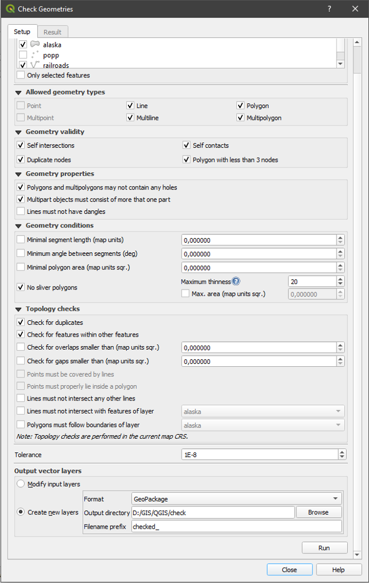

.. only:: html

   |updatedisclaimer|

.. index:: Digitizing, Topology, Geometry validity, Errors
   single: Plugins; Geometry checker

.. _geometry_checker:

Geometry Checker Plugin
=======================

Geometry Checker is a powerful core plugin to check and fix the geometry
validity of a layer. It is available from the :menuselection:`Vector -->`
|geometryChecker| :menuselection:`Geometry Checker` menu.

The :guilabel:`Geometry Checker` dialog show different grouped settings in the
first tab (:guilabel:`Setup`):

* :guilabel:`Input vector layers`: to select the layers to check. A
  |checkbox| :guilabel:`Only selected features` checkbox can filter the
  geometry to the one selected.
* :guilabel:`Allowed geometry types`: to allow only some geometry types
  like point, multipoint, line, multiline, polygon and multipolygon.
* :guilabel:`Geometry validity`: depending on geometry types, the user can
  choose |checkbox| :guilabel:`Self intersections`, |checkbox|
  :guilabel:`Duplicate nodes`, |checkbox| :guilabel:`Self contacts`
  and |checkbox| :guilabel:`Polygon with less than 3 nodes`.
* :guilabel:`Geometry properties`: depending on geometry types, the user can
  choose |checkbox| :guilabel:`Polygons and multipolygons may not contain any
  holes`, |checkbox| :guilabel:`Multipart objects must consist of more than one
  part` and |checkbox| :guilabel:`Lines must not have dangles`.
* :guilabel:`Geometry conditions`: user can add some condition to validate the
  geometries with a minimal segment length, a minimum angle between segment,
  a minimal polygon area and sliver polygons detection.
* :guilabel:`Topology checks`: depending on geometry types, the user can choose
  |checkbox| :guilabel:`Checks for duplicates`, |checkbox| :guilabel:`Checks
  for features within other features`, |checkbox| :guilabel:`Checks for
  overlaps smaller than` a number |selectNumber|, |checkbox| :guilabel:`Checks
  for gaps smaller than` a number |selectNumber|, |checkbox| :guilabel:`Points
  must be covered by lines`, |checkbox| :guilabel:`Points must properly lie
  inside a polygon`, |checkbox| :guilabel:`Lines must not intersect any other
  lines`, |checkbox| :guilabel:`Lines must not intersect with features of
  layer` |selectString|, |checkbox| :guilabel:`Polygons must follow boundaries
  of layer` |selectString|.
* :guilabel:`Tolerance`: you can define here the tolerance for the check.
* :guilabel:`Output vector layer` gives the choice to the user how get the
  result between modify the current layer and create a new layer.

After you are happy with the configuration, you can click on the **[Run]**
button.

.. _figure_geometry_checker:

   The Geometry Checker Plugin

The *Geometry Checker Plugin* can find the following errors:

* Self intersections: a polygon with a self intersection,
* Duplicate nodes: two duplicates nodes in a segment
* Holes: hole in a polygon,
* Segment length: a segment length lower than a threshold,
* Minimum angle: two segments with an angle lower than a threshold,
* Minimum area: polygon area lower than a threshold,
* Silver polygon: this error come from very small polygon (with small area) with
  a large perimeter,
* Duplicates features,
* Feature within feature,
* Overlaps: polygon overlapping,
* Gaps: gaps between polygons

The following figure shows the different checks made by the plugin.

.. _figure_geometry_checker_options:

   The Differents checks supported by the plugin

The results appear in the second tab (:guilabel:`Result`) and as an overview
layer of the errors in the canvas (its name has the default prefix
:file:`checked_`).
A table list the :guilabel:`Geometry check result` with one error by row and
columns containing: the layer name, an ID, the error type, then the coordinates
of the error, a value (depending on the type of the error) and finally the
resolution column which indicates the resolution of the error.
At the bottom of this table, you can **[Export]** the error into different file
formats. You also have a counter with the number of total errors and fixed ones.

You can select a row to see the localisation of the error. You can change this
behaviour by selecting another action between |radioButtonOn| :guilabel:`Error`
(default), |radioButtonOff| :guilabel:`Feature`, |radioButtonOff|
:guilabel:`Don't move`, and |checkbox| :guilabel:`Highlight contour of selected
features`.

Below the zoom action when clicking on the table row, you can:
|featureInTable| :guilabel:`Show selected features in attribute table`,
|success| :guilabel:`Fix selected errors using default resolution` and
|success| |options| :guilabel:`Fix selected errors, prompt for resolution
method`.
The default action could be changed with the last icon |settings|
:guilabel:`Error resolution settings`: you will see a window to choose the
resolution's method among which:

* Merge with neighboring polygon with longest shared edge,
* Merge with neighboring polygon with largest area,
* Merge with neighboring polygon with identical attribute value, if any, or
leave as is
* Delete feature
* No action

For some type of errors, you can change the default action between some
specific action or :guilabel:`No action`.

.. tip:: **Fix multiple errors**

   You can fix multiple errors by selecting more than one row in the table with
   the *CTRL + click* action.

Finally, you can choose which :guilabel:`attribute to use when merging features
by attribute value`.

.. Substitutions definitions - AVOID EDITING PAST THIS LINE
   This will be automatically updated by the find_set_subst.py script.
   If you need to create a new substitution manually,
   please add it also to the substitutions.txt file in the
   source folder.

.. |checkbox| image:: /static/common/checkbox.png
   :width: 1.3em
.. |featureInTable| image:: /static/common/mActionFromSelectedFeature.png
   :width: 1em
.. |geometryChecker| image:: /static/common/geometrychecker.png
   :width: 1.5em
.. |options| image:: /static/common/mActionOptions.png
   :width: 1em
.. |radioButtonOff| image:: /static/common/radiobuttonoff.png
.. |radioButtonOn| image:: /static/common/radiobuttonon.png
.. |selectNumber| image:: /static/common/selectnumber.png
   :width: 2.8em
.. |selectString| image:: /static/common/selectstring.png
   :width: 2.5em
.. |success| image:: /static/common/mIconSuccess.png
   :width: 1em
.. |updatedisclaimer| replace:: :disclaimer:`Docs in progress for 'QGIS testing'. Visit http://docs.qgis.org/2.18 for QGIS 2.18 docs and translations.`
